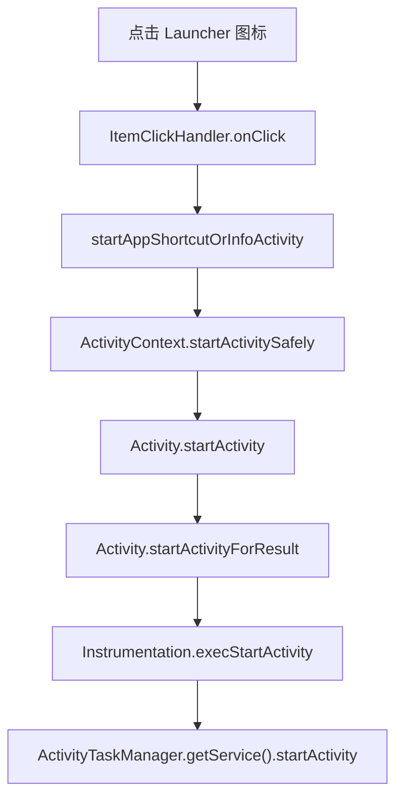

```mermaid
graph TD
    A["点击 Launcher 图标"]
    B["ItemClickHandler.onClick"]
    C["startAppShortcutOrInfoActivity"]
    D["ActivityContext.startActivitySafely"]
    E["Activity.startActivity"]
    F["Activity.startActivityForResult"]
    G["Instrumentation.execStartActivity"]
    H["ActivityTaskManager.getService().startActivity"]

    A --> B --> C --> D --> E --> F --> G --> H
```