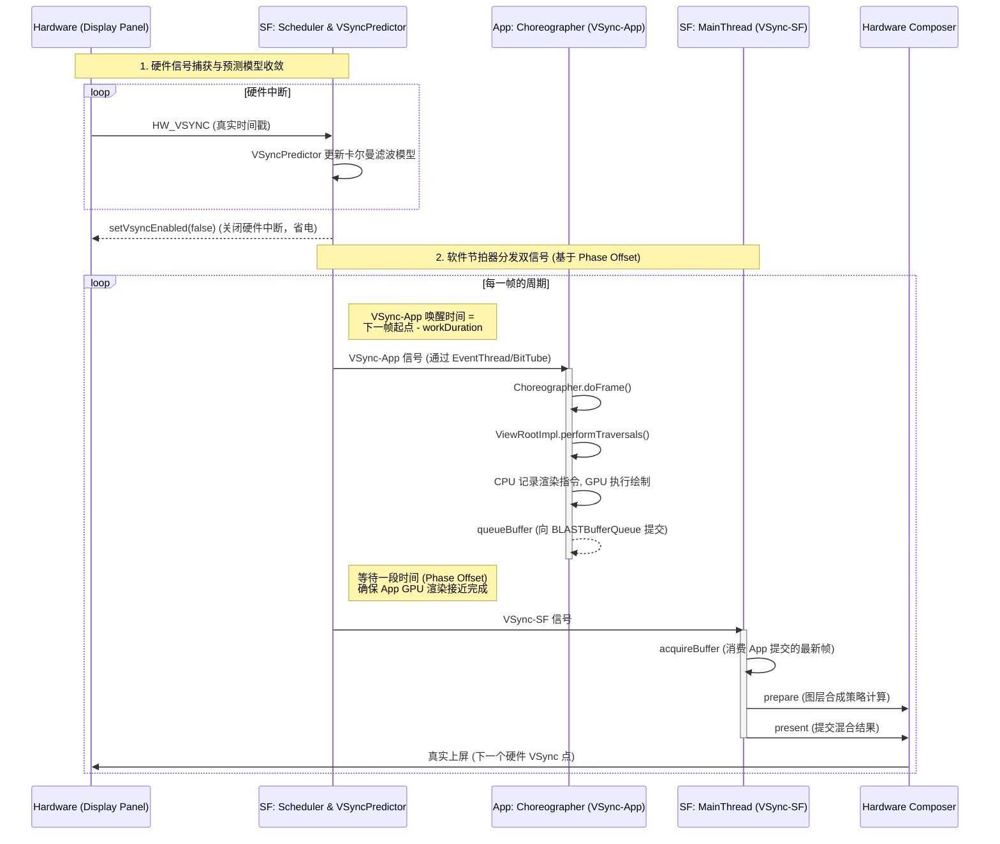

# Android 13 VSync 流程

## 1. VSync 的硬件起源与软件重建

Android 显示系统的本质可以从“时钟驱动 + 分层调度 + 硬件执行”三个维度来理解。

**这三个维度的具体含义**：

1. **时钟驱动**：整个系统不是由 App 主动发起的，而是被动由底层屏幕的“心跳”（VSync 信号）像节拍器一样推着往前走的。
2. **分层调度**：操作系统把单一的硬件节拍，拆解、延后、分配给不同的软件模块（比如提前让 App 渲染，稍后让系统合成），让它们在时间轴上错开，形成高效的流水线。
3. **硬件执行**：软件层只负责“排兵布阵”（例如 App 里的 `onMeasure/onLayout` 算出了按钮的位置大小，SurfaceFlinger 算出了状态栏和桌面应该怎么叠放），这些纯 CPU 计算只生成了“指令”或“坐标矩阵”。真正干脏活累活的——把成百上千万个像素点的 RGB 颜色数据从内存搬运出来、做半透明 Alpha 混合，最后把电信号打到屏幕发光二极管上的，是底层的专用硬件芯片：
   - **GPU (图形处理器)**：擅长做 3D 渲染和复杂的透明度混合。当图层太多或有特效时，SurfaceFlinger 会调用 GPU 将多个图层先画成一张大图。
   - **HWC (Hardware Composer 硬件合成器芯片，集成在 SoC 的 Display Controller 中)**：擅长做简单的图层直接叠加（Overlay）。如果只是全屏看视频，HWC 可以不惊动 GPU，直接把视频图层和状态栏图层在硬件通道里“压”在一起送给屏幕，极其省电。
   - **【补充链路闭环】从触发到上屏的完整接力赛**：
     1. **起点（App）**：用户手指滑动屏幕，触发 App 主线程（UI Thread）。App 在 `ViewRootImpl.performTraversals()` 触发的 `onDraw` 阶段，并不是真的在“画”像素。它是调用 Android 的硬件加速渲染引擎（HWUI），通过 `RecordingCanvas` 将要画的文字、图片转化为底层的 OpenGL/Vulkan API **渲染指令**。
        > **HWUI 是什么？和 HWC 有什么关系？** 
        > HWUI（Hardware UI）是一个运行在 **App 进程**中的纯软件 C++ 库（`libhwui.so`），它是 Android 的 2D 渲染引擎。它的作用是把 Java 层的 Canvas 绘制调用（如 `drawRect`、`drawText`）翻译成底层的 GPU 指令。**HWUI 和 HWC 没有任何关系**：HWUI 是 App 里负责生成画图指令的“翻译官”，而 HWC 是最底层负责图层叠加上屏的“硬件设备”。
        > **如何理解渲染指令与流程串联？** 渲染指令本质上是“施工图纸”和“数学描述”，比如“在坐标 (10, 20) 之间用给定的 Shader 画红色的矩形”。在 UI 线程中，这些指令被打包成一棵 `DisplayList` 树，然后 UI 线程会将这棵树**同步给同一 App 进程内专门的渲染线程（RenderThread）**。此时，没有任何真实的像素产生。
     2. **接力（GPU 渲染 App 画面）**：App 的 `RenderThread` 拿到 `DisplayList` 后，将其转化为 GPU 能懂的绘制命令（Draw Call），并通过 OpenGL/Vulkan 驱动发给 GPU 硬件。GPU 拥有海量的并行计算核心，它开始执行真正的“施工”：
        > **“画好”到底是什么意思？为什么写到共享内存中？** 
        > GPU 会执行**光栅化（Rasterization）**和**片段着色（Fragment Shading）**，将图纸上抽象的“几何坐标”，逐个转化为屏幕对应物理位置的真实彩色像素点。
        > 最终，GPU 会把这数百万个像素点的 ARGB 颜色值，物理地写入到系统分配的一块**共享内存（GraphicBuffer）**中。**为什么要用共享内存？** 因为图像数据极其庞大（一帧 1080P 画面约 8MB），如果在 App、SurfaceFlinger、HWC 进程之间来回拷贝数据，CPU 瞬间就会卡死。通过底层（ION / DMA-BUF）分配的这块内存，App 进程、GPU、SurfaceFlinger 乃至 HWC 硬件可以直接通过物理地址访问，实现**跨进程零拷贝**。
        > 当 GPU 执行完这一帧的所有绘制指令，并发出一个**硬件同步栅栏信号（Sync Fence）**时，就意味着这块内存（这帧画面）彻底“画好”了。
     3. **中转（SurfaceFlinger 介入）**：App 画完后，通知 SurfaceFlinger。SurfaceFlinger 的主线程醒来，开始计算当前屏幕上有哪些窗口（比如状态栏、桌面、App）。
     4. **决策（HWC 判断）**：SurfaceFlinger 把所有窗口的属性（位置、大小、是否有透明度）丢给 HWC 的硬件驱动去判断。
        > **为什么 HWC 不能处理所有情况？和 GPU 的具体区别是什么？HWC 是纯硬件吗？**
        > **HWC 的本质**：它**绝对是纯硬件**，它是 SoC（比如骁龙芯片）里面被称为 Display Controller（显示控制器）的物理电路模块。HWC (Hardware Composer) 只是 Android 对这个硬件的软件驱动抽象层。
        > **原理与区别**：
        > - **HWC（专用电路 ASIC）**：它就像流水线上的“打包机”，只负责最末端的简单组装。它的硬件内部只有几个固定的通道（Overlay Planes / Pipes，通常只有 4-8 个）。它的原理是：在扫描像素送往屏幕的最后一瞬间，直接从不同图层（比如视频层、状态栏层）的物理内存同时拉取数据，做极简的直接叠加。它的优势是**功耗极低、零延迟、极高带宽利用率**；劣势是**极其死板**，只要遇到超过通道数量的图层、高斯模糊（Blur）、复杂的圆角裁剪（Clip），它固化的物理电路根本没有能力计算。
        > - **GPU（通用图形处理器）**：它是一台拥有几百上千个可编程流处理器的“超级并行计算机”。它可以执行任何复杂的着色器程序（Shader）和复杂的数学矩阵运算。当 HWC 发现自己算不了时，只能退回（Fallback）给 GPU。GPU 会把所有图层作为输入纹理，经过复杂的并行计算，最终合成出**一张**全新的单层大图，再把这张大图喂给 HWC（此时 HWC 只需要用 1 个通道直接透传这张大图即可，这在 Android 中被称为 Client Composition）。
        > **为什么不全部使用 GPU？（功耗与带宽考量）**
        > GPU 计算虽然强大，但它工作时极其**耗电（Power Hungry）**，且需要反复读取各个图层的内容并在显存中写回一张完整的合成图，这会造成巨大的**内存带宽开销（Memory Bandwidth）**。而 HWC 直接在将数据送给显示面板的最后一瞬间“顺手”进行硬件通道上的叠加（Zero-copy），不需要额外的显存读写操作。如果你在看视频或者阅读静态文本，用 GPU 每秒 60 次重新合成整张屏幕的图层，手机电池很快就会耗尽。这就是为什么 Android 一直在尽最大可能让 HWC（Display Controller）处理所有叠加，只有迫不得已才叫醒 GPU。
     5. **终局（GPU + HWC 协作上屏）**：SurfaceFlinger 听从 HWC 的建议，先调 GPU 把复杂的部分画成一张“中间图”。最后，SurfaceFlinger 告诉 HWC 驱动：“准备好了，提交（Present）！” HWC 芯片在下一个硬件 VSync 到来时，准时把最终的像素数据推给物理屏幕面板（Display Panel）点亮发光二极管。至此，一次刷新彻底完成。
     
     **一句话总结此链路**：App 产出图纸（指令），GPU 负责施工（画像素），SurfaceFlinger 负责包工头调度，HWC 负责最终验收拼接并送上屏幕。
     
     ```mermaid
     sequenceDiagram
         participant App as App (CPU/指令)
         participant GPU as GPU (画像素)
         participant SF as SurfaceFlinger (调度)
         participant HWC as HWC (硬件合成/上屏)
         participant Panel as Display Panel
         
         App->>GPU: 1. 发送 OpenGL/Vulkan 渲染指令
         activate GPU
         GPU->>GPU: 2. 光栅化计算，填入 GraphicBuffer (画好)
         GPU-->>SF: 3. 通知画完了 (queueBuffer)
         deactivate GPU
         activate SF
         SF->>HWC: 4. 询问合成策略 (prepare)
         HWC-->>SF: 返回策略 (谁用GPU，谁用HWC)
         SF->>HWC: 5. 提交最终图层 (present)
         deactivate SF
         HWC->>Panel: 在下一个 VSync 点亮屏幕
     ```

系统最底层是物理显示设备（Display Panel）。
**给纯软件开发者的屏幕原理科普**：
>
>从软件角度看，屏幕就是一块“巨大的二维像素数组”。但硬件屏幕并不是在同一微秒内把所有像素点同时亮起的。不论是以前的 CRT 还是现在的 OLED 屏幕，它们都有一个“扫描”的过程——电子束或控制电路会从屏幕的**左上角**开始，一行一行地向**右下角**更新像素的颜色。
当扫描完最后一行最后一个像素时，屏幕就完成了一张完整画面的刷新（这就叫一“帧”）。此时，扫描电路需要从右下角瞬间“跳回”左上角，准备扫描下一帧。这个“跳回”的过程需要耗费一点点时间（尽管极短），在这期间屏幕是不读取新数据的。这个从底部跳回顶部的空白时间间隙，硬件就会向主板发送一个电信号，这个电信号就叫做 **垂直同步信号（Vertical Synchronization，简称 VSync）**。
>
>**疑问澄清：VSync 是如何保证固定频率的？硬件晶振是什么原理？**
你可能会觉得：“既然 VSync 是扫描结束后的间隙发出的，那如果扫描变慢了，VSync 频率不就不稳定了吗？”
实际上，硬件的因果关系是**反过来**的。屏幕的主板上有一颗极其精准的**硬件晶振时钟（Oscillator）**。
**晶振的原理**：硬件晶振里面包含了一片切割精确的石英晶体。当电路给石英施加电压时，石英会因为**压电效应（Piezoelectric Effect）**发生极其稳定、机械的高频振动。这就像是一个绝对精准的“物理心脏”。
是这个晶振在以绝对恒定的节拍（例如每秒 60 次）发出物理电平脉冲（这就是 VSync 信号的真正源头）。屏幕面板是被这个硬件节拍**倒逼**着工作的——它必须在这个固定的 16.6ms 周期内，硬生生地把所有的行都扫描完，并留出足够的“回扫跳回”时间。所以，**不是扫描完了才决定什么时候发 VSync，而是硬件时钟卡死了一个周期，屏幕必须在这个周期内完成扫描和回扫**。这就保证了 VSync 的绝对稳定。
>
>**兜底策略：如果一个周期内真扫描不完（或准备不完）怎么办？**
如果 GPU 渲染太慢，或者 HWC 还没把画面准备好，当晶振倒逼的下一个 VSync 节拍到来时，屏幕控制器的兜底策略非常简单粗暴：**不更新，继续显示上一帧的旧画面**。这就叫“丢帧（Jank）”。在开启 VSync 强制同步的现代手机上，硬件宁愿多显示一次旧画面（牺牲一点流畅度），也绝不容许扫描到一半强行切成新画面（这会导致画面上下错位，也就是所谓的“画面撕裂 Tearing”）。
>
> 它以固定刷新率（如 60Hz / 120Hz）持续产生。\*\*刷新率（Refresh Rate）\*\*的定义就是：屏幕面板在一秒钟内，被这个硬件时钟驱动着，从上到下完整扫描并重绘画面的次数。60Hz 意味着 1 秒刷新 60 次，即每 16.6ms 发出一个 VSync 脉冲；如果是 120Hz 的高刷屏，这个周期就被晶振压缩到了极致的 8.3ms，App 必须在这个极短的时间内画完。这个信号本质是一个周期性的硬件中断，代表屏幕完成一帧扫描并即将开始下一帧刷新。从“是否每时每刻都在运作”的角度看，VSync 在硬件层是持续存在的，只要屏幕没有关闭，它就以固定频率稳定输出；
>
> **疑问澄清：屏幕关闭了，VSync 停止了吗？**
> 是的。当手机息屏（Display Power State 进入 `DOZE` 或 `OFF` 状态）时，为了极致省电，底层显示控制器会彻底切断面板电源并**关闭硬件晶振中断**，此时物理 VSync 信号完全停止。但 Android 系统非常聪明，当屏幕关闭且系统仍在后台跑某些必须定时触发的任务时，SurfaceFlinger 的 `VSyncPredictor` 会退化为一个**纯软件定时器（Software Timer）**。
> **为什么不用普通的时钟监听（如 Handler/Timer），而必须用软件模拟的 VSync？**
> 1. **统一的时间基准（Timebase）**：Android 整个 UI 和动画框架（`Choreographer`、`ValueAnimator`）都是深度硬编码绑定在 VSync 这种特殊的“心跳事件”上的。如果息屏时强行让上层框架切换去监听普通时钟，亮屏时再切回 VSync，会导致整个架构极其混乱，并且很容易出现时间戳跳变。
> 2. **无缝衔接亮屏（Phase Alignment，核心原因）**：即使屏幕关闭，`VSyncPredictor` 的软件定时器依然在按照之前收敛好的晶振频率（如精确的 16.666ms）精准“空转”。这意味着，当你按下电源键**点亮屏幕的瞬间，软件模拟的心跳相位和底层硬件即将恢复的物理 VSync 相位是几乎完美对齐的**。如果用普通时钟随意计时，亮屏第一瞬间生成的动画帧，就会和硬件 VSync 发生几十毫秒的严重错位（Phase Mismatch），导致亮屏瞬间的解锁动画发生卡顿撕裂。
> 3. **应用场景**：比如息屏听歌时锁屏界面的后台状态机流转；或者息屏显示（AOD）需要以极低频率（如 1Hz 或 10Hz）更新时钟和指纹图标。模拟 VSync 保证了这些后台任务在亮屏/息屏切换时，底层流转逻辑完全不需要感知屏幕物理状态的改变，维持了系统状态机的高度一致性。
>
> 但即便屏幕亮着，Android 并不会简单地“每个 VSync 都触发一次 UI 渲染”，而是对这个信号进行抽象、重建和**按需分发**。
> **细说“按需分发”的应用场景与单次注册机制（One-shot）**：
> 想象一下，你在看电子书，长达几分钟没有滑动屏幕。这几分钟内，屏幕的硬件晶振依然在每秒发送 60 次 VSync 硬件中断。但是，App 的主线程却完全处于休眠状态，一点 CPU 电量都不耗。
> **这是因为 App 没有注册 VSync 信号吗？** 是的！在 Android 中，VSync 的监听机制被设计成了严格的**单次生效（One-shot）**。当 App 调用 `invalidate()` 请求重绘，或者执行动画时，底层会通过 `Choreographer.postCallback()` 向 SurfaceFlinger 的 `EventThread` **注册一次**对下个 VSync 的监听。
> 当下一个 VSync 到来时，SurfaceFlinger 会把唤醒信号发给 App 进程，**并立刻把该 App 从监听名单中自动剔除**。App 收到信号、画完这一帧后，如果动画还没结束，就必须在代码里**再次主动注册**（这也是 `ValueAnimator` 每一帧都会隐式重新 `postCallback` 的原因）。
> 当你停止滑动时，App 停止请求重绘，自然也不再注册 VSync。SurfaceFlinger 发现监听名单空了，就会直接“截胡”并丢弃底层的硬件中断，绝不无意义地去唤醒 App。这就是 Android 依靠“按需单次分发”实现极致省电的根本原理。

硬件产生的 VSync 信号首先通过显示驱动（DRM/KMS）转化为内核中断，再由硬件抽象层中的 Hardware Composer（HWC）接收并上报给 SurfaceFlinger。

**显示驱动与软硬件的协作逻辑细节展开**：

> 这里的 DRM（Direct Rendering Manager）和 KMS（Kernel Mode Setting）是 Linux 内核中的显示驱动子系统。
>
> **硬件侧**：当屏幕主板上的**硬件晶振**发出刚才提到的 VSync 脉冲电信号时，手机的 SoC（系统级芯片，如骁龙）上的 Display Controller（显示控制器芯片，也就是 HWC 的硬件本体）会捕捉到这个高低电平变化。Display Controller 收到信号后，会通过中断控制器（GIC）向 CPU 发送一个**硬件中断（IRQ）**。
>
> **驱动侧（内核）**：Linux 内核的 DRM 驱动事先在内核里注册了这个中断号的处理函数（Interrupt Handler）。当 CPU 被打断并跳入这个处理函数时，DRM 驱动做的第一件事就是：读取当前 CPU 的**精确系统时间戳（CLOCK\_MONOTONIC，纳秒级别）**。这个时间戳极其重要，它记录了 VSync 发生的绝对物理时间。随后，DRM 把这个带有时间戳的事件塞进内核的一个事件队列里。
>
> **软件侧（用户态）**：Android 跑在用户空间的 `android.hardware.graphics.composer`（即 HWC HAL 进程），它的一个工作线程正通过 `epoll_wait` 阻塞监听 DRM 的设备节点（如 `/dev/dri/card0`）。内核队列里一有东西，HWC 进程瞬间被唤醒，把事件读出来。
> **跨进程通知**：HWC 进程拿到纳秒时间戳后，将其封装成 C++ 结构体，通过 HIDL/AIDL IPC 回调接口（如 `IComposerCallback::onVsync`），发送给 `system_server` 中的 SurfaceFlinger 进程。
>
> **总结串联（层级划分）**：
> 1. **【硬件层 - 屏幕】**：屏幕主板的**硬件晶振**发出物理电平脉冲。
> 2. **【硬件层 - SoC】**：SoC 内部的 Display Controller 捕捉电平，向 CPU 发送**硬件中断（IRQ）**。
> 3. **【内核层 - Linux】**：DRM 驱动截获中断，读取系统时钟打上**纳秒时间戳**，放入内核队列。
> 4. **【用户态 HAL 层】**：HWC 进程（`android.hardware.graphics.composer`）被 `epoll_wait` 唤醒，将时间戳打包成 C++ 对象。
> 5. **【Framework 层】**：通过 Binder/AIDL IPC 跨进程将回调发送给 `system_server` 中的 SurfaceFlinger 进程。
>
> **【进一步解释：Android 对传递耗时的补偿机制（起跑线问题）】**：
> 为什么一定要在内核里打上“纳秒时间戳”？因为从上述的第1步走到第5步，经历了中断响应、线程唤醒、跨进程通信，这一条长长的链路走下来，必然会消耗大约 1~3 毫秒的**传递延迟（Latency）**。
> **举个跑步的例子（枪响的双重作用）**：硬件 VSync 就像发令枪响（假设物理发生时间是 0ms）。在 Android 中，这声“枪响”其实有两个作用：
> 1. **向上通知（VSync-App）**：告诉 App“马上开始画**下一帧**的画面”。
> 2. **向下通知（VSync-SF）**：告诉 SurfaceFlinger 和 HWC“马上把**这一帧**已经画好的画面合成并送上屏幕”。
> 
> 但由于传递延迟，SurfaceFlinger 听到枪响（收到 IPC 回调）时，时间已经过去了 3ms。如果它此时才去唤醒 App 开始渲染，等于 16.6ms 倒计时的起跑线被强行推后了 3ms，App 极大概率会在这个周期内画不完，导致丢帧。
> **Android 的解法**：SurfaceFlinger 收到的不仅是“枪响了”这个消息，还有内核附带的“枪是在 0ms 准时响的”这个**绝对物理时间戳**。`VSyncPredictor` 把过去几十次的绝对时间戳输入给它的数学模型（卡尔曼滤波），找出了发令枪的绝对规律。于是，它不再被动等待听到下一次枪响，而是**自己看软件时钟预测**：“下一枪一定会在 16.666ms 后准时打响”。因此，SurfaceFlinger 的软件定时器会在 16.666ms 到来的那一瞬间，主动“兵分两路”去唤醒 App (向上) 和 HWC (向下)，甚至可以通过计算工作量提前唤醒 App。这就完美抹平了硬件中断在软件层层传递中带来的不可控延迟，让 App 永远能在最优的“起跑线”开始绘制。

这里有一个非常关键的设计点：**系统并不会直接把硬件 VSync 原样传递给应用层**，而是由 SurfaceFlinger 内部的调度组件基于这些离散的硬件时间戳建立一个“稳定的软件时钟模型”。

**A13 源码追踪 (软件时钟重建)**：
在 Android 13 源码（`frameworks/native/services/surfaceflinger/Scheduler/`）中，传统的 `DispSync` 已被重构为更现代的调度器模型：

1. **`SurfaceFlinger::onVsyncReceived`**：收到硬件 VSync 回调。
2. **`VSyncPredictor`**：接收真实时间戳。该类内部实现了一个卡尔曼滤波器（Kalman Filter）式的预测模型，用来计算屏幕真实的理想刷新周期。它把“硬件时钟”转化成“可预测的软件节拍源”。
   > **细说模型收敛的过程**：因为硬件晶振受温度、老化等影响，可能不是完美的 16.666ms，而是 16.671ms。`VSyncPredictor` 收到前几个硬件时间戳时，会像“射击瞄准”一样计算误差并修正斜率。经过十几个周期的训练，卡尔曼滤波的曲线就会和真实的硬件晶振曲线几乎完全重合（这就叫“模型收敛”）。此时，即使不看硬件中断，预测器也能精准算出下一次 VSync 的发生时间。
3. 当 `VSyncPredictor` 认为预测模型已经收敛且足够准确时，SurfaceFlinger 会调用 HWC 的接口 `setVsyncEnabled(false)` 关闭硬件 VSync 上报，以节省系统功耗。此后系统的节拍完全由预测模型在软件层定时触发。
   > **为什么关了反而更好？硬件中断费电的实质是什么？**
   > **费电的实质**：现代手机 CPU 为了极致省电，一旦闲下来就会进入深度睡眠状态（C-States，比如 C3/C4 状态，此时甚至会切断核心的时钟和供电）。如果一直开着硬件中断，意味着 CPU 每隔 8.3ms（120Hz）或 16.6ms 就要被高优先级的硬件中断强行从深度睡眠中**唤醒**。唤醒过程本身非常耗电，并且伴随着昂贵的**上下文切换（Context Switch）**，即打断当前工作、保存寄存器现场、跳转到内核执行中断处理函数。这种高频的无效打断，使得 CPU 根本无法长时间保持在低功耗的休眠状态，导致严重的待机耗电。
   > **Android 的省电秘诀**：既然预测模型（软件定时器）已经和硬件晶振“同频共振”了，那就不需要每次都让硬件来“敲门”了。调用 `setVsyncEnabled(false)` 关掉硬件上报后，屏幕底层的晶振依然在发脉冲刷屏幕，但 SoC 不再向 CPU 发送中断了。SurfaceFlinger 内部启动一个基于预测时间的软件 `Timer` 线程，自己按时唤醒自己（**唤醒间隔就是预测出的屏幕刷新周期，如 60Hz 就是 16.666ms，120Hz 就是 8.333ms，每一帧唤醒一次**）。只有当温度变化导致预测不准（模型发生漂移，偏移量超过阈值）时，系统才会重新打开硬件 VSync 重新校准几帧（这个校准频率极低，通常可能几分钟或几小时才触发一次短暂校准），然后再次关闭。这种“大部分时间靠软件预测，极少部分时间靠硬件校准”的设计，大幅减少了 CPU 的无效唤醒，是 Android 显示系统省电的核心秘诀。

### 0.2 VSync-App 与 VSync-SF：基于 Phase Offset 的流水线

在这个稳定的软件时钟基础上，Android 将 VSync 拆分成两个关键分支：**VSync-App** 和 **VSync-SF**。它们来源相同，但并不是同一时间触发，而是通过一个称为 **phase offset（相位偏移）** 的机制人为错开。

- **VSync-App**：用于驱动应用侧的 UI 生产流程。它通过 `EventThread` 封装成事件，经由 `BitTube` (Socket) 分发到 App 进程的主线程，唤醒 `Choreographer`。最终触发 `doFrame` 回调，并进入 `ViewRootImpl.performTraversals()`，执行整棵 View 树的 measure、layout 和 draw。
- **VSync-SF**：用于驱动 SurfaceFlinger 的合成流程，即在合适的时间点唤醒主线程（`MessageQueue::INVALIDATE`），收集应用队列里最新的 Buffer 并提交给硬件。

**为什么需要 Phase Offset？**
如果这两个信号在同一时间触发，App 刚开始画，SF 就开始合成，SF 必然拿不到 App 当前帧的新 Buffer，从而导致至少一帧的端到端延迟（Input-to-Display Latency）。因此，系统通过 phase offset 让 VSync-App 提前发生，使应用有足够时间完成绘制；而 VSync-SF 稍后发生，用于消费最新结果。这就形成了\*\*“生产（App）→ 缓冲（BufferQueue）→ 消费（SurfaceFlinger）”\*\*的经典流水线模型。

**A13 源码追踪 (动态偏移计算)**：
在 Android 13 中，偏移量由 `VSyncDispatchTimerQueue` 接口（`VSyncDispatch.h`）负责动态调度。
它的核心是基于工作负载时长（`workDuration`）和就绪时间（`readyDuration`）动态计算唤醒时间，而不再是写死的固定常量。
`唤醒时间点 = 预测的下一个VSync时间 - workDuration - readyDuration`。
这种设计完美契合了现代 LTPO 屏幕的动态刷新率（VRR）特性，使得应用绘制完成的时间点能最大程度贴近 SurfaceFlinger 的合成起点。

**VSync 流水线与 Phase Offset 时序图**：



### 0.3 Hardware Composer (HWC) 的角色：不仅是透传，更是决策中心

在整个链路中，Hardware Composer 并不是一个简单的“信号透传层”，而是一个非常关键的执行与决策组件。它位于 SurfaceFlinger 与真实显示硬件之间，是一个由厂商实现的 HAL（硬件抽象层）。

SurfaceFlinger 负责管理所有图层（Layer）以及 buffer 的流转，但它并不直接决定这些图层如何在硬件上显示。在合成阶段（`composition`），SurfaceFlinger 会将图层列表提交给 HWC（即 `prepare` 阶段），由 HWC 根据具体 SoC 的显示能力（如 overlay plane 数量、支持的格式、缩放能力等）做出**合成策略决策**。HWC 会判断：

- 哪些图层可以通过硬件 overlay 直接输出（Device Composition，例如视频层、无透明度混合的全屏应用，直接由 Display Controller 扫描）。
- 哪些必须退回交给 GPU 进行混合合成（Client Composition，即 SurfaceFlinger 利用 GPU 将多个 Layer 画到一个 Target Buffer 里，再交给 HWC）。

此外，HWC 还负责最终的**帧提交（present）**，也就是在合适的 VSync 时刻将准备好的 buffer 送入显示控制器开始扫描输出，这一步直接关系到是否会出现撕裂（tearing）以及帧的显示时序是否稳定。可以说，SurfaceFlinger 解决的是“显示什么”的问题，而 HWC 解决的是“如何用最优硬件路径显示”的问题，两者共同构成了 Android 显示系统中的“软件调度 + 硬件调度”双层架构。

### 0.4 按需渲染与 WMS 的预测性测量

再从应用侧来看，UI 渲染并不是持续自动发生的，而是**事件驱动**的。只有当应用调用了 `invalidate`、`requestLayout` 或发生动画、输入事件时，才会通过 `Choreographer` 向系统注册回调（`scheduleVsync`），从而在下一次 VSync-App 到来时参与渲染流程。如果 UI 没有发生变化，即使 VSync 持续存在，也不会触发新的绘制，而是复用已有 buffer。这种“按需渲染”机制极大地降低了功耗。

这与 WMS 的窗口添加流程密切相关。在 `addWindow` 乃至之后的 `relayoutWindow` 过程中，App 经常需要提前计算窗口尺寸。`measureHierarchy` 在 `relayoutWindow` 之前执行，是 Android 的预测性测量机制，它提前计算视图树的期望尺寸以向 WMS 申请合理的窗口内存，从而避免因 `WRAP_CONTENT` 或复杂布局导致的重复 IPC 调用和显存浪费，实现内存分配与布局计算的高效平衡。

综合来看，Android 显示系统的核心可以抽象为：以硬件 VSync 作为统一时间基准，通过 SurfaceFlinger 的调度器（`VSyncPredictor` / `VSyncDispatch`）构建稳定的软件时钟，并基于 phase offset 派生出多个不同用途的 VSync 信号，从而驱动应用绘制与系统合成形成流水线；同时借助 Hardware Composer 将逻辑图层高效映射到实际显示硬件能力上，实现低功耗、高性能、无撕裂的最终显示效果。这一整套机制本质上是一个典型的生产者-消费者模型与实时调度系统的结合体，是 Android 在复杂硬件环境下实现稳定 UI 渲染的核心基础。