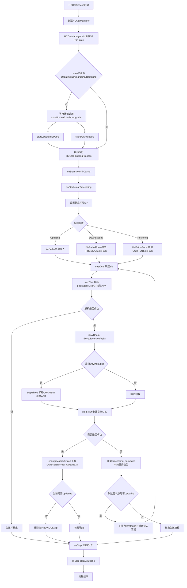
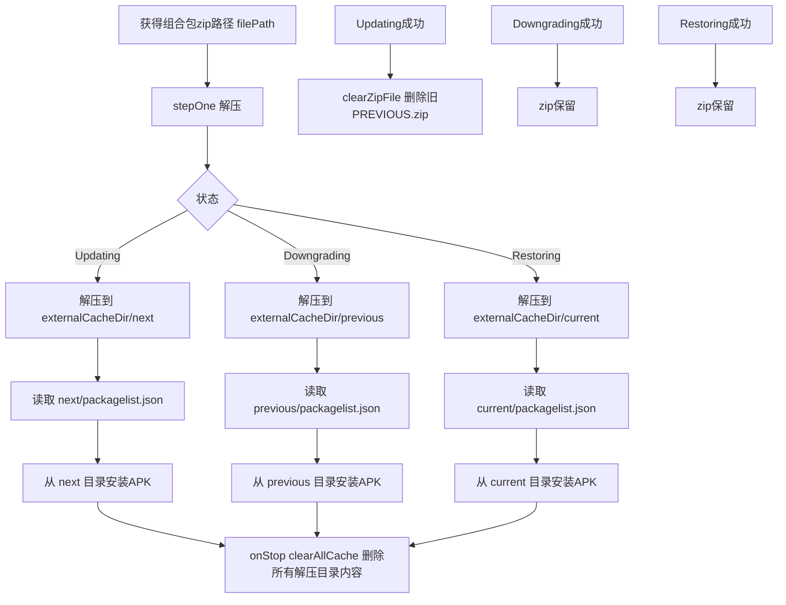
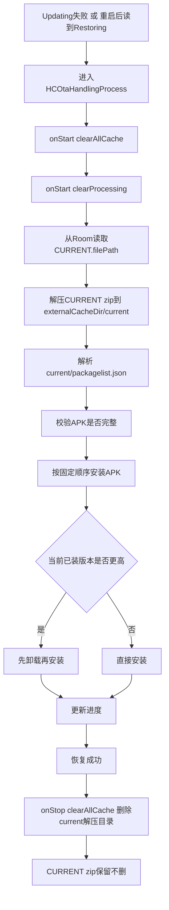

# hcotaservice 升级/降级/恢复全流程分析

## 1. 文档目的

本文档梳理 `hcotaservice` 模块中“预装应用升级、降级、恢复”三条主链路的完整执行过程，重点回答以下问题：

- 升级、降级、恢复分别从哪里触发
- 主流程如何在各个 Process 之间流转
- 预装组合包 zip 本体何时被记录、何时被删除
- 预装组合包解压文件何时创建、何时删除
- Room 与 SharedPreferences 如何配合实现恢复续跑
- 失败后是否会自动还原，具体是如何触发的

---

## 2. 关键结论摘要

先给结论：

1. `hcotaservice` 的主控入口是 `HCOtaManager`，真正执行 OTA 的是 `HCOtaHandlingProcess`。
2. 恢复能力**不是依赖解压目录续跑**，而是依赖：
   - SharedPreferences 中保存的 `state`
   - Room 中保存的 `CURRENT/PREVIOUS/NEXT.filePath`
3. 解压目录是强临时态：**每次流程开始先清空一次，流程结束再清空一次**。
4. zip 本体不是统一自动清理的，只在**升级成功**后会删除“旧的 `PREVIOUS` zip”。
5. **升级失败会自动转入 `Restoring`**，但**降级失败不会自动恢复**。

---

## 3. 核心类与职责映射

| 类/文件 | 作用 |
|---|---|
| `HCOtaService` | 服务入口，创建并注册 `HCOtaManager` |
| `HCOtaManager` | IPC 层入口、状态恢复入口、启动升级/降级 |
| `HCOtaHandlingProcess` | 主流程编排：解压 -> 解析 -> 可选卸载 -> 安装 -> 收尾 |
| `PackageExtractProcess` | 按状态将 zip 解压到 `previous/current/next` |
| `PackageAnalysisProcess` | 解析 `packagelist.json` 并校验 APK 完整性 |
| `PackageUninstallProcess` | 批量卸载 APK |
| `PackageInstallProcess` | 按顺序安装 APK，并记录处理中包 |
| `HCOtaPackageManager` | zip 解压、缓存目录管理、静默安装/卸载、zip 删除 |
| `HCOtaPersistenceManager` | SP + Room 封装 |
| `HCOtaStateManager` | 状态机和当前安装中包集合 |

---

## 4. 三类“文件/数据”概念必须区分

### 4.1 预装组合包 zip 本体

这是流程输入文件，路径来源于：

- 升级时由 `startUpdate(filePath)` 外部传入
- 降级/恢复时从 Room 中读取历史 `filePath`

这个 zip 本体**不存放在解压缓存目录中**。

### 4.2 预装组合包解压后的临时目录

解压目标目录位于 `externalCacheDir()` 下：

- `previous`
- `current`
- `next`

状态映射如下：

- `Updating -> next`
- `Downgrading -> previous`
- `Restoring -> current`

### 4.3 组合包元数据

解析 `packagelist.json` 后，会将以下信息写入 Room：

- 版本角色：`CURRENT / PREVIOUS / NEXT`
- 该组合包 zip 的 `filePath`
- 包内 APK 列表

恢复/降级续跑依赖的是这部分元数据，而不是依赖已解压目录残留。

---

## 5. 主入口与自动续跑机制

### 5.1 服务启动入口

`HCOtaService` 在 `onCreate()` 中创建并注册 `HCOtaManager`：

- 文件：`src/main/java/com/hynex/hcotaservice/HCOtaService.java`

### 5.2 初始化时恢复状态

`HCOtaManager.init()` 会执行：

1. 从 SharedPreferences 读取上次状态 `readState()`
2. 调用 `hcOtaStateManager.initState(recordedState)`
3. 检查是否可降级 `checkDowngradeAble()`
4. 如果状态为以下之一，则自动拉起流程：
   - `Updating`
   - `Downgrading`
   - `Restoring`

也就是：

> 只要服务重启时 SP 里仍记录为进行中状态，模块就会重新执行 `HCOtaHandlingProcess`。

---

## 6. 总流程：升级 / 降级 / 恢复统一编排

`HCOtaHandlingProcess` 是三条链路的统一编排器。

### 6.1 流程启动前统一清理

`onStart()` 中会做两件事：

1. `clearAllCache()`
2. `clearProcessing()`

含义：

- 删除 `externalCacheDir()/previous/current/next` 下所有解压文件
- 清空 SharedPreferences 中的 `processing_packages`

因此：

> 解压目录从来不是恢复续跑点。每次真正执行前都会被清空。

### 6.2 统一步骤

进入 `onInput(state)` 后，统一执行以下步骤：

1. 设置状态并写入 SP
2. 确定当前要使用的 `filePath`
3. `stepOne`：解压 zip
4. `stepTwo`：解析 `packagelist.json`
5. `stepThree`：仅降级时先卸载当前 APK
6. `stepFour`：安装目标 APK
7. 成功则切换版本角色并收尾
8. 失败则按场景进入回滚或结束

---

## 7. 升级全流程（Updating）

### 7.1 触发入口

入口方法：`HCOtaManager.startUpdate(String filePath)`

要求：

- 当前状态必须是 `IDLE`

启动方式：

- `actuator.execute(HCOtaHandlingProcess.class, filePath, hcOtaPContext, null, State.HCOTAState.Updating)`

### 7.2 步骤一：清空旧解压缓存

位置：`HCOtaHandlingProcess.onStart()`

效果：

- 删除 `previous/current/next` 目录下所有文件
- 清空 `processing_packages`

### 7.3 步骤二：写入 Updating 状态

位置：

- `HCOtaHandlingProcess.onInput()`
- `HCOtaStateManager.setState()`
- `HCOtaManager.onStateChange() -> writeState(state)`

效果：

- SharedPreferences 中记录当前状态为 `Updating`

### 7.4 步骤三：解压 zip 到 next 目录

位置：

- `stepOne()`
- `PackageExtractProcess`
- `HCOtaPackageManager.extractHCOtaPackage()`

映射：

- `Updating -> ExtractFolder.NEXT`

创建时机：

> 这是“预装组合包解压文件”的创建时机。

### 7.5 步骤四：解析 next/packagelist.json

位置：

- `stepTwo()`
- `PackageAnalysisProcess`

检查项：

1. `packagelist.json` 是否存在
2. JSON 是否可解析
3. JSON 中列出的每个 APK 文件是否在 `next` 目录中存在

成功后会补充：

- `packageInfo.filePath = 原始 zip 路径`
- `packageInfo.version = NEXT`

然后写入 Room。

持久化时机：

> 这是“将升级包登记为 NEXT 版本”的时机。

### 7.6 步骤五：按顺序安装 APK

位置：`PackageInstallProcess`

行为：

1. 对 APK 按固定顺序排序
2. 设置 installingPackageSet
3. 停止对相关服务监控
4. 逐个安装 `next` 目录中的 APK

安装成功后：

- 将包名加入 `installed`
- `writeProcessing(installed)` 写入 SharedPreferences

持久化含义：

> 这是“已成功安装的部分包列表”的持久化时机，主要用于升级失败后回滚。

### 7.7 步骤六：升级成功后切换版本角色

位置：`HCOtaHandlingProcess.changeModelVersion()`

逻辑：

1. 删除旧 `PREVIOUS`
2. 将旧 `CURRENT` 改为 `PREVIOUS`
3. 将本次 `NEXT` 改为 `CURRENT`

### 7.8 步骤七：删除旧 previous zip

位置：`HCOtaHandlingProcess.clearZipFile()`

注意：

- 该方法只在 `Updating` 成功路径下生效

删除对象：

- Room 中旧 `PREVIOUS` 对应的 `filePath`

也就是：

> 升级成功后，会删除“更老的 previous 组合包 zip”，而不是删除当前升级输入 zip，也不是删除刚解压的 next 目录。

### 7.9 步骤八：流程结束后再次清空解压缓存

位置：`HCOtaHandlingProcess.onStop()`

动作：

- 设为 `IDLE`
- 停止百分比进度子流程
- `clearAllCache()`

删除时机：

> 这是“预装组合包解压文件”的统一删除时机。

---

## 8. 升级失败后的自动恢复（Restoring）

这是模块里最关键的一条隐藏链路。

### 8.1 触发条件

位置：`HCOtaHandlingProcess.onInput()`

当 `Updating` 或 `Downgrading` 安装失败时，会先：

1. 读取 `processing_packages`
2. 调用 `PackageUninstallProcess` 卸载这些已安装成功的包

但后续分叉不同：

- 如果失败前状态是 `Updating`：
  - `input(State.HCOTAState.Restoring)`
  - 自动进入恢复流程
- 如果失败前状态是 `Downgrading`：
  - 不会进入恢复流程

关键结论：

> 自动 `Restoring` 只会由“升级失败”触发，不会由“降级失败”触发。

---

## 9. 恢复全流程（Restoring）

恢复的来源有两种：

1. 升级失败后，流程内直接切到 `Restoring`
2. 服务重启后，在 `HCOtaManager.init()` 中读到 `Restoring`

### 9.1 步骤一：恢复开始前仍然先清空所有解压目录

位置：`HCOtaHandlingProcess.onStart()`

说明：

- 恢复不会复用上次残留的 `current` 解压目录
- 即使是重启后续跑，也会重新解压

### 9.2 步骤二：从 Room 读取 CURRENT.filePath

位置：`HCOtaHandlingProcess.onInput()`

逻辑：

- `if (state == Restoring) filePath = getFilePath(CURRENT)`

结论：

> 恢复使用的是 Room 中当前版本的 zip 路径，而不是 previous 路径。

### 9.3 步骤三：将 current zip 解压到 externalCacheDir()/current

位置：`PackageExtractProcess`

映射：

- `Restoring -> CURRENT`

创建时机：

> 这是恢复流程中解压文件的创建时机。

### 9.4 步骤四：解析 current/packagelist.json

位置：`PackageAnalysisProcess`

成功后会：

- 校验 APK 文件完整性
- 以 `CURRENT` 角色再次写回 Room

### 9.5 步骤五：重新安装 current 版本 APK

位置：`PackageInstallProcess`

这里有一个关键逻辑：

- 如果当前设备上已安装版本号大于恢复包目标版本号
- 且状态为 `Restoring` 或 `Downgrading`
- 则先卸载，再安装

因此恢复本质上是：

> 以 Room 中登记的 `CURRENT` 组合包为准，重新将 current 目录中的 APK 覆盖安装一遍。

### 9.6 步骤六：恢复成功后不会删除 zip

`clearZipFile()` 对 `Restoring` 无处理逻辑。

所以：

- 恢复完成后，`CURRENT.filePath` 对应 zip 仍会保留
- 仅解压目录会在 `onStop()` 中被删

### 9.7 步骤七：恢复结束后删除 current 解压目录

位置：`HCOtaHandlingProcess.onStop()`

结果：

- `externalCacheDir()/current` 被清空
- 但 current zip 本体保留

---

## 10. 降级全流程（Downgrading）

### 10.1 触发入口

入口方法：`HCOtaManager.startDowngrade()`

要求：

1. 当前状态必须为 `IDLE`
2. `isDowngradeAble() == true`

其中 `isDowngradeAble()` 的判断依据是：

- `PREVIOUS.filePath` 存在，或者
- `CURRENT.filePath` 存在

### 10.2 步骤一：从 Room 读取 previous zip 路径

位置：`HCOtaHandlingProcess.onInput()`

逻辑：

- `Downgrading -> getFilePath(PREVIOUS)`

### 10.3 步骤二：解压到 previous 目录

位置：`PackageExtractProcess`

映射：

- `Downgrading -> PREVIOUS`

### 10.4 步骤三：先卸载当前 CURRENT 版本中的包

位置：`HCOtaHandlingProcess.stepThree()`

行为：

- 从 Room 读取 `CURRENT` 版本 apk 列表
- 组装 packageName 列表
- 调用 `PackageUninstallProcess`

### 10.5 步骤四：安装 previous 目录中的 APK

位置：`PackageInstallProcess`

### 10.6 步骤五：降级成功后切换角色

位置：`changeModelVersion()`

逻辑：

1. 删除 `CURRENT`
2. 将 `PREVIOUS` 改成 `CURRENT`

### 10.7 步骤六：降级成功不会删除 zip

`clearZipFile()` 不处理 `Downgrading`。

也就是说：

> 降级成功后，previous zip 会保留在磁盘上。

---

## 11. 组合包 zip 本体生命周期

### 11.1 zip 的来源

代码中没有看到 `hcotaservice` 主动下载 zip 的逻辑，它假定 zip 已经存在：

- 升级：由外部传入 `filePath`
- 恢复/降级：由 Room 中历史记录提供 `filePath`

### 11.2 zip 的持久化时机

位置：`HCOtaHandlingProcess.stepTwo()`

只有在以下条件都满足后才会持久化：

1. 解压成功
2. `packagelist.json` 解析成功
3. APK 文件校验通过

随后会：

- 给 `packageInfo.filePath` 赋值
- 给 `packageInfo.version` 赋值
- 写入 Room

### 11.3 zip 的删除时机

唯一明确删除点：

- `HCOtaHandlingProcess.clearZipFile()`
- 且仅在 `Updating` 成功路径中调用并生效

删除对象是：

- 升级前数据库中记录的旧 `PREVIOUS.zip`

### 11.4 不会删除 zip 的场景

以下场景下 zip 默认会保留：

- `Restoring` 成功
- `Downgrading` 成功
- 大部分失败场景
- 当前 `CURRENT.filePath` 对应 zip

总结：

> zip 清理策略是不对称的：升级成功会删旧 previous zip，恢复和降级默认保留 zip。

---

## 12. 解压文件生命周期

### 12.1 创建时机

创建于 `stepOne -> PackageExtractProcess -> extractHCOtaPackage()`。

目标目录：

- 更新：`externalCacheDir()/next`
- 恢复：`externalCacheDir()/current`
- 降级：`externalCacheDir()/previous`

### 12.2 使用时机

解压目录中的文件会被两个阶段使用：

1. `PackageAnalysisProcess` 读取 `packagelist.json`
2. `PackageInstallProcess` 读取对应 APK 文件并安装

### 12.3 删除时机

统一有两个删除点：

#### 删除点 A：流程开始前

位置：`HCOtaHandlingProcess.onStart()`

动作：`clearAllCache()`

#### 删除点 B：流程结束后

位置：`HCOtaHandlingProcess.onStop()`

动作：`clearAllCache()`

### 12.4 是否会复用旧解压目录

不会。

因为：

- 每次流程开始前先删
- 需要时再从 zip 重新解压

总结：

> 解压文件是“纯临时态”，不会作为重启后的恢复依据。

---

## 13. SharedPreferences 与 Room 的分工

### 13.1 SharedPreferences

由 `HCOtaPersistenceManager` 管理。

主要保存：

- `STATE`
- `PROCESSING_PACKAGES`

作用：

- 记录当前 OTA 进行到什么状态
- 记录本轮已经安装成功的部分 APK 包名，用于失败后回滚卸载

### 13.2 Room

由 `HCOtaRepository` 管理。

主要保存：

- `CURRENT/PREVIOUS/NEXT`
- 每个版本角色对应的 zip `filePath`
- APK 列表

作用：

- 支撑升级成功后的版本切换
- 支撑降级
- 支撑恢复

---

## 14. 隐藏行为与风险点

### 14.1 恢复只由升级失败自动触发

- 更新失败 -> 自动 `Restoring`
- 降级失败 -> 不会自动恢复

### 14.2 解压目录不是恢复点

恢复依赖的是：

- SP 中的 `state`
- Room 中的 `filePath`

而不是依赖缓存目录残留。

### 14.3 `processing_packages` 会在流程开始时被清空

这意味着如果中途崩溃再重启：

- 崩溃前已安装过哪些包，这段历史会丢失
- 后续回滚只能基于“重启后这轮重新记录”的包列表

### 14.4 zip 可能长期残留

因为恢复和降级都不会主动删 zip。

### 14.5 卸载流程不严格校验结果

`PackageUninstallProcess` 没有基于卸载返回值做失败控制，存在“卸载不完整但流程继续”的风险。

### 14.6 恢复后自动打开 App 的逻辑存在死条件

`PackageInstallProcess.performPostInstallOperations()` 中：

```java
if (TextUtils.isEmpty(packageNeedOpenToRestore) && packageNeedOpenToRestore.equals(packageName)) {
    ApkUtil.openApp(...)
}
```

这个条件基本不可能成立，因此自动打开应用逻辑几乎不会生效。

---

## 15. Mermaid 流程图

### 15.1 总流程图



### 15.2 zip 与解压目录生命周期图



### 15.3 Restoring 专用流程图



---

## 16. 源码行号对照表（关键链路）

> 行号范围基于当前代码阅读结果，用于快速定位关键行为。

| 文件 | 关键符号/阶段 | 关键行为 | 行号范围 |
|---|---|---|---|
| `src/main/java/com/hynex/hcotaservice/HCOtaService.java` | `onCreate`, `onDestroy` | 服务创建、注册/移除 `HCOtaManager` | 24-38 |
| `src/main/java/com/hynex/hcotaservice/manager/HCOtaManager.java` | `init()` | 读取持久化状态、自动恢复 `Updating/Downgrading/Restoring` | 42-52 |
| `src/main/java/com/hynex/hcotaservice/manager/HCOtaManager.java` | `startUpdate()` | 外部触发升级入口 | 54-63 |
| `src/main/java/com/hynex/hcotaservice/manager/HCOtaManager.java` | `startDowngrade()` | 外部触发降级入口 | 65-78 |
| `src/main/java/com/hynex/hcotaservice/manager/HCOtaManager.java` | `checkDowngradeAble()` | 根据 `PREVIOUS/CURRENT.filePath` 判断是否可降级 | 132-137 |
| `src/main/java/com/hynex/hcotaservice/process/HCOtaHandlingProcess.java` | `onStart()` | 统一清空解压缓存和 `processing_packages` | 24-41 |
| `src/main/java/com/hynex/hcotaservice/process/HCOtaHandlingProcess.java` | `onStop()` | 设为 `IDLE`、关闭进度子流程、再次清空缓存 | 43-53 |
| `src/main/java/com/hynex/hcotaservice/process/HCOtaHandlingProcess.java` | `onInput()` | 主流程编排，包含 update/downgrade/restore 分支 | 55-128 |
| `src/main/java/com/hynex/hcotaservice/process/HCOtaHandlingProcess.java` | `clearZipFile()` | 仅在 `Updating` 成功路径中删除旧 `PREVIOUS.zip` | 130-136 |
| `src/main/java/com/hynex/hcotaservice/process/HCOtaHandlingProcess.java` | `changeModelVersion()` | 更新成功或降级成功后的版本角色切换 | 144-172 |
| `src/main/java/com/hynex/hcotaservice/process/HCOtaHandlingProcess.java` | `stepOne()` | 发起解压 | 189-194 |
| `src/main/java/com/hynex/hcotaservice/process/HCOtaHandlingProcess.java` | `stepTwo()` | 解析后写入 Room，设置 `filePath/version` | 197-212 |
| `src/main/java/com/hynex/hcotaservice/process/HCOtaHandlingProcess.java` | `stepThree()` | 仅降级时卸载 `CURRENT` 版本 APK | 214-231 |
| `src/main/java/com/hynex/hcotaservice/process/HCOtaHandlingProcess.java` | `stepFour()` | 发起安装 | 233-242 |
| `src/main/java/com/hynex/hcotaservice/process/PackageExtractProcess.java` | `getExtractFolder()` | 状态到 `previous/current/next` 的映射 | 41-50 |
| `src/main/java/com/hynex/hcotaservice/process/PackageAnalysisProcess.java` | `onInput()` | 读取 `packagelist.json` 并校验解压文件 | 32-86 |
| `src/main/java/com/hynex/hcotaservice/process/PackageInstallProcess.java` | `onStart()` | 排序、设置安装集合、逐个输入 APK | 42-65 |
| `src/main/java/com/hynex/hcotaservice/process/PackageInstallProcess.java` | `onInput()` | 对每个 APK 执行卸载/安装/记录处理进度 | 75-114 |
| `src/main/java/com/hynex/hcotaservice/process/PackageInstallProcess.java` | `installApk()` | 安装失败重试 | 116-129 |
| `src/main/java/com/hynex/hcotaservice/process/PackageInstallProcess.java` | `getExtractFolder()` | 安装阶段读取对应解压目录 | 131-140 |
| `src/main/java/com/hynex/hcotaservice/process/PackageInstallProcess.java` | `performPreInstallOperations()` | 停止服务监控、确定恢复后处理信息 | 142-163 |
| `src/main/java/com/hynex/hcotaservice/process/PackageInstallProcess.java` | `performPostInstallOperations()` | 恢复后打开 App/发广播逻辑，含死条件 | 165-180 |
| `src/main/java/com/hynex/hcotaservice/manager/HCOtaPackageManager.java` | `extractHCOtaPackage()` | 将 zip 解压到 `externalCacheDir()/folder` | 32-65 |
| `src/main/java/com/hynex/hcotaservice/manager/HCOtaPackageManager.java` | `deleteHCOtaPackage()` | 删除 zip 本体 | 67-74 |
| `src/main/java/com/hynex/hcotaservice/manager/HCOtaPackageManager.java` | `install()` | 从解压目录安装 APK | 84-92 |
| `src/main/java/com/hynex/hcotaservice/manager/HCOtaPackageManager.java` | `clearAllCache()`, `clearCache()` | 删除 `previous/current/next` 解压目录内容 | 111-121 |
| `src/main/java/com/hynex/hcotaservice/manager/HCOtaPackageManager.java` | `deleteAllInFolder()` | 递归删除解压目录内容 | 123-135 |
| `src/main/java/com/hynex/hcotaservice/manager/HCOtaPersistenceManager.java` | `getFilePath()` | 获取某版本角色记录的 zip 路径 | 79-92 |
| `src/main/java/com/hynex/hcotaservice/manager/HCOtaPersistenceManager.java` | `readProcessing/writeProcessing/clearProcessing` | 管理处理中包列表 | 95-109 |
| `src/main/java/com/hynex/hcotaservice/manager/HCOtaPersistenceManager.java` | `readState/writeState` | 管理 SP 中当前状态 | 111-117 |
| `src/main/java/com/hynex/hcotaservice/manager/HCOtaStateManager.java` | `setState()` | 状态机更新与回调分发 | 42-53 |
| `src/main/java/com/hynex/hcotaservice/manager/HCOtaStateManager.java` | `setInstallingPackageSet/removeInstallingPackage` | 维护当前安装中包集合 | 88-110 |
| `src/main/java/com/hynex/hcotaservice/db/HCOtaRepository.java` | `insertOrUpdateHCOtaPackageJsonModel()` | 将 `packageInfo + apks` 写入 Room | 21-39 |
| `src/main/java/com/hynex/hcotaservice/db/HCOtaRepository.java` | `deleteHCOtaPackageJsonModel()` | 删除某版本角色数据 | 41-44 |

---

## 17. 最简结论版

### 升级

- 外部传入 zip 路径
- 解压到 `next`
- 解析成功后登记为 `NEXT`
- 安装成功后：`NEXT -> CURRENT`，旧 `CURRENT -> PREVIOUS`
- 删除更老的 `PREVIOUS.zip`
- 结束时删除所有解压目录内容

### 恢复

- 来源于升级失败，或重启后检测到 `Restoring`
- 从 Room 读取 `CURRENT.filePath`
- 解压到 `current`
- 重新安装 current 版本 APK
- 成功后保留 current zip，不保留 current 解压目录

### 降级

- 从 Room 读取 `PREVIOUS.filePath`
- 解压到 `previous`
- 卸载当前版本，再安装 previous 版本 APK
- 成功后保留 previous zip，不保留 previous 解压目录

---

## 18. 文档适用范围说明

本文档基于 `hcotaservice` 当前代码实现整理，不包含：

- zip 下载来源的外部模块逻辑
- 其他模块对 `startUpdate()` 的调用来源分析
- UI 进度展示的详细行为

若后续要继续深挖，可进一步补充：

1. `State` 常量定义文档
2. `packagelist.json` 字段说明
3. 与外部调用方的 IPC 时序图
