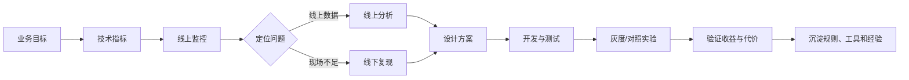

# Android 性能优化指南

> 本文由两部分合并而成：
> - **第一部分**：Android开发者技能等级与职业发展指南（原 `程序员技能.md` 内容）
> - **第二部分**：性能优化实践——从问题发现到数据验证（根据 `image` 目录 46 张图片整理）

---

# 第一部分 Android开发者技能等级与职业发展指南

## 1. 初中级开发者

### 1.1 判断标准
- 能够在同事的协助下，完成常见的业务需求
- 执行力强，能够及时完成安排的工作

### 1.2 需要具备的技术能力
- 有比较好的操作系统、数据库、网络、数据结构和算法等方面的基础
- 熟悉Java/Kotlin的基本使用，了解集合、并发、泛型、反射等的使用
- 了解Android开发基础知识，包括四大组件、Jetpack等
- 熟悉Android布局绘制流程，具备自定义View的能力
- 了解Android App构建过程，能够编写简单的Gradle脚本
- 了解常用的第三方框架，能够使用框架比较快地实现需求

### 1.3 典型特征
初中级阶段的Android开发者一般需要在同事的协助下完成工作，对日常需求在Android平台上的实现方式均有所了解，能够对一些复杂的需求进行合理的设计和拆解，同时能够兼顾扩展性和性能。

## 2. 高级开发者

### 2.1 判断标准
- 有比较多的项目实践经验
- 能够独立处理比较复杂的项目需求，合理地将其拆解并实现
- 实现需求的同时注重效率和项目架构
- 能够指导团队内的实习生和初中级开发者
- 能够成为项目某个模块的负责人，评估相关业务需求的合理性和迭代规划

### 2.2 需要具备的技术能力
- 掌握Android Framework的常见原理和具体工作，比如事件循环机制、Activity/Fragment启动流程、生命周期、布局的绘制流程、事件分发等
- 掌握Jetpack常用组件的实现原理和适用场景
- 熟悉跨进程通信的基本使用，了解多进程的使用场景
- 掌握常用的设计模式，了解常见的架构模式的优缺点
- 熟悉常用的第三方框架的原理和设计思想，能够根据场景选择合适的框架
- 熟悉Android App构建过程，了解常用的字节码处理三方库，能够实现通用的编译时修改插件
- 了解常用的性能优化工具，有性能优化意识

### 2.3 招聘要求
高级开发者一般需要3～5年工作经验。一般公司在招聘高级开发者时，更偏向于有复杂项目工作经验的人，"复杂"的判断标准如下：
- 业务复杂，涉及技术多，比如音视频、Hybrid（混合模式）相关
- 日活高，比如百万、千万甚至更高
- 开发时间长，团队成员多

面试时除了项目复杂度，个人在其中承担的角色也应非常重要。比如有独立负责某个复杂模块或者开发底层组件经验的人，一定比只处理开发列表页等简单业务的人有优势。

## 3. 资深开发者

### 3.1 判断标准
- 能够结合Android设备的特性，为业务/技术需求提供置信度高的建议
- 作为项目负责人，可以根据业务类型做技术选型，能够做出中长期技术规划
- 在团队内有比较大的影响力，团队建设能力强，能够带领初中高级开发者
- 作为技术难题攻坚的头部力量，能够解决复杂问题

### 3.2 需要具备的技术能力
- 了解Android NDK（Native Development Kit，原生开发工具套件）开发，包括但不限于C/C++、JNI（Java Native Interface，Java本地接口）等
- 对Android Runtime有基本的认识，能够根据问题快速了解具体技术细节
- 掌握Android项目架构的常用技术及核心原理，包括但不限于组件化、插件化、热修复等
- 熟悉Android启动、内存、卡顿、功耗、包大小等的优化方法和工具
- 熟悉Android App构建过程，能够对编译速度进行优化
- 熟悉业务类型所需的领域技术，比如音视频技术、跨平台技术、图像处理技术等

### 3.3 典型特征
资深开发者一般需要5年以上的工作经验，是团队的领导者。需要在技术实力、决策思维、沟通协作方面做出表率。这就要求资深开发者在完成业务需求的同时，还需要多花时间思考项目的技术选型和架构是否能够满足业务迭代需求，从而在合适的时机进行项目优化甚至重构；同时经常在团队、部门内做技术分享，提升自己的影响力，这样资深开发者做的决策才会使大家信服。

## 4. 技术经理与技术专家

### 4.1 技术经理（业务方向）
- 需要有技术广度，除了Android技术过硬，对其他技术也要有所了解
- 商业思维和项目管理能力等也要很强
- 最重要的是具备团队建设能力，负责的团队能够以较高的速度、质量和满意度落实规划

### 4.2 技术专家（技术方向）
- 需要有技术深度，对Android的某个领域有非常深入的理解
- 可以牵头完成复杂技术攻关
- 可以从领域的视角出发为产品提供发展建议

### 4.3 常见技术专家方向
在规模较大的企业内，技术专家一般分多个方向，常见的有：
- 音视频
- 跨平台
- 图像处理
- 性能优化
- DevOps
- 端智能

每个方向涉及的知识点都非常多，因为它们是与平台无关的通用技术，无论是Android、iOS，还是前端、后端，这些方向都会涉及到，所以开发者可以将其作为个人技术特长深入学习。

## 5. 性能技术专家

### 5.1 判断标准
- 具备独到的技术深度，在部门内技术影响力强
- 能够发现产品存在的体验问题，提出系统的优化方案并取得收益
- 能够根据技术领域的发展趋势，为产品提供优化方向
- 不限于技术方向，可以从多维技术角度思考，为业务提供技术价值
- 对团队的整体技术提升负责，在技术分享、技术规范、代码审查等方面有比较多的经验

### 5.2 需要具备的技术能力
- 熟悉Android NDK开发，掌握常用的NDK的使用场景
- 掌握Linux系统编程，能够从Linux系统角度思考优化方案
- 熟悉Android虚拟机核心模块，能够根据问题快速了解具体技术细节
- 熟悉Android启动、内存、卡顿、功耗、包大小等的底层原理，具备相关优化能力
- 掌握Android ANR（Application Not Responding，应用无响应）、OOM（Out Of Memory，内存不足）、崩溃等稳定性问题的解决思路、方法和工具
- 熟悉Android App构建过程，能够对编译速度进行优化

### 5.3 典型特征
性能技术专家一般是公司中性能方向的"权威"，能够结合Android系统的运行机制，为产品提供性能诊断、对业务的优化思路和方法。对Android系统架构从下到上有深入的理解。

## 6. 学习建议与成长路径

### 6.1 学习方法
1. 明确自己的近期目标和长期目标，写下本周、本月、本年、近三年最重要的事是什么
2. 列出完成这些目标需要做哪些事，尽量写得可以量化
3. 列出实现这些结果需要的知识有什么，自己需要补充哪些
4. 把这个表放到自己随时可以看到的地方，比如打印出来贴在门上，或者用作计算机、手机桌面都可以
5. 定期更新进度

### 6.2 目标设定示例

| 时间 | 目标 | 关键结果 | 需补充知识 | 进度 | 输出内容 |
|------|------|----------|------------|------|----------|
| 本周 | 完成图片监控 | 图片监控SDK | Android图片的创建流程 | ××% | 链接 |
| 本月 | 完成Native内存监控功能 | Native内存实时展示前端工具；Native内存分配归因SDK | Linux内存分配流程细节 | ××% | |
| 本年 | 完成图书编写和发布 | 图书初稿完成 | Word排版技巧 | ××% | |
| 近三年 | 成为高级开发者 | 至少带领团队完成一个公司级项目；在权威会议中分享一次以上 | 技术广度；技术管理；系统设计 | | |

### 6.3 记忆曲线
根据艾宾浩斯遗忘曲线，学习后31天的记忆保存比例仅为21.1%，因此需要定期复习和巩固所学知识。

### 6.4 同频对话
同频对话就是换位思考，根据听众的角色和关心点，调整表达内容。

随着工作年限的增加，我们承担的责任会越来越大，需要借助的力量也越来越多，这就需要我们能够和各方人士高效沟通，知道领导、同事、下属关注的重点，以他们容易接受的方式组织表达内容。

比如我们在和领导、下属聊项目时，需要有不同的侧重点：
- **领导**可能关注的是项目的价值、风险点、整体流程，那我们就不能只讲某个模块的细节，而要从更高的层面去思考和表达
- **下属**可能更关注自己负责哪个模块，输入和输出是什么，那我们就可以讲得具体一点

## 7. 招聘考察重点

### 7.1 初中级开发者
面试时主要考察基础知识和技术实现能力。

### 7.2 高级开发者
一般公司会通过一个业务需求使用的技术，引出实现细节、底层原理进行考察，比如从网络框架一路问到三次握手。所以如果你是初中级Android开发者并想要晋升，或者是高级开发者并想要变得更强，可以从这些方面深入学习，做到对项目里使用到的技术，深入理解其原理和设计思想，同时能将其和计算机基础结合起来。

### 7.3 资深开发者
技术方面的考察内容会涉及Android App开发整个流程的知识点，包括但不限于项目架构、开发框架、编译优化、迭代速度、质量优化等方面的知识点，当然也不要求每个都精通，只要一专多能即可。另外，公司也会考察面试者在项目拆解、技术选型方面的能力，比如给一个较为复杂的需求，让其给出架构设计和核心模块的伪代码实现。

### 7.4 性能技术专家
在技术方面会考察得比较深入，可能会从Linux进程管理、内存管理、CPU（Central Processing Unit，中央处理器）调度，一路问到Android虚拟机的AOT（Ahead Of Time，预编译）、类加载、代码执行，然后问到上层的界面渲染、内存申请等细节。当然，不会要求面试者对所有细节都非常熟悉，只要能打通某个线，具备相关基础知识即可，这样再学习其他知识也很容易。

---

**本书的主要目的**：为读者提供成为Android性能技术专家的学习指引，解决普通App开发者不了解、不知道Linux和Android虚拟机的使用场景的问题。无论你现在做什么业务，性能优化都可以派上用场，相信读完本书，你可以对性能优化和成为性能技术专家有更深刻的认识。

**性能优化的价值**：
- 性能优化是通用需求，任何业务（电商、直播、游戏等）发展到一定阶段，都可以在用户体验优化上获取收益
- 可迁移性得益于UNIX系统和虚拟机的广泛使用，即使开发者更换其他平台，大部分知识也可以复用

---

# 第二部分 性能优化实践：从问题发现到数据验证

> 本文根据 `image` 目录中的图片整理。图片内容覆盖性能优化方法论和 Android 性能测试实践两条主线：前者回答"优化什么、为什么优化、如何证明有效"，后者回答"如何采集 CPU、GPU、帧率和文件 I/O 等数据"。
>
> 目录实际包含 **46 张 JPG 图片**，另有当前文章文件；图片编号连续为 18～63。文末保留了全量图片索引。

## 1. 一句话总论

性能优化不是单纯降低某个技术指标，而是围绕业务关键路径，建立"指标 → 监控 → 分析 → 方案 → 实验 → 沉淀"的闭环，用更少的系统资源换取更稳定、更快速、更省资源的用户体验，并最终改善业务结果。



## 2. 性能优化首先要创造价值

### 2.1 技术指标不是最终目标

启动时间从 6 秒降到 5 秒，未必能带来用户使用时长、转化率或留存的提升。原因通常不是"没有优化"，而是优化方向没有命中业务关键路径。

- **对用户**：更快完成操作，更少遇到崩溃、白屏、加载错误和卡顿。
- **对公司**：降低资源成本，提高系统承载能力，用更少的资产完成更多任务。
- **对团队**：减少线上事故和重复排查，把一次性修复升级为工具、规范和自动化能力。

因此，性能指标和业务指标必须同时观察。启动速度、FPS、内存、CPU 等技术指标需要通过业务埋点与核心流程关联起来，不能脱离业务单独追求"好看"的数字。

### 2.2 业务指标与技术指标

**业务指标**是衡量"App 是否给用户和公司创造了价值"的指标，回答的是业务目标有没有达成，而不是系统跑得快不快。图片中有一句核心论断：技术指标再好，若不能体现在业务价值上，都是无用功。

| | 业务指标 | 技术指标 |
|---|---|---|
| **回答的问题** | 用户价值 / 商业价值达成没有 | 系统运行得怎么样 |
| **举例** | 下单转化率、使用时长、留存率、核心环节使用次数 | 启动速度、FPS、内存占用、CPU 使用率、包大小 |
| **作用** | 指导优化方向（优化什么才有价值） | 反映优化执行情况（手段好不好） |
| **谁关心** | 管理者、产品、公司收入 | 开发者 |

理解业务指标要注意一个易错点：它**不是**新增、活跃、留存、PV、UV 这类通用指标，而是**与业务模式强相关的核心指标**。以购物 App 为例（图 3-5 漏斗图），用户从使用到下单要经过推荐/搜索 → 查看详情 → 加入购物车 → 下单 → 支付等环节，每个环节的**使用次数和转化率**才是业务核心指标——因为下单意味着收入，任何一个环节的技术问题（加载慢、卡顿、崩溃）都会直接压低转化率。

业务指标在优化流程中出现在两个关键位置：

1. **指导优化方向（优化前）**：技术指标要"挂"在业务指标上。业务核心环节是下单，技术指标就应聚焦下单页面的加载成功率与流畅性；业务是直播，技术指标就应聚焦拉流速度；业务是聊天室，技术指标就应聚焦建链速度。
2. **验证优化效果（上线后）**：优化上线后除了看目标性能指标，还必须看业务指标是否提升。如果优化方案对性能指标有提升，却给业务指标带来不良影响，那它就不是一个好的优化方案。

一句话概括：**业务指标告诉你"快得有没有意义"，技术指标告诉你"系统有多快"**。两者必须同时观察，只看技术指标就是"皮之不存，毛将焉附"。

### 2.3 用户体验可以归纳为"稳、快、少"

| 维度 | 典型问题 | 可观测指标 |
|---|---|---|
| 稳 | 崩溃、页面加载错误、白屏 | 崩溃率、加载成功率 |
| 快 | 启动慢、页面加载慢、滑动卡顿 | 启动耗时、页面耗时、帧耗时、Janky frames |
| 少 | 耗电、流量、磁盘和内存占用高 | 电量消耗、流量、PSS、磁盘占用 |

### 2.4 用实验而不是感觉判断收益

优化代码不能直接凭线下结果上线。应根据用户、设备、版本或业务场景划分对照组和实验组，比较大样本数据；必要时进行反转实验：交换两组开关后，如果结果仍然不符合逻辑，就要怀疑其他变量，而不是把收益归因于优化方案。

## 3. 先厘清目标、现状和风险

### 3.1 用"瑞士奶酪模型"看性能问题

线上问题通常不是某一位开发者单独造成的。开发、自测、测试、验收、发布等环节各有漏洞，问题穿过多层防线后才到达用户。因此，修复代码只是第一步，还要在更早的环节捕获异常：补自测、补测试用例、完善验收标准，并采用分阶段发布和放量观测。

### 3.2 按三类风险确定优先级

1. **业务流转风险**：找出推荐/搜索、详情、加购、下单、支付等关键环节，关注每个环节的使用次数、转化率和失败率。技术指标应服务于这些指标，例如核心页面加载成功率、直播拉流速度、聊天室建链速度。
2. **技术架构风险**：单体、多仓、插件化、动态化、Hybrid 等方案各有边界。要明确当前架构可能引入的启动、包大小、运行时加载和稳定性风险，并建立对应监控。
3. **技术实现风险**：具体业务需求的实现方案可能引入风险。架构风险需要整体治理，实现风险则需要开发者在需求落地时主动识别。

最终优先级不是"哪个指标最容易优化"，而是"哪个风险对核心业务和用户体验的影响最大"。

## 4. 监控与分析：把问题变成证据

### 4.1 监控系统至少要回答四个问题

- 什么是正常基准线？
- 什么值算异常，何时报警？
- 报警由谁负责，涉及哪个模块？
- 如何提取数据并定位到代码变更点？

线上分析应先区分业务代码问题和系统问题。业务问题可以结合 `git blame` 追溯变更点和修改人；系统栈如 `ClassLoader.loadClass` 不能直接等同于业务原因，需要理解类加载机制，补充关键阶段日志后再判断真正耗时点。

线上数据受性能和隐私约束，往往不完整。线下复现时要尽量还原设备型号、系统版本、用户操作路径、业务数据和负载；本地无法复现时，应使用低端机、云测或数据回捞，而不是只在开发机上重复操作。

### 4.2 设计方案前先写清楚代价

优化方案至少应写明问题背景、现状和解决方案，并明确方案要解决的问题及其可能带来的隐患。先写方案的价值在于避免"头痛医头"，让开发、测试和业务方共享同一份判断依据。

一个可复用的"优化三板斧"是：

1. **提供更好的库**：针对高风险 API 提供统一、正确、易用的新 API。
2. **治理存量问题**：全局搜索或运行时拦截已有问题，按优先级清理相似代码。
3. **控制增量问题**：在编译期、运行期或发布流程中检测违规用法，必要时阻断构建并上报。

例如主线程解析复杂 JSON，不能只把当前调用移到子线程。更完整的方案是提供异步解析库，治理存量同步调用，并在打包或运行时阻止新的主线程同步解析。

### 4.3 "开源"与"节流"

面对资源瓶颈，可以从两个方向入手：

- **开源**：增加可用资源上限，例如适配 64 位、合理使用多进程或 `largeHeap`；没有标准 API 时才考虑经过充分验证的系统级方案。
- **节流**：减少资源使用，例如增加内存泄漏监控，复用图片缓存、线程池、对象池和 IPC 结果缓存，并根据原理补充更细粒度的监控。

"开源"不是无条件扩大上限，"节流"也不是简单删除功能；两者都必须在收益、稳定性和维护成本之间权衡。

## 5. 上线验证与经验沉淀

优化上线后至少观察三类数据：

1. **目标性能指标**：启动时间、内存、帧率、CPU/GPU、包大小等是否改善。
2. **连带性能指标**：例如图片缓存提升加载速度，却可能增加常驻内存；应同步关注内存异常和 OOM。
3. **业务指标**：性能指标改善但转化率、留存或用户完成率下降，不能视为成功。

无论方案成功还是失败，都要沉淀背景、数据、实验条件、结论和适用边界。失败方案的记录同样有价值，因为它能避免团队重复试错，并为后续方案提供约束。

## 6. 性能测试的四个环节

### 6.1 指标

指标用于指导方向，应优先覆盖当前项目的核心性能问题。常见移动端指标包括启动、页面加载、帧率与掉帧、内存、CPU/GPU、耗电、包大小和文件读写。

### 6.2 用例与环境

用例要固定测试方法，环境要可复现。至少记录：

- 设备型号、系统版本、App 版本；
- 测试前内存状态、CPU/GPU 繁忙程度、设备温度；
- 测试账号、业务数据、接口版本、操作路径；
- 压力档位，例如低负载、中等负载和接近 90% 负载。

不同版本对比时必须尽量保持环境和数据一致，否则结果无法归因于代码变更。

### 6.3 测试

- **自动测试**：通过脚本、ADB、Monkey 等工具按固定用例执行，适合日常回归和发版准入；代价是需要处理操作模拟、事件响应和遍历算法。
- **手动测试**：依赖熟练的工具使用和场景判断，适合探索性问题、复杂交互和自动化难以覆盖的现场。

### 6.4 报告

报告不能只罗列数据，必须给出结论和优化建议。应同时提供整体维度与场景维度：整体上比较各版本平均启动速度、平均帧率、平均内存、CPU/GPU 使用率和包大小；场景上比较首页等核心业务的平均值和峰值。峰值尤其重要，因为它可能直接导致功能不可用。

## 7. Android 指标采集实践

下面命令默认省略通用前缀 `adb shell`；若在终端执行失败，请补上该前缀。不同厂商和 Android 版本的节点可能不同，采集前应先确认设备实现。

### 7.1 CPU：区分整机和 App

CPU 核数、最大频率和当前频率可以从 sysfs 获取：

```bash
cat /sys/devices/system/cpu/possible
cat /sys/devices/system/cpu/cpu${p}/cpufreq/cpuinfo_max_freq
cat /sys/devices/system/cpu/cpu${p}/cpufreq/scaling_cur_freq
```

`/proc/stat` 的 CPU 行包含 `user`、`nice`、`system`、`idle`、`iowait`、`irq`、`softirq` 等 jiffies 计数。`/proc/${pid}/stat` 中关注进程的 `utime`、`stime`、`cutime`、`cstime`。分别在间隔 Δt 前后采样，用计数差计算时间增量，再将 App 增量与整机增量进行比较，才能得到一段时间内的 CPU 使用率；不要把单次绝对计数直接当成百分比。

### 7.2 GPU：先识别厂商

GPU 使用率和频率的节点依赖 SoC：

```bash
# GPU 类型
dumpsys SurfaceFlinger | grep GLES

# 高通示例
cat /sys/class/kgsl/kgsl-3d0/gpubusy
cat /sys/class/kgsl/kgsl-3d0/gpuclk

# 联发科示例
cat /sys/kernel/debug/ged/hal/gpu_utilization
cat /sys/kernel/debug/ged/hal/current_freqency

# 联发科旧版本示例
cat /sys/kernel/gpu/gpu_busy
cat /sys/kernel/gpu/gpu_freq_table
```

这些路径不是跨设备稳定 API，工具应按厂商、内核版本和权限做适配；采集不到数据时，先确认节点和权限，而不是据此判断 GPU 没有工作。

### 7.3 帧率、掉帧与帧耗时

- `FPS`：统计周期内实际绘制帧数除以周期。
- `Skipped frames`：统计周期内未按时完成的帧数。
- `Janky frames`：掉帧率，可用统计周期内的掉帧数除以实际绘制帧数计算；还要结合帧耗时分位数判断严重程度。

先找到 App 的 window，再采集指定窗口的帧时间：

```bash
dumpsys SurfaceFlinger --list | grep ${packageName}
dumpsys SurfaceFlinger --latency ${windowName}
dumpsys gfxinfo ${packageName} framestats
```

`SurfaceFlinger --latency` 输出第一行是 VSync 间隔；后续每行代表一帧，比较相邻 `present fence time` 可以得到帧耗时。该方式简单，但页面静止时可能返回 0，需要在测试逻辑中排除或特殊处理。

`gfxinfo framestats` 提供更完整的证据：卡顿统计、绘制相关内存、每帧各阶段耗时以及 View 层级。卡顿统计常见字段包括 `Janky frames`、50/90/95/99 分位帧耗时、`Number Missed Vsync`、`Number High input latency`、`Number Slow UI thread` 和 `Number Frame deadline missed`。示例数据中总帧数为 3、Janky frames 为 2（66.67%）、50 分位为 117 ms、90 分位为 200 ms，说明不能只看平均 FPS。

绘制内存部分可以观察 Font Cache、GPU Texture、Buffer Object 和 Total GPU memory usage；`PROFILEDATA` 则拆出输入、动画、Traversal、Draw、同步、Buffer 等阶段。View hierarchy 会给出 Window、ViewRootImpl、Views 和 DisplayList 大小，可用于分析布局层级是否过多，并结合帧耗时判断其实际影响。

### 7.4 文件读写：关注增量而非总量

```bash
cat /proc/${pid}/io
```

重点字段包括 `rchar`、`wchar`、`syscr`、`syscw`、`read_bytes`、`write_bytes` 和 `cancelled_write_bytes`。在固定间隔（例如 3 秒）采集两次，使用前后差值计算这段时间的读写增量，才能定位启动或滑动期间是否存在高频、过量或不应发生的 I/O。

## 8. 一套可落地的优化检查清单

1. 明确业务关键路径和成功标准，而不是先挑一个技术指标。
2. 建立正常基线、异常阈值、报警策略和责任人。
3. 用线上数据确认影响范围，用线下环境还原现场。
4. 先定位根因，再写方案；同时评估收益、代价、风险和回滚。
5. 优先采用"更好库 + 存量治理 + 增量控制"，避免只修一个调用点。
6. 通过灰度、对照和反转实验验证，不把相关性误当因果性。
7. 同时检查目标指标、连带指标和业务指标。
8. 将结论沉淀为监控、测试、工具、规范或文档，防止问题复发。

## 9. 图片索引与内容覆盖

以下索引对应 `image` 目录中的全部 46 张 JPG，便于回看原始截图。图片是连续的书稿页面，因此相邻图片属于同一主题。

### 9.1 价值、目标与闭环（18～29）

- [18](<image/Weixin Image_20260805084838_18_112.jpg>)：性能优化的价值与常见误区。
- [19](<image/Weixin Image_20260805084839_19_112.jpg>)、[20](<image/Weixin Image_20260805084840_20_112.jpg>)、[21](<image/Weixin Image_20260805084841_21_112.jpg>)：业务/技术指标、监控、分析、优化、实验与正反对比。
- [22](<image/Weixin Image_20260805084842_22_112.jpg>)、[23](<image/Weixin Image_20260805084843_23_112.jpg>)：瑞士奶酪模型与开发、测试、验收、发布防线。
- [24](<image/Weixin Image_20260805084844_24_112.jpg>)、[25](<image/Weixin Image_20260805084845_25_112.jpg>)、[26](<image/Weixin Image_20260805084846_26_112.jpg>)：厘清目标、业务漏斗、架构风险与实现风险。
- [27](<image/Weixin Image_20260805084847_27_112.jpg>)、[28](<image/Weixin Image_20260805084848_28_112.jpg>)、[29](<image/Weixin Image_20260805084849_29_112.jpg>)：用户体验"稳、快、少"、监控基线与线上/线下分析。

### 9.2 方案、上线与性能测试方法（30～41）

- [30](<image/Weixin Image_20260805084850_30_112.jpg>)、[31](<image/Weixin Image_20260805084851_31_112.jpg>)、[32](<image/Weixin Image_20260805084852_32_112.jpg>)：优化方案文档与"优化三板斧"。
- [33](<image/Weixin Image_20260805084853_33_112.jpg>)、[34](<image/Weixin Image_20260805084854_34_112.jpg>)：开源、节流、监控补强与资源治理。
- [35](<image/Weixin Image_20260805084855_35_112.jpg>)、[36](<image/Weixin Image_20260805084856_36_112.jpg>)：上线验证、连带指标和经验沉淀。
- [37](<image/Weixin Image_20260805084857_37_112.jpg>)、[38](<image/Weixin Image_20260805084858_38_112.jpg>)、[39](<image/Weixin Image_20260805084859_39_112.jpg>)、[40](<image/Weixin Image_20260805084901_40_112.jpg>)、[41](<image/Weixin Image_20260805084902_41_112.jpg>)：性能测试的指标、环境、用例、自动/手动测试与报告。

### 9.3 CPU、GPU、帧率与文件 I/O（42～63）

- [42](<image/Weixin Image_20260805084903_42_112.jpg>)、[43](<image/Weixin Image_20260805084904_43_112.jpg>)、[44](<image/Weixin Image_20260805084906_44_112.jpg>)、[45](<image/Weixin Image_20260805084908_45_112.jpg>)、[46](<image/Weixin Image_20260805084909_46_112.jpg>)、[47](<image/Weixin Image_20260805084910_47_112.jpg>)：CPU 核数、频率、`/proc/stat` 与进程 CPU 时间。
- [48](<image/Weixin Image_20260805084911_48_112.jpg>)：不同 GPU 厂商的使用率和频率节点。
- [49](<image/Weixin Image_20260805084913_49_112.jpg>)、[50](<image/Weixin Image_20260805084915_50_112.jpg>)、[51](<image/Weixin Image_20260805084916_51_112.jpg>)、[52](<image/Weixin Image_20260805084917_52_112.jpg>)、[53](<image/Weixin Image_20260805084918_53_112.jpg>)、[54](<image/Weixin Image_20260805084919_54_112.jpg>)：SurfaceFlinger 帧时间与 `gfxinfo`。
- [55](<image/Weixin Image_20260805084920_55_112.jpg>)、[56](<image/Weixin Image_20260805084921_56_112.jpg>)、[57](<image/Weixin Image_20260805084923_57_112.jpg>)、[58](<image/Weixin Image_20260805084924_58_112.jpg>)、[59](<image/Weixin Image_20260805084925_59_112.jpg>)、[60](<image/Weixin Image_20260805084926_60_112.jpg>)、[61](<image/Weixin Image_20260805084927_61_112.jpg>)：卡顿统计、GPU 绘制内存、PROFILEDATA 与布局层级。
- [62](<image/Weixin Image_20260805084928_62_112.jpg>)、[63](<image/Weixin Image_20260805084929_63_112.jpg>)：`/proc/pid/io` 文件读写与性能测试小结。

---

**最终结论**：性能优化的核心不是"把数字变小"，而是先找到业务真正的风险，再用可复现的数据定位问题，用可验证的方案改进系统，最后把有效经验变成团队能力。
