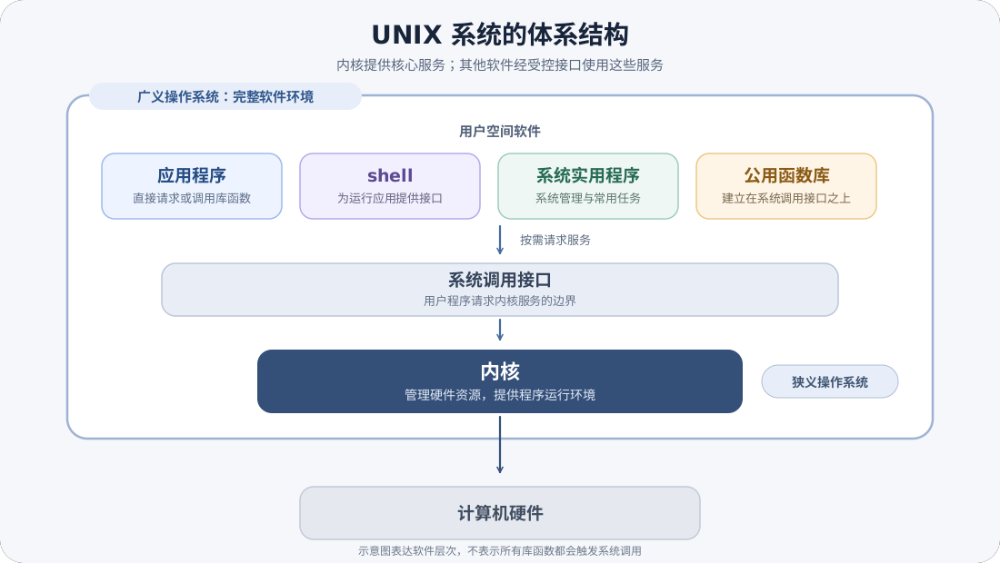

# 操作系统基础与运行机制

> 操作系统概念、UNIX 与 Linux、软硬件边界及运行机制。

## 第一章 操作系统的职责与演进

**Q1: [done] 操作系统和内核是什么？操作系统还包含哪些部分？**

操作系统是管理计算机资源、为程序和用户提供服务的基础软件。**内核是操作系统的核心**，负责进程调度、内存管理和设备访问等工作；程序通过系统调用请求内核服务。

除内核外，一套操作系统通常还包括：

1. **系统库**：提供程序可调用的功能，必要时通过系统调用访问内核。
2. **系统服务**：在后台提供网络管理等功能。
3. **系统工具**：执行文件管理等操作。
4. **用户界面**：通过桌面或命令解释器接收用户操作。

例如，程序读取文件时，内核检查权限并通过设备驱动访问存储设备。不同语境下，“操作系统”可以指内核，也可以指包含系统软件的完整系统。

**Q2: [learning] 操作系统中的并发、并行、共享和异步分别表示什么关系？**

并发表示多个任务在一段时间内都能推进，并不要求同一时刻执行。并行表示多个任务在同一时刻执行。共享描述多个任务使用共同资源，异步描述发起方不必等待操作完成后才继续，而是在完成时通过回调、事件、队列或查询结果衔接后续工作。异步本身不意味着并行，也不保证完成顺序。

1. **单核处理器**：多个可运行任务通过切换形成并发，不能在同一时刻执行多条任务指令。
2. **多核处理器**：任务既可以并发，也可以在不同核心上并行。
3. **互斥共享**：同一时刻只允许一个任务访问资源，例如需要独占的设备。
4. **并发共享**：多个任务在同一时间段使用资源，底层可能由分时交替完成，例如多个进程读取同一文件。共享若包含写入，还需同步、互斥或定义一致性规则。

并发与共享要求系统处理同步和互斥。异步操作何时完成取决于调度、设备及事件进度，调用方应按接口契约处理完成、失败和取消，而不能假定固定时序。

**Q3: [learning] 手工操作、批处理和分时系统分别解决了什么问题？**

这些阶段依次改善了人工准备任务的等待、处理器等待输入输出，以及用户等待结果的问题。它们反映不同的设计目标，并不意味着后出现的方式让前一种工作负载彻底消失。

1. **手工操作**：操作人员装入程序、启动机器并取走结果。准备和取结果期间机器可能闲置，每次更换任务都需要人工参与。
2. **单道批处理**：预先收集多个作业，由监督程序依次装入和执行，减少作业之间的人工操作。例如可用外围设备先把慢速介质上的作业汇集到磁带，再交主机处理，减少主机等待人工准备输入的时间。但一次只运行一道作业，该作业等待输入输出时处理器仍可能空闲。
3. **多道批处理**：内存中保留多道作业。一道作业等待输入输出时，处理器可以转去执行另一道，提高资源利用率和单位时间内完成的作业量。用户提交作业后通常需要等待处理结果。
4. **分时系统**：系统在多个可运行任务之间频繁切换，使多个用户可以通过终端交互。时间片和调度策略影响响应时间，分时并不保证每个操作都立即完成。

多道程序强调让处理器在其他作业等待时有事可做，分时强调交互响应。同一系统可以同时运行交互式任务和批处理任务。

**Q4: [learning] 实时操作系统的“实时”是什么意思？**

实时指系统需要在规定的时间约束内对事件作出响应或完成任务，正确性不仅取决于结果，还取决于结果何时产生。实时不等于平均运行速度最快，也不要求每个任务都立刻执行。

按错过期限的后果，可以区分：

1. **硬实时**：错过期限被视为系统无法满足要求。例如，某控制功能要求在给定期限内完成安全相关处理。设计时需要评估最坏情况下的响应时间。
2. **软实时**：偶尔错过期限可以接受，但错过越多通常服务质量越差。例如，音视频播放偶发延迟可能造成卡顿。

实际能否满足期限取决于任务执行时间、优先级、调度、中断、资源竞争等共同因素。使用实时操作系统本身不能证明整个应用一定满足期限。

**Q5: [learning] 操作系统中的资源虚拟化是什么意思？**

资源虚拟化是让程序看到由系统提供和管理的逻辑资源，而不必直接使用物理资源的原始形式。系统需要维护逻辑资源与物理资源之间的对应关系，并决定多个使用者怎样共享它们。

常见形式包括：

1. **处理器的时间复用**：调度器让多个可运行任务轮流使用处理器。每个任务都能继续执行，但单个处理器核心在同一时刻并不同时执行这些任务。
2. **内存的地址映射**：进程使用虚拟地址，硬件和内核配合将其映射到物理内存。不同进程可使用相同的虚拟地址而映射到不同位置，也可在受控条件下共享物理页面。

虚拟化不凭空增加处理器时间或物理内存。资源超出实际容量时，任务可能等待，内存页面也可能需要回收或换入换出。

**Q6: [learning] 网络操作系统和分布式操作系统分别怎样组织多台计算机？**

网络操作系统让多台各自运行的计算机通过网络通信并共享服务。分布式操作系统则尝试在多台计算机之上提供更统一的资源和任务管理视图。两者都依赖网络，但提供给用户和程序的系统边界不同。

1. **网络操作系统**：每台机器通常保留自己的操作系统和管理边界。用户通过明确的网络服务访问远端资源，例如远程文件共享；访问失败时需要考虑网络或远端机器状态。
2. **分布式操作系统**：系统协调多台机器的资源和任务，尽量隐藏任务究竟在哪台机器执行。它仍必须处理网络延迟、节点故障和数据一致性，不能真的把多台机器变成一台硬件。

分类取决于系统提供的抽象和管理范围，不能仅因机器联网或某个程序支持远程调用就称它为分布式操作系统。

**Q7: [learning] 个人计算机操作系统与分时系统是什么关系？**

“个人计算机操作系统”描述主要面向个人设备的使用场景，“分时”描述处理器在多个任务或用户之间分配运行时间的机制。两者不是互斥的历史阶段，个人计算机也可以使用分时调度。

1. **设备场景**：个人计算机系统通常提供桌面、文件管理、设备管理和应用运行环境，主要服务设备使用者。
2. **调度机制**：即使只有一位用户，同时打开浏览器、编辑器和播放器时，系统仍可在多个任务之间调度处理器，保持交互响应。
3. **多用户能力**：是否允许多个用户同时登录、隔离其资源，取决于具体系统配置和服务，并非由“个人计算机”名称单独决定。

因此，这两个词应分别用于说明目标设备和资源调度方式。

**Q8: [learning] 进程的异步推进与异步接口有什么区别？**

进程的异步推进指多个进程受调度和资源等待影响，各自以不能预先确定的速度前进。异步接口则描述调用方发起操作后不必一直等待完成，就可以继续做其他工作。两者都涉及时间关系，但讨论对象不同。

例如，两个进程交替得到处理器，谁先完成取决于调度、输入输出和运行负载，这是进程推进的不确定性。一个程序发起异步读取后继续处理其他任务，稍后接收完成事件，这是接口的使用方式。使用异步接口不保证两个任务在不同核心并行，也不保证完成顺序。

进程间需要按共享数据建立同步规则，调用异步接口则需要按接口契约处理完成、失败和取消；不能把两个场景都简化为“同时执行”。

## 第二章 UNIX、GNU 与 Linux

**Q9: [learning] UNIX 与操作系统是什么关系？UNIX 的体系结构是怎样的？**

UNIX 是一种操作系统，而“操作系统”是这一类软件的统称。就像汽车是一类交通工具，UNIX 是操作系统的一种：它管理计算机资源，为程序运行和用户操作提供基础环境。UNIX 也指由早期 UNIX 发展形成的一系列系统，具体实现并非只有一种。

UNIX 系统可以从硬件、内核和用户空间软件来理解。下图展示它们的位置，系统调用接口是用户空间程序向内核请求服务的入口：

各部分从底层到用户的职责如下：

1. **硬件**：处理器、内存和存储设备等实体，提供计算、存储等能力。硬件本身不是操作系统软件。
2. **内核**：操作系统的核心软件，负责管理处理器和内存、控制设备以及管理文件等。内核保护这些资源，避免普通程序随意干扰其他程序。
3. **系统调用接口**：程序向内核请求服务的入口。例如，程序需要读取文件时，可通过这个接口请求内核检查权限并读取数据。它是接口，不是独立运行的程序。
4. **用户空间软件**：运行在内核之外，包括公用函数库、系统工具、shell 和应用程序。公用函数库为程序提供可复用的功能，shell 是接收并解释用户命令的程序。它们需要内核服务时，可以通过系统调用发出请求。

例如，用户在 shell 中输入查看文件的命令：

1. **接收命令**：shell 解释用户输入，并启动相应的文件查看程序。
2. **请求读取**：文件查看程序可以调用公用函数库中的文件读取函数，由库通过系统调用请求内核读取文件。
3. **读取并显示**：内核检查权限并读取数据，将结果返回程序，程序再把内容输出给用户。

这是便于理解的典型路径：程序也可以直接发起系统调用，库函数也不一定需要调用内核。广义讨论中，UNIX 操作系统通常包括内核及配套系统软件，而用户自行安装的应用程序不一定算作操作系统的一部分。图中的用户空间同时展示了系统软件和应用程序，不表示所有应用程序都属于操作系统。

**Q10: [learning] GNU 操作系统是什么？**

GNU（GNU's Not Unix）是由 GNU 项目开发的类 UNIX 操作系统，由库、命令工具及其他程序等多个组件组成。GNU 与 UNIX 的接口和使用方式有相似之处，但 GNU 是独立开发的系统，不是 UNIX 的别名。

GNU 与内核的组合决定了实际运行的系统：

1. **GNU 用户空间**：提供 GNU C 库、命令行工具等组件，为程序开发和运行提供基础环境。
2. **GNU/Linux**：将 GNU 系统组件与 Linux 内核结合，形成一种完整的操作系统组合。发行版还可能加入其他项目的软件。
3. **GNU Hurd**：GNU 项目开发的内核相关组件运行在 GNU Mach 微内核之上，可与 GNU 系统组件组成 GNU/Hurd。GNU 项目指出 Hurd 尚不适合生产使用。

并非所有使用 Linux 内核的系统都包含完整 GNU 用户空间，因此不能仅凭使用 Linux 内核就断定它是 GNU/Linux。依据：GNU 项目《The GNU Project》和《The GNU Operating System and the Free Software Movement》。

**Q11: [learning] Linux 是什么？**

Linux 严格来说是一个类 UNIX 操作系统内核，负责进程调度、内存管理、设备访问和系统调用等基础工作。日常所说的“Linux”也常指以该内核为基础、包含用户空间软件的完整系统，具体含义要结合上下文判断。

需要区分的对象如下：

1. **Linux 内核**：管理硬件资源并向用户空间提供受控接口，本身不提供完整的命令行或桌面环境。
2. **Linux 发行版**：将 Linux 内核与库、系统工具、软件包管理工具及其他软件组织成可安装、可使用的系统。不同发行版的组件与配置可以不同。
3. **GNU/Linux**：使用 Linux 内核并结合 GNU 系统组件的一类系统。其他使用 Linux 内核的系统可以采用不同的用户空间，不能仅凭内核名称推断其软件组成。

依据：Linux Kernel 项目《About Linux Kernel》和 GNU 项目《The GNU Project》。

**Q12: [done] UNIX 登录名和口令文件记录什么？**

登录名是用于查找用户账户的名称，账户记录还关联数值用户 ID、主组、主目录和登录程序。Linux 的本地账户文件 `/etc/passwd` 每行通常以冒号分隔七个字段，账户资料也可能由其他账户服务提供。

按顺序理解这些字段：

1. **登录名**：标识要查找的账户。内核权限判断主要使用进程的数值用户和组身份，而不是直接比较登录名字串。
2. **口令字段**：在使用 shadow 机制的系统中常为 `x`，口令哈希另存于受保护的 `/etc/shadow`。认证方式和账户锁定策略由实际配置决定，不能仅凭该字段判断所有登录途径。
3. **用户 ID 与主组 ID**：分别标识账户和默认主组，用户还可属于附加组。
4. **说明字段**：保存账户的描述信息，不承担身份认证。
5. **主目录**：记录账户的默认主目录，传统登录过程通常以它作为初始工作目录。
6. **登录程序**：记录登录时运行的程序，通常是 shell。实际启动过程取决于登录服务与配置。

**Q13: [done] 用户主目录是什么，与当前工作目录有什么区别？**

主目录是账户用于存放个人文件和配置的默认目录。当前工作目录是进程解析相对路径时通常使用的起点，二者可能相同，也可能不同。

传统登录程序通常从账户记录取得主目录，设置初始工作目录及 HOME 环境变量。进程之后可调用 chdir 改变工作目录，而不改变账户记录中的主目录。shell 中单独的 `cd` 通常回到 HOME 指向的位置，HOME 可以被环境修改，不能当作账户记录的可靠证明。服务、容器或图形会话的启动目录由启动器决定，并不保证是主目录。

**Q14: [done] Shell 是什么，与 Bash 有什么关系？**

Shell 是运行在用户空间的命令解释器：它读取终端输入或脚本，解释并执行命令。Bash（Bourne-Again SHell）是 shell 的一种实现，其他实现还有 Zsh 和 dash。终端负责输入和显示，shell 负责解释命令，内核负责提供系统服务。

Shell 解析命令和变量，执行内建命令或启动外部程序，也负责设置管道和重定向。脚本可以用变量、条件和循环组合命令，完成自动化任务。

本机账户配置的登录 shell 是 `/bin/bash`。使用场景包括：

1. **交互操作**：输入 `pwd` 查看当前目录，或用 `cd` 切换目录。
2. **组合命令**：输入 `ls > file.list`，shell 将命令输出写入文件。
3. **执行脚本**：用 `bash build.sh` 执行当前目录中已有的脚本，完成重复任务。

登录 shell 可由账户信息指定。在 Linux 本地账户中，`/etc/passwd` 的第七个字段记录登录程序，账户信息也可能来自其他服务。登录 shell 不一定是运行每个脚本时使用的解释器。

不同 shell 可能提供不同的扩展语法。脚本应明确使用的解释器，或只使用 POSIX 规定的可移植语法。

**Q15: [done] Shell 执行 ./a.out 与 a.out 有什么区别？**

`./a.out` 指定运行当前目录中的 `a.out`。`a.out` 则让 shell 按命令名查找，外部程序通常在 PATH 列出的目录中查找。

例如，当前目录里有 `a.out`，但 PATH 不包含该目录，也没有其他同名命令时，`./a.out` 可以找到它，`a.out` 则会提示找不到命令。如果 PATH 包含当前目录，或其他目录中有同名命令，结果可能不同。找到文件后还需要执行权限等条件才能运行。

## 第三章 系统接口与运行机制

**Q16: [done] 公用函数库、库函数与系统调用有什么关系和区别？**

公用函数库是供多个程序复用的一组函数及相关资源，库函数是其中可供调用的函数。系统调用是程序请求内核服务的接口。库函数可以封装系统调用，也可以完全在用户态完成工作，两者属于不同层次。

从职责和调用路径理解它们的关系：

1. **函数库与库函数**：库组织可复用的代码，库函数提供调用入口。例如 C 标准库提供字符串处理和文件输入输出函数。公用强调可复用，不意味着库一定是共享库。
2. **库函数与内核**：库函数通常在调用进程的用户空间执行，可处理参数、缓冲、错误和平台差异。字符串处理可能不进入内核，文件输入输出函数可能通过系统调用请求内核服务。一次库函数调用可能触发零次、一次或多次系统调用。
3. **系统调用**：应用通过受控入口请求内核操作，例如文件读写、进程控制和内存映射。内核检查参数与权限，执行或安排操作，再返回结果。具体封装取决于系统与运行库。
4. **链接与装载**：静态库中所需代码通常在构建时合入程序。共享库由动态链接机制在运行时供程序使用，具体装载时机取决于平台和链接方式。

例如，标准 I/O 库函数读取文件时可能先从用户态缓冲区取数据。缓冲区需要补充时，库再通过系统调用请求内核读取，内核返回结果后由库交给程序。因此不能仅凭调用了库函数就断定发生一次系统调用。

**Q17: [learning] 用户态和内核态如何限制程序执行特权操作？**

处理器通过执行状态和特权级限制可执行的指令：普通应用运行在用户态，不能直接执行特权指令或任意访问受保护资源。内核在内核态执行资源管理与硬件操作。系统调用通过受控入口请求服务，异常由当前执行引起，外部中断由设备等外部事件引起，三者都可能使处理器转到内核处理路径。内核保存必要的执行现场并按来源处理，完成后再返回原执行上下文或调度其他任务。

1. **用户态**：应用可执行普通指令，但访问受保护资源时必须请求内核服务。
2. **内核态**：内核可执行特权指令，并按权限检查完成设备、内存和进程管理操作。
3. **系统调用**：应用通过指定入口请求服务。处理器切换到内核态，内核检查参数并执行操作。
4. **异常与中断**：异常由当前指令执行引起，例如非法访问。中断通常由外部事件引起，例如设备完成 I/O。处理器依据异常或中断类型转到对应处理逻辑。

应用不能通过普通函数调用绕过系统调用边界直接执行内核代码。具体指令和特权级规则由处理器架构定义。

**Q18: [learning] 大内核、微内核、分层内核和模块化内核分别在什么方面取舍？**

这些结构主要在内核态代码范围、模块边界、通信成本和可维护性之间取舍。大内核把较多服务放在内核态，调用路径短。微内核把更多服务移到用户态，缩小内核核心，但服务通信需要额外切换。

1. **大内核**：进程、内存和设备等服务多在内核态协作，通常减少跨边界通信。内核代码体量和模块耦合会增加维护难度。
2. **微内核**：内核只保留较小的核心服务，其他服务通过受控通信运行。隔离边界更清楚，但消息传递和状态切换可能增加成本。
3. **分层结构**：模块按层提供接口，可以自底向上逐层调试和验证，清晰的边界也有利于替换和维护。划分职责和定义层间接口并不容易，严格逐层调用还可能增加调用开销。
4. **模块化结构**：将功能组织成具有明确接口的模块，便于分别开发和维护。支持动态加载的系统可以在运行时加入驱动或文件系统模块，不必重新编译整个内核。模块仍可能相互依赖，接口设计和故障定位存在成本，模块化本身不等于隔离。

具体操作系统可以组合这些结构特征。不能只凭“大内核”或“微内核”标签推断整个系统的性能或安全性。

**Q19: [learning] 外核如何分配操作系统内核和应用的职责？**

外核（Exokernel）是一种操作系统内核架构：内核重点负责安全地分配和保护硬件资源，把较高层的资源管理策略交给应用使用的库操作系统实现。应用因此可以根据自身需要选择或实现不同的资源抽象。

各部分的职责如下：

1. **外核**：管理资源的分配和回收，检查访问权限，防止不同应用越权使用彼此的资源。
2. **库操作系统**：运行在应用一侧，使用外核提供的底层接口实现文件系统、虚拟内存等较高层抽象。
3. **应用**：选择适合自身需求的库或策略。例如，不同应用可以采用不同的数据缓存策略，而不必强制使用同一种内核抽象。

这种设计可能减少不适合特定应用的抽象开销，但也把更多实现、兼容和维护工作交给应用侧。外核仍负责隔离和安全检查，不能理解为应用可以不受限制地操作任意硬件，也不能仅凭架构名称断定它必然更快。

**Q20: [learning] 中断和陷阱（trap）分别是什么？它们与系统调用是什么关系？**

外部中断通常由设备或时钟等事件异步触发；异常则与正在执行的指令同步发生，例如缺页或除零。系统调用通过处理器提供的受控入口进入内核，但具体入口指令和异常分类取决于处理器架构。

1. **异常分类**：在 Intel 64 和 IA-32 架构中，异常包括 fault、trap 和 abort。缺页和除零属于 fault，不能把所有同步异常都称为该架构定义的 trap。可恢复的缺页处理完成后通常重新执行引发异常的指令。
2. **系统调用**：应用按调用约定传递调用号和参数，执行架构提供的入口指令。内核处理请求后返回结果；例如 x86-64 可使用 `syscall`，具体约定由操作系统和架构共同决定。
3. **处理流程**：处理器按架构规则保存必要状态并转入对应入口，内核保存其余现场、处理事件，再恢复上下文或安排其他任务运行。例如 Intel 64 和 IA-32 使用中断或异常的向量号索引中断描述符表，以定位对应处理入口。具体保存内容、入口和栈切换方式随架构与事件类型变化。

依据：Intel《Intel 64 and IA-32 Architectures Software Developer’s Manual》卷 3A 中的中断与异常处理章节。

**Q21: [learning] 存储层次结构为什么有效？“局部性原理”在其中的作用是什么？**

存储层次通常由寄存器、高速缓存、主存和持久化存储组成。越靠近处理器的层次通常容量较小、访问较快、单位容量成本较高。系统用少量快速存储配合较大容量的慢速存储，在成本和性能之间取得折中。

1. **时间局部性：**最近访问的数据可能再次被访问，保留热点数据可减少重复访问较慢层次。
2. **空间局部性：**访问位置附近的数据可能很快被访问。缓存通常以缓存行等单位搬运，可让后续访问命中。
3. **适用边界：**命中率取决于访问模式、容量和替换策略。大范围随机访问可能降低缓存收益，不能保证每种负载都接近最快层次的速度。

**Q22: [done] 32 位整数的大小端如何影响内存字节排列和跨主机解释？**

字节序是多字节数据在内存中按地址排列的顺序，改变的是表示方式，不改变整数的数值。以 32 位整数 0x04030201 为例，最高有效字节是 0x04，最低有效字节是 0x01。假设字符指针 cp 指向该整数的最低内存地址，从低地址到高地址读取四个字节：

1. **大端：**依次读到 `04 03 02 01`，因此 cp[0] 是 0x04，cp[3] 是 0x01。
2. **小端：**依次读到 `01 02 03 04`，因此 cp[0] 是 0x01，cp[3] 是 0x04。

十六进制数值写法中的最高有效字节始终在左，不能据此推断它在内存中的地址。若小端主机直接发送该整数的四个内存字节，大端主机按本机整数解释 `01 02 03 04`，得到的会是 0x01020304。TCP/IP 协议字段使用大端的网络字节序。传输约定为网络字节序的 32 位字段时，发送方须将原值表示为 `04 03 02 01`，接收方再转回主机字节序。同一台计算机上的进程若采用相同的本机表示，通常不需要转换，但仍须遵守双方约定的数据格式。

**Q23: [learning] 计算机启动时，固件和引导加载程序怎样把控制权交给操作系统？**

处理器复位后从平台规定的入口执行固件；固件完成必要初始化并选择启动目标，引导加载程序准备内核及其启动参数，再将控制权交给内核。具体步骤取决于固件、存储介质和操作系统。

1. **固件初始化**：固件初始化运行所需的硬件，并根据启动配置选择设备或程序。
2. **选择和加载**：例如 UEFI 2.11 的固件启动管理器根据启动选项加载 UEFI 应用，包括操作系统引导加载程序。加载程序再准备内核及其所需数据。
3. **内核接管**：内核初始化内存管理、设备及其他子系统，然后启动早期用户空间。失败可能发生在固件选择、加载程序或内核初始化等不同阶段，需根据最后可见的启动信息定位。

传统 BIOS 配合 MBR 的启动链可以经过磁盘首扇区和分区引导代码，但不是所有机器的必经路径；UEFI 也不要求通过活动分区的引导扇区启动。固件通常保存在非易失性存储器中，不能一概等同于不可改写的 ROM。

依据：UEFI Specification 2.11 的 Boot Manager 章节。
