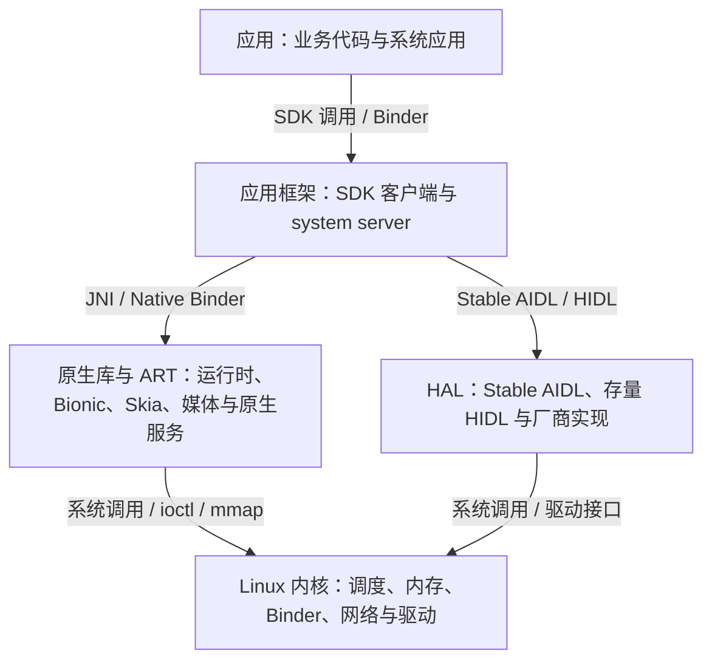

# Android 系统架构

> 学习资料（文章模式沉淀）。主线：分层架构与进程边界、跨层接口、HAL 与 Treble、近年架构边界、进程与线程的架构分工。源文档：android-internals-wiki §1.1《Android 分层架构、进程模型与线程协作》（机制按 AOSP `android-17.0.0_r1` 与 ACK `android17-6.18-2026-06_r6` 核对）；16 KB 分发时间线、应用沙箱与 ART 编译策略已于 2026-09-23 与官方资料核对。启动全链路（init、.rc、Zygote、system_server、应用进程诞生）见 [02-Android系统启动流程.md](./02-Android系统启动流程.md)。Q 序列即结构，供 atlas 同源直读。

**Q1: Android 的五层架构怎么理解？各层中的典型对象都有什么？**

五层按**职责**划分系统组件：应用、应用框架、原生库与 ART、HAL、Linux 内核。



各层的职责：

1. **应用层**：系统应用与用户安装的 App（Launcher、电话、浏览器、业务应用），负责业务逻辑与界面交互，运行在各自的进程里；
2. **应用框架层**：Java/Kotlin SDK API 的实现——Activity、View 等客户端代码在每个应用进程，AMS/ATMS、WMS、PMS 等系统服务宿主在 `system_server`，统一管理组件生命周期、窗口、包与权限；
3. **原生库与 ART 层**：ART 负责 dex 的编译执行（AOT/JIT）、GC 与线程管理；Bionic libc、Skia/HWUI、SQLite、libbinder 等原生库提供系统能力；SurfaceFlinger、AudioFlinger 等独立原生服务也属这一层；
4. **HAL 层**：硬件抽象层，把显示合成、相机、音频、蓝牙等硬件能力封装成标准接口（Stable AIDL、存量 HIDL），向上屏蔽芯片与厂商差异；
5. **Linux 内核层**：提供进程调度、内存管理、电源管理、Binder 驱动、网络栈与设备驱动，是进程隔离与硬件访问的基石。

各层的典型对象及其典型所在位置：

1. **应用**：Activity、Compose/View、业务线程、RenderThread——各应用自己的进程；
2. **应用框架**：ActivityTaskManagerService、WindowManagerService、PackageManagerService 等——服务端在 system_server，SDK 客户端代码在每个应用进程；
3. **原生库与 ART**：ART、Bionic、Skia、SQLite 随进程加载；SurfaceFlinger、AudioFlinger、媒体服务是独立原生服务进程；
4. **HAL**：Stable AIDL HAL、存量 HIDL HAL、厂商实现——独立 Binder/hwbinder 服务进程，或直通式加载进调用方进程；
5. **Linux 内核**：调度器、内存管理、Binder 驱动、网络栈、文件系统、DMA-BUF、设备驱动——内核空间。

**为什么 SurfaceFlinger、AudioFlinger 算这一层？** 判据用排除法最直接：五层是互斥的职责划分，两者与其余四层的判据逐一对照全部不符，只能落在本层。

1. **不属于应用层**：无 APK，由 init 启动，先于任何应用存在；
2. **不属于应用框架层**：该层是 Java SDK API 的实现世界，两者是原生机器码、进程里没有 ART，SDK 里也没有以它们为对象的业务 API；
3. **不属于 HAL 层**：不封装芯片差异，反而是 Composer HAL 的调用方；
4. **不属于内核层**：是用户态进程。

与本层判据全部吻合：C/C++ 编译成机器码、链接 Bionic、随系统镜像分发、为全系统提供公共能力；存在形态是这层两种形态之一的"独立原生服务"，另一种是随进程加载的 .so 库。依赖方向可作印证：WMS 经 Binder 向 SurfaceFlinger 下发图层事务，AudioTrack 经 libaudioclient 向 AudioFlinger 送音频数据，依赖永远从框架侧指向两者、从不反向。

**Q2: Android 五层架构之间是通过什么方式通信的，可以跨层通信吗？**

层与层之间通过各边界上的明确定义接口通信：同进程的跨界是进程内函数调用或 JNI，跨进程的跨界必须走显式 IPC（Binder 等）。五层是职责划分，不是调用管线，上层可以跳过中间层直达下层。

各边界的典型接口：

1. **应用 → 应用框架**：进程内经 SDK API 调用客户端代码，跨进程经 Binder 进入 `system_server`；
2. **应用框架 → 原生库与 ART**：JNI 调入 Framework 原生库，框架服务之间走原生 Binder；
3. **框架 → HAL**：Stable AIDL 或存量 HIDL（hwbinder），大数据辅以 FMQ 共享缓冲；
4. **原生库/HAL → 内核**：系统调用、`ioctl`、`mmap` 与设备节点。

跳过中间层的直达是常态：应用可以经 Bionic 直接发起文件系统调用，直达内核而不经过框架服务和 HAL；SurfaceFlinger 可以直接对接 Composer HAL 和 DRM 显示子系统。

SF 这条直达链的展开：各应用把渲染好的缓冲区经 BufferQueue 交给 SF，SF 在每个 vsync 周期把图层描述（缓冲区句柄、几何、混合模式、Z 序）经 Binder 交给 Composer HAL——SF 是它全系统唯一的客户端；厂商 HAL 实现再对内核 DRM/KMS 发 ioctl，把图层提交到显示控制器的硬件 plane 合成后扫描上屏，需要 GPU 合成的图层由 SF 的 RenderEngine 经 DRM 渲染节点提交。从 SF 起整条路径全是原生调用，不经过任何 Java 框架服务——"直接"指 HAL 边界与内核边界这两次跨界都由原生组件一步完成。


**Q3: Android 车机中都有哪些链路场景？**

车机的链路按数据流向分九类：输入、显示渲染、摄像头影像、音频、车辆信号、互联投屏、网络与升级、定位导航、系统与电源；每条链路都是"物理源 → 总线/驱动 → 框架服务 → 应用呈现或执行"的端到端通路。

**输入链路**

1. **触摸屏**：触摸 IC → I2C/SPI → 内核触摸驱动 → EventHub/InputReader → InputDispatcher → 应用窗口；
2. **物理按键与旋钮**：GPIO/ADC → 内核按键驱动 → input 事件 → 系统响应（返回、音量、空调旋钮）；
3. **方向盘方控按键**：按键 → 车身 CAN → VHAL → CarService 转成按键事件 → 媒体/语音/仪表响应；
4. **语音**：麦克风阵列 → 音频 codec → 音频 HAL → 唤醒与识别引擎 → 语义执行；反向播报走 TTS → AudioFlinger → 扬声器，多音区要区分主驾/副驾/后排拾音与回声消除。

**显示渲染链路**

5. **应用上屏**：App 绘制 → RenderThread/GPU → BufferQueue → SurfaceFlinger 合成 → Composer HAL → 显示控制器 → 屏幕（LVDS/eDP）；
6. **多屏输出**：主屏、副驾屏、后排娱乐屏各自作为 display，由 DisplayManager/SurfaceControl 分发渲染；
7. **仪表与 HUD**：集群屏或 HUD 的独立渲染链路（AAOS ClusterService 或独立仪表系统）。

**摄像头影像链路**

8. **倒车影像（RVC）**：R 挡信号 CAN → VHAL → CarEvsService → EVS HAL → 相机（SerDes → CSI）→ 视频帧直送上屏，绕过标准相机框架以压低延迟；
9. **360 环视（AVM）**：四路鱼眼相机 → ISP 去畸变与拼接 → 鸟瞰图 → 显示；
10. **行车记录（DVR）**：相机 → 硬件编码器 → 文件循环写入；
11. **DMS/OMS**：红外/RGB 相机 → 疲劳与乘员监测算法 → 提示或整车联动；
12. **拍照与录像应用**：Camera2/CameraX → CameraService → 相机 HAL → ISP → sensor。

**音频链路**

13. **本地媒体播放**：App → AudioTrack → AudioFlinger（焦点与混音）→ 音频 HAL → codec/DSP → 功放 → 扬声器；
14. **U 盘媒体**：U 盘 → USB 存储挂载 → MediaProvider 扫描 → 播放；
15. **收音机**：tuner 芯片 → I2C/SDIO → 广播 radio 服务 → 应用；
16. **蓝牙音乐（A2DP）**：手机 → 蓝牙控制器 → 协议栈 A2DP Sink → AudioFlinger → 扬声器；
17. **蓝牙电话（HFP）**：手机蜂窝通话音频经蓝牙 SCO 通路落到车机麦克风与扬声器；
18. **蜂窝电话**：拨号 → Telecomm → RIL/modem → 通话音频通路；
19. **eCall 紧急呼叫**：碰撞信号或手动触发 → TBOX → 蜂窝呼叫与车辆数据上报；
20. **提示音与多音区混音**：导航播报、雷达提示、chime 与媒体按 CarAudioService 的焦点和多音区策略混音输出。

**车辆信号链路**

21. **车况信号**：CAN 报文 → 收发器/MCU → VHAL → CarPropertyService/CarService → 应用（车速、挡位、胎压、里程）；
22. **空调控制（HVAC）**：UI → CarHVACManager → VHAL → CAN → 空调控制器，状态反向回显；
23. **倒车雷达**：超声波探头 → MCU → CAN → VHAL → 距离显示与提示音。

**互联投屏链路**

24. **手机互联**（CarPlay/CarLife/ICCOA/HiCar）：USB/Wi-Fi 连接 → 互联服务 → 视频流解码合成上屏 + 音频路由 + 触摸事件回传手机；
25. **蓝牙连接**：配对 → BT 协议栈并行起电话簿（PBAP）、音乐、电话多服务。

**网络与升级链路**

26. **蜂窝数据**：SIM → modem（RIL）→ netd/ConnectivityService → 应用；
27. **Wi-Fi 与热点**：wpa_supplicant/HostAPd → Wi-Fi HAL → ConnectivityService；
28. **TBOX 远控**：手机 App → 云平台 → TBOX（4G/5G）→ CAN → 整车执行（远程空调、寻车、解锁）；
29. **OTA 升级**：云端推送 → 下载校验 → A/B 双分区后台安装（updater_engine）→ 重启切槽。

**定位导航链路**

30. **卫星定位**：GNSS 模组 → 串口 → GNSS HAL → LocationManager → 导航引擎 → 地图渲染与语音播报；隧道内靠惯导航位推算续接。

**系统与电源链路**

31. **开机启动**：BootROM → bootloader → kernel → init → Zygote → `system_server` → CarService → Launcher；
32. **休眠与唤醒**：下电休眠（suspend 与唤醒源管理）→ ACC ON 快速唤醒恢复现场；
33. **电源状态联动**：ACC/挡位/大灯等信号 → 电源管理服务 → 应用生命周期与资源调度（如倒车时媒体让路）。

**按通信方式归类**

同一条链路的不同段使用不同通信方式；上列 33 条链路的每一段都归属以下六类之一：

1. **进程内调用与 JNI**：不跨进程的段——应用上屏的 App → RenderThread/GPU、语音链路里识别引擎的内部处理、蓝牙协议栈内部的协议处理；
2. **Binder / AIDL**：应用与框架服务、框架服务与 Stable AIDL HAL 之间的段——方控按键与车况信号（VHAL → CarService → 应用）、HVAC、倒车雷达、拍照录像（App → CameraService → 相机 HAL）、蜂窝电话（Telecomm → RIL）、GNSS 上报、Wi-Fi 与蜂窝数据的服务段、OTA 的 updater_engine、多音区混音策略（CarAudioService）；
3. **HIDL / hwbinder**：存量服务化 HAL 的段——旧平台的音频、相机、收音机 radio HAL，迁移完成后由 Stable AIDL 取代；
4. **FMQ / 共享缓冲（大数据面）**：倒车影像与 360 环视的视频帧、拍照录像与 DMS/OMS 的图像流、媒体与语音的 PCM、手机互联的视频流、上屏链路的 graphic buffer；
5. **系统调用 / ioctl / mmap**：触摸与按键的 input 设备节点读取、GNSS 串口读取、U 盘挂载后的文件读取、DVR 的编码与文件写入、OTA 的块设备写入、进程启动的 fork/exec、全部网络 socket、休眠唤醒的 sysfs 节点、显示控制器的 DRM/KMS 调用；
6. **专用总线与外设接口（物理段）**：CAN（方控、车况、HVAC、倒车雷达、R 挡信号、TBOX 下发）、I2C/SPI（触摸 IC、tuner、功放）、GPIO/ADC（物理按键）、UART（GNSS、部分蓝牙控制器）、USB（U 盘、手机互联）、CSI/SerDes（相机）、I2S/DAI（音频 codec）、LVDS/eDP（屏幕）。

**按五层间边界归类**

每条链路都能拆成若干"层间段"，33 条链路用到的层间边界共五类：

1. **应用 ↔ 应用框架**：SDK 调用与系统服务 Binder——CameraService、CarService/CarPropertyService/CarHVACManager、AudioTrack/AudioRecord、LocationManager、Telecomm、ConnectivityService、DisplayManager，几乎每条链路的应用侧都是这一段；
2. **应用框架 ↔ 原生库与 ART**：JNI 与框架服务内部的原生处理——AudioFlinger 混音、SurfaceFlinger 合成、蓝牙协议栈、ISP/环视拼接算法、InputReader 与 InputDispatcher；
3. **原生库/框架 ↔ HAL**：Stable AIDL、存量 HIDL 与 FMQ 数据面——Composer、EVS、相机、音频、radio、GNSS、RIL、VHAL 的调用与大数据传输；
4. **HAL/原生 ↔ 内核**：对内核的设备节点与 ioctl/mmap——VHAL 的 CAN 套接字、音频 ALSA、相机 v4l2/CSI、GNSS 串口、显示 DRM/KMS、触摸与按键的 input 节点、OTA 块设备、网络 socket；
5. **内核 ↔ 硬件**：物理总线段——CAN、I2C/SPI、GPIO/ADC、UART、USB、CSI/SerDes、I2S/DAI、LVDS/eDP。

三个典型链路的分段拆解：

1. **本地媒体播放**：应用↔框架（AudioTrack）→ 框架↔原生（AudioFlinger 混音）→ 原生↔HAL（音频 HAL）→ HAL↔内核（ALSA）→ 内核↔硬件（I2S 到 codec 与功放）；
2. **车况信号**：内核↔硬件（CAN）→ HAL/原生↔内核（VHAL 设备节点）→ 原生↔HAL（VHAL AIDL）→ 应用↔框架（CarPropertyService）；
3. **触摸屏**：内核↔硬件（I2C）→ HAL/原生↔内核（input 设备节点）→ 框架服务内部（InputReader → InputDispatcher，原生实现）→ 应用↔框架（input 通道送达窗口）。

排查时先按现象对号入座找到所属链路，再叠用两个分类维度取证：层间边界指出段发生在哪两层之间、该到哪个进程取证；通信方式指出该用什么手段取证——跨进程段查 Binder/HIDL 的事务与线程状态，大数据段查共享缓冲与同步栅栏，物理总线段抓总线报文与驱动日志。链路随车型配置增减（无 HUD、无 DMS 的车型对应链路不存在），本清单按全配置车型列出。


**Q4: Android 实际工作场景中都有哪些架构问题？如何定位架构问题？**

真实架构问题的共同形态是"现象在应用、根因可能在任何一层"：典型场景如主线程同步 Binder 调用过长、SurfaceFlinger 合成变长、Camera 请求返回慢。定位的标准动作是沿"进程 → 跨层接口 → 线程状态 → 内核等待对象"逐边界取证，每多跨一个边界就多保存一份证据。

三个典型场景的取证路径：

1. **主线程同步 Binder 很长**：先取调用方 Binder 时间片、目标进程与线程，向下追目标线程的调度、锁、I/O 与下游 Binder；不要直接得出"Binder 驱动慢"；
2. **`surfaceflinger` 的 composite 变长**：先取 SF 主线程、CompositionEngine、HWC/RenderEngine 事件，向下追合成类型、同步栅栏、GPU/HWC 与图层变化；不要直接得出"一定是应用绘制慢"；
3. **Camera 请求返回慢**：先取应用框架、CameraService 与 HAL 间的事务及请求 ID，向下追 HAL 线程、FMQ/缓冲区、同步栅栏、驱动与传感器；不要直接得出"HAL 只是接口，不会延迟"。

通用定位流程：

1. 确定工作发生在哪个进程（进程树/`ps`）；
2. 确认调用跨过哪些接口——同步 Binder 调用可沿 Perfetto 的流向关联（flow）找到目标进程的处理线程；
3. 看目标线程状态，按状态判读等待原因；
4. 涉及图形、相机、音频等大数据时，把控制命令、缓冲区生命周期、同步栅栏分开看；
5. 回到源码确认时间片段对应的执行边界。

线程状态（第 3 步）按含义与排查方向判读：

1. **Running**：正在 CPU 上执行，看执行内容判断在算什么；
2. **Runnable**：在等 CPU，结合优先级、频率、温控；
3. **Sleeping**：通常在等事件——Binder 回复、futex 锁、epoll、I/O；
4. **Uninterruptible**：不可中断等待，看 `wchan` 与驱动事件。

收尾判断规则：调用 API 的进程不是根因的唯一候选，单看一张 `dumpsys` 快照没有时间线，定不下因果。


**Q5: Android 架构层级与进程是什么关系？一个应用进程都包含哪些层级的代码？了解这些有什么用？**

一个普通应用进程里同时运行着四套来自不同层的代码——应用自身代码、Framework 客户端代码、ART 运行时和原生库，它们共享同一个地址空间和同一个进程生命周期：

1. **应用代码**：dex 字节码、业务线程、应用自带的 `.so`；
2. **Framework 客户端**：`android.jar` 对应的系统 API 实现（Activity、View、各系统服务的 Binder 代理），装在 boot classpath 里；
3. **ART**：dex 的 AOT/JIT 混合编译（安装/运行期把热点代码编译成本地代码）、GC、线程管理；
4. **原生库**：Bionic libc、libbinder、图形（Skia/HWUI）等，随系统镜像提供。

层与进程是多对多关系，一个进程承载多层的代码，一个层也散布在多个进程：

1. 一个应用进程同时装着应用代码、Framework 客户端代码、ART 和原生库；
2. `system_server` 混合 Java 服务与 JNI 库；
3. SurfaceFlinger 是独立原生服务进程；
4. HAL 可能是独立 Binder 服务进程，也可能以共享库形式加载进调用方进程。

了解这些的用处有三点：

1. **崩溃归属**：任何一层的缺陷都表现成"这个进程的问题"——进程崩溃或被杀带走全部四套代码，不能因为"我的业务代码没问题"就排除 Framework、ART 或原生库的原因；
2. **性能归属**：耗时在业务逻辑、Framework 分发、ART（GC/JIT）还是原生库/渲染线程，优化动作完全不同；
3. **安全边界**：进程边界就是沙箱边界，每个应用默认独占一个 Linux UID 和一个进程，跨进程访问必须走 Binder 等显式 IPC。

**Q6: 16 KB 页大小、Mainline 模块化、VNDK 废弃——这三个近年架构边界分别改变了什么？**

三者分别在二进制兼容、系统模块分发、system/vendor 原生库依赖三个维度收紧或移动边界：16 KB 页改变原生库的对齐要求，Mainline 让部分系统组件绕过整机 OTA 独立更新，VNDK 自 Android 15 起废弃、厂商依赖的库改为随厂商镜像自带。

1. **16 KB 页大小**（Android 15 起支持）：只含 Java/Kotlin 代码的应用通常无需改造；含 NDK 库或经 SDK 间接引入 `.so` 的，要检查 ELF 的 `LOAD` 段对齐与 APK 内未压缩原生库的 ZIP 对齐；设备当前页大小用 `adb shell getconf PAGE_SIZE` 读取（4096/16384）。Google Play 时间线：2025-11-01 起新应用与更新（targetSdk 35 及以上）须支持 64 位设备的 16 KB 页，可申请延期至 2026-05-31，2027-02-01 起不支持的更新无法发布——这是分发要求，不等于所有设备都运行在 16 KB 模式。
2. **Mainline**：系统组件封装为 APEX/APK，可经 Play 系统更新独立升级，所以同版本号设备的 ART、Media、Wi-Fi 等模块实现可能不同；分析问题要同时记录 build fingerprint 和相关模块版本；模块能变实现，但变不了稳定 SDK/System API、稳定 C API 或 Stable AIDL 边界。
3. **VNDK 废弃**（Android 15 起）：新的 vendor/product 分区不再声明 `ro.vndk.version`，原 VNDK 库改按 vendor-available 库安装进厂商镜像；但动态链接器命名空间隔离没有随之删除，加载前的可访问性校验仍在——"VNDK 废弃 = 命名空间隔离取消"是错误推论。

**Q7: Android 的进程回收架构由哪些角色组成？杀、冻、压分别是谁在做什么？**

进程回收是一条四角色流水线：OomAdjuster（在 `system_server` 内）按组件状态和依赖关系计算每个进程的回收优先级（adj，数值越小越受保护）并同步给 lmkd；lmkd 在用户态监控内存压力并决定杀谁；缓存进程冻结器（Freezer）通过 cgroup 暂停缓存进程但不杀；mmd（Android 17 新增）负责 ZRAM 内存压缩维护。杀、冻、压是三种不同操作，由不同角色执行。

1. **OomAdjuster**：组件活跃状态 + 依赖传播（谁绑定了谁、谁在用谁的 Provider）决定进程重要性，输出 adj、procState、schedGroup、能力标志四组结果；
2. **lmkd**：基于 PSI（内核统计资源停顿时间）、swap 剩余、页面回收再访问（refault）等信号挑选合格目标并发送 SIGKILL，不是"杀 RSS 最大的进程"；
3. **Freezer**：冻结 = 进程还在、线程不调度（cgroup.freeze），缓存进程到达阈值且策略允许时才冻结；冻结下同步 Binder 事务异常可导致进程被终止；
4. **mmd**：ZRAM 重压缩、写回、预取，改变缓存进程的内存驻留与回切代价，不取代 lmkd 的终止决策。

排查按症状走三条证据链：

1. **进程没了**：查退出原因（`dumpsys activity exit-info`）与 lmkd 日志；
2. **进程在但不跑**：查冻结状态（`dumpsys activity processes`、cgroup.freeze 文件）；
3. **回切慢**：查 ZRAM 写回与预取记录。


**Q8: 一个 Android 应用进程内部有哪几类固定线程角色？一次点击到上屏经过哪些线程？**

进程内固定有四类线程角色——主线程、RenderThread、Binder 线程池和各类后台执行器；一次点击沿"主线程输入分发 → 业务逻辑 →（可能跨进程的 Binder 调用）→ 主线程测量布局并记录显示列表 → RenderThread 渲染提交 → SurfaceFlinger 合成"行进，任何一环阻塞都可能丢帧。

1. **主线程**：由 `ActivityThread.main()` 启动 Looper 消息循环，承载生命周期回调、输入分发、测量/布局和显示列表记录；它上面的长消息是掉帧的最直接原因。
2. **RenderThread**：硬件加速窗口才有，消费主线程记录的显示列表、准备并提交 GPU 工作；与主线程在帧同步点交接——既不是"主线程提交后立即自由"，也不是"等 GPU 画完整帧"。
3. **Binder 线程池**：接收跨进程调用；远程 AIDL 回调默认落在这里而不是主线程，实现必须自己保证线程安全；主线程主动发起同步 Binder 调用时同样会被拖住。
4. **后台执行器**：协程、线程池、HandlerThread 等；选择依据是生命周期绑定、持久化、串行/并发需求——HandlerThread 只在任务需要 Looper 亲和时用，需在进程重启后仍存活、由约束触发的持久任务交给 WorkManager。

边界：软件渲染窗口不走硬件渲染路径；协程改变的是任务结构不是速度，`Dispatchers.Main` 上的协程仍然占用主线程。


**Q9: 应用的所有请求都需要经过 Android 的五层架构吗？可以跨层通信吗？**

不需要。五层是职责划分，不是一条所有请求都必须流经的调用管线：一次请求只穿过它实际跨越的层，很多高频请求完全绕开"应用框架服务"这一层，数据面请求也常常不经 HAL。

按请求类型分开看：

1. **管理类、跨应用类**：通常经 Binder 进入 `system_server`——安装/查询应用（PMS）、启动组件（AMS/ATMS）、窗口操作（WMS），之后才可能继续向下到原生库、HAL 与内核；
2. **进程内数据面**：文件读写和绝大多数计算在应用进程内完成——Java API 只是进程内库函数（libcore/Bionic），直达系统调用进入内核，不经过框架服务进程；
3. **图形**：应用经 Skia/HWUI 提交到 GPU 驱动（内核），合成在独立的 SurfaceFlinger 进程对接 Composer HAL 与 DRM 显示子系统；
4. **相机、音频**：Binder 只传控制命令，数据经共享缓冲区/FMQ 直达 HAL 与驱动，控制路径和数据路径不同。

判断方法：把一次操作拆成"控制命令走哪、数据走哪"，数它跨过的进程和边界，就知道该去哪些进程取证；"应用发起的请求"不等于"会逐层经过五层"。

**Q10: Android 说的"原生库"指什么？"原生"（native）在这里是什么意思？**

原生库指用 C/C++ 编译成本机机器码、以 .so 形式分发、由 CPU 直接执行的库；"原生"是 native 的中译，取"CPU 本机指令集"之义，对立面是需要在虚拟机里翻译执行的字节码，而不是"系统原装"的意思。

"native"的地基：CPU 只执行自己指令集的机器码，native code 即编译成这套指令、无中间翻译层直接执行的代码（NDK 的 N 就是 Native）。它的对立面是 dex 字节码——不面向具体 CPU，由 ART 在运行时翻译，对象活在 GC 管理的堆上。一段代码是不是"原生世界"的成员，看它的进程里有没有 ART、内存由谁管理。

"库"的形态对照：

1. **原生库**：动态库 .so，装载进调用方进程的地址空间，进程内直接调函数——Bionic libc、Skia、SQLite、libbinder，以及应用经 NDK 打包的 libxxx.so；
2. **独立原生服务**：ELF 可执行程序，由 init 拉起为无界面守护进程——SurfaceFlinger、AudioFlinger。"原生库与 ART 层"这个名字把两种形态都框进同一层，"库"字不读死。

边界与纠偏：

1. WMS 也是系统自带，但它是 Java 类、活在 ART 里，不是 native——"原生"不等于"原装、出厂自带"；
2. ART 自己就是 native 库（libart.so），是 native 世界派去管理 dex 世界的运行时，这也是这一层叫"原生库与 ART 层"的原因；
3. 应用侧的直观体感：NDK 写 C/C++ 编出 .so 塞进 APK，System.loadLibrary() 加载后经 JNI 调用。

**Q11: C/C++ 编写的组件都属于"原生库与 ART 层"吗？**

不属于。"C/C++ 编写"只说明组件是 native 代码（实现形态），层归属是架构角色，由"随谁分发、服务谁、在哪个边界"决定；C/C++ 代码实际横跨五层中的四层。

四层对照：

1. **应用层**：游戏引擎与 App 的 NDK 模块（如 libunity.so）——随 APK 分发、跑在应用进程、服务单个应用的业务；
2. **原生库与 ART 层**：Skia、SQLite、libbinder、SurfaceFlinger——随系统镜像分发、为全系统提供公共能力；
3. **HAL 层**：厂商的相机、音频、显示 HAL 实现——C/C++ 写成，贴硬件、躲在稳定接口后面；
4. **内核层**：Linux 内核与驱动本身就是 C。

归属三问的判断顺序：先问随谁分发（系统镜像还是 APK），再问服务谁（全系统公共能力还是单应用业务），最后问在哪个边界（贴内核驱动属 HAL/内核，管 dex 的是 ART）。语言只是入场券，席位由归属决定——应用自带的 C++ 是"运行在应用层的原生代码"，内核的 C 是内核层，厂商的 C++ HAL 是 HAL 层。

**Q12: HAL 的实现代码是 Java 还是 C/C++？框架与 HAL 之间为什么用 Binder 而不是 JNI？**

HAL 实现是 C/C++，不是 Java；框架与 HAL 之间走 Binder（Stable AIDL 或存量 HIDL）而非 JNI，因为 JNI 是同一进程内的语言桥，而 Android 8.0 Treble 之后框架与 HAL 分属两个进程，JNI 跨不过进程边界。

实现只能选 C/C++ 的三个原因：

1. **贴内核**：HAL 的日常是对设备节点发 ioctl、mmap 图形缓冲、读串口、配 ALSA，要求精确控制内存布局并使用内核头文件的结构体，Java 没有指针、不能 mmap、不能直接 ioctl；
2. **数据面大流量**：相机图像流、逐 vsync 的合成提交、毫秒级混音靠零拷贝共享缓冲（DMA-BUF、FMQ）与同步栅栏，全是 native 概念；
3. **存量生态**：厂商的显示、相机、音频方案本就是多年积累的 C/C++ 库与 DSP 固件，HAL 实现只是包一层稳定接口。

形态演进了三代而语言未变：最早的 legacy HAL 是被调用方 dlopen 的 .so；Treble 后变成独立服务进程（binderized HIDL，走 hwbinder）；新接口转 Stable AIDL（普通 Binder 加 VINTF 稳定性承诺）。Java 在框架侧只是 API 门面——相机的 Java 类底下站着 native 的 CameraService，真正调 HAL 的是它。

为什么不是 JNI：JNI 的前提是两端代码装在同一地址空间（.so 加载进同进程、函数调用级互调），跨进程只能走 IPC。这段边界历史上真的是直连——Android 7 及更早 HAL 就是 .so，被框架进程直接加载，代价是 HAL 崩溃带走 system_server、system 与 vendor 强耦合无法各自升级。Treble 刻意把 HAL 推出去单独成进程，换来崩溃隔离、独立 OTA 与 SELinux 最小权限；控制面 Binder 往返是微秒级，数据面另有 FMQ 共享内存兜底。

两个纠偏：

1. Java 不是绝对碰不到 HAL——AIDL 有 Java 后端，车机 CarService（Java）就经 Binder 直接调 vendor 分区的 VHAL，恰好证明分界是进程而非语言；C++ 进程调 C++ 的 HAL 同样要走 Binder；
2. 收拢成规则：同进程的语言边界用 JNI，跨进程（进而跨分区、跨 SELinux 域）的边界用 Binder。

**Q13: "框架服务之间走原生 Binder"指什么？**

指框架家族的原生服务守护进程（SurfaceFlinger、AudioFlinger、CameraService、installd 等）互相调用、以及 system_server 内原生代码调用它们时，用的是 libbinder 的 C++ 接口——BBinder、BpBinder、C++ 版 Parcel 与 AIDL 的 C++/NDK 后端，编解码全程在 C++ 里完成，没有 JVM 参与。

地基：Binder 只有一套底座——内核一个驱动加用户态一个 libbinder，其上有两个语言门面：Java 门面（android.os.Binder、Java 版 Parcel、AIDL 的 Java 后端，本身经 JNI 包着 libbinder）和 native 门面（C++ API）。"原生 Binder"不是第二套 IPC，而是同一条管道的 C++ 门面。必须用它没有选择余地：原生服务进程里没有 ART，android.os.Binder 这个类在那些进程里不存在。

三个具体调用：

1. **图层事务**：WMS 经 JNI 进 libgui 的 SurfaceComposerClient，用 C++ Binder 把事务发给 surfaceflinger 进程的 ISurfaceComposer 接口；
2. **音频通路**：AudioTrack 的 native 半截与 audioserver 进程的 AudioFlinger 之间，经 IAudioFlinger、IAudioTrack 这些 C++ Binder 接口传控制命令与 PCM 数据；
3. **installd**：system_server 的原生部分经 IInstalld（AIDL 的 C++ 后端）跨进程调 installd 守护进程做 dexopt 与目录操作。

两个易混点：

1. **别与 hwbinder 混淆**：hwbinder 是 Treble 时代给 HIDL HAL 划的专用通道；框架原生服务之间走普通 Binder；
2. **跨语言调用是常态**：system_server 的 Java 服务调 cameraserver 的 C++ 服务，就是 Java 代理对 C++ 实现，同一个驱动承载——这恰好证明 Java 与 native 门面是同一套 IPC；另外 system_server 内部 Java 服务互调（如 AMS 调 PMS）虽是 Binder 语义，但两端同进程时走本地路径直接执行，不进内核。

**Q14: Android 平台架构用了哪几种编程语言？为什么是这些？**

五种通用语言——Java、Kotlin、C、C++、Rust，外加接口定义语言 AIDL/HIDL。它们不是历史堆砌，而是各自守住三种执行世界（ART 托管世界、native 机器码世界、内核世界）和一条跨世界契约线；每种语言的存留由所属世界的硬约束决定，不由偏好决定。

逐语言的存在理由：

1. **Java**：立项选型——托管内存与沙箱让内存受限设备上的多任务可控（不够就杀进程）、字节码跨 CPU 架构、开发者生态大；至今仍是框架层主体（system_server 的几百个服务），存量决定它只能被补充、不能被替换；
2. **Kotlin**：编译成同样的 dex 字节码、与 Java 双向互操作，带空安全、协程等现代特性——不带来新世界，只升级 Java 世界的语言质感；Android 12 起进入平台代码，新代码优先、存量不动；
3. **C**：Linux 内核不接受 C++（异常与 RTTI 的运行时开销不可控、内核自建全部基础设施），内核与驱动必须是 C；Bionic、SQLite 选 C 是为可移植与嵌入；
4. **C++**：native 世界的主体——SurfaceFlinger、AudioFlinger、CameraService、ART 本身、Skia、libbinder、HAL 实现；平台代码大面积禁用异常与 RTTI，换体积与执行时间的可预测；
5. **Rust**：为内存安全新增——内存安全漏洞长期占 Android 严重漏洞的大头且全部出自 C/C++，Rust 用所有权与借用检查在编译期消灭这些类目，性能与 C++ 同级；Android 13 前后起量产（Keystore2、蓝牙栈、UWB、虚拟化框架），策略是只写新代码、不重写存量；Google 官方口径：内存安全漏洞占比从 2019 年约四分之三降到 2024 年约四分之一，新增 native 代码约两成是 Rust；
6. **AIDL/HIDL**：接口定义语言而非实现语言，一份契约生成 Java、C++、NDK、Rust 多种后端，让各世界互调而不互相依赖对方的运行时。

收敛逻辑：每多一种语言就要多维护工具链、互操作边界、团队技能与安全审计面；而需求侧恰好四条正交——应用层要生产力与沙箱、系统层要性能与硬件控制、native 新代码要内存安全、跨世界要稳定契约。新需求出现时映射回现有成员（如内核驱动要内存安全，做法是 Linux 6.1 起把 Rust 推进内核，而不是引入新语言），所以集合稳定在"五个加一个"。

四个常见误会：

1. "C++ 是 C 的升级所以全用 C++"——不成立，内核强制 C，两者各有领地；
2. "Kotlin 取代了 Java"——没有，两者共享同一运行时与生态，框架主体仍是 Java；
3. "Rust 会取代 C++"——官方策略是增量不重写，存量 C/C++ 长期在位；
4. "应用能用 Dart、JavaScript 写，所以它们也是架构语言"——那是应用自带运行时（Flutter、React Native）随 APK 分发，属应用层的实现自由，不改变平台镜像的语言集合。

**Q15: system_server 里有 C++ 代码吗？"system_server 的原生部分"指什么？**

有。system_server 不是纯 Java 进程，而是一个宿主：ART 运行时加几百个 Java 服务，再加 JNI 胶水、成建制的 C++ 库甚至完整的 C++ 服务；"原生部分"就指这些 C++ 代码。

地基是"进程不是语言单元"：同一个地址空间可以同时装两类代码——Java 部分由 ART 执行字节码、内存归 GC 管，C++ 部分是 .so 装载后由 CPU 直接执行；两部分共享线程与内存，靠 JNI 互调。system_server 是这一事实最集中的样本。

system_server 里的 C++ 分三类：

1. **JNI 胶水**：libandroid_runtime（Binder、Parcel、MessageQueue 的 native 实现）、libandroid_servers（各系统服务的 JNI 总库）；
2. **混合服务的 native 半边**：不少"Java 服务"只有决策逻辑在 Java，执行管道在 C++——窗口的 SurfaceControl 经 JNI 落到 libgui，音频的 AudioService 经 JNI 落到 libaudioclient，dexopt 落到 installd 的客户端封装；
3. **整建制 C++ 服务**：输入子系统的 InputReader 与 InputDispatcher 是纯 C++，跑在 system_server 自己的 native 线程上，Java 的 InputManagerService 只是壳；SensorService 也是完整的 C++ Binder 服务，经 JNI 在 system_server 内实例化，外部进程察觉不到它与 Java 服务同住。

为什么这么设计：输入分发延迟直接影响触控跟手度，InputReader 要用 epoll 直读内核 input 设备节点；贴内核的接口 Java 做不了；libgui、inputflinger 这些库本就是为多进程共享写的，直接装载即可。

代价与归属边界：

1. **同进程即同崩溃域**：C++ 部分崩溃照样带走整个 system_server、触发框架重启——InputDispatcher 崩溃等于框架崩溃；
2. **层级归属不变**：这些 C++ 仍是原生层的代码，不因住进 system_server 变成框架层——层与进程是多对多关系，system_server 同时承载应用框架层与原生层的代码。

**Q16: system_server 引入了哪些 so 库？如何拿到权威清单？**

没有固定清单——"引入"有三种途径（SystemServer.java 显式 loadLibrary、各服务类 static 块按需加载、ELF 依赖被动态链接器自动拉入），且库随版本与产品增减；权威口径是查进程实际映射，静态清单只作锚点。

三种途径对应三类库：

1. **SystemServer 显式加载**：libandroid_servers（frameworks/base/services 的 JNI 总库，收输入、电源、灯光、闹钟、USB、Vibrator 等服务的 JNI 与 SensorService 的启动入口；AAOS 13 源码中其链接依赖含 libinputflinger、libinputservice、libaudioclient、libpowermanager、libhardware、libhidlbase、libbinder_ndk 等）；另有触发式加载的 libfdtrack——FD 数量越过阈值才装载的文件描述符泄漏追踪库；
2. **框架必用、自 Zygote 继承的 JNI**：libandroid_runtime（android.os.Binder、Parcel、MessageQueue 的 native 实现）、libhwui（渲染管线，SurfaceControl 与 Surface 的 JNI 也在其中）、libmedia_jni（音频与媒体的框架绑定）、Wi-Fi 栈的 libwifi-service；
3. **依赖拉入的实现库**：libbinder 与基础设施（libcutils、libutils、liblog、libbase）、libgui（SurfaceComposerClient，经 libhwui 的依赖进入）、libaudioclient、libhardware（hw_get_module 加载旧式直通 HAL 的入口）、libhidlbase（存量 HIDL，逐步退场）、libEGL 与 libGLESv2（system_server 自绘界面时生效）、Bionic（libc、libm、libdl）与 C++ 运行时。

权威清单的取法：

```bash
adb shell su -c 'cat /proc/$(pidof system_server)/maps' | grep '\.so' | awk '{print $6}' | sort -u
```

maps 列出的是此刻真实映射进地址空间的全部 .so（含传递依赖），是唯一权威口径；user 版无 root 读不了其他进程的 maps，需要 userdebug、eng 或车机开发版。源码侧锚点两处：frameworks/base/services/core/jni/ 目录（libandroid_servers 的全部源文件）与全局搜索 loadLibrary（各服务的显式加载点）。

边界：libhwbinder 已并入 libbinder（Android 11 起），新版本看不到单独的它；Mainline 模块化把部分能力挪出 system_server，车机 CarService 一族又会加进产品依赖——网上流传的清单都是特定版本快照，以设备 maps 为准、以源码为锚。