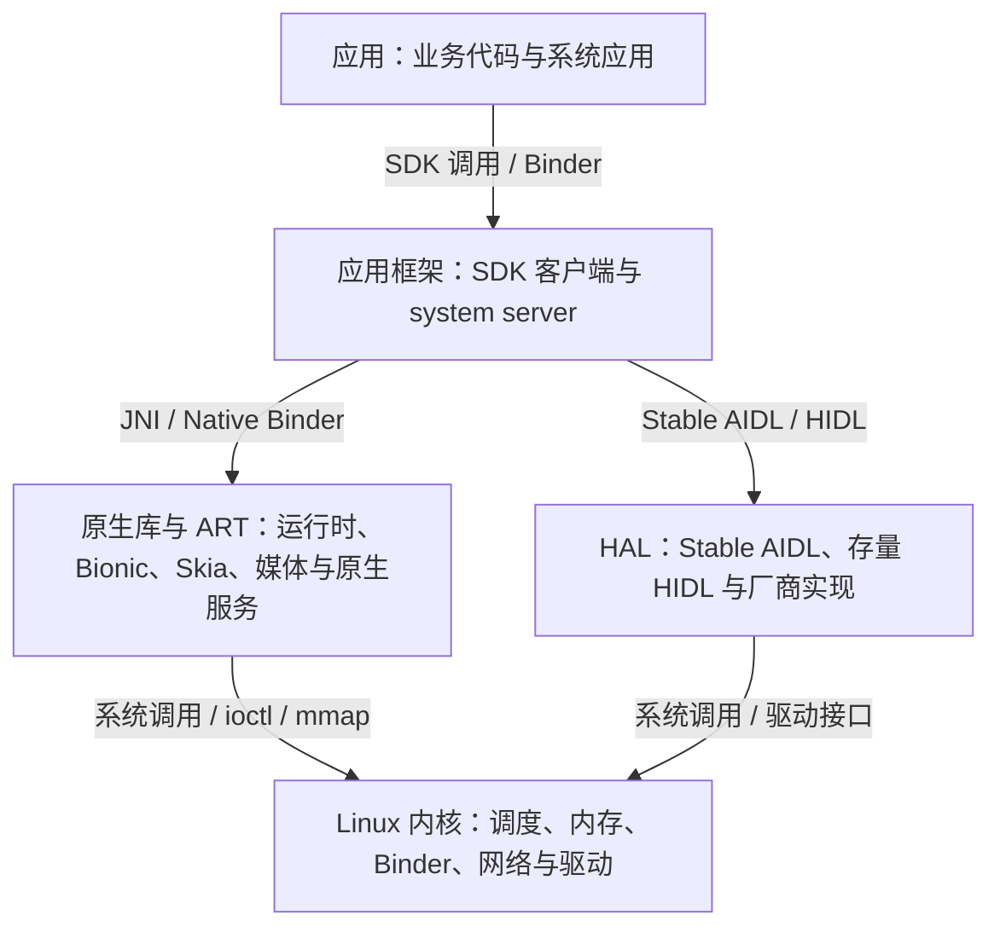

# Android 系统架构

> 学习资料（文章模式沉淀）。主线：分层架构与进程边界、跨层接口、HAL 与 Treble、近年架构边界、进程与线程的架构分工。源文档：android-internals-wiki §1.1《Android 分层架构、进程模型与线程协作》（机制按 AOSP `android-17.0.0_r1` 与 ACK `android17-6.18-2026-06_r6` 核对）；16 KB 分发时间线、应用沙箱与 ART 编译策略已于 2026-09-23 与官方资料核对。启动全链路（init、.rc、Zygote、system_server、应用进程诞生）见 [02-Android系统启动流程.md](./02-Android系统启动流程.md)。Q 序列即结构，供 atlas 同源直读。

**Q1: Android 的五层架构怎么理解？**

五层按**职责**划分系统组件：应用、应用框架、原生库与 ART、HAL、Linux 内核。

各层的职责：

1. **应用层**：系统应用与用户安装的 App（Launcher、电话、浏览器、业务应用），负责业务逻辑与界面交互，运行在各自的进程里；
2. **应用框架层**：Java/Kotlin SDK API 的实现——Activity、View 等客户端代码在每个应用进程，AMS/ATMS、WMS、PMS 等系统服务宿主在 `system_server`，统一管理组件生命周期、窗口、包与权限；
3. **原生库与 ART 层**：ART 负责 dex 的编译执行（AOT/JIT）、GC 与线程管理；Bionic libc、Skia/HWUI、SQLite、libbinder 等原生库提供系统能力；SurfaceFlinger、AudioFlinger 等独立原生服务也属这一层；
4. **HAL 层**：硬件抽象层，把显示合成、相机、音频、蓝牙等硬件能力封装成标准接口（Stable AIDL、存量 HIDL），向上屏蔽芯片与厂商差异；
5. **Linux 内核层**：提供进程调度、内存管理、电源管理、Binder 驱动、网络栈与设备驱动，是进程隔离与硬件访问的基石。

**Q2: Android 实际工作场景中都有哪些架构问题？如何定位架构问题？**

真实架构问题的共同形态是"现象在应用、根因可能在任何一层"：典型场景如主线程同步 Binder 调用过长、SurfaceFlinger 合成变长、Camera 请求返回慢。定位的标准动作是沿"进程 → 跨层接口 → 线程状态 → 内核等待对象"逐边界取证，每多跨一个边界就多保存一份证据。

三个典型场景的取证路径：

1. **主线程同步 Binder 很长**：先取调用方 Binder 时间片、目标进程与线程，向下追目标线程的调度、锁、I/O 与下游 Binder；不要直接得出"Binder 驱动慢"；
2. **`surfaceflinger` 的 composite 变长**：先取 SF 主线程、CompositionEngine、HWC/RenderEngine 事件，向下追合成类型、同步栅栏、GPU/HWC 与图层变化；不要直接得出"一定是应用绘制慢"；
3. **Camera 请求返回慢**：先取应用框架、CameraService 与 HAL 间的事务及请求 ID，向下追 HAL 线程、FMQ/缓冲区、同步栅栏、驱动与传感器；不要直接得出"HAL 只是接口，不会延迟"。

通用定位流程：

1. 确定工作发生在哪个进程（进程树/`ps`）；
2. 确认调用跨过哪些接口——同步 Binder 调用可沿 Perfetto 的流向关联（flow）找到目标进程的处理线程；
3. 看目标线程状态，按状态判读等待原因；
4. 涉及图形、相机、音频等大数据时，把控制命令、缓冲区生命周期、同步栅栏分开看；
5. 回到源码确认时间片段对应的执行边界。

线程状态（第 3 步）按含义与排查方向判读：

1. **Running**：正在 CPU 上执行，看执行内容判断在算什么；
2. **Runnable**：在等 CPU，结合优先级、频率、温控；
3. **Sleeping**：通常在等事件——Binder 回复、futex 锁、epoll、I/O；
4. **Uninterruptible**：不可中断等待，看 `wchan` 与驱动事件。

收尾判断规则：调用 API 的进程不是根因的唯一候选，单看一张 `dumpsys` 快照没有时间线，定不下因果。

**Q3: Android 五层架构之间是通过什么方式通信的，可以跨层通信吗？**

层与层之间通过各边界上的明确定义接口通信：同进程的跨界是进程内函数调用或 JNI，跨进程的跨界必须走显式 IPC（Binder 等）。五层是职责划分，不是调用管线，上层可以跳过中间层直达下层。

各边界的典型接口：

1. **应用 → 应用框架**：进程内经 SDK API 调用客户端代码，跨进程经 Binder 进入 `system_server`；
2. **应用框架 → 原生库与 ART**：JNI 调入 Framework 原生库，框架服务之间走原生 Binder；
3. **框架 → HAL**：Stable AIDL 或存量 HIDL（hwbinder），大数据辅以 FMQ 共享缓冲；
4. **原生库/HAL → 内核**：系统调用、`ioctl`、`mmap` 与设备节点。

跳过中间层的直达是常态：应用可以经 Bionic 直接发起文件系统调用，直达内核而不经过框架服务和 HAL；SurfaceFlinger 可以直接对接 Composer HAL 和 DRM 显示子系统。

**Q4: Android 车机中都有哪些链路场景？**

车机的链路按数据流向分九类：输入、显示渲染、摄像头影像、音频、车辆信号、互联投屏、网络与升级、定位导航、系统与电源；每条链路都是"物理源 → 总线/驱动 → 框架服务 → 应用呈现或执行"的端到端通路。

**输入链路**

1. **触摸屏**：触摸 IC → I2C/SPI → 内核触摸驱动 → EventHub/InputReader → InputDispatcher → 应用窗口；
2. **物理按键与旋钮**：GPIO/ADC → 内核按键驱动 → input 事件 → 系统响应（返回、音量、空调旋钮）；
3. **方向盘方控按键**：按键 → 车身 CAN → VHAL → CarService 转成按键事件 → 媒体/语音/仪表响应；
4. **语音**：麦克风阵列 → 音频 codec → 音频 HAL → 唤醒与识别引擎 → 语义执行；反向播报走 TTS → AudioFlinger → 扬声器，多音区要区分主驾/副驾/后排拾音与回声消除。

**显示渲染链路**

5. **应用上屏**：App 绘制 → RenderThread/GPU → BufferQueue → SurfaceFlinger 合成 → Composer HAL → 显示控制器 → 屏幕（LVDS/eDP）；
6. **多屏输出**：主屏、副驾屏、后排娱乐屏各自作为 display，由 DisplayManager/SurfaceControl 分发渲染；
7. **仪表与 HUD**：集群屏或 HUD 的独立渲染链路（AAOS ClusterService 或独立仪表系统）。

**摄像头影像链路**

8. **倒车影像（RVC）**：R 挡信号 CAN → VHAL → CarEvsService → EVS HAL → 相机（SerDes → CSI）→ 视频帧直送上屏，绕过标准相机框架以压低延迟；
9. **360 环视（AVM）**：四路鱼眼相机 → ISP 去畸变与拼接 → 鸟瞰图 → 显示；
10. **行车记录（DVR）**：相机 → 硬件编码器 → 文件循环写入；
11. **DMS/OMS**：红外/RGB 相机 → 疲劳与乘员监测算法 → 提示或整车联动；
12. **拍照与录像应用**：Camera2/CameraX → CameraService → 相机 HAL → ISP → sensor。

**音频链路**

13. **本地媒体播放**：App → AudioTrack → AudioFlinger（焦点与混音）→ 音频 HAL → codec/DSP → 功放 → 扬声器；
14. **U 盘媒体**：U 盘 → USB 存储挂载 → MediaProvider 扫描 → 播放；
15. **收音机**：tuner 芯片 → I2C/SDIO → 广播 radio 服务 → 应用；
16. **蓝牙音乐（A2DP）**：手机 → 蓝牙控制器 → 协议栈 A2DP Sink → AudioFlinger → 扬声器；
17. **蓝牙电话（HFP）**：手机蜂窝通话音频经蓝牙 SCO 通路落到车机麦克风与扬声器；
18. **蜂窝电话**：拨号 → Telecomm → RIL/modem → 通话音频通路；
19. **eCall 紧急呼叫**：碰撞信号或手动触发 → TBOX → 蜂窝呼叫与车辆数据上报；
20. **提示音与多音区混音**：导航播报、雷达提示、chime 与媒体按 CarAudioService 的焦点和多音区策略混音输出。

**车辆信号链路**

21. **车况信号**：CAN 报文 → 收发器/MCU → VHAL → CarPropertyService/CarService → 应用（车速、挡位、胎压、里程）；
22. **空调控制（HVAC）**：UI → CarHVACManager → VHAL → CAN → 空调控制器，状态反向回显；
23. **倒车雷达**：超声波探头 → MCU → CAN → VHAL → 距离显示与提示音。

**互联投屏链路**

24. **手机互联**（CarPlay/CarLife/ICCOA/HiCar）：USB/Wi-Fi 连接 → 互联服务 → 视频流解码合成上屏 + 音频路由 + 触摸事件回传手机；
25. **蓝牙连接**：配对 → BT 协议栈并行起电话簿（PBAP）、音乐、电话多服务。

**网络与升级链路**

26. **蜂窝数据**：SIM → modem（RIL）→ netd/ConnectivityService → 应用；
27. **Wi-Fi 与热点**：wpa_supplicant/HostAPd → Wi-Fi HAL → ConnectivityService；
28. **TBOX 远控**：手机 App → 云平台 → TBOX（4G/5G）→ CAN → 整车执行（远程空调、寻车、解锁）；
29. **OTA 升级**：云端推送 → 下载校验 → A/B 双分区后台安装（updater_engine）→ 重启切槽。

**定位导航链路**

30. **卫星定位**：GNSS 模组 → 串口 → GNSS HAL → LocationManager → 导航引擎 → 地图渲染与语音播报；隧道内靠惯导航位推算续接。

**系统与电源链路**

31. **开机启动**：BootROM → bootloader → kernel → init → Zygote → `system_server` → CarService → Launcher；
32. **休眠与唤醒**：下电休眠（suspend 与唤醒源管理）→ ACC ON 快速唤醒恢复现场；
33. **电源状态联动**：ACC/挡位/大灯等信号 → 电源管理服务 → 应用生命周期与资源调度（如倒车时媒体让路）。

**按通信方式归类**

同一条链路的不同段使用不同通信方式；上列 33 条链路的每一段都归属以下六类之一：

1. **进程内调用与 JNI**：不跨进程的段——应用上屏的 App → RenderThread/GPU、语音链路里识别引擎的内部处理、蓝牙协议栈内部的协议处理；
2. **Binder / AIDL**：应用与框架服务、框架服务与 Stable AIDL HAL 之间的段——方控按键与车况信号（VHAL → CarService → 应用）、HVAC、倒车雷达、拍照录像（App → CameraService → 相机 HAL）、蜂窝电话（Telecomm → RIL）、GNSS 上报、Wi-Fi 与蜂窝数据的服务段、OTA 的 updater_engine、多音区混音策略（CarAudioService）；
3. **HIDL / hwbinder**：存量服务化 HAL 的段——旧平台的音频、相机、收音机 radio HAL，迁移完成后由 Stable AIDL 取代；
4. **FMQ / 共享缓冲（大数据面）**：倒车影像与 360 环视的视频帧、拍照录像与 DMS/OMS 的图像流、媒体与语音的 PCM、手机互联的视频流、上屏链路的 graphic buffer；
5. **系统调用 / ioctl / mmap**：触摸与按键的 input 设备节点读取、GNSS 串口读取、U 盘挂载后的文件读取、DVR 的编码与文件写入、OTA 的块设备写入、进程启动的 fork/exec、全部网络 socket、休眠唤醒的 sysfs 节点、显示控制器的 DRM/KMS 调用；
6. **专用总线与外设接口（物理段）**：CAN（方控、车况、HVAC、倒车雷达、R 挡信号、TBOX 下发）、I2C/SPI（触摸 IC、tuner、功放）、GPIO/ADC（物理按键）、UART（GNSS、部分蓝牙控制器）、USB（U 盘、手机互联）、CSI/SerDes（相机）、I2S/DAI（音频 codec）、LVDS/eDP（屏幕）。

**按五层间边界归类**

每条链路都能拆成若干"层间段"，33 条链路用到的层间边界共五类：

1. **应用 ↔ 应用框架**：SDK 调用与系统服务 Binder——CameraService、CarService/CarPropertyService/CarHVACManager、AudioTrack/AudioRecord、LocationManager、Telecomm、ConnectivityService、DisplayManager，几乎每条链路的应用侧都是这一段；
2. **应用框架 ↔ 原生库与 ART**：JNI 与框架服务内部的原生处理——AudioFlinger 混音、SurfaceFlinger 合成、蓝牙协议栈、ISP/环视拼接算法、InputReader 与 InputDispatcher；
3. **原生库/框架 ↔ HAL**：Stable AIDL、存量 HIDL 与 FMQ 数据面——Composer、EVS、相机、音频、radio、GNSS、RIL、VHAL 的调用与大数据传输；
4. **HAL/原生 ↔ 内核**：对内核的设备节点与 ioctl/mmap——VHAL 的 CAN 套接字、音频 ALSA、相机 v4l2/CSI、GNSS 串口、显示 DRM/KMS、触摸与按键的 input 节点、OTA 块设备、网络 socket；
5. **内核 ↔ 硬件**：物理总线段——CAN、I2C/SPI、GPIO/ADC、UART、USB、CSI/SerDes、I2S/DAI、LVDS/eDP。

三个典型链路的分段拆解：

1. **本地媒体播放**：应用↔框架（AudioTrack）→ 框架↔原生（AudioFlinger 混音）→ 原生↔HAL（音频 HAL）→ HAL↔内核（ALSA）→ 内核↔硬件（I2S 到 codec 与功放）；
2. **车况信号**：内核↔硬件（CAN）→ HAL/原生↔内核（VHAL 设备节点）→ 原生↔HAL（VHAL AIDL）→ 应用↔框架（CarPropertyService）；
3. **触摸屏**：内核↔硬件（I2C）→ HAL/原生↔内核（input 设备节点）→ 框架服务内部（InputReader → InputDispatcher，原生实现）→ 应用↔框架（input 通道送达窗口）。

排查时先按现象对号入座找到所属链路，再叠用两个分类维度取证：层间边界指出段发生在哪两层之间、该到哪个进程取证；通信方式指出该用什么手段取证——跨进程段查 Binder/HIDL 的事务与线程状态，大数据段查共享缓冲与同步栅栏，物理总线段抓总线报文与驱动日志。链路随车型配置增减（无 HUD、无 DMS 的车型对应链路不存在），本清单按全配置车型列出。

**Q5: Android 架构层级与进程是什么关系？一个应用进程都包含哪些层级的代码？了解这些有什么用？**

一个普通应用进程里同时运行着四套来自不同层的代码——应用自身代码、Framework 客户端代码、ART 运行时和原生库，它们共享同一个地址空间和同一个进程生命周期：

1. **应用代码**：dex 字节码、业务线程、应用自带的 `.so`；
2. **Framework 客户端**：`android.jar` 对应的系统 API 实现（Activity、View、各系统服务的 Binder 代理），装在 boot classpath 里；
3. **ART**：dex 的 AOT/JIT 混合编译（安装/运行期把热点代码编译成本地代码）、GC、线程管理；
4. **原生库**：Bionic libc、libbinder、图形（Skia/HWUI）等，随系统镜像提供。

层与进程是多对多关系，一个进程承载多层的代码，一个层也散布在多个进程：

1. 一个应用进程同时装着应用代码、Framework 客户端代码、ART 和原生库；
2. `system_server` 混合 Java 服务与 JNI 库；
3. SurfaceFlinger 是独立原生服务进程；
4. HAL 可能是独立 Binder 服务进程，也可能以共享库形式加载进调用方进程。

了解这些的用处有三点：

1. **崩溃归属**：任何一层的缺陷都表现成"这个进程的问题"——进程崩溃或被杀带走全部四套代码，不能因为"我的业务代码没问题"就排除 Framework、ART 或原生库的原因；
2. **性能归属**：耗时在业务逻辑、Framework 分发、ART（GC/JIT）还是原生库/渲染线程，优化动作完全不同；
3. **安全边界**：进程边界就是沙箱边界，每个应用默认独占一个 Linux UID 和一个进程，跨进程访问必须走 Binder 等显式 IPC。

**Q6: `system_server` 进程都包含哪些层级的代码？了解这些有什么用？**

`system_server` 是"应用框架层服务端"的宿主进程：里面运行着几百个 Java 系统服务（AMS/ATMS、WMS、PMS 等，按 Bootstrap/Core/Other/Apex 四组启动）、Framework 的 JNI 库、ART 运行时和 Binder 原生库；它由 Zygote fork 出来，继承预加载的类与资源，接收 Binder 事务的线程池在进入 `SystemServer.main()` 之前就已启动。

它**不包含**的东西同样重要：SurfaceFlinger 是独立原生服务进程，HAL 或是独立进程、或是加载进调用方的共享库——"应用框架"这个层名不等于"某一个进程"。

了解这些的用处有三点：

1. **框架单点**：`system_server` 崩溃意味着整个框架重启——Zygote 检测到其死亡后自杀，由 init 重启 Zygote 再重新 fork；各应用的日常 Binder 调用大量落在这里，它的卡顿是全局性卡顿；
2. **慢的归属**：`system_server` 内的排队和锁竞争是系统服务的开销，不要算到应用头上；
3. **进程归属**：定位问题前先确认进程，别把层名当进程名用。

**Q7: Zygote 在 Android 进程模型里扮演什么角色？为什么应用进程要用 fork 而不是各自独立启动？**

Zygote 是带完整 ART 运行时和预加载类/资源的模板进程，所有应用进程和 `system_server` 都由它 fork 出来，用"写时复制"换取启动速度和内存共享。init 第二阶段解析 `.rc` 后启动 Zygote；Zygote 完成类与资源预加载、直接 fork 出 `system_server` 后，进入 socket 循环等待后续进程创建请求。

fork 之后父子进程共享未修改的物理页，写入时才真正复制（Copy-on-Write），所以新进程并不携带一份完整内存副本；子进程随后完成 specialize——设置到目标应用的 UID/GID、SELinux 域、seccomp 等安全身份——再进入 `ActivityThread.main()`。选择 fork 而非独立启动的原因：

1. **省时间**：不必每进程重新初始化 ART、加载几千个预加载类；
2. **省内存**：预加载页与未写脏页被所有应用进程共享；
3. **同一起点**：所有进程从一致的运行环境出发。

边界：COW 不等于零成本——后续写入和应用初始化会逐步产生私有页；普通应用的创建请求由 `system_server` 经 Zygote/USAP 本地 socket 发起，而 `system_server` 自己是 Zygote 在进入 socket 循环前一步直接 fork 的，两条路径不同（深挖见 [02-Android系统启动流程.md](./02-Android系统启动流程.md)）。

**Q8: HAL 有哪几种存在形态？Treble 之后 system 与 vendor 的边界靠什么维持兼容？**

HAL 有三种存在形态：Stable AIDL HAL（以 Binder 服务进程运行）、服务化（binderized）HIDL HAL（独立服务进程，走 hwbinder）、直通式（passthrough）HIDL HAL（以共享库加载进调用方进程，没有独立 HAL 进程）。Project Treble（Android 8.0 起）用"稳定接口 + VINTF 清单"维持 system/vendor 分区的可组合性。

形态直接决定排查路径：

1. **服务化实现**：调用沿 Binder 进入 HAL 进程，查服务线程、锁、系统调用与同步栅栏；
2. **直通式实现**：代码留在调用方进程，查原生调用栈和共享库内部等待。

兼容机制上，新 HAL 接口已转向 Stable AIDL（用于 system/vendor 边界时需声明 VINTF 稳定性），VINTF 清单与框架端、设备端的兼容矩阵共同决定一个具体的系统镜像与厂商镜像组合是否可安装；稳定接口保证"只更系统框架"成为可能，但不保证任意组合都兼容。

边界：Android 17 设备上仍可能保留存量 HIDL HAL 以兼容旧厂商镜像，不能仅凭系统版本假定全部 HAL 已迁移。

**Q9: 16 KB 页大小、Mainline 模块化、VNDK 废弃——这三个近年架构边界分别改变了什么？**

三者分别在二进制兼容、系统模块分发、system/vendor 原生库依赖三个维度收紧或移动边界：16 KB 页改变原生库的对齐要求，Mainline 让部分系统组件绕过整机 OTA 独立更新，VNDK 自 Android 15 起废弃、厂商依赖的库改为随厂商镜像自带。

1. **16 KB 页大小**（Android 15 起支持）：只含 Java/Kotlin 代码的应用通常无需改造；含 NDK 库或经 SDK 间接引入 `.so` 的，要检查 ELF 的 `LOAD` 段对齐与 APK 内未压缩原生库的 ZIP 对齐；设备当前页大小用 `adb shell getconf PAGE_SIZE` 读取（4096/16384）。Google Play 时间线：2025-11-01 起新应用与更新（targetSdk 35 及以上）须支持 64 位设备的 16 KB 页，可申请延期至 2026-05-31，2027-02-01 起不支持的更新无法发布——这是分发要求，不等于所有设备都运行在 16 KB 模式。
2. **Mainline**：系统组件封装为 APEX/APK，可经 Play 系统更新独立升级，所以同版本号设备的 ART、Media、Wi-Fi 等模块实现可能不同；分析问题要同时记录 build fingerprint 和相关模块版本；模块能变实现，但变不了稳定 SDK/System API、稳定 C API 或 Stable AIDL 边界。
3. **VNDK 废弃**（Android 15 起）：新的 vendor/product 分区不再声明 `ro.vndk.version`，原 VNDK 库改按 vendor-available 库安装进厂商镜像；但动态链接器命名空间隔离没有随之删除，加载前的可访问性校验仍在——"VNDK 废弃 = 命名空间隔离取消"是错误推论。

**Q10: WindowManagerService 和 SurfaceFlinger 各自负责什么？为什么说它们是"层≠进程"的典型实例？**

WMS 与 SurfaceFlinger 分管显示链路的"策略世界"和"像素世界"，策略与合成解耦，两个角色互不隶属、不能合并进同一个"应用框架进程"标签：

1. **WMS**：运行在 `system_server`，管窗口容器、层级、焦点、配置，产出图层描述；
2. **SurfaceFlinger**：init 启动的独立原生服务进程，收集各应用的图层与缓冲区，借助 CompositionEngine、RenderEngine 和 Composer HAL 在每个 vsync 周期合成上屏。

对排查的意义：判断"界面没动"时两侧都要查——可能是 WMS 侧没有产生布局/层级变化，也可能是 SF 侧没有合成新帧或提交被栅栏卡住；`system_server` 与 SF 通过明确接口协作，一方的卡顿与崩溃不会自动等同于另一方。这也是"属于同一层（框架层）却在不同进程、不同语言、不同崩溃域"的最直接例证。

**Q11: Android 的进程回收架构由哪些角色组成？杀、冻、压分别是谁在做什么？**

进程回收是一条四角色流水线：OomAdjuster（在 `system_server` 内）按组件状态和依赖关系计算每个进程的回收优先级（adj，数值越小越受保护）并同步给 lmkd；lmkd 在用户态监控内存压力并决定杀谁；缓存进程冻结器（Freezer）通过 cgroup 暂停缓存进程但不杀；mmd（Android 17 新增）负责 ZRAM 内存压缩维护。杀、冻、压是三种不同操作，由不同角色执行。

1. **OomAdjuster**：组件活跃状态 + 依赖传播（谁绑定了谁、谁在用谁的 Provider）决定进程重要性，输出 adj、procState、schedGroup、能力标志四组结果；
2. **lmkd**：基于 PSI（内核统计资源停顿时间）、swap 剩余、页面回收再访问（refault）等信号挑选合格目标并发送 SIGKILL，不是"杀 RSS 最大的进程"；
3. **Freezer**：冻结 = 进程还在、线程不调度（cgroup.freeze），缓存进程到达阈值且策略允许时才冻结；冻结下同步 Binder 事务异常可导致进程被终止；
4. **mmd**：ZRAM 重压缩、写回、预取，改变缓存进程的内存驻留与回切代价，不取代 lmkd 的终止决策。

排查按症状走三条证据链：

1. **进程没了**：查退出原因（`dumpsys activity exit-info`）与 lmkd 日志；
2. **进程在但不跑**：查冻结状态（`dumpsys activity processes`、cgroup.freeze 文件）；
3. **回切慢**：查 ZRAM 写回与预取记录。

**Q12: 一个 Android 应用进程内部有哪几类固定线程角色？一次点击到上屏经过哪些线程？**

进程内固定有四类线程角色——主线程、RenderThread、Binder 线程池和各类后台执行器；一次点击沿"主线程输入分发 → 业务逻辑 →（可能跨进程的 Binder 调用）→ 主线程测量布局并记录显示列表 → RenderThread 渲染提交 → SurfaceFlinger 合成"行进，任何一环阻塞都可能丢帧。

1. **主线程**：由 `ActivityThread.main()` 启动 Looper 消息循环，承载生命周期回调、输入分发、测量/布局和显示列表记录；它上面的长消息是掉帧的最直接原因。
2. **RenderThread**：硬件加速窗口才有，消费主线程记录的显示列表、准备并提交 GPU 工作；与主线程在帧同步点交接——既不是"主线程提交后立即自由"，也不是"等 GPU 画完整帧"。
3. **Binder 线程池**：接收跨进程调用；远程 AIDL 回调默认落在这里而不是主线程，实现必须自己保证线程安全；主线程主动发起同步 Binder 调用时同样会被拖住。
4. **后台执行器**：协程、线程池、HandlerThread 等；选择依据是生命周期绑定、持久化、串行/并发需求——HandlerThread 只在任务需要 Looper 亲和时用，需在进程重启后仍存活、由约束触发的持久任务交给 WorkManager。

边界：软件渲染窗口不走硬件渲染路径；协程改变的是任务结构不是速度，`Dispatchers.Main` 上的协程仍然占用主线程。

**Q13: 应用的所有请求都需要经过 Android 的五层架构吗？**

不需要。五层是职责划分，不是一条所有请求都必须流经的调用管线：一次请求只穿过它实际跨越的层，很多高频请求完全绕开"应用框架服务"这一层，数据面请求也常常不经 HAL。

按请求类型分开看：

1. **管理类、跨应用类**：通常经 Binder 进入 `system_server`——安装/查询应用（PMS）、启动组件（AMS/ATMS）、窗口操作（WMS），之后才可能继续向下到原生库、HAL 与内核；
2. **进程内数据面**：文件读写和绝大多数计算在应用进程内完成——Java API 只是进程内库函数（libcore/Bionic），直达系统调用进入内核，不经过框架服务进程；
3. **图形**：应用经 Skia/HWUI 提交到 GPU 驱动（内核），合成在独立的 SurfaceFlinger 进程对接 Composer HAL 与 DRM 显示子系统；
4. **相机、音频**：Binder 只传控制命令，数据经共享缓冲区/FMQ 直达 HAL 与驱动，控制路径和数据路径不同。

判断方法：把一次操作拆成"控制命令走哪、数据走哪"，数它跨过的进程和边界，就知道该去哪些进程取证；"应用发起的请求"不等于"会逐层经过五层"。

**Q14: Android 五层架构中各层的典型对象是什么？**

各层的典型对象（按 AOSP `android-17.0.0_r1` 语境）及其典型所在位置：

1. **应用**：`Activity`、Compose/View、业务线程、RenderThread——各应用自己的进程；
2. **应用框架**：`ActivityTaskManagerService`、`WindowManagerService`、`PackageManagerService` 等——服务端在 `system_server`，SDK 客户端代码在每个应用进程；
3. **原生库与 ART**：ART、Bionic、Skia、SQLite 随进程加载；SurfaceFlinger、AudioFlinger、媒体服务是独立原生服务进程；
4. **HAL**：Stable AIDL HAL、存量 HIDL HAL、厂商实现——独立 Binder/hwbinder 服务进程，或直通式加载进调用方进程；
5. **Linux 内核**：调度器、内存管理、Binder 驱动、网络栈、文件系统、DMA-BUF、设备驱动——内核空间。

两个注意点：

1. "典型对象"按 Android 17 源码核对，具体类名会随版本迁移（如进程状态相关实现已移入 `com.android.server.am.psc`），引用时要带版本；
2. 这份清单再次说明层与进程不是一一对应——同一层里既有进程内对象，也有独立服务进程，SurfaceFlinger、AudioFlinger 属"原生库与原生服务"，却不在 `system_server` 里。

**Q15: 公共内核是什么？量产设备都会使用吗？厂商会修改什么、为什么？**

公共内核指 Android Common Kernel（ACK）——Google 基于上游 Linux 内核（通常选 LTS 分支）维护、包含 Android 所需驱动与特性（Binder 驱动、PSI 等）的公共内核分支；GKI（Generic Kernel Image，通用内核镜像）项目进一步把它变成"Google 统一构建的核心内核镜像 + 厂商可加载模块"的形态。量产设备不是原样照搬：核心镜像来自 ACK/GKI，厂商在之上叠加自己的部分。

1. **谁在用**：Android 12 起新发布的设备按 GKI 2.0 形态出货（核心内核 5.10 起）；存量升级设备可能仍运行厂商旧内核，所以"量产设备都会使用"只对新发布设备成立；
2. **厂商改什么**：SoC/板级硬件驱动以厂商模块形式加载（装在 vendor_boot/vendor_dlkm 等分区）、设备树与产品配置、电源/温控/调度策略调优（经 ACK 预留的 vendor hooks 挂回调）；核心内核镜像本身不打厂商补丁；
3. **为什么**：内核碎片化曾让同一版本 Android 背着几十种内核 fork，安全补丁与上游更新无法统一下发；GKI 把硬件代码移出核心镜像、用稳定的内核模块接口（KMI）解耦，使核心内核可以独立更新而厂商模块不动。

排查边界：公共内核源码标签（如 ACK `android17-6.18-2026-06_r6`）只能核对平台通用机制；具体设备的驱动、配置与调度策略要看设备自己的内核提交版本与 fragment，不能拿公共内核源码当设备内核源码用。

