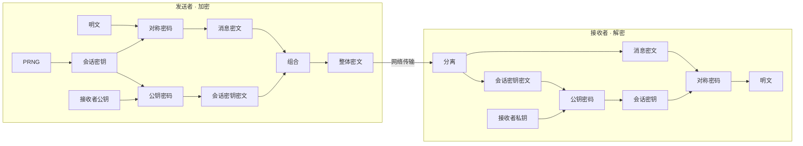

# 第 1 章《环游密码世界》深度解析

> 来源：《图解密码技术（第 3 版）》[日] 结城浩 著 / 周自恒 译
>
> 本章定位：全书的总览章。不深入细节，而是从整体上建立密码世界的"地图"——包括核心概念、主要技术、彼此关系，以及密码界中与一般常识相悖的"密码常识"。

---

## 目录

1. [本章要解决的问题](#1-本章要解决的问题)
2. [基础模型：通信参与者](#2-基础模型通信参与者)
3. [核心概念：加密、解密与机密性](#3-核心概念加密解密与机密性)
4. [破译：解密的对立面](#4-破译解密的对立面)
5. [两大密码体系：对称密码与公钥密码](#5-两大密码体系对称密码与公钥密码)
6. [其他四种密码技术](#6-其他四种密码技术)
7. [密码学家的工具箱：威胁与技术的对应](#7-密码学家的工具箱威胁与技术的对应)
8. [隐写术与数字水印](#8-隐写术与数字水印)
9. [密码与信息安全常识（四条反常识）](#9-密码与信息安全常识四条反常识)
10. [本章知识地图](#10-本章知识地图)

---

## 1. 本章要解决的问题

本章是"环游"性质的导览：**暂且抛开繁琐细节，先从整体上了解密码世界的样子**。

密码技术种类繁多且相互关联、相互补充，如同一块巨大的拼图。本章负责把这块拼图的全貌展示出来，后续章节（第 2~15 章）再逐一深入。

---

## 2. 基础模型：通信参与者

讲解密码需要给参与者命名，本书使用经典密码学教科书惯例（表 1-1）：

| 角色 | 英文 | 说明 |
|------|------|------|
| Alice | — | 一般角色（常为发送者） |
| Bob | — | 一般角色（常为接收者） |
| Eve | eavesdropper | 窃听者，只能被动窃听通信内容 |
| Mallory | malicious | 主动攻击者，可妨碍通信、伪造消息 |
| Trent | trusted | 可信的第三方 |
| Victor | verifier | 验证者 |

**场景模型**（以 Alice 发邮件给 Bob 为例）：

- **发送者（sender）**：发出信息的人 → Alice
- **接收者（receiver）**：收到信息的人 → Bob
- **消息（message）**：被发送的信息
- **窃听者（eavesdropper）**：邮件在互联网上要经过多台计算机和通信设备中转，途中可能被第三方偷看

> ⚠️ 重要认知：窃听者不一定是一个"人"。可能是安装在通信设备上的窃听器，也可能是邮件软件/服务器上的恶意程序。明文消息只要经过网络，就有被第三方获知的风险——**不采取对策，机密性就无从谈起**。

---

## 3. 核心概念：加密、解密与机密性

### 3.1 加密与解密

- **明文（plaintext）**：加密之前的消息，人可以理解其含义
- **密文（ciphertext）**：加密之后的消息，人无法理解其含义
- **加密（encrypt）**：明文 → 密文
- **解密（decrypt）**：密文 → 明文（由合法接收者进行）

> 💡 补充认知：明文/密文的划分与"谁读取"无关——明文也可能本就是供计算机读取的数据（如配置文件、程序指令、二进制协议数据）。"人能读懂"只是明文最常见的形态，不是定义要件。

```
Alice 的明文 --[加密]--> 密文 --[网络传输，Eve 窃听]--> 密文 --[解密]--> Bob 的明文
```

### 3.2 机密性（confidentiality）

Alice 加密、Bob 解密的根本目的：**不让窃听者 Eve 读取消息内容**。运用密码技术保证消息的机密性。

核心效果：即使消息被窃听，Eve 得到的也只是密文，无法得知明文内容。

---

## 4. 破译：解密的对立面

- **解密（decrypt）**：合法接收者将密文还原为明文
- **密码破译 / 破译 / 密码分析（cryptanalysis）**：接收者以外的人试图将密文还原为明文
- **破译者（cryptanalyst）**：进行破译的人

> 💡 认知纠偏：破译者不一定是坏人。密码学研究者为了评估**密码强度**（即破译的困难程度），也经常主动破译密码——这正是验证算法可靠性的方式。

**思考案例：日记的密码**——Alice 用文字处理软件写日记，保存时加密、阅读时解密。此时发送者和接收者都是 **Alice 自己**：准确地说，发送者是加密时的 Alice，接收者是解密时的 Alice——她把密文发给了"未来的自己"。

---

## 5. 两大密码体系：对称密码与公钥密码

### 5.1 密码算法（algorithm）

- **算法**：用于解决复杂问题的步骤
- **加密算法**：从明文生成密文的步骤
- **解密算法**：从密文恢复明文的步骤
- **密码算法**：加密算法 + 解密算法的统称

### 5.2 密钥（key）

- 现实世界的钥匙：形状微妙复杂的小金属片
- 密码世界的密钥：**一个非常大的数字**（如 203554728568477650354673080689430768）

关键认知：

- 加密和解密时**都需要密钥**
- 密钥保护重要数据，就像保险柜钥匙保护贵重物品——**保险柜再坚固，钥匙被盗则一切白搭**。同理，密钥被窃取，加密形同虚设

### 5.3 对称密码 vs 公钥密码

| 对比项 | 对称密码 | 公钥密码 |
|--------|----------|----------|
| 加密/解密密钥 | 同一密钥 | 不同密钥 |
| 别名 | 共享密钥密码 | 非对称密码（asymmetric cryptography） |
| 出现时间 | 历史悠久 | 20 世纪 70 年代，引发密码学界重大变革 |
| 地位 | 第 3、4 章详讲 | 现代计算机/互联网安全体系的重要基石，第 5 章详讲 |

### 5.4 混合密码系统（hybrid cryptosystem）

- **定义**：将对称密码与公钥密码结合起来的密码方式
- **优势**：结合两者的优势（对称密码速度快、公钥密码密钥配送方便）
- 第 6 章详讲

---

## 6. 其他四种密码技术

密码技术不只提供机密性，还提供**完整性**和**认证**。

### 6.1 单向散列函数（one-way hash function）——保证完整性

- **场景**：下载免费软件时，文件是否与作者发布的完全一致？有没有被植入恶意程序？
- **做法**：发布者公布文件的**散列值**；下载者自行计算所下载文件的散列值并比对，一致则文件未被篡改
- **保证的性质**：**完整性（integrity）**——"数据是正牌的而不是伪造的"
- 第 7 章详讲

### 6.2 消息认证码（message authentication code）——完整 + 认证

- **能力**：不仅确认消息未被篡改（完整性），还确认消息**确实来自所期待的通信对象**（认证 authentication）
- 第 8 章详讲

### 6.3 数字签名（digital signature）——完整 + 认证 + 防否认

针对邮件场景的三大威胁：

| 威胁 | 说明 |
|------|------|
| 伪装（spoofing） | From: 一栏很容易伪造，无法确认发件人身份 |
| 篡改（tampering） | 邮件在传输途中被改（如"1 万元"被改成"100 万元"） |
| 否认（repudiation） | Alice 事后反悔："我根本没发过那封邮件" |

- **数字签名**：将现实世界的签名/盖章移植到数字世界
- **用法**：Alice 对消息内容加数字签名后发送，Bob 对其**验证（verify）**
- **保证的性质**：确保完整性、提供认证、防止事后否认
- 第 9 章详讲

### 6.4 伪随机数生成器（PRNG）——生成密钥

- **定义**：模拟产生随机数列的算法
- **重要性**：承担**密钥生成**的职责。例如 SSL/TLS 通信中的**会话密钥**（仅用于当前通信的临时密钥）就由 PRNG 生成
- **风险**：随机数算法不好 → 窃听者能推测出密钥 → 通信机密性下降
- 第 12 章详讲

---

## 7. 密码学家的工具箱：威胁与技术的对应

**六大核心密码技术**（本书称为"密码学家的工具箱"）：

1. 对称密码
2. 公钥密码
3. 单向散列函数
4. 消息认证码
5. 数字签名
6. 伪随机数生成器

**信息安全威胁 ↔ 应对技术对照表**（图 1-8 的文字化）：

| 威胁 | 应对技术 |
|------|----------|
| 窃听（机密性） | 对称密码、公钥密码 |
| 篡改（完整性） | 单向散列函数、消息认证码、数字签名 |
| 伪装（认证） | 消息认证码、数字签名 |
| 否认 | 数字签名 |
| （密钥生成的基础） | 伪随机数生成器 |

> 这是全书最重要的"总框架"：每一种密码技术都不是孤立存在的，而是相互关联、相互补充。

---

## 8. 隐写术与数字水印

### 8.1 隐写术（steganography）

- **密码（cryptography）**：让消息**内容**无法解读
- **隐写术**：**隐藏消息本身**（让人根本察觉不到消息的存在）

书中示例：一段普通的话每行首字连起来是"我很喜欢你"——消息被嵌入在正常文本中。

### 8.2 隐写术的局限

- 若搞清楚了嵌入消息的方法，就能搞清楚消息的内容 → **隐写术不能代替密码**
- 密码隐藏的是内容，隐写术隐藏的是消息本身

### 8.3 数字水印（digital watermarking）

- **定义**：将著作权拥有者及购买者的信息嵌入文件中的技术
- **局限**：仅凭数字水印无法对信息保密，需与其他技术配合

### 8.4 组合用法

常用组合：**先加密，后隐写**——将要嵌入的文章加密成密文，再通过隐写术将密文藏进图片。即使有人发现密文存在，也无法读出文章内容。密码 + 隐写术 = 同时获得两者的效果。

---

## 9. 密码与信息安全常识（四条反常识）

本章最有价值的部分：**一般常识与密码界常识的差异**，初学者常感不可思议。

### 9.1 不要使用保密的密码算法

企业常见错误想法："自己开发密码算法并保密，就能保证安全。"——**大错特错**。

**理由一：密码算法的秘密早晚会公诸于世。** 历史案例：
- 1999 年：DVD 的密码算法被破解
- 2007 年：NXP 非接触式 IC 卡 MIFARE Classic 的密码算法被破解
- RSA 公司的 RC4 曾保密，最终被匿名人士公开等效程序

一旦算法细节暴露，靠"算法保密"维持的机密性系统**土崩瓦解**；而公开算法从一开始就没打算保密，算法暴露不削弱其强度。

**理由二：开发高强度的密码算法非常困难。** 密码强度不像数学那样能被严密证明，只能靠事实证明——**专业破译者多年尝试破解未果**，才说明强度高。业余者写的"自己的密码系统"外行看着牢不可破，专业破译者眼里手到擒来。

- 这种"靠算法保密来保安全"的行为称为**隐蔽式安全性（security by obscurity）**，危险且愚蠢
- 正确判断标准：把算法细节、源代码全部交给专业破译者，并提供大量明/密文样本，破译新密文仍需相当长时间 → 才是高强度密码

### 9.2 使用低强度的密码比不进行任何加密更危险

一般想法："强度再低也比不加密强吧？"——**错误且危险**。

- 正确想法：**与其用低强度密码，不如一开始就不加密**
- 原因：用户会被"密码"二字带来**错误的安全感**。安全感与密码强度无关，只来自"信息已被加密"这一事实，导致处理机密信息时麻痹大意
- 历史教训：16 世纪苏格兰女王玛丽盲信自己的密码无人能破，把刺杀伊丽莎白女王的计划写在密信中，密码被破译，玛丽被送上断头台

### 9.3 任何密码总有一天都会被破解

- 若产品宣称"绝对不会被破解的密码算法"，安全性要打问号——**不存在绝对不可破的密码**
- 只要把所有可能的密钥全部尝试一遍，总有一天能破译 → **破译所需时间 vs 明文价值**的权衡至关重要
- 严格来说存在"绝对不会被破解"的算法：**一次性密码本（one-time pad）**，但并非现实可用的算法（第 3.4 节详讲）
- 另一项可能造就完美密码的技术：**量子密码**（第 15.4.1 节介绍）

### 9.4 密码只是信息安全的一部分

- 不破解密码算法，仍有大量方法获知消息内容：
  - 攻击者转而攻击 Alice 的电脑，直接获取**加密前的明文**
  - **社会工程学（social engineering）攻击**：冒充 IT 部门打电话让员工把密码改成攻击者指定的值
- 这些攻击都与密码强度无关
- 系统安全观：复杂系统如链条，**强度取决于最脆弱的环节**——而最脆弱的环节往往不是密码，而是**人类自己**（第 15 章深入思考）

> 注意：算法公开不代表必然安全——公开是"可以安全"的必要条件，最终安全性仍取决于算法强度与密钥管理（见 9.1）。

---

## 10. 本章知识地图

```
                        ┌─ 机密性 ← 对称密码（第3-4章）/ 公钥密码（第5章）/ 混合密码系统（第6章）
     密码技术保障的      ├─ 完整性 ← 单向散列函数（第7章）
     信息安全性质        ├─ 认证   ← 消息认证码（第8章）/ 数字签名（第9章）/ 证书（第10章）
                        ├─ 防否认 ← 数字签名
                        └─ 密钥生成基础 ← 伪随机数生成器（第12章）
                                │
第1章 环游密码世界 ──────────────┤
                                ├─ 密码学家的工具箱：对称密码·公钥密码·单向散列函数·消息认证码·数字签名·PRNG
                                ├─ 相关技术：隐写术（隐藏消息本身）·数字水印
                                └─ 四条密码常识：不用保密算法 / 弱密码比不加密更危险 / 任何密码终会被破 / 密码只是安全的一部分
```

### 核心收获清单

1. **术语体系**：明文、密文、加密、解密、破译、密钥、机密性、完整性、认证、否认
2. **角色模型**：Alice/Bob/Eve/Mallory/Trent/Victor——全书分析的通用语言
3. **六大技术总览**：知道每种技术"解决什么问题、保证什么性质"，是理解全书的骨架
4. **威胁-技术映射**：窃听→加密；篡改→散列/认证码/签名；伪装→认证码/签名；否认→签名
5. **四个反常识判断**：这是培养信息安全判断力的起点，后续章节会反复印证

---

# 第 2 章《历史上的密码》深度解析

> 本章定位：以三种历史上著名的密码（恺撒密码、简单替换密码、Enigma）为载体，实践**密码破译**的两种基本方法（暴力破解、频率分析），并思考"密码算法与密钥为什么要分开"这一贯穿全书的核心命题。
>
> 核心提示：本章的密码在现代都已不再使用，但**寻找弱点的方法、破译的思路、算法与密钥的关系**，与现代密码技术依然相通。

---

## 目录

1. [本章要解决的问题](#1-本章要解决的问题-1)
2. [恺撒密码：最简单的平移密码](#2-恺撒密码最简单的平移密码)
3. [简单替换密码：密钥空间急剧膨胀](#3-简单替换密码密钥空间急剧膨胀)
4. [频率分析：破译简单替换密码的利器](#4-频率分析破译简单替换密码的利器)
5. [Enigma：二战中的密码机](#5-enigma二战中的密码机)
6. [Enigma 的弱点与破译](#6-enigma-的弱点与破译)
7. [思考：为什么要将密码算法和密钥分开](#7-思考为什么要将密码算法和密钥分开)
8. [本章知识地图](#8-本章知识地图)

---

## 1. 本章要解决的问题

本章从"写一篇别人看不懂的文章"出发，介绍三种历史密码与两种破译方法：

- **三种密码**：恺撒密码 → 简单替换密码 → Enigma
- **两种破译方法**：暴力攻击（穷举搜索）→ 频率分析
- **一个核心思考**：密码算法与密钥的关系

三个案例形成一条"攻防升级"的进化链：每出现一种更强的密码，就出现一种更强的破译方法将其击破。

---

## 2. 恺撒密码：最简单的平移密码

### 2.1 基本概念

- **起源**：相传古罗马军事统帅尤利乌斯·恺撒（公元前 100 年）曾使用
- **原理**：将明文字母表按照一定字数**平移**来进行加密
- **表示法**：小写字母表示明文（yoshiko），大写字母表示密文（BRVKLNR）

### 2.2 加密示例（密钥 = 3）

明文 `yoshiko` 每个字母平移 3 位：

```
y→B  o→R  s→V  h→K  i→L  k→N  o→R   ⇒  密文 BRVKLNR
```

> 🧮 数学表述：把字母表映射为数字 0~25，加密就是 `cipher = (plain + 3) mod 26`。取模（mod）是为了让 x、y、z（23、24、25）加 3 后能回到字母表开头——这正是第 5 章"时钟运算"（mod 运算）的雏形。

> ⚠️ 关键概念区分：
> - **算法** = "将字母平移"这个操作
> - **密钥** = "平移几个字母"这个数量（本例为 3）
> - 密钥必须由发送者和接收者**事先约定**

### 2.3 解密

使用与加密相同的密钥做**反向平移**：BRVKLNR 反向平移 3 位 → yoshiko。

### 2.4 暴力破解：破译恺撒密码

- 字母表只有 26 个字母 → 密钥只有 **0~25 共 26 种**可能
- 逐一尝试 26 个密钥，当密钥 = 3 时出现有意义的明文 yoshiko → 破译成功
- **暴力破解（brute-force attack）**：将所有可能的密钥全部尝试一遍
- **穷举搜索（exhaustive search）**：暴力破解的本质（从所有密钥中找出正确的）

> 🧮 完整实战：密文 `PELCGBTENCUL` 逐一尝试密钥 0~25，密钥 = 13 时得到有意义的明文 **cryptography**（密码学）。暴力破解的判据只有一个——**试出来的明文是否"有意义"**。

> 💡 结论：恺撒密码密钥空间太小（仅 26），脆弱到无法保护重要秘密。

---

## 3. 简单替换密码：密钥空间急剧膨胀

### 3.1 基本概念

- **定义**：将明文字母表中的 26 个字母，分别与 26 个字母本身建立**一对一对应关系**（替换表），按替换表逐字母替换
- 恺撒密码是简单替换密码的特例（对应关系为"平移"）

### 3.2 加密示例

用书中替换表加密 `yoshiko`：

```
y→K  o→B  s→L  h→T  i→J  k→S  o→B   ⇒  密文 KBLTJSB
```

- **密钥** = 整张替换表，发送者和接收者必须事先同时拥有

### 3.3 密钥空间：为什么暴力破解失效

密钥空间（keyspace）= 某种密码**所有可用密钥的集合**。密钥空间越大，暴力破解越困难。

简单替换密码的密钥总数（全排列）：

```
26 × 25 × 24 × 23 × ... × 1 = 26! ≈ 4 × 10²⁶ ≈ 2⁸⁸
```

- 约等于"4 兆的 100 兆倍"
- 即使每秒遍历 10 亿个密钥，遍历全部密钥需 **120 亿年以上**（平均约 60 亿年）

> ⚠️ 反直觉教训：曾有人"改良"简单替换密码——**禁止任何字母替换成自身**。这反而帮了破译者：破译者原本要推测密文字母 A 对应哪个字母（26 种可能），"改良"后 A 不可能对应 a，一开始就排除一种可能（只剩 25 种）——等于白送一条线索。**对密码的"少许改良"很可能反而降低安全性**——外行改动公认算法是危险行为（呼应第 1 章"不要使用保密的密码算法"）。

> 💡 暴力破解对简单替换密码已经"算力上不可行"——但破译并未结束，频率分析登场。

---

## 4. 频率分析：破译简单替换密码的利器

### 4.1 原理

**明文中的字母出现频率与密文中的字母出现频率一致**——因为替换是一对一固定映射，字母出现频率被完整继承。

英语字母频率参考（爱伦·坡《金甲虫》统计）：`e, t, a, o, i, n, s, h, r, d, l, u, c, m, f, w, g, y, p, b, v, k, j, q, z`——**e 是英语最高频字母，基本不会错**。

### 4.2 破译流程（书中实战：《狐狸和葡萄》）

1. **统计密文字母频率**：I、Y 各 47 次最高 → 假设其中一个是 e（先试 Y→e）
2. **寻找常见词 the**：英语最常见的 3 字母词是 the → 密文中以 e 结尾的 MEE 组合 → 假设 M→t、E→h
3. **利用单词形态**：thPee → three（P→r）；Oet → get（O→g）
4. **利用短语**：thethDWg → the thing（D→i、W→n）；thethingtoQRench → quench（Q→q、R→u）
5. **循环验证修正**：N→c 产生 tricening 不像英语 → 舍弃；后遇 Cannotget → C→c 确认，N→c 证伪
6. **低频字母也是线索**：Q 出现少，但结合上下文锁定 quench
7. **连续重复字母是线索**：UU 连续出现 → hot summer（U→m）
8. **逐步替换直至明文可读**：破译速度会越来越快

最终还原出《伊索寓言·狐狸和葡萄》全文。

### 4.3 破译经验总结（书中提炼）

- 除高频字母外，**低频字母也能成为线索**
- **开头、结尾、单词分隔**都能成为线索
- **密文越长越容易破译**
- **同一字母连续出现**能成为线索（固定映射的必然结果）
- 破译的速度会**越来越快**（滚雪球效应）

### 4.4 历史意义

简单替换密码从公元前起被用于秘密通信数百年，**阿拉伯学者发明频率分析后，这种密码很容易就被破译了**。本章开头爱伦·坡《金甲虫》中的密文即简单替换密码。

---

## 5. Enigma：二战中的密码机

### 5.1 概况

- **发明者**：德国人阿瑟·谢尔比乌斯（20 世纪初）
- **名称含义**：德语中"谜"的意思
- **定位**：用可转动的圆盘（转子）和电路，创造出人类手工无法实现的高强度密码
- **用途演变**：商业领域 → 纳粹时期被德国国防军采用并改良用于军事

### 5.2 通信方式

- 发送者与接收者**各持一台 Enigma**
- 发送者加密明文 → 密文经无线电发送 → 接收者解密
- 双方须使用相同密钥：密钥来自**国防军密码本**（记载每日密码）

### 5.3 构造（三大部件）

| 部件 | 功能 | 特点 |
|------|------|------|
| 键盘 + 灯泡 | 输入/输出字母 | 加密与解密可互换——键与灯泡读法互换，同一台机器两种操作 |
| 接线板（plugboard） | 通过接线方式改变字母对应关系 | 按每日密码接线，一天内不变 |
| 3 个转子（rotor） | 动态改变替换关系 | 每输入一字母转子 1 转 1 格，满一圈进位转子 2……内部接线不可改，但顺序和初始位置可设 |

整体效果：Enigma 是一个**动态变化的"鬼脚图"**——每输入一个字母，替换关系就变一次。

> 🧠 Enigma 的关键特性：无论接线板/转子如何设置，**输入的字母都不可能被替换成它本身**。这既是构造上的固有限制，也成了破译线索——若密文中完全没有字母 L，则明文中相应位置必为 l。实战轶事：曾有发送者故意发送无意义明文（一串 111111……）想干扰破译者，但密文中恰好没有 L，反而暴露了明文内容——本想干扰，却送了线索。

### 5.4 加密五步骤（以加密 nacht 为例）

1. **设置 Enigma**：按国防军密码本的**每日密码**设置接线板与转子
2. **加密通信密码**：发送者想 3 个字母（通信密码，如 psv），输入两次（psvpsv）→ 得密文 ATCDVT
3. **重新设置 Enigma**：按通信密码 psv 设置 3 个转子初始位置
4. **加密消息**：逐字输入明文 nacht → 得密文 KXNWP
5. **拼接发送**：ATCDVT + KXNWP = ATCDVTKXNWP 通过无线电发出

### 5.5 双密钥体系：每日密码与通信密码

- **每日密码**：用于加密通信密码，即"用来加密密钥的密钥" → **密钥加密密钥（KEK）**
- **通信密码**：用于加密消息本身
- **为什么双重加密**：用同一密钥加密的密文越多，破译线索越多、被破译危险性越大 → 每封电文换一个密钥（通信密码），降低风险
- **为什么通信密码输入两次（psvpsv）**：当时无线电质量差，易出错。重复输入让接收者可以校验——解密结果若为"3 个字母重复两次"的形式，则通信无错误

> 💡 KEK 概念在现代依然常用（第 6 章混合密码系统、第 11 章密钥管理都会出现）。

---

## 6. Enigma 的弱点与破译

### 6.1 Enigma 的弱点

1. **加密通信密码时只有转子 1 旋转**：前 6 次输入（最关键步骤）中转子 2、3 不转，替换模式可预测
2. **通信密码重复两次**：破译者知道密文开头 6 个字母解密后必为"3 个字母重复两次"的形式
3. **通信密码由人为选定**：人可能用 aaa、女朋友名字等可预测值 → 密码学铁律：**密钥不能用人为选定的，要用无法预测的随机数生成**（第 12 章）
4. **必须派发国防军密码本**：密码本落入敌手则全盘皆输 → **密钥配送问题**（第 5 章详讲）

### 6.2 破译历程

- **法国/英国**：靠间谍活动获得 Enigma 构造——但拿到机器（算法）没用，因为 Enigma 不依赖**隐蔽式安全性（security by obscurity）**，不知道设置（密钥）就无法破译（呼应第 1 章常识）
- **波兰雷耶夫斯基（Marian Rejewski）**：利用"每日密码一天不变"+"通信密码重复两次"的特点，从密文字母排列组合入手：
  - 3 个转子顺序：3×2×1 = 6 种
  - 3 个转子旋转位置：26×26×26 = 17576 种
  - 制作 6 台机器分别检查 17576 种组合 → **约 2 小时内找到每日密码**
- **接力到英法**：波兰担心希特勒进攻导致线索付之一炬，将情报交给英法
- **布莱切利园 + 图灵**：现代计算机之父阿兰·图灵于 1940 年研制出破译机器——"Enigma 创造了难以破译的密码，战胜 Enigma 的是另一台机器"

> 轶事：破解上述"无 L 密文"谜题的破译者叫 Mavis Lever，是一位女性密码分析员。

> 📚 延伸阅读：《密码故事》（Singh）、《艾伦·图灵传：如谜的解谜者》（Hodges）

---

## 7. 思考：为什么要将密码算法和密钥分开

### 7.1 本章三种密码的"算法/密钥"拆解

| 密码 | 密码算法 | 密钥 |
|------|----------|------|
| 恺撒密码 | 按指定字母数平移 | 平移的字母数量 |
| 简单替换密码 | 按替换表替换 | 替换表 |
| Enigma（通信密码加密） | 接线板+转子顺序+转子位置共同替换 | 每日密码（接线方式、转子顺序、转子位置） |
| Enigma（消息加密） | 固定接线方式与转子顺序，按转子位置替换 | 通信密码（各转子旋转位置） |

**规律**：密码算法中必然存在**可变部分**，这些可变部分就是密钥。算法和密钥都确定时，加密方法也就确定了。

### 7.2 分开的意义：解决"重复使用 vs 重复使用增加风险"的矛盾

- 每次加密都发明新算法不现实 → **算法需要重复使用**
- 但重复使用同一算法，被破译可能性会增大
- **解法**：算法中准备可变部分（密钥），每次通信都改变它 → 既复用算法，又避免密钥长期不变

### 7.3 引向两个重要结论

1. **密码算法可以标准化**：标准化的密码算法作为公有财产被开发、研究、利用，机密性不因公开而降低（呼应 1.7.1"不要使用保密的密码算法"）
2. **密钥才是秘密的精华**：密钥管理成为密码技术的重要课题（第 11 章）

> 引用布鲁斯·施奈尔："每个人都可以拥有相同品牌的锁，但每个人都有不同的钥匙。锁的设计是公开的……但钥匙是秘密的。"——《网络信息安全的真相》

---

## 8. 本章知识地图

```
        密码强度（攻防升级链）                    破译方法
  恺撒密码 ──密钥空间仅 26──→ 暴力破解（穷举搜索）
     │
     ↓ 扩大密钥空间（26!）
  简单替换密码 ────────────→ 频率分析（利用字母统计特性）
     │
     ↓ 机器化 + 动态替换
  Enigma ──────────────────→ 利用弱点 + 高速机器（图灵）
     │
     ↓
  【核心命题】算法 vs 密钥分开
     ├─ 算法 = 可重复使用的固定步骤
     ├─ 密钥 = 算法中的可变部分（每次通信改变）
     └─ 密钥才是秘密的精华 → 密钥管理（第11章）、密钥配送（第5章）
```

### 核心收获清单

1. **暴力破解**：遍历全部密钥空间，适用于密钥空间小的密码（恺撒密码 26 种）
2. **密钥空间**：可用密钥的总数，决定暴力破解的可行性（简单替换密码 26! ≈ 2⁸⁸）
3. **频率分析**：利用明文/密文字母频率一致性破译替换类密码；密文越长越易破译
4. **Enigma 的现代意义**：算法公开不影响安全性（security by obscurity 不可取）；密钥配送问题；KEK 概念
5. **算法/密钥分离**：解决"算法要复用、复用有风险"的矛盾，是全书最重要的概念框架之一
6. **反常识再印证**：对密码的"外行改良"反而降低安全性；密钥必须用随机数而非人为选定

---

# 第 3 章《对称密码（共享密钥密码）》深度解析

> 本章定位：从"文字密码"进入"比特序列密码"时代，讲解对称密码的两大基础工具（编码、XOR）、一个理论极限（一次性密码本），以及三个代表性算法（DES、三重 DES、AES/Rijndael）。
>
> 核心逻辑链：一次性密码本（理论完美但不可用）→ 启发流密码 → DES（可用但已被暴力破解）→ 三重 DES（过渡）→ AES（现行标准）。

---

## 目录

1. [本章要解决的问题](#1-本章要解决的问题-2)
2. [从文字密码到比特序列密码](#2-从文字密码到比特序列密码)
3. [XOR：密码运算的基本单元](#3-xor密码运算的基本单元)
4. [一次性密码本：理论完美的密码](#4-一次性密码本理论完美的密码)
5. [DES：曾经的联邦标准](#5-des曾经的联邦标准)
6. [Feistel 网络：DES 的结构](#6-feistel-网络des-的结构)
7. [三重 DES：过渡方案](#7-三重-des过渡方案)
8. [AES 的选定：竞争式标准化](#8-aes-的选定竞争式标准化)
9. [Rijndael：AES 的最终答案](#9-rijndaelaes-的最终答案)
10. [应该使用哪种对称密码](#10-应该使用哪种对称密码)
11. [本章知识地图](#11-本章知识地图)

---

## 1. 本章要解决的问题

对称密码（symmetric cryptography）= 加密和解密使用**同一密钥**的密码方式（第 1 章已定义）。本章解决三个问题：

1. **计算机如何处理加密**：从文字操作转向比特序列操作（编码 + XOR）
2. **理论极限在哪**：一次性密码本——绝对无法破译，但不可用
3. **实用算法选什么**：DES → 三重 DES → AES 的演进与选择

> 🍳 开篇比喻：炒鸡蛋。加密像炒鸡蛋一样"打乱"数据（比特序列），但**炒鸡蛋不能还原，密文必须能还原**——所以加密要精心设计成可逆的混合方式。

---

## 2. 从文字密码到比特序列密码

### 2.1 编码（encoding）

- 现代密码基于计算机，因为数据量大、算法复杂
- 计算机只处理 **0 和 1 排列而成的比特序列**——文字、图像、声音、视频、程序都是比特序列
- **编码**：把现实世界的东西映射为比特序列（如 ASCII 把每个字母编码为 8 比特）

```
midnight → 01101101 01101001 01100100 01101110 01101001 01100111 01101000 01110100
```

> ⚠️ 重要区分：**编码 ≠ 加密**。`m→01101101` 是编码不是加密——计算机"看得懂"这些比特序列。加密是比特序列的进一步变换。

### 2.2 比特序列的加密思路

只要把数据转换成比特序列，就能加密——文本、图像、音乐皆然。

---

## 3. XOR：密码运算的基本单元

**XOR（exclusive or，异或）**：1 比特运算规则：

| 运算 | 结果 |
|------|------|
| 0 ⊕ 0 | 0 |
| 0 ⊕ 1 | 1 |
| 1 ⊕ 0 | 1 |
| 1 ⊕ 1 | 0 |

> 💡 **一句话总结**：XOR 按比特运算——**相同得 0、不同得 1**，且 `(A⊕B)⊕B = A` 可逆，正是加密/解密的数学基础。

**比特序列 XOR**：逐比特对应运算（无进位）。关键规律：

```
(A ⊕ B) ⊕ B = A    ← 两次 XOR 回到原值，B 相互抵消
```

**这正是加密/解密的雏形**：

- 加密：明文 A 用密钥 B 加密 → 密文 A ⊕ B
- 解密：密文 A ⊕ B 用密钥 B 解密 → 明文 A

**图像示例**：白点=0、黑点=1，图像与蒙版 XOR 一次被掩盖，XOR 两次还原。

> ⭐ 关键概念：蒙版（密钥）必须是**不可预测的随机比特序列**才能真正掩盖图像。能否预测是密码技术的核心——不可预测的比特序列就是**随机数**（第 12 章）。

---

## 4. 一次性密码本：理论完美的密码

### 4.1 原理

**将明文与一串随机的比特序列（与明文等长）进行 XOR**。密钥 = 随机比特序列（如掷硬币产生）。

### 4.2 加密/解密示例（明文 midnight，64 比特）

```
明文:  01101101 ... (midnight 的 ASCII)
密钥:  01101011 ... (64 次掷硬币)
密文:  00000110 ... (明文 ⊕ 密钥)
解密:  密文 ⊕ 密钥 = 明文
```

### 4.3 为什么绝对无法破译（香农 1949 年证明）

暴力破解会尝试所有密钥，**所有 64 比特的排列组合都会出现**——既有 aaaaaaaa、midnight、onenight 等合理明文，也有乱码。**破译者无法判断哪个才是正确的明文**。

> 💡 核心：暴力破解的前提是"能判断结果是不是正确明文"。一次性密码本中这个前提不存在了，因此它是**无条件安全（unconditionally secure）**的、**理论上无法破译**的。

历史：维纳（Vernam）1917 年提出（维纳密码），香农 1949 年数学证明。

### 4.4 为什么没有被使用（五大不实用性）

| 问题 | 说明 |
|------|------|
| **密钥配送** | 密钥与密文等长，若能安全送密钥，不如直接送明文 |
| **密钥保存** | 保护明文变成保护"与明文等长的密钥"，问题没解决 |
| **密钥重用** | 绝对不能重用密钥——一旦泄露，过去所有通信全部被解密（"一次性"的由来） |
| **密钥同步** | 明文 100MB → 密钥也 100MB，且双方密钥不能有任何错位 |
| **密钥生成** | 需要大量真正随机数（不可重现），不能是伪随机数 |

> 💡 补充：什么是**伪随机数**？——计算机只能执行固定的计算步骤，无法凭空产生随机。伪随机数就是**由固定算法（PRNG，伪随机数生成器）一步步算出来的数列**：算法是确定性的，**只要给定的初始值相同，算出的数列就完全一样**；这个用来启动算法的初始值就叫**种子（seed）**。所以伪随机数"看似随机、实则可复现"——知道算法和种子，任何人都能重新算出整个数列。而一次性密码本需要的是**真随机数**：来自物理现象（掷硬币、热噪声等），无法用公式复现、无法预测。若用伪随机数当密钥，攻击者只要知道种子就能复现密钥——安全性形同虚设，故必须用真随机数（第 12 章详讲）。

**现实用途**：大国之间的热线（机密性重过一切、不惜代价配送密钥，如特工亲自送）。

> 💡 附带认知：一次性密码本的密钥是**随机比特序列，不含冗余**——因此**不可压缩**。压缩的原理正是"找出冗余重复序列并替换为更短数据"：**能压缩说明不是随机的，随机序列必然无法压缩**。这个性质也解释了为何加密必须在压缩之后进行（第 13 章 PGP 详述）。

### 4.5 历史意义：孕育了流密码

一次性密码本几乎不可用，但**它的思路孕育了流密码（stream cipher）**——用伪随机数生成器产生密钥流代替真随机数。虽非绝对不可破，但高性能 PRNG 可构建高强度密码（第 4、12 章）。

---

## 5. DES：曾经的联邦标准

### 5.1 概况

- **DES**（Data Encryption Standard）：1977 年 FIPS（FIPS 46-3）采用的对称密码
- 长期被美国及其他国家政府、银行广泛使用
- 分组长度 64 比特（明文 → 密文），**密钥长度 56 比特**（规格 64 比特，但每 7 比特一个校验位，实质 56 比特）
- **分组密码（block cipher）**：以固定长度"分组"为单位处理（DES 为 64 比特分组）

> 📊 暴力破解成本感：56 比特密钥的**平均**尝试次数 = 总数的一半 = 2⁵⁶ ÷ 2 = **2⁵⁵**——注意是指数减 1（2⁵⁵），不是减半（2²⁸）。这个"平均 = 一半密钥空间"的换算在后续章节会反复用到。

### 5.2 现状：已被暴力破解

RSA 公司 DES Challenge 破译比赛（随计算力提升快速衰减）：

| 年份 | 比赛 | 用时 |
|------|------|------|
| 1997 | DES Challenge I | 96 天 |
| 1998 | DES Challenge II-1 | 41 天 |
| 1998 | DES Challenge II-2 | 56 小时 |
| 1999 | DES Challenge III | **22 小时 15 分钟** |

> ⚠️ 结论：除解密旧密文外，**不应再使用 DES**。

---

## 6. Feistel 网络：DES 的结构

### 6.1 基本结构（一轮）

DES 的基本结构由 Horst Feistel 设计，称 **Feistel 网络**。DES 是 16 轮循环的 Feistel 网络。

一轮计算步骤：
1. 输入数据等分为**左右两半**
2. 输入的右侧直接成为输出的右侧（不处理）
3. 输入的右侧送入**轮函数**
4. 轮函数根据右侧数据和**子密钥**（每轮不同，是局部密钥）计算看似随机的比特序列
5. 轮函数输出与**左侧 XOR** → 加密后的左侧

**注意**：右侧本身没被加密——所以要多轮重复，并在**每两轮之间左右对调**（最后一轮后不对调）。

### 6.2 核心性质（为什么这么好用）

1. **轮数可任意增加**：多少轮都不会无法解密
2. **轮函数可以是任意函数**：不需要可逆（无需求反函数），可以设计得任意复杂
3. **加密和解密结构完全相同**：解密 = 用相反顺序的子密钥再跑一遍
   - 原因：XOR 的性质（相同数 XOR 为 0）保证可逆
   - 好处：DES 硬件设备设计容易

> 💡 Feistel 网络 = 从加密算法中抽出"密码的本质部分"封装成轮函数。设计者只需设计足够复杂的轮函数，可解密性由网络结构保证。

### 6.3 差分分析与线性分析（针对分组密码的分析方法）

- **差分分析**（Biham 和 Shamir）："改变一部分明文并分析密文如何随之改变"。理论上明文改 1 比特，密文应彻底改变；分析密文改变中的**偏差**获取线索
- **线性分析**（松井充）："将明文和密文的一些对应比特 XOR，计算结果为零的概率"。随机情况下概率应为 ½，找到大幅偏离 ½ 的部分可获得密钥信息——对 DES 只需 **2⁴⁷ 组明密文**即可破解（对比暴力破解 2⁵⁶）
- **前提**：这两种攻击都是**选择明文攻击（CPA）**——假设破译者可以选择任意明文并得到加密结果
- 现代分组密码（如 AES）在设计上已考虑针对这两种分析的安全性

---

## 7. 三重 DES：过渡方案

### 7.1 是什么

DES 已被暴力破解，三重 DES（3DES / TDEA）是为了增加强度将 **DES 重复 3 次**的算法。密钥长度 = 56×3 = **168 比特**。

### 7.2 结构：加密 → 解密 → 加密（EDE）

明文经过三次 DES：**加密（E）→ 解密（D）→ 加密（E）**。看起来奇怪，实为 IBM 为**兼容普通 DES** 而设计：

- 若 3 个密钥全部相同：加密→解密后回到明文，等价于普通 DES → **向下兼容**（旧 DES 密文可用 3DES 解密）
- **DES-EDE2**：密钥 1 = 密钥 3，密钥 2 不同（只使用两个 DES 密钥）
- **DES-EDE3**：三个密钥全不同

解密 = 相反顺序：解密（D）→ 加密（E）→ 解密（D），按密钥 3、2、1。

### 7.3 现状

- 银行等机构仍在使用
- **处理速度不高**，除重视向下兼容的场合外，很少用于新用途
- 日本 CRYPTREC 清单将其列为"目前暂且允许使用"的 64 比特分组密码

---

## 8. AES 的选定：竞争式标准化

### 8.1 AES 概况

**AES**（Advanced Encryption Standard）：取代 DES 成为新标准的对称密码。2000 年从候选算法中选定 **Rijndael**。

### 8.2 选拔过程（NIST 主持，1997 年募集）

- 主办：美国 NIST（国家标准技术研究所）→ 联邦信息处理标准（FIPS-197）
- **参选硬条件**：中选算法必须**无条件免费**供全世界使用
- 提交材料：详细规格书、ANSI C 和 Java 实现代码、抗破译强度评估 → 必须在**设计与代码完全公开**的情况下保持高强度 → **彻底杜绝 security by obscurity**
- **评审方式**：由全世界的企业和密码学家（含参赛者）共同评审，**通过竞争实现标准化（standardization by competition）**
  - 参赛者会努力寻找**别人的**算法的弱点
  - 由世界最高水平的密码学家共同尝试破译仍未找到弱点 → 这才是强度的证明

### 8.3 选拔时间线

- 1998 年：15 个算法进入评审（含日本提交的 E2）
- 1999 年：5 个算法入围最终候选（MARS/IBM、RC6/RSA、Rijndael/Daemen-Rijmen、Serpent/Anderson-Biham-Knudsen、Twofish/Counterpane）
- **2000 年 10 月 2 日：Rijndael 被选定为 AES 标准**

评审标准不只看有无弱点：还考虑**速度**（加密速度和密钥准备速度）、**实现容易性**、**平台普适性**（智能卡、8 位 CPU 到工作站）。

---

## 9. Rijndael：AES 的最终答案

### 9.1 概况

- 比利时密码学家 **Joan Daemen 和 Vincent Rijmen** 设计
- 分组长度、密钥长度可以 32 比特为单位在 128~256 比特间选择
- **AES 规格固定**：分组 128 比特，密钥 128 / 192 / 256 比特三种

### 9.2 结构：SPN 结构（非 Feistel）

Rijndael 每轮 4 个步骤：

| 步骤 | 处理 | 类比 |
|------|------|------|
| **SubBytes** | 逐字节用 S-Box（256 值替换表）替换 | 简单替换密码的 256 字母版 |
| **ShiftRows** | 以 4 字节为单位的行按规则左移（各行平移字节数不同） | 打乱行 |
| **MixColumns** | 对一列 4 字节做比特运算变为另一 4 字节值 | 混合列 |
| **AddRoundKey** | 与轮密钥 XOR | 加轮密钥 |

- 重复 **10~14 轮**（依密钥长度而定）
- **加密顺序**：SubBytes → ShiftRows → MixColumns → AddRoundKey
- **解密顺序**：AddRoundKey → InvMixColumns → InvShiftRows → InvSubBytes（逆运算）

### 9.3 SPN vs Feistel 的优势

- **输入的所有比特在一轮中都会被加密**（Feistel 每轮只加密一半）→ 所需轮数更少
- SubBytes、ShiftRows、MixColumns 可**以字节/行/列为单位并行计算**

### 9.4 破译现状

- Rijndael 有着严谨的数学结构（明文→密文可全部用公式表达），理论上可能带来新的攻击方式
- **但至今没有出现针对 Rijndael 的有效攻击**

---

## 10. 应该使用哪种对称密码

| 算法 | 结论 |
|------|------|
| DES | **不应再用于任何新用途**（可被现实时间暴力破解）；仅旧软件兼容时考虑 |
| 三重 DES | **无理由用于新用途**；重视兼容性的环境中继续使用，逐步被 AES 取代 |
| **AES（Rijndael）** | **现行选择**：安全、快速、跨平台；全世界密码学家持续验证 |
| AES 最终候选算法 | 可作 AES 备份（同样严格测试无弱点），但 NIST 未官方认可 |
| 自制算法 | **绝不使用**——无法获得 AES 选定过程中那种全球高品质验证 |

> 🇯🇵 日本 CRYPTREC（密码技术研究与评估委员会）2013 年清单：3-key Triple DES、AES、Camellia 列入"电子政府推荐使用的密码清单"。

> 📏 密钥长度上限：即使以每秒尝试 10²⁰ 个密钥 × 10¹⁰⁰ 台计算机 × 运转 10²⁰ 年，可尝试总数也只有约 3.16×10¹⁴⁷ 个——仍低于 **2⁵¹² ≈ 1.34×10¹⁵⁴**。因此密钥达到 512 比特后，再增加长度对机密性没有实际作用，只会拖慢算法——**512 比特的对称密钥在物理上已经足够**。

---

## 11. 本章知识地图

```
                    ┌─ 理论极限：一次性密码本（绝对不可破，但不可用）
                    │        ↓ 思路延续
   对称密码 ────────┼─ 流密码（一次性密码本的实用化方向，第4、12章）
（同一密钥）         │
                    └─ 分组密码：DES（Feistel，56bit，已破译）
                            ↓
                        三重DES（EDE结构，168bit，兼容性过渡）
                            ↓
                        AES/Rijndael（SPN结构，128/192/256bit，现行标准）
                                
   基础工具：编码（bit序列） + XOR（可逆的比特运算）
   分析方法：差分分析 / 线性分析（均为选择明文攻击CPA）
```

### 核心收获清单

1. **编码 ≠ 加密**：计算机密码操作对象是比特序列
2. **XOR 是可逆运算**：`(A⊕B)⊕B = A`——加密/解密的数学基础
3. **一次性密码本**：无条件安全但五大不可用问题（配送/保存/重用/同步/生成）→ 引出流密码
4. **Feistel 网络**：加密=解密结构、轮函数任意、可解密性有保证——DES 及多算法采用
5. **竞争式标准化**：AES 通过全球公开竞争选出，参选条件保证免费 + 无隐蔽式安全性
6. **算法选择**：DES/3DES 已淘汰，用 AES；绝不使用自制算法

---

# 第 4 章《分组密码的模式》深度解析

> 本章定位：解决"分组密码只能加密固定长度分组"的问题。分组密码的**迭代方法**就是"模式（mode）"。模式选择不当会威胁机密性——开篇骡子用 AES 加密全空格文件，密文呈现 16 字节循环，正是错用了 ECB 模式。
>
> 全书 6 种模式：ECB、CBC、CFB、OFB、CTR + 专栏（CTS、GCM）。

---

## 目录

1. [本章要解决的问题](#1-本章要解决的问题-3)
2. [分组密码与流密码](#2-分组密码与流密码)
3. [主动攻击者 Mallory](#3-主动攻击者-mallory)
4. [ECB 模式：最危险的选择](#4-ecb-模式最危险的选择)
5. [CBC 模式：密文分组链接](#5-cbc-模式密文分组链接)
6. [CFB 模式：密文反馈](#6-cfb-模式密文反馈)
7. [OFB 模式：输出反馈](#7-ofb-模式输出反馈)
8. [CTR 模式：计数器模式](#8-ctr-模式计数器模式)
9. [模式对比与选择](#9-模式对比与选择)
10. [本章知识地图](#10-本章知识地图-1)

---

## 1. 本章要解决的问题

- DES、AES 只能加密**固定长度**的分组（64/128 比特）
- 明文往往更长 → 需要**迭代**分组密码
  - **"迭代" = 反复执行同一个操作**：分组密码一次只能加密一个固定大小的分组，明文更长时就把明文切成多个分组，**循环调用加密操作逐组处理**，直到整个明文加密完成
- **模式（mode）** = 分组密码的迭代方法（即"怎么切分、分组之间如何关联"的具体规则）
- 模式选择不当就无法充分保证机密性

> ⚠️ 警告：很多对密码不熟的程序员"把明文分割成多个分组逐个加密"——这恰恰就是最危险的 **ECB 模式**，会产生安全漏洞。

---

## 2. 分组密码与流密码

| 对比项 | 分组密码（block cipher） | 流密码（stream cipher） |
|--------|------------------------|------------------------|
| 处理单位 | 固定长度的"块"（分组） | 连续的数据流（1/8/32 比特为单位） |
| 内部状态 | 处理完一个分组就结束，**无需内部状态** | 连续处理，**需要保持内部状态** |
| 举例 | DES、三重 DES、AES | 一次性密码本 |

- **分组**：一次处理的一块数据；**分组长度**：一个分组的比特数（DES/3DES = 64 比特，AES = 128 比特）
- 第 3 章的对称密码中只有一次性密码本是流密码，其余多为分组密码

> 📏 单位换算：128 比特 = 128 ÷ 8 = **16 字节**。AES（128 比特分组）加密 16 字节明文，恰好生成 16 字节密文——"加密不改变数据长度"的最直观例子。

**5 种主要模式**：

| 模式 | 全称 | 中文 |
|------|------|------|
| ECB | Electronic CodeBook | 电子密码本模式 |
| CBC | Cipher Block Chaining | 密码分组链接模式 |
| CFB | Cipher Feedback | 密文反馈模式 |
| OFB | Output Feedback | 输出反馈模式 |
| CTR | CounTeR | 计数器模式 |

**术语**：明文分组（被加密的明文块）、密文分组（加密后的密文块）。

---

## 3. 主动攻击者 Mallory

- **Eve**（窃听者）：只能**被动**窃听
- **Mallory**（主动攻击者）：可**主动介入**通信——阻碍通信、篡改密文（名字来自 "malicious"）

> 本章的攻击分析都以 Mallory 为对手：不是"破译密码"，而是"操纵密文进而操纵明文"。

---

## 4. ECB 模式：最危险的选择

### 4.1 定义

- 明文分组直接加密 → 密文分组（无任何链接）
- 类似一本巨大的"明文分组 → 密文分组"对应表（电子密码本）
- 最后一个分组不足分组长度时需**填充（padding）**

### 4.2 特点（弱点）

1. **相同明文分组 → 相同密文分组**：明文中的重复排列会**原样反映在密文中**——观察密文就能看出明文的重复组合
2. **每个分组独立加解密**：可并行，但代价是——

### 4.3 对 ECB 的攻击：无需破译即可操纵明文（重排序攻击）

银行转账例子（3 个 16 字节分组）：
- 分组 1 = 付款人账号（A-5374）
- 分组 2 = 收款人账号（B-6671）
- 分组 3 = 转账金额（100000000）

Mallory **只需对调密文分组 1 和 2**（不破译密码、不知道算法，只知电文格式）→ 银行解密后变成**从 B-6671 向 A-5374 转账**——完全反转！

**通用手法**：替换任意密文分组 → 对应明文分组被替换；删除分组 → 明文被删除；复制分组 → 明文被复制。

**实战案例 2：攻击加密的口令文件**（先交代三个前提，才能看懂攻击）：

- **文件结构**：系统把"用户名 + 口令"加密后存盘，每个用户占 2 个分组、交替排列——`分组1 用户1名称 | 分组2 用户1口令 | 分组3 用户2名称 | 分组4 用户2口令 | 分组5 用户3名称 | 分组6 用户3口令`
- **登录验证**：你输入口令，系统用密钥加密后与文件中存的口令密文比对，一致即放行
- **ECB 特性**：每个分组独立加密、互不影响——所以 Mallory **可以把密文分组随便搬动**，解密后系统照单全收

**攻击手法**：Mallory 拿到口令文件的密文（无需密钥），把每个"口令分组"的密文替换成对应"名称分组"的密文——`分组2←分组1、分组4←分组3、分组6←分组5`。

**结果**：系统解密后，每个用户的口令密文都变成了"自己名称"的密文——**用户 1/2/3 的"口令"= 自己的名称**。用户名通常公开可查（Alice、Bob），比口令好猜得多：Mallory 只要知道用户名，**用"用户名当口令"就能合法登录任意账号——全程没有破解任何密码**。

> ⚠️ 结论：**不应使用 ECB 模式**。篡改可通过消息认证码（第 8 章）检测，但用其他模式攻击从一开始就不可能。

---

## 5. CBC 模式：密文分组链接

### 5.1 定义

- **CBC**（Cipher Block Chaining）：密文分组像链条一样互相连接
- **加密**：明文分组 **先与前一个密文分组 XOR，再加密**

> ⚠️ 反直觉：曾有人"改良"CBC——对"前一个密文分组"与"**加密结果**"XOR（而非 CBC 的"明文分组 ⊕ 前密文"）。推导可得这些运算结果恰等于直接对明文分组加密（XOR 相互抵消）——**该"改良"与 ECB 模式完全等同**。结构看似相似、性质却完全不同：又一个"外行改良反而有害"的实例。

### 5.2 初始化向量（IV）

- 加密第一个分组时没有"前一个密文分组" → 需要**初始化向量（IV）**代替
- IV 是长度为一个分组的比特序列，**每次加密都应随机产生不同的 IV**

> ⚠️ 若每次加密用**相同 IV**：同一密钥 + 同一明文 → **密文必定相同**。破译者间隔一周收到相同密文 → 无需破译即可判断"明文也一样"（能识别出重复消息）。这正是每次加密必须改变 IV 的原因。

### 5.3 特点

- 明文分组 1 和 2 相等时，密文分组 1 和 2 **不一定相等**（前一组密文介入）→ 消除 ECB 缺陷
- **无法单独加密中间分组**（生成密文分组 3 至少需要明文分组 1、2、3）
- **错误传播**：
  - 分组**损坏**（值改变，长度不变）：最多影响 **2 个明文分组**
  - 分组**缺失**（比特丢失，长度改变）：缺失位置之后**所有分组都无法解密**（错位）

### 5.4 对 CBC 的攻击

- **IV 比特反转攻击**：Mallory 反转 IV 中某比特 → 解密后明文分组 1 中**对应比特被反转**（因为明文分组 1 与 IV XOR）
- 反转密文分组 1 中的比特：明文分组 2 对应比特反转，但**同时会破坏明文分组 1 的多个比特**——难以精确操纵

### 5.5 填充提示攻击（Padding Oracle Attack）

- 利用**填充部分**进行攻击：明文长度不是分组长度整数倍时，最后分组需填充
- 攻击者反复发送密文、每次**稍改填充**；服务器解密失败返回错误消息 → 攻击者从错误消息中获得明文相关信息
- **不仅限于 CBC**，适用于所有需要填充的模式
- **2014 年 SSL 3.0 的 POODLE 攻击**就是一种填充提示攻击
- **防御**：对密文进行**认证**（确保密文由合法发送者在知道明文内容的前提下生成）→ 引向第 8 章消息认证码

### 5.6 IV 必须不可预测（TLS 1.0 的教训）

- IV 必须使用**不可预测的随机数**
- TLS 1.0 曾用"上一次加密的最后一个分组"作 IV → 可被攻击
- **TLS 1.1+ 改为显式传送 IV**（RFC 5246）

### 5.7 应用实例

- **SSL/TLS** 使用 CBC 模式保证机密性：如 3DES_EDE_CBC、AES_256_CBC

> 📌 专栏：**CTS 模式**（Cipher Text Stealing）——用前一个密文分组的数据做填充，避免额外填充；通常配合 ECB/CBC（变体 CBC-CS1~CS3）。最后两个密文分组调换位置，解密时先解 N-1 得到填充用的比特序列 X。

---

## 6. CFB 模式：密文反馈

### 6.1 定义

- **CFB**（Cipher Feedback）：**前一个密文分组被送回密码算法的输入端**（反馈 = 返回输入端）
- **注意**：明文分组**没有经过密码算法加密**——明文分组与密文分组之间**只有 XOR**

### 6.2 与一次性密码本的关系（关键理解）

- 一次性密码本：明文 ⊕ 随机比特序列 = 密文
- CFB 模式：明文分组 ⊕ 密码算法输出 = 密文分组
- 密码算法的输出称为**密钥流（key stream）**——密码算法在这里充当**伪随机数生成器**，IV 相当于**种子**

> 💡 因此 CFB 模式是**用分组密码实现的流密码**，明文可被逐比特加密。但密码算法输出是计算出来的，不是真随机数 → 不可能像一次性密码本那样理论不可破。

### 6.3 解密

- 解密时**分组密码算法依然执行加密操作**（密钥流通过加密操作生成），再用密钥流与密文 XOR

### 6.4 对 CFB 的攻击：重放攻击（replay attack）

- Mallory 保存 Alice 今天消息的后 3 个密文分组；明天 Alice 用**相同密钥**发新消息时，Mallory 用旧分组替换新消息的后 3 个分组
- 解密结果：分组 1 正确，分组 2 出错，分组 3、4 变成**昨天的旧内容**——不破译密码就混入旧电文
- Bob **无法判断**分组 2 的错误是通信故障还是攻击 → 需消息认证码（第 8 章）

---

## 7. OFB 模式：输出反馈

### 7.1 定义

- **OFB**（Output Feedback）：**密码算法的输出反馈到密码算法的输入**
- 同样通过"明文分组 ⊕ 密码算法输出"产生密文分组（与 CFB 相似）

### 7.2 CFB vs OFB：唯一区别是密码算法的输入

| | CFB | OFB |
|---|-----|-----|
| 密码算法输入 | **前一个密文分组**（密文反馈） | **前一个输出**（输出反馈） |
| 结果 | 必须从第 1 个分组按顺序加密，无法跳过 | **密钥流可事先生成**，与明文无关；实际加密只需 XOR |

**OFB 的优势**：密钥流可提前准备 → 加密时只需快速 XOR（比 AES 快得多），且生成密钥流与 XOR 可**并行**。

### 7.3 弱点

- **不支持并行计算**（密钥流必须顺序生成）
- 主动攻击者反转密文分组中某些比特 → 明文分组中**对应比特被反转**
- 潜在问题：若某密钥流分组加密后恰与加密前相同，其后的密钥流会变成同一值的反复（CTR 无此问题）

---

## 8. CTR 模式：计数器模式

### 8.1 定义

- **CTR**（CounTeR）：**将逐次累加的计数器加密来生成密钥流**的流密码
- 密文分组 = （加密计数器得到的比特序列）⊕ 明文分组

### 8.2 计数器生成方法（nonce + 分组序号）

128 比特计数器 = 前 8 字节 **nonce**（每次加密必须不同）+ 后 8 字节**分组序号**（逐次累加）：

```
66 1F 98 CD 37 A3 8B 4B  00 00 00 00 00 00 00 01   ← 分组1计数器
66 1F 98 CD 37 A3 8B 4B  00 00 00 00 00 00 00 02   ← 分组2计数器
...
```

计数器值每次不同 → 每个分组密钥流不同 → **用分组密码模拟生成随机比特序列**。

### 8.3 CTR 的特点（对比 OFB）

| 性质 | CTR | OFB |
|------|-----|-----|
| 加解密结构 | 完全相同 | 完全相同 |
| 分组处理顺序 | **任意顺序**（计数器由 nonce+序号直接算出） | 必须顺序 |
| 并行计算 | **支持（加解密都支持）** | 不支持 |
| 错误传播 | 单比特反转只影响对应比特（不放大） | 相同 |
| 密钥流退化风险 | 无 | 可能退化为重复序列 |

### 8.4 弱点（与 OFB 相同）

- 主动攻击者反转密文分组中某些比特 → 明文**对应比特被反转**（但错误不放大）

> 📌 专栏：**GCM 模式**（Galois/Counter Mode）——在 CTR 基础上增加**认证**功能，加密同时生成认证信息，可判断"密文是否通过合法加密过程生成"，识别伪造密文（第 8 章详讲）。

---

## 9. 模式对比与选择

### 9.1 模式比较总表（表 4-1 提炼）

| 模式 | 优点 | 缺点 | 备注 |
|------|------|------|------|
| **ECB** | 简单、快速、并行（加解密） | 明文重复反映到密文；可重排/删除/替换密文分组操纵明文；不能抵御重放攻击 | **不应使用** |
| **CBC** | 明文重复不反映；解密可并行；可解密任意密文分组 | 加密不可并行；错误比特影响第一个分组全部+后一组相应比特 | CRYPTREC 推荐 |
| **CFB** | 不需填充；解密可并行；可解密任意密文分组 | 加密不可并行；错误传播同 CBC；不能抵御重放攻击 | CRYPTREC 推荐 |
| **OFB** | 不需填充；可事先准备；加解密同结构；错误只影响对应比特 | 不支持并行；比特反转攻击 | CRYPTREC 推荐 |
| **CTR** | 不需填充；可事先准备；加解密同结构；错误只影响对应比特；**支持并行（加解密）** | 比特反转攻击 | **CRYPTREC 推荐、《实用密码学》推荐** |

### 9.2 选择建议

- **《实用密码学》（Practical Cryptography）**：推荐 **CBC 和 CTR**
- **《CRYPTREC 密码清单》**：推荐 **CBC、CFB、OFB、CTR**
- **ECB 绝不使用**（对模式不了解的用户"分组逐个加密"的结果 = 安全性最差的 ECB）

> 💡 记忆技巧：搞清每个模式 3 个字母的缩写含义，就能在脑中想象结构图，进而推出特点。
> - ECB：直接加密（CodeBook 一一对应）
> - CBC：密文参与（Chaining——先 XOR 前组密文再加密）
> - CFB：密文反馈（Feedback——密文送回输入端）
> - OFB：输出反馈（Output——输出送回输入端）
> - CTR：计数器（CounTeR——加密计数器得密钥流）

---

## 10. 本章知识地图

```
        分组密码（只能加密固定长度分组）
                  │ 需要迭代
                  ▼
         模式（迭代方法）——选择不当则机密性受损
                 
   ECB（直接加密）────────── 相同分组→相同密文，可被重排操纵 → ❌绝不使用
   CBC（明文⊕前密文→加密）── 消除ECB缺陷，需IV，填充提示攻击风险
   CFB（密文反馈）────────── 流密码化，不需填充，重放攻击风险
   OFB（输出反馈）────────── 密钥流可预生成，不支持并行
   CTR（计数器）──────────── 支持并行、任意顺序处理 → 综合最优
                                    │
                    ┌────────────────┴───────────────┐
               CTS（密文窃取：免填充）          GCM（CTR+认证，第8章）
```

### 核心收获清单

1. **模式 = 分组密码的迭代方法**；不了解模式的人"逐分组加密" = 用了最差的 ECB
2. **ECB 致命弱点**：相同明文→相同密文，且可重排/替换密文分组直接操纵明文（不破译密码）
3. **CBC**：前密文 XOR 明文再加密，需随机 IV；错误传播最多影响 2 组；填充提示攻击
4. **CFB/OFB/CTR 是流密码化**：分组密码充当 PRNG 生成密钥流，明文只与密钥流 XOR
5. **CTR 最优**：支持并行、任意顺序、错误不放大（GCM = CTR + 认证）
6. **推荐**：CBC 和 CTR（《实用密码学》）；CRYPTREC 推荐 CBC/CFB/OFB/CTR

---

# 第 5 章《公钥密码》深度解析

> 本章定位：现代密码技术中最重要的部分。从"密钥配送问题"出发，引出公钥密码（非对称密码），用"时钟运算"直观讲解 mod 数学，最终落地到 RSA 的完整实现（加密、解密、密钥对生成、攻击分析）。
>
> 核心逻辑链：对称密码有密钥配送问题 → 四种解决思路 → 公钥密码是根本解法 → 数学基础（时钟运算/mod）→ RSA 实战 → 攻击与对策。

---

## 目录

1. [本章要解决的问题](#1-本章要解决的问题-4)
2. [密钥配送问题](#2-密钥配送问题)
3. [公钥密码的原理](#3-公钥密码的原理)
4. [时钟运算：RSA 的数学准备](#4-时钟运算rsa-的数学准备)
5. [RSA 的加密与解密](#5-rsa-的加密与解密)
6. [RSA 密钥对的生成](#6-rsa-密钥对的生成)
7. [RSA 实战：具体数字演练](#7-rsa-实战具体数字演练)
8. [对 RSA 的攻击](#8-对-rsa-的攻击)
9. [其他公钥密码](#9-其他公钥密码)
10. [关于公钥密码的 Q&A](#10-关于公钥密码的-qa)
11. [本章知识地图](#11-本章知识地图-1)

---

## 1. 本章要解决的问题

开篇比喻**投币寄物柜**：硬币（人人可得）= 加密密钥；钥匙（只有持有者） = 解密密钥。关闭寄物柜人人可以，打开只能靠钥匙——这就是公钥密码的雏形。

本章解决：
1. 对称密码的**密钥配送问题**是什么、如何解决
2. 公钥密码的原理与通信流程
3. RSA 的完整实现（数学基础、加解密、密钥生成、攻击）

---

## 2. 密钥配送问题

### 2.1 问题本身

Alice 用对称密码加密邮件给 Bob——密文可公开发送，但 **Bob 需要密钥才能解密**。而密钥如果也通过邮件发送，Eve 同时得到密文+密钥就能解密。

> ⚠️ 核心矛盾：**密钥必须发送，但又不能发送**——这就是对称密码的密钥配送问题（key distribution problem）。且密码算法本身是公开的（隐蔽式安全性不可取），所以不能指望"对方不知道算法"。

> ⚠️ 误区提醒：用"两个密码算法组合"并不能解决配送问题——例如用 AES 加密消息、用 3DES 加密 AES 密钥，那么 **3DES 的密钥怎么配送？** 加密 AES 密钥的那个密钥仍需安全配送，否则接收者无法解密 AES 密钥。密钥配送问题只是被转移，没有被解决。

### 2.2 四种解决思路

| 方法 | 原理 | 局限 |
|------|------|------|
| **事先共享密钥** | 用安全方式提前把密钥交给对方 | 网上刚认识的人无法安全送；1000 人两两通信需 1000×999÷2 = **499500 个密钥**，不现实 |
| **密钥分配中心（KDC）** | 中心保存全员密钥，通信时生成会话密钥分别加密给双方 | 中心负荷大、单点故障全瘫、被入侵则全军覆没 |
| **Diffie-Hellman 密钥交换** | 双方交换公开信息（可被窃听），各自生成相同密钥，Eve 无法生成 | 第 11 章详讲 |
| **公钥密码** | 加密密钥公开、解密密钥私有 | 本 章重点 |

**KDC 流程**（10 步）：Alice 请求 → KDC 生成会话密钥 → 用 Alice 密钥加密发给 Alice、用 Bob 密钥加密发给 Bob → 双方解密得会话密钥 → 用它通信 → 用完删除。

> 💡 关键问题：KDC 为什么不直接把 Bob 的密钥发给 Alice？因为那样通信结束后 Alice 仍能解密用 Bob 密钥加密的密文——Alice 对 Bob 成了潜在窃听者。会话密钥是临时的，用完即焚。

---

## 3. 公钥密码的原理

### 3.1 定义与密钥角色

- **加密密钥（公钥）**：发送者加密用，**可公开**
- **解密密钥（私钥）**：接收者解密用，**绝不公开**
- 核心性质：**只有拥有解密密钥的人才能解密**
- **密钥对（key pair）**：公钥和私钥一一对应、有数学关系，**必须一起生成，不能分开单独生成**

### 3.2 历史

- **1976 年** Diffie 和 Hellman 发表公钥密码设计思想（未给出具体算法）
- **1977 年** Merkle 和 Hellman 设计 Knapsack 算法（后来发现不安全）
- **1978 年** Rivest、Shamir、Adleman 发表 **RSA** → 现在公钥密码的事实标准
- **鲜为人知的历史**：英国 CESG 的 Ellis（60 年代）、Cocks（1973，与 RSA 相同）、Williamson（1974，类似 DH）早已提出，但保密到最近才公开

### 3.3 公钥通信流程（5 步）

1. Bob 生成密钥对，私钥自行保管
2. Bob 把**公钥**发给 Alice（被 Eve 截获也没关系）
3. Alice 用 Bob 的公钥加密消息（Alice 自己也无法解密）
4. Alice 发送密文（Eve 截获也没关系，她虽有公钥但无法解密）
5. Bob 用自己的私钥解密

> 💡 关键：通信中传输的只有两个东西——**Bob 的公钥 + 用公钥加密的密文**。私钥从未出现在通信中。

### 3.4 术语澄清

- **非对称密码（asymmetric cryptography）** = 公钥密码（相对对称密码的"对称"而言）
- **私钥**别名：个人密钥、私有密钥、非公开密钥；"秘密密钥（secret key）"一词可能指对称密钥，注意区分

### 3.5 公钥密码无法解决的问题

1. **公钥认证问题**：如何判断收到的公钥真的是 Bob 的？（→ 中间人攻击，第 10 章证书解决）
2. **速度问题**：处理速度只有对称密码的**几百分之一**（→ 第 6 章混合密码系统解决）

---

## 4. 时钟运算：RSA 的数学准备

用只有一根指针、数字 0~11 的时钟直观讲解 **mod（取余数）运算**。

### 4.1 加法与 mod

- 指针右转 = 加法；**转一圈回到 0** = 除以 12 求余数
- 例：指针指向 7，右转 20 格 → (7+20) mod 12 = 27 mod 12 = **3**
- **mod = 除法求余数**：`27 mod 12 = 3`（数学家说"27 与 3 以 12 为模同余"）

### 4.2 减法 = 加法（指针只能右转）

- 规定指针只能右转 → 减法用加法实现
- 求 (7 + ■) mod 12 = 0 → ■ = **5**
- **5 在 mod 12 世界中与 -7 等价**（7 与 5 互为"mod 12 的负数"）
- 即"左转 X 格" = "右转 (12-X) 格"

### 4.3 乘法 = 加法重复

- 7 × 4 mod 12 = 28 mod 12 = **4**

### 4.4 除法 = 乘法逆运算（关键概念）

- 求 ■ 使 7 × ■ mod 12 = 1 → ■ = **7**（7 × 7 = 49 = 4×12+1）
- **在 mod 12 的世界中，1÷7 = 7**（普通整数世界除不尽，mod 世界可以）
- ■ 与 ● 互为**倒数**：● × ■ mod 12 = 1

**关键规律**：**哪些数有倒数？** 逐一代入发现只有 1、5、7、11 存在倒数。它们和 12 的**最大公约数（gcd）都是 1**——即**与 12 互质的数**。

> ⭐ **直接通向 RSA**：mod N 世界中"某个数是否存在倒数"与 RSA 中"一个公钥是否存在对应的私钥"直接相关！

### 4.5 乘方 = 乘法重复（RSA 的核心运算）

- 7⁴ mod 12 = 2401 mod 12 = **1**
- **重要技巧**：中间步骤求 mod 结果不变：7⁴ mod 12 = (7² mod 12)×(7² mod 12) mod 12 ——**避免计算大整数**，这正是 RSA 加密/解密实际使用的方法

> 🧮 练习：求 7¹⁶ mod 12。方法一直接算 7¹⁶（大数）；方法二利用"中间求 mod"：7⁴ mod 12 = 1，则 7¹⁶ = (7⁴)⁴ mod 12 = 1×1×1×1 = **1**。中间求 mod 让大指数问题坍缩成小数字问题——RSA 实战的核心技巧。

### 4.6 对数 = 乘方逆运算（破译 RSA 的难度所在）

- 普通对数好求：7^■ = 49 → ■ = 2
- **离散对数极难**：7^■ mod 13 = 8 → 只能逐个尝试，■ = 9
- 数字很大时求离散对数**非常困难，至今没有快速算法** → Diffie-Hellman 和 ElGamal 就利用这一点

> 💡 本节只需记住一句：遇到 `7⁴ mod 12`，理解成"求 7 的 4 次方除以 12 的余数"——RSA 的加解密正是这种运算。

---

## 5. RSA 的加密与解密

### 5.1 什么是 RSA

- 名字 = 三位开发者姓氏首字母：**Rivest-Shamir-Adleman**
- 可用于公钥密码和数字签名（第 9 章）
- 1983 年在美国取得专利，现已过期（可自由使用）

### 5.2 加密公式

```
密文 = 明文^E mod N      (RSA 加密)
```

- 明文、密钥、密文都是**数字**
- 把明文和自己相乘 E 次，再除以 N 求余数 = 密文
- **公钥 = (E, N)**：知道 E 和 N 任何人都能加密
- E = Encryption（加密），N = Number（数字）

### 5.3 解密公式

```
明文 = 密文^D mod N      (RSA 解密)
```

- 把密文和自己相乘 D 次，再除以 N 求余数 = 明文
- **私钥 = (D, N)**：只有知道 D 和 N 的人能解密
- D = Decryption（解密）

> ⭐ 对称之美：加密和解密**形式完全相同**（都是"求次方 mod N"），只是指数不同（E vs D）。E 与 D 有紧密的数学联系，否则"E 加密 D 解密"无法成立。

| | 公钥 | 私钥 |
|---|------|------|
| 组成 | (E, N) | (D, N) |
| 用途 | 加密：密文 = 明文^E mod N | 解密：明文 = 密文^D mod N |

---

## 6. RSA 密钥对的生成

四步：**求 N → 求 L → 求 E → 求 D**（L 只出现在生成密钥对的过程中，加解密不出现）。

### 6.1 求 N

- 准备两个**大质数 p 和 q**（如各 512 比特 ≈ 155 位十进制数）
- 生成方法：伪随机数生成器产生候选数 → 判断是否质数（数学方法，非质因数分解）→ 不是则重来
- **N = p × q**

### 6.2 求 L

- L = **lcm(p-1, q-1)**（p-1 与 q-1 的最小公倍数）

### 6.3 求 E（生成公钥）

- 条件：**1 < E < L**，且 **gcd(E, L) = 1**（E 与 L 互质）
- 用伪随机数生成器在范围内生成候选，用**欧几里得辗转相除法**判断 gcd
- 保证互质的原因：**确保一定存在解密需要的数 D**

### 6.4 求 D（生成私钥）

- 条件：**1 < D < L**，且 **E × D mod L = 1**
- E × D mod L = 1 保证"对密文解密能得到原来的明文"（呼应时钟运算中的倒数概念）

```
N = p × q                      (p、q 为大质数)
L = lcm(p-1, q-1)
公钥 = (E, N)：1 < E < L，gcd(E, L) = 1
私钥 = (D, N)：1 < D < L，E × D mod L = 1
```

---

## 7. RSA 实战：具体数字演练

### 7.1 生成密钥对

1. **求 N**：p=17，q=19 → N = 17×19 = **323**
2. **求 L**：L = lcm(16, 18) = **144**
3. **求 E**：gcd(E, 144)=1 → E 可以是 5、7、11、13… 选 **E=5**
4. **求 D**：5×D mod 144 = 1 → D=29（5×29=145，145 mod 144 = 1）

```
公钥 = (E, N) = (5, 323)    ← 可公开
私钥 = (D, N) = (29, 323)   ← 必须保密
```

### 7.2 加密

明文必须是小于 N（323）的数。设明文 = 123：

```
密文 = 123^5 mod 323 = 225
```

### 7.3 解密

```
明文 = 225^29 mod 323 = 123  ✓
```

> 📌 计算技巧专栏：225²⁹ 太大无法直接算，拆成 225^(10+10+9)，分别算 mod 再相乘：16×16×191 mod 323 = 123。实际 RSA 将指数转二进制快速运算。

---

## 8. 对 RSA 的攻击

**破译者知道**：密文（窃听）、E 和 N（公钥公开）
**破译者不知道**：明文、D（私钥）、p、q、L（生成密钥对时使用）

### 8.1 通过密文求明文

- 无 mod 时是普通对数问题，不难
- **加 mod 后变成离散对数问题，极难**——人类未发现高效算法

### 8.2 暴力破解找出 D

- D 足够长时（现代 RSA：p、q ≥ 1024 比特，N ≥ 2048 比特），暴力破解不可行

### 8.3 通过 E 和 N 求出 D

- 求 D 需要 E×D mod L = 1，其中 **L = lcm(p-1, q-1) 需要 p 和 q**
- 破译者不知道 p、q → 无法求 D
- **质因数分解攻击**：N = p×q 且 N 公开 → 若能快速分解 N 就能得 p、q → 求 D
  - **一旦发现大整数质因数分解的高效算法，RSA 就能被破译**
  - 但目前未发现，也未证明其难度（"困难"本身未被证明）
- **推测 p 和 q 的攻击**：p、q 由伪随机数生成器产生 → **PRNG 算法差则 p、q 可被推测**（随机数的重要性）
- 2004 年 Alexander May 证明：**求 D 与分解 N 在确定性多项式时间内等价**

### 8.4 中间人攻击（man-in-the-middle）

Mallory 混入 Alice 与 Bob 之间：对 Alice 伪装成 Bob，对 Bob 伪装成 Alice。攻击的**前提**是：Alice 无法确认收到的公钥真的属于 Bob——公钥是"通过邮件等不可信途径"拿到的，来源无人认证。

**图形拆解（先调包公钥，再中转消息）**：

```
正常通信（对照）：
Alice ──(真公钥 Eb)──→ Bob
   │
   └─用 Eb 加密 → 密文 ──→ Bob 用私钥 Db 解密 → 读到明文 ✓

中间人攻击：
① 公钥被调包（攻击的起点）
   Bob ──(真公钥 Eb)──→ ✗ Mallory 拦截 ✗ ──(假公钥 Em，谎称"我是 Bob")──→ Alice

② 消息被中转（Mallory 全程可读、可改）
   Alice ──用 Em 加密──→ 密文1 ──→ Mallory 用私钥 Dm 解密 → 看到明文（可篡改）
                                         │
                                         └─用真 Eb 重新加密──→ 密文2 ──→ Bob 用私钥 Db 解密

   Alice 眼中：自己在跟"Bob"（实际是 Mallory）通信
   Bob   眼中：Alice 在正常发消息（实际是 Mallory 中转 / 篡改）
```

- **不破译任何密码**：Mallory 从头到尾只用"自己的私钥 Dm 解密 + Bob 的真公钥 Eb 加密"，全部是合法操作，所有密码算法正常工作——**问题不在密码本身，而在公钥的真伪无人认证**
- **机密性被架空**：机密性只在"Alice↔Mallory"和"Mallory↔Bob"两段分别成立，**从未在"Alice↔Bob"之间成立**——Alice 以为安全的加密，等于把明文直接交给了 Mallory
- **防御**：认证公钥是否真的属于 Bob → 数字签名 + 证书（第 10 章）

> 💡 一句话理解：**中间人攻击 = 密码算法没被攻破，公钥来源被攻破了**。所以公钥密码解决的只是"配送问题"，"认证问题"必须由证书体系另行解决。

### 8.5 选择密文攻击（Chosen Ciphertext Attack）

攻击者的**新武器**：解密提示（Decryption Oracle）——一台"你喂密文、它帮你解密并反馈"的机器。现实中很少存在完整的解密服务，但**对格式错误数据返回不同错误消息的服务器**，行为上接近解密提示（Mallory 从"能不能解出合法数据"得到反馈）。

**图形拆解（借刀杀人：不破译 RSA，而是把服务器当解密工具使）**：

```
前提：Mallory 截获目标密文 c，想读明文 m（没有私钥 D，直接解不了）

① RSA 的隐藏机关（同态性 homomorphic）：
   E(a) × E(b) mod N = E(a × b) mod N
   → 密文之间可以"合法地做乘法"，等于把两个明文相乘后再加密

② 攻击流程：
   Mallory 选随机数 r，构造 c' = c × r^E mod N（= m×r 的合法密文，且 c' ≠ c）
      │
      ▼ 把 c' 喂给解密提示（服务器）
   「合法密文，解密！」→ 返回 m × r mod N
      │
      ▼
   Mallory 计算 (m × r) × r⁻¹ mod N = m   → 明文到手，全程没碰私钥
```

- **为什么破不了 RSA 本身**：攻击靠的是"能反复向解密提示提问"这一前提——这是**用法上的漏洞**，不是 RSA 数学上的漏洞（私钥依然安全）
- **现实中谁扮演解密提示**：任何"你发数据、它解密并反馈结果"的服务，尤其是**错误消息太详细**的服务器（格式错/填充错/校验失败分别报不同提示 = 一台尽职的 oracle）。真实攻击中每次询问通常只泄露**少量信息**（如"这个密文合法吗"的 1 比特），但多次询问累积起来足以拼出明文

**对策：RSA-OAEP（最优非对称加密填充，RFC 2437）**——给明文贴上"防伪标签"，让解密提示变成哑巴：

```
加密：明文 m ──填充认证信息（散列值 + 一定数量的 0 + 随机数）──→ 整体加密
解密：检查开头认证信息是否合法
       ├─ 合法 → 返回明文
       └─ 不合法 → 一律返回固定的 "decryption error"（不区分错误类型）

为什么能防住：
Mallory 构造的 c' 解密后是 m×r —— 乘法把填充结构彻底打乱
→ 认证信息必然不合法 → 服务器永远只回同一句 "decryption error"
→ 解密提示不再泄露任何信息 → 攻击无从下手
```

- **附带效果（概率加密）**：加密时混入随机数 → 同一明文每次加密得到**不同密文** → 攻击者无法用"两次密文是否相同"来验证对明文的猜测

> 💡 一句话理解：**选择密文攻击 = 攻击对象不是 RSA，而是"会透露信息的解密接口"**。RSA-OAEP 的填充让解密接口对非法密文一律装哑，把泄露通道彻底堵死。

---

## 9. 其他公钥密码

| 算法 | 数学基础（困难问题） | 特点 |
|------|---------------------|------|
| **RSA** | 大整数质因数分解 | 事实标准 |
| **ElGamal** | mod N 下求离散对数 | 密文长度 = 明文的**两倍**；GnuPG 支持 |
| **Rabin** | mod N 下求平方根 | 破译难度**已被证明与质因数分解相当** |
| **椭圆曲线密码（ECC）** | 椭圆曲线上特殊点乘法的逆运算 | **所需密钥长度比 RSA 短**（附录 A） |

---

## 10. 关于公钥密码的 Q&A

| 疑问 | 回答 |
|------|------|
| 公钥密码比对称密码机密性更高吗？ | 无法回答——机密性随密钥长度变化 |
| 256 比特 AES 与 1024 比特 RSA 谁更安全？ | 密钥长度不能直接比较；等强度对照：AES 128↔RSA 3072，AES 192↔RSA 7680，**AES 256↔RSA 15360** |
| 有了公钥密码，对称密码会消失吗？ | **不会**。同等机密性下公钥密码慢几百倍，不适合加密长消息（→ 混合密码系统） |
| 质数会被用光吗？ | 不会。512 比特容纳的质数约 10¹⁵⁰ 个，比宇宙原子还多；100 亿人×100 亿密钥/秒×100 亿年也只生成 ~10³⁹ 个 |
| RSA 加密需要质因数分解吗？ | **不需要**。只有破译者求 p、q 时才需要——RSA 把困难问题留给破译者 |
| 破译 RSA 与质因数分解等价吗？ | 2004 年 Alexander May 证明等价 |
| N 要多长才安全？ | 密码劣化现象：NIST SP800-57——1024 比特不用于新用途；2048 比特可用于 2030 年前；4096 比特 2031 年后仍可用。纪录：最大被分解的是 RSA-768（232 位）；RSA-2048（617 位）目前安全 |

---

## 11. 本章知识地图

```
对称密码的密钥配送问题（密钥必须送又不能送）
    │
    ├─ 事先共享密钥 ── 人数多则不现实（1000人需49.9万密钥）
    ├─ 密钥分配中心 KDC ── 单点故障 + 被入侵全瘫
    ├─ Diffie-Hellman ── 公开交换可推导（第11章）
    └─ 公钥密码（根本解法）：公钥公开加密、私钥私有解密
          │
          └─ RSA：密文=明文^E mod N；明文=密文^D mod N
               ├─ 数学基础：时钟运算（mod、倒数/互质、乘方、离散对数）
               ├─ 密钥生成：N=p×q，L=lcm(p-1,q-1)，gcd(E,L)=1，E×D mod L=1
               ├─ 安全基础：质因数分解困难 + 离散对数困难
               └─ 攻击：离散对数/暴力D/质因数分解/推测p,q/中间人/选择密文(RSA-OAEP)
```

### 核心收获清单

1. **密钥配送问题**：对称密码的根本矛盾，四种解决思路
2. **公钥密码**：加密密钥公开、解密密钥私有；只有私钥持有者能解密
3. **mod 数学**：倒数存在 ⇔ 与 N 互质 ⇔ gcd = 1——直接决定 RSA 私钥的存在
4. **RSA 核心**：加解密 = 求次方 mod N；密钥生成四步（N、L、E、D）
5. **RSA 安全**：依赖质因数分解与离散对数的"计算困难"；中间人攻击需要证书解决；RSA-OAEP 抵御选择密文攻击
6. **密钥长度**：AES-256 ≈ RSA-15360；2048 比特 RSA 目前安全、2030 年前可用

---

# 第 6 章《混合密码系统》深度解析

> 本章定位：把对称密码（快）与公钥密码（解决密钥配送）**组合**成实用系统。核心是**会话密钥**——它同时是"对称密码的密钥"和"公钥密码的明文"。
>
> 核心逻辑链：两种密码各有短板 → 组合思路 → 会话密钥（双重身份）→ 整体链路 → 强度要求（木桶原理）→ 组合思想升华。

---

## 目录

1. [本章要解决的问题](#1-本章要解决的问题-5)
2. [为什么需要混合](#2-为什么需要混合)
3. [混合密码系统的原理](#3-混合密码系统的原理)
4. [高强度的混合密码系统](#4-高强度的混合密码系统)
5. [密码技术的组合思想](#5-密码技术的组合思想)
6. [本章知识地图](#6-本章知识地图)

---

## 1. 本章要解决的问题

| 密码 | 优势 | 劣势 |
|------|------|------|
| 对称密码 | 速度快 | 有**密钥配送问题**（第 5 章） |
| 公钥密码 | 解决配送 | **速度慢**（几百倍差距）+ 难抗中间人攻击 |

> 混合密码系统 = **让一个系统同时拥有"对称密码的速度"和"公钥密码的配送便利"**。本章解决"速度慢"；中间人攻击留待第 10 章（认证）。
>
> 术语回顾：对称密码 = 加解密用**同一把钥匙**（如 AES）；公钥密码 = 加解密用**不同钥匙**（如 RSA：公钥加密、私钥解密）。

---

## 2. 为什么需要混合

- **公钥密码为什么慢**：核心是大数幂运算（RSA：密文 = 明文^E mod N），**消息越长运算越重**
- **破题思路**：颠倒分工——长消息交给对称密码（快），公钥密码只加密短密钥（慢但可接受）
- 这把由公钥护送的小钥匙，就是核心概念——**会话密钥**

---

## 3. 混合密码系统的原理

### 3.1 本质（两步密码机制）

```
① 对称密码加密消息（消息→密文，保证机密性）
② 公钥密码加密"加密消息所用的对称密码密钥"
```

- 两部分密文按顺序拼接 = 整体密文

### 3.2 会话密钥——系统的核心

> ⭐ **会话密钥是对称密码的密钥，同时也是公钥密码的明文。**

- 为本次通信**临时生成**、用后即弃，由**伪随机数生成器**产生
- **双重身份**：同一串数据，在两个加密环节扮演两个角色——

```
角色 1：作为"对称密码的密钥" ──→ 加密明文
角色 2：作为"公钥密码的明文" ──→ 被接收者公钥加密
```

> 💡 密钥与明文只是**角色之分**，不是本质之别：会话密钥只是一串随机比特，被对称密码用时是密钥、被公钥密码加密时是明文。它把两种密码"缝合"起来，是系统成立的枢纽。

### 3.3 三种技术各司其职

| 技术 | 用途 |
|------|------|
| 伪随机数生成器 | 生成会话密钥（保证不可预测，第 12 章） |
| 对称密码 | 加密明文（快，处理长消息） |
| 公钥密码 | 加密会话密钥（用接收者公钥，解决配送） |

### 3.4 整体链路（加密 → 传输 → 解密）



- **加密**：生成会话密钥 → 对称密码加密明文（快）→ 公钥密码加密会话密钥（两路可并行）→ 组合
- **解密**（镜像）：分离 → 私钥解出会话密钥 → 会话密钥解出明文
- **发送内容**：只发**整体密文**（= 消息密文 + 会话密钥密文）。明文与会话密钥本体绝不直接发送，会话密钥不出现在传输线上
- **防混淆**：加密的主体是**算法**，不是密钥——"对称密码**用**会话密钥加密明文"；"公钥密码**用**接收者公钥加密会话密钥"

---

## 4. 高强度的混合密码系统

**木桶原理**：强度取决于最弱一环——三要素都要强，且强度要平衡。

- **伪随机数生成器**：PRNG 差 → 会话密钥可被推测 → 对称加密形同虚设
- **对称密码**：高强度算法 + 足够密钥长度 + 合适模式（第 4 章）
- **公钥密码**：高强度算法 + 足够密钥长度

**强度平衡（重点）**：攻击者专攻最短处 → 对称与公钥需同等强度；长期公钥应更强——

| 被破译的密钥 | 后果 |
|------|------|
| 会话密钥 | 只影响**本次通信**（临时密钥，用完即弃） |
| 公钥（私钥） | **从过去到未来**所有用该公钥的通信全被破译 |

---

## 5. 密码技术的组合思想

**密码技术不是孤立的，复杂系统几乎都是"组合"的产物**（本书处处可见）：

| 组合 | 组成 |
|------|------|
| 三重 DES | 3 个 DES 组合（第 3 章） |
| 分组密码模式 | 分组密码 + 迭代方式（第 4 章） |
| 消息认证码 | 散列函数 + 密钥，或对称密码（第 8 章） |
| 数字签名 | 散列函数 + 公钥密码（第 9 章） |
| 证书 | 公钥 + 数字签名（第 10 章） |
| 伪随机数生成器 | 对称密码 / 散列函数 / 公钥密码构建（第 12 章） |

推向极致：电子投票、**盲签名**（不知内容签名）、**零知识证明**（不透露信息证明拥有）、比特币（第 15 章）。

---

## 6. 本章知识地图

```
对称（配送难）· 公钥（速度慢）── 各有短板
        │ 组合
   ┌────┴────┬───────────┬───────────┐
   对称密码    公钥密码      伪随机数生成器
   加密明文    加密会话密钥   生成会话密钥
        │
        ▼
   会话密钥 = 对称密码的密钥 + 公钥密码的明文（系统枢纽）
        │
   ┌────┴────┐
   加密：生成→加密明文→加密会话密钥→组合
   解密：分离→解出会话密钥→解出明文（镜像）
        │
        ▼
   高强度 = 三要素都强 + 平衡（公钥宜更强，一破全破）
        │
        ▼
   组合思想 → PGP、SSL/TLS 均为实际应用（第 13、14 章）
```

### 核心收获清单

1. **混合的本质**：对称密码加密明文 + 公钥密码加密密钥
2. **会话密钥双重身份**：对称密码的密钥 = 公钥密码的明文——系统枢纽
3. **加解密镜像**：加密=生成+加密+组合；解密=分离+解密+解密
4. **强度平衡**：公钥强度应 ≥ 对称（公钥一破，过去未来全破）
5. **组合思想**：PGP、SSL/TLS 均为实际应用（第 13、14 章详讲）

---

# 第 7 章《单向散列函数》深度解析

> 本章定位：第 2 部分"认证"的开篇。从确认完整性的需求出发，讲解"消息指纹"——单向散列函数。覆盖性质（抗碰撞性、单向性）、应用（软件校验、PBE、消息认证码、数字签名、PRNG、一次性口令）、具体算法（MD5、SHA-1/2、RIPEMD、SHA-3/Keccak 海绵结构）。
>
> 核心主题：**单向散列函数保证的是完整性（数据没被篡改），而不是机密性。**

---

## 目录

1. [本章要解决的问题](#1-本章要解决的问题-6)
2. [什么是单向散列函数](#2-什么是单向散列函数)
3. [单向散列函数的性质](#3-单向散列函数的性质)
4. [实际应用](#4-实际应用)
5. [散列函数的算法原理（MD 结构）](#5-散列函数的算法原理md-结构)
6. [具体的单向散列函数](#6-具体的单向散列函数)
7. [SHA-3 的选拔](#7-sha-3-的选拔)
8. [Keccak 的结构](#8-keccak-的结构)
9. [应该使用哪种单向散列函数](#9-应该使用哪种单向散列函数)
10. [对单向散列函数的攻击](#10-对单向散列函数的攻击)
11. [单向散列函数无法解决的问题](#11-单向散列函数无法解决的问题)
12. [本章知识地图](#12-本章知识地图-2)

---

## 1. 本章要解决的问题

开篇故事：Alice 完成了软件开发，担心文件过夜被 Mallory 篡改，如何确认"文件是真的"？

- **完整性（integrity）**：数据"是真的、没被篡改"的性质（哪怕 1 比特不同就不完整）
- 简单方法（保存副本对比）无意义：能安全保存副本就直接用副本了
- 高效方法：计算**指纹**——只需对比很短的散列值即可确认完整性

> 类比：刑事侦查中用指纹识别（福尔摩斯与雷斯垂德警官的对话开篇）。

---

## 2. 什么是单向散列函数

> ⭐ 一句话：**单向散列函数 = 把任意长度的消息，压缩成固定长度"指纹"（散列值）的单向算法。** 它像一台"碎纸机"——进去的是任意长的文档，出来的是固定长度的数字摘要；而且**只能正向压缩，无法反向还原**。

**为什么叫"单向"？** 因为它的计算方向是**不可逆**的：

```
消息（任意长）──→[散列函数]──→ 散列值（固定长，如 256 比特）
      ↑ 容易（正向计算）              ↓ 不可能（反向还原）
```

- **散列（hash）**：原意"剁碎"，把长消息搅拌压缩成固定长度的摘要
- **单向（one-way）**：正向算容易、反向还原不可能——这是它与加密的本质区别（加密可解密，散列不可还原）

**原理（内部做了什么）**：消息被**分段切割 → 逐段压缩搅拌 → 最后一段压缩成固定长度输出**。任何 1 比特变化都会像"雪崩"一样扩散到整个散列值，所以"消息不同则散列值（几乎必然）不同"。

- **输入**：消息（message）——任意长度的比特序列（文字、图像、声音皆可）
- **输出**：散列值（hash value）——**固定长度**（如 SHA-256 永远是 256 比特/32 字节）
- 不管消息是 1 比特还是 100GB，散列值长度不变 → 容易处理使用

**使用流程**：
1. 回家前计算文件的散列值并保存在安全处（如打印出来、藏枕头下）
2. 第二天重新计算
3. 一致 → 文件是真的（高概率）；不一致 → 绝对不一样

> ⚠️ 关键前提：散列值必须保存在**攻击者够不到的安全地方**（如官网、离线介质）。若把程序和它的散列值存在同一块硬盘上，攻击者入侵后可同时改写两者、让散列值匹配篡改后的文件——散列值将失去校验意义。

**为什么每次输出都相同（确定性）？** 散列函数是**纯数学运算，不含任何随机性**——给定同一输入，经过同一套固定步骤，结果必然完全相同。这正是校验的前提：**结果可复现，才能前后比对**。若每次结果都变，指纹就失去了意义。

**确定性不会让破解变容易。** 原因有二：
- **重算不等于破解**：散列函数本就是公开算法，任何人随时都能算任意消息的散列值——攻击者能"重算"是设计使然，不是漏洞。破解指的是**从散列值反推消息**（被单向性阻止）或**找到碰撞**（被抗碰撞性阻止），这两者与"确定性"无关
- **安全性不靠"结果变来变去"**：散列函数的安全来自**单向性 + 抗碰撞性 + 足够的散列值长度**（现代 ≥ 256 比特，第 9 节），而非每次输出不同——确定性是"能校验"的必要条件，不是"可破解"的原因

---

## 3. 单向散列函数的性质

| 性质 | 说明 |
|------|------|
| **任意长度消息 → 固定长度散列值** | 消息 1 比特到 100GB，散列值长度固定（短且固定才好用） |
| **快速计算** | 须能在现实时间内完成 |
| **消息不同则散列值不同** | 哪怕 1 比特改变，也须高概率产生不同散列值 |

### 3.1 碰撞与抗碰撞性（核心）

- **碰撞（collision）**：两个不同的消息产生同一个散列值
- **抗碰撞性**：难以发现碰撞的性质，密码技术中的散列函数必须具备
- **弱抗碰撞性**：给定某消息的散列值，找到**另一条同散列值的消息**很困难（单条消息被替换）——必须具备
- **强抗碰撞性**：找到**散列值相同的任意两条不同消息**很困难——必须具备

> 💡 为什么不能要求"不存在碰撞"？散列值长度固定（如 256 比特），而消息可以是任意长度（远超 2²⁵⁶ 种）——**输入无限、输出有限**，碰撞必然存在（鸽笼原理）。只能退而求其次，要求"难以发现碰撞"（抗碰撞性）。

> ⚠️ 若散列函数不具备抗碰撞性：Mallory 改写文件但保持散列值不变 → Alice 检查时"松了一口气"却用了被篡改的文件。

### 3.2 单向性（one-way）

- 根据消息计算散列值容易，**根据散列值反算消息不可能**（如玻璃打碎容易、复原不可能）
- 注意：散列值是完全不同的比特序列，**但不是加密**——无法通过"解密"还原消息
- 应用：基于口令的加密、伪随机数生成器都依赖单向性

### 3.3 术语

- 单向散列函数 = 消息摘要函数 / 哈希函数 / 杂凑函数
- 消息 = 原像（pre-image）；散列值 = 消息摘要 / 指纹；完整性 = 一致性
- "hash" 原意古法语"斧子"，引申为"剁碎的肉末"——把长消息剁碎混合成固定长度散列值

---

## 4. 实际应用

| 应用 | 说明 |
|------|------|
| **检测软件篡改** | 官网公布散列值，用户自行计算对比（多镜像下载时尤其有用） |
| **基于口令的加密（PBE）** | 口令 + 盐（salt，随机值）混合后算散列值作为密钥 → 防御字典攻击（第 11 章） |
| **消息认证码** | 共享密钥 + 消息混合后计算散列值 → 检测错误、篡改、伪装（第 8 章，SSL/TLS 中运用） |
| **数字签名** | 消息散列后对散列值签名（消息太长不直接签名）→ 第 9 章 |
| **伪随机数生成器** | 利用单向性保证"不可能从过去的随机数列预测未来"（第 12 章） |
| **一次性口令** | 口令只在通信链路传送一次，窃听者无法使用 |

---

## 5. 散列函数的算法原理（MD 结构）

**主流散列函数（MD4/MD5/SHA-1/SHA-2）共用一种结构：MD 结构（Merkle-Damgård，默克尔-达姆加德）**。核心是**压缩函数（compression function）**的循环执行。整体流程：

```
① 填充（padding）：把消息补到 512 比特（或 1024 比特）的整数倍
   - 末尾补 "1" + 若干 "0" + 原消息长度，保证长度固定可整除
② 分组：填充后的消息按固定长度切成若干分组（block）
③ 逐组压缩：从初始值开始，每组依次送入压缩函数

   初始值 →[压缩函数]→ →[压缩函数]→ ... →[压缩函数]→ 散列值
   （固定）  ↑ 分组1     ↑ 分组2       ↑ 最后一组
```

**压缩函数 = 结构化的"搅拌"**：输入 = 上一轮输出的中间状态（如 256 比特）+ 当前消息分组（如 512 比特）→ 输出 = 下一轮中间状态（256 比特）。内部通过**移位、异或、加法、查表**等操作，把消息分组的比特"扩散"进状态中。

**为什么这样设计就能安全**：

1. **长度固定**：压缩函数每次输入输出长度固定 → 无论消息多长，最终输出长度固定（散列值）
2. **雪崩效应**：压缩函数内部操作让输入的每一比特都影响输出的很多比特 → 消息改 1 比特，散列值几乎必然大变
3. **单向性来源**：压缩函数是**不可逆**的混合运算（大量信息被"丢弃"——512 比特分组 + 256 比特状态 → 256 比特输出，信息有损）→ 无法从输出反推输入
4. **抗碰撞依赖强度**：碰撞安全性来自压缩函数的"搅拌充分性"——若搅拌不充分（如某算法内部结构简单），就能构造碰撞（这正是 MD4/MD5/SHA-1 被攻破的原因，见 §8.6）

**链式缺陷（MD 结构的共同弱点）**：所有分组共享同一套压缩函数、按固定顺序串联 → **针对 SHA-1 的攻击方法很可能适用于同结构的 SHA-2**（问题同源）。这也是 SHA-3 弃用 MD 结构、改用海绵结构（§8.2）的根本原因。

> 💡 一句话总结：**MD 结构 = 填充 + 分组 + 逐组"搅拌"（压缩函数循环）**。散列值就是压缩函数"吃"完所有分组后留下的最终状态。

---

## 6. 具体的单向散列函数

| 算法 | 散列值长度 | 状态 |
|------|-----------|------|
| **MD4** | 128 比特 | 1990 年 Rivest 设计；已有寻找碰撞的方法，**不安全** |
| **MD5** | 128 比特 | 1991 年 Rivest 设计；**强抗碰撞性已被攻破**，不安全 |
| **SHA-1** | 160 比特 | NIST 设计（FIPS 180-1）；**2005 年强抗碰撞性被攻破**；CRYPTREC 列"可谨慎运用"（仅兼容性） |
| **SHA-2**（SHA-256/384/512 等 6 版本） | 256/384/512 比特 | NIST 设计（FIPS 180-2，2002 年）；**尚未被攻破** |
| **RIPEMD-160** | 160 比特 | 1996 年设计；CRYPTREC"可谨慎运用"；比特币使用它 |
| **SHA-3（Keccak）** | 224~512 比特 | 2012 年 NIST 选定，FIPS 202 |

**SHA-2 家族 6 版本**（专栏）：本质是 SHA-256 和 SHA-512 两种核心衍生：
- SHA-224 = SHA-256 截掉 32 比特
- SHA-512/224、SHA-512/256、SHA-384 = SHA-512 截取
- SHA-224/SHA-256 用 32×8 比特内部状态（适合 32 位 CPU）

**算法演进时间线**：MD4（1990）→ MD5（1991）→ SHA-1（1993/1995）→ SHA-2（2002）→ SHA-1 被攻破（2005）→ SHA-3 开始征集（2007）→ Keccak 胜出（2012）。

---

## 7. SHA-3 的选拔

### 7.1 背景与过程

- SHA-1 的强抗碰撞性 2005 年被攻破 → NIST 制定下一代 SHA-3
- 与 AES 相同：**公开竞争式标准化**（standardization by competition）
- 时间线：2007 年公开征集 → 2008 年征集到 **64 个算法** → 2010 年 5 个入围最终候选 → **2012 年 Keccak 胜出**（FIPS 202）
- Keccak 设计者：Guido Bertoni、Joan Daemen（也是 AES 设计者之一！）、Gilles Van Assche、Michaël Peeters
- 基于 NIST 条件，**可免费自由使用**（与 AES 相同）
- **SHA-3 出现不代表 SHA-2 不安全**——两者将共存一段时间

### 7.2 Keccak 胜出的理由

- 采用与 SHA-2 完全不同的结构（海绵结构）
- **结构清晰、易于分析**
- 适用于各种设备、嵌入式应用
- 硬件实现性能高
- 比其他最终候选算法安全性边际更大

**SHA-3 最终候选**：BLAKE、Grostl、JH、Keccak、Skein。

---

## 8. Keccak 的结构

### 8.1 概览

- 可生成任意长度散列值；SHA-3 标准规定 SHA3-224/256/384/512 四种版本（配合 SHA-2 长度）
- 输入长度：SHA-1 上限 2⁶⁴-1 比特、SHA-2 上限 2¹²⁸-1 比特、**SHA-3 无长度限制**
- 附带 SHAKE128/SHAKE256：可输出任意长度散列值的函数（XOF）

### 8.2 海绵结构（sponge construction）——核心

与 SHA-1/SHA-2 的 **MD 结构（Merkle-Damgård）** 完全不同。类比：海绵吸水再挤水。

**吸收阶段（absorbing）**：
1. 填充后的输入按每 r 比特一组分割成输入分组
2. 内部状态的 r 比特与输入分组 1 XOR → 送入函数 f
3. 函数 f 的输出（r+c 比特）再与输入分组 2 XOR → 再次送入 f
4. 反复直到最后一个分组

**挤出阶段（squeezing）**：
1. 函数 f 输出的 r 比特保存为输出分组 1，整个输出再次送入 f
2. 反复直到获得所需长度的输出

**两个关键参数**：
- **r = 比特率（bit rate）**：每次吸收/挤出的输入/输出长度
- **c = 容量（capacity）**：内部状态中不受输入分组直接影响的部分（通过 f 间接影响）——**防止输入消息特征泄漏**

### 8.3 双工结构（duplex construction）

- 海绵结构的变形：**输入和输出以相同速率同时进行**（类似全双工通信）
- 好处：不仅计算散列值，还能覆盖**伪随机数生成器、流密码、认证加密、消息认证码**等多种用途

### 8.4 内部状态（state）

- 三维比特数组：5×5×z（x、y、z 轴）
- 面：xz 平面=plane，xy 平面=slice，yz 平面=sheet
- 线：x 轴=row，y 轴=column，z 轴=lane
- state = 25 条 lane（5×5）堆叠
- 本质：实现能有效搅拌 state 的函数 f；内部状态代表全部中间状态，**节约内存**；多用比特级运算，**可有效抵御针对字节单位的攻击**

### 8.5 函数 Keccak-f[b]

- 参数 b = 宽度（width）：可取 25、50、100、200、400、800、**1600**（SHA-3 用）
- 都是 25 的 2 的幂倍数：25 = 5×5（一片 slice 的大小）× lane 长度
- **套娃结构**：改变 b 只改变 lane 长度，基本结构不变 → 可制作缩水版研究算法强度
- 每轮 5 个步骤（θ 西塔、ρ 柔、π 派、χ 凯、ι 伊欧塔），循环 **12+2ℓ 轮**；SHA-3 的 Keccak-f[1600] = **24 轮**
  - θ：column 间 XOR 求和
  - ρ：沿 z 轴（lane）比特平移
  - π：slice 内比特移动
  - χ：row 上的 NOT/AND 逻辑
  - ι：用固定轮常数对整个 state XOR（让内部状态非对称）

### 8.6 为什么不用 MD 结构（对 Keccak 的攻击）

- 传统散列函数（MD4、MD5、RIPEMD、SHA-1、SHA-2）几乎都用 **MD 结构**（循环执行压缩函数）
- 针对 SHA-1 的攻击方法很可能也适用于同结构的 SHA-2（问题没根治）
- **Keccak 用海绵结构 → 针对 SHA-1 的攻击方法对它无效**
- 目前**没有出现能威胁实际运用中 Keccak 的攻击方法**

### 8.7 对缩水版 Keccak 的攻击竞赛

- 利用套娃结构制作缩水版（减少轮数、改变宽度 b）→ 攻击竞赛（Keccak Crunchy Crypto Collision and Pre-image Contest）
- **"结构清晰、易于分析"为何是优点？** 因为易于分析缩水版 → 就能评估标准版强度——作为世界性标准，"易于分析"是优秀特性（反常识，呼应第 1 章"密码常识"）

---

## 9. 应该使用哪种单向散列函数

| 算法 | 结论 |
|------|------|
| MD5 | 不安全，不应使用 |
| SHA-1 | 除校验旧散列值外，不用于新用途 → 迁移到 SHA-2 |
| SHA-2 | 有效应对针对 SHA-1 的攻击，安全可用（CRYPTREC 推荐：SHA-256/384/512） |
| SHA-3 | 安全可用 |
| 自制算法 | 绝不使用（与对称密码同理） |

> ⚠️ 为什么自制散列函数绝不可用？反面实例：有人设计"把消息按分组相加、取低 256 位"的算法——分组顺序交换不影响结果 → **不具备弱抗碰撞性**（可轻易构造碰撞）；且散列值自身可被反算（不具备单向性）。散列函数的安全性质（抗碰撞、单向）极难自行保证，必须使用经全球密码学家检验的标准算法。

## 10. 对单向散列函数的攻击

### 10.1 攻击故事 1：暴力破解（针对弱抗碰撞性）

- **场景**：Mallory 想把合同中的"100 万元"改成"1 亿元"，但不改变散列值
- **方法**：利用**文档冗余性**（"1 亿元/壹亿元/100000000 元/¥100,000,000/加空格/改字色"等不改变意思的变体），机器生成大量"1 亿元合同"，找一个与"100 万元合同"散列值相同的
- **本质**：寻找"具备特定散列值的另一条消息" = 攻击**弱抗碰撞性**
- **尝试次数**：由散列值长度决定（SHA3-512 最多需 2⁵¹² 次，现实中不可能）

**相关术语**：
- **原像攻击（Pre-Image Attack）**：给定散列值，找出具有该散列值的**任意消息**
- **第二原像攻击（Second Pre-Image Attack）**：给定消息 1，找出散列值相同的**另一条消息 2**

### 10.2 攻击故事 2：生日攻击（针对强抗碰撞性）

- **场景**：Mallory 事先准备两份散列值相同的"100 万元合同"和"1 亿元合同"（散列值可以任意），让 Alice 计算 100 万版的散列值后掉包
- **本质**：找到**散列值相同的两条任意消息** = 攻击**强抗碰撞性**（生日攻击/冲突攻击）
- **生日悖论**：23 人中两人同生日概率 > ½（人们直觉以为要 150+ 人）
  - 计算方法：先算"全部生日不同"概率再用 1 减
  - 一般化：一年 Y 天，N ≈ √Y 时概率 > ½
- **应用到散列值**：M 比特散列值 → N = 2^(M/2) 次尝试即有 ½ 概率成功
  - 例：512 比特散列值，暴力破解需 2⁵¹² 次，生日攻击仅需 **2²⁵⁶ 次**

> 💡 结论：**散列值长度必须足够长**（现代 ≥ 256 比特），因为生日攻击使有效强度减半。

## 11. 单向散列函数无法解决的问题

- 单向散列函数能辨别**篡改**，但**无法辨别伪装**（Mallory 可以伪装成 Alice 同时发送消息和散列值）
- 需要同时确认完整性 + 归属时，需要**认证** → 消息认证码（第 8 章）、数字签名（第 9 章）

---

## 12. 本章知识地图

```
完整性需求（文件是真的吗？）
    │
    └─ 单向散列函数（消息指纹）
         ├─ 性质：固定长度 / 快速 / 消息不同散列值不同
         ├─ 抗碰撞性：弱（给定值找另一条） + 强（找任意两条）——必须兼具
         ├─ 单向性：由消息得散列值易，反向不可能
         │
         ├─ 应用：软件校验 / PBE / 消息认证码 / 数字签名 / PRNG / 一次性口令
         │
         ├─ 算法演进：
         │    MD4(1990) → MD5(1991) → SHA-1(1995) → SHA-2(2002)
         │        │被攻破          │2005被攻破     │MD结构同源风险
         │        └────────────────┴───────────────┴→ SHA-3(2012)=Keccak
         │                                             └─ 海绵结构（吸收+挤出）≠ MD结构
         │                                                ├─ 比特率r + 容量c
         │                                                ├─ 双工结构 → 多功能
         │                                                └─ 套娃结构 → 缩水版研究
         │
         └─ 攻击与选择：暴力破解（弱抗碰撞） / 生日攻击（强抗碰撞，强度减半）
             └─ 选择：MD5/SHA-1 弃用，SHA-2/SHA-3 可用，自制绝不可用
```

### 核心收获清单

1. **单向散列函数保证完整性**（非机密性）——散列值 = 消息指纹
2. **抗碰撞性**（弱+强）与**单向性**是两大核心性质
3. **碰撞不可避免**（输入无限输出有限），只能要求"难以发现"
4. **应用广泛**：软件校验、PBE、消息认证码、数字签名、PRNG、一次性口令
5. **SHA-1 已被攻破**、SHA-2 未破但同 MD 结构有同源风险、**SHA-3（Keccak）用海绵结构规避**
6. **海绵结构**：吸收（XOR 搅拌）→ 挤出（生成散列值）；容量 c 防特征泄漏；双工结构多功能
7. **反常识**："结构清晰易于分析"反而是成为标准的优点（可分析缩水版评估强度）
8. **攻击与选择**：生日攻击使有效强度减半（散列值须 ≥256 比特）；MD5/SHA-1 弃用、SHA-2/SHA-3 可用、自制绝不可用；无法辨别伪装（→ 第 8 章消息认证码）

---

# 第 8 章《消息认证码》深度解析

> 本章定位：第 2 部分"认证"核心章。消息认证码（MAC）= "与密钥相关联的单向散列函数"——同时确认**完整性**（没被篡改）和**认证**（来自正确发送者）。重点：使用步骤、实现方法（HMAC）、重放攻击、以及"无法对第三方证明/无法防止否认"的局限。

---

## 1. 本章要解决的问题

场景：Alice 银行向 Bob 银行发送汇款请求。Bob 必须确认两点：
- **完整性**：请求内容与 Alice 发出的一致（没被 Mallory 篡改，否则收款账户可能被改成 Mallory 的）
- **认证**：请求确实来自 Alice（没被伪装）

**消息认证码（MAC）**：输入 = 任意长度消息 + 发送者/接收者共享密钥；输出 = 固定长度 MAC 值。

- 与单向散列函数对比：**散列函数不需要密钥，MAC 需要共享密钥**
- 无共享密钥的人无法计算 MAC → 完成认证；消息 1 比特变化 MAC 值就变 → 确认完整性

> 💡 为什么"仅用对称密码加密"不能替代 MAC？
>
> 加密保证的是**机密性**（防偷看），不是完整性和认证——解密"成功"只说明"用这把密钥解出了一段数据"，无法证明"没被篡改、确实来自发送者"。
>
> 当消息本身是**随机比特序列**时（如加密后的数据），接收者更是无法判断"是否解密正确"——因为随机数据没有"有意义/无意义"之分。正确密钥解出的随机序列与错误密钥解出的任意序列，**看起来都是随机**：例如正确解密得 `3F A1 92`、错误解密得 `8C 55 02`，两者都毫无规律，接收者无法凭"内容是否可读"判断哪个是对的。（对比：明文若是英文句子，解出乱码就知道错了；明文是随机数据时，这个判断标准彻底失效。）
>
> 而 MAC 即使对随机消息也能完成认证——因为 MAC 用**比对**而非"判断内容是否有意义"：双方持同一共享密钥，对同一消息必然算出同一 MAC 值，接收者只需比对"收到的 MAC"与"自己算的 MAC"是否一致。这个一致性比对不依赖明文是否可读，对随机消息同样有效。
>
> | | 对称密码（加密） | MAC |
> |------|------|------|
> | 保证的性质 | 机密性（防偷看） | 完整性 + 认证（防篡改、防伪） |
> | 判断正确的方式 | 解密后"内容是否有意义"（随机明文时失效） | 比对 MAC 值是否一致（永远有效） |

## 2. 使用步骤（6 步）

1. Alice 与 Bob **事先共享密钥**
2. Alice 计算消息的 MAC 值
3. 发送消息 + MAC 值
4. Bob 计算收到的消息的 MAC 值
5. Bob 对比自己算的与收到的 MAC 值
6. 一致 → 认证成功（消息确实来自 Alice）；不一致 → 认证失败

## 3. 密钥配送问题

- MAC 的共享密钥不能落入 Mallory 之手（否则可自由篡改/伪装）
- **与对称密码相同，存在密钥配送问题** → 解决方式同第 5 章（公钥密码、DH、KDC 等）

## 4. 应用实例

| 应用 | 用途 |
|------|------|
| **SWIFT** | 环球银行金融电信协会，国际银行交易消息的完整性/认证（1973 年成立，15→208 成员国） |
| **IPsec** | 对 IP 协议通信的认证与完整性校验 |
| **SSL/TLS** | 通信内容的认证与完整性校验（第 14 章） |

## 5. 实现方法

| 方法 | 说明 |
|------|------|
| **单向散列函数（HMAC）** | 重点介绍，见下节 |
| **分组密码（CBC-MAC）** | AES-CBC 加密整个消息，取**最后一个分组**作 MAC（受消息+密钥双重影响）；例：AES-CMAC（RFC4493） |
| 流密码/公钥密码 | 也可实现 |

## 6. 认证加密（AE/AEAD）

- **认证加密**：对称密码 + MAC 组合，同时满足机密性 + 完整性 + 认证
- **Encrypt-then-MAC**：先加密后算密文的 MAC → 判断"密文确由知道明文和密钥的人生成" → **抵御选择密文攻击**（5.7.5）
- 其他方式：Encrypt-and-MAC、MAC-then-Encrypt
- **GCM（Galois/Counter Mode）**：AES-CTR + 散列函数算 MAC；可并行、密钥管理容易；GMAC = 专用于 MAC 的 GCM。CRYPTREC 推荐 GCM 和 CCM

## 7. HMAC 详解（RFC 2104）

- **HMAC** = 用单向散列函数构造 MAC 的方法（H = Hash）
- 不限于特定散列函数：HMAC-SHA1、HMAC-SHA-256、HMAC-SHA-512 等

**7 个步骤**（伪代码：`hash(opadkey || hash(ipadkey || message))`）：
1. **密钥填充**：密钥短则补 0 到分组长度；长则先求散列值
2. **ipadkey** = 填充后密钥 ⊕ ipad（ipad = 0x36 循环，i = inner 内部）
3. 组合：ipadkey 附加在消息开头
4. 计算散列值（内层 hash）
5. **opadkey** = 填充后密钥 ⊕ opad（opad = 0x5C 循环，o = outer 外部）
6. 将第 4 步的散列值拼在 opadkey 后面
7. 再次计算散列值（外层 hash）→ 最终 MAC 值

> 💡 ipadkey 在内层、opadkey 在外层——"内部/外部"的由来。

## 8. 对消息认证码的攻击

### 8.1 重放攻击（replay attack）

**流程**：Mallory 窃听并保存合法汇款请求 + MAC → 反复重发 100 次 → Bob 每次都验证通过 → 100 万元变 1 亿元。**没有破解 MAC，只是重复利用正确的 MAC 值。**

**三种防御**：

| 方法 | 原理 | 局限 |
|------|------|------|
| **序号** | 递增编号计入 MAC | 需对每个通信对象记录最后序号 |
| **时间戳** | 消息含当前时间，旧消息作废 | 时钟需一致，留缓冲 → 仍有重放空间 |
| **nonce** | 接收者先发一次性随机数，发送者计入 MAC | 通信数据量增加 |

### 8.2 密钥推测攻击

- 对 MAC 也可暴力破解/生日攻击（与散列函数相同）
- 必须保证不能从 MAC 值反推密钥（HMAC 靠单向性+抗碰撞性保证）
- 生成 MAC 密钥必须用**高强度的密码学 PRNG**，不能用人为选定值

## 9. 消息认证码无法解决的问题（→ 数字签名）

1. **对第三方证明**：Bob 想向 Victor 证明"消息是 Alice 发的"——但 Victor 知道共享密钥后无法判断是 Alice 还是 Bob 算的 MAC（**双方都能算**）
2. **防止否认**：Alice 可声称"是 Bob 自己编的"——因为密钥是共享的，无法证明谁生成

> ⭐ 结论：消息认证码的认证"仅限通信对象双方之间"。要解决这两个问题 → **数字签名**（第 9 章）。

## 10. 知识地图

```
消息完整性 + 认证需求（汇款请求是否被篡改/伪装？）
    │
    └─ 消息认证码（MAC）= 与密钥相关联的散列函数
         ├─ 输入：消息 + 共享密钥 → 输出：固定长度 MAC 值
         ├─ 步骤：共享密钥 → 计算 MAC → 发送 → 对比 MAC
         ├─ 实现：HMAC（散列函数）/ CBC-MAC（分组密码）/ GCM（认证加密）
         ├─ 攻击：重放攻击（序号/时间戳/nonce 防御）、密钥推测
         └─ 局限：无法对第三方证明、无法防止否认 → 数字签名（第9章）
```

---

# 第 9 章《数字签名》深度解析

> 本章定位：认证的最终形态。数字签名 = **把公钥密码"反过来用"**（私钥加密 = 生成签名，公钥解密 = 验证签名）。能识别篡改、伪装，还能防止否认。开篇用《狼和七只小羊》——"白色的手"是能被模仿的认证符号，而数字签名是"只有羊妈妈才能生成的信息"。

---

## 1. 核心思想：为什么消息认证码不够

**消息认证码（MAC）有一个根本局限：无法防否认。**

借条场景说明：Alice 写了一张"借 100 万元"的借条，用 MAC 保护。Bob 拿着借条去法院要钱，Alice 抵赖说"不是我写的"。法院想确认到底是谁生成的 MAC——但 MAC 用的是**共享密钥**，Alice 和 Bob 两人都持有同一把密钥，**双方都能算出这个 MAC 值**，第三方无法判断是谁算的。

问题根源：**MAC 用"同一把密钥"做认证**——同一把钥匙锁的门，分不清是主人锁的还是客人锁的。

**解决思路：用两把不同的钥匙。**

- **签名钥匙（私钥）**：只有 Alice 一个人持有，只有她能生成签名 → 证明"是我签的"
- **验证钥匙（公钥）**：所有人都能拿到，任何人都能用它验证签名 → 确认"确实是她签的"

这样就解决了：**能生成签名的只有私钥持有者（Alice），能验证签名的是所有公钥持有者（Bob、法院、任何人）**。一人能签、万人能验——身份不可抵赖。

## 2. 签名生成与验证（两种行为）

- **生成签名**（Alice）：根据消息内容计算签名值 = "我认可该消息内容"
- **验证签名**（Bob / 第三方 Victor）：检查签名是否真属于 Alice → 成功/失败

**密钥角色**（表 9-1）：

| | 私钥 | 公钥 |
|---|------|------|
| 公钥密码 | 接收者解密用 | 发送者加密用 |
| 数字签名 | 签名者生成签名用 | 验证者验证签名用 |

> 💡 **为什么看起来像同一种、其实不同？** 区分在于**密钥在谁手里、用来做什么**：
>
> - 公钥密码（保密）：私钥在**接收者**手里，公钥用来**加密**给接收者 → Alice 用 Bob 的公钥加密，只有 Bob 能解密
> - 数字签名（认证）：私钥在**签名者**自己手里，公钥用来**验证**签名 → Alice 用自己的私钥签名，任何人用 Alice 的公钥都能验证
>
> 表面上都是"一对密钥、各用各的"，但方向完全相反：公钥密码的私钥在接收方（保密），数字签名的私钥在发送方（认证）。公钥密码解决"别人看不懂"，数字签名解决"别人改不了、赖不掉"。

> 📌 术语：autograph（名人题字）≠ signature（签署）。本章讲的是 signature。

## 3. 与公钥密码的关系："反过来用"

- 公钥密码：公钥加密、私钥解密
- 数字签名：**私钥"加密"（生成签名）、公钥"解密"（验证签名）**
- 原理：密钥对数学相关，用私钥加密的密文只有配对的公钥能解密 → 能用某公钥成功解密，就证明密文是用配对私钥加密的 → 只有持有私钥的人能生成 → 可作签名
- 好处：公钥公开 → **任何人都能验证签名**

## 4. 数字签名的两种方法

| 方法 | 流程 | 特点 |
|------|------|------|
| **直接对消息签名** | 私钥加密整个消息 = 签名；公钥解密对比 | 简单但**实际不用**——公钥密码太慢 |
| **对散列值签名** | 散列 → 私钥加密散列值 = 签名；公钥解密得散列值 → 对比 | **实际使用**——散列值短，加密轻松 |

对散列值签名步骤：Alice 算散列值 → 私钥加密散列值 → 发送消息+签名 → Bob 公钥解密签名 → 对比散列值 → 一致则验证成功。

## 5. 对数字签名的疑问（8 连问 + 1 追问）

| 疑问 | 解答 |
|------|------|
| 密文为什么能当签名？ | 加密不是为了机密性，而是产生**认证符号（authenticator）**——只有持私钥者能生成的信息（小羊的手的颜色也是认证符号） |
| 不能保证机密性吗？ | 数字签名本就不保证机密性；要机密性需再加密（第 13 章组合） |
| 签名可随意复制吗？ | 签名只是数据，可任意复制，但**"谁对哪条消息签名"的事实不变**，签名仍有意义 |
| 消息会被任意修改吗？ | 签名不是防修改，而是**识别修改**——修改后验证失败 |
| 能同时改消息和签名吗？ | **做不到**——消息改 1 比特散列值大变，无私钥无法对新散列值加密 |
| 签名能重复使用吗？ | 签名与消息对应，提取附到别的消息上验证会失败（如拓印纸质签名无效） |
| 删除签名能作废合同吗？ | 不能——需创建"作废文书"并签名（如声明公钥作废、证书有效期） |
| 能防止否认吗？ | 能——**私钥只有发送者持有**，无法说"不是我签的"（私钥被窃则另说，第 10 章） |
| 真能代替手写签名吗？ | 社会性行为；软件可信性存疑（可能签名了另一份文件）；E-SIGN 法案/电子签名法提供法律基础，但"数字签名更可信"是危险的 |

## 6. 应用实例

- **安全信息公告**：组织对警告文件签名（**明文签名 clearsign**——不加密只签名，让更多人能验证）
- **软件下载**：作者对软件签名，下载后验证篡改；带签名的 Applet；**Android 要求应用有数字签名**（只识别开发者身份，未经 CA 签名）
  - ⚠️ 局限：数字签名只检测篡改，**不保证软件本身无恶意**（作者恶意则签名无用）
- **公钥证书**：对公钥签名 = 证书（第 10 章）
- **SSL/TLS**：服务器证书（认证服务器）、客户端证书（认证客户端）

## 7. RSA 实现数字签名（实战）

```
生成签名：签名 = 消息^D mod N        （用私钥 D）
验证签名：由签名求得的消息 = 签名^E mod N  （用公钥 E）
         对比"由签名求得的消息"与"消息"是否一致
```

示例（公钥 (5,323)、私钥 (29,323)）：消息 123 → 签名 = 123²⁹ mod 323 = **157**；验证 157⁵ mod 323 = 123 ✓（发送 (消息,签名)=(123,157)）。

## 8. 其他数字签名算法

| 算法 | 基础 | 备注 |
|------|------|------|
| **ElGamal** | 离散对数 | 可公钥密码+签名；GnuPG 1.0.2 签名实现有漏洞，现仅用于公钥密码 |
| **DSA** | Schnorr + ElGamal 变体 | NIST 1991 制定（DSS），**只能用于数字签名** |
| **ECDSA** | 椭圆曲线 | NIST FIPS 186-3 |
| **Rabin** | mod N 求平方根 | 可公钥密码+签名 |

## 9. 对数字签名的攻击

1. **中间人攻击**：对签名同样有威胁。防御：确认公钥是否属于通信对象——**电话确认公钥指纹（fingerprint）**（散列值太长的实用方案）
2. **对散列函数的攻击**：散列函数必须抗碰撞（否则可生成同散列值的另一条消息）
3. **利用签名攻击公钥密码**（巧妙！）：RSA 中"签名 = 消息^D mod N"与解密操作等同 → Mallory 请 Bob 对"随机数据"（实为密文）签名 → **Bob 无意中解密了密文**。对策：对散列值签名、加解密和签名用不同密钥对、**绝不对意思不清的消息签名**
4. **潜在伪造**：无私钥者若能为无意义消息生成合法签名 = 潜在威胁；RSA 可被潜在伪造（公钥加密 S 得 M，S 就是 M 的签名）→ **RSA-PSS**（对加盐的散列值签名）解决
5. 其他：暴力破解私钥、质因数分解 N 等

## 10. 消息认证码 vs 数字签名（表 9-3）

| | 消息认证码 | 数字签名 |
|---|-----------|----------|
| 发送者 | 共享密钥算 MAC | 私钥生成签名 |
| 接收者 | 共享密钥算 MAC | 公钥验证签名 |
| 密钥配送 | 存在 | 不存在（但公钥需认证） |
| 完整性 | ○ | ○ |
| 认证 | ○（仅限通信双方） | ○（可对任何第三方） |
| 防止否认 | × | ○ |

**对比点睛**：混合密码系统中"对称密码的密钥是机密性的精华"；数字签名中"散列值是完整性的精华"（第 15 章再探讨）。

## 11. 数字签名无法解决的问题

- 前提：**验证签名用的公钥必须真属于发送者**——若公钥是伪造的，签名完全失效
- 死循环：签名用于识别篡改/伪装，但确认公钥合法又需要可信第三方 → **证书**（第 10 章）→ 最终落到 **PKI（公钥基础设施）**——踏入社会学领域

## 12. 知识地图

```
消息认证码局限（共享密钥→无法防否认）
    │
    └─ 数字签名 = 公钥密码反过来用
         ├─ 私钥加密（生成签名）→ 公钥解密（验证签名）
         ├─ 实际方法：对散列值签名（消息→散列→私钥加密）
         ├─ RSA 实现：签名=消息^D mod N；验证=签名^E mod N
         ├─ 保证：完整性 + 认证（任何第三方）+ 防止否认
         ├─ 攻击：中间人/散列碰撞/利用签名解密密文/潜在伪造(RSA-PSS)
         └─ 局限：公钥必须合法 → 证书（第10章）→ PKI
```

---

# 第 10 章《证书》深度解析

> 本章定位：解决"公钥是否合法"问题。**证书 = 认证机构（CA）对公钥施加的数字签名**，如同驾照（公安局盖章证明驾驶资格）。核心概念：X.509 规范、PKI 组成、CA 层级（根 CA）、CRL、以及对 PKI 的攻击。

---

## 1. 什么是证书

- **公钥证书（PKC）**：记载姓名、组织、邮箱 + 属于此人的公钥，由**认证机构（CA）**施加数字签名
- **认证机构**：能认定"公钥确实属于此人"并生成签名的个人/组织（国际组织、政府、企业、个人皆可；知名如 VeriSign）
- 类比驾照：看到证书就知道 CA 认定该公钥属于此人

## 2. 证书的应用场景（7 步）

1. Bob 生成密钥对，私钥自行保管
2. Bob 在认证机构 Trent **注册公钥**（Trent 确认公钥是否 Bob 本人所有）
3. Trent 用**自己的私钥**对 Bob 的公钥施加数字签名 → 生成证书
4. Alice 从 Trent 获取证书
5. Alice 用 **Trent 的公钥**验证数字签名 → 确认 Bob 公钥合法
6. Alice 用 Bob 公钥（加密或混合密码系统）加密消息
7. Bob 用私钥解密

> 📌 身份确认等级（赛门铁克 CPS）：Class 1 邮件确认 / Class 2 第三方数据库 / Class 3 当面认证。等级越高越严格。

## 3. 实际生成证书（赛门铁克 Digital ID）

- gpgsm 显示证书内容：S/N（序列号）、Issuer（颁发者）、Subject（所有者）、有效期（notBefore/notAfter）、密钥类型（2048 bit RSA）、指纹（SHA-1/MD5）、密钥用途等
- 证书层级可见：VeriSign 根 CA → 赛门铁克 CA → Bob 证书

## 4. 证书标准规范：X.509

- **X.509**（ITU 和 ISO 制定，RFC 3280）：最广泛使用的证书标准规范
- 包含：证书序列号、证书颁发者（Issuer）、公钥所有者（Subject）、有效期、散列算法、密钥类型、密钥 ID、密钥用途等

## 5. 公钥基础设施（PKI）

**PKI** = 为了更有效运用公钥而制定的一系列**规范和规格的总称**（不是单一规范）：PKCS、RFC、X.509、API 等都属于 PKI。

### 三大组成要素

| 要素 | 说明 |
|------|------|
| **用户（实体 entity）** | 注册公钥的用户（生成密钥对、注册、申请证书、解密、签名）/ 使用公钥的用户（加密、验证签名） |
| **认证机构（CA）** | 生成密钥对、注册时认证身份、生成颁发证书、作废证书（可引入**注册机构 RA** 分担） |
| **仓库（repository）** | 保存证书的数据库（如电话本），用户可获取证书 |

### CA 的工作

- **生成密钥对**：用户自行生成或 CA 代生成（PKCS #12 规定私钥传送）
- **注册证书**：用户请求证书（PKCS #10），CA 按 CPS 认证身份并签名（X.509 格式）
- **作废证书与 CRL**：私钥丢失/被盗/离职/改名时作废。数字证书无法撕毁 → **CRL（证书作废清单）** = 已作废证书序列号的签名清单。用户必须查询最新 CRL 确认证书未作废（**很多软件没有及时更新 CRL！**）

> 💡 澄清：CA 不会"忙不过来"——验证证书签名的是 PKI 用户（使用公钥的一方），由全体用户分布式完成；CA 只负责颁发证书（更准确的叫法是"证书颁发机构"）。这也意味着证书系统的扩展性瓶颈不在验证，而在 CA 的身份确认流程（CPS）。

### 证书的层级结构

- CA 的公钥由更高层 CA 签名 → 层级链：根 CA → 中级 CA → 用户
- **根 CA（Root CA）**：链条终点，为自己签名 = **自签名（self-signature）**
- 验证链：Alice 从根 CA 公钥（预先信任）→ 逐级验证 → 最后验证 Bob 证书
- 例：东京总公司 CA（根）→ 北海道分公司 CA → 札幌办事处 CA → Bob

### 各种各样的 PKI

- **不存在"唯一的根 CA"**——任何人都可成为认证机构，世界上有无数 CA
- 政府（日本 GPKI）、企业内部、个人实验皆可
- 公司内可对应组织层级或相互认证，购买产品自营或外部服务皆可

## 6. 对证书的攻击（重点）

| 攻击 | 手段 | 对策 |
|------|------|------|
| **公钥注册前攻击** | 数字签名前把 Bob 的公钥替换成 Mallory 的 | Bob 用 CA 公钥加密发送公钥；CA 确认身份时附带指纹确认 |
| **注册相似人名** | 注册 "BOB"（大写）或 Bob 的相似名，Alice 认错 | CA 严格确认本人身份信息 |
| **窃取 CA 私钥** | 入侵 CA 获取私钥 → 任意颁发证书 | CA 必须重兵把守私钥；发现后通过 CRL 通知 |
| **伪装成 CA** | 自己成立 CA，给自己公钥发"Bob 的证书" | Alice 需检查证书是哪个 CA 颁发的、是否可信 |
| **钻 CRL 空子 (1)** | 私钥被盗到 CRL 发布有**时间差**，期间用窃取的私钥签名骗转账 | 尽快通知 CA、尽快发布 CRL、及时更新 CRL、使用前再确认 |
| **钻 CRL 空子 (2)** | Bob 故意用假账户+真签名骗钱，然后谎称私钥被盗（否认） | **极难防御**——需刑事侦查；可用 **OCSP**（RFC 2560）快速确认证书状态 |
| **Superfish 事件** | 联想预装广告软件安装根证书、劫持通信、内置签名私钥（口令简单）→ 用户的电脑变成不可信 CA | 购买可信厂商硬件；信任问题（第 15 章） |

> 📌 专栏：**基于 ID 的密码（IBE）**——直接用 ID（邮箱等）生成公钥，不需要证书；但需要**私钥生成机构（PKG）**，且 PKG 拥有所有解密权限。绕一圈又回到"信任"问题。

## 7. 关于证书的 Q&A

- **为什么需要证书**：不可信途径（邮件）获取公钥可能遭中间人攻击；从 CA 获取降低风险。要点：能直接取得可信公钥就不需要 CA；信任 CA 的公钥 + 信任 CA 的身份确认 → 信任其证书
- **自己开发的认证方法更安全吗**：**错**——典型 security by obscurity。用公开成熟技术，但不公开自己的细节；靠保密细节的技术一旦泄露就全完
- **为什么要相信认证机构**：本质是"信任如何产生"——靠媒体、经验、内置证书、官方通知等**多个可信情报源**的判断。证书层级只是结构，信任的种子来自社会

## 8. 知识地图

```
中间人攻击风险（公钥可能是伪造的）
    │
    └─ 证书 = CA 对公钥的数字签名（类比驾照）
         ├─ 场景：注册公钥 → CA 签名 → 用户验证 → 加密通信
         ├─ 规范：X.509
         ├─ PKI = 规范总称：用户 + CA + 仓库
         ├─ 层级：根CA（自签名）→ 中级CA → 用户
         ├─ 作废：CRL（证书作废清单）、OCSP
         ├─ 攻击：注册前替换/相似名/窃CA私钥/伪CA/CRL时间差/Superfish
         └─ 信任本质：信任种子来自社会（媒体、经验、内置证书）
```

---

# 第 11 章《密钥》深度解析

> 本章定位：密钥是"秘密的精华"。核心命题——**密码的本质是将较长的秘密（消息）变成较短的秘密（密钥）**（施奈尔）。内容：密钥的分类、管理（生成/配送/更新/保存/作废）、Diffie-Hellman 密钥交换、基于口令的密码（PBE）、安全口令的生成。

---

## 1. 什么是密钥

- **密钥就是一个巨大的数字**：重要的是**密钥空间**大小（由密钥长度决定），不是数字本身
- 例子：DES 密钥 56 比特（51 EC 4B 12 3D 42 03）、3DES-EDE2 112 比特、3DES-EDE3 168 比特、AES-256 256 比特
- **密钥与明文等价**：得到密钥 = 得到明文。明文值 100 万，密钥就值 100 万；明文生死攸关，密钥也生死攸关
- **机密性依赖密钥而非算法**（反复强调的密码常识）

## 2. 各种不同的密钥（分类）

| 分类维度 | 类型 |
|----------|------|
| 密码体制 | 对称密码密钥（共享）/ 公钥密码密钥对（公钥+私钥） |
| 技术 | MAC 密钥（共享）/ 签名密钥（私钥生成、公钥验证） |
| 用途 | 确保机密性的密钥（对称/公钥）/ 用于认证的密钥（MAC/签名） |
| 使用次数 | **会话密钥**（session key，一次通信用一次，破译只影响本次）/ **主密钥**（master key，长期重复使用） |
| 加密对象 | **CEK**（内容加密密钥，加密内容）/ **KEK**（密钥加密密钥，加密密钥） |

> 💡 会话密钥通常作 CEK、主密钥通常作 KEK。PGP 保存密钥、PBE 中都会出现 KEK。

## 3. 密钥的管理

### 3.1 生成密钥
- **随机数生成**（最佳）：用密码学专用的 PRNG；不能手写数字（人为偏差=攻击目标）；游戏/模拟用的 PRNG 不具备不可预测性，不能用于密码
- **口令生成**：口令 → 散列函数 → 密钥；需**加盐**防字典攻击 → PBE

### 3.2 配送密钥
- 密钥配送问题的解决：事先共享、KDC、公钥密码、**Diffie-Hellman 密钥交换**（见下）

### 3.3 更新密钥
- 定期改变密钥（如每发 1000 字）：新密钥 = 旧密钥的散列值
- 好处：密钥被窃只能解密更新后的内容，**无法解密更新前的内容**（需从散列值反算输入，极难）→ **后向安全（backward security）**

### 3.4 保存密钥
- **人类无法记住密钥**（128 比特 AES 密钥难以记忆，多个密钥更不可能）
- 矛盾：记不住 vs 保存可能被窃
- 解决方案：**用 KEK 加密密钥保存** → 只需保管一个 KEK（如 100 万个密钥 → 1 个 KEK，但这个 KEK 价值 = 100 万密钥价值总和）
- 类比：认证机构层级（信任一个根 CA）与密钥层级（保护一个 KEK）相似

### 3.5 作废密钥
- 密钥与明文等价 → 作废与生成同等重要
- 不再需要的密钥必须**彻底删除**（删除文件不够——可恢复、内存残留）
- 丢失后果：对称密钥丢 → 无法解密密文；MAC 密钥丢 → 无法证明身份；**私钥丢 → 无法解密+无法签名**（公钥丢一般无碍——公开有副本）

## 4. Diffie-Hellman 密钥交换（DH）

**核心**：1976 年 Diffie 和 Hellman 发明。双方**只交换可公开信息**，各自计算出相同的共享密钥（是"密钥协商"而非真"交换"）。IPsec 使用改良版。

### 步骤（7 步）

1. Alice 发送两个质数 **P**（大质数）和 **G**（生成元）——公开没关系
2. Alice 生成随机数 **A**（秘密，1~P-2）
3. Bob 生成随机数 **B**（秘密，1~P-2）
4. Alice 发送 **G^A mod P**
5. Bob 发送 **G^B mod P**
6. Alice 计算：(G^B mod P)^A mod P = **G^(A×B) mod P**
7. Bob 计算：(G^A mod P)^B mod P = **G^(A×B) mod P** ← 相等！共享密钥

### 为什么 Eve 算不出来

- Eve 知道：P、G、G^A mod P、G^B mod P（4 个数）
- 由 G^A mod P 求 A 需要解**有限域离散对数问题**——至今无高效算法
- 知道 A 或 B 中任一即可算出共享密钥，但两个都算不出

### 生成元的意义

- **生成元 G**：G 的乘方结果与 1~P-1 一一对应（如 P=13 时，2 的乘方覆盖 1~12 全部）
- 这样 Alice 才可以从 1~P-2 中随机选 A（G^(P-1) mod P 必为 1，故不能选 P-1）

### 实战示例（P=13, G=2, A=9, B=7）

- Alice 发 G^A mod P = 2⁹ mod 13 = **5**
- Bob 发 G^B mod P = 2⁷ mod 13 = **11**
- Alice 算 11⁹ mod 13 = **8**；Bob 算 5⁷ mod 13 = **8** → 共享密钥 8 ✓

> ⚠️ 关键风险：**DH 密钥交换可遭中间人攻击**（Mallory 拦截双方消息、分别与双方各做一个 DH，伪装成双方）→ 需数字签名/证书防御（IPsec 已改良）。

### 椭圆曲线 DH（ECDH）

- 把"有限域离散对数问题"换成"椭圆曲线上的离散对数问题" → 流程相同，**更短密钥、更高强度**（附录 A）

## 5. 基于口令的密码（PBE）

**逻辑链**（为什么要 PBE）：消息要机密 → 用 CEK 加密 → CEK 要保密 → 用 KEK 加密 CEK → KEK 又要保密 → **用口令生成 KEK** → 怕字典攻击 → **口令+盐生成 KEK** → 盐可和加密的 CEK 存一起，KEK 用完即弃 → 口令记在脑子里。

### PBE 加密（3 步）

1. **生成 KEK**：PRNG 生成**盐** → 盐 + 口令 → 散列函数 → KEK
2. **生成会话密钥并加密**：PRNG 生成会话密钥（CEK）→ 用 KEK 加密 → 丢弃 KEK
3. **加密消息**：用会话密钥加密消息

输出：盐 + 用 KEK 加密的会话密钥 + 用会话密钥加密的消息（前两个需保存）。

### PBE 解密（3 步，镜像）

1. **重建 KEK**：盐 + 口令 → 散列函数（同加密时的计算）
2. **解密会话密钥**：用 KEK 解密
3. **解密消息**：用会话密钥解密

> 📌 加密用了 2 次 PRNG，解密 1 次都不用。

### 盐的作用（防字典攻击）

- **字典攻击**：攻击者**事先**（在偷到密文前）根据字典数据生成大量候选 KEK，偷到后快速匹配
- 加盐后：候选 KEK 数量爆炸（盐越长越多），且**没拿到盐就无法事先准备** → 大幅提高攻击成本

### 口令的局限 + 拉伸改良

- 口令生成的 KEK 强度不如 PRNG 生成的 CEK（"牢固保险柜的钥匙放在不牢固的保险柜里"）→ 盐和加密 CEK 需物理保护
- **拉伸（stretching）**：散列函数迭代 1000 次生成 KEK——用户负担可忽略（一次口令输入的时间），Mallory 负担巨大（每个候选口令都要算 1000 次）

## 6. 如何生成安全的口令

1. **只用自己才知道的信息**：不用恋人/孩子/宠物/偶像名、不用自己的信息、不用名言/键盘顺序/彩虹色等别人见过的信息
2. **多个口令分开用**：不同价值的信息用不同口令；不能只改一个字母（tUniJw1/2/3/4——破一个全破）
3. **有效利用笔记**：别贴屏幕上；用 PRNG 生成随机口令并记录保存（笔记 = 物理钥匙）；只记一部分也有效
4. **理解口令的局限**：8 字符字母数字 = 62⁸ ≈ 2.18×10¹⁴ ≈ **48 比特密钥强度** → 可被暴力破解（每秒 1 亿个，25 天遍历）
5. **使用口令生成管理工具**：随机生成 + 浏览器联动；但工具及其开发者必须可信

## 7. 知识地图

```
密钥 = 秘密的精华（较短秘密替代较长秘密）
    │
    ├─ 分类：对称/公钥、MAC/签名、机密性/认证、会话/主、CEK/KEK
    ├─ 管理：生成(随机数) 配送(DH/公钥/KDC) 更新(散列→后向安全)
    │       保存(KEK加密) 作废(彻底删除)
    ├─ Diffie-Hellman：公开交换 G^A、G^B → 共享 G^(A×B)
    │       安全基础：有限域离散对数问题；可遭中间人攻击
    └─ PBE：口令+盐→KEK→加密CEK→加密消息
            盐防字典攻击；拉伸(stretching)提高成本
```

---

# 第 12 章《随机数》深度解析

> 本章定位：随机数是"不可预测性的源泉"。开篇寓言——骡子做的锁再坚固，钥匙都是同一个形状（教训：**坚固的锁头固然重要，但不可预测的钥匙更加重要**）。内容：随机数的三大性质、伪随机数生成器（PRNG）的结构、具体算法（线性同余法 vs 密码安全 PRNG）、对 PRNG 的攻击。

---

## 1. 使用随机数的密码技术

| 用途 | 场景 |
|------|------|
| 生成密钥 | 对称密码、消息认证码 |
| 生成密钥对 | 公钥密码、数字签名 |
| 生成 IV | CBC/CFB/OFB 模式 |
| 生成 nonce | 防重放攻击、CTR 模式 |
| 生成盐 | PBE |

> ⭐ **"为了不让攻击者看穿"而使用随机数**——不可预测性是本章主题。密码算法再强，密钥被看穿就形同虚设。

## 2. 随机数的三大性质（递进关系）

| 性质 | 含义 | 命名 |
|------|------|------|
| **随机性** | 不存在统计学偏差、完全杂乱 | 弱伪随机数（只具备随机性）→ **不可用于密码** |
| **不可预测性** | 知道过去的数列也无法预测下一个 | 强伪随机数（随机性+不可预测）→ **可用于密码** |
| **不可重现性** | 除非保存数列本身，否则无法重现 | 真随机数（三者全有） |

- 具备不可预测性 ⟹ 具备随机性；具备不可重现性 ⟹ 具备前两者
- **密码技术至少需要不可预测性**（杂乱 ≠ 不会被看穿，如线性同余法看起来随机但可预测）

## 3. 不可重现性（真随机数）从哪来

- **软件无法生成**真随机数：计算机内部状态有限，数列必有周期（周期有限的数列都不具备不可重现性）
- 真随机数来自**物理现象**：温度/声音变化、鼠标位置、键盘时间间隔、放射线

> 🎲 掷骰子是最直观的真随机数来源——物理过程无法用公式表示，结果具备全部三性质（随机性 + 不可预测性 + 不可重现性）。
- 硬件：热噪声 → **英特尔 CPU 内置 DRNG**
  - **RDSEED 指令**：直接输出不可重现的随机数（作 PRNG 种子）
  - **RDRAND 指令**：基于 NIST SP 800-90A 的 CTR-DRBG，生成不可预测的随机数

## 4. 伪随机数生成器（PRNG）的结构

- **RNG（硬件）** vs **PRNG（软件）**：软件只能生成伪随机数（故称"伪"）
- **内部状态**：内存中的数值，决定下一个伪随机数 → **不能被攻击者知道**
- **种子（seed）**：初始化内部状态的随机比特序列 → **不能用可预测的值（如当前时间）作为种子**；算法公开、种子保密（类比：算法公开、密钥保密）

## 5. 具体算法对比

### 5.1 杂乱的方法（❌）

把算法搞复杂到程序员都不理解 → 不行：周期短 + 无法判断不可预测性。

### 5.2 线性同余法（❌ 不可用于密码）

```
R(n+1) = (A × R(n) + C) mod M
```

- 原理简单：当前值 × A + C 再 mod M
- 示例（A=3, C=0, M=7, 种子=6）：4, 5, 1, 3, 2, 6, 4, ...（周期 6）
- **不具备不可预测性**：攻击者只要知道 A、C、M 和任一 R，就能算出下一个（无需知道种子）→ 可预测整个数列
- C 语言 rand、Java java.util.Random 都基于线性同余法 → **不能用于密码**

### 5.3 单向散列函数法（✅ 强伪随机数）

- 种子初始化计数器 → 散列(计数器) → 输出 → 计数器+1
- 不可预测性来源：**单向散列函数的单向性**——攻击者从输出（散列值）无法反推计数器内部状态
- ⚠️ 反例：Alice 的改良版（用散列值作新的内部状态）**不具备不可预测性**——输出本身暴露了下一个内部状态（hash 上一个输出 = 下一个输出）

### 5.4 密码法（✅）

- 种子=密钥+计数器初值 → 加密(计数器) → 输出密文 → 计数器+1
- 不可预测性来源：**密码的机密性**——从输出（密文）无法反推计数器
- 对称密码（AES）或公钥密码（RSA）皆可

### 5.5 ANSI X9.17（✅ 标准方法）

- 步骤：时间加密→掩码 → 内部状态⊕掩码→加密→输出 → 输出⊕掩码→加密→新内部状态
- 不可预测性分析：掩码需密钥才能预测；从输出反推内部状态需破译密码 → **内部状态由密码保护**
- **PGP 使用此方法**

### 5.6 其他算法提醒

- **梅森旋转算法（Mersenne twister）**：有名但**不能用于安全**（观察足够长数列可预测）
- Java 用 `SecureRandom`（不是 `Random`）；Ruby 用 `SecureRandom` 模块
- 选择随机数算法必须确认"是否可用于密码学/安全用途"

## 6. 对 PRNG 的攻击

1. **对种子攻击**：种子 = 密钥同等重要。知道种子 = 知道全部数列 → 必须用**真随机数（不可重现）**作种子
2. **对随机数池攻击**：事先在**随机数池（random pool）**积累随机比特供取用。池内容不能被知道（否则种子可被预测）——**保护无意义的比特序列，反常识但重要**

## 7. 知识地图

```
不可预测的钥匙比坚固的锁更重要
    │
    └─ 随机数三性质：随机性(弱) ⊂ 不可预测性(强) ⊂ 不可重现性(真)
         ├─ 真随机数：物理现象（热噪声、鼠标、键盘）→ 硬件 RDSEED
         ├─ PRNG：种子初始化内部状态 → 生成数列
         │    内部状态与种子都不能被攻击者知道
         ├─ 算法：
         │    ❌ 杂乱方法（周期短）/ 线性同余法（可预测）
         │    ✅ 散列函数法（单向性）/ 密码法（机密性）/ ANSI X9.17
         └─ 攻击：对种子 / 对随机数池
```

---

# 第 13 章《PGP》深度解析

> 本章定位：密码技术的"完美组合"示范。PGP（Pretty Good Privacy）由菲利普·季默曼 1990 年左右编写，保护"性命攸关"的邮件。本章通过 PGP 展示对称密码、公钥密码、散列函数、数字签名、压缩、密钥管理等技术如何组合，并介绍**信任网（web of trust）**——PGP 不用认证机构，而是用户互相签名。

---

## 1. PGP 简介

- **PGP**：Pretty Good Privacy（很好的隐私），1990 年由菲利普·季默曼编写
- **OpenPGP**：定义密文和签名格式的标准（RFC1991/2440/4880/5581/6637；RFC6637 新增 ECC 支持）
- **GnuPG（GPG）**：基于 OpenPGP 的自由软件（GNU GPL）；系列：stable 2.0.x / modern 2.1.x（+ECC）/ classic 1.4.x

### PGP 功能清单

对称密码（AES/IDEA/CAST/3DES/Blowfish/Twofish/Camellia）、公钥密码（RSA/ElGamal）、数字签名（RSA/DSA/ECDSA/EdDSA）、散列函数（SHA-1/2、RIPEMD-160）、证书（OpenPGP/X.509、CRL/OCSP）、**压缩（ZIP/ZLIB/BZIP2）**、文本转换（ASCII radix-64 = base64+校验和）、大文件拆分拼合、钥匙串（key ring）管理

**密码学强度平衡表**（RFC 6637）：ECC-256 ≈ RSA-3072 ≈ 散列 256 ≈ 对称 128；ECC-384 ≈ RSA-7680 ≈ 384 ≈ 192；ECC-521 ≈ RSA-15360 ≈ 512 ≈ 256

## 2. 生成密钥对（GnuPG 演示）

- `gpg2 --full-gen-key`：选密钥类型（RSA+RSA 默认）→ 密钥长度（2048）→ 有效期（1y）→ 用户 ID（姓名/邮箱/备注）→ 输入口令
- 自己生成的密钥标记为"绝对信任（ultimately trusted）"
- 生成主密钥 + 子密钥；公钥可用 ASCII Armor 文本格式导出
- **私钥用口令加密保存**（PBE）

## 3. 加密与解密（混合密码系统 + 压缩 + 文本转换）

### 加密（6 步）
1. PRNG 生成**会话密钥**
2. **公钥密码加密会话密钥**（接收者公钥）
3. **压缩消息**（先压缩后加密！）
4. **对称密码加密压缩消息**（会话密钥）
5. 拼合加密的会话密钥 + 加密的消息
6. 转文本（ASCII radix-64）→ 报文数据

### 解密（9 步）
1. 输入口令 → 散列 → 解密密钥
2. 解密钥匙串中的私钥
3. 文本→二进制
4. 分解成"加密的会话密钥"+"加密压缩消息"
5. 私钥解密会话密钥
6. 会话密钥解密消息
7. 解压缩 → 原始消息

> 💡 为什么先压缩后加密？**加密后比特序列冗余性消失，基本无法压缩**。对所有密码适用。

## 4. 生成和验证数字签名（对散列值签名）

### 生成签名（9 步）
1-3. 口令解密私钥
4. 散列函数计算消息散列值
5. **私钥对散列值签名**
6. 消息+签名拼合
7. 压缩
8. 转文本
9. 报文数据

### 验证签名（8 步）
1-2. 文本转二进制、解压缩
3. 分解成"签名的散列值"+"消息"
4. **发送者公钥解密签名** → 恢复散列值
5. 对消息算散列值
6. 对比两个散列值
7. 相等 → 验证成功
8. 消息即为发送者消息

## 5. 签名 + 加密组合（全书最复杂图）

- **生成签名并加密**：先签名（散列→私钥加密）→ 拼合 → 压缩 → 混合密码系统加密 → 文本
- **解密并验证签名**：文本→二进制 → 解密会话密钥 → 解密消息+签名 → 解压缩 → 分解 → 验证签名
- 本质 = 13.4 + 13.5 的组合，只是加密对象是"签名+消息"的拼合

## 6. 信任网（Web of Trust）

**问题**：PGP 不用认证机构，如何确认公钥合法性？（防中间人攻击）

**方案**：用户互相对公钥签名，建立信任关系；**"由用户自己决定信任谁"**（PGP 为"连国家都不可信"的场景设计）。

### 所有者信任级别（表 13-2）
Ultimately trusted（绝对信任=本人）/ Fully trusted（完全信任）/ Marginally trusted（有限信任）/ Never trust（不信任）/ Not enough information（未知）/ No owner trust assigned（未设置）

### 三个场景
1. **自己的签名确认**：Bob 当面给公钥 → Alice 确信并自己签名 → 收到带 Bob 签名的邮件可验证（自己签的 Bob 公钥合法）
2. **完全信任的人介绍**：Alice 完全信任 Trent → Trent 签名的公钥（如 Carrol 的）也被认为合法（Trent = 介绍人/"介绍信"）
3. **多个有限信任的人**：Dave + Fred 两个"有限信任"的签名 → 公钥合法（如 George 的）；只有一个有限信任签名 → 不一定合法（如 Harrold 的）

> 🎯 实用方法——电话确认公钥指纹：无法当面交换公钥时，与对方通话并读出公钥的**散列值（密钥指纹 key fingerprint）**让对端核对即可。散列值很短，确认的正是完整性——指纹对不上，公钥就不对。

### 重要区分
- **公钥合法性 ≠ 所有者可信**：Bob 的公钥合法（当面给的），但 Alice 不信任 Bob 的判断力 → 设为"不信任" → Bob 签名的 Inge 公钥不合法
- **信任级别因人而异**：Alice 完全信任 Trent，别人可能只部分信任 → 信任网因用户设置而异
- **签名数量 ≠ 合法性强度**：收到 10 个签名不能仅凭数量判断合法性——要看每个签名的**所有者信任级别**（10 个"不信任"者的签名毫无价值，2 个"完全信任"者的签名就已足够）

**Alice 的信任网总结**：Alice/Bob/Trent/Dave/Fred/Carrol/George 的公钥合法；Harrold/Inge 不合法。

## 7. 知识地图

```
PGP = 密码技术的组合
    ├─ 加密：PRNG生成会话密钥 → 公钥加密会话密钥 + 对称加密(压缩后)消息 → 文本
    ├─ 解密：口令解密私钥 → 私钥解密会话密钥 → 对称解密 → 解压缩
    ├─ 签名：散列 → 私钥签名 → 压缩 → 文本
    ├─ 验证：公钥解密签名 → 对比散列值
    ├─ 组合：先签名后加密（或先解密后验证）
    └─ 信任网：用户互相签名（不用CA）
          ├─ 所有者信任级别：绝对/完全/有限/不信任
          ├─ 公钥合法性 ≠ 所有者可信
          └─ 信任因人而异 → 信任网
```

---

# 第 14 章《SSL/TLS》深度解析

> 本章定位：Web 安全的核心协议。SSL/TLS = **密码技术的框架**，把对称密码、公钥密码、散列函数、消息认证码、PRNG、数字签名组合成可替换"零件"的系统。核心：层次化协议（记录协议 + 握手协议）、密码套件、主密码、以及各类攻击（心脏出血、POODLE、FREAK）。

---

## 1. 什么是 SSL/TLS

- 场景：Alice 在 Bob 书店用信用卡买书 → URL 是 https://（而非 http://）+ 浏览器小锁图标
- 本质：用 SSL（Secure Socket Layer）/TLS（Transport Layer Security）承载 HTTP，对请求/响应加密
- **TLS = SSL 的后续版本**（TLS 1.0 ≈ SSL 3.1；SSL 3.0 有 POODLE 漏洞已不安全）
- 也可承载其他协议：SMTP、POP3（邮件）

**三个要解决的问题**：① 机密性（不被窃听）② 完整性（不被篡改）③ 认证（确认是真正的 Bob 书店）

**对应工具**：对称密码（机密性）+ PRNG（生成密钥）+ 公钥密码/DH（配送密钥）+ 消息认证码（完整性/认证）+ 证书（通信对象认证）→ 用 SSL/TLS 这个**框架**组合

## 2. 密码套件（cipher suite）

- SSL/TLS 中各项密码技术可像零件一样替换（发现弱点就换掉那部分）
- 但客户端和服务器必须用相同技术 → 提供**推荐套餐 = 密码套件**（如 RSA/3DES、DSS/AES）

## 3. 版本演进

| 版本 | 年份 | 特点 |
|------|------|------|
| SSL 3.0 | 1995 | 网景设计；2014 年发现 POODLE 漏洞 → 不安全 |
| TLS 1.0 | 1999（RFC 2246） | ≈ SSL 3.1 |
| TLS 1.1 | 2006（RFC 4346） | CBC 攻击对策、加入 AES |
| TLS 1.2 | 2008（RFC 5246） | 新增 GCM/CCM 认证加密、HMAC-SHA256、删除 IDEA/DES、PRF 基于 SHA-256 |

## 4. 层次化协议结构

```
TLS 握手协议（上层，负责加密以外）
 ├─ 握手协议（协商算法与共享密钥，最复杂）
 ├─ 密码规格变更协议（"1、2、3！"切换密码）
 ├─ 警告协议（错误通知："无法解密哦！"）
 └─ 应用数据协议（承载应用数据）
TLS 记录协议（底层，负责加密通信）
```

### TLS 记录协议（底层）
消息 → 分割成片段 → 压缩 → 加 MAC（含片段编号防重放）→ 对称密码加密（CBC 模式，IV 由主密码生成）→ 加报头（类型/版本号/长度）。

### 握手协议（14 步）
1. **ClientHello**：客户端→服务器（可用版本、客户端随机数、会话 ID、密码套件清单、压缩方式）
2. **ServerHello**：服务器选定版本/套件（服务器随机数）
3. **Certificate**：服务器发证书（X.509 链）
4. **ServerKeyExchange**：密钥交换所需信息
5. **CertificateRequest**：请求客户端证书（可选）
6. **ServerHelloDone**：问候结束
7. **Certificate**：客户端发证书（可选）
8. **ClientKeyExchange**：客户端发送**用服务器公钥加密的预备主密码**（RSA）或 DH 公开值
9. **CertificateVerify**：客户端证明持有证书私钥（可选）
10. **ChangeCipherSpec**：客户端"切换密码！"
11. **Finished**：客户端（用新密码发送，确认握手正常）
12. **ChangeCipherSpec**：服务器切换
13. **Finished**：服务器
14. 切换至应用数据协议 → 密码通信开始

**握手完成结果**：客户端获得服务器合法公钥（服务器认证）；生成共享密钥；生成 MAC 共享密钥。

## 5. 主密码（master secret）

- **主密码**：48 字节（384 比特）秘密数值，TLS 机密性和认证的基础
- 计算依据：**预备主密码**（客户端生成，用服务器公钥加密发送）+ **客户端随机数 + 服务器随机数**（相当于防预计算的盐）→ 用 **PRF**（基于散列函数的伪随机函数）计算
- 用途：生成 **6 种信息**——双向的对称密钥、双向的 MAC 密钥、双向的 CBC IV

> 🔑 服务器公钥从哪来？来自握手第 3 步的 **Certificate 消息**——证书 = 服务器公钥 + CA 的数字签名。客户端用 CA 公钥验证证书合法后，就拿到了可用来加密预备主密码的服务器公钥。

**TLS 使用技术小结**：
- 握手协议：公钥密码（加密预备主密码）、散列函数（构成 PRNG）、数字签名（验证证书）、PRNG（生成预备主密码和密钥）
- 记录协议：对称密码 CBC（机密性）、消息认证码（完整性+认证）、认证加密 AEAD

## 6. 对 SSL/TLS 的攻击

| 攻击 | 本质 | 对策 |
|------|------|------|
| **对各个密码技术的攻击** | 攻击任一组成技术 = 攻击 SSL/TLS | **框架特性**：换掉有弱点的密码套件（像换零件） |
| **心脏出血（HeartBleed）** | **OpenSSL 实现的 bug**（非协议漏洞）：TLS 心跳扩展未检查请求大小 → 泄露内存数据。2014 年发现，当时 17% SSL/TLS 服务器受影响 | 更新 OpenSSL / 禁用心跳扩展（CVE-2014-0160） |
| **POODLE** | SSL 3.0 的 CBC 填充不严格且填充不受 MAC 保护 → **填充提示攻击**（4.4.5）；攻击者可强制降级到 SSL 3.0 | **禁用 SSL 3.0**（CVE-2014-3566） |
| **FREAK** | 强制使用 RSA Export Suites（512 位 RSA + 40 位 DES，密码出口管制时代的弱化产品）→ 暴力破解共享密钥。中间人攻击 | 服务器禁用 Export Suites、浏览器不接收（CVE-2015-0204） |
| **对 PRNG 攻击** | Netscape Navigator 的 SSL PRNG 种子用可预测的时间和进程号 → 密钥范围极小（1995） | 用不可预测的种子 |
| **证书时间差** | 浏览器未获取最新 CRL → 用已作废证书验证 | 及时更新 CRL |

## 7. 用户的注意事项

1. **不要误解证书含义**：证书只确认"经过认证机构确认的服务器"，**不代表可以放心交易**（可能是诈骗网站）；注意 CA 的身份确认等级（EV SSL 证书：更严格的扩展验证）
2. **通信前的数据不受保护**：输入信息时背后有人偷看，SSL/TLS 无能为力
3. **通信后的数据不受保护**：信用卡号到达服务器后如何管理，SSL/TLS 无法得知

> ⚠️ 准确表述："由于使用 SSL/TLS，信用卡号**不会在通信过程中**被第三方获取"——而不是"可以放心发送"。

## 8. 知识地图

```
https:// + 小锁 = SSL/TLS 在保护通信
    │
    ├─ 密码套件：可替换的"零件套餐"
    ├─ 层次：记录协议（加密）+ 握手协议（协商+认证）
    │    └─ 握手 14 步：Hello → 证书 → 预备主密码 → 切换密码 → Finished
    ├─ 主密码：预备主密码+双随机数 → PRF → 6 种密钥素材
    ├─ 攻击：组件弱点/心脏出血(实现bug)/POODLE(降级+填充)/FREAK(出口弱套件)
    └─ 注意：证书≠可信、通信前后不受保护
```

---

# 第 15 章《密码技术与现实社会》深度解析

> 本章定位：全书总结章。回顾密码学家的工具箱（并提炼"密码技术 = 压缩技术"的洞察）、讲解比特币（密码技术的综合应用）、展望量子密码与量子计算机，最后回到主题——**"只有完美的密码，没有完美的人"**。

---

## 1. 密码技术小结：密码技术 = 压缩技术

**核心洞察**：工具箱中所有技术都是"压缩技术"——用较短的东西保护/验证较长的东西：

| 技术 | 压缩前 → 压缩后 | 性质 |
|------|----------------|------|
| 对称/公钥密码 | 明文 → 密钥 | **机密性的压缩** |
| 单向散列函数 | 消息 → 散列值 | **完整性的压缩** |
| 消息认证码 | 消息 → MAC 值 | **认证的压缩** |
| 数字签名 | 消息 → 签名 | **认证的压缩** |
| 伪随机数生成器 | 伪随机数列 → 种子 | **不可预测性的压缩** |

> ⭐ 四个"精华"：**密钥 = 机密性的精华；散列值 = 完整性的精华；认证符号（MAC/签名）= 认证的精华；种子 = 不可预测性的精华**。

**框架化**：HMAC、PGP、SSL/TLS 都是可替换组件的框架——组件弱了换掉即可，无需废弃整个系统（但 POODLE 证明**框架本身也可能被攻击**）。

**密码 vs 认证**：仅密码不够——公钥需认证；密文需认证（防填充提示攻击）。

## 2. 比特币（Bitcoin）

### 2.1 是什么
- 虚拟货币/密码学货币，脱离物理介质、手续费低
- 2009 年起基于中本哲史（化名）的论文实现；单位：1 BTC，最小 1 satoshi = 0.00000001 BTC
- **无中央银行管理**；私钥遗失 = 比特币永久丢失

### 2.2 核心机制

| 概念 | 说明 |
|------|------|
| **P2P 网络** | 所有用户计算机共同保存/验证支撑系统的信息；本质是**基于 P2P 的支付结算系统** |
| **地址** | 由公钥的散列值生成（ECDSA 公钥 → SHA-256 + RIPEMD-160 → Base58Check 编码），以"1"开头；每次交易可用不同地址 |
| **钱包** | 客户端；生成密钥对（公钥收币、私钥付币） |
| **区块链** | 保存**全部交易记录**的公共账簿；区块 = 交易 + 区块头；区块头含**上一区块头的散列值** + 本区块所有交易的散列值 + nonce + 时间戳 → **篡改任意区块需重建其后所有区块**，大幅增加篡改难度 |
| **交易** | "从地址 A 向地址 B 转 N BTC"的描述，用发送者**私钥签数字签名**（ECDSA，曲线 y²=x³+7）；广播到 P2P 网络 |
| **挖矿** | 把新交易合并成区块加入区块链 = 创造新的比特币余额；成功者获挖矿奖励+手续费（2015 年 25 BTC） |
| **工作量证明（PoW）** | 矿工需找到 nonce 使区块头散列值**前若干比特为 0**——类似暴力破解散列函数，证明投入了计算资源；每 10 分钟出块，难度自动调整 |
| **确认** | 多个矿工同时算出合法散列值 → 区块链可能分支 → 节点选择**计算量大的分支**继续（假设善意矿工算力 > 恶意矿工） |
| **匿名性** | 地址不关联身份（表面匿名），但**所有交易公开且永久记录**；交易对象可公开"某地址属于 Alice"；IP 会被记录 |

**信任的三个层面**：① 信任交易对象（同现金）② 信任交易所（同银行；2014 年 Mt.Gox 数百亿日元消失）③ 信任比特币系统（基于公开密码技术、无隐蔽式安全 → **系统本身可信**）。

**小结**：P2P 支付结算 + 公钥地址 + 数字签名交易 + 区块链公开账簿 + 散列函数防篡改 + PoW 防伪造——**综合运用了本书的多种密码技术**。

## 3. 追寻完美的密码技术：量子

### 3.1 量子密码
- 让通信**本身不可窃听**（严格说不是密码体系，是量子通信技术）
- 两个事实：① 原理上无法准确测出光子偏振方向（窃听内容变不正确）② 测量行为改变光子状态（接收者**能发现被窃听**）
- 让一次性密码本离实用更近（可检测密钥是否被窃听）
- 协议：BB84（4 状态）、B92（2 状态）、E91（量子纠缠）
- 里程碑：1989 年 32cm → 2002 年 87km → 2007 年 DPS-QKD 200km

### 3.2 量子计算机
- 密码破译者的终极工具：粒子同时具有多种状态 → 超级并行计算（128 粒子同时算 2¹²⁸ 状态）
- 1994 年 **Shor 算法**：量子计算机快速质因数分解 → RSA 危机；2001 年 IBM 分解 15=3×5
- D-Wave（2011）是专用最优化计算机，**不能直接破译密码**

### 3.3 谁先实用
- 量子密码先 → 一次性密码本实用化 → 完美密码（量子计算机也破不了——无法判断哪个密钥正确）
- 量子计算机先 → 现有密码密文全部被破译
- **耐量子密码/后量子密码（PQCrypto）**：如多变量公钥密码（利用 NP 完全问题复杂度）

## 4. 只有完美的密码，没有完美的人

### 4.1 理论完美 vs 现实残酷
- 信任链条无穷无尽：密钥需要公钥 → 公钥需要认证 → 认证机构公钥又需要信任 → 必须有**信任的种子**
- 生物识别也不完美：生物信息转成比特序列后与钥匙相同（可被窃取），且**无法更换**（不能换指纹/眼球）

### 4.2 防御必须天衣无缝，攻击只需突破一点
- 攻击方只需找到一种方法、利用一瞬间的破绽；防御方必须 24 小时全面防守
- 例：1000 用户系统中只要 1 人用弱口令，就可能成为入侵跳板——**系统强度取决于最薄弱环节**（呼应第 1 章）

### 4.3 攻击实例 1：PGP 加密的电子邮件
- Mallory 不破解 RSA，而是：入侵电脑窃取已解密邮件、翻垃圾桶找打印件、在打印服务器装恶意程序、伪装 Alice 发带木马附件的邮件、收买系统管理员、**社会工程学**（伪装系统管理员套口令）……
- 名言（施奈尔）：**"信息安全在于流程而非产品"**——买了安全产品也要保持安全意识

### 4.4 攻击实例 2：SSL/TLS 加密的信用卡号
- Mallory 不破解 SSL/TLS，而是：搜索 Alice 电脑中的文件、植入恶意程序让浏览器出错 → 诱导访问**非 SSL/TLS 的备用网页**、**DoS 攻击**（拒绝服务攻击）使安全服务瘫痪 → 用户转向不安全网页 → 窃听
- **DoS 攻击**：针对**可用性（availability）**的攻击——简单原始但非常有效；安全服务瘫痪会促使用户自发转移到低安全服务，使窃听更容易

> 💡 两个实例的共同点：**攻击与密码强度毫无关系**——即使用量子密码，结果也不会改变。

## 5. 本章小结

- 人类不断改进密码技术，但**计算机也无法实现完美密码，更无法实现完美安全**——因为有不完美的人类参与
- 理解密码技术的意义和局限性 → 不盲目相信计算机 → 培养健全的安全意识

## 6. 知识地图

```
密码技术 = 压缩技术
  ├─ 机密性压缩：明文→密钥
  ├─ 完整性压缩：消息→散列值
  ├─ 认证压缩：消息→MAC/签名
  └─ 不可预测性压缩：数列→种子
        │
比特币：P2P + 地址(公钥散列) + 交易(ECDSA签名) + 区块链(散列链) + PoW
        │
量子时代：量子密码(可检测窃听) vs 量子计算机(Shor破RSA)
        │       后量子密码(PQCrypto)
        │
现实：只有完美的密码，没有完美的人
  ├─ 防御天衣无缝，攻击只需一点
  ├─ 攻击与密码强度无关（PGP邮件/SSL信用卡 → 人是最弱环节）
  └─ 信息安全在于流程而非产品
```

---

# 附录 A《椭圆曲线密码》深度解析

> 附录定位：椭圆曲线密码（ECC）——用更短密钥实现同等强度的公钥密码家族。核心概念：椭圆曲线上的点运算（加法/二倍/取反）、**椭圆曲线离散对数问题（ECDLP）**、有限域上的椭圆曲线、以及 ECDH/ElGamal/ECDSA 三大应用。

---

## 1. 什么是椭圆曲线密码

- **ECC**：基于椭圆曲线实现的密码技术统称，包括：
  - 椭圆曲线公钥密码
  - 椭圆曲线数字签名（ECDSA）
  - 椭圆曲线密钥交换（ECDH、ECDHE）
- 应用：SSL/TLS（ECDHE）、比特币（ECDSA）
- **密钥短但强度高**：224~255 比特 ECC ≈ 2048 比特 RSA 强度
- 名字由来：源自求椭圆弧长的**椭圆积分**的反函数（图像其实不是椭圆！）
- 一般式：y² = ax³ + bx² + cx + d（例：y² = x³ - 2x + 4）

## 2. 椭圆曲线上的运算（几何定义）

| 运算 | 定义 |
|------|------|
| **加法 A+B** | 过 A、B 画直线 → 与曲线交第三点 → 关于 x 轴对称的点 |
| **二倍 2A（A+A）** | 画 A 点切线 → 交点 → 关于 x 轴对称的点 |
| **取反 -A** | A 关于 x 轴对称的点 |
| **无穷远点 O** | A + (-A) = O（O 的作用类似数字 0） |

- 给定点 G，可求 2G、3G……（"已知 x 求 xG"不难）
- **逆问题极难**：已知 xG 求 x = **椭圆曲线离散对数问题（ECDLP）**
- ECDLP 的复杂度 = ECC 的安全基础（类比：RSA 靠质因数分解、ElGamal/DH 靠有限域离散对数）

## 3. 有限域上的椭圆曲线

- 实际使用的不是实数域 R 的光滑曲线，而是**有限域 Fp 上的椭圆曲线**（p 为质数，元素 0~p-1，运算 = mod p 时钟运算）
- 例：y² ≡ x³ + x + 1 (mod 23)——图像不再是曲线，而是**不连续的点**
- 例：基点 G=(0,1) 在 F₂₃ 上，23G=(18,20)，已知 G 和 23G 求 23 = ECDLP（p 大时极难）
- NIST 推荐 Curve P-521：p = 2⁵²¹ - 1（157 位十进制数）

> 📌 只需记住两点：**ECDLP = 已知 G 和 xG 求 x；解 ECDLP 非常困难**。

## 4. 椭圆曲线 Diffie-Hellman 密钥交换（ECDH）

- 与普通 DH 流程相同，只是把"已知 G 和 G^x mod p 求 x"换成"已知 G 和 xG 求 x"
- 步骤：Alice 发 G → 双方生成私钥 a、b → Alice 发 aG、Bob 发 bG → Alice 算 a(bG) = **abG**、Bob 算 b(aG) = **abG** → 共享密钥 abG
- Eve 窃听到 G、aG、bG 三个值，但无法求出 a、b → 算不出 abG
- **前向安全性（FS/PFS）**：每次通信用不同随机数 → 共享密钥每次不同 → 即使某次被破译，**之前通信内容不受影响**（SSL/TLS 中 ECDHE_ECDSA、ECDHE_RSA 提供此性质）

## 5. 椭圆曲线 ElGamal 密码

- 消息用曲线上的点 M 表示（用 x 坐标）
- **加密**：Alice 用私钥 a + Bob 公钥 bG → 密文 = M + abG
- **解密**：Bob 用 Alice 公钥 aG + 私钥 b → 算出 abG → 密文 - abG = M
- Eve 无法算出 abG → 无法解密

## 6. 椭圆曲线 DSA（ECDSA）

**生成签名**：
1. Alice 用随机数 r 求 rG = (x, y)
2. 计算 s = (h + ax) / r（h = 消息散列值，a = 私钥）
3. 发送消息 m、rG、s（rG 和 s 就是签名）

**验证签名**：
4. Bob 收到 m、rG、s
5. 求 m 的散列值 h
6. 计算 (h/s)G + (x/s)(aG) 并与 rG 对比

**数学验证**：(h/s)G + (x/s)(aG) = (h+ax)/s · G = r(h+ax)/(h+ax) · G = rG ✓

- 无私钥 a 无法算出合法 s；同一条消息改随机数 r → 签名改变

## 7. 附录小结

ECC = 更短密钥 + 同强度（Curve P-256 ≈ RSA-3072）。三大应用共享同一安全基础：**椭圆曲线离散对数问题**。

---

# 附录 B《各章易错点速查》

> 覆盖全书 15 章 + 密码常识的核心判断速查。以下为各章最容易搞错的判断与结论——不是考题，而是工作学习中随时可对照的"避坑清单"。

## 各章关键判断

| 章 | 易错点 |
|----|--------|
| **第 1 章** | 偷窥者 = **窃听者**（≠破译者）；20 世纪 70 年代变革 = **公钥密码**（≠对称密码）；隐藏消息 = **隐写术**（≠cryptography） |
| **第 2 章** | 恺撒密码 = 字母表平移；遍历密钥 = **暴力破解/穷举搜索**；26 个字母选 10 个（可重复）= **26¹⁰** 种 |
| **第 3 章** | 加密解密密钥相等（○）；一次性密码本；DES（1977 FIPS）；AES = **Rijndael**；密钥配送问题 |
| **第 4 章** | 分组密码（无内部状态，处理数据块）/ 流密码（有内部状态）；ECB = 直接加密；CBC = 前密文⊕明文再加密；CTR = 计数器加密生成密钥流 |
| **第 5 章** | 接收者需要**解密密钥**；RSA（1978）；中间人攻击；加密用**公钥**；**对称密码更快** |
| **第 6 章** | 消息用**对称密码**加密；会话密钥用**公钥密码**加密；PRNG 生成会话密钥；解决公钥密码**速度慢**；解密先**公钥**后对称 |
| **第 7 章** | 散列值一致→消息大概率一致（○）；不一致→绝对不一致（○）；SHA-3 = **Keccak**；23 人生日概率>½（○）；散列函数识别**篡改**（非伪装） |
| **第 8 章** | MAC 不确保机密性（×）；无法对第三方证明（×）；共享密钥（○）；HMAC（RFC 2104）；**重放攻击** |
| **第 9 章** | 数字签名不防窃听（×）；**签名可被复制**（×"技术无法复制"）；验证用**公钥**（×"私钥"）；中间人攻击有威胁（○）；RSA 可用于签名（○） |
| **第 10 章** | 证书 = 签名公钥（非加密）；合法 CA 签名 ≠ 一定"本人"（受 CPS 限制）；**公钥基础设施（PKI）**；作废清单 = **CRL**；验证证书用 CA 的**公钥**（非私钥） |
| **第 11 章** | 机密性靠密钥保密（非算法）；公钥密码加解密密钥不同（○）；MAC 双方**相同**密钥（×"不同"）；**会话密钥** = 一次通信用一次；**盐**防**字典攻击** |
| **第 12 章** | **不可预测性**比随机性更重要；复杂算法 ≠ 安全（×）；线性同余法不适用（×）；可用对称密码实现 PRNG（○）；**不能用当前时间作种子**（×） |
| **第 13 章** | PGP 作者 = **菲利普·季默曼**；PGP **不用认证机构**（用信任网）；**先压缩后加密**（加密后无法压缩）；签名+加密需要**发送者私钥+接收者公钥** |
| **第 14 章** | URL 是 **https://**（非 ssl://）；SSL/TLS 在一般线路中加密（非专用线路）；**可以认证服务器**（服务器证书）；同时用公钥+对称密码（○）；SSL/TLS 网站 ≠ 可信网站（×） |
| **第 15 章** | DES 不再频繁使用（×）；RSA 非唯一公钥算法（×）；SHA-1 不再安全（×）；仅靠密码技术无法构建高安全系统（○）；自制保密算法非最佳（×） |

## 核心常识重申

- **密码算法的保密不能保证安全**（security by obscurity 是危险且愚蠢的）
- **认证是密码技术的重要组成部分**（公钥需认证、密文需认证）
- **人是最薄弱的环节**——"只有完美的密码，没有完美的人"
- **密钥/散列值/认证符号/种子 = 各自的"精华"**（密码技术 = 压缩技术）
