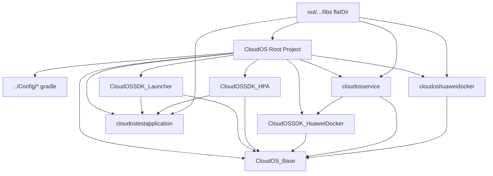
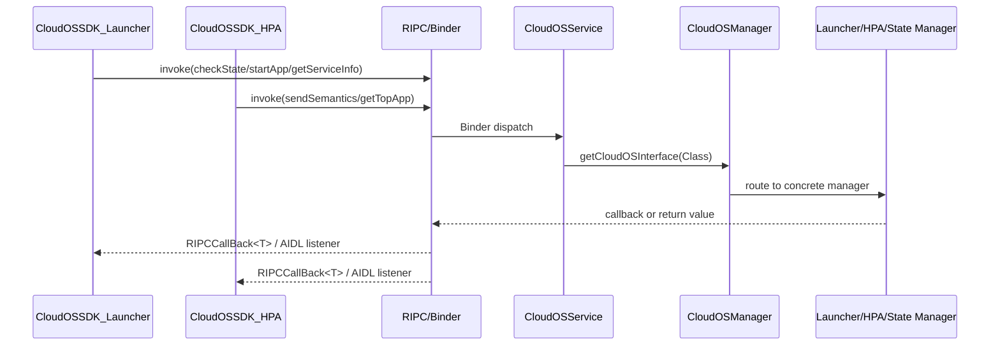
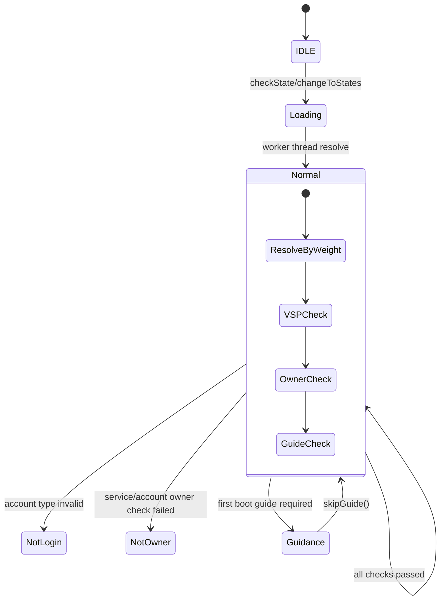
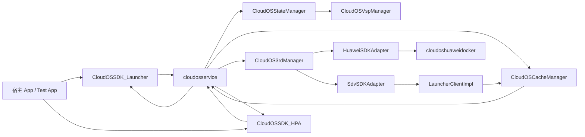
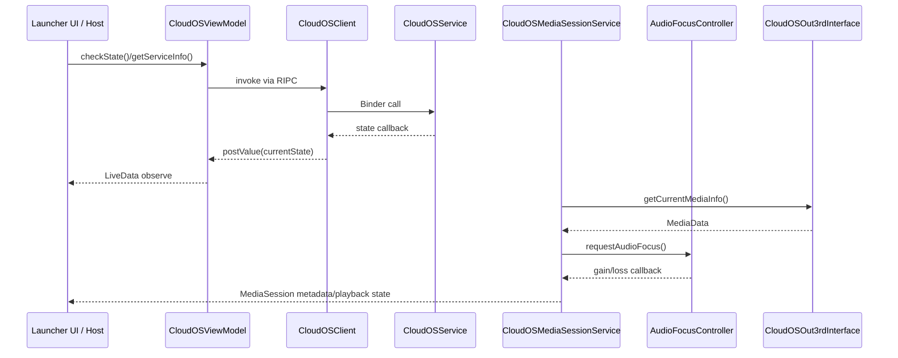
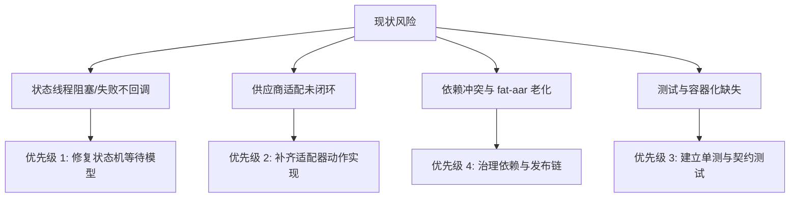

# CloudOS 完整架构分析报告

## 第 1 章：Gradle 构建拓扑与模块边界

项目采用单仓多模块 Android Gradle 结构，根工程通过 [settings.gradle](file:///home/liang/Project/Reachauto/HC/3A0W/Honda_3A0W/CloudOS/settings.gradle#L1-L9) 显式纳入 7 个模块：`CloudOS_Base` 等。根构建脚本 [build.gradle](file:///home/liang/Project/Reachauto/HC/3A0W/Honda_3A0W/CloudOS/build.gradle#L2-L34) 通过 `apply from: '../Config/config.gradle'` 将配置外置。**展开解释**：这种“单仓多模块”和“配置外置”的做法，是为了在大型项目中让多个子模块（如各个SDK和服务）共享相同的编译版本（compileSdkVersion）和签名信息，避免各模块各自为战导致版本冲突。
这里最关键的架构信号有两个：第一，仓库中使用 `flatDir` 指向 `../../../out/.../libs`，说明项目大量使用了**二进制依赖**。**为什么叫二进制依赖？**因为它们不是通过源码参与编译的，而是已经提前被编译好的二进制文件（如 `.aar` 或 `.jar`）。**哪些来自 Maven，哪些来自本地？举例说明**：
- **来自 Maven（远程仓库）**：在 [cloudosservice/build.gradle](file:///home/liang/Project/Reachauto/HC/3A0W/Honda_3A0W/CloudOS/cloudosservice/build.gradle#L87-L102) 中通过 `implementation 'com.squareup.retrofit2:retrofit:2.9.0'` 等引入的开源库（Retrofit、OkHttp、Gson等），它们由 Gradle 从互联网的 Maven 仓库下载。
- **来自本地二进制**：项目中使用的 `RDataCenterSDK`、`RAccountCommonSDK` 等库，它们是本田项目的其他工程编译产出的 `.aar` 文件，被存放在 `out/.../libs` 目录下，本项目通过 `flatDir` 直接读取这些本地二进制文件进行依赖。
第二，根工程 classpath 引入 `com.kezong.fat-aar`，意味着 SDK 模块有主动聚合传递依赖的诉求。

模块物理边界呈现出明显的“契约层 / 服务层 / 供应商桥接层 / UI 宿主层”分离。**具体是怎么体现的呢？**
- **契约层**：`CloudOS_Base` 在 [CloudOS_Base/build.gradle](file:///home/liang/Project/Reachauto/HC/3A0W/Honda_3A0W/CloudOS/CloudOS_Base/build.gradle#L37-L43) 中以 `api` 暴露 `RIpcCompat` 与 `gson`，它不是业务模块，而是存放所有跨进程 AIDL 接口和数据模型的“标准规范”层，供各个模块统一依赖。
- **服务层**：`cloudosservice` 是具体干活的后台。它在 [cloudosservice/build.gradle](file:///home/liang/Project/Reachauto/HC/3A0W/Honda_3A0W/CloudOS/cloudosservice/build.gradle#L87-L102) 中依赖 `CloudOS_Base` 与 `CloudOSSDK_HuaweiDocker`，再叠加 `RDataCenterSDK`、`RAccountCommonSDK`、`RVehicleSDK`、Retrofit/OkHttp 形成“车端聚合服务进程”，负责网络请求和状态流转。
- **供应商桥接层**：`cloudoshuaweidocker` 是单独编译的 APK，在 [cloudoshuaweidocker/build.gradle](file:///home/liang/Project/Reachauto/HC/3A0W/Honda_3A0W/CloudOS/cloudoshuaweidocker/build.gradle#L68-L79) 中接入 `VspSDK` 等厂商库。这样把华为的 Docker 能力刻意隔离在独立进程，避免把供应商强耦合依赖直接灌进主服务。
- **UI 宿主层**：`cloudostestapplication` 就是一个用于验收的 UI 壳工程。

同时，`CloudOSSDK_Launcher` 与 `CloudOSSDK_HPA` 都使用 **fat-aar 插件**。**详解什么是 fat-aar？**
正常情况下，如果用 Gradle 编译出一个 SDK（比如 LauncherSDK.aar），它里面只包含自己写的代码，**不包含**它所依赖的 `CloudOS_Base` 等其他库代码。这就要求外部使用方在接入时，必须把所有间接依赖手动再引入一遍，非常麻烦且容易出错。
**fat-aar（胖 AAR 插件）** 的作用就是：在打包 `LauncherSDK` 时，把其依赖的 `CloudOS_Base` 等内部模块的字节码（Class）和资源，强行合并、“揉”进最终输出的 AAR 文件里。这使得产出的 AAR 变成了一个**自带所有必要依赖的独立包裹**（因此体积变大，称为“胖”）。这样，外部宿主（如真正的桌面应用）接入该 SDK 时，只需要引入这一个文件，不用关心其内部复杂的依赖链。从 [CloudOSSDK_Launcher/build.gradle](file:///home/liang/Project/Reachauto/HC/3A0W/Honda_3A0W/CloudOS/CloudOSSDK_Launcher/build.gradle#L38-L74) 的 `copyTask` 可以看出，它打出“胖 AAR”后直接交付给宿主。

依赖治理上已经出现**潜在漂移**。**什么是潜在漂移（Dependency Drift）？**
简单来说，当你的项目引入了多个第三方库，而这些第三方库又各自间接依赖了同一个基础库的**不同版本**时，Gradle 会自动介入，强制把这个基础库统一升级到它发现的最高版本。这种“开发者没有主动管控，而是由构建工具默默合成的、随时可能因为引入新库而发生突变的依赖版本状态”，就叫“依赖漂移”。

例如，在这个项目中：`CloudOSSDK_Launcher` 直接声明了 `androidx.fragment:fragment:1.2.5`，但它同时引入了 `appcompat` 等库，而这些库内部可能依赖的是旧版的 Fragment（比如 1.0.0 或 1.1.0）。在编译时，Gradle 会发现多版本竞争，并自动把 Fragment 版本统一强行拉高到 1.2.5（即 `1.0.0 / 1.1.0 / 1.2.5 -> 1.2.5`）。
**风险在哪？** 虽然现在能编译通过，但如果被强行拉高的版本（1.2.5）不向下兼容，删除了旧版本（1.0.0）里的某个方法，那么依赖旧版本的库在运行时一旦调用该方法，就会直接触发 `NoSuchMethodError` 崩溃。这种“被动依赖合并”是不安全的，正确的做法应该是建立统一的 BOM（依赖平台）或使用 `resolutionStrategy.force` 进行主动拦截。

再结合构建日志中的 `WARNING: Using flatDir should be avoided` 与 fat-aar 的 Transform API obsolete 警告，可以判断该工程处于“可构建，但长期演进风险偏高”的状态。

## 第 2 章：契约层、泛型边界与 IPC 体系

`CloudOS_Base` 是整个工程的“逻辑中枢骨架”。其核心价值不在于业务实现，而在于定义跨模块稳定 ABI：AIDL 回调、模型对象、输入输出接口、基础 Manager 抽象都从这里出发。AIDL 文件 [AppListChangeListener.aidl](file:///home/liang/Project/Reachauto/HC/3A0W/Honda_3A0W/CloudOS/CloudOS_Base/src/main/aidl/com/hynex/cloudossdk_base/AppListChangeListener.aidl#L1-L10)、[MediaDataChangeListener.aidl](file:///home/liang/Project/Reachauto/HC/3A0W/Honda_3A0W/CloudOS/CloudOS_Base/src/main/aidl/com/hynex/cloudossdk_base/MediaDataChangeListener.aidl#L1-L8)、[CloudOSPaymentListener.aidl](file:///home/liang/Project/Reachauto/HC/3A0W/Honda_3A0W/CloudOS/CloudOS_Base/src/main/aidl/com/hynex/cloudossdk_base/CloudOSPaymentListener.aidl#L1-L6)、[CloudOSForegroundListener.aidl](file:///home/liang/Project/Reachauto/HC/3A0W/Honda_3A0W/CloudOS/CloudOS_Base/src/main/aidl/com/hynex/cloudossdk_base/CloudOSForegroundListener.aidl#L1-L7)、[CloudOSDringStateListener.aidl](file:///home/liang/Project/Reachauto/HC/3A0W/Honda_3A0W/CloudOS/CloudOS_Base/src/main/aidl/com/hynex/cloudossdk_base/CloudOSDringStateListener.aidl#L1-L5) 共同定义了双向 Binder 回调协议。这里没有使用 Java 泛型 AIDL，而是把泛型能力下沉到 `RIPCCallBack<T>` 层；AIDL 负责稳定 Binder 边界，`RIPCCallBack<List<AppInfo>>` 则让业务回调保留类型信息。这是一种“接口稳定 + 回调泛型化”的折中设计，优点是业务 API 更自然，缺点是底层仍要依赖 `RIpcCompat` 做类型恢复与代理封装。

Launcher 与 HPA 两个 SDK 都继承 `RIPCClient` 直接对接 `cloudosservice`。例如 [CloudOSSDK_Launcher/CloudOSClient](file:///home/liang/Project/Reachauto/HC/3A0W/Honda_3A0W/CloudOS/CloudOSSDK_Launcher/src/main/java/com/hynex/cloudossdk_launcher/CloudOSClient.java#L29-L164) 同时实现 `CloudOSOut3rdInterface`、`CloudOSInStateInterface`、`CloudOSOutStateInterface`、`CloudOSInLauncherInterface`、`CloudOSOutLauncherInterface`，通过 `invoke(...)` 把方法名和参数透传到远端服务。HPA 端的 [CloudOSSDK_HPA/CloudOSClient](file:///home/liang/Project/Reachauto/HC/3A0W/Honda_3A0W/CloudOS/CloudOSSDK_HPA/src/main/java/com/hynex/cloudossdk_hpa/CloudOSClient.java#L23-L114) 结构相同，只是契约换成 HPA 语义接口。二者都通过反射 `ActivityThread.currentActivityThread().getApplication()` 获取 `Context`，这是典型的“SDK 自举上下文”方案：减少接入方侵入，但依赖 Android 私有 API，属于兼容性敏感点。

服务端则由 [CloudOSService](file:///home/liang/Project/Reachauto/HC/3A0W/Honda_3A0W/CloudOS/cloudosservice/src/main/java/com/hynex/cloudosservice/service/CloudOSService.java#L1-L24) 作为 RIPC 服务注册中心，在 `onCreate` 中一次性 `addInterface(...)` 发布状态、HPA、Launcher、System 四组接口对象。真正的运行时分发由 [CloudOSManager](file:///home/liang/Project/Reachauto/HC/3A0W/Honda_3A0W/CloudOS/cloudosservice/src/main/java/com/hynex/cloudosservice/core/CloudOSManager.java#L12-L72) 完成：根据接口 Class 做 `cast`，把请求路由到 `cloudOS3rdManager`、`cloudOSHPAManager`、`cloudOSLauncherManager`、`cloudOSSystemManager` 或 `CloudOSStateManager`。这不是 DI 容器，而是手写 Service Locator。优点是简单、无额外反射框架；缺点是编译期约束弱，接口新增时必须同步修改 `getCloudOSInterface`，否则运行期才暴露空指针或类型错误。

## 第 3 章：cloudosservice 核心状态机与业务编排

`cloudosservice` 是真正承载状态机、账户校验、VSP 权益校验、媒体服务与第三方适配的核心应用。最关键的控制器是 [CloudOSStateManager](file:///home/liang/Project/Reachauto/HC/3A0W/Honda_3A0W/CloudOS/cloudosservice/src/main/java/com/hynex/cloudosservice/core/CloudOSStateManager.java#L22-L163)。它维护 `currentState/previousState`，用 `HandlerThread("CloudOSStateResolveWorker")` + `Handler` 串行处理状态切换消息；同时用 `SparseArray<SparseArray<onStateResolveListener>>` 存放每个状态下的权重解析器。`changeToStates()` 会依次投递状态消息，`handleMessage()` 再按权重从大到小遍历解析器，只要某个解析器返回新状态，就立即 `setState(newState)` 并广播。这意味着它不是简单有限状态机，而是“带优先级拦截器链的状态解析总线”，其设计思想更接近责任链模式。

状态解析中最复杂的一段来自 [CloudOSLauncherManager](file:///home/liang/Project/Reachauto/HC/3A0W/Honda_3A0W/CloudOS/cloudosservice/src/main/java/com/hynex/cloudosservice/business/CloudOSLauncherManager.java#L48-L194)。构造器里向 `CloudOSStateManager` 注册 `Weight.Max` 解析器，当目标状态为 `Normal` 时，先检查账户类型，不是正常用户就返回 `NotLogin`；否则调用 `getCloudsServiceInfo(thread)` 发起 VSP 权益查询，再通过 `LockSupport.park(thread)` 阻塞状态线程，等异步回调 `LockSupport.unpark(thread)` 后继续；若权益 bean 为空或要求校验车主，再发起 `getCurrentAccountInfo`，再次 park/unpark；最终根据 `isOwner` 与 `getNeedGuide()` 决定落在 `NotOwner`、`Guidance` 或 `Normal`。这是一个“异步接口 + 同步状态决策”的桥接实现，逻辑上简洁，但把阻塞语义引入状态线程。

网络层由 [CloudOSVspManager](file:///home/liang/Project/Reachauto/HC/3A0W/Honda_3A0W/CloudOS/cloudosservice/src/main/java/com/hynex/cloudosservice/business/CloudOSVspManager.java#L19-L80)、[RetrofitClient](file:///home/liang/Project/Reachauto/HC/3A0W/Honda_3A0W/CloudOS/cloudosservice/src/main/java/com/hynex/cloudosservice/vsp/RetrofitClient.java#L12-L39)、[ApiService](file:///home/liang/Project/Reachauto/HC/3A0W/Honda_3A0W/CloudOS/cloudosservice/src/main/java/com/hynex/cloudosservice/vsp/ApiService.java#L9-L16)、[BaseResponse](file:///home/liang/Project/Reachauto/HC/3A0W/Honda_3A0W/CloudOS/cloudosservice/src/main/java/com/hynex/cloudosservice/vsp/BaseResponse.java#L3-L49) 组成。`CloudOSVspManager` 构造时先从 `RDataClient` 读取 `KEY_USER_TOKEN`，再监听 `KEY_TOKEN_REFRESHING_FLAG`，当刷新完成时更新 `tokenStr`。`getCloudsOSServiceStatus()` 异步调用 `/honda-facade-da-personal/cloudos/v1/service/list`，成功后仅以 `"000000"` 判定业务成功。这里存在两个隐藏问题：其一，`onFailure` 只打印日志，没有回调失败结果，会让上层等待线程无法恢复；其二，[CloudOSLauncherManager#getCloudsServiceInfo](file:///home/liang/Project/Reachauto/HC/3A0W/Honda_3A0W/CloudOS/cloudosservice/src/main/java/com/hynex/cloudosservice/business/CloudOSLauncherManager.java#L179-L194) 在回调里额外 `Thread.sleep(10000)`，直接把状态切换延长 10 秒，是目前最明显的时延异常源。

## 第 4 章：供应商适配、模块职责与数据流闭环

第三方能力抽象由 [CloudOS3rdManager](file:///home/liang/Project/Reachauto/HC/3A0W/Honda_3A0W/CloudOS/cloudosservice/src/main/java/com/hynex/cloudosservice/business/CloudOS3rdManager.java#L15-L70) 负责。它监听状态机，当系统进入 `Normal` 时先 `releaseAdapter()` 再根据 [CloudOSCacheManager](file:///home/liang/Project/Reachauto/HC/3A0W/Honda_3A0W/CloudOS/cloudosservice/src/main/java/com/hynex/cloudosservice/core/CloudOSCacheManager.java#L15-L139) 当前 `sdkType` 创建 `HuaweiSDKAdapter` 或 `SdvSDKAdapter`；当进入 `NotLogin` 时释放适配器。这说明适配器生命周期不是和 Service 绑定，而是和“业务可用态”绑定。`CloudOSCacheManager` 又保存 `sdkType/hondaId/phoneNum/vin/appInfoList`，并通过 `CopyOnWriteArraySet` + `CopyOnWriteArrayList` 给监听者广播缓存变更，因此它同时承担了策略选择缓存与应用列表缓存的双重角色。

华为链路呈现“二次 RIPC 桥接”。[HuaweiSDKAdapter](file:///home/liang/Project/Reachauto/HC/3A0W/Honda_3A0W/CloudOS/cloudosservice/src/main/java/com/hynex/cloudosservice/adpter/sdk/HuaweiSDKAdapter.java#L23-L117) 内部持有 [HwDockerClient](file:///home/liang/Project/Reachauto/HC/3A0W/Honda_3A0W/CloudOS/CloudOSSDK_HuaweiDocker/src/main/java/com/hynex/cloudossdk_huaweidocker/HwDockerClient.java#L1-L29)，目标服务固定为 `com.hynex.cloudoshuaweidocker.HwDockerService`。对应服务端 [HwDockerService](file:///home/liang/Project/Reachauto/HC/3A0W/Honda_3A0W/CloudOS/cloudoshuaweidocker/src/main/java/com/hynex/cloudoshuaweidocker/HwDockerService.java#L13-L32) 在独立 APK 中启动，并把 [HuaweiSDK](file:///home/liang/Project/Reachauto/HC/3A0W/Honda_3A0W/CloudOS/cloudoshuaweidocker/src/main/java/com/hynex/cloudoshuaweidocker/sdk/HuaweiSDK.java#L20-L111) 注册为 RIPC 接口。但目前 `HuaweiSDK` 几乎所有方法为空实现，因此“主服务 -> HuaweiSDKAdapter -> HwDockerClient -> HwDockerService -> HuaweiSDK”这条链路虽然物理存在，业务上尚未闭环。换言之，华为通道现在更像接口骨架，不是完成态适配。

SDV 链路更接近真实实现。[SdvSDKAdapter](file:///home/liang/Project/Reachauto/HC/3A0W/Honda_3A0W/CloudOS/cloudosservice/src/main/java/com/hynex/cloudosservice/adpter/sdk/SdvSDKAdapter.java#L31-L271) 使用 `ThreadUtil.runOnThread()` 异步创建 `LauncherClientImpl`，配置 `autoReconnect(5, 3000)`，连接成功后注册 `LauncherAppListener` 并查询应用列表。在 `onAppListUpdated()` 中把第三方 `App` 转成统一 `AppInfo`，写入 `CloudOSCacheManager.updateAllAppInfo()`，再通过 `RemoteCallbackList<AppListChangeListener>` 通知跨进程监听者，同时把积压在 `pendingAppListCallBacks` 中的一次性回调全部回放。这里已经具备典型 anti-corruption layer 特征：把 SDV SDK 的模型与事件格式屏蔽在服务层内部，对外统一输出 `AppInfo` 与回调接口。

HPA 与 Launcher 则分别代表两个消费面。`CloudOSSDK_HPA` 通过 [CloudOSClient](file:///home/liang/Project/Reachauto/HC/3A0W/Honda_3A0W/CloudOS/CloudOSSDK_HPA/src/main/java/com/hynex/cloudossdk_hpa/CloudOSClient.java#L23-L114) 调用 `sendSemantics()`、`getTopApp()`、`getCurrentMediaInfo()` 等接口；服务端 [CloudOSHPAManager](file:///home/liang/Project/Reachauto/HC/3A0W/Honda_3A0W/CloudOS/cloudosservice/src/main/java/com/hynex/cloudosservice/business/CloudOSHPAManager.java#L24-L219) 把讯飞语义 JSON 反序列化为 `VoiceProtocol` 并按 `LAUNCH/EXIT/INSTRUCTION/POS_RANK` 分支处理。Launcher 侧则由 [CloudOSSDK_Launcher/CloudOSClientForLauncher](file:///home/liang/Project/Reachauto/HC/3A0W/Honda_3A0W/CloudOS/CloudOSSDK_Launcher/src/main/java/com/hynex/cloudossdk_launcher/CloudOSClientForLauncher.java#L10-L45)、[CloudOSViewModel](file:///home/liang/Project/Reachauto/HC/3A0W/Honda_3A0W/CloudOS/CloudOSSDK_Launcher/src/main/java/com/hynex/cloudossdk_launcher/vm/CloudOSViewModel.java#L13-L65) 和测试壳 [CloudOSActivity](file:///home/liang/Project/Reachauto/HC/3A0W/Honda_3A0W/CloudOS/cloudostestapplication/src/main/java/com/hynex/testapp/CloudOSActivity.java#L17-L70) 构成状态展示与功能验收界面。整体数据流已经清晰：测试宿主/宿主车机 -> Launcher SDK/HPA SDK -> cloudosservice -> 第三方适配器 -> 华为 Docker 或 SDV Launcher -> 结果回流到状态机/缓存/UI。

## 第 5 章：线程模型、异步调度与媒体生命周期

整个项目没有引入 Kotlin、Coroutines、Rx 链式调度，线程模型完全建立在 Java 原生并发基元上。公共线程工具 [ThreadUtil](file:///home/liang/Project/Reachauto/HC/3A0W/Honda_3A0W/CloudOS/CloudOS_Base/src/main/java/com/hynex/cloudossdk_base/util/ThreadUtil.java#L14-L58) 只提供两个入口：`MAIN_HANDLER` 切主线程、`Executors.newCachedThreadPool()` 跑后台。`SdvSDKAdapter` 用它进行远程 Launcher 初始化，这是典型的 I/O 隔离手法；而 `CloudOSStateManager` 额外维护独立 `HandlerThread`，表明系统把“状态计算串行化”视作比“通用异步复用”更高优先级的需求。因为状态机会跨账户、VSP、引导页、权限等多信号聚合，所以单线程串行解析有助于避免乱序状态覆盖。

并发安全策略整体偏保守。监听器容器广泛使用 `CopyOnWriteArraySet`、`CopyOnWriteArrayList`、`RemoteCallbackList`，例如 [CloudOSStateManager](file:///home/liang/Project/Reachauto/HC/3A0W/Honda_3A0W/CloudOS/cloudosservice/src/main/java/com/hynex/cloudosservice/core/CloudOSStateManager.java#L28-L35) 与 [CloudOSCacheManager](file:///home/liang/Project/Reachauto/HC/3A0W/Honda_3A0W/CloudOS/cloudosservice/src/main/java/com/hynex/cloudosservice/core/CloudOSCacheManager.java#L28-L40)，这说明作者优先优化“多读少写”场景下的线程安全和遍历稳定性，而不是写入吞吐。`SdvSDKAdapter` 将 `launcherClient` 与 `currentAppList` 声明为 `volatile`，避免连接线程与 Binder 回调线程之间的可见性问题；`CloudOSStateManager` 对 `resolveListeners` 的修改和读取使用同一把 `synchronized` 锁，也规避了状态解析器的并发增删。这里没有使用 CAS、读写锁、DCL、协程 Mutex 等更细颗粒同步手段，整体属于“可维护优先”的经典 Java 风格。

媒体链路是另一个值得单独关注的异步系统。[CloudOSMediaSessionService](file:///home/liang/Project/Reachauto/HC/3A0W/Honda_3A0W/CloudOS/cloudosservice/src/main/java/com/hynex/cloudosservice/service/CloudOSMediaSessionService.java#L33-L287) 作为 `MediaBrowserService` 在 `onCreate()` 中拉取 `CloudOSOut3rdInterface` 与 `CloudOSIn3rdInterface`，建立 `MediaSession`、前台通知、音频焦点控制器，并注册 `MediaDataChangeListener.Stub`。`initMediaSession()` 单独起 `HandlerThread("MediaSessionThread")` 作为 `MediaSession.Callback` 的执行线程，避免媒体控制直接阻塞主线程；[AudioFocusController](file:///home/liang/Project/Reachauto/HC/3A0W/Honda_3A0W/CloudOS/cloudosservice/src/main/java/com/hynex/cloudosservice/focus/AudioFocusController.java#L12-L132) 则封装 O 以上 `AudioFocusRequest` 与旧版 `requestAudioFocus()` 的兼容逻辑。问题在于，媒体回调中的播放/暂停/上一首/下一首仍大量留有 TODO，状态更新和实际控制尚未闭合，导致当前服务更像“媒体状态桥接器”，而不是完整“媒体控制器”。

从生命周期角度看，系统还存在若干资源回收缺口。`CloudOSMediaSessionService` 在 `onDestroy()` 里释放 `MediaSession` 与 AudioFocus，做得相对完整；但 `CloudOSLauncherManager` 注册了多个 `ContentObserver`，代码中没有对应注销逻辑；`CloudOSClient` 和 `CloudOSSDK_HPA/CloudOSClient` 在构造器中自动 `connect()`，却没有显式暴露 `disconnect()` 生命周期给 SDK 使用方；`CloudOSViewModel.checkState()` 每次调用都 `addOnStateChangeListener(new ...)`，没有移除旧监听器，长时间反复进入页面会累积回调对象。这些不是立即崩溃型问题，而是典型的“系统运行久了才显现”的泄漏与重复回调风险。

## 第 6 章：风险清单、测试缺口与演进建议

当前代码最突出的问题不是“不会运行”，而是“骨架已成、关键闭环未补”。第一类风险是未完成实现：`cloudoshuaweidocker` 中的 [HuaweiSDK](file:///home/liang/Project/Reachauto/HC/3A0W/Honda_3A0W/CloudOS/cloudoshuaweidocker/src/main/java/com/hynex/cloudoshuaweidocker/sdk/HuaweiSDK.java#L20-L111) 几乎全为空；[CloudOSSystemManager](file:///home/liang/Project/Reachauto/HC/3A0W/Honda_3A0W/CloudOS/cloudosservice/src/main/java/com/hynex/cloudosservice/business/CloudOSSystemManager.java#L6-L20) 的 `openCloudOS/closeCloudOS` 为空；[CloudOSLauncherManager](file:///home/liang/Project/Reachauto/HC/3A0W/Honda_3A0W/CloudOS/cloudosservice/src/main/java/com/hynex/cloudosservice/business/CloudOSLauncherManager.java#L90-L118) 的 `getPaymentQRCode()` 为空；[SdvSDKAdapter](file:///home/liang/Project/Reachauto/HC/3A0W/Honda_3A0W/CloudOS/cloudosservice/src/main/java/com/hynex/cloudosservice/adpter/sdk/SdvSDKAdapter.java#L77-L150) 中 `closeApp/controlMedia/getTopApp/startApp/uninstallApp` 等关键动作未实现。换句话说，接口面已经对外开放，但供应商能力矩阵仍然严重不对称。

第二类风险是稳定性与性能。最严重的点在 [CloudOSLauncherManager#getCloudsServiceInfo](file:///home/liang/Project/Reachauto/HC/3A0W/Honda_3A0W/CloudOS/cloudosservice/src/main/java/com/hynex/cloudosservice/business/CloudOSLauncherManager.java#L179-L194) 中回调后 `Thread.sleep(10000)`，这会让状态线程硬等待 10 秒；如果 VSP 失败， [CloudOSVspManager#onFailure](file:///home/liang/Project/Reachauto/HC/3A0W/Honda_3A0W/CloudOS/cloudosservice/src/main/java/com/hynex/cloudosservice/business/CloudOSVspManager.java#L69-L73) 又没有触发失败回调，`LockSupport.park(thread)` 可能长时间挂起状态切换。再加上多个 SDK Client 使用私有反射取 `Application`、`CloudOSViewModel` 重复注册监听器、ContentObserver 未释放，这一组问题组合在车机长期驻留进程里会直接放大为卡顿、重复回调、内存泄漏和偶发假死。

第三类风险是构建与交付链。依赖解析已经出现 AppCompat/Fragment 多版本冲突，需要靠 Gradle 冲突解决兜底；fat-aar 插件带来 Transform API 过时告警，说明未来 AGP 升级存在阻塞；`flatDir` 本地 AAR 破坏了元数据可追踪性，不利于依赖收敛与 SBOM 治理。测试层几乎为空：各模块 `src/test` 下只有 `ExampleUnitTest`，本次全仓搜索未发现 Mockito、MockK、Testcontainers、契约测试或端到端容器脚本；同时仓库中也没有 Dockerfile、docker-compose、Helm 等容器化资产，因此既缺“本地自动化验证层”，也缺“可复现集成环境层”。当前测试更多依赖 `cloudostestapplication` 的人工冒烟，而不是系统性回归。

建议的演进顺序应是：先修复状态机阻塞与失败回调，保证 `Normal` 解析路径可预测；再补齐 `HuaweiSDK/SdvSDKAdapter/SystemManager` 的动作闭环，至少做到接口不空转；然后建立最小测试金字塔，优先覆盖 `CloudOSStateManager` 权重解析、`CloudOSVspManager` 成败分支、`CloudOSHPAManager` 语义解析、`SdvSDKAdapter` 模型转换；最后再推进构建治理，把 `flatDir` 迁移到内部 Maven 仓库、锁定 AndroidX 版本矩阵、评估去除 fat-aar 或升级替代方案。这样才能把当前“可展示 Demo 架构”收敛成“可量产维护架构”。

## 附录：关键证据索引

- 根工程与模块清单：[settings.gradle](file:///home/liang/Project/Reachauto/HC/3A0W/Honda_3A0W/CloudOS/settings.gradle#L1-L9)、[build.gradle](file:///home/liang/Project/Reachauto/HC/3A0W/Honda_3A0W/CloudOS/build.gradle#L2-L34)
- SDK 模块构建脚本：[CloudOSSDK_Launcher/build.gradle](file:///home/liang/Project/Reachauto/HC/3A0W/Honda_3A0W/CloudOS/CloudOSSDK_Launcher/build.gradle#L1-L74)、[CloudOSSDK_HPA/build.gradle](file:///home/liang/Project/Reachauto/HC/3A0W/Honda_3A0W/CloudOS/CloudOSSDK_HPA/build.gradle#L1-L63)、[CloudOSSDK_HuaweiDocker/build.gradle](file:///home/liang/Project/Reachauto/HC/3A0W/Honda_3A0W/CloudOS/CloudOSSDK_HuaweiDocker/build.gradle#L1-L42)
- 应用模块构建脚本：[cloudosservice/build.gradle](file:///home/liang/Project/Reachauto/HC/3A0W/Honda_3A0W/CloudOS/cloudosservice/build.gradle#L1-L102)、[cloudoshuaweidocker/build.gradle](file:///home/liang/Project/Reachauto/HC/3A0W/Honda_3A0W/CloudOS/cloudoshuaweidocker/build.gradle#L1-L79)、[cloudostestapplication/build.gradle](file:///home/liang/Project/Reachauto/HC/3A0W/Honda_3A0W/CloudOS/cloudostestapplication/build.gradle#L1-L87)
- IPC 契约：[AppListChangeListener.aidl](file:///home/liang/Project/Reachauto/HC/3A0W/Honda_3A0W/CloudOS/CloudOS_Base/src/main/aidl/com/hynex/cloudossdk_base/AppListChangeListener.aidl#L1-L10)、[MediaDataChangeListener.aidl](file:///home/liang/Project/Reachauto/HC/3A0W/Honda_3A0W/CloudOS/CloudOS_Base/src/main/aidl/com/hynex/cloudossdk_base/MediaDataChangeListener.aidl#L1-L8)、[CloudOSPaymentListener.aidl](file:///home/liang/Project/Reachauto/HC/3A0W/Honda_3A0W/CloudOS/CloudOS_Base/src/main/aidl/com/hynex/cloudossdk_base/CloudOSPaymentListener.aidl#L1-L6)
- 状态与缓存核心：[CloudOSStateManager](file:///home/liang/Project/Reachauto/HC/3A0W/Honda_3A0W/CloudOS/cloudosservice/src/main/java/com/hynex/cloudosservice/core/CloudOSStateManager.java#L22-L163)、[CloudOSCacheManager](file:///home/liang/Project/Reachauto/HC/3A0W/Honda_3A0W/CloudOS/cloudosservice/src/main/java/com/hynex/cloudosservice/core/CloudOSCacheManager.java#L15-L139)
- 业务编排：[CloudOSLauncherManager](file:///home/liang/Project/Reachauto/HC/3A0W/Honda_3A0W/CloudOS/cloudosservice/src/main/java/com/hynex/cloudosservice/business/CloudOSLauncherManager.java#L32-L320)、[CloudOSVspManager](file:///home/liang/Project/Reachauto/HC/3A0W/Honda_3A0W/CloudOS/cloudosservice/src/main/java/com/hynex/cloudosservice/business/CloudOSVspManager.java#L19-L80)、[CloudOSHPAManager](file:///home/liang/Project/Reachauto/HC/3A0W/Honda_3A0W/CloudOS/cloudosservice/src/main/java/com/hynex/cloudosservice/business/CloudOSHPAManager.java#L24-L219)
- 适配层与供应商桥接：[CloudOS3rdManager](file:///home/liang/Project/Reachauto/HC/3A0W/Honda_3A0W/CloudOS/cloudosservice/src/main/java/com/hynex/cloudosservice/business/CloudOS3rdManager.java#L15-L70)、[HuaweiSDKAdapter](file:///home/liang/Project/Reachauto/HC/3A0W/Honda_3A0W/CloudOS/cloudosservice/src/main/java/com/hynex/cloudosservice/adpter/sdk/HuaweiSDKAdapter.java#L23-L117)、[SdvSDKAdapter](file:///home/liang/Project/Reachauto/HC/3A0W/Honda_3A0W/CloudOS/cloudosservice/src/main/java/com/hynex/cloudosservice/adpter/sdk/SdvSDKAdapter.java#L31-L271)、[HwDockerService](file:///home/liang/Project/Reachauto/HC/3A0W/Honda_3A0W/CloudOS/cloudoshuaweidocker/src/main/java/com/hynex/cloudoshuaweidocker/HwDockerService.java#L13-L32)、[HuaweiSDK](file:///home/liang/Project/Reachauto/HC/3A0W/Honda_3A0W/CloudOS/cloudoshuaweidocker/src/main/java/com/hynex/cloudoshuaweidocker/sdk/HuaweiSDK.java#L20-L111)
- UI 与宿主：[CloudOSClient](file:///home/liang/Project/Reachauto/HC/3A0W/Honda_3A0W/CloudOS/CloudOSSDK_Launcher/src/main/java/com/hynex/cloudossdk_launcher/CloudOSClient.java#L29-L192)、[CloudOSClientForLauncher](file:///home/liang/Project/Reachauto/HC/3A0W/Honda_3A0W/CloudOS/CloudOSSDK_Launcher/src/main/java/com/hynex/cloudossdk_launcher/CloudOSClientForLauncher.java#L10-L45)、[CloudOSViewModel](file:///home/liang/Project/Reachauto/HC/3A0W/Honda_3A0W/CloudOS/CloudOSSDK_Launcher/src/main/java/com/hynex/cloudossdk_launcher/vm/CloudOSViewModel.java#L13-L65)、[CloudOSActivity](file:///home/liang/Project/Reachauto/HC/3A0W/Honda_3A0W/CloudOS/cloudostestapplication/src/main/java/com/hynex/testapp/CloudOSActivity.java#L17-L70)
- 媒体与线程：[CloudOSMediaSessionService](file:///home/liang/Project/Reachauto/HC/3A0W/Honda_3A0W/CloudOS/cloudosservice/src/main/java/com/hynex/cloudosservice/service/CloudOSMediaSessionService.java#L33-L287)、[AudioFocusController](file:///home/liang/Project/Reachauto/HC/3A0W/Honda_3A0W/CloudOS/cloudosservice/src/main/java/com/hynex/cloudosservice/focus/AudioFocusController.java#L12-L132)、[ThreadUtil](file:///home/liang/Project/Reachauto/HC/3A0W/Honda_3A0W/CloudOS/CloudOS_Base/src/main/java/com/hynex/cloudossdk_base/util/ThreadUtil.java#L14-L58)
