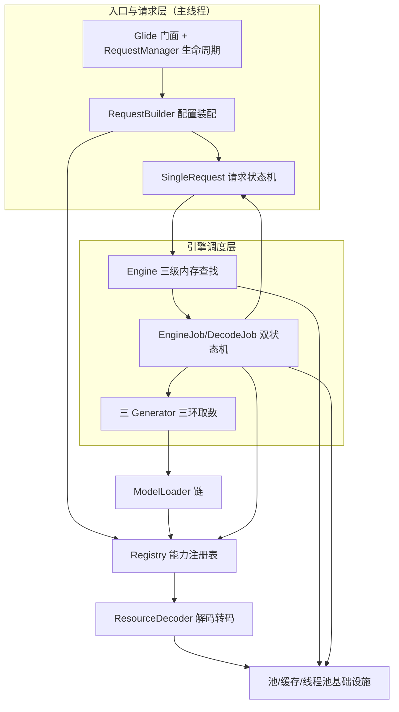
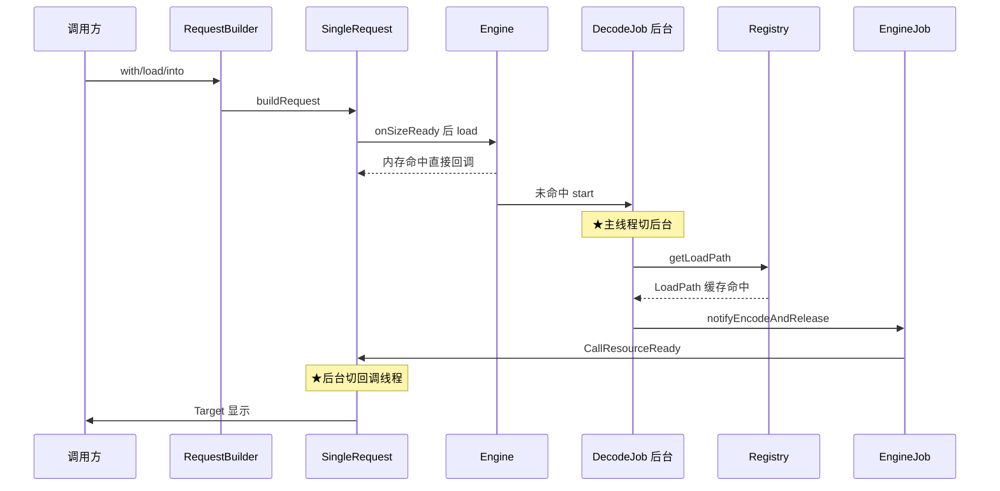

# Glide 架构解码

> 源码锚点：commit `f38a5e5`（AndroidLibs/glide，main）｜ 生成：2026-09-06 ｜ 范围：全项目（library 323 文件 + third_party 3 模块 + annotation 22 文件）
> 锚点规范：正文引用一律 `类名#方法名`（禁行号）；工作区干净（`git status --short` = 0），行号级引用不存在。
> 机制级详解在源码仓 `glide/Glide.md`（source-annotator 产物，25 机制章）——本文管组织与地图，它管代码级细节，互不复制。

## 1. 一图流

本图回答"Glide 的分层与依赖方向"；不包含方法级调用细节（见 §4 主链）与第三方内部结构（见 modules-infra.md）。



形状说明：矩形=组件；Infra 一个节点上卷 BitmapPool/ArrayPool/MemoryCache/DiskCache/GlideExecutor 五个基础设施（逐个卡片见 modules-infra.md）；DiskLruCache 属 Infra 内部。图上全部边已由 §3 import 矩阵证实，无 `[inferred]` 边。

## 2. 快速上手阅读路径

1. `Glide#with(Context)` —— 请求从哪进来？（看懂：with 返回 RequestManager，生命周期宿主在此选定）
2. `RequestBuilder#load(String)` —— 配置期做了什么？（看懂：只暂存 model 不解析 Loader）
3. `RequestBuilder#into(ImageView)` —— 执行期怎么启动？（看懂：buildRequest 请求树 → 复用/替换 → track）
4. `SingleRequest#begin` —— 请求状态机长什么样？（看懂：PENDING→WAITING_FOR_SIZE→RUNNING→COMPLETE，一把请求锁）
5. `Engine#load` —— 缓存怎么找？（看懂：活跃表→LRU→进行中任务三级查找 + 同 key 合并）
6. `DecodeJob#runWrapped` —— 后台怎么跑？（看懂：RunReason×Stage 双状态机，三个 Generator 换道）
7. `Registry#getLoadPath` —— 解码路径怎么选？（看懂：组合穷举预装配 + 缓存）
8. `GlideBuilder#build` —— 全局设施怎么装配？（看懂：先默认后模块，prepend/append 三档扩展）

看到第 8 步时，同步打开 `glide/Glide.md` 对应机制章对照细节——那是带注释的深度版本。

## 3. 分层与模块地图

import 方向按包统计（72 条边全覆盖，下表列主干与全部意外边）。

| 模块 | 一行职责 | 依赖谁 | 被谁依赖 |
|---|---|---|---|
| `com.bumptech.glide`（根包） | 静态门面 + 配置装配 + 请求/过渡 API | load根、request、manager、module、provider、model、resource | manager、module（全库入口） |
| `load`（根） | 契约层：Key/Option/Encoder/Decoder/Transformation 接口 | util | engine、resource、model、data、request（全库契约） |
| `load.engine` | 加载调度中枢：Engine/EngineJob/DecodeJob/Generator/缓存键 | load根、data、model、cache、executor、glide根 | resource、glide根、cache |
| `load.engine.bitmap_recycle` | Bitmap/数组内存池（复用判同 + LRU） | util | resource、engine、glide根、data |
| `load.engine.cache` | MemoryCache/DiskCache 接口与包装 | engine（Resource 类型）、load根 | engine、glide根、prefill |
| `load.engine.executor` | 四类线程池 + 线程数探测 | util | engine、glide根 |
| `load.engine.prefill` | Bitmap 池预热（分批 + GC 让路） | cache、pool、load根 | glide根 |
| `load.model` | ModelLoader 链（model→data 的加载器体系） | load根、data、signature、glide根 | engine、glide根、resource |
| `load.data` | DataFetcher 取数契约与实现（网络/本地/media） | load根、pool、util、glide根 | engine、model、resource |
| `load.resource` | 解码/变换/转码实现（bitmap/drawable/gif/transcode） | load根、pool、engine、request ⚠、data | engine、glide根、model |
| `request` | 请求树/协调器/Target 显示契约/过渡动画 | load根、util、engine、manager ⚠ | glide根、resource ⚠ |
| `manager` | 生命周期桥接、连通性监控、请求跟踪 | glide根、request、util | glide根、request ⚠ |
| `module` | AppGlideModule/LibraryGlideModule 装配 API | glide根、load根 | glide根 |
| `provider` | Registry 的七个子注册表实现 | load根、engine、util | glide根 |
| `signature` | 缓存签名键实现 | load根 | model、glide根 |
| `util` | 全库工具（含 LruCache/Preconditions/池化工厂） | glide根 ⚠、request ⚠、pool、model | 全部模块（17/16 组依赖它） |
| `annotation` + `annotation/compiler` | 注解 API 与编译期生成器（离线旁路，不进运行时） | 无运行时依赖 | 构建期产出 GeneratedAppGlideModule/GeneratedRequestBuilder |

⚠ = 与直觉分层相反的实测边，全部解释如下（Reflexion 分档：均为 divergent/absent 级发现）：

1. **`load根 → engine`（6 处）**：`ResourceDecoder`/`Transformation`/`ResourceEncoder` 的方法签名引用 `engine.Resource`；`ImageHeaderParser` 引 `bitmap_recycle.ArrayPool`。即**资源抽象 `Resource<Z>` 物理住在 engine 包，逻辑上是全库契约**——包组织与逻辑分层错位。
2. **`resource → request`（15 处）**：`BitmapTransitionOptions → request.transition.TransitionFactory`（过渡工厂契约归 request 包所有）；`Downsampler → request.RequestOptions/target.Target`（消费 `Target.SIZE_ORIGINAL` 尺寸哨兵）。
3. **`cache → engine`**：`MemoryCache` 接口方法签名用 `engine.Resource`——同错位 #1。
4. **`request → manager`（Target.java）**：`Target extends LifecycleListener`，而 LifecycleListener 定义在 manager 包——显示契约反向依赖生命周期模块。
5. **`util → request`（Util.java/ViewPreloadSizeProvider）**：底座工具类反向依赖上层（`Util#isValidDimensions` 校验 Target 常量语义、预载尺寸提供器实现 `SizeReadyCallback`）。
6. **`gif_encoder` 在库内但零引用**：grep 全 library 无任何 import——历史移植件，随源码携带但不在运行时链上。

## 4. 主链路

场景：`Glide.with(activity).load(url).into(imageView)`（14 阶段全景与逐段细节见 `glide/Glide.md`「Glide.with().load().into() 全链路解析」，此处只列骨架与锚点）。

```text
去程（主线程）：
Glide#with(Context) → RequestManagerRetriever#get —— 生命周期绑定，产出 RequestManager
RequestBuilder#load(String) → #loadGeneric —— 配置期：只存 model，不解析 ModelLoader
RequestBuilder#into(ImageView) → 私有 into —— buildRequest 请求树 → 复用/替换 → track
RequestManager#track → RequestTracker#runRequest —— 登记并条件启动
SingleRequest#begin → #onSizeReady —— 请求状态机启动，尺寸就绪后调引擎
Engine#load → #loadFromMemory → #waitForExistingOrStartNewJob —— 三级内存查找，未命中调度任务
EngineJob#start → DecodeJob#run —— ★主线程 → 后台线程
后台：
DecodeJob#runWrapped → #runGenerators —— ResourceCache → DataCache → Source 三环换道
SourceGenerator#startNext → fetcher#loadData —— 经 ModelLoader 链真正取数
DecodeJob#onDataFetcherReady → #decodeFromRetrievedData → #runLoadPath
LoadPath#load → DecodePath#decode → Downsampler#decode —— 解码→变换→转码
回程（后台 → 回调线程）：
DecodeJob#notifyEncodeAndRelease → EngineJob#onResourceReady → #notifyCallbacksOfResult
SingleRequest#onResourceReady → ImageViewTarget#onResourceReady —— 校验 + 动画 + 落到 View
```

主链时序图（回答"一次加载跨模块的时序与线程切换"，★=线程切换；参与者在途压缩，Generator 并入 DecodeJob）：



## 5. 模块卡片

核心六张在主文档；完整卡片（含 pool/cache/executor/prefill/model/data/resource/manager/module/annotation）见拆分文档。

### engine（load.engine）

**职责**：加载调度中枢——三级内存查找、请求合并、后台解码状态机、结果分发。
**对外接口**：`Engine#load`（主线程，唯一入口）/ `Engine#release`；`DecodeJob.DiskCacheProvider` 是它给后台的磁盘缓存口。
**关键协作**：上游 `SingleRequest#onSizeReady` 调 `Engine#load`；下游 EngineJob（分发）/ DecodeJob（执行）/ ActiveResources（活跃表）。
**设计动机**：同 key 并发请求必须合并（同屏重复 URL 只解码一次）、"正在显示"与"备用"资源必须分开管理——所以三级查找 + 引用计数 + 任务表是三个机制而不是一个缓存。代码结构可证（Engine#loadFromMemory 三段）。
**雷区**：Engine 的锁是全 Engine 一把（`synchronized(this)`），所有内存查找/晋升/降级都持它——读代码时容易低估锁范围。

### request（request 包）

**职责**：请求树构建（主/缩略图/error）、请求状态机、Target 显示契约、过渡动画。
**对外接口**：`RequestBuilder`（配置+into）、`Request#begin/clear`、`Target` 生命周期五回调；`RequestCoordinator` 三 can* 裁决。
**关键协作**：根包 44 条 import 依赖它（主链配置期全在这）；`resource → request` ⚠（过渡工厂与尺寸哨兵契约在此包）。
**设计动机**：into() 的"等价复用 vs 替换"决策是列表复用场景的核心——`Request#isEquivalentTo` 支撑幂等，`ThumbnailRequestCoordinator` 做竞速裁决。
**雷区**：回调重入护栏（`SingleRequest#assertNotCallingCallbacks` 一类状态）——监听器里再调 into/clear 会抛异常。

### model（load.model）

**职责**：ModelLoader 双向契约（handles/buildLoadData）+ 注册表 + 委托链（String/Uri/Integer → 底层 loader）。
**对外接口**：`ModelLoader#handles`（廉价探测）/ `#buildLoadData`（产出 fetcher+缓存键）；`ModelLoaderFactory#build(multiFactory)`。
**关键协作**：`MultiModelLoaderFactory` 构建期递归 + `alreadyUsedEntries` 剪环；`stream/HttpGlideUrlLoader` 带 ModelCache 记忆化。
**设计动机**：加一种数据类型只注册不改代码——开放扩展点；委托让每种数据来源只实现一次取数。
**雷区**：注册顺序即 failover 顺序（MultiModelLoader），prepend 会插到默认前面。

### Registry + provider（路由）

**职责**：七类组件的注册与路由；LoadPath 组合穷举 + 缓存（含空路径哨兵）。
**对外接口**：`Registry#append/prepend/replace` 三档语义；`Registry#getLoadPath/getModelLoaders/getRewinder`。
**关键协作**：provider 包的子注册表；`RegistryFactory#createAndInitRegistry` 先默认后模块。
**设计动机**：解码按桶（Animation/Bitmap/BitmapDrawable）优先级路由防错配（#4309 通配桶）；组合空间穷举一次、运行期零查表。
**雷区**：自定义组件 equals/hashCode 错误会导致缓存错配——组件参与键。

### 内存基础设施（bitmap_recycle + cache + executor）

**职责**：Bitmap/数组池化复用、内存缓存、磁盘缓存包装、四类线程池。
**对外接口**：`BitmapPool#getDirty/put`、`ArrayPool#get/put`、`MemoryCache#put/get`、`DiskCache.Factory`；`GlideExecutor#newSourceExecutor` 族。
**关键协作**：解码层 45+ 条 import 依赖 pool；DiskLruCache（third_party）是磁盘引擎。
**设计动机**：复用判同维度随平台演进（API 19 前 strict / 后 reconfigure 按字节分桶）。
**雷区**：put 进池的 Bitmap 内容即作废；线程池分池是防队头阻塞不是性能装饰。

### module + annotation/compiler（装配）

**职责**：运行时装配（ManifestParser 扫 meta-data → GlideModule 回调）+ 编译期装配（@GlideModule/@GlideExtension → 生成 GeneratedAppGlideModule/GeneratedRequestBuilder）。
**对外接口**：应用侧实现 AppGlideModule；库侧 LibraryGlideModule + 注解。
**关键协作**：`Glide#initializeGlide` 反射读 GeneratedAppGlideModule；compiler 的 `GlideAnnotationProcessor#process` 三路分发（库模块/扩展→Indexer，应用→AppModule）。
**设计动机**：不改 Glide 源码注入组件；编译期索引解决"多库各自注册"的发现难题。
**雷区**：两条装配路径（manifest 模块先、应用模块最后）顺序敏感。

## 6. 核心类深卡片

最核心四张在主文档；完整深卡片见拆分文档。

### Engine（engine）

**职责**：对外唯一加载入口；三级内存查找 + 同 key 请求合并 + 资源生命周期裁决。
**协作者**：`SingleRequest#onSizeReady → Engine#load`；`EngineJob` 完成经 `Engine#onEngineJobComplete` 回流；`EngineResource#release → Engine#onResourceReleased` 降级。
**设计动机**：正在显示的资源不能被 LRU 驱逐——活跃表（弱引用）+ 引用计数 + LRU 三级各管一种生命周期状态；查找与晋升合并（`Engine#getEngineResourceFromCache` 里 remove 即 promote）消除"取了又放"中间态。
**不变量**：活跃表资源 acquire 计数 >0；所有晋升/降级都在 Engine 锁内。

### DecodeJob（engine）

**职责**：一次后台解码的执行体（池化复用）：RunReason×Stage 双状态机驱动取数→解码→编码。
**协作者**：`EngineJob#start → DecodeJob#run`；`DataFetcherGenerator.FetcherReadyCallback` 回调续跑；`DecodeHelper` 参数背包。
**设计动机**：缓存未命中要换线程池（diskCache 单线程 → source 池），换池必须重新入队——RunReason 就是"重入时从哪继续"的持久化状态。
**不变量**：回调线程亲和（`DecodeJob#onDataFetcherReady` 里非本线程则 reschedule 回自己的线程解码）；ReleaseManager 三布尔裁决回池时机。

### Registry（根包）

**职责**：全库能力路由：组件注册（三档语义）+ LoadPath 组合缓存。
**协作者**：provider 七子注册表；`DecodeJob#runLoadPath → Registry#getLoadPath`；`DecodeHelper#getLoadData`。
**设计动机**：见 §5 Registry 卡片。
**不变量**：空 LoadPath 也缓存（`Registry#getLoadPath` 的 isEmptyLoadPath 分支）——失败组合不重复穷举。

### SingleRequest（request）

**职责**：单个加载请求的完整状态机与生命周期。
**协作者**：`RequestBuilder#buildRequest` 构造；`Engine#load` 上游；`Target`/`RequestCoordinator` 下游。
**设计动机**：一把请求锁（requestLock）贯穿全部状态转移——status/resource/loadStatus 是组合状态，逐字段 volatile 给不了组合原子性；EngineJob 通知前经 `ResourceCallback#getLock` 取同一把锁串行化。
**不变量**：状态转移全部持 requestLock；回调重入被 `SingleRequest#begin` 的断言拒绝。

## 7. 全类职责表

公共类 200+ 个，全覆盖表在 [class-table.md](./class-table.md)（按包分节，家族行用于同构 loader/fetcher 族）；核心深卡片余量在 modules-*.md。

## 8. 看着糟但其实没问题

- **包组织与逻辑分层错位**（`Resource` 在 engine、过渡工厂在 request、Target 尺寸哨兵被 Downsampler 消费）：重构成本远大于收益——Glide 的包结构是历史演进而非设计错误，逻辑分层靠 import 纪律维持，读代码时按"契约住在谁家"理解即可。
- **gif_encoder 全库零引用**：看似死代码，实为随源码携带的完整 GIF 生成器（供需要编码 GIF 的应用单独引用），LZW/NeuQuant 是教科书级算法实现，保留有教学与复用价值。
- **SingleRequest 861 行、BaseRequestOptions 1465 行的巨型类**：配置面 20+ 项 × 状态机，拆分会让"一次请求的全部状态"散架——粗粒度是有意的（一把请求锁的边界需要它）。
- **DiskLruCache 是 fork 而非依赖**：third_party 里带完整源码（含 StrictLineReader 的 EOF 语义改造），Glide 需要的 journal 截断/重放行为与上游实现耦合紧，fork 换取可控性。

## 9. 相邻产物

- 源码仓 `glide/Glide.md`（source-annotator 沉淀）：**机制详解层**——25 个机制章、每段代码带中文讲解注释。何时读它：需要理解某个机制"为什么这样写"、排查具体问题时。
- 本目录（架构解码）：**组织与地图层**——分层、主链、类表、覆盖率。何时读它：第一次上手找路、判断某个类该归属哪层、新需求该动哪个模块。
- 知识库 `sdk-design.md` 的 Glide 条目：跨库设计启示（延迟回收协调、递归剪环、GC 探针退避等 8 条），不属两者任何一个。

## 10. 开放问题

1. **测试缺失**：本检出零测试文件（上游 Glide 有 4000+ 测试）——"测试即规范"考据通道不可用，职责结论全部来自源码与注释，无测试名佐证。
2. **git 历史不可考**：16 次提交 message 全为"add"——所有设计动机只能从代码结构推断或采信源码注释，无 commit/issue 佐证；上文动机未标 `[inferred]` 的部分是因为源码注释本身就是有效证据（作者注释 + 本轮标注时逐段验证过）。
3. `[inferred]` 清单：compiler 生成器间协作细节（Indexer 的跨轮次去重机制只读了 `GlideAnnotationProcessor#process` 与生成器清单，未逐行读 IndexerGenerator）；`annotation/ksp` 目录（KSP 迁移实验）未读。
4. 本轮未深挖：`load/resource` 下各具体解码器家族逐个行为差异（WebP/VideoDecoder 只过了类头）；`third_party/gif_decoder` 的 LZW 算法逐段（只在标注批给了类头）。
