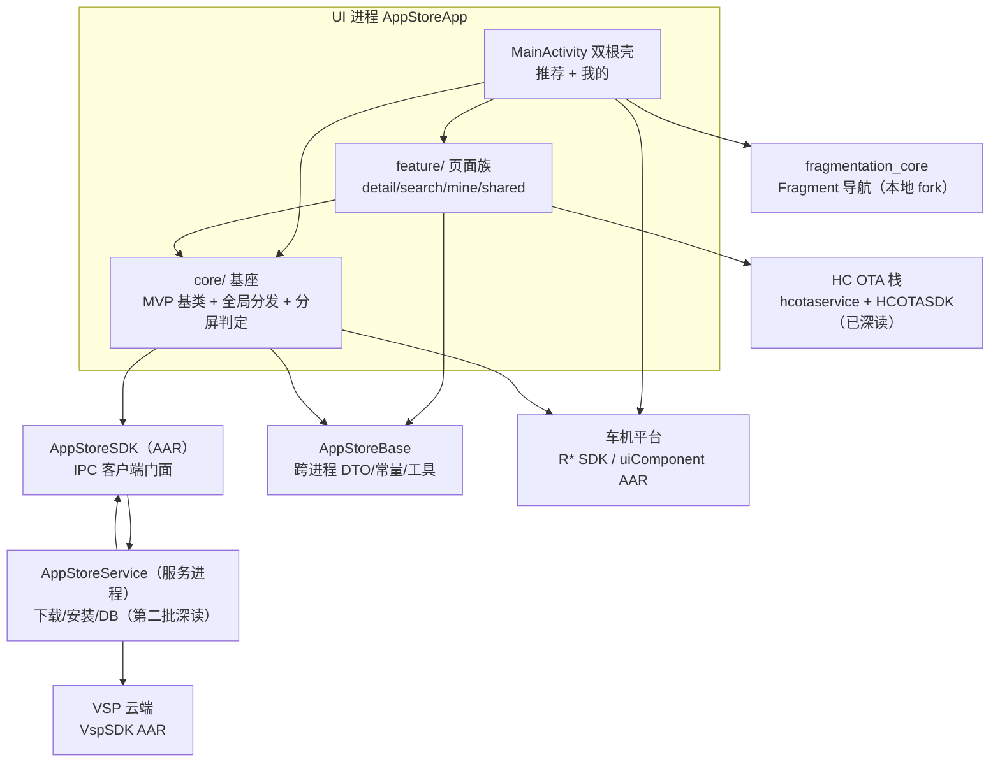

# Honda 27M AppStore 架构解码（主文档·地图与索引）

> 源码锚点：commit `88832967`（master）｜ 生成：2026-09-06 ｜ 范围：全项目·分批解码
> **⚠ 工作区不干净（5 个未提交文件：AppDetailActivity、activity_app_detail 双布局、Constant、build.gradle）**——文档锚点用 `类名#方法名`（grep 可验证），但"附近有多少行"式表述可能与未提交状态不一致。
> **解码进度**：三批全部完成——第一批 **AppStoreApp + AppStoreBase**（[AppStoreApp.md](./AppStoreApp.md) / [AppStoreBase.md](./AppStoreBase.md)）；第二批 **AppStoreService + AppStoreSDK**（[AppStoreService.md](./AppStoreService.md) / [AppStoreSDK.md](./AppStoreSDK.md)）；第三批 **HC OTA 栈 + fragmentation_core**（[HCOTA.md](./HCOTA.md) / [fragmentation_core.md](./fragmentation_core.md)）。全部 8 个 Gradle 模块的 main 源码类均已实证覆盖；唯平台 AAR 内部（RIpcCompat/RProcess/APNManager 等）源码不在仓，只能名单级。

## 1. 一图流



图例：本图回答"四条进程/库边界怎么划分、第一批深读的部分落在哪"。实线=构建文件或 import 证实；`AppStoreService`/`hcota` 内部结构未深挖（第二批/第三批）。UI 进程对 `hcotabase` 有构建声明但零 import（见 §3 ⚠）。

## 2. 快速上手阅读路径

按序读，每步带一个"看到什么算懂"的问题：

1. `AppStoreApp/src/main/AndroidManifest.xml` —— 对外暴露几个入口？（看到恰好 3 个 Activity：`MainActivity` LAUNCHER、`SearchAppActivity` 自定义 action `...intent.action.SEARCH` 对外、`AppDetailActivity` singleTask，且全部 `resizeableActivity=true`，算懂）
2. `AppStoreApp/.../appstoreapp/App.java` —— 进程起来初始化了什么？（RLog / uiComponent / 讯飞语音 / DownloadStateDispatcher / GlobalDialogManager 五件，且注意 `initSensorsDataAPI` 无人调用）
3. `AppStoreApp/.../home/MainActivity.java` —— 壳怎么组织？（`loadMultipleRootFragment` 只挂 Recommendation + Mine 两个根 Fragment，Tab 是 show/hide 不是路由）
4. `AppStoreApp/.../core/common/split/SplitScreenHelper.java` —— 分屏档位哪来的？（`RSplitScreenManager` 平台 AAR + 静态 mock 后门，5 档 type 0-4）
5. `AppStoreApp/.../core/base/view/BaseVmActivity.java` + `core/base/viewmodel/GlobalViewModel.java` —— 全局弹窗谁渲染？（每个 Activity 都订阅同一个 BehaviorSubject，`tryAcquireDialogShowing` 单飞令牌）
6. `AppStoreApp/.../core/global/DownloadStateDispatcher.java` —— 服务事件怎么到 UI？（App.onCreate 把单例挂上 AppStoreSDK，CopyOnWriteArrayList 扇出给各页 Presenter）
7. `AppStoreApp/.../core/base/presenter/CommonPresenter.java` —— 点击总枢纽（按钮状态机 → 打开/入队/取消 + 限制拦截）
8. `AppStoreApp/.../core/common/download/DownloadButtonHelper.java` —— 按钮渲染 + 云/本地列表对账（`AppListMerger`）
9. `AppStoreBase/.../constant/DownloadStatus.java` —— 全链路状态词表（ButtonState/UxrState/TaskType/FailedReason/TriggerType）
10. （第二批后补）`AppStoreService/.../ServiceRegistry.java` —— 服务侧管理器怎么组装

## 3. 分层与模块地图

| 模块 | 一行职责 | 依赖谁 | 被谁依赖 |
|---|---|---|---|
| `AppStoreApp` | 车机应用商店 launcher UI：双根 Fragment 壳 + 4 个功能域 + core 基座 | AppStoreBase（源码）、fragmentation_core（源码）、hcotabase（⚠声明但零 import）、AppStoreSDK/HCOTASDK/VspSDK/R* 平台 AAR | - |
| `AppStoreService` | 导出 IPC 服务：11 管理器组合根 + 下载/安装/限制链/DB（**第二批已深读** → [AppStoreService.md](./AppStoreService.md)） | AppStoreBase（源码）、AppStoreSDK AAR（接口契约）、GreenDAO、fragmentation_core/hcotabase（源码声明） | AppStoreApp 经 AppStoreSDK |
| `AppStoreSDK` | IPC 客户端门面：单例门面 + 8 域接口，方法名反射派发（**第二批已深读** → [AppStoreSDK.md](./AppStoreSDK.md)） | AppStoreBase（`api`）、RIpcCompat AAR | AppStoreApp、AppStoreService |
| `AppStoreBase` | 跨进程共享契约：DTO/常量/安装工具（**第一批已深读** → [AppStoreBase.md](./AppStoreBase.md)） | VspSDK AAR（`api`）、Gson、RxJava；fragmentation_core（⚠声明但零 import） | App/AppStoreService/AppStoreSDK/hcotaservice |
| `hcotaservice` | HC OTA 导出 IPC 服务：四步流水线（解压→解析→卸载→安装）+ Room/SP 双持久化恢复（**第三批已深读** → [HCOTA.md](./HCOTA.md)） | hcotabase、AppStoreBase（ApkUtil）、RProcess/RIpcCompat AAR、Room | App 经 HCOTASDK |
| `hcotasdk` / `hcotabase` | OTA 单文件客户端门面（同 AppStoreSDK 反射派发模式）/ OTA 契约词表（**第三批已深读** → [HCOTA.md](./HCOTA.md)） | hcotabase、RIpcCompat | hcotaservice、AppStoreApp（HCOTASDK AAR） |
| `fragmentation_core` | yokeyword Fragmentation 本地维护 fork：事务编排+可见性状态机+androidx 反射 hack（**第三批已深读，含 fork 差异考据** → [fragmentation_core.md](./fragmentation_core.md)） | androidx | AppStoreApp、AppStoreBase（⚠声明零 import）、AppStoreService |

⚠ = 构建文件里的"死依赖"：`AppStoreApp/build.gradle` 声明 `project(':hcotabase')` 但 app 源码 0 处 `com.hynex.hcotabase` import（`AppStoreBase` 的 `fragmentation_core` 声明同理）——声明的理由已不可考，[inferred]：为传递性暴露某些 AAR 类型或纯遗留。**absent 隐藏耦合**：UI 真正消费的 HC OTA 类型来自预编译 `HCOTASDK.aar` 而非源码模块（`AppSettingsPresenter` 调 `HCOtaSDK`），改 hcotasdk 源码不影响运行时（须重建 AAR——AGENTS.md 反模式也有此条）。

进程边界事实：App 与 Service 是两个进程（`GlobalDialogManager#startAppStoreService` 显式 `startForegroundService` 拉起 `com.hynex.appstoreservice/.AppStoreService`）；AppStoreApp 的 5 个修改文件之一 `Constant.java` 在 AppStoreBase——改动直接进跨进程契约。

## 4. 主链路

典型场景「用户打开商店 → 看推荐列表 → 下载一个应用 → 安装确认弹窗」：

```
App.onCreate
  → DownloadStateDispatcher#init（单例 attach 到 AppStoreSDK，事件总线建立）
  → GlobalDialogManager#init（生命周期回调 + 回前台拉起 Service）
MainActivity.afterSetContentView
  → loadMultipleRootFragment（Recommendation + Mine 双根壳）
RecommendationFragment.afterViewCreated
  → RecommendationPresenter#getRecommendationAppsList
  → AppStoreSDK#appList（IPC → AppStoreService → VSP 云）
  → DownloadButtonHelper$AppListMerger#merge（云列表 × SDK 本地状态对账，HCC/versionCode 双轨比较）
  → RecommendationViewModel.uiState → renderUiState（GLoading 四态）
用户点击下载
  → ItemClickHandler（View tag 路由）→ CommonPresenter#onDownloadClick
  → AppStoreSDK#checkBeforeEnqueuePreAppDownloadTask / #enqueueDownloadTask（IPC）
  → handleRestriction（限制 JSON → Toast / 仅 Owner 弹自动更新弹窗）
Service 侧下载/安装推进（第二批深读）
  → SDK 回调 DownloadStateDispatcher#onDownloadStateChanged 等
  → 扇出：全局 Toast（自留）+ 预装弹窗 → GlobalDialogManager → BaseVmActivity 渲染
  → 各页 CommonPresenter 匿名 observer → IBaseView 更新按钮/进度
```

时序图与逐段锚点见 [AppStoreApp.md](./AppStoreApp.md) §4。**理解关键**：UI 不直连云（唯一 VspSDK 直连点 `RecommendationPresenter.mRecommendationAppsListCallBack` 是空壳死代码）；UI 渲染不是纯函数——每次列表渲染都要与 `AppStoreSDK#getAppListStatus` 对账。

服务侧视角的同一条链（入队→限制链→单任务串行→APN2 下载→SHA/安装→`invokeAllAsync` 事件群发）见 [AppStoreService.md](./AppStoreService.md) §4——两侧文档 §4 合看才是完整下载生命周期。

## 5. 模块卡片

### AppStoreApp（第一批·深读）

**职责**：车机应用商店 launcher UI——壳（双根 Fragment show/hide）、四个功能域（推荐/详情/搜索/我的）、core 基座（MVP+MVVM 混合基类、全局下载事件分发、全局弹窗、分屏档位模型、三态覆层）。
**对外接口**：3 个 Activity（含 `SearchAppActivity` 的 exported 自定义 action）；对内一切 IPC 经 `AppStoreSDK` 门面，UI 不持有 Service 侧类型。
**关键协作**：见 [AppStoreApp.md](./AppStoreApp.md) §3/§5；分屏判定 `SplitScreenHelper` 是唯一屏型事实源（除 SearchAppActivity 并行一套 screenWidthDp 阈值——矛盾点）。
**设计动机**：无 README/ADR；git 考据到三次关键演化——`974096f7`"功能实装#主页分屏"引入 SplitScreenHelper、`f16262b2`"代码优化#toast逻辑分离"引入 DownloadStateDispatcher、`501fc72a`"代码优化#预装应用弹窗弹出逻辑"引入 GlobalDialogManager（与 CommonPresenter 中"弹窗逻辑已迁移"注释互证）；`6c11dc3e`"代码优化#目录结构"大重构（151 文件）把旧 `recommendation/`、`mine/` 平包重组为 `feature/`+`core/`。动机标考据：分屏与弹窗均为**走查驱动的增量收编**（先散弹在各页，后抽全局）。
**雷区**：① 所有 UI 变更多半要同时改 Java 屏型分支 + 多个宽度桶 XML（虽然当前桶几乎全是复刻）；② Presenter 广播靠 override+`super` 调用顺序，漏调 super 丢事件；③ 进程级静态态（`uninstallingPackages`、`sMockScreenType`、`itemClickBlockedUntilUptimeMs`）跨页面共享。

### AppStoreBase（第一批·深读）

**职责**：跨进程共享契约层——VSP 云 DTO、IPC 信封 `IpcWrapper`、状态词表（ButtonState 等 5 组）、限制/恢复门禁枚举、APK 静默安装工具 `ApkUtil`。
**对外接口**：被 4 个模块 `implementation`/`api` 消费；`IpcWrapper`+`DownloadStatus`+`DownloadAppTaskBean` 是至少 3 个进程共线的 IPC 协议，改枚举值/Parcel 字段序即跨进程炸。
**关键协作**：`AppStoreSDK` 以 `api` 传递它；`ApkUtil` 被 AppStoreService 与 hcotaservice 双侧调用（安装热点）。
**设计动机**：[inferred] 让 App/Service/SDK 三方共享同一份合同而非各持副本；代价是平行模型（`AppListItem` vs `AppListResponseItem` 约 15 字段重复不继承）与无版本协商。
**雷区**：详见 [AppStoreBase.md](./AppStoreBase.md) §6——Parcelable 丢父类字段、"黑户"枚举 `UNINSTALLING`、`DEBUG_UI_WALKTHROUGH=true` 随源码发布风险。

### AppStoreService（第二批·深读）（CHANGED 2026-09-06：由名单级升级为深读）

**职责**：导出 IPC 服务（application 模块、独立 APK）：`ServiceRegistry#registerServices` 组合 11 个命名管理器（8 个 `addInterface` 暴露 IPC），承载下载编排（单任务串行队列+重启恢复）、已装清单事实源（主动扫描轮询）、4 条限制链、GreenDAO 两表、VSP 云网关、APN2 自建下载栈、UI 走查 mock 基建。
**对外接口**：`RIPCService2` 上的 8 个管理器接口（方法名即协议）；`onStartCommand` 10 个 action（含静默安装结果回填与 emulate 后门）。
**关键协作**：[AppStoreService.md](./AppStoreService.md) §3/§5；事件出口 `invokeAllAsync` 对端是 `DownloadStateDispatcher`。
**设计动机**：考据 `74107783`"服务初始化"收编为注册表；单任务串行 [inferred] 出自车机流量/功耗硬约束。
**雷区**：`TaskExecutor#start` catch 在循环外（任务异常可永久杀死唯一消费者线程）；App 异步 initDB 与管理器构造竞态（DBManager session null 静默跳过恢复）；`VspManager.BASE_URL` 硬编码集成环境。

### AppStoreSDK（第二批·深读）（NEW）

**职责**：IPC 客户端门面：单例 + 8 域接口，**方法名反射派发**（每方法一行 `invokeReturn/invokeAsync/registerRIPCCallBackAsync`）；两个反向注册的扇出 Impl（UiClientObserverImpl/DownloadRestrictionObserverImpl）构成"跨进程边界"级扇出。
**对外接口**：49 个公共方法；协议对齐纪律——SDK 方法签名必须与服务侧管理器 handler 一致，改名即断链且编译期无感。
**关键协作**：[AppStoreSDK.md](./AppStoreSDK.md)；消费方永远只 import 本门面。
**设计动机**：[inferred] RIpcCompat 反射派发约束下的"域接口做契约对照表、单类做调用便利"折中。
**雷区**：源码模块 ≠ 运行时（AAR 预编译，改源码须重建拷贝）；泛型回调依赖 `IpcWrapper.elementClass`。

### HC OTA 栈（第三批·深读）（NEW）

**职责**：独立于商店 UI 的 OTA 服务：`HCOtaManager` 恢复点火 → RProcess 流水线四步（解压 zip→解析 packagelist.json→可选卸载→按 26 包硬编码序安装）→ Room 三代版本图（PREVIOUS/CURRENT/NEXT）+ SP 状态机现场；Updating/Downgrading/Restoring 三语义共用一套骨架。
**对外接口**：`HCOTAInterface` 9 方法 + `HCOTACallBack` 3 回调（服务侧实际只走 Success 通道，reason 负值区分失败）。
**关键协作**：[HCOTA.md](./HCOTA.md)；安装执行体复用 AppStoreBase 的 `ApkUtil#installSilentlyFromHCOta`；最大消费方是 AppStoreService 的 `PreAppManager`（服务→服务 IPC）。
**设计动机**：[inferred] OTA 必须脱离商店 UI 进程存活；"版本图归 Room、状态现场归 SP"的持久化切分直接服务恢复语义。
**雷区**：Updating 断电恢复是"假"的（zip 路径不持久化，重拉必败回 IDLE）；`PackageInstallProcess#performPostInstallOperations` 有必然为假的条件（恢复前台逻辑永不执行）；失败回调双发（先错误后 Success/IDLE）。

### fragmentation_core（第三批·深读，含 fork 考据）（NEW）

**职责**：yokeyword Fragmentation 的本地维护 fork：事务编排中枢（TransactionDelegate）+ 主线程串行动作队列 + 可见性状态机（VisibleDelegate）+ androidx 反射 hack（FragmentationMagician）。
**对外接口**：`ISupportActivity/ISupportFragment`（fork 把 ISupportActivity 全 default 化并新增 `showHideFragment(show,hide)`）。
**关键协作**：[fragmentation_core.md](./fragmentation_core.md)；App 层 BaseActivity/BaseFragment 自持 delegate 消费。
**设计动机**：考据 fork 五处实改——androidx 1.2+ 兼容（Magician 反射化）、Tab 切换方法补全、搜索页键盘 bug、资源补齐；**反射化引入三缺陷**（runnable 双执行/恢复值互换/保护降级），已源码确认、触发频率未验证。
**雷区**：`doShowHideFragmentWithAnim` 是死方法（showHide 动画被静默丢弃）；改本模块爆炸半径覆盖三模块（AGENTS.md）。

## 6. 核心类深卡片

拆分到模块文档，主文档不重复：

- [AppStoreApp.md](./AppStoreApp.md) §6：`CommonPresenter`、`DownloadStateDispatcher`、`GlobalDialogManager`+`BaseVmActivity`（弹窗体系）、`DownloadButtonHelper`+`AppListMerger`、`SplitScreenHelper`、`AppsAdapter`、`AppDetailActivity`、`AppSettingsFragment`
- [AppStoreService.md](./AppStoreService.md) §6：`DownloadManager`、`DownloadTask`+`BaseTask`（自阻塞串行）、`InstalledAppManager`、`RestrictionManager`+链、`VspManager`、`AppStoreCommandProcessor`、`WalkthroughMockBridge`
- [HCOTA.md](./HCOTA.md) §6：`HCOtaHandlingProcess`、`HCOtaPersistenceManager`、`PackageInstallProcess`、`HCOtaStateManager`
- [fragmentation_core.md](./fragmentation_core.md) §3：`FragmentationMagician`（androidx hack 三缺陷）、`TransactionDelegate`/`ActionQueue`/`VisibleDelegate` 机制
- [AppStoreSDK.md](./AppStoreSDK.md) §4：`AppStoreSDK`、`UiClientObserverImpl`
- [AppStoreBase.md](./AppStoreBase.md) §5：`ApkUtil`、`IpcWrapper`、`RestrictionResult`

## 7. 全类职责表

拆分到模块文档：

- [AppStoreApp.md](./AppStoreApp.md) §7：main 源码 113 类 + debug 源集 1 类全表（home/core 59 + feature 34 + widget 19 + 根包 2，含家族行），另附 36 个测试类名单级清单
- [AppStoreService.md](./AppStoreService.md) §7：main 97 类 + debug mock 12 类全表（download/network/install/restriction/database/vsp/command/util/mock，含家族行），26 个测试文件名单级
- [HCOTA.md](./HCOTA.md) §7：hcotaservice 26 + hcotasdk 1 + hcotabase 3 全表
- [fragmentation_core.md](./fragmentation_core.md) §4：28 类全表（含 anim/debug 家族行）
- [AppStoreSDK.md](./AppStoreSDK.md) §3：17 类全表
- [AppStoreBase.md](./AppStoreBase.md) §4：35 类全表（bean 5 / bean.vsp 15 / constant 6 / tools 9），2 个模板测试列入跳过清单

覆盖率实数与三档分档（实证/名单级/跳过）见各模块文档文末。

## 8. 看着糟但其实没问题

- **手写 MVP+MVVM 混合基类**（`BaseActivity<P,V,VB>` + 子类再挂 `VM`）：[inferred] MVP 承担跨页广播（`IBaseView` 13 个 default 方法让 `CommonPresenter` 能对任意页面广播 SDK 事件），ViewModel 只承担配置变更存活的状态；两套并存是"事件走 Presenter、状态走 VM"的分工，不是没想清楚。
- **`ItemClickHandler` 沿 View 树爬找 Presenter**：点击事件不在页面内分发而是全局单例按 `view.getTag()` 路由——看似绕，实则让 7 种列表形态（一个 `AppsAdapter` 多 creator 复用）与所有页面共用同一套点击语义，代价是隐式的 tag 纪律。
- **双重主线程切换冗余**（`DownloadStateDispatcher` 切主线程后又把事件转发给 `CommonPresenter` 内部 observer 再切一次）：无害，dispatcher 的"自留全局 Toast"必须在主线程、扇出侧无法保证下游，保守双切是可解释的防御。
- **`GLoading` 类型常量 0,1,2,4 跳过 3**：值语义未对齐也无碍，仅阅读不适。
- **测试目录沿用旧包路径**（`recommendation/activity/SearchAppActivityTest` 等）：目录名是重构前遗迹，但测试类引用的是新包类，能跑；`ignoreFailures=true` 使 Gradle 绿灯不可信是已知项（AGENTS.md）。

## 9. 相邻产物

- `Summary/project/project-architecture/fragment/ARCHITECTURE.md`：**androidx.fragment** 库的架构解码——本仓 `fragmentation_core`（me.yokeyword Fragmentation）是**另一个库**（构建于 androidx.fragment 之上的 show/hide 导航框架），读 AppStoreApp 的壳导航前先分清两者；fragmentation_core 本体的解码在第三批。
- `Summary/project/knowledge-base/android-ui.md`：已沉淀本项目的 HCTabBar 反射失效、dimen 分桶不生效、布局副本 Binding 字段 NPE 三条 UI 踩坑，与本文 `HCTabBarCompat`/`HCRecyclerViewCompat`、§8 布局桶发现互为印证。

## 10. 开放问题

第一批遗留（诚实清单，含全部 `[inferred]`）：

1. `[inferred]` `AppStoreApp` 声明 `hcotabase`、`AppStoreBase` 声明 `fragmentation_core` 的动机（传递暴露？遗留？）——`git log -S` 未考到引入提交的说明。
2. `[inferred]` `layout-w1920dp` 25/26 文件与 `layout/` 逐字节相同的成因：UI 走查工作流要求成对修改防止漏改？还是"分屏目录创建"（`43791510`）批量复制后未清理？与 CONTEXT.md 自家"单分叉原则"（结构一致副本禁止新增）矛盾——**需人确认是保留还是清理**。
3. 神策埋点在 app 侧整链死代码、在 service 侧活跃（6 事件）——是有意收口到服务进程还是各写各的，需人确认。
4. `Constant.DEBUG_UI_WALKTHROUGH=true`（注释警告 release 必须为 false）当前为 true——是否走查期临时开、发版前如何关，需流程确认。

第二批新增：

5. `TaskExecutor#start` 的 catch 在 while 循环外：任务 RuntimeException 可永久杀死唯一消费者线程且不自动重启——真 bug 还是"从未发生"，未验证运行时行为。
6. `[inferred]` 重启后下载不自动恢复（`reEnqueueDownloadTaskAfterReboot` 被注释）：功耗策略还是未完成，需产品确认。
7. `[inferred]` `VspManager.BASE_URL` 集成环境 URL 如何随生产构建切换（无 flavor/无环境配置文件），需流程确认。
8. 第一批遗留的"instanceof 哨兵为何未重构"已可部分作答：SDK 派发按方法名反射、事件契约无路由字段，加路由需双端改协议——重构成本在 AAR 重发布，属流程约束而非技术不能。

第三批新增：

9. `FragmentationMagician#hookStateSaved` 反射化三缺陷（runnable 双执行/恢复值互换/保护降级）已源码确认，触发频率与 `popBackStack(name,flags)` 多弹风险未实测——修复属代码改动，本文仅记录。
10. `[inferred]` OTA "装旧包"（本机 versionCode 已高于目标）触发 Restoring 回滚——刻意语义还是误伤，需产品确认。
11. `PackageAnalysisProcess#onInput` 失败分支不 finish——RProcess 框架是否无限等待（平台 AAR 源码不在仓），流水线卡死风险未验证。
12. `[inferred]` `showHideFragmentWithAnim` 死方法（Tab 切换动画被静默丢弃）与 `ISupportContext` 未接线接口——半成品还是已放弃，需人确认。

平台边界（各批共通）：RIpcCompat（方法名反射派发）、RProcess（阶段流水线）、APNManager、HSysSrvSDK 等 AAR 源码不在仓，相关机制只能名单级——本文所有涉及处均已显式声明。
