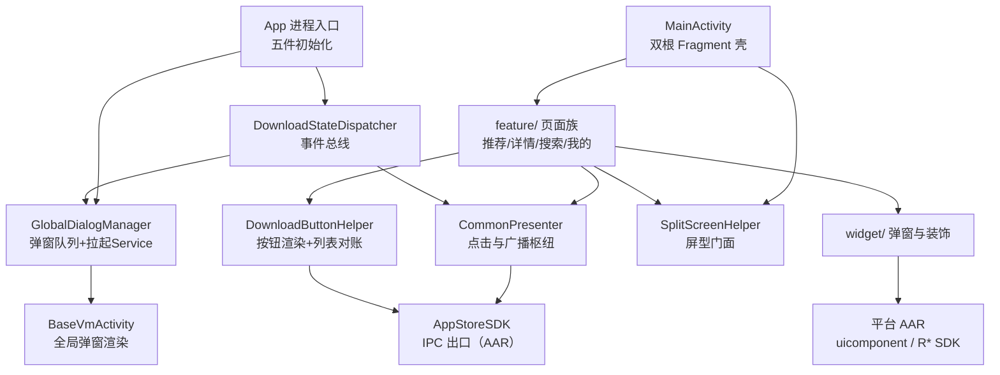
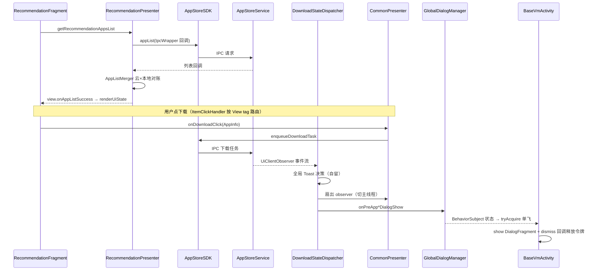

# AppStoreApp 架构解码（UI 进程）

> 源码锚点：commit `88832967`（master）｜ 生成：2026-09-06 ｜ 范围：AppStoreApp 模块全量（main 113 类 + debug 源集 1 类 + 测试 36 文件名单级）
> 锚点规范：正文引用一律 `类名#方法名`（禁行号）；工作区有未提交改动（AppDetailActivity、双布局），行数级表述勿尽信。

## 1. 一图流

图例：本图回答"UI 进程内部事件与渲染怎么组织"。全部实线由 import 证实（主链追踪 + 4 个只读子代理逐文件核对）。`BVA` 渲染的弹窗实体在 `Widgets`（PreAppInstall/PreAppUpdate/AutoUpdate 三个 DialogFragment）。

## 2. 快速上手阅读路径

见主文档 [ARCHITECTURE.md](./ARCHITECTURE.md) §2（1-9 步都在本模块内）。

## 3. 分层与包地图

| 包 | 一行职责 | 依赖谁 | 被谁依赖 |
|---|---|---|---|
| （根）`App` / `MyGlideModule` | 进程入口五件初始化 / 消 Glide 警告的空壳 `AppGlideModule` | core.global、uicomponent、RLog、讯飞 VSDK | - |
| `home/` | launcher 壳：双根 Fragment 装载 + Tab 切换 + 分屏顶衬 + 后门 | core.base、core.common.split、feature 两根 | - |
| `core/base/` | MVP+MVVM 混合基类体系（view/presenter/viewmodel/adapter/handler/interfaces/action） | fragmentation_core、appstorebase | 所有页面 |
| `core/global/` | 进程级单例：SDK 事件总线 + 全局弹窗队列/服务拉起 | AppStoreSDK、core.base、appstorebase | App、所有 Presenter、BaseVmActivity |
| `core/common/split/` | 屏型 5 档模型（平台查询+mock 后门）与调试器 | RSystemUtilsSDK | 7 个页面文件 + 基类 |
| `core/common/download/` | 按钮状态机渲染 + 云/本地列表对账 | AppStoreSDK、uicomponent | 所有列表页/详情页/设置页 |
| `core/common/gloading/` | 页面四态切换器（对 CONTEXT.md "三态覆层/四态协调器" 术语的 Java 侧） | 自研 | 所有 GLoading 页面 |
| `core/common/toast/` | 全应用 telop 门面（后台不弹） | HDTelopWindow、ProcessUtil | ToastHandler、Dispatcher |
| `core/common/observer/` | **死代码族**：被 SDK UiClientObserver 取代的旧观察者体系 | - | 无（零调用） |
| `core/receiver/` | **死代码**：两个未注册的 BroadcastReceiver | - | 无 |
| `core/util/` | 工具箱（语音/分屏兼容反射/进程探测/埋点死代码等） | 讯飞 VSDK、神策（死）、uicomponent（反射） | 全模块 |
| `feature/recommendation/` | 推荐首页：banner+列表双 adapter、屏档重敷 | core 全家、AppsAdapter | MainActivity |
| `feature/detail/` | 详情页：ConstraintSet 双布局、按钮状态机、卸载流 | core 全家、UninstallDialogFragment | 外部隐式 Intent（singleTask） |
| `feature/search/` | 搜索页（对外 exported）：热门榜+结果、五态 | core 全家、RSoftInputManager | 外部 action `...SEARCH` |
| `feature/mine/main/` | 我的页 Tab 宿主（management+settings 双根） | activity 作用域 MineViewModel | MainActivity |
| `feature/mine/management/` | 已安装+下载管理双区块、全部更新 | core 全家、AppsAdapter | MineFragment |
| `feature/mine/settings/` | HC OTA 设置：HCC 更新/恢复、自动更新开关、登录门 | HCOTASDK(AAR)、RAccountSdk、DownloadButtonHelper | MineFragment |
| `feature/shared/` | 跨页共享：唯一条目 `AppsAdapter`（7 面）、AppInfo/AppItemInfo DTO | DownloadButtonHelper、ItemClickHandler | 全部列表页 |
| `widget/` | 全局弹窗族（Base 两级基类+8 个业务弹窗）、网格 decoration、胶囊指示器 | HCPopupView、Glide、magicindicator | 页面与 BaseVmActivity |

## 4. 主链路（时序）

逐段锚点：

1. **列表装载**：`RecommendationFragment#afterViewCreated` → `RecommendationPresenter#getRecommendationAppsList`（IPC `AppStoreSDK#appList`，回调经 `RxJavaUtil#doOnUIThread` 切主线程）→ `DownloadButtonHelper#resolveFinalAppListFromCloudAndLocal`（对账）→ `RecommendationFragment#renderUiState`（GLoading 四态）。
2. **点击路由**：条目 View 挂 `AppItemInfo` tag → `ItemClickHandler#getPresenter`（沿 View 树爬到 BaseFragment/BaseActivity 取 Presenter）→ `CommonPresenter#onDownloadClick` 按钮状态机分发（OPEN→`ApkUtil#openApp`；DOWNLOAD/UPDATE→`createDownloadAppTaskBean`+`AppStoreSDK#enqueueDownloadTask`；DOWNLOADING→`AppStoreSDK#cancelCurrentTask`）。
3. **限制拦截**：`CommonPresenter#handleRestriction` 解析限制 JSON（兼容列表与单值两种格式）→ `ToastHandler#handleRestriction` 策略表；`AUTO_UPDATE_DIALOG_RESTRICTION` 特殊：查账号 isOwner 后 `GlobalDialogManager#showAutoUpdateDialog`。
4. **事件回流**：Service 侧事件 → `DownloadStateDispatcher#onDownloadStateChanged`（全局 Toast 决策 `#handleGlobalToast`）→ 扇出 `CommonPresenter` 匿名 `uiClientObserver`（`CommonPresenter#attachView` 时挂、`#detachView` 时摘）→ `IBaseView#updateDownloadState` 等 13 个 default 方法广播到页面。
5. **全局弹窗**：`DownloadStateDispatcher#onPreAppInstallDialogShow` → `GlobalDialogManager#showPreAppInstallDialog`（key=类型_包名_版本 去重）→ `GlobalViewModel#subscribeToGlobalDialogs` → `BaseVmActivity#handleGlobalDialogState` → `#showPreAppInstallDialog`（`#tryAcquireDialogShowing` 单飞令牌，dismiss 回调 `GlobalViewModel#onDialogDismissed` 释放）。特例：`BaseVmActivity#showPreAppUpdateDialog` 在应用名与服务名全空时跳过弹窗直接 `AppStoreSDK#executePendingDownloadTask`。

服务拉起：`GlobalDialogManager#onActivityStarted` 前台计数 0→1 时 `#startAppStoreService` 硬编码组件 + `ACTION_START_FROM_UI`，`serviceStarted` 进程内一次为真。

## 5. 模块卡片（包级）

### home/（壳）

**职责**：双根 Fragment 容器（TAB_RECOMMENDATION=0/TAB_MINE=1），HCTabBar 选择经 `MainViewModel#setCurrentTab` → `MainActivity#switchFragment` show/hide。
**对外接口**：LAUNCHER 入口；`MainPresenter#onBackDoorLongClick` 长按 5s 后门拉 `com.hynex.nsrnetservice.debug.CheckVehicleStatusActivity`。
**关键协作**：`MainActivity#applySplitScreenAdaptation`（顶 padding 42/84dp、窄屏空标题、type3 反射调 TabBar 边距）；`#needClearTaskWhenIsNotTaskRoot` 非任务根无条件 CLEAR_TASK 自重建（intent-filter 判定被注释）。
**设计动机**：壳只做导航不做业务，Tab 即双根 show/hide——fragmentation 的 `loadMultipleRootFragment` 语义（`MainActivity#initializeFragments`）。
**雷区**：`SpeechUtil#bindHotWord` 热词靠 contentDescription；`LongClickUtils` onTouch 恒 true 吞同 View 点击（后门 View 专用）。

### core/base/（基类体系）

**职责**：Activity/Fragment 双套模板：`BaseActivity#onCreate` 固化顺序（清栈判定→delegate→attachView→inflate→immersive→afterSetContentView→bindHotWords→onViewInitialized）；`BaseVmActivity` 加 ViewModel + 全局弹窗渲染；`BaseFragment#onCreateView` 强制 `HcGeneralPagerBinding.bind(mRootView)`（所有 Fragment 布局必须内嵌 hc_general_pager 结构，否则 bind 抛异常）。
**对外接口**：`IBaseView` 13 个 default 方法（`#updateDownloadState` 等）是 Presenter 广播面；`CommonInterface` 三契约（点击/登录/卸载）。
**关键协作**：`ToastHandler` 8 张策略 Map（Restriction/FailedReason/ButtonState/Restore/UpdatePreApp → toast 或账号动作）；`BaseAdapter#notifyItemsChanged` 双点位局部刷新；`GlobalViewModel` BehaviorSubject→LiveData。
**设计动机**：考据无（无 ADR）；[inferred] 事件走 Presenter（跨页广播）、状态走 ViewModel（转屏存活）的两轨分工。
**雷区**：Presenter 广播依赖页面 override 后先 `super`（隐性契约）；`GLoadingActivity#showEmpty()` 无参重载未覆盖 `IBaseView#showEmpty(int)`（详情/搜索页调它= no-op）；`GLoadingFragment#showEmpty` 把接口的 `@IdRes` 实现为 `@StringRes`（注解错位）。

### core/global/（进程级单例）

**职责**：`DownloadStateDispatcher`——App.onCreate 时 `#init` 挂到 AppStoreSDK，`CopyOnWriteArrayList` 扇出 + 全局 Toast 决策 + 弹窗事件转投；`GlobalDialogManager`——弹窗去重队列（BehaviorSubject + `shownDialogKeys` + 单飞令牌）与前后台计数拉 Service。
**对外接口**：Presenter 经 `#attachUiObserver/#detachUiObserver` 订阅；页面经 `BaseVmActivity` 间接消费弹窗流。
**关键协作**：`DownloadStateDispatcher#onInstalledAppChanged` 清理 `CommonPresenter.uninstallingPackages`；`#onHCOtaStateChanged` 置 `DownloadButtonHelper` 单例态。
**设计动机**：考据——`f16262b2`"toast逻辑分离"引入 Dispatcher、`501fc72a`"预装应用弹窗弹出逻辑"引入 GlobalDialogManager；动机是**把散在各页的 Toast/弹窗副作用收编为进程级单点**（CommonPresenter 中被注释的 `view.showPreAppInstallDialog` 旧路径可证迁移方向）。
**雷区**：`shownDialogKeys` 只在 dismiss 回调移除，回调丢失该 key 永久不再弹；`serviceStarted` 一次为真；`currentResumedActivityRef` 只写不读（死字段）。

### core/common/split/（屏型）

**职责**：`SplitScreenHelper` 屏型 5 档门面（type 0 全屏 1920×1080 / 1 三分之二 1275 / 2 一半 951 / 3 三分之一 627 / 4 满屏分屏 1782）+ grid span 映射；`SplitScreenTestController` QA 弹窗 mock。
**对外接口**：`#getScreenType`（异常吞掉返 0）、`#isNarrowSplitScreen`、`#getGridSpanCount/#getMineGridSpanCount`、`#setMockScreenType`。
**关键协作**：`RSplitScreenManager`（RSystemUtilsSDK AAR）；7 个页面文件 + `BaseDialogFragment`。
**设计动机**：考据——`974096f7`"功能实装#主页分屏"引入；后续 UI 走查提交把各页 margin/列数收编进 helper（`getGridSpanCount` 的分支即各页走查结论的固化）。
**雷区**：`sMockScreenType` 进程级静态，一旦设置影响全部页面且只有测试弹窗能清；SearchAppActivity 另有一套 `screenWidthDp` 阈值（1782/1275/951）不经过本类——**同模块两套档位判定并存**。

### core/common/download/（按钮与对账）

**职责**：`DownloadButtonHelper#renderDownloadButton` 把 ButtonState 翻成 HCProgressButton 的进度/文案/可用态/style；内嵌 `AppListMerger#merge` 做云列表×`AppStoreSDK#getAppListStatus` 对账（预装走 `#comparePreAppPackageHCCVersion` HCC 版本比较，后装走 `#checkAndUpdateVersionState` versionCode 比较）；单例态 `hasUpdatablePreAppVersion/preAppListItem` 供设置页反查。
**对外接口**：静态 render 三件套 + `#resolveFinalAppListFromCloudAndLocal/#resolveSearchAppListFromCloud`。
**关键协作**：banner 上限 3、不足补 null 占位（adapter 有 null 分支）；`AppType` SINGLE_APP 的 HCC 版本串编码在 apkName/packageName（形如 `8A020-3DAA-H010-M1-00.000.000-01`）。
**设计动机**：[inferred] 预装应用（ Honda 预置 HCC 包）与后装应用（常规 APK）生命周期完全不同，双轨比较是领域必需而非技术选择。
**雷区**：静态工具与单例可变态混体；`AppListMerger#resetPreAppListStatus` 每次合并把不在云列表的 SINGLE_APP 强制回 OPEN 并清可更新标记；TODO 注释自问"下架但仍在下载管理时 setting 如何同步"——已知未解。

### feature/detail/（详情页）

**职责**：`AppDetailActivity` 693 行：分屏 ConstraintSet 双布局（`#applyNarrowScreenConstraints`/`#applyFullScreenConstraints`）+ 窄屏 5 控件 translationY 微调 + `#updateDownloadButton` 按钮总入口 + VM 驱动卸载对话框；`AppDetailPresenter` IPC 拉详情、富文本拼装（ImageSpan 占位修正）、HCC 比较改写按钮态。
**对外接口**：`handleIntent` 从 extra `"appInfo"` 取 Parcelable（`AppInfo` 18 字段）；`launchMode=singleTask`。
**关键协作**：`DownloadButtonHelper#renderDownloadButton(+Enable)`；`UninstallDialogFragment`（findFragmentByTag 复用 + `#showOrUpdateUninstallDialog`）。
**设计动机**：宽屏/窄屏头部信息密度不同（横向链 vs 纵向堆叠），ConstraintSet 克隆重排而非双布局文件（`activity_app_detail` 两桶逐字节相同是佐证——宽度差异全在 Java）。
**雷区**：删除对话框全家桶（`#showOrUpdateDeleteDialog` 等）private 零调用=死路径，`onDeleteButtonClicked` 信号无人消费；`#updateDownloadButton` 尾部隐式触发 `loadUxrData()` 新异步；`getAppDetailInfo` 开头 `notifyUninstallEnd` 依赖 handleIntent 先行。

### feature/search/（搜索页，对外入口）

**职责**：exported `singleTask`，action `com.hynex.appstoreapp.intent.action.SEARCH`，Intent 契约仅 `caller`+`keyword` 两个 String extra；热门榜（`AppTopAdapter`，6/4/3/2 列）与结果区互斥，五态 UiState。
**对外接口**：外部任意应用可拉起并传 keyword 触发搜索（无权限校验）。
**关键协作**：`SearchAppPresenter#getSearchAppList`（逐字 IPC **无防抖**）；`SearchAppViewModel#pendingKeyword` 两段式消费（Intent 早于 View 就绪）。
**设计动机**：singleTask+allowTaskReparenting+adjustPan 为系统全局搜索入口设计。
**雷区**：返回键在 isTaskRoot 时 `showLauncher()` 回桌面；`refreshAfterHCOtaStateChanged` 日志文案写着 "RecommendationFragment"（复制粘贴痕迹）；type3 反射取 uicomponent 按钮私有字段 `topImg` 下移。

### feature/mine/（我的域）

**职责**：`MineFragment` 用 `loadMultipleRootFragment` 同挂 management+settings，Tab 经 **activity 作用域** `MineViewModel#setCurrentTab` 广播（登录失败跳回管理页的跨 Fragment 信道）。
**关键协作**：`AppsManagementFragment#refreshAfterInstalledAppChanged` 增量插拔 + 渲染后 `#syncAdapterDownloadStates` 逐条对账；`AppSettingsFragment#renderDownloadButtonState` 读 `DownloadButtonHelper` 全局单例态、恢复流经 `AppSettingsPresenter#getHccRestoreInfo`（内部调 `HCOtaSDK#getPreviousVersionName`/`#getCurrentVersionPackageName`）。
**设计动机**：AGENTS.md 明言 children 共享 activity 作用域是**故意的**（跨 Tab 导航依赖它），勿局部化。
**雷区**：AppSettingsFragment 4 个包级裸 boolean 游离在 VM 外（isUxrRestrictionRequired 只写不读）；type3 负 margin -25dp/"轻微叠压"是走查结论固化；UninstallDialogFragment 在管理页形态**直接把 adapter 递给对话框**操作列表（与详情页同构不同参）。

### widget/（弹窗与装饰）

**职责**：`BaseDialogFragment`（HCPopupView 骨架、分屏 Y 偏移归零、`#onDismissedOnce` 只派发一次 + `#markPositiveActionTaken` 正向接受语义）→ `BaseAppInfoDialogFragment`（图标/文案绑定+无网络图标回退）→ 8 个业务弹窗；`HCGeneralPagerView` 三态覆层（`#toGLoading` 工厂）+ `PagerCategory` 预设偏移。
**对外接口**：弹窗统一经 DialogPresenter（继承 CommonPresenter）执行 `DialogContract.Presenter` 动作（执行下载/取消安装/HCOTA 安装/回退/保存自动更新结果）。
**关键协作**：`PreAppInstallDialogFragment#onDismissedOnce`——未确认关闭即 `cancelInstall`（CONTEXT.md "用户主动关闭/正向接受/生命周期销毁不追认" 术语的实现处）；`DialogTextUtil#joinQuotedNames` 名单文案。
**设计动机**：弹窗外壳/内容分离 + "每次消失恰好一次业务回退"的不变量（CONTEXT.md 弹窗术语章）。
**雷区**：预装安装弹窗硬编码百度导航串（`com.baidu.naviauto`/"百度地图"）；AutoUpdateDialog 受 `DEBUG_UI_WALKTHROUGH` 强制勾选；测试需求改了产品代码可见性（"【测试访问权限】"注释多处）。

## 6. 核心类深卡片

### CommonPresenter（core/base/presenter）

**职责**：商店业务动作总枢纽：把按钮状态机翻译成打开/入队/取消动作，限制拦截与登录门，并把 SDK 事件切主线程广播给任意页面。
**协作者**：`AppStoreSDK`（`#enqueueDownloadTask`/`#checkBeforeEnqueuePreAppDownloadTask`/`#cancelCurrentTask`/`#checkAccountPermission`）、`DownloadStateDispatcher#attachUiObserver`、`ToastHandler`、`AccountSDKManager`；被所有 feature Presenter 继承、被 `ItemClickHandler` 经 `IAppItemClickAction` 调用。
**设计动机**：`IBaseView` 全 default 方法 + 本类匿名 `uiClientObserver` 实现，使"SDK 事件→任意页面"无需页面各自订阅；`blockItemClickTemporarily` 静态 1s 防抖是走查驱动的防连点。考据：`onPreAppInstallDialogShow` 等方法体注释"弹窗逻辑已迁移至 GlobalDialogManager"与 `501fc72a` 提交互证收编方向。
**不变量**：①`uninstallingPackages` 静态列表由本类 notify* 与 Dispatcher onInstalledAppChanged 双侧维护；②观察者生命周期与 view attach/detach 严格配对；③SDK 回调一律 `RxJavaUtil#doOnUIThread` 后触 view。雷区：`#onHCOtaStateChanged` 用魔法串 `"apps_management"`/`"notifyPreAppAfterHcOtaDowngradingSync"` 当事件哨兵 + `instanceof AppsManagementPresenter` 拦截（代码自注 "not a good idea"）；`checkLoginStatus()` 无参版本全注释空壳；日志 "500ms window" 与常量 1000L 矛盾。

### DownloadStateDispatcher（core/global）

**职责**：SDK→UI 事件总线单例：全应用唯一挂在 AppStoreSDK 上的 UiClientObserver，扇出给各页 Presenter，并自留全局 Toast 决策、转投全局弹窗、维护跨类静态态。
**协作者**：`App#onCreate` 注册；`GlobalDialogManager#showPreAppInstallDialog/#showPreAppUpdateDialog`；`DownloadButtonHelper#setHasUpdatablePreAppVersion`；`CommonToast`（卸载成功/失败）。
**设计动机**：考据 `f16262b2`"toast逻辑分离"——Dispatcher 诞生即"全局副作用单点化"的产物；CopyOnWriteArrayList 保证遍历中 detach 安全。
**不变量**：①每个事件先自留副作用再扇出；②`onDownloadStateChanged` 的 Toast 只在失败或非自动更新的 OPEN 时发（`#handleGlobalToast`）。雷区：已切主线程再扇出，下游（CommonPresenter）又切一次——冗余但防御；`onUninstallStatus` 的日志文案误写 "onInstalledAppChanged"。

### GlobalDialogManager + BaseVmActivity（全局弹窗体系）

**职责**：Manager 管"该不该弹、弹哪个"（key 去重 + BehaviorSubject 单状态流），BaseVmActivity 管"怎么弹"（每个 Activity 都是宿主，DialogFragment 单例 tag 复用 + 单飞令牌 + dismiss 回调释放）。
**协作者**：`GlobalViewModel`（订阅→LiveData）、`PreAppInstallDialogFragment`/`PreAppUpdateDialogFragment`/`AutoUpdateDialogFragment`、`DownloadStateDispatcher`、`CommonPresenter#showAutoUpdateDialog`。
**设计动机**：预装应用的安装/更新确认必须打断用户（车机安全语义），又必须全局唯一、页面无关——BehaviorSubject 只保留最新状态，任何新前台 Activity 立即可见当前弹窗态；`#tryAcquireDialogShowing` 同步锁保证同刻一个弹窗。
**不变量**：①key=类型_包名_版本；②`shownDialogKeys` 去重 + dismiss 才释放；③弹窗只在 BaseVmActivity 渲染（`BaseVmFragment#observeGlobalState` 是空实现，故意不对称）。雷区：`BaseVmActivity#showPreAppUpdateDialog` 名字空时静默 `#executePendingDownloadTask`（不弹窗直接执行，勿当成 bug）；Manager 兼职前后台计数与拉 Service（`#startAppStoreService`），职责混装。

### DownloadButtonHelper + AppListMerger（core/common/download）

**职责**：渲染（ButtonState→HCProgressButton）与对账（云列表×SDK 本地态→最终 `AppListItem` 列表）。
**协作者**：`AppStoreSDK#getAppListStatus/#comparePreAppPackageHCCVersion/#updateInstalledAppDownloadState/#syncUpdateAppDownloadReq`；被列表页/详情页/设置页/Dispatcher 四方消费。
**设计动机**：[inferred] 服务端列表是"应然"，本机安装/下载状态是"实然"，每次渲染前对账让 UI 免于缓存漂移；预装（HCC 版本串编码在包名/apkName）与后装（versionCode）双轨比较是 Honda 预置体系约束。
**不变量**：①banner ≤3 且不足补 null 占位；②预装非 OPEN/UPDATED 态存在时 `hasUpdatablePreAppVersion=true` 且 `preAppListItem` 指向它（设置页唯一数据源）；③每次 merge 先 `resetPreAppListStatus` 重置预装态。雷区：单例可变态与静态方法混体；`#prepareLocalItem` 30 行手工拷贝防副作用，新增字段极易漏（已发生：`indexInInstalledAppList` 等字段存在但拷贝集靠人工对齐）。

### SplitScreenHelper（core/common/split）

**职责**：屏型 5 档唯一事实源（平台查询 + mock 后门）+ 列表/我的页 grid span 映射。
**协作者**：`RSplitScreenManager`；7 页面 + `BaseDialogFragment#getEffectiveYOffsetDp`。
**设计动机**：考据 `974096f7`"主页分屏"实装引入；分屏几何由系统 HMI 拥有、应用只能观察自身窗口（CONTEXT.md 分屏术语），故设计为无状态静态查询门面 + 测试 mock。
**不变量**：type 0-4 语义表（类注释）；`sMockScreenType!=-1` 短路一切查询。雷区：吞异常返 0（全屏兜底）可能掩盖平台 API 失效；与 SearchAppActivity 的 screenWidthDp 阈值体系并行。

### AppsAdapter（feature/shared/adapter）

**职责**：全 app 条目唯一 adapter：creatorTag（banner/recommendation/search/app_management_installed/app_management_download/unknown）在同一条目布局上分化 7 种渲染（banner 尺寸、删除/卸载键显隐、三分之一屏收缩、null 占位）。
**协作者**：`DownloadButtonHelper` render 三件套、`ItemClickHandler`（挂 `AppItemInfo` tag）、`HCRecyclerViewCompat`。
**设计动机**：[inferred] 条目视觉跨页一致是走查硬要求，单 adapter+creator 分化避免 7 份复制；代价是 `CREATOR_XXX.equals(mCreatorTag)` 分支散布。
**不变量**：包名维度的进度/状态/UXR/卸载增量通知由它统一消化（`#notifyDataRemove` 等增量 API）。雷区：`#notifyDataRemove` 遍历未判 bean null 而列表允许 null 占位（潜在 NPE）；`hasLoadImageView` 只写不读；BANNER_WIDTH_DP=576 等魔法数。

### AppDetailActivity（feature/detail）

**职责**：详情页宿主：分屏双布局 ConstraintSet 重排、按钮状态机渲染、卸载/删除对话框、三态覆层。
**协作者**：`AppDetailPresenter`（`#handleIntent`/`#getAppDetailInfo`/`#getAppDownloadStatus`）、`DownloadButtonHelper`、`SplitScreenHelper`、`UninstallDialogFragment`。
**设计动机**：详见包卡片；宽度差异 Java 化（ConstraintSet + translationY）而非多布局文件。
**不变量**：`mAppliedScreenType` 式幂等（此处为约束重放前归零 translationY——"避免约束链相互叠加"注释）；卸载对话框 dismiss 回调以 `isChangingConfigurations()` 门闩防转屏误清。雷区：删除对话框死路径；`uiTest()` 死方法；`finishAction` 空覆写。

### AppSettingsFragment（feature/mine/settings）

**职责**：HC OTA 设置页：HCC 更新（读 `DownloadButtonHelper` 全局单例态）、恢复/降级（`AppSettingsPresenter#getHccRestoreInfo`，内部调 HCOtaSDK 查上一版本名与当前版本包名列表 + `PreAppRestoreDialogFragment`）、自动更新开关、未登录自动弹登录。
**协作者**：`AppSettingsPresenter#loadHCCData/#startUpdateHccVersion`、`MineViewModel#setCurrentTab`（跨 Fragment 导航）、`AccountSDKManager`。
**设计动机**：[inferred] "当前应用"不来自 Intent 而来自 `DownloadButtonHelper#getPreAppListItem` 全局单例——设置页是"整机预装更新"视角而非具体 App 详情视角，与详情页刻意区分。
**不变量**：恢复点击后立即禁用+loading（inRestoring），取消回调才复位；`onHiddenChanged(false)` 带重拉。雷区：4 个裸 boolean 游离 VM；type3 一组负 margin 微调是走查结果固化（改动前先读注释）；`refreshAfterHCOtaStateChanged` 先 updateDownloadState 再 loadHCCData 的顺序耦合。

## 7. 全类职责表

来源：4 个只读子代理逐文件实读（home/core 59、feature 34、widget 19、根包 1 本人补读），主代理抽查 3 条锚点属实。

### 根包 + home/（6）

| 类 | 一行职责 | 关键协作 |
|---|---|---|
| App | 进程入口：固定顺序初始化 RLog/uiComponent/讯飞语音/Dispatcher/DialogManager；`initSensorsDataAPI` 存在但从未被调用 `EX: App#onCreate` | DownloadStateDispatcher, GlobalDialogManager |
| MyGlideModule | 为消 Glide "GeneratedAppGlideModule" 警告而生的空壳 `AppGlideModule`（自注）`EX: MyGlideModule#applyOptions` | Glide |
| ScreenshotDebugActivity（src/debug 源集） | CONTEXT.md "Debug Helper" 术语的实现：仅 debug 构建，adb action（`ACTION_SHOW_DIALOG_*` 等 7+ 个）拉起指定页面/弹窗供截图脚本用，不改业务代码 `EX: ScreenshotDebugActivity#ACTION_SHOW_DETAIL(常量)` | BaseDialogFragment 族, RMessageSDKManager |
| MainActivity | 双根壳：`loadMultipleRootFragment` 装两根 + Tab show/hide + 分屏顶衬 + 非任务根 CLEAR_TASK 自重建 `EX: MainActivity#applySplitScreenAdaptation` | MainViewModel, SplitScreenHelper |
| MainContract | Tab 常量与 View/Presenter 契约（switchFragment/initBackDoor）`EX: MainContract$View#switchFragment(声明)` | IBaseView |
| MainPresenter | 把后门 View 绑长按 5000ms 拉 debug 页（唯一业务）`EX: MainPresenter#onBackDoorLongClick` | LongClickUtils |
| MainViewModel | 仅 currentTab LiveData，去重 setValue 驱动切页 `EX: MainViewModel#setCurrentTab` | BaseViewModel |

### core/base/（17）

| 类 | 一行职责 | 关键协作 |
|---|---|---|
| BaseActivity | MVP+ViewBinding+Fragmentation 三合一模板，onCreate 固化 8 步顺序，finishAction 幂等 detach `EX: BaseActivity#onCreate` | BasePresenter, SplitScreenHelper |
| BaseFragment | Fragment 版模板 + 强制根 View bind HcGeneralPagerBinding（隐含布局契约）`EX: BaseFragment#onCreateView` | SupportFragmentDelegate |
| BaseVmActivity | VM 层 + 全局弹窗唯一渲染器 + 单飞令牌 + 名空静默执行 `EX: BaseVmActivity#handleGlobalDialogState` | GlobalViewModel, GlobalDialogManager |
| BaseVmFragment | Fragment VM 层：业务 VM fragment 作用域、Global VM 强制 activity 作用域；全局弹窗不渲染 `EX: BaseVmFragment#showAutoUpdateDialog` | GlobalViewModel |
| IBaseView | 13 个 default 空实现的可选视图契约=Presenter 广播面 `EX: IBaseView#updateDownloadState(default声明)` | CommonPresenter |
| IBasePresenter | attach/detach/onViewInitialized 三件套契约 `EX: IBasePresenter#attachView(声明)` | BasePresenter |
| BasePresenter | MVP 载体：持 V view，getActivity 经 view 回取 `EX: BasePresenter#isViewAttached` | BaseActivity |
| CommonPresenter | 业务总枢纽（深卡片见 §6）`EX: CommonPresenter#onDownloadClick` | AppStoreSDK, DownloadStateDispatcher |
| CommonInterface | IAppItemClickAction/ILoginAction/IUninstallAction 三契约集合 `EX: CommonInterface$IUninstallAction#notifyUninstallStart(声明)` | CommonPresenter |
| ToastHandler | 单例策略表：8 张 Map 把限制/失败/按钮态映射为 toast 或账号动作，五入口统一切主线程 `EX: ToastHandler#handleRestriction` | CommonToast, RAccountSdkManager |
| AppManager | 经典 Activity 栈管理器，但零 addActivity 调用=死设施 `EX: AppManager#finishAllActivity` | CloseAppBroadcastReceiver(死) |
| BaseAdapter | RV 基类：payloads 折叠 + 双点位局部刷新（mCurrentIndex 追踪）`EX: BaseAdapter#notifyItemsChanged` | BindHolder |
| BindHolder | ViewBinding ViewHolder；`getItem()` 恒返 null（陷阱）`EX: BindHolder#getViewBinding` | BaseAdapter |
| ViewTypeDelegate | 多 viewType 委托抽象，模块内零使用 `EX: ViewTypeDelegate#onBindViewHolderBase` | - |
| ItemClickHandler | 静态点击路由器：View tag→沿树爬 Presenter→按 VIEW_TAG 分派，找不到抛异常 `EX: ItemClickHandler#getPresenter` | AppItemInfo, CommonPresenter |
| BaseViewModel | CompositeDisposable 载体，onCleared 统一 dispose `EX: BaseViewModel#onCleared` | GlobalViewModel 等 |
| GlobalViewModel | 订阅弹窗 BehaviorSubject 切主线程转 LiveData；dismiss 回写释放令牌 `EX: GlobalViewModel#subscribeToGlobalDialogs` | GlobalDialogManager |

### core/common/ + core/global/ + core/receiver/（14）

| 类 | 一行职责 | 关键协作 |
|---|---|---|
| DownloadButtonHelper | 按钮渲染+列表对账（深卡片见 §6）`EX: DownloadButtonHelper$AppListMerger#merge` | AppStoreSDK, HCProgressButton |
| DownloadButtonItem | 2 字段值对象（按钮态+进度），render 的进度入参 `EX: DownloadButtonItem#getDownloadButtonState` | DownloadButtonHelper |
| GLoading | 页面四态（LOADING/EMPTY/LOAD_FAILED/LOAD_SUCCESS=4）互斥切换器，retryView+task 自动接线 `EX: GLoading#setCurrentType` | GLoadingFragment |
| GLoadingActivity | BaseVmActivity+GLoading 四态；`showEmpty()` 无参重载未覆盖接口方法 `EX: GLoadingActivity#showLoadFailed` | AppDetailActivity, SearchAppActivity |
| GLoadingFragment | BaseVmFragment+GLoading；showEmpty(@StringRes) 依赖 BaseFragment 强 bind 的 pager binding `EX: GLoadingFragment#showEmpty` | Mine 系/RecommendationFragment |
| CallObserver | 死广播器（零调用方，方法半注释），被 SDK UiClientObserver 体系取代 `EX: CallObserver#notifyUxRChanged` | - |
| UIObserver | 死接口（无实现者），与 CallObserver 成对废弃 `EX: UIObserver#notifyStateChanged(声明)` | - |
| SplitScreenHelper | 屏型门面（深卡片见 §6）`EX: SplitScreenHelper#getGridSpanCount` | RSplitScreenManager |
| SplitScreenTestController | QA 弹窗：5 档 mock+改窗口尺寸+recreate；唯一接线是 MainActivity 注释块=当前死代码 `EX: SplitScreenTestController#showTestDialog` | SplitScreenHelper |
| CommonToast | telop 门面：30+ 语义化 show*，空消息/后台不弹守卫；showToastGlobal 空壳 `EX: CommonToast#showToast` | ToastHandler, ProcessUtil |
| DownloadStateDispatcher | 事件总线（深卡片见 §6）`EX: DownloadStateDispatcher#onDownloadStateChanged` | AppStoreSDK, GlobalDialogManager |
| GlobalDialogManager | 弹窗队列+前后台拉 Service（深卡片见 §6）`EX: GlobalDialogManager#tryAcquireDialogShowing` | BaseVmActivity |
| CarServiceBootedReceiver | 空壳 receiver（未注册）`EX: CarServiceBootedReceiver#onReceive` | - |
| CloseAppBroadcastReceiver | 收 "clearAll" extra 关全部 UI；未注册+AppManager 恒空=双重死 `EX: CloseAppBroadcastReceiver#onReceive` | AppManager |

### core/util/（23，含 sensor 4）

| 类 | 一行职责 | 关键协作 |
|---|---|---|
| SpeechUtil | 讯飞 VSDK 语音门面：init/热词绑定(contentDescription)/屏蔽无障碍 `EX: SpeechUtil#bindHotWord` | App, MainActivity |
| DensityUtil | dp/px 互转（synchronized 走全局 res）；分屏顶衬换算源 `EX: DensityUtil#dip2px` | MainActivity |
| DrawableUtil | 取色/drawable/动态圆角 ShapeDrawable/pressed 三态选择器 `EX: DrawableUtil#getPressedSelector` | RadiusIndicator |
| HCRecyclerViewCompat | 反射开关 HCRecyclerView 私有字段 visibleScrollBar（窄分屏关滚动条）`EX: HCRecyclerViewCompat#setVisibleScrollBar` | RecommendationFragment |
| HCTabBarCompat | 反射改 HCTabBar 私有字段 mTabItemOrientation + 强制重绘 `EX: HCTabBarCompat#setTabItemOrientation` | MainActivity |
| HandlerUtil | 全局主线程 Handler 单例：post/postDelay/sendMessage 组包 `EX: HandlerUtil#getHandler` | MainPresenter |
| LongClickUtils | 触摸版自定义长按（位移 50px 取消）；onTouch 恒 true 吞 onClick `EX: LongClickUtils#setLongClick` | MainPresenter |
| ProcessUtil | 进程/前台探测单例：isBackground 按 importance；killProcess 反射 forceStopPackage `EX: ProcessUtil#isBackground` | CommonToast |
| FragmentUtil | 复合前台判定（resumed+visible+!hidden+userVisibleHint+父链）为 show/hide 双根定制 `EX: FragmentUtil#isFragmentInForeground` | AppSettingsFragment |
| ViewUtil | TouchDelegate 四向扩热区 + EditText 外点击收键盘判定 `EX: ViewUtil#delegate` | SearchAppActivity |
| TestDataUtil | 联调假数据（含 3 张巨型 base64 图）+ switchUxrState 绕过 SDK 广播翻转 UXR `EX: TestDataUtil#switchUxrState` | DownloadStateDispatcher |
| ConfigUtil/CopyUtil/DebugUtil/FileSizeUtil/FileUtils/MathUtil/RetryWhenNetworkError/ServiceUtil | 家族行：8 个零调用方工具（语言判定/Parcel 深拷贝/栈打印/文件尺寸/文件清理/三角角度/Rx 重试/全注释 no-op 的 Service 动作）`EX: 各类唯一主方法` | - |
| SensorDataUtil | 神策埋点静态门面（5 事件 key+反射 bean 转 Map），零调用=死 `EX: SensorDataUtil#uploadInstallError` | - |
| AppInfoBean/AppErrorInfoBean/AppInstallErrorInfoBean | 家族行：神策事件 Parcelable DTO（字段即埋点 key）；AppInstallErrorInfoBean 构造参数与字段名错位 `EX: AppErrorInfoBean#writeToParcel` | SensorDataUtil |

### feature/（34）

| 类 | 一行职责 | 关键协作 |
|---|---|---|
| AppDetailActivity | 详情页宿主（深卡片见 §6）`EX: AppDetailActivity#applySplitScreenAdaptation` | AppDetailPresenter |
| AppDetailPresenter | 详情业务：IPC 拉详情+富文本拼装+HCC 比较改写按钮态 `EX: AppDetailPresenter#getAppDownloadStatus` | AppStoreSDK |
| AppDetailViewModel | 详情 UiState 唯一信源 + 卸载/删除对话框信号（后者无观察者）`EX: AppDetailViewModel#showAppDetailSuccess` | AppInfo |
| AppDetailContract | 详情 MVP 契约 `EX: AppDetailContract.View#updateDownloadButton(声明)` | IBaseView |
| AppDetailImageAdapter | 截图横滑 adapter：Glide 圆角+点击抛位置/URL `EX: AppDetailImageAdapter#onBindViewHolder` | SpeechUtil |
| AppDetailLabelAdapter | 标签胶囊 Flexbox adapter，纯 setText `EX: AppDetailLabelAdapter#onBindViewHolder` | LabelListItem |
| ImagePreviewAdapter | 全屏截图预览 PagerAdapter（复用式 add/remove）；内含未用的 GlideRoundTransform `EX: ImagePreviewAdapter#instantiateItem` | ImagePreviewDialogFragment |
| LabelListItem | 单条标签值对象（labelText 一字段）`EX: LabelListItem#getLabelText` | - |
| RecommendationFragment | 推荐首页：banner/列表双 adapter + mAppliedScreenType 档位重敷 `EX: RecommendationFragment#renderRecommendationList` | AppsAdapter, SplitScreenHelper |
| RecommendationPresenter | 拉列表+云本地合并+HCOta 同步广播；VspSDK 空回调死字段 `EX: RecommendationPresenter#getRecommendationAppsList` | AppStoreSDK, DownloadButtonHelper |
| RecommendationViewModel | 推荐页四态 UiState，全 null 判 EMPTY `EX: RecommendationViewModel#showAppList` | AppListItem |
| RecommendationContract | 推荐页契约（2 方法）`EX: RecommendationContract.View#onAppListSuccess(声明)` | IBaseView |
| BannerAppAdapter | 全空壳 adapter（四 override 全空、inflate 返 null、零引用）`EX: BannerAppAdapter#onBindViewHolder(空实现)` | - |
| BannerAppBean | 死模型：2 私有字段无 getter 无引用 `EX:（类内无方法）` | - |
| RecommendationAppResponseItem | 完全空类，仅作死回调泛型占位 `EX:（类内无方法）` | - |
| SearchAppActivity | 对外搜索页（包卡片见 §5）`EX: SearchAppActivity#handleSearchTextChanged` | SearchAppPresenter |
| SearchAppPresenter | 热门榜 appTop+关键词 appSearch 两 IPC，结果经 DownloadButtonHelper 合并 `EX: SearchAppPresenter#getSearchAppList` | AppStoreSDK |
| SearchAppViewModel | 五态 UiState + pendingKeyword 缓存（Intent 早于 View 就绪）`EX: SearchAppViewModel#requestKeywordRefresh` | AppTopResponseItem |
| SearchAppContract | 搜索页契约 `EX: SearchAppContract.View#onAppSearchListEmpty(声明)` | IBaseView |
| AppTopAdapter | 热门榜网格 adapter：10 字截断+clickLocation="AppTopAdapter" 打 tag `EX: AppTopAdapter#formatAppName` | AppItemInfo, ItemClickHandler |
| MineFragment | 我的 Tab 宿主：management+settings 双根 + activity 作用域 VM 导航 `EX: MineFragment#initializeFragments` | MineViewModel |
| MineViewModel | activity 作用域 currentTab：设置→管理跨 Fragment 导航信道 `EX: MineViewModel#setCurrentTab` | - |
| MineContract | Tab 常量与 switchFragment 契约 `EX: MineContract.View#switchFragment(声明)` | IBaseView |
| AppsManagementFragment | 管理页双区块：下载管理区(空则整区隐藏)+已安装区，渲染后逐条对账 `EX: AppsManagementFragment#refreshAfterInstalledAppChanged` | AppsAdapter, AppStoreSDK |
| AppsManagementPresenter | 下载列表读 DB+已安装走 IPC（失败 DB 回填）+全部更新+限制 observer `EX: AppsManagementPresenter#getDownloadAndInstalledApps` | AppStoreSDK |
| AppsManagementViewModel | 双列表+全部更新按钮态+单条插入 Mutation+对话框信号 `EX: AppsManagementViewModel#setInstalledAppMutation` | AppListItem |
| AppsManagementContract | 管理页契约 `EX: AppsManagementContract.View#refreshInstalledAppList(声明)` | IBaseView |
| AppSettingsFragment | HC OTA 设置页（深卡片见 §6）`EX: AppSettingsFragment#renderDownloadButtonState` | AppSettingsPresenter, DownloadButtonHelper |
| AppSettingsPresenter | HCC 版本/可降级查询+preApp 下载装配(downloadLocation="setting")+HccText 协议拉取+登录监听 `EX: AppSettingsPresenter#loadHCCData` | AppStoreSDK, HCOtaSDK |
| AppSettingsViewModel | 设置页 6 路 LiveData 裸透传 `EX: AppSettingsViewModel#setDownloadButtonState` | AppListItem |
| AppSettingsContract | 设置页契约 `EX: AppSettingsContract.View#showPreAppRestoreDialog(声明)` | IBaseView |
| AppsAdapter | 全 app 条目唯一 adapter（深卡片见 §6）`EX: AppsAdapter#bindItemData` | DownloadButtonHelper, ItemClickHandler |
| AppInfo | 跨页 Parcelable：18 字段经 extra "appInfo" 进详情，downloadLocation/clickLocation 标来源 `EX: AppInfo#writeToParcel` | - |
| AppItemInfo | View tag 包装：viewTag+AppInfo，供 ItemClickHandler 分发 `EX: AppItemInfo#getViewTag` | AppInfo |

### widget/（19）

| 类 | 一行职责 | 关键协作 |
|---|---|---|
| HCGeneralPagerView | 三态覆层一等组件：inflate view_hc_general_pager + PagerCategory 预设偏移 + `toGLoading` 工厂 `EX: HCGeneralPagerView#toGLoading` | GLoading, PagerCategory |
| PagerCategory | 五类页面（NONE/WITH_TITLE_BAR/FULLSCREEN/DOWNLOAD_MANAGE/HCC_TEXT）的三态 dp 偏移预设 `EX: PagerCategory#offsetsFor` | HCGeneralPagerView |
| CustomGridItemDecoration | 网格间距按列均摊等宽；首行无顶距、末行硬编码 100px 底距 `EX: CustomGridItemDecoration#getItemOffsets` | - |
| SimpleGridItemDecoration | 四边固定 margin；needDeal 下首行 1/2 item 硬编码 200px 居中占位 `EX: SimpleGridItemDecoration#setNeedDeal` | - |
| RadiusIndicator | MagicIndicator 圆角胶囊指示器：背景+圆点+滑块+触摸跳页；两个 setColor 空实现 `EX: RadiusIndicator#onPageScrolled` | IPagerNavigator |
| BaseDialogFragment | 弹窗骨架：HCPopupView 包装+统一偏移钩子（分屏 Y 归零）+遮罩点击消失+`onDismissedOnce` 一次性派发 `EX: BaseDialogFragment#markPositiveActionTaken` | HCPopupView, SplitScreenHelper |
| BaseAppInfoDialogFragment | 携 AppInfo 的弹窗基类：图标/提示语/picon 绑定+无网络图标回退本地图标 `EX: BaseAppInfoDialogFragment#updateAppInfoUi` | Glide, ApkUtil |
| DialogContract | 弹窗 MVP 契约（closeDialog/保存结果/执行下载/取消安装/HCOTA 安装/回退）`EX: DialogContract.Presenter#saveAutoUpdateDialogResult(声明)` | IBaseView |
| DialogPresenter | 契约实现：调 AppStoreSDK 全套动作+handleRestriction `EX: DialogPresenter#enqueuePreAppDownloadTask` | AppStoreSDK, CommonPresenter |
| DialogStateKeys | 弹窗 Bundle key 常量类 `EX:（常量类）` | 各弹窗 |
| DialogTextUtil | 弹窗文案工具：拼接/引号名单/containsAny `EX: DialogTextUtil#joinQuotedNames` | - |
| AutoUpdateDialogFragment | 自动更新提醒弹窗：一周不再提醒复选+结果持久化；DEBUG_UI_WALKTHROUGH 强制勾选 `EX: AutoUpdateDialogFragment#bindHotWords` | SpeechUtil |
| DeleteDialogFragment | 下载任务删除确认：回调 Consumer+deleteCurrentTask `EX: DeleteDialogFragment#initView` | DownloadAppTaskBean |
| HccTextDialogFragment | HCC 协议文本弹窗：三态机+Html 渲染+失败重试挂接 `EX: HccTextDialogFragment#updateState` | HCTextView |
| ImagePreviewDialogFragment | 截图大图预览：ViewPager+指示器+翻页按钮+pending 缓存 `EX: ImagePreviewDialogFragment#reInitIndicator` | ImagePreviewAdapter |
| PreAppInstallDialogFragment | 预装安装确认：名单文案+百度导航特判；确认 installPreAppViaHCOTA、未确认关闭 cancelInstall `EX: PreAppInstallDialogFragment#onDismissedOnce` | DialogTextUtil |
| PreAppRestoreDialogFragment | 预装恢复确认：确认 restorePreAppViaHCOTA、未确认关闭触发取消回调 `EX: PreAppRestoreDialogFragment#onDismiss` | DialogTextUtil |
| PreAppUpdateDialogFragment | 预装更新确认：单/多 app 双文案+1/3 屏独立宽高+bullet 缩进 `EX: PreAppUpdateDialogFragment#applyBulletIndent` | SplitScreenHelper |
| UninstallDialogFragment | 卸载确认：确认后通知 adapter notifyUninstallStart+AppStoreSDK.uninstall `EX: UninstallDialogFragment#buildHintText` | AppsAdapter, AppStoreSDK |

### 测试清单（36 文件，名单级）

src/test 32 类 / 156 @Test：厚覆盖 `AppManagerTest`(14)、`AppsManagementFragmentTest`(12)、`RestrictionHandlerTest`(11)、`AppInfoTest`(10)、`CommonPresenterTest`(10)；薄覆盖 `RecommendationPresenterTest`(1，仅失败分支)。测试目录沿用旧包路径（`recommendation/activity/` 等）但引用新包类。含 `BannerAppAdapterTest`（测死代码）。Mockito static mocking + `CALLS_REAL_METHODS` 脆弱模式（AGENTS.md）；`ignoreFailures=true` 绿灯不可信。androidTest 3 个真机联调脚本（RAppStoreSDK/RHCOtaSDK 走真机 CountDownLatch）。

### 跳过清单

- 生成的 ViewBinding/Dagger 类（构建产物）。
- `widget/uikit/` 空目录、5 个空 `layout-w*dp` 目录（遗迹，见 §8）。

**覆盖实数**：main 源码 **113/113 实证**（home+core 59、feature 34、widget 19、根包 2——App.java 计入 59 内故根包净增 1）+ debug 源集 **1/1 实证**（ScreenshotDebugActivity，读头部与 action 常量表）；测试 36 文件名单级（方法名+@Test 计数，未逐行读断言体）。`[name-only]` 表行：0。

## 8. 看着糟但其实没问题

- **layout-w1920dp 25/26 与 layout/ 逐字节相同**：违反 CONTEXT.md 自家"单分叉原则"，但宽度差异由 `values-w*/dimens.xml` 承载、差异行为由 Java 屏型分支承载——布局桶当前是"防御性复刻"而非功能（仅 `fragment_app_settings` 有 1 行 lineSpacingExtra 差异）。是否清理属流程决策，非技术误用。5 个空 layout-w* 目录同理（配套 values-w* 仍在用）。
- **BaseFragment 强 bind HcGeneralPagerBinding**：所有 Fragment 布局必须内嵌 hc_general_pager 全套 required view，看似强制耦合，实为三态覆层统一入口（GLoadingFragment#showEmpty 依赖它），且让"页面类型 PagerCategory"预设得以全局生效。
- **ItemClickHandler 沿 View 树爬 Presenter**：见主文档 §8。
- **反射进 uicomponent 私有成员**（HCTabBarCompat/HCRecyclerViewCompat/SearchAppActivity topImg）：uiComponent 是不可改的预编译 AAR，反射是唯一兼容 shim；失效只打 warning 静默降级——代价已知且被接受（android-ui.md 知识库条目即其踩坑记录）。
- **弹窗 dismiss 双路径**（onDialogDismissed 回调 + findFragmentByTag 复用）：DialogFragment 转屏重建下 tag 复用是标准防御。
- **测试目录旧包路径**：目录名遗迹但引用正确，迁移测试目录收益低。

## 9. 相邻产物

- [ARCHITECTURE.md](./ARCHITECTURE.md)：全项目地图与 IPC 边界——本文只管 UI 进程内部。
- `Summary/project/knowledge-base/android-ui.md`：HCTabBar setter 失效、dimen 分桶、布局副本 Binding NPE 三条本项目踩坑，读 §8 反射条目前先看它。
- `Summary/project/project-architecture/fragment/`：androidx.fragment 解码（fragmentation_core 的底座，非同一库）。

## 10. 开放问题

1. `[inferred]` layout-w1920dp 字节级复刻的成因（走查防漏改工作流 vs 分屏目录创建后的未清理）——需人确认。
2. `[inferred]` SearchAppActivity 两套档位判定并行（screenWidthDp 阈值 vs SplitScreenHelper）是历史遗留还是刻意解耦——代码不可考。
3. `[inferred]` CommonPresenter 里 `instanceof AppsManagementPresenter` + 魔法串哨兵的自认 "not a good idea"，正确形态应是事件带目标路由字段——为何未做（SDK 接口冻结？）待第二批 SDK 解码后回答。
4. 神策埋点全链路死代码的处置意图；`DEBUG_UI_WALKTHROUGH=true` 的发布纪律。
5. `GLoadingActivity#showEmpty()` no-op 与 `@IdRes→@StringRes` 注解错位是疏忽还是刻意——未修，疑无感知。
6. 本轮未深挖：布局 XML 逐文件（仅 activity_app_detail/fragment_app_settings 抽查）、fragmentation_core 在本模块的调用面细节（第三批）、split res 目录（`src/split/res` 的 withSplit 机制）。
