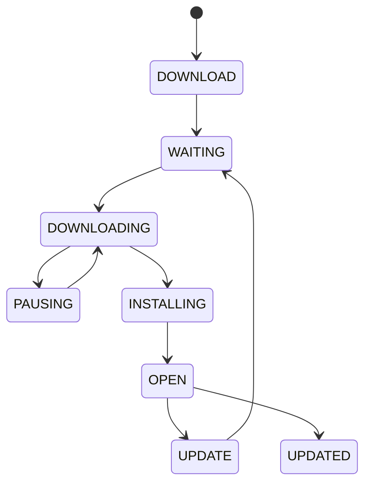

# AppStoreBase 架构解码（跨进程契约层）

> 源码锚点：commit `88832967`（master）｜ 生成：2026-09-06 ｜ 范围：AppStoreBase 全量（main 35 类 + 2 个模板测试）
> 锚点规范：`类名#方法名`；DTO 用 `字段集` 标注。

## 1. 本模块定位（无独立一图流——契约层无内部结构图）

本模块是**被 4 个模块依赖的公共底座**（AppStoreApp/AppStoreService/hcotaservice 用 `implementation`，AppStoreSDK 用 `api` 传递），因此这里的 DTO 与常量同时是 **UI 进程 / Service 进程 / HCOTA 进程之间的 IPC 契约**。它唯一有"状态机味"的是 `DownloadStatus.ButtonState`（UI 按钮态词表），其状态转移图如下：

图例：本图回答"下载按钮状态机的主转移"。实线转移由 `CommonPresenter#onDownloadClick` 分发、`DownloadButtonHelper$AppListMerger#merge` 状态改写、`DownloadStatus.ButtonState` 常量注释三方证实主轴；转移箭头不含失败/取消分支与 `UNINSTALLING`（黑户枚举，见 §5）。

## 2. 包地图

| 包 | 一行职责 | 文件数 |
|---|---|---|
| `bean/` | 下载任务/已安装/限制裁决 DTO | 5 |
| `bean/vsp/` | VSP 云请求/响应契约 + IPC 信封 IpcWrapper | 15 |
| `constant/` | 跨进程状态词表与门禁枚举 | 6 |
| `tools/` | 安装热点 ApkUtil 与共享工具箱 | 9 |

依赖：VspSDK AAR（`api` 对外暴露）、Gson、RxJava；`fragmentation_core` 声明但 **0 import**（死依赖，主文档 §3 ⚠）。

## 3. 契约语义（消费方必读）

### AppType（服务端 appType 字段取值表，决定走哪条管线）

| 值 | 语义 |
|---|---|
| POST_INSTALL=1 | 后装应用：用户从商店主动下载的第三方应用 |
| SINGLE_APP=2 | 单个应用：单体预置应用条目（HCC 版本串编码在 apkName/packageName） |
| PACKAGE_GROUP=3 | 组合包：一包多应用 |
| PRELOAD_VISIBLE=4 | 预装可见：已预装、商店内可见可管理 |
| PRELOAD_FALLBACK=5 | 预装兜底：不可见，仅在兜底/恢复场景出现 |

`EX: AppType` 常量表；消费点 `DownloadButtonHelper#shouldCheckPreAppHccVersion`（POST_INSTALL 不走 HCC 比较）。

### RestrictionType（13 个"被谁拦"编号）

`NO_RESTRICTION=-1、DEFAULT_RESTRICTION=0、UXR_RESTRICTION=1（车辆工况）、ACCOUNT_RESTRICTION=2、ACTIVATION_RESTRICTION=3、HCC_HCC_RESTRICTION=4 / HCC_OTA_RESTRICTION=5（HCC/HCOta 流程互斥）、INSUFFICIENT_STORAGE_RESTRICTION=6、FOUNDATION_SERVICE_RESTRICTION=7、USAGE_RESTRICTION=8、AUTO_UPDATE_DIALOG_RESTRICTION=9（仅 Owner 弹自动更新弹窗）、NO_ALL_UPDATE_TASK=10、PRE_APP_NOT_SUPPORT_AUTO_DOWNLOAD=11`，带 `#toString(int)` 反查。`EX: RestrictionType` 常量表。

### 门禁码同构族

`RestoreAppType`（-1/0/DISABLE_NO_UPDATE_VERSION=1/DISABLE_RESTORING_LOADING=2/RESTORE_SUCCESS=3/RESTORE_FAILURE=4）与 `UpdatePreAppType`（-1/0/DISABLE_IS_LATEST_VERSION=1）同构于"无限制/未分类/禁用码"模式。`TaskType`（TASK_DOWNLOAD_APP=1/TASK_UPDATE_APP=2）与 `DownloadStatus.TaskType`（1/2/NONE=-1）**语义双轨并存**（取值恰好一致，混用无编译约束）。

### DownloadStatus.ButtonState（UI 按钮词表，@IntDef 命名空间）

`DOWNLOAD=0x2000、UPDATE=0x2001、WAITING=0x2002、DOWNLOADING=0x2003、PAUSING=0x2004、INSTALL=0x2005、INSTALLING=0x2006、OPEN=0x2007、UPDATED=0x2008`；**`UNINSTALLING=0x2009` 不在 @IntDef 白名单且 `#log()` 不识别**（黑户，见 §5）。内部类：`UxrState`（IN_UXR/NOT_IN_UXR）、`TaskType`、`DownloadFailedReason`（18 个失败码 0x3000-0x3011：磁盘不足/SHA 校验失败/APN2 绑定失败/断电/HTTP 404/前台禁自动装等）、`TriggerType`（SINGLE_CLICK/ALL_UPDATE/AUTO_UPDATE）。`EX: DownloadStatus` 内部类常量表。

### Constant（编译期烙死的全局开关）

`DEBUG_MODE`、`DEBUG_MODE_HC_OTA`、`IS_USING_APN2=true`（注释 "must true"，指定 APN2 网络承载体）、`DEBUG_UI_WALKTHROUGH=true`（**注释警告 release 必须为 false，当前源码为 true**）、`displayPreinstallAppNameSet`（硬编码 10 个 Honda 预装包名白名单：com.hynex.online.media、com.baidu.naviauto 等，控制预装应用名称/图标展示）。`EX: Constant` 字段集。注意：Constant.java 在当前工作区有未提交修改（锚点 88832967 之外的活改动）。

## 4. 全类职责表

（子代理逐文件实读 35/35，主代理抽查 3 条锚点属实。）

### bean/（5）

| 类 | 一行职责 | 关键协作 |
|---|---|---|
| DownloadAppTaskBean | 一条下载任务的全量可变状态载体（下载源/进度/版本/按钮态/失败码），Service→UI 回调与 IPC 传输的核心 bean `EX: 字段集 packageName/downloadButtonState/failedReason/taskType/triggerType` | DownloadManager（第二批）, IpcWrapper |
| InstalledApp | "本机已安装应用"精简视图，继承 AppListResponseItem；**Parcelable 未调 super，父类 28 字段 IPC 往返全丢（bug）**`EX: InstalledApp#writeToParcel` | bean/vsp/AppListResponseItem |
| PostInstalledApp / PreInstalledApp | 家族行：两个 0 字段 0 方法的空占位类=死代码 `EX:（无成员）` | - |
| RestrictionResult | 下载/安装前"放不放行"裁决对象：三态 ALLOW/RESTRICT/WARNING + 严重度 1-4 + 文案 + 重试计数，静态工厂 success/failure/warning + Builder `EX: RestrictionResult#shouldShowUserPrompt` | RestrictionType |

### bean/vsp/（15）

| 类 | 一行职责 | 关键协作 |
|---|---|---|
| IpcWrapper\<T\> | 泛型 IPC 信封：单对象/List/字符串 + 业务码 + 失败原因过 Binder，接收端凭 elementClass 反射还原泛型——**没有它跨进程回调传不了业务对象**`EX: IpcWrapper#getObject` | AppStoreService 双侧共用（深卡片 §5） |
| AppState | VSP"应用状态上报"请求体（appId+versionId+notifyType），仅被 Service 侧已注释的 appStateNotifySync 引用=疑似死 DTO `EX: 字段集 appId/versionId/notifyType` | - |
| AppListItem | 列表页应用卡片的**聚合视图模型**：服务端静态字段 + 本机实时下载状态（按钮态/进度/已装/UXR/可用性）；与 AppListResponseItem 约 15 字段同名重复但不继承（平行模型，appType 一边 String 一边 int 已现 drift）`EX: 字段集 downloadButtonState/downloadProgress/uxrState/installed` | DownloadStatus |
| AppListResponseItem | VSP 列表接口单应用 28 字段基准模型（版本/大小/sha/屏幕支持/备案号…），其他大模型照抄它 `EX: 字段集 apkFileKey/appType(String)/hccVersionSupport/piconShow` | InstalledApp 继承 |
| AppDetailResponse | 详情页全量模型（33 字段=基准超集+截图/标签/分类）`EX: 字段集 appPic/label/usePurviewLabel/category` | - |
| AppTopResponseItem / ImageListItem / AppUpdate | 家族行：榜单轻量条目（4 字段）/ 图片项（imagePath）/ 待更新三元组（appVersionId+hccVersion+versionCode）`EX: 各自字段集` | - |
| AppDetailReq / AppDownloadReq / AppMyListReq / AppSearchReq | 家族行：4 个 VSP 请求体（详情单字段 / 下载=版本+HCC 版本 / 我的应用=版本对账 / 搜索单字段）`EX: 各自字段集` | - |
| AppDownloadResponse | 下载授权响应：拿 oss key（apkFileKey）与 sha（shaCode）才能下载校验；preAppName/preServiceName 驱动预装联动弹窗 `EX: 字段集 shaCode/apkFileKey/preAppName` | - |

### constant/（6）

| 类 | 一行职责 | 关键协作 |
|---|---|---|
| AppType | 5 种应用来源分类（§3 表）`EX: AppType` 常量表 | DownloadAppTaskBean.appType |
| Constant | 编译期全局调试/平台开关 + 预装白名单（§3）`EX: 字段集 DEBUG_UI_WALKTHROUGH/IS_USING_APN2/displayPreinstallAppNameSet` | 全仓直接读 |
| DownloadStatus | 下载全链路 5 组 @IntDef 词表（§3）`EX: DownloadStatus$ButtonState` | 全链路 |
| RestoreAppType | 预装"恢复/还原"门禁码 `EX: RestoreAppType#toString` | ToastHandler |
| RestrictionType | 13 个限制来源编号（§3）`EX: RestrictionType#toString` | RestrictionResult |
| TaskType / UpdatePreAppType | 家族行：任务业务类型常量（与 DownloadStatus.TaskType 双轨）/ 预装自动更新门禁码 `EX: 各自常量表` | DownloadAppTaskBean.taskType |

### tools/（9）

| 类 | 一行职责 | 关键协作 |
|---|---|---|
| ApkUtil | APK 包管理与静默安装中枢（深卡片 §5）`EX: ApkUtil#installSilently` | PackageInstaller, 双 Service |
| AsyncTaskUtil | 自建双线程池（CPU 固定=核数+IO 缓存）+任务 ID 登记/结果暂存+主线程 Handler+慢任务日志；TASK_RESULTS 永不清理 `EX: AsyncTaskUtil#runOnMainThread` | - |
| GsonUtil | Gson 单例封装：字符串↔对象/列表（自实现 ParameterizedTypeImpl 绕泛型擦除）+文件反序列化 `EX: GsonUtil#parseString2IntegerList` | 网络层 |
| ListUtil | 两行判空工具（null/empty 一并覆盖）`EX: ListUtil#nonNull` | 全仓 |
| NumberUtil | 数值/时间格式化：百分比、毫秒→日期（GMT+8, Locale.CHINA）、带默认值安全解析；用 android.icu（7.0+ 行为）`EX: NumberUtil#parseInt` | 进度/时间展示 |
| PackageUtil | 反射取运行时简单类名（$ 换 . 再剥包名）`EX: PackageUtil#getSimpleClassName` | 日志打点 |
| PrinterUtil | Map 调试打印器（key:value 拼行到 RLog）`EX: PrinterUtil#printMap` | 网络层 |
| RxJavaUtil | RxJava2 调度封装：全局唯一 16 线程固定池 Scheduler，justNFlatMapO/OUI（UI 版 observeOn 主线程）等；全模块异步在此池串行排队 `EX: RxJavaUtil#doOnUIThread` | 全仓异步 |
| ThreadUtil | 线程自省打印（调试）：printCurrentThreadStack/isMainThread `EX: ThreadUtil#isMainThread` | - |
| ZipUtil | 安全解压器：entry 名非法字符过滤+canonical path 防穿越（防 Zip Slip）`EX: ZipUtil#extractZip` | HCOTA/主题 zip |

## 5. 核心类深卡片

### ApkUtil（tools）

**职责**：静默安装/卸载 + 包信息查询 + 应用启动，不含下载。
**协作者**：`PackageInstaller` session + PendingIntent 回调到调用方传入的 `serviceClass`；被 AppStoreService 下载安装链与 hcotaservice 双侧调用——**它是两个服务共享的安装热点**。
**关键方法**：`#installSilently(context,apkPath,action,serviceClass)`（createSession→copyInstallFile→execInstallCommand→commit）；`#installSilentlyFromHCOta(...)`/`#uninstallSilentlyFromHCOta(...)`（广播回调 + CountDownLatch 同步等 60s）；`#isInstalled/#getVersionCode(longVersionCode)/#getAllInstalledApps/#getInstalledPackagesFromAppStore`（硬编码 "com.hynex.appstoreapp" 过滤，名为"从商店安装的包"实际只会返回商店自己，逻辑可疑）；`#openApp`；私有 `PRE_INSTALL_MAP`（硬编码 com.hynex.scheduleapp/accountapp/测试包 com.reachauto.honda.testdemo0628，配合 `#isNeedUninstallUpdate`）。
**设计动机**：[inferred] 平台无应用商店审核通道、装删全走系统 `PackageInstaller` 静默会话，跨进程回调必须落到调用方 Service——参数里的 serviceClass 即证据。
**不变量**：安装/卸载结果统一经回调返回调用方 Service；`#installApkExplicitly` 方法体全注释恒返 true（空壳陷阱）。

### IpcWrapper（bean/vsp）

**职责**：泛型 IPC 信封：把"单对象/List/字符串"连同业务码（CODE_SUCCESS/CODE_FAILURE）、失败原因打包过 Binder，接收端凭 `elementClass` 反射还原泛型元素类型。
**协作者**：AppStoreService→AppStoreApp 回调双侧；序列化分支判断 Parcelable/Serializable/String。
**设计动机**：[inferred] AIDL/Binder 回调只能传 Bundle 兼容类型，泛型 List<T> 无法直接过进程——Wrapper 用"elementClass 记录元素类型 + 统一封箱"绕泛型擦除，是全项目唯一跨进程泛型载体。
**不变量**：业务码语义（成功/失败+failReason）全仓统一。雷区：dataType 注释（"0=单个,1=集合"）与实际值（100/101）不一致，易误导。

### RestrictionResult（bean）

**职责**：下载/安装前"这次操作放不放行"的统一裁决返回值。
**协作者**：各 RestrictionChecker（Service 侧，第二批）生产；UI 侧消费 `#shouldShowUserPrompt()`/`#getUserFriendlyMessage()`；与 `RestrictionType`（被谁拦）正交。
**设计动机**：[inferred] 限制来源有 13 种、严重度分级、文案与重试策略各自不同——统一裁决对象让 Service 检查器与 UI 呈现解耦。
**不变量**：三态 ALLOW/RESTRICT/WARNING + 严重度 HIGH+CRITICAL 归危急（`#isCritical()`）；重试计数可增可重置（`#incrementRetryCount/#resetRetryInfo`）。

## 6. 看着糟但其实没问题

- **RxJavaUtil 全局唯一 16 线程固定池 + 全部 justNFlatMapX synchronized**：全模块异步任务在此排队看似瓶颈，[inferred] 但 UI 侧高频任务多为短平快 IPC，串行排队反而规避了并发乱序回调（下载事件顺序敏感）；真实下载 IO 在 Service 侧另线程。
- **TaskType 双轨**（constant/TaskType 与 DownloadStatus.TaskType 取值一致）：[inferred] 前者是任务业务分类、后者是按钮/回调语境，各自演进未合并；无编译互斥是隐患但取值兼容暂无实害。
- **AppListItem 与 AppListResponseItem 平行模型不继承**：聚合模型含可变 UI 态、服务端模型含仅序列化字段，合并会引入继承污染；代价是新增字段两处同步（appType String/int drift 已现）。
- **android.icu 的 NumberUtil**：车机 minSdk 高于 7.0，icu 格式与 java.text 的千分位差异对中文环境无碍。

## 7. 相邻产物

- [ARCHITECTURE.md](./ARCHITECTURE.md)：全项目地图；本文的 IPC 契约被其 §3/§4 主链路引用。
- [AppStoreApp.md](./AppStoreApp.md)：契约的消费侧视图（`DownloadStatus` 渲染在 DownloadButtonHelper，`IpcWrapper` 消费在 RecommendationPresenter）。

## 8. 开放问题

1. `[inferred]` `ApkUtil#getInstalledPackagesFromAppStore` 硬编码包名过滤的意图（防自环？白名单遗留？）。
2. `AppState` DTO 是否随 `appStateNotifySync` 注释而彻底废弃——待第二批 Service 侧确认。
3. `Constant.DEBUG_UI_WALKTHROUGH=true` 与工作区未提交的 `Constant.java` 改动内容——增量更新时须先核对。
4. 本轮未深挖：tools 各类在 Service 侧的真实调用面（第二批）。
