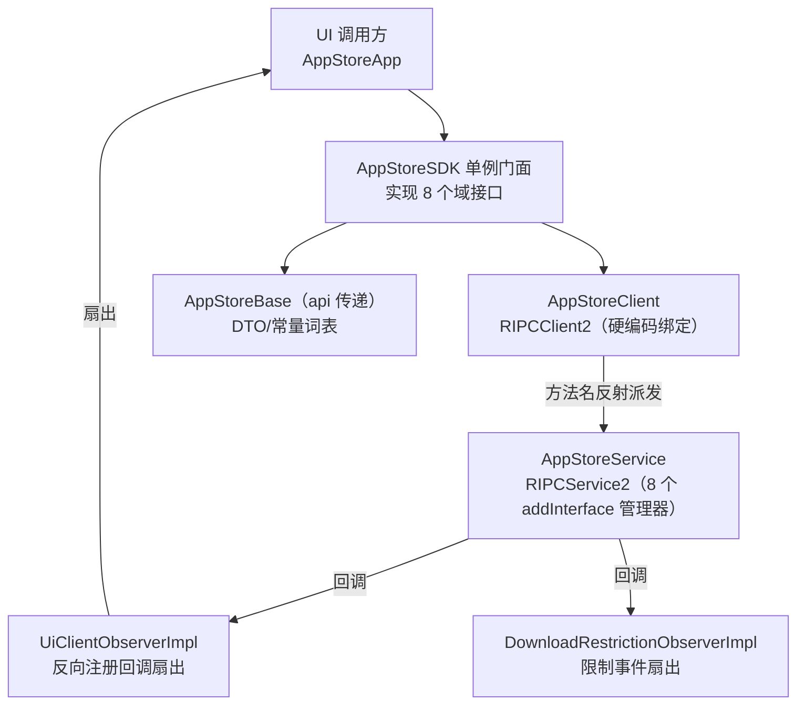

# AppStoreSDK 架构解码（IPC 客户端门面）

> 源码锚点：commit `88832967`（master）｜ 生成：2026-09-06 ｜ 范围：AppStoreSDK 全量（17 类）
> 锚点规范：`类名#方法名`。**运行时消费形态是预编译 `AppStoreSDK.aar`**——改本模块源码不影响 App/Service 运行时，须重建并拷贝 AAR（AGENTS.md 反模式）。

## 1. 一图流

图例：本图回答"SDK 是什么、事件怎么反向流"。`AppStoreClient#APPSTORE_SERVICE` 硬编码 `com.hynex.appstoreservice/.AppStoreService`；RIPC 派发机制本体在 RIpcCompat AAR（源码不在仓内）。

## 2. 门面机制（caller 必须知道的三件事）

1. **单例即连接**：`AppStoreSDK` 构造函数调用 `#connect()`（RIPCClient2 基类方法，经 `AppStoreClient#getTargetService` 提供的硬编码目标绑定服务）+ 创建 `UiClientObserverImpl`/`DownloadRestrictionObserverImpl` 并 `#addInterface`（反向注册给服务进程）。消费方第一步永远 `AppStoreSDK.getInstance()`。
2. **方法名即协议**：每个 facade 方法体只有一行——`registerRIPCCallBackAsync(callback[, params])` 或 `invokeReturn(type[, args])`/`invokeAsync(args)`。RIpcCompat 框架按**调用方法名+参数类型**反射派发到服务侧管理器同名方法（如 `AppStoreSDK#enqueueDownloadTask` → `DownloadManager#enqueueDownloadTask`）。这就是"SDK 公共方法名必须与服务侧 handler 对齐"约定的机制根源（AGENTS.md 反模式条目）。
3. **事件反向流**：服务侧管理器经 `invokeAllAsync` 调 UI 进程里反向注册的 `UiClientObserverImpl`，它按 `CopyOnWriteArrayList` 扇出给 attach 上来的观察者（AppStoreApp 里唯一 attach 的是 `DownloadStateDispatcher`）。

## 3. 全类职责表（17/17 实读）

| 类 | 一行职责 | 关键协作 |
|---|---|---|
| AppStoreSDK | 单例门面：8 域接口合一，每方法一行泛型 IPC 调用（49 个公共方法）`EX: AppStoreSDK#enqueueDownloadTask` | AppStoreClient, 两 Impl |
| AppStoreClient | 绑定目标硬编码（package/service 两个常量）的 RIPCClient2 子类 `EX: AppStoreClient#getTargetService` | RIpcCompat |
| UiClientObserverImpl | 服务→UI 事件扇出器：10 类事件的 CopyOnWriteArrayList 分发 + ADDED/REMOVED @IntDef `EX: UiClientObserverImpl#attachUiObserver` | DownloadStateDispatcher（对端） |
| DownloadRestrictionObserverImpl | 下载限制事件扇出器（`onDownloadRestriction(bean, JSON, tag)`）`EX: DownloadRestrictionObserverImpl#attachDownloadRestrictionObserver` | AppsManagementPresenter（对端） |
| interfaces/AppStoreInterface | 服务根接口标记（空，extends RIPCInterface）`EX:（声明）` | AppStoreService 实现 |
| interfaces/UiClientObserver | 10 个 default 空方法的可选事件契约（反向注册）`EX: UiClientObserver(声明)` | UiClientObserverImpl |
| interfaces/DownloadInterface | 下载域 14 方法契约（入队/取消/删除/查询/全部更新）`EX: DownloadInterface(声明)` | DownloadManager 实现 |
| interfaces/VspInterface | 云查询 5 端点契约（list/search/top/text/detail）`EX: VspInterface(声明)` | VspManager 实现 |
| interfaces/InstalledAppInterface | 已装域 6 方法契约 `EX: InstalledAppInterface(声明)` | InstalledAppManager 实现 |
| interfaces/SettingsInterface | 设置域 7 方法契约（HCC 版本/自动更新/可降级）`EX: SettingsInterface(声明)` | SettingsManager 实现 |
| interfaces/PreAppOperationsInterface | 预装操作 2 方法契约（startUpdateHcc/startDowngradeHcc）`EX: PreAppOperationsInterface(声明)` | PreAppManager 实现 |
| interfaces/RestrictionInterface | UXR 查询单方法契约 `EX: RestrictionInterface(声明)` | （isInUxrOperation 由 UxrManager 域提供） |
| interfaces/AccountInterface | 账号域 2 方法契约 `EX: AccountInterface(声明)` | AccountManager 实现 |
| interfaces/AppStoreListener | 老式 onDownloadProgress(int,int) 监听=疑似废弃残留 `EX: AppStoreListener(声明)` | 无（零消费） |
| service/AppStoreCallback | 同上的 RIPC 版 onDownloadProgress=疑似废弃残留 `EX: AppStoreCallback(声明)` | 无（零消费） |
| constants/HccCompareResult | 4 值比较结果 @IntDef（UPDATE/UPDATED/HIDE/PRELOAD_FALLBACK）`EX: HccCompareResult` 常量表 | AppListMerger 消费 |

**覆盖实数**：17/17 全文实读（主代理本人通读，无子代理）。`[name-only]`：0。

## 4. 核心类深卡片

### AppStoreSDK

**职责**：把 8 个域接口并为一个单例门面，UI 一切 IPC 的唯一入口。
**协作者**：`AppStoreClient#getTargetService`（提供硬编码绑定目标，connect 绑定行为在 RIPCClient2 基类）、`UiClientObserverImpl`/`DownloadRestrictionObserverImpl`（反向注册）、`AppStoreBase` DTO（api 传递给消费方）。
**设计动机**：[inferred] RIpcCompat 的反射派发要求"客户端调用形态与服务端方法签名一致"，把接口拆成 8 个域文件但聚合进一个类，让 UI 侧只 import 一个门面；域接口保留则是给服务侧实现方做契约对齐的"对照表"。
**不变量**：①每方法一行（无业务逻辑，逻辑全在服务侧）；②Singleton 静态内嵌类懒加载。雷区：`invokeReturn(List.class,...)` 的泛型擦除处理依赖 IpcWrapper.elementClass（AppStoreBase.md §5）；方法改名即断链且编译期无感（反射派发）——重构 SDK 公共方法必须双端同步。

### UiClientObserverImpl

**职责**：服务进程反向调用 UI 的唯一入口之一：10 类下载/安装/UXR/OTA 事件扇出。
**协作者**：服务侧 `invokeAllAsync`（经 RIPC 按 default 方法签名派发）、UI 侧 `DownloadStateDispatcher`。
**设计动机**：与 DownloadStateDispatcher 构成**三级扇出链**（SDK Impl → App 进程 Dispatcher → 各页 Presenter observer），逐级 CopyOnWriteArrayList——每级职责：跨进程边界 / 进程内全局副作用 / 页面级订阅。
**不变量**：default 空方法=服务可只发新事件不要求客户端同步升级（协议向后兼容手法）。雷区：`@InstalledChangeType` 注解引用 impl 类（接口依赖 impl 包，分层倒置）。

## 5. 看着糟但其实没问题

- **接口拆 8 个文件再聚合进一个类**：看似重复，实为"服务侧实现分组"与"客户端调用便利"两个需求的折中。
- **AppStoreListener/AppStoreCallback 疑似废弃**：零消费方，[inferred] 是 RIPC 引入前的老回调 API 残留，未清理但无害。
- **门面里 invokeReturn(Integer.class) 与 boolean.class 混用**：RIPC 序列化对装箱类型的处理差异，[inferred] 历史微调结果，服务端签名对齐后行为一致。

## 6. 相邻产物 / 开放问题

相邻：[AppStoreService.md](./AppStoreService.md)（服务侧同名方法实现）、[AppStoreBase.md](./AppStoreBase.md)（DTO 词表）、[ARCHITECTURE.md](./ARCHITECTURE.md)（进程边界）。

开放问题：
1. `[inferred]` RIPCClient2 的方法名派发是否包含重载解析规则（invokeAsync 多参重载同名方法在 DownloadInterface 上存在）——RIpcCompat AAR 源码不在仓，无法验证，改 SDK 签名前建议先在平台侧确认。
2. `AppStoreListener`/`AppStoreCallback` 是否还有仓外消费方（其他 App 的 AAR 消费）——删前需查。
