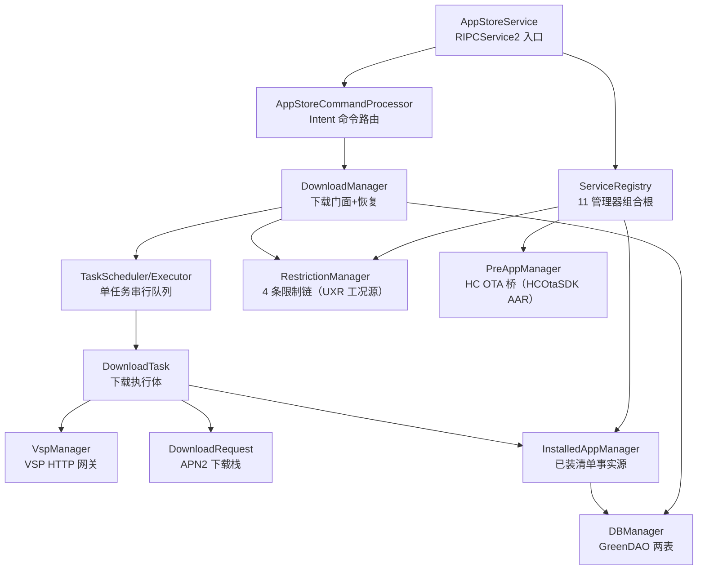
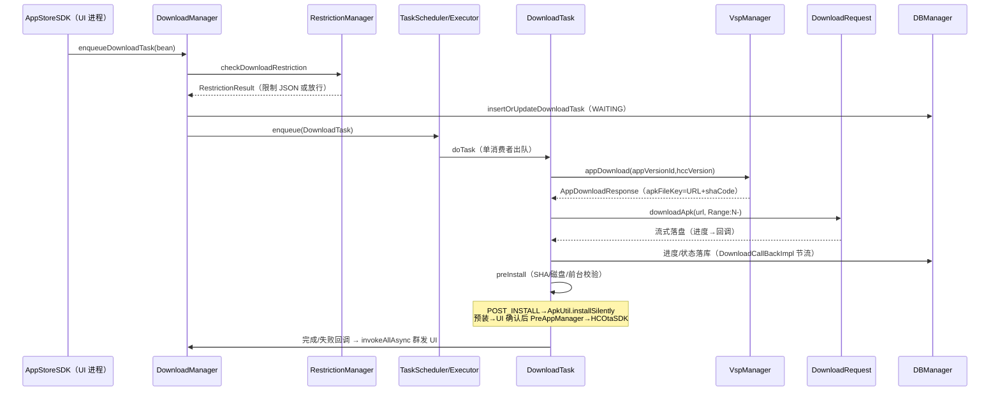

# AppStoreService 架构解码（IPC 服务进程）

> 源码锚点：commit `88832967`（master）｜ 生成：2026-09-06 ｜ 范围：AppStoreService 全量（main 97 类 + debug 源集 mock 12 类 + 测试 26 文件名单级）
> 锚点规范：`类名#方法名`。模块为 application（独立 APK `AppstoreService_<version>.apk`），GreenDAO `schemaVersion 1017`，生成 DAO 在 `database.greendao` 包（源树无生成文件）。

## 1. 一图流

图例：本图回答"服务进程 135 文件怎么分工"。全部实线经 import/构造参数证实；`invokeAllAsync`（事件广播回 UI）走 `RIPCService2` 基类（RIpcCompat AAR，源码不在仓内），不画成节点。

## 2. 快速上手阅读路径

1. `AppStoreService.java#onCreate` —— 服务起来做了什么？（ServiceRegistry.init + 命令线程 + 3 广播）
2. `ServiceRegistry#registerServices` —— 11 个管理器怎么组装？（字符串名注册 + `addInterface` 暴露 IPC；RestrictionManager/ProcessManager/AppStorePowerManager 三个是纯内部）
3. `DownloadManager#enqueueDownloadTaskInternal` —— 下载从哪进？（限制链→任务 bean 修饰→入队）
4. `TaskExecutor#start` —— 谁执行任务？（单消费者循环 + 任务自阻塞，见 §4）
5. `DownloadTask#saveFile` —— 怎么下载落盘？（RANGE 续传→SHA→磁盘/前台校验→install）
6. `InstalledAppManager#launchSyncInstalledAppDBTask` —— 已装清单怎么维护？（主动扫描轮询，不用包广播）
7. `WalkthroughMockBridge#initAll` —— mock 数据从哪来？（DEBUG_UI_WALKTHROUGH 反射桥到 debug 源集）

## 3. 分层与包地图

| 包 | 一行职责 | 依赖 | 被依赖 |
|---|---|---|---|
| （根）| 服务入口三元组（Service/AppStoreService/ServiceRegistry）+ AccountManager + TestActivity 调试残留 | RIPCService2、SDK 接口、全体管理器 | - |
| `download/` | 下载编排：门面+回调落库+任务族（队列/调度/执行体） | restriction、database、network、install | UI 经 DownloadInterface |
| `util/network/` | 自建 OkHttp/Retrofit 下载栈 + APN2 承载 + VSP 协议残留 | VspSDK、RIpcCompat | DownloadTask |
| `install/` | 已装清单事实源、HC OTA 桥、PackageInstaller 会话监听 | HCOtaSDK、AppStoreBase.ApkUtil | DownloadTask、UI 经 InstalledAppInterface |
| `restriction/` | 4 条限制链 + 8 个检查器 + UXR/基础服务状态源 | RCarUxRestrictions、RMessageCenter | DownloadManager、ProcessManager |
| `database/` | GreenDAO 门面+迁移+两实体（DOWNLOAD_TASK/INSTALLED_APP） | greendao 生成 DAO | DownloadManager、InstalledAppManager |
| `vsp/` | VSP HTTP 网关（list/search/myList/top/text/detail/download 七端点） | VspSDK、Retrofit | VSP_SERVICE（IPC+内部） |
| `command/` `broadcast/` `receiver/` | onStartCommand 命令路由 + 3 个动态注册广播 | ServiceUtil | AppStoreService |
| `rout/` | 出向仪表（DA/R 端）通知门面：应用状态 JSON/卸载回传 | InstalledAppManager | 平台 R 端 |
| `settings/` `power/` | HCC 版本/自动更新偏好、ACC 电源桥 | HCOtaSDK、RPowerManager | Restriction、DownloadRequest |
| `util/` | 工具箱 + 神策埋点 + 系统级 telop 弹窗 + CallObserver 进程内总线 + WalkthroughMockBridge | SensorsDataAPI、HDTelopWindow | 全体 |
| `src/debug/mock/` | UI 走查 mock 基建：场景化 JSON fixture + 场景切换 Activity（main 侧仅 `WalkthroughMockBridge` 反射桥） | - | VspManager/InstalledAppManager/DownloadManager |

## 4. 主链路（下载任务全生命周期）

逐段锚点（POST_INSTALL 全流程）：

1. **入队**：`DownloadManager#enqueueDownloadTask` → `#enqueueDownloadTaskInternal`：先 `RestrictionManager#checkDownloadRestriction`（被限且非仅 AUTO_UPDATE_DIALOG → 返回限制 JSON）；runnable 里按 AppType 定目标文件（POST→POST_APP_DOWNLOAD_DIR/appName，SINGLE→PRE_APP_DOWNLOAD_DIR/apkName.zip）；若在 `appUpdateMap`（`#launchSyncAppList`/`#syncUpdateAppDownloadReq` 维护的云端最新版本映射）则用云端 versionId/hccVersion/versionCode 覆盖 bean；`DownloadTask#downloadTaskBean(bean).build()` 落库置 WAITING → `TaskScheduler#enqueue`。
2. **串行调度**：`TaskExecutor#start` 单消费者 `mTaskQueue.take()` 出队 → `doTask()`（按 DB failedReason 分流：磁盘不足/前台禁装直接 install；断电报错后继续重下）→ `blockTask()`（任务阻塞在自己的私有 PriorityBlockingQueue.take() 上，只有终点 `unLockBlock()` 放行）→ `finishTask()`——**全系统同时只有一个下载/安装任务**（`CurrentRunningTask` 静态单引用是取消/删除/续传的寻址点）。
3. **取址下载**：`DownloadTask#getAppDownloadUrl` → `VspManager#appDownload`（GET appstore/download 换 `AppDownloadResponse`，**apkFileKey 即下载 URL**，shaCode 为校验值）→ 按 已有文件长度拼 `Range: bytes=N-` → `DownloadRequest#downloadApk`（Retrofit @Streaming；`Constant.IS_USING_APN2=true` 时 OkHttp socketFactory 强制走 APN2 网卡，先 `NetworkUtils#isHostAvailable` 预检）；`saveFile` 追加写+每 4KB flush+fsync。
4. **校验安装**：`DownloadTask#preInstall`：`Sha256Util#checkSha256`（失败→CHECK_SHA256_FAILED+删库删文件）→ `FileUtil#availableSizeInMB` 磁盘 → `ProcessManager` 前台检查 → POST_INSTALL 走 `ApkUtil#installSilently`（结果经 `AppStoreCommandProcessor#parseInstallationResult` 回填）；**预装（非 POST_INSTALL）不走 PackageInstaller**——`onPreAppInstallDialogShow` 弹到 UI，用户确认后 `DialogPresenter#enqueuePreAppDownloadTask` → IPC → `PreAppManager#startUpdateHcc` 把本地 zip 交给 `HCOtaSDK#startUpdate`。
5. **状态回写与广播**：`DownloadCallBackImpl#onDownloadStateChanged`（先落库再委托）→ `DownloadManager` → `ServiceRegistry.getAppStoreServiceContext().invokeAllAsync(...)` 群发全部 UI 客户端（进度 1s 节流，状态不节流）；安装成功 `InstalledAppManager#onInstalledAppChanged(pkg,ADDED)` + `sendAppStatusInfoListToDA`（经 `ROutManager` 推仪表）。
6. **重启恢复**：`DownloadManager` 构造内 `#refreshAfterReboot` 扫全表：DOWNLOAD 已装→删；INSTALLING→回退 UPDATE/DOWNLOAD+failedReason=POWER_OFF_WHEN_INSTALLING+删文件；DOWNLOADING/WAITING→**PAUSING 不自动重跑**（`#reEnqueueDownloadTaskAfterReboot` 被注释，恢复靠 UI 重新触发）；随后 `#launchSyncAppList` 拉云列表补 UPDATE 标记。

## 5. 模块卡片（包级）

### 根包 + ServiceRegistry（组合根）

**职责**：`ServiceRegistry#registerServices` 仿 SystemServiceRegistry：11 个命名服务双检锁懒加载 + **注册即 `startService` 全部拉活**（AGENTS.md"eager in practice"）；8 个 `addInterface` 暴露 IPC，RestrictionManager/ProcessManager/AppStorePowerManager 三个纯内部。`AppStoreService#onStartCommand` 把 Intent post 到 "AppStoreCommandThread" 交给 `AppStoreCommandProcessor#handleCommand`（10 个 action：静默装/卸/更结果回填、前后台、update_all、emulate 后门等）。
**动机**：考据 `74107783`"#AppStore#代码优化#服务初始化"——从散落初始化收编为注册表。**雷区**：`VspManager.VSP_MANAGER` 是异步回调赋值后 addInterface（与其他 10 个同步 new 不一致）；`AccountManager#isAccountNormalLoggedIn` 注释"回调不能准确，暂时用主动 get"（登录监听被注释，每次主动轮询）。

### download/（下载编排）

**职责**：DownloadManager 门面（IPC 入口+恢复+appUpdateMap 元数据）+ DownloadCallBackImpl（唯一落库+节流出口）+ 任务族：`BlockTaskQueue`（PriorityBlockingQueue 单例+AtomicInteger sequence FIFO）、`TaskScheduler`、`TaskExecutor`（单消费者）、`BaseTask`/`DownloadTask`（执行体）、`TaskPriority` 三档。
**关键协作**：见 §4；`CurrentRunningTask` 静态单引用。
**动机**：车机流量/功耗约束下"同时只有一个下载"是硬需求，自阻塞队列（而非线程池并发）是实现手段 [inferred：无 ADR，从 TaskExecutor 结构反推]。
**雷区**：`TaskExecutor#start` 的 catch 在 while 循环外——任何任务 RuntimeException **永久杀死唯一消费者线程**且 isRunning 仍 true、兜底 `startRunning()` 不会重启循环（队列静默积压，下载整体失效）；`DownloadTask#finishTask` 在 `mIsDownloadError && (ALL_UPDATE||AUTO_UPDATE)` 分支不调 super（mTaskStatus 残留+`mTaskBean=null`，Manager 经 CurrentRunningTask 摸到即 NPE）；删除当前任务不取消网络流，文件可能被后续 FileOutputStream 复活。

### util/network/（自建下载栈）

**职责**：`DownloadRequestProvider#getDownloadRetrofit`（APN2 SocketFactory 注入+30s 超时）、`DownloadRequest#downloadApk`（可达性预检+@Streaming GET+按 id 管理取消）、`DownloadRetrofitService#downloadFile`（唯一端点）、`SingleDownloadSubscriber`（404/416→failedReason 映射）。
**动机**：VspSDK 只管协议请求，文件下载自建 [inferred：APN2 网卡绑定是平台特有需求，通用库不覆盖]。考据：`DownloadRequest.init()` 仅在 `!DEBUG_MODE_WHIT_NETWORK` 时执行（ServiceRegistry）。
**雷区**：`DownloadInterceptor`（拒 text/html 网关页）与 `RetryInterceptor` **都未注册进 OkHttpClient**——防护实际不存在；`reInitServiceAfterAccOn` 只换 mDownloadRequest，在途 subscriber 仍绑旧 client；`CommonRequest` 178 行 97% 注释（VSP 轮询残留）。

### install/（清单与安装）

**职责**：`InstalledAppManager#launchSyncInstalledAppDBTask`——**主动扫描+DB 镜像+云端轮询**（不用包广播）：repeatWhen 常驻循环全量扫系统包（非系统+10 个预装白名单才入库）、反向清理（DB 判定 isAppInstalled，不查 PackageManager）、`appMyList` 同步云端属性（失败 10s 重试）→ `sendAppStatusInfoListToDA` 推仪表；`AppStorePackageManager#getPhysicalApkType`（0/1/2/3 物理类型判定）+SessionCallback.onFinished 触发重扫（替代 PACKAGE_ADDED 广播）。
**雷区**：`updateInstalledAppsAttributes` 循环里 db==null 写 `return`（应为 continue，一条缺失中止整批回写）；`insertOrUpdateInstalledApp` 先落库后 setAppType（该次不落库）；IPC 线程里阻塞网络调用（自注 "not a good idea"）；装完立刻查询可能读到旧库（onFinished 异步）。

### restriction/（限制链）

**职责**：`RestrictionManager#initRestrictionChain` 4 条链（全 shortCircuit）：DOWNLOAD_APP（Permission→FoundationService→Hcc→AutoUpdateDialog）、CHECK_BEFORE_ENQUEUE_PRE_APP（少弹窗/存储）、PRE_UPDATE_ALL_APPS、OPEN_APP（UXr→FoundationService→Permission→Usage，命中即 `ProcessUtil#killProcess` 杀前台应用）；`UxrManager#parseRestrictionState` 把车辆工况 4 位枚举翻成 isInUxrOperation/Display 双布尔缓存。
**动机**：RestrictionResult（第一批 AppStoreBase.md §5）的生产方——13 种 RestrictionType 的生产者映射表见子代理考据（NO_ALL_UPDATE_TASK/PRE_APP_NOT_SUPPORT_AUTO_DOWNLOAD 不走链由 DownloadManager 直写）。
**雷区**：`HccRestriction#checkRestrictionRequired` 在 check 中改自己的 restrictionType 且实例跨 4 链共享（并发竞态）；`PreAppAllUpdateRestriction` 构建了但没链挂它，且注册类型是 INSUFFICIENT_STORAGE（复制粘贴错类型）；版本协议解析散落两处重复。

### database/ + vsp/ + rout/

**职责**：`DBManager` 两表（DOWNLOAD_TASK/INSTALLED_APP）CRUD，写路径吞 SQLiteFullException；`DBHelper#onUpgrade`→`MigrationHelper#migrate`（_TEMP 重建+交集列 REPLACE INTO 回填，**daoClasses 只传 DownloadTaskEntityDao——INSTALLED_APP 升级被 drop 重建不回填**，靠 InstalledAppManager 重扫自愈）；`VspManager#appList` 等 7 端点 + 每入口先问 WalkthroughMockBridge；`ROutManager#syncUninstallStatus` 出向仪表通知。
**雷区**：DBManager 在 `mDaoSession==null` 时静默返回——App 的 3 线程池异步 initDB 与管理器构造存在竞态，恢复可能被静默跳过；`App#setupRxJavaErrorHandler` 全局吞 UndeliverableException。

### mock 体系（UI 走查基建）

**职责**：main 侧 `WalkthroughMockBridge#initAll`（DEBUG_UI_WALKTHROUGH 时 Class.forName 反射找 debug 源集 3 个 MockHelper——**防 main 依赖 debug 的编译隔离**）；debug 侧 VspMock/InstalledAppMock/DownloadMock 三组 Helper+Initializer+ProviderImpl：场景存 `MockScenarioStore`（SharedPreferences），fixture 在 `src/debug/assets/mock/<场景>/<endpoint>.json`（default/home_error/mine_all_update 等 14+ 场景，缺文件回退 default，`real` 放行真网），`MockScenarioActivity` 收 `scenario` extra 供 `am start` 切场景。
**动机**：考据 `63b78606`"#AppStore#UI走查#UI修改"——走查/截图自动化（CONTEXT.md"截图任务/Mock 场景"术语）的产物。**雷区**：`DEBUG_UI_WALKTHROUGH=true` 已随源码发布（第一批已知）；`Constant.DEBUG_MODE_WHIT_NETWORK`（=false）是另一开关：联网调试不产假数据，只影响 DownloadRequest.init 时机与账号校验直通。

## 6. 核心类深卡片

### DownloadManager（download/manager，1004 行，全仓最大+churn 第一）

**职责**：下载域 IPC 门面：入队/取消/删除/查询/全部更新 + 重启恢复 + appUpdateMap 云版本元数据 + 事件广播出口。
**协作者**：RestrictionManager（`#checkDownloadRestriction`）、TaskScheduler、DownloadCallBackImpl、DBManager（20+ 调用点）、InstalledAppManager、VspManager（`#updateDownloadApps`）、WalkthroughMockBridge（正式 IPC 查询内嵌 mock 分支）。
**设计动机**：[inferred] 下载是唯一跨 UI 页面全局可见的状态源，故门面同时承担"元数据对账中心"（appUpdateMap/syncUpdateAppDownloadReq）与"事件总出口"（invokeAllAsync）。
**不变量**：①任务状态唯一持久源是 DOWNLOAD_TASK 表（`DownloadTaskEntity#transfer2DBT` 映射 DownloadAppTaskBean）；②所有事件经 invokeAllAsync 群发，UI 侧 DownloadStateDispatcher 是对端。雷区：构造函数做 DB 全扫+VSP 网络调用（与 App 异步 init 竞态）；日志标签错写 "DownloadTask"。

### DownloadTask + BaseTask（download/task）

**职责**：单任务全生命周期执行体；BaseTask 用**任务自阻塞**（私有 mBlockQueue.take()，终点 unLockBlock）实现全局串行。
**协作者**：VspManager、DownloadRequest、DownloadCallBackImpl、ApkUtil、InstalledAppManager、PreAppManager（预装分叉）。
**设计动机**：见包卡片；`ITask#blockTask/#unLockBlock` 契约。
**不变量**：①同时唯一任务（CurrentRunningTask 单引用）；②进度先落库再广播且节流 1s。雷区：`#saveFile` 每 4KB fsync（性能）、total=0/-1 时负数/NaN 进度入库、`isPaused` 只写不读。

### InstalledAppManager（install/，802 行）

**职责**：已装清单唯一事实源：扫描→DB→云端属性轮询→出向 DA 推送→IPC 查询。
**协作者**：DBManager、VspManager、ROutManager、AppStorePackageManager、DownloadManager（叠加下载态）、UxrManager（读缓存布尔）。
**设计动机**：[inferred] 车机无用户可感的"包安装广播时序"，且预装白名单需运营字段（useStatus/driveFunctionLimit）从云端补齐——主动轮询比被动广播更可控。
**不变量**：DB 是"已安装"判定源（isAppInstalled 只查 DB）；下载态以 DOWNLOAD_TASK 表叠加为准。雷区：见包卡片三处 bug 级细节。

### RestrictionManager + RestrictionChain（restriction/）

**职责**：4 条命名限制链的构建与执行；Restriction 抽象基类（type/名称/优先级/enabled + `#checkWithConfig` 测试开关）。
**协作者**：8 个检查器、AccountManager、FoundationServiceManager、UxrManager、SettingsManager。
**设计动机**：[inferred] 13 种限制来源随运营演进，链+聚合 RestrictionResult 让"检查项增删"不改动调用方（与第一批 RestrictionResult 深卡片对偶：这里是生产侧）。
**不变量**：链 shortCircuit=true 按添加序执行；结果 JSON 返回 UI（`CommonPresenter#handleRestriction` 消费）。雷区：HccRestriction 自改类型跨链共享竞态。

### VspManager（vsp/）

**职责**：VSP 云七端点 HTTP 网关，结果包 IpcWrapper；同时服务 IPC 调用方与进程内（DownloadManager.updateDownloadApps）。
**协作者**：VspSDK（getManager 注入）、Retrofit、WalkthroughMockBridge（每入口截流）、DownloadManager/InstalledAppManager（成功后喂数据）。
**设计动机**：考据 `ServiceRegistry` 注册器：`VspSDK#getInstance().getManager(VspManager.class, ...)`——VspManager 本体在本模块但实例由 VspSDK AAR 创建 [inferred：让平台 SDK 管理 HTTP 生命周期]。**雷区**：`BASE_URL` 硬编码 `http://vsp-integration.reachstar.com/...`（集成环境+明文 http，换环境须改源码）。

### AppStoreCommandProcessor（command/）

**职责**：onStartCommand 的 10 action 路由表；`#parseInstallationResult` 解析 PackageInstaller EXTRA_STATUS 回填安装结果。
**协作者**：CurrentRunningTask、InstalledAppManager#onUninstallExplicitlyResult、DownloadManager#launchSyncAppList、HandlerUtil。
**设计动机**：PackageInstaller 静默安装的结果回调用 PendingIntent.getService——命令处理器是安装/卸载异步结果的单入口 [inferred：与 ApkUtil#installSilently 的 serviceClass 参数互证]。
**雷区**：`handleEmulateCommand` 硬编码拉起 com.hynex.themeapp（任何进程可发该 action）；4 个 handle* 方法体全注释。

### WalkthroughMockBridge（util/）

**职责**：main↔debug 反射桥：initAll 逐个 Class.forName debug 源集 MockHelper，tryMock* 转发，release 全 no-op。
**协作者**：App#onCreate（开关门）、VspManager 全部入口、InstalledAppManager/DownloadManager 查询。
**设计动机**：考据 `63b78606`：让"场景化假数据"随走查需求演进而不进 main 编译单元——main 侧只留一个反射点。
**不变量**：所有 mock 入口先于真实逻辑执行；`real` 场景放行。雷区：正式 IPC 查询（getDownloadAppsFromDB/getAppStatus/updateAllApps）内嵌 mock 分支=调试桥入生产路径。

## 7. 全类职责表

（3 个只读子代理逐文件实读：download+network 25/25、install/restriction/power/settings/rout 24/24、根+database+vsp+command+壳层+util 49/49，重叠 rout 去重；主代理抽查 3 条锚点属实。）

### 根包 + database + vsp + command + broadcast + receiver + base + app（21）

| 类 | 一行职责 | 关键协作 |
|---|---|---|
| AppStoreService | RIPCService2 子类 IPC 入口：init 注册表+命令线程+3 广播 `EX: AppStoreService#onStartCommand` | ServiceRegistry, AppStoreCommandProcessor |
| ServiceRegistry | 11 命名服务双检锁注册表，注册即拉活，8 个 addInterface 暴露 IPC `EX: ServiceRegistry#registerServices` | 全体管理器 |
| App | 服务 Application：RLog+RxJava 全局吞错+UIComponent+3 线程池异步 6 项（偏好/DB/两下载目录/ShareUtil/神策）`EX: App#onCreate` | DBManager, WalkthroughMockBridge |
| AccountManager | 账号/激活门禁：SIM 未激活→ACTIVATION、未登录→ACCOUNT；联网调试模式直通 `EX: AccountManager#checkAccountPermission` | RestrictionManager |
| TestActivity | main 源集残留调试启动器（发 AppInfoChanged 测试 action）`EX: TestActivity#startAppStoreService` | ServiceUtil |
| DBManager | 两表 CRUD 单例门面，写路径吞 SQLiteFullException，session null 静默 `EX: DBManager#insertOrUpdateDownloadTask` | 两 EntityDao（生成） |
| DBHelper | onUpgrade 委托迁移+DROP 遗留 MINI_APP_HISTORY_T `EX: DBHelper#onUpgrade` | MigrationHelper |
| MigrationHelper | 通用迁移：_TEMP 重建+交集列 REPLACE INTO 回填 `EX: MigrationHelper#migrate` | DaoMaster |
| DownloadTaskEntity | DOWNLOAD_TASK 实体+`transfer2DBT` bean 映射器（26 字段）`EX: DownloadTaskEntity#transfer2DBT` | 生成 DAO |
| InstalledAppEntity | INSTALLED_APP 实体（含走行限制/副驾屏运营字段）`EX: 字段集 driveFunctionLimit/useStatus/copilotScreenSupport` | 生成 DAO |
| VspManager | VSP 七端点 HTTP 网关+mock 截流+成功喂数 `EX: VspManager#appList` | VspSDK, WalkthroughMockBridge |
| AppStoreCommandProcessor | Intent 10 action 路由+安装结果解析+emulate 后门 `EX: AppStoreCommandProcessor#handleCommand` | CurrentRunningTask |
| UpdateBroadcastReceiver | PS 个人设定同步完成且自动更新开启→发 UPDATE_ALL_APPS `EX: UpdateBroadcastReceiver#onReceive` | AppPreferences, ServiceUtil |
| CloseAppBroadcastReceiver / CarServiceBootedReceiver | 家族行：两个动态注册广播，处理体全注释=空壳（与 app 侧同名未注册类不同命）`EX: CloseAppBroadcastReceiver#onReceive` | - |
| AppManager | 5 行完全空类（占位遗骸）`EX:（无成员）` | - |
| BaseManager | 管理器基类：TAG+日志，空 onDestroy `EX: BaseManager(构造)` | AccountManager/ROutManager |
| BasePresenter/IBasePresenter/IBaseView/BaseView | 家族行：MVP 骨架 4 件，服务进程内无实际使用者 `EX: BasePresenter#attachView` | - |

### download/（12）

| 类 | 一行职责 | 关键协作 |
|---|---|---|
| DownloadManager | 下载域 IPC 门面+恢复+元数据对账+事件出口（深卡片 §6）`EX: DownloadManager#enqueueDownloadTaskInternal` | RestrictionManager, DBManager |
| DownloadCallBackImpl | 状态唯一落库+节流出口：先写表再委托广播 `EX: DownloadCallBackImpl#onDownloadErrorInternal` | DBManager, SensorDataUtil |
| DownloadTask | 单任务全生命周期执行体（深卡片 §6）`EX: DownloadTask#saveFile` | DownloadRequest, ApkUtil |
| BaseTask | 任务骨架：优先级比较+自阻塞 take()/unLockBlock `EX: BaseTask#unLockBlock` | BlockTaskQueue |
| BlockTaskQueue | 全局唯一优先级队列+AtomicInteger 序号 FIFO `EX: BlockTaskQueue#add` | TaskScheduler |
| CurrentRunningTask | 静态单引用记录活任务，取消/删除的寻址点 `EX: CurrentRunningTask#getCurrentShowingTask` | ITask |
| TaskScheduler | 调度单例：入队前兜底拉活 executor `EX: TaskScheduler#enqueue` | BlockTaskQueue, TaskExecutor |
| TaskExecutor | 单消费者循环（catch 在循环外=一炸全灭，见 §5 雷区）`EX: TaskExecutor#start` | BlockTaskQueue |
| TaskEvent | WeakReference 事件封装，仅服务于已注释的 Handler 分发=死代码 `EX: TaskEvent#getEventType` | - |
| TaskPriority | LOW/DEFAULT/HIGH 三档优先级枚举，供 `BaseTask#compareTo` 倒序比较实现高优先先出 `EX:（枚举常量）` | BaseTask |
| ITask | 任务契约：doTask/finishTask/removeTask/blockTask/unLockBlock `EX: ITask#blockTask` | BaseTask |
| IDownloadCallback | 任务→Manager 回调契约 `EX: IDownloadCallback#onDownloadCompleted` | DownloadCallBackImpl |

### util/network/（13）

| 类 | 一行职责 | 关键协作 |
|---|---|---|
| DownloadRequest | 自建下载执行器单例：APN2 预检+@Streaming GET+按 id 取消 `EX: DownloadRequest#downloadApk` | DownloadRetrofitService, APNManager |
| DownloadRequestProvider | Retrofit 工厂：APN2 SocketFactory+30s 超时 `EX: DownloadRequestProvider#getDownloadRetrofit` | APNManager |
| DownloadRetrofitService | Retrofit 端点：`@Streaming @GET downloadFile(url,@Header("RANGE"))` `EX: DownloadRetrofitService#downloadFile` | - |
| SingleDownloadSubscriber | 404/416→failedReason 映射，cancel 断订阅 `EX: SingleDownloadSubscriber#onError` | DownloadCallBackImpl |
| NetworkUtils | APN2 网卡上解析 URL host 判可达 `EX: NetworkUtils#isHostAvailable` | APNManager |
| DownloadInterceptor / RetryInterceptor / RequestInterceptor | 家族行：三个拦截器**均未注册进 OkHttpClient**（text/html 防护实际不存在）`EX: DownloadInterceptor#intercept` | - |
| DownloadResponseBody | 只计数不发射的包装体=死代码 `EX: DownloadResponseBody#createSource` | - |
| DownloadValueBean / BaseFlatFunction / NetConfig | 家族行：零调用方残留（进度对/Flowable 骨架/网络配置仓）`EX: 各类唯一主方法` | - |
| CommonRequest | 178 行 97% 注释的 VSP 轮询残留 `EX:（仅类声明）` | - |

### install/ + restriction/ + settings/ + power/ + rout/（24）

| 类 | 一行职责 | 关键协作 |
|---|---|---|
| InstalledAppManager | 已装清单唯一事实源（深卡片 §6）`EX: InstalledAppManager#launchSyncInstalledAppDBTask` | DBManager, VspManager |
| PreAppManager | HC OTA 桥：zip 交 HCOtaSDK、翻译 OTA 回调为按钮态/弹窗/DB `EX: PreAppManager#startUpdateHcc` | HCOtaSDK, DownloadManager |
| AppStorePackageManager | PackageInstaller SessionCallback+物理 APK 类型判定（0/1/2/3）`EX: AppStorePackageManager#getPhysicalApkType` | InstalledAppManager |
| RestrictionManager | 4 条限制链构建与执行（深卡片 §6）`EX: RestrictionManager#check` | 8 检查器 |
| RestrictionChain | 有序执行+聚合 RestrictionResult+Builder `EX: RestrictionChain#execute` | Restriction |
| Restriction | 检查器基类：type/名称/优先级/enabled+测试开关 `EX: Restriction#checkWithConfig` | RestrictionTestConfig |
| RestrictionTestConfig | DEBUG_MODE_WHIT_NETWORK 门控的强制限制配置（现死路径）`EX: RestrictionTestConfig#needRestriction` | RestrictionType |
| PermissionRestriction | SIM 未激活→ACTIVATION、未登录→ACCOUNT `EX: PermissionRestriction#checkRestrictionRequired` | AccountManager |
| FoundationServiceRestriction | 基础服务过期即限制（4 链全挂）`EX: FoundationServiceRestriction#checkRestrictionRequired` | FoundationServiceManager |
| HccRestriction | OTA 段/子版本双比较→HCC_OTA/HCC_HCC（check 中自改 type 有竞态）`EX: HccRestriction#checkRestrictionRequired` | SettingsManager |
| AutoUpdateDialogRestriction | 自动更新关且距上次弹窗≥7 天→弹窗限制（不阻断）`EX: AutoUpdateDialogRestriction#checkRestrictionRequired` | AppPreferences |
| InsufficientStorageRestriction | 下载目录占用>1944MB 即限制 `EX: InsufficientStorageRestriction#checkRestrictionRequired` | FileUtil |
| UsageRestriction | useStatus=="2"（停用）即限制 `EX: UsageRestriction#checkRestrictionRequired` | DownloadAppTaskBean |
| UXrRestriction | UXR 工况中且 driveFunctionLimit=="1" 即限制（OPEN_APP 链首位）`EX: UXrRestriction#checkRestrictionRequired` | UxrManager |
| PreAppAllUpdateRestriction | 构建了但无链挂+注册错类型（INSUFFICIENT_STORAGE）=死代码 `EX: PreAppAllUpdateRestriction#checkRestrictionRequired` | - |
| FoundationServiceManager | 订阅 RMessageCenter 服务状态，解析 expireTime 判过期 `EX: FoundationServiceManager#isFoundationOutOfDate` | FoundationServiceBean |
| UxrManager | 车辆工况 4 位枚举→双布尔缓存+推 DownloadManager `EX: UxrManager#parseRestrictionState` | RCarUxRestrictionsManager |
| ProcessManager | 前台栈监听：命中 kill 类限制即杀前台进程+toast/拉登录 `EX: ProcessManager#createDownloadAppTaskBean` | RestrictionManager#needKillProcess |
| FoundationServiceBean / FoundationServiceRootBean | 家族行：基础服务订购 JSON（functionCode/expireTime/isActivate…）+{code,data} 外壳 `EX: 字段集` | Gson |
| AppPreferences | 服务进程 SharedPreferences 单例+链式 put/apply（自动更新开关+7 天时间戳）`EX: AppPreferences#setLastAutoUpdatePromptTime` | AutoUpdateDialogRestriction |
| SettingsManager | HCC 版本解析+预装版本比较+自动更新持久化 `EX: SettingsManager#comparePreAppPackageHCCVersion` | HCOtaSDK, AppPreferences |
| AppStorePowerManager | ACC ON 重建下载网络服务；WELCOME/ENDOFF/PRESLEEP 上报 `EX: AppStorePowerManager#onPowerStateChanged(匿名 PowerListener)` | RPowerManager |
| ROutManager | 出向仪表门面：应用状态 JSON/卸载回传/closeAppStoreApp `EX: ROutManager#syncUninstallStatus` | InstalledAppManager |

### util/ 其余（15）

| 类 | 一行职责 | 关键协作 |
|---|---|---|
| WalkthroughMockBridge | main↔debug 反射桥（深卡片 §6）`EX: WalkthroughMockBridge#initAll` | 3 个 MockHelper(debug) |
| SensorDataUtil | 服务侧神策门面：6 事件+反射 bean 转 JSONObject 异步 track `EX: SensorDataUtil#uploadDownloadBtnClick` | SensorsDataAPI |
| AppInfoBean/AppErrorInfoBean/AppInstallErrorInfoBean/AppUninstallInfoBean | 家族行：埋点 Parcelable DTO（ivi_appstore_* 字段即埋点 key）；AppInstallErrorInfoBean getter 错位 `EX: AppErrorInfoBean#writeToParcel` | SensorDataUtil |
| AppStoreServiceToast | 服务进程系统级 telop 单例（超速/服务过期/未激活/不可用/恢复成功）`EX: AppStoreServiceToast#showCarUXRestriction` | HDTelopWindow |
| CallObserver / UIObserver | 家族行：进程内 4 类事件观察者总线（服务侧活跃，与 app 侧死代码同名不同命）`EX: CallObserver#notifyProgressChanged` | DownloadManager |
| PatchUtils | bspatch native 补丁声明 `EX: PatchUtils#patch` | JNI |
| Sha256Util / SignUtils | 文件 SHA-256 校验（try-with-resources 注释）/MD5+SHA-1 `EX: Sha256Util#checkSha256` | DownloadTask |
| FileUtil | 下载目录常量宿主+清目录/chmod/磁盘余量 `EX: FileUtil#allocatePermissions` | App, InsufficientStorageRestriction |
| ConfigUtil/CopyUtil/DebugUtil/DensityUtil/DrawableUtil/FileSizeUtil/HandlerUtil/LongClickUtils/MathUtil/PackageUtil/ProcessUtil/RetryWhenNetworkError/ServiceUtil | 家族行：13 个工具（与 app 侧同名家族行同构：语言/深拷贝/栈打印/dp-px/drawable/文件尺寸/Handler/长按/角度/类名/进程查杀/Rx 重试/12 个服务 action 常量）——本模块大多有活跃调用方（ProcessUtil/HandlerUtil/RetryWhenNetworkError/ServiceUtil 活跃）`EX: 各类唯一主方法` | 各消费方 |

### src/debug/mock/（12）

| 类 | 一行职责 | 关键协作 |
|---|---|---|
| VspMockHelper / InstalledAppMockHelper / DownloadMockHelper | 家族行：三域 mock 门面（MockProvider 接口+静态 provider，main 经反射到达）`EX: VspMockHelper#init` | WalkthroughMockBridge |
| VspMockDebugInitializer / InstalledAppMockDebugInitializer / DownloadMockDebugInitializer | 家族行：一行 setProvider 装配器 `EX: VspMockDebugInitializer#init` | 各 ProviderImpl |
| VspMockProviderImpl | 按 scenario 读 assets JSON→Gson→主线程 delayed 回调；`real` 放行；loading 场景拖时序 `EX: VspMockProviderImpl(主流程)` | MockScenarioStore |
| InstalledAppMockProviderImpl / DownloadMockProviderImpl | 家族行：installed_apps.json/download_apps.json fixture 装配（mockState 映射按钮态；mine_all_update 强制全部更新可用）`EX: DownloadMockProviderImpl(主流程)` | MockScenarioStore |
| MockScenarioStore | 当前场景存取（SharedPreferences，默认 default）`EX: MockScenarioStore(字段)` | MockScenarioActivity |
| MockScenarioActivity | 透明场景切换器：收 scenario extra 写 Store 即 finish（供 am start）`EX: MockScenarioActivity(生命周期)` | 截图脚本 |
| UninstallStatusMockEmitter | mine_uninstalling 场景一次性延迟 1.2s 反射造"卸载中" `EX: UninstallStatusMockEmitter(主流程)` | ROutManager(反射) |

### 测试（26 文件，名单级）

src/test 25 类/148 @Test + androidTest 1 模板。厚处：Restriction 检查器族逐个有 checkRestrictionRequired/getErrorMessage 测试、BaseTask/BlockTaskQueue/TaskExecutor 生命周期 24 个 @Test、实体 bean 字段测试；**两处测试源码与 main 脱节编译不过**（ROutManagerTest 调不存在的带参构造 `ROutManagerTest.java:32`；AppStoreCommandProcessorTest import 不存在的 `util.toast.CommonToast`）——`ignoreFailures=true` 下表现为测试静默消失。

### 跳过清单

- GreenDAO 生成类（DaoMaster/DaoSession/两 EntityDao，构建期产物，源树无文件）。
- `src/debug/assets/mock/**` fixture JSON（目录结构已清点，内容未逐文件读）。

**覆盖实数**：main **97/97 实证**（download 12+network 13+install 3+restriction 17+power 1+settings 2+rout 1+database 5+vsp 1+command 1+broadcast 1+receiver 2+base 5+根 5+util 其余 27——子代理报告重叠 rout 已去重）+ debug mock **12/12 实证**；测试 26 文件名单级。`[name-only]` 表行：0。

## 8. 看着糟但其实没问题

- **管理器构造即副作用**（DownloadManager 构造做 DB 全扫+VSP 网络调用、InstalledAppManager 构造启动常驻轮询）：AGENTS.md 明文约定"构造便宜且幂等"，现状违反之，但 registry eager 拉活 + DBManager 静默 null session 使其在现网可跑——属已知债务非设计错误。
- **`getInstalledApps` IPC 线程里阻塞网络调用**（作者自注 "not a good idea"）：已装列表需云端运营字段，同步保证一致性；调用方（UI）已有异步回调包裹。
- **OPEN_APP 链杀前台进程**（ProcessManager+ProcessUtil#killProcess 反射 forceStopPackage）：车机安全域（UXR 走行限制）的合规要求，限制来源可控（4 类），非滥用。
- **mock 桥进正式查询路径**：`WalkthroughMockBridge` 在正式 IPC 内先问 mock——反射隔离使 release（开关 false）零开销 no-op，代价是读代码时多一层跳转。
- **DIALOG_RESTRICTION 特例**（结果只含 AUTO_UPDATE_DIALOG 时不算失败照常入队）：弹窗是"提醒"不是"阻断"，与 RestrictionResult.WARNING 语义对齐。
- **CallObserver/UIObserver 在服务侧是活的**（进程内总线），与 app 侧死代码同名不同命——同名类跨进程两套生命周期，读时别混。

## 9. 相邻产物

- [ARCHITECTURE.md](./ARCHITECTURE.md) §4 主链路（UI 侧视角）+ 本文 §4（服务侧视角）合看才是完整下载链。
- [AppStoreBase.md](./AppStoreBase.md)：RestrictionResult/DownloadStatus 的词表语义（本文 §6 RestrictionManager 是其生产侧）。
- [AppStoreApp.md](./AppStoreApp.md)：DownloadStateDispatcher/GlobalDialogManager 是本文 invokeAllAsync 广播的对端。

## 10. 开放问题

1. `TaskExecutor#start` catch-outside-loop 是真 bug 还是"从未发生过"——任务体内是否绝对不抛 RuntimeException 不可证，建议后续实测（第二批解码发现，未验证运行时行为）。
2. `[inferred]` `reEnqueueDownloadTaskAfterReboot` 被注释→重启后下载不自动恢复是有意（功耗/流量策略）还是未完成——需产品确认。
3. `[inferred]` INSTALLED_APP 迁移不回填数据依赖"重扫自愈"，但 HCOTA 同步时 `clearAllInstalledApp` 先清——升级瞬间+离线场景是否有可见数据空洞，未验证。
4. 神策在服务侧活跃（6 事件）而 app 侧整链死代码（第一批）——埋点收口到服务进程是有意迁移还是各写各的，需人确认。
5. `VspManager.BASE_URL` 集成环境 URL 是否随构建变体切换（settings.gradle 无 flavor，`withSplit` 仅 res split）——[inferred] 生产可能靠 proguard/换包，需流程确认。
6. 本轮未深挖：RIpcCompat AAR 的 invokeReturn/invokeAllAsync 反射派发机制（平台库，源码不在仓）；APNManager 细节（RAppCommonSDK/RSystemUtilsSDK 域）。
