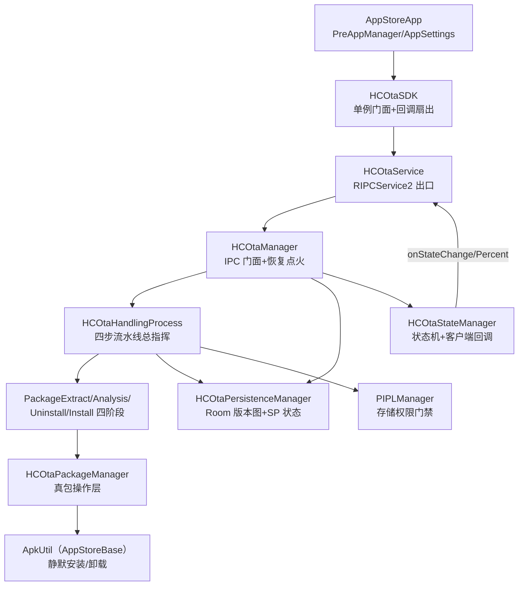

# HC OTA 栈架构解码（hcotaservice + hcotasdk + hcotabase）

> 源码锚点：commit `88832967`（master）｜ 生成：2026-09-06 ｜ 范围：HC OTA 三模块全量（hcotaservice 26 类 + hcotasdk 1 类 + hcotabase 3 类 = 30 类）
> 锚点规范：`类名#方法名`。hcotaservice 为 application 模块（独立 APK `HCOTAService_<version>.apk`），Room `version=1`（`hcota_database.db`，`allowMainThreadQueries()`），流水线框架 Actuator/PContext/LockSupportProcess 来自平台 **RProcess AAR**（源码不在仓）。

## 1. 一图流



图例：本图回答"OTA 从 IPC 进来到装完怎么走、状态存哪"。全部实线经 import/构造证实；`invokeAllAsync` 广播与 RProcess Actuator 框架为 AAR 内机制不画节点。回调最终回到 UI 进程的 `HCOtaSDK.callBackList`（扇出给 `PreAppManager` 等）。

## 2. 快速上手阅读路径

1. `hcotabase/State.java` —— 状态词表：`Version` 三代槽位（PREVIOUS=11/CURRENT=22/NEXT=33）、`HCOTAState`（IDLE=0xA/Updating=0xD/Downgrading=0xE/Restoring=0xF；Checking/Waiting 注释自认"用不到"）、`Reason`（100/101 正向，-1000..-1007 负向错误码）。
2. `HCOtaSDK.java` —— 客户端同 AppStoreSDK 模式：单例实现 HCOTAInterface+HCOTACallBack，`#addInterface(this)` 反向注册，`callBackList` 扇出。
3. `HCOtaManager#init` —— 恢复点火：读 SP 状态，Updating/Downgrading/Restoring 重拉流水线（注意 Updating 传空路径，见 §8）。
4. `HCOtaHandlingProcess#onInput` —— 四步编排与三语义分叉。
5. `HCOtaPersistenceManager#getFilePath` —— Room 版本图是降级/恢复 zip 的唯一来源。

## 3. 分层与模块地图

| 模块 | 一行职责 | 依赖谁 | 被谁依赖 |
|---|---|---|---|
| `hcotaservice` | 导出 OTA IPC 服务：四步流水线（解压→解析→卸载→安装）+ Room/SP 双持久化 + 恢复 | hcotabase、AppStoreBase（ApkUtil）、RProcess/RIpcCompat/HSysSrvSDK/pipl AAR、Room | AppStoreApp 经 HCOTASDK |
| `hcotasdk` | 单文件客户端门面（同 AppStoreSDK 反射派发模式） | hcotabase、RIpcCompat | AppStoreApp（AAR 形态） |
| `hcotabase` | OTA 共享契约：State 词表 + HCOTAInterface/HCOTACallBack 双向接口 | RIpcCompat | 三方共用 |

⚠ 分层验证：hcotaservice 直接源码依赖 **AppStoreBase**（用 `ApkUtil#installSilentlyFromHCOta/#uninstallSilentlyFromHCOta`——PackageInstaller session+广播同步等 60s），跨栈共享安装热点，与 AppStoreService 是并列消费方。

## 4. 主链路

### Updating 全链（12 步）

```
1. UI 侧 HCOtaSDK#startUpdate(filePath) → IPC → HCOtaManager#startUpdate（校验 isIDLE）
2. Actuator.execute(HCOtaHandlingProcess, filePath, ctx, null, Updating)   [RProcess AAR 拉起]
3. HCOtaHandlingProcess#onStart：HCOtaPackageManager#clearAllCache + HCOtaPersistenceManager#clearProcessing
4. #onInput：execute(HCOtaUIPercentProcess) + HCOtaStateManager#setState(Updating, Start)（首次客户端回调）
5. PIPLManager#checkPIPLStorageStoragePermission 门禁：不通过 LockSupport park 等权限回调
6. stepOne → PackageExtractProcess#onInput：解压到 NEXT/ 目录（进度 +0.2）
7. stepTwo → PackageAnalysisProcess#onInput：读 NEXT/packagelist.json → 逐 apk 验存在 →
   model 标 version=NEXT → HCOtaPersistenceManager#insertOrUpdateHCOtaPackageJsonModel 落 Room（+0.1）
8. stepThree：Updating 跳过（仅 Downgrading 真卸载）
9. stepFour → PackageInstallProcess：FIXED_INSTALL_ORDER 26 包排序 → HSysSrvManager#stopMonitoringServices →
   逐包：本机 versionCode 低于目标才 installApk（重试 3 次）→ writeProcessing 累加在途包名（+0.5 段按个推进）
10. 成功簿记：clearZipFile(Updating) → HCOtaHandlingProcess#changeModelVersion：
    Room 里 CURRENT→PREVIOUS、NEXT→CURRENT（版本图轮转）→ setState(Updating, Success, packageNames)
11. finish()/onStop：setState(IDLE, Success) + finishSingleProcess(UIPercent) + 再清缓存
12. 回传：setState → HCOtaService#onStateChangeSuccess → invokeAllAsync；进度 → onPercentChange
```

### 三语义分叉（同一套四步框架）

| | 入径 | zip 来源 | stepThree 卸载 | 结果检查 | 失败策略 | 成功簿记 |
|---|---|---|---|---|---|---|
| Updating | `HCOtaManager#startUpdate` | 进程参数 filePath | 跳过 | 检查 installResult（STORAGE 单独报） | 读 processing 卸在途包→（非存储错误删 zip）→**自动转 Restoring** | CURRENT→PREVIOUS、NEXT→CURRENT |
| Downgrading | `HCOtaManager#startDowngrade`（前置 `#isDowngradeAble`） | Room `getFilePath(PREVIOUS)` | 真卸载 CURRENT 包名列表 | 检查 | 卸在途包+删 zip+`#changeModelVersionAfterDowngradeFailed` **清空整库** | 删 CURRENT、PREVIOUS→CURRENT |
| Restoring | **无外部入口**，仅 Updating 失败自环转入 | Room `getFilePath(CURRENT)` | 逐包"先卸再装"（versionCode 降级必须先卸） | **不检查**（装失败也走成功簿记） | 无专门处理 | 同 Updating 成功路径 |

### 持久化分工

- **Room（慢变量）**：`HCOtaPackageModel`（父：version 三代槽位+元数据+zip 路径）+ `HCOtaAppModel`（子：apk 明细，belongToId CASCADE）+ `HCOtaPackageJsonModel`（@Embedded+@Relation 投影，**兼作 packagelist.json 的 Gson 目标类型，一型两用**）；`HCOtaRepository#insertOrUpdateHCOtaPackageJsonModel` 写前继承旧行 id 再 REPLACE（等效 upsert，弥补被注释的 unique(version) 索引）。
- **SharedPreferences（快变量，文件名 `data`，commit 同步写）**：`state`（状态机现场）、`processing_packages`（本次运行已装包名，仅失败回滚分支 `readProcessing()` 消费；onStart 必清，**不跨重启**）。

## 5. 模块卡片

### hcotaservice

**职责**：OTA 域全部实际工作：流水线执行、版本图持久化、包操作、恢复。
**对外接口**：`HCOTAInterface` 9 方法（经 `HCOtaService` exported）；回调 3 方法（onStateChangeSuccess/onStateChangeFail/onPercentChange，**实际服务侧只发 Success 通道**，reason 负值区分失败——`HCOtaStateManager` 的 onStateChangeFail 整段注释）。
**关键协作**：见 §1 图。
**设计动机**：[inferred] OTA 必须独立于商店 UI 进程存活（UI 关闭后继续装），且恢复语义要求把"版本图"与"状态机现场"分开持久化——Room 存三代包谱系、SP 存当前状态。
**雷区**：Updating 的 zip 路径只活在进程参数里；失败回调时序（先 ExtractError 后 Success(IDLE)）；`PackageAnalysisProcess#onInput` 各失败分支直接 return 不 finish（疑似可挂起流水线）。

### hcotasdk / hcotabase

**职责**：SDK 单文件门面（113 行，与 AppStoreSDK 同构：`invokeReturn`/`invokeSync` 反射派发 + 回调扇出）；base 是 3 文件契约层（State 词表 + 双接口）。
**对外接口**：9 个查询/操作方法 + 3 回调；`HCOtaSDK#addCallBack/#removeCallBack`。
**关键协作**：AppStoreApp 的 `PreAppManager`（AppStoreService 侧！）与 `AppSettingsPresenter` 都是其回调/调用方——注意 PreAppManager 在**服务进程**里消费 HCOTASDK，是服务→服务 IPC。
**设计动机**：[inferred] 与 AppStoreSDK 完全同构的模板复制——RIPC 模式的第二个实例。
**雷区**：运行时消费预编译 HCOTASDK.aar；hcotasdk 源码改动同样不生效须重建。

## 6. 核心类深卡片

### HCOtaHandlingProcess（process/，流水线总指挥）

**职责**：继承 RProcess 的 LockSupportProcess，四步 stepOne~stepFour 编排 + PIPL 权限 park/unpark + 三语义分叉 + 成功/失败版本簿记。
**协作者**：4 个阶段 Process（经 `#submitInternal` 串行提交）、HCOtaPContext（6 manager 的 DAG 上下文）、HCOtaPersistenceManager、HCOtaStateManager。
**设计动机**：[inferred] 用 RProcess 的"阶段-上下文"框架把 OTA 拆成可单独测试的阶段类；三语义共用一套骨架靠 state 判断分叉，代价是分叉条件散布在 onInput/stepThree/PackageInstallProcess 三处。
**不变量**：①阶段串行（submitInternal 链）；②每次 onStart 清缓存+清 processing；③状态变化必经 HCOtaStateManager#setState（先写 SP 再回调）。雷区：Restoring 不检查安装结果；失败→IDLE(Success) 双回调。

### HCOtaPersistenceManager（manager/）

**职责**：双持久化枢纽：Room 版本图（previous/current/next 三代 model+apk 列表+zip 路径）+ SharedPreferences（state/processing_packages）。
**协作者**：HCOtaRepository/HCOtaDao（Room 单例库）、`HCOtaManager#init`（readState 恢复）、`HCOtaHandlingProcess`（changeModelVersion 轮转）。
**设计动机**：见模块卡片；`#getFilePath` 是降级/恢复取 zip 的唯一来源。
**不变量**：Room 写入走 Repository upsert（id 继承+子表删重插）；SP 全部 commit 同步写（崩溃安全优先于性能）。雷区：Room 建在 RIPC 绑定线程（allowMainThreadQueries）；`readProcessing` 对 "[]" 解析出含空串列表。

### PackageInstallProcess（process/）

**职责**：末段执行体：26 包硬编码序（`FIXED_INSTALL_ORDER`，appstoreapp/service 在 hcotaservice 之前，未知包排最后）→ 停 HSysSrv 监控 → 逐 APK 版本比较、必要时先卸（降级/恢复）、装失败重试 3 次（`#installApk` 递归）、写 processing、推进百分比。
**协作者**：HCOtaPackageManager（→`ApkUtil#installSilentlyFromHCOta`）、HCOtaStateManager（installingPackageSet）、HCOtaPercentageManager。
**设计动机**：[inferred] 车机预装应用有依赖序（平台服务先于应用），且安装期间停系统监控防误杀。
**不变量**：单包失败重试 3 次后才上抛；每包成功即写 processing（供 Updating 失败回滚）。雷区：`#performPostInstallOperations` 的开放前台 app 判断是必然为假的条件（`TextUtils.isEmpty && equals`，源码 PackageInstallProcess.java:174），恢复前台逻辑永不执行；`packageNeedSendBroadcastToRestore` 恒 false（广播恢复名单死代码）。

### HCOtaStateManager（manager/）

**职责**：内存状态机：当前 HCOTAState/DowngradeAble/UpdateAble + installingPackageSet；`#setState` 先经 listener 写 SP 再回调客户端；监听 Telop 栈记前台包名。
**协作者**：HCOtaService（回调出口）、HCOtaPersistenceManager（SP 写）、HCOtaManager（isIDLE 门禁）。
**设计动机**：状态机与流水线分离，让"状态持久化+广播"有唯一收口。
**不变量**：setState 单点；UpdateAble/DowngradeAble 可被 `HCOtaSDK#setUpdateAble` 外部闸。雷区：`removeInstallingPackage` 日志文案复制错；onStateChangeFail 通道废置。

## 7. 全类职责表

（hcotaservice 26 文件子代理逐行实读、主代理抽查 4 条论断属实；hcotasdk/hcotabase 4 文件主代理本人通读。）

### hcotaservice（26）

| 类 | 一行职责 | 关键协作 |
|---|---|---|
| HCOtaService | RIPCService2 导出服务：入站接 HCOtaManager、出站广播回调（自身实现 HCOTACallBack 当靶子）`EX: HCOtaService#onStateChangeSuccess` | HCOtaManager, invokeAllAsync |
| HCOtaApplication | 独立应用入口：RLog+UIComponent+静态单例供反射取 Context `EX: HCOtaApplication#getInstance` | PIPLManager |
| OtaProgressWindow | WindowManager 悬浮进度窗（标题硬编码 "Honda CONNECT Core"），当前无人调用 `EX: OtaProgressWindow#updateProgress` | - |
| HCOtaManager | IPC 门面+恢复点火+版本查询转发（深卡片语境见 §5）`EX: HCOtaManager#init` | Actuator, PersistenceManager |
| BaseContextManager | 无注入基类：反射 `ActivityThread.currentApplication()` 取 Application `EX: BaseContextManager#getCApplication` | 各 Manager |
| HCOtaStateManager | 状态机+SP 写+回调（深卡片 §6）`EX: HCOtaStateManager#setState` | HCOtaService |
| HCOtaPersistenceManager | Room+SP 双持久化枢纽（深卡片 §6）`EX: HCOtaPersistenceManager#getFilePath` | HCOtaRepository |
| HCOtaPackageManager | 真包操作层：ZipUtil 解压三代目录/静默装卸/清缓存/查版本 `EX: HCOtaPackageManager#install` | ApkUtil |
| HCOtaPercentageManager | 进度模型：Init→Extract 0.2→Analysis 0.1→Uninstall 0.2→Install 0.5 线性累计，双通道通知 `EX: HCOtaPercentageManager#setCurrentPercent` | HCOtaService |
| HCOtaPowerManager | 电源监听（休眠：构造器 init() 被注释，listener 从不注册）`EX: HCOtaPowerManager#destroy` | - |
| PIPLManager | PIPL 隐私中心 IPC 客户端：查 STORAGE 权限+变更回调驱动 park/unpark `EX: PIPLManager#checkPIPLStoragePermission` | HCOtaHandlingProcess |
| HCOtaInstallManager | 空类（4 行）被 PContext 持有，零职责 `EX:（无方法）` | - |
| HCOtaHandlingProcess | 四步流水线总指挥（深卡片 §6）`EX: HCOtaHandlingProcess#onInput` | 4 阶段 Process |
| HCOtaPContext | 流水线上下文 DAG：塞 6 manager 给各阶段 `EX: HCOtaPContext#getHcOtaPersistenceManager` | RProcess PContext |
| PackageExtractProcess | 阶段1：按 state 解压 zip 到 previous/current/next 目录 `EX: PackageExtractProcess#onInput` | HCOtaPackageManager |
| PackageAnalysisProcess | 阶段2：读 packagelist.json→验 apk 在盘→产 HCOtaPackageJsonModel（失败分支不 finish 有挂起风险）`EX: PackageAnalysisProcess#getExtractFolder` | Gson |
| PackageUninstallProcess | 阶段3：逐包静默卸载，结果不看、onStop 恒 output(true) `EX: PackageUninstallProcess#onInput` | HCOtaPackageManager |
| PackageInstallProcess | 阶段4：26 包硬编码序安装（深卡片 §6）`EX: PackageInstallProcess#installApk` | ApkUtil, HSysSrvManager |
| HCOtaUIPercentProcess | 进度 UI 宿主进程（弹窗全注释、onInput 三分支空壳，仅 addListener 存活）`EX: HCOtaUIPercentProcess#onStart` | HCOtaPercentageManager |
| HCOtaDatabase | Room 单例库 hcota_database.db v1，allowMainThreadQueries+TRUNCATE 日志 `EX: HCOtaDatabase#getInstance` | 两 DAO |
| HCOtaDao | @Transaction 父子联合查询/REPLACE 写/按 version 删 `EX: HCOtaDao#getHCOtaPackageJsonModelByVersion` | Room |
| HCOtaRepository | DAO 门面：id 继承 upsert+子表删重插+clearDatabase `EX: HCOtaRepository#insertOrUpdateHCOtaPackageJsonModel` | HCOtaDao |
| HCOtaPackageModel | Room 父实体：version(11/22/33)+systemversion/patchnum/level/operation/whatsnew/filePath；unique(version) 索引被注释 `EX: HCOtaPackageModel#setVersion` | HCOtaAppModel |
| HCOtaAppModel | Room 子实体（apk 明细，belongToId CASCADE）`EX: HCOtaAppModel#setBelongToId` | HCOtaPackageModel |
| HCOtaPackageJsonModel | @Embedded+@Relation 投影，兼作 packagelist.json 的 Gson 目标（一型两用）`EX: HCOtaPackageJsonModel#getApks` | Gson, HCOtaDao |
| HCOtaPackageModelWrapper | model+state 打包传给安装阶段的不可变载体 `EX: HCOtaPackageModelWrapper#getState` | PackageInstallProcess |

### hcotasdk（1）+ hcotabase（3）

| 类 | 一行职责 | 关键协作 |
|---|---|---|
| HCOtaSDK | 单文件门面：9 方法反射派发+3 回调扇出（callBackList），硬编码绑定 com.hynex.hcotaservice `EX: HCOtaSDK#startUpdate` | HCOtaClient(内部类), HCOTACallBack |
| State | OTA 状态词表：Version 三代槽位 11/22/33、HCOTAState（Checking/Waiting 自注"用不到"）、Reason ±错误码、Level/Operation StringDef `EX: State$HCOTAState` | 全栈 |
| HCOTAInterface | 服务侧 9 方法契约（startUpdate/startDowngrade/版本查询/setUpdateAble/isDowngradeAble）`EX: HCOTAInterface(声明)` | HCOtaManager 实现 |
| HCOTACallBack | 客户端回调契约 3 方法（Success/Fail/Percent）`EX: HCOTACallBack(声明)` | HCOtaSDK/PreAppManager 实现 |

**覆盖实数**：30/30 实证（hcotaservice 26 子代理实读 + 抽查 4 条；hcotasdk 1 + hcotabase 3 本人通读）。`[name-only]`：0。跳过：无（测试文件在本批范围外，AGENTS.md 记"流程/持久化逻辑+反射注入，ignoreFailures 绿灯不可信"——未逐个编目，如实声明为未清点）。

## 8. 看着糟但其实没问题

- **Updating 的断电恢复是"假"的**（`HCOtaManager#init` 对 Updating 也重拉流水线但 filePath 传空 → extract 必败 → ExtractError 回 IDLE）：看是 bug，[inferred] 但语义上自洽——Updating 的新包从未落 Room，无从恢复；"假恢复"保证了状态机必然回到 IDLE 而非卡在 Updating。真正可续跑的只有 Downgrading/Restoring（zip 路径在 Room）。代价是用户重启后需重新触发更新。
- **`processing_packages` 不跨重启**：SP 现场只服务单次运行内的失败回滚（Updating 失败→卸在途包→Restoring），重启即丢是可接受的——Room 版本图才是跨重启真相。
- **onStateChangeFail 通道废置**（服务侧实现整段注释，一切结果走 Success 通道+reason 负值）：单通道简化了客户端分派；契约里保留 Fail 方法为未来留口。
- **进度 UI 双层休眠**（HCOtaUIPercentProcess 空壳+OtaProgressWindow 无人调用但保留 Manifest 权限）：AGENTS.md 明示"进度窗口 UI 大多休眠"——OTA 是后台静默流，UI 呈现由商店设置页承担。
- **Restoring 不检查安装结果**：恢复的本质是"回到 CURRENT 已装过的版本"，逐包本就"先卸再装"，个别失败不阻断整体语义（但客户端收到的"成功"可能含失败包，消费方需知晓）。

## 9. 相邻产物

- [AppStoreService.md](./AppStoreService.md) §6 `PreAppManager`：HC OTA 的最大消费方（服务进程内经 HCOTASDK 发起 startUpdateHcc/恢复）。
- [AppStoreBase.md](./AppStoreBase.md) §5 `ApkUtil`：`#installSilentlyFromHCOta`（广播+CountDownLatch 同步等 60s）是本栈安装的实际执行体。
- [ARCHITECTURE.md](./ARCHITECTURE.md) §3/§10。

## 10. 开放问题

1. `PackageAnalysisProcess#onInput` 失败分支直接 return 不 finish——RProcess 的 submitInternal 是否无限等待（框架源码不在仓）？流水线卡死风险未验证。
2. `[inferred]` "装旧包"（本机 versionCode 已高于目标）会 finish(FAILURE) 连锁触发 Restoring——把"装旧包"当"升级失败回滚"是刻意语义还是误伤，需产品确认。
3. `[inferred]` HCOtaPowerManager 休眠 + `HCOtaManager#init` 留 TODO"接入电源状态的复归"——OTA 是否应避开低电/休眠，属未完成项。
4. `[inferred]` `unique(version)` 索引被注释 + Repository 手工 upsert——是防迁移冲突还是遗忘，未考据到。
5. 本轮未深挖：RProcess AAR 的 Actuator/PContext/LockSupportProcess 机制（平台库）；hcotaservice 测试文件未逐个编目（AGENTS.md 已记脆弱模式）。
