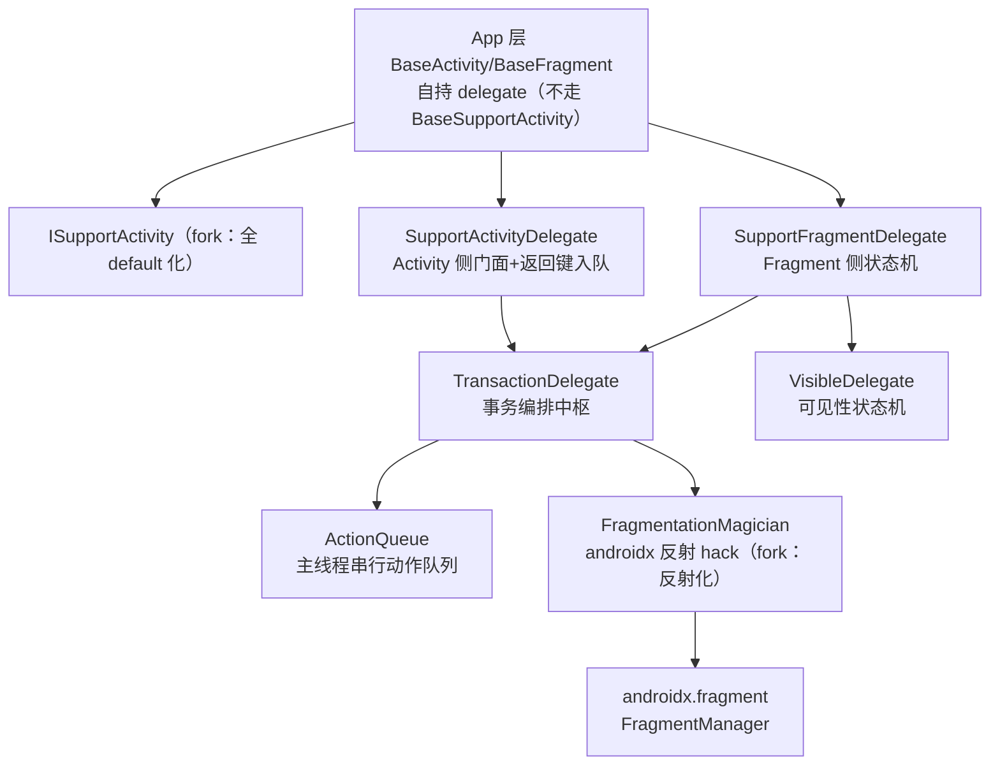

# fragmentation_core 架构解码（Fragmentation 本地维护 fork）

> 源码锚点：commit `88832967`（master）｜ 生成：2026-09-06 ｜ 范围：fragmentation_core 全量（28 类，4773 行）+ fork 差异 git 考据
> 锚点规范：`类名#方法名`。**性质：vendored-but-maintained fork**（me.yokeyword Fragmentation 1.3.x 一带形态），不是原样 vendor——本地实改 5 个 java + 补齐迁移丢失的资源。

## 1. 一图流



图例：本图回答"App 层怎么接进 fork、事务怎么流"。app 侧 `BaseFragment` 同时走 SupportFragmentDelegate（生命周期）与 VisibleDelegate（可见性/懒加载）。

## 2. Fork 考据（本 fork 到底改了什么）

**vendor 基线**：`bd1b9816 迁移AppStore代码`——无信息迁移提交，一次性带入 28 个 java，但 **res/anim、strings、ids、AndroidManifest 全部缺失**（后由 `ec0be297 更新缺失文件` 补回 16 个 anim+资源，修复编译）。

本地维护提交实改（git diff vendor→HEAD 逐文件考据）：

| 提交 | 文件 | 改了什么 | 为什么 |
|---|---|---|---|
| `26730d0e` fix bug #110203 | SupportActivityDelegate | 新增 `#showSoftInput()`（decorView 级，延迟 200ms SHOW_FORCED） | 搜索页进页自动弹键盘 |
| `e76925fd` | ISupportContext（**新增**） | 接口仅 `#onClickDownloadButton()` | [inferred] 未完成/遗留的项目回调（App 层无 implements） |
| `99f55687`+`f9b0842b` | ISupportActivity | 新增 `#showHideFragment(show,hide)`（上游无）+ 8 方法全改 **default 空实现** | App 层 BaseActivity 直接 implements + 自持 delegate，default 化免样板；`MainActivity#switchFragment` 走此链 |
| `13cb56a9` | VisibleDelegate | 两个字段补中文注释（mIsSupportVisible/mIsFirstVisible） | 无行为变化 |
| `73d59902` #AppStore#功能实装#详情页属性修改 | **FragmentationMagician** | `#hookStateSaved` 反射化改造（57 行） | 兼容 androidx.fragment 1.2+（FragmentManagerImpl 合并进 FragmentManager，字段移入基类）；commit 主题与改动无关，[inferred] 搭车入库 |

**迁移基线自带的 fork 痕迹**（bd1b9816 之前已改，非本地提交）：`SupportFragment#startDontHideSelf`（AppStore 便捷路由）、`FragmentVerticalAnimator`+`anim_current_list_*`（列表页自下而上垂直转场，上游无）、`TransactionDelegate#showHideFragmentWithAnim` 调的是无动画版 `#doShowHideFragment`（**带动画版 `#doShowHideFragmentWithAnim` 成死方法，animIn/animOut 被静默丢弃**——App 层 `BaseFragment#showHideFragmentAnim` 的自定义动画实际无效，疑似半成品）。

## 3. 机制

### loadMultipleRootFragment / showHideFragment 执行路径

```
loadMultipleRootFragment（双根壳装载）:
  SupportFragmentDelegate#loadMultipleRootFragment（fragment 级走 childFragmentManager；
    activity 级经 SupportActivityDelegate → getSupportFragmentManager）
  → TransactionDelegate#loadMultipleRootTransaction → ActionQueue#enqueue(ACTION_LOAD)
    → run(): 逐个写 arguments（FRAGMENTATION_ARG_CONTAINER、ROOT_STATUS=禁根动画）→
      ft.add(containerId, to, 类名)；非 showPosition 的 ft.hide(to) → commitAllowingStateLoss
  隐藏者后续由 VisibleDelegate 在 show 时补发 onSupportVisible/onLazyInitView

showHideFragment（MainActivity Tab 切换真实链路）:
  MainActivity#switchFragment → BaseActivity#showHideFragment（fork 加的 ISupportActivity default 方法）
  → SupportActivityDelegate#showHideFragment → TransactionDelegate#showHideFragment
  → ActionQueue#enqueue(NORMAL) → TransactionDelegate#doShowHideFragment:
      show==hide 早退；ft.show(show)；hide==null 则 hide 全部其它 active，否则只 ft.hide(hide)
  → Fragment.onHiddenChanged → SupportFragmentDelegate#onHiddenChanged → VisibleDelegate#dispatchSupportVisible
    （派发 onSupportIn/Invisible，首次可见补 onLazyInitView，向子 Fragment 递归）
```

返回键：`SupportActivityDelegate#onBackPressed` 入队 ACTION_BACK（队首为 POP 时防抖丢弃）→ `TransactionDelegate#dispatchBackPressedEvent` 从栈顶 activeFragment 沿 parentFragment 递归问 `onBackPressedSupport`。

### FragmentationMagician（androidx 耦合点与 fork 三缺陷）

**存在理由**：Fragmentation 需要在 `onSaveInstanceState` 之后仍能 pop/执行事务（否则抛 "Can not perform this action after onSaveInstanceState"），手段是把 `FragmentManager` 的 `mStateSaved`/`mStopped` 置 false 执行后写回；放 `androidx.fragment.app` 包内是为包级访问 `FragmentManagerImpl`。

4 个耦合点：`#isStateSaved`（instanceof FragmentManagerImpl，androidx 1.2+ 保留空壳子类故仍成立）、`#hookStateSaved`（**fork 反射化**：沿类层次收集 getDeclaredFields 按名找 mStateSaved/mStopped，兼容字段在 Impl 或基类两种布局）、`#getActiveFragments`（公开 API 无反射）、被 TransactionDelegate 的 pop/popTo/startWithPop/safePopTo 广泛调用。

**fork 反射化引入的三处缺陷**（`FragmentationMagician.java:121-134`，源码事实）：
1. **runnable 双执行**：`runnable.run()` 在 if 块内执行一次，try 内 if 块外又执行一次——反射成功时 popBackStack/executePendingTransactions 每次跑两遍；多数幂等，但 `popBackStack(name, flags)` 二次可能多弹一级。
2. **恢复值互换**：`stateSavedField.setBoolean(fm, tempStopped)` 与 `stoppedFiled.setBoolean(fm, tempStateSaved)`——两个标志位写反（进分支时两者通常同为 true 故常无感，但语义错误）。
3. **保护降级**：反射找不到字段或抛异常时仅 printStackTrace 后**无条件直接 run**——上游"stateSaved 时拒绝执行"的语义弱化为"无论如何都执行"，故障从显性变隐性。

## 4. 全类职责表（28/28 实读，子代理逐行+主代理抽查）

| 类 | 一行职责 | 关键协作 |
|---|---|---|
| TransactionDelegate | 事务编排中枢：add/replace/pop/popTo/showHide/startForResult 全在此，统一 commitAllowingStateLoss `EX: TransactionDelegate#doShowHideFragment` | ActionQueue, Magician |
| SupportFragmentDelegate | Fragment 侧状态机：attach 校验/参数回填/动画分发/生命周期→可见性转译 `EX: SupportFragmentDelegate#onCreateAnimation` | VisibleDelegate, AnimatorHelper |
| SupportActivityDelegate | Activity 侧门面：持 TransactionDelegate+返回键入队+防抖+debug 栈入口（fork：+showSoftInput）`EX: SupportActivityDelegate#onBackPressed` | DebugStackDelegate |
| SupportFragment | Fragment 基类：生命周期桥接+全部路由/懒加载/软键盘 API（含 fork 痕迹 startDontHideSelf）`EX: SupportFragment#startDontHideSelf` | SupportFragmentDelegate |
| BaseSupportActivity | 可选 Activity 基类（App 层未用，用自建 BaseActivity）`EX: BaseSupportActivity#dispatchTouchEvent` | SupportActivityDelegate |
| SupportHelper | 静态工具：栈顶/前驱/回退栈查找、activeFragment 递归定位、软键盘 `EX: SupportHelper#getBackStackTopFragment` | Magician |
| ExtraTransaction | 链式额外事务：自定义 tag/动画/共享元素/dontAddToBackStack/startDontHideSelf `EX: ExtraTransaction$ExtraTransactionImpl#startDontHideSelf` | TransactionRecord |
| Fragmentation | 全局单例配置：debug 开关/栈视图模式/ExceptionHandler `EX: Fragmentation#getDefault` | FragmentationBuilder |
| ISupportFragment | Fragment 能力契约+LaunchMode/ResultCode 常量 `EX: ISupportFragment#getSupportDelegate(声明)` | - |
| ISupportActivity | Activity 契约（**fork：全 default 化+新增 showHideFragment**）`EX: ISupportActivity#showHideFragment` | - |
| ISupportContext | **fork 新增**：项目下载按钮回调接口（App 层未接线，疑似遗留）`EX: ISupportContext#onClickDownloadButton` | - |
| queue/Action | 队列动作抽象：NORMAL/POP/POP_MOCK/BACK/LOAD 五类+动画间隔 `EX: Action#run` | ActionQueue |
| queue/ActionQueue | 主线程串行事务队列：LOAD 空队直跑、POP 按 exit 动画时长延迟派发、BACK 防抖 `EX: ActionQueue#enqueue` | Action |
| androidx/fragment/app/FragmentationMagician | androidx 内部 hack：hookStateSaved 绕过 stateSaved 限制（fork 反射化，三缺陷见 §3）`EX: FragmentationMagician#hookStateSaved` | TransactionDelegate |
| helper/internal/VisibleDelegate | 可见性状态机：onHiddenChanged/onResume/onPause/setUserVisibleHint 收敛为 onSupportVisible/onLazyInitView，父子递归 `EX: VisibleDelegate#dispatchSupportVisible` | SupportFragmentDelegate |
| helper/internal/AnimatorHelper | 动画加载缓存：四路动画+no_anim+child-fragment 退出兼容空动画 `EX: AnimatorHelper#compatChildFragmentExitAnim` | FragmentAnimator |
| helper/internal/TransactionRecord | ExtraTransaction 链式参数载体：tag/四路动画/共享元素表 `EX: TransactionRecord$SharedElement` | ExtraTransaction |
| helper/internal/ResultRecord | startForResult 结果 Parcelable（requestCode/resultCode/bundle）`EX: ResultRecord#writeToParcel` | TransactionDelegate |
| helper/ExceptionHandler | "stateSaved 后事务"告警回调接口 `EX: ExceptionHandler#onException(声明)` | Fragmentation |
| exception/AfterSaveStateTransactionWarning | RuntimeException 子类：stateSaved 后事务仅告警不崩溃 `EX: AfterSaveStateTransactionWarning#getMessage` | TransactionDelegate |
| anim/FragmentAnimator | 四路动画 res 的 Parcelable 实体 `EX: FragmentAnimator#copy` | AnimatorHelper |
| anim/DefaultNoAnimator、DefaultHorizontalAnimator、DefaultVerticalAnimator、FragmentVerticalAnimator | 家族行：预置动画方案（全无/横向 8% 位移/纵向/列表自下而上 150%p 定制）各绑一套 res `EX: FragmentVerticalAnimator(构造)` | FragmentAnimator |
| debug/DebugStackDelegate | debug 栈视图入口：摇一摇/气泡触发+栈快照打印 `EX: DebugStackDelegate#logFragmentRecords` | DebugHierarchyViewContainer |
| debug/DebugHierarchyViewContainer | 栈层级树形 UI（可展开子栈）`EX: DebugHierarchyViewContainer#bindFragmentRecords` | DebugFragmentRecord |
| debug/DebugFragmentRecord | 栈节点数据类 `EX: DebugFragmentRecord(构造)` | - |

**覆盖实数**：28/28 实证（含两个 700+ 行核心类逐行）。`[name-only]`：0。跳过：res/anim 其余 10 个 xml（家族行一致性抽样）。

## 5. 看着糟但其实没问题

- **反射 hack FragmentationMagician 放在 androidx 包名下**：为包级访问 FragmentManagerImpl 的上游既有设计，fork 反射化后已不再依赖包级访问但保留位置——迁移成本大于收益，维持原位合理。
- **ISupportActivity 全 default 化**：让 App 层自建 BaseActivity 不必实现 8 个样板方法（App 只用其中 3-4 个），是 fork 相对上游最"顺眼"的改造。
- **AfterSaveStateTransactionWarning 只告警不崩**：车机场景保存态后仍需响应遥控器/语音返回，宁可执行也不崩——与 Magician 的 stateSaved hack 是配套的宽纵策略。
- **ActionQueue 的动画时长延迟派发**：POP 后按 exit 动画时长延迟下一动作，避免转场被打断——串行队列的合理复杂度。

## 6. 相邻产物 / 开放问题

相邻：[AppStoreApp.md](./AppStoreApp.md)（BaseFragment/BaseActivity 是本 fork 的主要消费壳）、`Summary/project/project-architecture/fragment/`（**androidx.fragment 本体**的解码——本 fork 的反射 hack 正是打在它的 FragmentManager 内部字段上，读 §3 前建议先看它）。

开放问题：
1. Magician 三缺陷（双执行/恢复值互换/保护降级）已在源码确认，但**触发频率未验证**——双执行对 `popBackStack(name, flags)` 的多弹风险需要实测；修复属代码改动，超出本 skill 边界，仅记录。
2. `[inferred]` `showHideFragmentWithAnim` 死方法与 App 层 `BaseFragment#showHideFragmentAnim` 的动画无效——半成品还是已放弃，需人确认。
3. `[inferred]` ISupportContext#onClickDownloadButton 无实现方——删除安全性与原始意图待考。
4. `[inferred]` 上游版本号无法从提交确认（迁移提交无 vendor 标记），代码特征对应 1.3.x——若需 diff 上游特定版本，需外部获取 yokeyword/Fragmentation 对应 tag。
