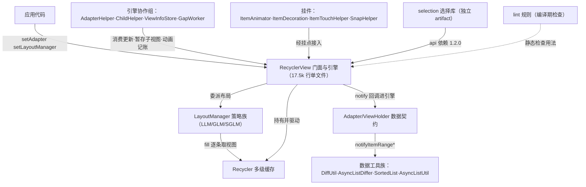
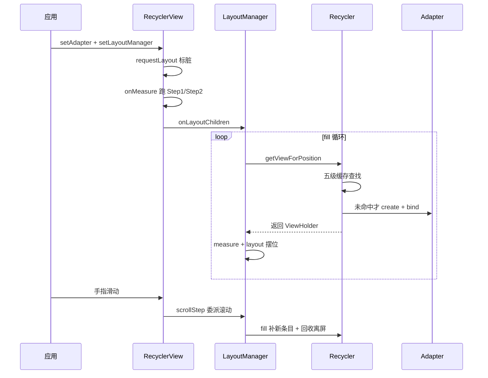

# RecyclerView 架构解码

> 源码锚点：commit `f38a5e5`（AndroidLibs 工作区 main 分支）｜ 生成：2026-09-06 ｜ 范围：全项目（recyclerview + recyclerview-selection + recyclerview-lint + recyclerview-benchmark 四个构建模块）
> 版本背景：androidx 主分支快照（recyclerview 约 1.4.0-alpha 时期，compileSdk 35）。本文与代码分离存放，锚点是增量更新的唯一依据。
> 考据限制：本仓 git 历史仅含源码导入与标注提交，**上游 androidx 变更史本地不可考**——设计动机的考据以代码结构 + 测试名为准，考据不到的一律标 `[inferred]`（汇总见 §9）。

## 1. 一图流

图例：实线 = 代码调用/依赖（经 import 与字段证实）；虚线 = 编译期工具关系（不参与运行时）；粗体为主链。本图回答"系统分几层、谁驱动谁"，不包含方法级细节（见 §4 主链路）。

## 2. 快速上手阅读路径

按序读，每步带一个问题：

1. `RecyclerView.java` 类头总论（L1-L263）——这个库解决什么问题、四大组件怎么分工？（看到能复述"Adapter 出视图、LayoutManager 摆视图、Recycler 管复用"即过）
2. `RecyclerView.java:1648` setAdapter + `:5015` onMeasure——一次布局从哪触发？（能指出 onMeasure 里 adaptive 路径会提前跑 Step1/2 即过）
3. `RecyclerView.java:5383` dispatchLayout 三步——布局为什么拆成状态机？（能说出 pre-layout 与真布局的区别即过）
4. `LinearLayoutManager.java:1992` fill + `RecyclerView.java:8388` tryGetViewHolderForPositionByDeadline——视图从哪来、缓存怎么分级？（能列出五级查找顺序即过）
5. `RecyclerView.java:2783` scrollByInternal → `:2651` scrollStep——滚动和布局是什么关系？（能说出"滚动 = 平移 + fill 补边 + 回收"即过）
6. `AdapterHelper.java:749` consumeUpdatesInOnePass——notify* 之后到布局之前发生了什么？（能解释位置双轨 adapterPosition/layoutPosition 即过）
7. `DiffUtil.java:173` calculateDiff → `:1189` dispatchUpdatesTo——增量更新的数据侧怎么算？（能说出 areItemsTheSame 与 areContentsTheSame 的分工即过）
8. `SelectionTracker.java:887` build()——伴生库怎么在宿主钩子上长出来？（能说出主选择/临时选择两层即过）
9. 测试目录 `androidTest/.../RecyclerViewCacheTest.java`——行为规格长什么样？（测试名即预取行为清单）

## 3. 分层与模块地图

| 模块（构建单元） | 一行职责 | 依赖谁 | 被谁依赖 |
|---|---|---|---|
| recyclerview | 列表容器全量实现：门面 + 引擎 + 策略 + 数据工具（EX: build.gradle:1-42） | androidx.core / customview / collection | selection（api 1.2.0）、应用 |
| └ 内层：门面/引擎（RecyclerView.java 内部类 + 包私有引擎类） | 视图复用与布局编排 | 仅同模块 | 策略层 |
| └ 内层：策略实现（LLM/GLM/SGLM/ItemTouchHelper/SnapHelper…） | 实现 LayoutManager/挂件契约 | 门面 + 引擎（包私有访问）⚠ | 应用 |
| └ 内层：数据工具（DiffUtil/AsyncListDiffer/SortedList/AsyncListUtil） | 纯数据差异与增量通知 | 零 android.view import（EX: DiffUtil.java:16 仅 IntRange）⚠ | 应用侧 Adapter |
| recyclerview-selection | 触摸/鼠标/框选多选引擎 | recyclerview（api 1.2.0，EX: build.gradle:9） | 应用 |
| recyclerview-lint | 一条 lint 规则：InvalidSetHasFixedSize（EX: InvalidSetStroke…Detector.kt） | lint API（仅测试依赖主模块桩） | 开发期工具链 |
| recyclerview-benchmark | Diff/Scroll 微基准 | androidx.benchmark + 主模块 | 开发期度量 |

⚠ 两处非典型依赖（详见 §8）：
1. **策略层反向深挖宿主**：LayoutManager 持有宿主私有的 mRecyclerView/mChildHelper（EX: RecyclerView.java:10360-10361），策略实现与引擎靠"同包 + 内部类"共享权限，不是接口隔离。
2. **数据工具挂在 Adapter 一侧而非引擎侧**：引擎不 import DiffUtil 族（grep 证实），数据工具只通过 `AdapterListUpdateCallback`/`ListUpdateCallback` 间接触达 RecyclerView。

## 4. 主链路

典型场景：`rv.setAdapter(adapter); rv.setLayoutManager(llm);` 后滚动一屏（主链 >5 环，时序图见下）。

布局线：
`setAdapter`（EX: RecyclerView.java:1648，解绑旧观察者 + 回收全部视图）→ `requestLayout` 标脏（EX: :6124，冻结/布局中则记 mLayoutWasDefered 推迟）→ `onMeasure`（EX: :5015，自适应测量路径就地跑 `dispatchLayoutStep1()` EX: :5047）→ `onLayout` → `dispatchLayout`（EX: :5383，按 mLayoutStep 状态机补跑缺的步骤）→ Step2 一次性消费积压更新（`AdapterHelper.consumeUpdatesInOnePass` EX: AdapterHelper.java:749）→ `LayoutManager.onLayoutChildren` → `fill` 循环（EX: LinearLayoutManager.java:1992）→ `Recycler.getViewForPosition`（EX: RecyclerView.java:8368）→ 五级缓存查找 `tryGetViewHolderForPositionByDeadline`（EX: :8388，miss 才 create+bind）→ ChildHelper.addView 挂载。

滚动线：
`onTouchEvent`（EX: :4726）→ `scrollByInternal`（EX: :2783，滚动前先消费积压更新）→ `scrollStep`（EX: :2651）→ `LayoutManager.scrollHorizontallyBy/VerticallyBy` → LLM `scrollBy`（EX: LinearLayoutManager.java:1760，平移子视图 + fill 补边 + 回收滚出视口）→ 未消费量驱动 EdgeEffect。

数据更新线：
`adapter.notify*` → `RecyclerViewDataObserver`（EX: RecyclerView.java:7483）→ 增量进 `AdapterHelper` 队列 / 全量直接标脏 → `triggerUpdateProcessor`（setHasFixedSize 走 mUpdateChildViewsRunnable 旁路，EX: :7542）→ 下一次布局/滚动前批量消费。

图例：回答"一次布局与一次滚动各自经过谁"；file:line 锚点在正文 §4 文字链路，图中不重复。

## 5. 模块卡片

### recyclerview（主模块）

**职责**：把"一份 Adapter 数据"呈现为有限窗口内的可滚动视图；同时提供布局策略、复用引擎、数据 diff、交互扩展的全量实现。
**对外接口**：`RecyclerView.setAdapter/setLayoutManager/addOnItemTouchListener`（EX: RecyclerView.java:1648/1877 附近）；扩展契约 = 五个抽象内部类 `Adapter/LayoutManager/ItemAnimator/ItemDecoration/ViewHolder`（EX: :9492/:10351/:16693/:13921/:14273）。前置条件：两参 setter 都非空才能工作；错误模式：布局/滚动中改数据抛 `assertNotInLayoutOrScroll` 异常。
**关键协作**：内部驱动 Recycler（EX: :8078）、AdapterHelper（EX: AdapterHelper.java:66）、ChildHelper、ViewInfoStore、GapWorker（EX: GapWorker.java:58）；被 selection api 依赖。
**设计动机**：把 ListView 的"布局方式写死"改成可替换策略 + 缓存引擎 [inferred，上游 Javadoc 与结构可证，commit 不可考]。单文件 17.5k 行不是失误——引擎与门面共享大量包私有状态，拆文件需要先把权限边界做出来 [inferred]。
**雷区**：读代码时"文件 ≠ 模块"——按内部类边界找组件；Recycler 与 State 等核心都在 RecyclerView.java 内部（EX: :8078/:16225）。

### recyclerview-selection

**职责**：为 RecyclerView 提供点选/Shift 范围选/长按拖拽框选/鼠标框选的完整多选引擎。
**对外接口**：`SelectionTracker.Builder`（EX: SelectionTracker.java:683）五参装配 + `build()`（EX: :887）；应用必须自备 ItemKeyProvider 与 ItemDetailsLookup 两个适配件；状态保存/恢复需应用在生命周期手动转调（EX: 类头接入示例 L107-133）。
**关键协作**：DefaultSelectionTracker 是状态唯一权威（EX: DefaultSelectionTracker.java:72）；触摸/鼠标语义分TouchInputHandler/MouseInputHandler；Adapter 数据变化经 EventBridge 桥回 tracker。
**设计动机**：多选的"复用视图选中态"极易翻车，值得一个独立引擎；键（key）与位置（position）分离，选择集用稳定键存储 [inferred，结构可证：ItemKeyProvider 抽象两档 SCOPE_MAPPED/SCOPE_CACHED]。
**雷区**：onBind 必须用 `tracker.isSelected(key)` 刷新选中态；键用 position 会在数据变化后选错条目；build() 内部装配整条事件管线，先读其方法头再自定义事件行为。

### recyclerview-lint

**职责**：编译期拦截一种具体组合错误——RecyclerView 在滚动方向上用 `wrap_content` 又调用 `setHasFixedSize(true)`（EX: InvalidSetHasFixedSizeDetector.kt:45，消息见 :123）。
**对外接口**：`RecyclerViewIssueRegistry`（EX: RecyclerViewIssueRegistry.kt:29，仅注册这一条 issue）。
**关键协作**：通过 lintPublish 挂进主模块产物（EX: recyclerview/build.gradle:31）；不参与运行时。
**设计动机**：hasFixedSize 优化假设"自身尺寸不随内容变"，wrap_content 恰好打破该假设且运行期表现为静默不刷新——规则把错误前移到编译期。
**雷区**：探测是"组合规则"不是"禁止调用"——只有 XML id 命中 wrap_content 名单且确以常量 true 调用时才报；读它能精确反推 setHasFixedSize 的适用约束。

### recyclerview-benchmark

**职责**：Diff/Scroll 两条核心路径的微基准（androidTest instrumentation）。
**对外接口**：无（度量工具）。
**关键协作**：依赖 androidx.benchmark 与主模块。
**设计动机**：为"DiffUtil 是否值得异步""滚动帧耗时"提供可复现数据 [inferred，由 DiffBenchmark/ScrollBenchmark 文件名可证]。
**雷区**：是 androidTest 源集，读架构时跳过不丢信息。

## 6. 核心类深卡片

### RecyclerView（recyclerview）

**职责**：门面 + 编排引擎：把四个可替换组件（Adapter/LayoutManager/ItemAnimator/ItemDecoration）的协作编排成"测量→布局→绘制→滚动"管线。
**协作者**：委派布局给 LayoutManager（EX: RecyclerView.java:5383 dispatchLayout）；取视图经 Recycler（EX: :8368）；数据变更经 AdapterDataObserver 进入 AdapterHelper（EX: :7483）；触摸经 OnItemTouchListener 管线分发给 ItemTouchHelper 等挂件。
**设计动机**：数据量与屏幕的矛盾 + 数据变化与流畅滚动的矛盾，靠"职责拆解 + 更新批处理"解决；布局拆三步状态机（mLayoutStep EX: :16283）是为了让测量（自适应测量布一半）、布局（续跑）、更新（重布）三个触发点共享同一条流水线 [inferred]。
**不变量**：mLayoutStep 合法转移集 STEP_START → STEP_LAYOUT → STEP_ANIMATIONS → STEP_START（EX: State.assertLayoutStep）；布局/滚动中禁止改数据（assertNotInLayoutOrScroll）。

### Recycler（recyclerview，RecyclerView 内部类）

**职责**：视图复用引擎：为任意 adapter 位置产出 ViewHolder，把废弃 ViewHolder 收回多级缓存。
**协作者**：上游 LayoutManager.fill（EX: LinearLayoutManager.java:1992）逐条调用；下游 Adapter.createViewHolder/bindViewHolder 仅在全部 miss 时触达；回收端 recycleViewHolderInternal（EX: RecyclerView.java:8737）决定进 mCachedViews 还是 mRecyclerPool。
**设计动机**：复用代价天然分档（按位置免 bind / 按稳定 ID 改位置 / 按 viewType 重新 bind），五级查找按代价升序排列把最贵操作压到最低档；预取带 deadline，来不及就放弃（测试 `prefetchItemsRespectDeadline` 印证，EX: RecyclerViewCacheTest）。
**不变量**：scrap 中的视图禁止回收（recycleViewHolderInternal 入口三连抛异常，EX: :8737-8746）；预取产物绝不带半成品跨帧。

### LayoutManager（recyclerview，抽象内部类）

**职责**：布局策略契约：决定子视图测量、摆放、滚动能力与焦点/预取行为。
**协作者**：反向持有宿主 mRecyclerView 与 mChildHelper（EX: RecyclerView.java:10360-10361）——策略实现经它们直接操纵容器内部；实现族谱 LinearLayoutManager/GridLayoutManager/StaggeredGridLayoutManager（EX: 类头族谱注释 :10352 附近）。
**设计动机**：布局方式是列表差异的全部来源（列表/网格/瀑布流），抽成策略后容器不随布局形态膨胀；但抽得不够干净——策略与引擎共享包私有状态而非走窄接口，代价是自定义 LM 必须理解宿主内部语义 [inferred]。
**不变量**：onLayoutChildren 必须幂等（会被预布局/真布局/测量多次调用）；scrollBy 返回实际消耗量而非请求量。

### Adapter / ViewHolder（recyclerview，抽象内部类）

**职责**：Adapter 是"数据 → ViewHolder"的翻译契约（三个必须实现方法 + notify* 事件源，EX: :9492）；ViewHolder 是复用最小单元（缓存视图 + 位置/标志位状态，EX: :14273）。
**协作者**：Recycler 调用其 create/bind；notify* 经 AdapterDataObservable 广播给 RecyclerViewDataObserver。
**设计动机**：把"视图生产"从容器挪到应用、把"复用状态"从应用挪到容器——两侧各只暴露最小面。位置双轨（adapterPosition 含预偏移 / layoutPosition 面向上轮布局）让更新批处理与动画对照成为可能 [inferred，机制可证于 AdapterHelper 与 ViewInfoStore]。
**不变量**：同一 ViewHolder 复用期间 position 会变，onBind 内不得缓存 position（EX: :9547）。

### AdapterHelper（recyclerview，包私有）

**职责**：notify* 更新的暂存队列与位置换算器：把一帧内的多次 notify 批量应用，并在消费前提供 findPositionOffset 的"预演"换算。
**协作者**：入口 onItemRange*（EX: RecyclerView.java:7426 附近调用）；消费收口 consumeUpdatesInOnePass（EX: AdapterHelper.java:749）；测试 `testFindPositionOffsetInPreLayout`/`testDeleteInvisible`（EX: AdapterHelperTest）直接锁定其预布局偏移语义。
**设计动机**：一帧多次 notify 逐条应用既慢又暴露中间态；入队批处理让布局永远消费完整快照 [inferred]。
**不变量**：更新分两段派发（onDispatchFirstPass/SecondPass，测试名印证）；pre-layout 期间删除条目的 holder 仍可命中（动画需要）。

### GapWorker（recyclerview，包私有）

**职责**：帧间隙预取调度器：滚动发生时收集所有 RecyclerView 的预取位置，排序后在帧空闲窗口内 create+bind。
**协作者**：ThreadLocal 单例（EX: GapWorker.java:58）横管同线程全部列表——引擎外的"线程级总线"；RecyclerView.onAttachedToWindow 注册、postFromTraversal 触发（EX: GapWorker.java:265）；run（EX: :554）以下一帧 vsync 为 deadline。
**设计动机**：create+bind 毫秒级开销在滚动途中现做必掉帧，帧间空闲窗口确定存在；任务按"下一帧需要 > 速度 > 距离"排序（EX: 类头）。
**不变量**：每项工作带 deadline 且可放弃；bind 失败立即降级进池；mPostTimeNs 去重防同帧重复排队。

### DiffUtil（recyclerview）

**职责**：静态工具：计算两列表最小编辑脚本（增/删/改/移），并能把结果翻译成 notify* 事件流。
**协作者**：Callback/ItemCallback 提供比较钩子；DiffResult.dispatchUpdatesTo（EX: DiffUtil.java:1189）经 BatchingListUpdateCallback 合并后回调 ListUpdateCallback；上层封装 AsyncListDiffer 提供后台线程版。
**设计动机**：Myers 差分 O(N+D²) 求最优编辑脚本，算法不识别移动 → 第二遍 findMoveMatches 配对"删+增"；显式栈替代递归防爆栈（EX: :199 附近）；分发倒序遍历 + move 延迟配对（EX: :1199 附近注释）。
**不变量**：纯计算零 View 状态（import 证实：DiffUtil.java 仅 androidx.annotation）；线程归属由调用方决定。

### SelectionTracker（recyclerview-selection）

**职责**：多选引擎门面：主选择 + 临时选择（provisional）两层状态的选择管理契约。
**协作者**：Builder 装配（EX: SelectionTracker.java:683/887）；DefaultSelectionTracker 实现（EX: DefaultSelectionTracker.java:72）；事件管线在 build() 内组装（EventRouter → GestureRouter → InputHandler）。
**设计动机**：可中断交互（框选/拖拽）的中间态与已确认状态生命周期不同，分开建账：手势只改 provisional，抬手 merge、打断 clear [inferred，结构可证：mergeProvisionalSelection/clearProvisionalSelection 成对]。
**不变量**：选择集只存稳定键；状态持久化由应用显式转调 onSaveInstanceState。

## 7. 全类职责表

覆盖率与完整表见拆分文件（主模块 68 类 + selection 31 类 + lint/benchmark 4 类，公共类覆盖率 100% 入表或列入跳过清单）：

- [classes-recyclerview.md](./classes-recyclerview.md) —— 主模块全部顶层类 + RecyclerView 内部类 + 跳过清单
- [classes-selection-and-tools.md](./classes-selection-and-tools.md) —— selection 全类表 + lint/benchmark 清单

## 8. 看着糟但其实没问题

1. **17.5k 行的 RecyclerView.java**：像上帝文件，实为权限边界的产物——引擎类（Recycler/ViewHolder/Adapter 等）与门面共享大量包私有状态，拆文件需要先重造访问控制；读法上按内部类边界切，不要按文件切。
2. **LayoutManager 反向持有宿主内部**（mRecyclerView/mChildHelper，EX: RecyclerView.java:10360-10361）：教科书会扣"违反接口隔离"，但策略实现需要 O(1) 的子视图访问与回收调用，走窄接口要么暴露过多要么性能受损；androidx 用"同包 + 文档化契约"换实现自由度，代价由自定义 LM 作者承担（须理解宿主语义）。
3. **setHasFixedSize 的 mUpdateChildViewsRunnable 旁路**（EX: RecyclerView.java:7542）：绕过 requestLayout 直达帧回调，看似破坏"一切更新走标脏"的统一模型，实为固定尺寸列表的高频路径优化；lint 模块的存在说明官方也认为该优化容易误用。
4. **GET.java**（retrofit2.http 的注解，Square 2013 版权头，EX: recyclerview/src/main/java/GET.java:17）：出现在 recyclerview 源码树根纯属误植（复制粘贴事故），与本项目无关——不影响架构，读码时直接忽略。

## 9. 相邻产物

- 微观注释层与机制教学：源码仓 `androidx/recyclerview/RecyclerView.md`（source-annotator
  沉淀文档，九个机制章节 + 全量中文行注释）——**读代码注释、查机制细节、用库排错时看它**；
- 宏观架构总览：本文档——**新成员上手、评审改动波及面、跨模块追责时看它**。
  两套产物刻意互不复制：本文管"怎么组织的、为什么"，沉淀文档管"每一行怎么跑的"。

## 10. 开放问题

`[inferred]` 汇总（上游 git 不可考，以下动机均为结构推断）：
1. 布局三步状态机的设计动机（§6 RecyclerView 卡片）——推断自三个触发点的复用需求，未找到上游设计文档。
2. 缓存五级的"代价升序"解释（§6 Recycler 卡片）——结构与测试名可证行为，"按代价排序是有意设计"为推断。
3. selection 独立成库（而非并入主模块）的决策——仅能从 build.gradle 单向依赖与 artifact 命名佐证。
4. GET.java 误植的具体来源（哪次复制混入）——本仓 git 历史只有导入提交，无从追溯。

需人确认的点：
- recyclerview-lint 仅 1 条规则是否为当前上游全量（本仓快照如此，上游可能已增）。

本轮未深挖：
- androidTest 全部测试体（仅采样测试名作行为规格；RecyclerViewCacheTest 等 5 个文件的测试名已用作行为规格印证）。

2026-09-06 补注：lint 与 benchmark 模块首轮为名单级，本日已读全部 5 个源文件并升格为实证（类表与模块卡片同步更新）。
