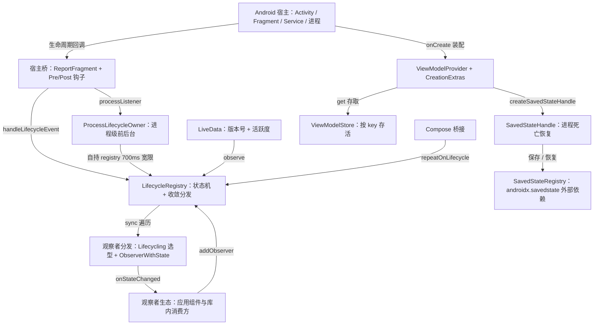
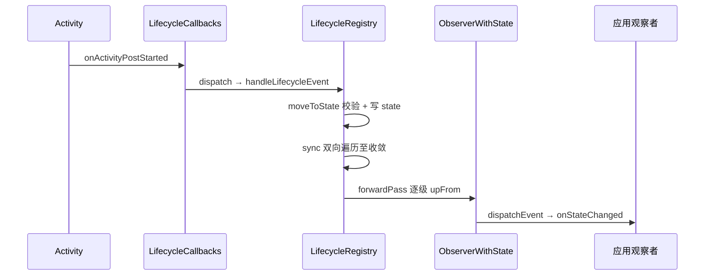

# androidx/lifecycle 架构解码

> 源码锚点：commit `f38a5e5`（main；含 74 文件中文标注批注）｜ 生成：2026-09-06 ｜ 范围：androidx/lifecycle 全部 30 个模块（源码仓 `AndroidLibs/androidx/lifecycle`）
> 锚点规范：正文引用一律 `类名#方法名（文件路径）`（禁行号），无方法归属的用文件名。
> 工作区状态：`git status --short` 为 0（干净），锚点与 commit 一致。
> git 历史仅 16 个 commit 且 message 全为 "add"——演化史不可考，动机考据走代码结构 + 测试名 + 源码内 bug 编号注释（b/xxxx、KT-20427）。

## 1. 一图流

图例：本图回答"各机制怎么挂在 Lifecycle 契约上"。⚠ 隐藏耦合两条不在此图展开：`lifecycle-viewmodel` 不依赖任何 lifecycle 模块（独立契约树，见 §3 ⚠ 注）；`SSH → SavedStateReg` 是对 androidx.savedstate 的跨库依赖（§5 savedstate 卡片）。节点与 §3 模块表、§7 类表一一对应；边方向与 §2 分层验证一致。

## 2. 快速上手阅读路径

1. `lifecycle-common/src/commonMain/kotlin/androidx/lifecycle/Lifecycle.kt` —— 契约是什么？看到 State 节点图与 Event#upFrom/downTo 的"状态差→事件"翻译层算懂。
2. `lifecycle-runtime/src/jvmCommonMain/kotlin/androidx/lifecycle/LifecycleRegistry.jvm.kt` —— 事件怎么变成观察者回调？看到 moveToState 收口 + sync 双向遍历 + 重入三标志算懂。
3. `lifecycle-runtime/src/androidMain/kotlin/androidx/lifecycle/ReportFragment.android.kt` —— 宿主事件从哪来？看到 API 29 双通道（Pre/Post 钩子 vs 无界面 Fragment）与防双发闸算懂。
4. `lifecycle-livedata-core/src/main/java/androidx/lifecycle/LiveData.java` —— 数据怎么跟着生命周期走？看到 considerNotify 三道闸（活跃→实时状态→版本号）算懂。
5. `lifecycle-viewmodel/src/commonMain/kotlin/androidx/lifecycle/ViewModel.kt` + `viewmodel/internal/ViewModelProviderImpl.kt` —— ViewModel 怎么活过旋转？看到 Store 按 key 存活 + get 取/建一体算懂。
6. `lifecycle-viewmodel-savedstate/src/commonMain/kotlin/androidx/lifecycle/SavedStateHandleSupport.kt` —— 进程死亡怎么恢复？看到"整包消费 + 消费即删 + 保存时真值优先合流"算懂。
7. `lifecycle-process/src/main/java/androidx/lifecycle/ProcessLifecycleOwner.kt` —— 多个 Activity 怎么压成一个前后台 Owner？看到计数真值 + 700ms 宽限窗算懂。
8. `lifecycle-runtime/src/commonMain/kotlin/androidx/lifecycle/RepeatOnLifecycle.kt` —— 挂起 API 怎么挂进事件流？看到"观察者盯 upTo/downFrom 边界 + suspendCancellableCoroutine"算懂。
9. `lifecycle-runtime-compose/src/commonMain/kotlin/androidx/lifecycle/compose/FlowExt.kt` —— Compose 怎么消费？看到 produceState + repeatOnLifecycle 的唯一真实现算懂。
10. 源码仓 `androidx/lifecycle/Lifecycle.md`（沉淀文档）—— 各机制三问结论/易错点/设计思想的详解层。

## 3. 分层与模块地图

分层假设（验证后成立）：**契约层 → 实现层 → 场景层 → 工具层**，依赖方向自上而下单向。

| 模块 | 一行职责 | 依赖（lifecycle 内） | 被依赖（扇入，构建文件实证） |
|---|---|---|---|
| lifecycle-common | 契约：Lifecycle/Owner/Observer 三接口 + Lifecycling 选型 + lifecycleScope | 无 ⚠ | 6+ |
| lifecycle-viewmodel | 契约：ViewModel/Store/Provider/CreationExtras | 无 lifecycle 模块 ⚠ | 6 |
| lifecycle-runtime | 实现：LifecycleRegistry + 宿主桥 + repeatOnLifecycle/withStateAtLeast | common | 9（最高） |
| lifecycle-livedata-core | 实现：LiveData 双支柱（版本号 + 活跃度） | common, runtime | 5 |
| lifecycle-livedata | 场景：MediatorLiveData/Transformations/liveData{} 构建器 | livedata-core | 2 |
| lifecycle-viewmodel-savedstate | 场景：SavedStateHandle + 恢复账本 + 工厂 | viewmodel, runtime, livedata-core + androidx.savedstate（外部） | 4 |
| lifecycle-process | 场景：进程级前后台 Owner + App Startup 装配 | runtime | 2 |
| lifecycle-runtime-compose | 场景：Compose 桥（collect/resume effect/dropUnless） | runtime + compose-runtime（外部） | 4 |
| lifecycle-viewmodel-compose | 场景：viewModel() 委托 + LocalViewModelStoreOwner | viewmodel, viewmodel-savedstate, livedata-core, common ⚠ | 4 |
| lifecycle-service | 场景：Service 的 LifecycleOwner（Pre-Super 派发） | runtime | 1 |
| lifecycle-reactivestreams | 场景：LiveData ↔ ReactiveStreams Publisher 互转 | livedata-core + org.reactivestreams（外部） | 1 |
| lifecycle-extensions | 工具：ViewModelProviders/ViewModelStores 废弃门面 | runtime, viewmodel + androidx.fragment ⚠ | 0 |
| lifecycle-compiler | 工具：@OnLifecycleEvent 注解处理器（生成 Xxx_LifecycleAdapter） | 无（独立 APT） | 0 |
| 5 个 lint 模块 | 工具：Lint 检测器家族（repeatOnLifecycle 误用等） | lint-common | 0 |
| lifecycle-livedata-core-truth | 工具：Truth 主题断言 | livedata-core | 0 |
| lifecycle-viewmodel-navigation3 | 场景：Navigation3 的 ViewModelStore 接线 | viewmodel + navigation3（外部） | 0 |
| 8 个空壳模块（见下） | 坐标保留，0 主源码 | — | 少量 |

⚠ 分层验证（Reflexion）发现的意外边与 absent 隐藏耦合：
- **`lifecycle-viewmodel` 不依赖 `lifecycle-common`**（`lifecycle-viewmodel/build.gradle` 无任何 `project(":lifecycle:...")`）——两棵契约树并行，ViewModel 生态不感知 Lifecycle 事件；汇合点在 viewmodel-compose / viewmodel-savedstate / 宿主（ComponentActivity）。KMP 化后的模块边界，不是遗漏。
- **`viewmodel-compose → viewmodel-savedstate`**：`viewModel()` 组装 CreationExtras 时经 `rememberSavedStateHandleSaver` 塞入恢复能力——假设漏掉，源码实证。
- **`viewmodel-savedstate → livedata-core`**：SavedStateHandle 的 LiveData 投影（`SavedStateHandle.android.kt#getLiveDataInternal`）反向拖入 LiveData 依赖。
- **`extensions → androidx.fragment`**（`ViewModelProviders.java#of` 参数是 FragmentActivity/Fragment）：只为两个废弃门面的旧签名保留，拖进整个 fragment 依赖——历史包袱，3.0 移除候选。
- **空壳依赖**（`runtime-compose → runtime-ktx`、`viewmodel-compose → common-java8` 等）：8 个 0 主源码模块仍被依赖，纯属 gradle 坐标平滑迁移，无代码耦合。
- 空壳 8 模块：livedata-ktx / livedata-core-ktx / runtime-ktx / viewmodel-ktx / reactivestreams-ktx / common-java8 / runtime-testing / viewmodel-testing（API 已并入主模块或为纯测试转发坐标）。

## 4. 主链路

**主链 A：一次 Activity onStart 走到应用回调（Android，API 29+）**，时序图回答"事件从宿主到回调经过谁"：

- `LifecycleCallbacks#onActivityPostStarted（ReportFragment.android.kt）`：Post 钩子在宿主 onStart 返回后触发，时序与 Lifecycle 契约对齐；29 以下走 ReportFragment 同点位转发。
- `ReportFragment.Companion#dispatch（ReportFragment.android.kt）`：选路 LifecycleRegistryOwner → LifecycleOwner+Registry，落到 `LifecycleRegistry#handleLifecycleEvent`。
- `LifecycleRegistry#moveToState → #sync → #forwardPass（LifecycleRegistry.jvm.kt）`：重入只挂 newEventOccurred 标志，顶层 while(!isSynced) 收敛。
- `ObserverWithState#dispatchEvent（LifecycleRegistry.jvm.kt）`：派发前压低登记态、派发后置目标态——登记序不变量的一环。

**主链 B：ViewModel 的取/建与恢复（get(key, class)）**：
`viewModel() → ViewModelStoreOwner.get → ViewModelProviderImpl#getViewModel（store 命中即返；miss 则 CreationExtras 组装 → factory.create → put）`；extras 含 `SAVED_STATE_REGISTRY_OWNER_KEY/VIEW_MODEL_STORE_OWNER_KEY/VIEW_MODEL_KEY` 时工厂调 `CreationExtras#createSavedStateHandle（SavedStateHandleSupport.kt）` 注入恢复状态。

**主链 C：进程死亡 → 重建恢复**：
`SavedStateHandleAttacher#onStateChanged（ON_CREATE）→ SavedStateHandlesProvider#performRestore（整包消费）→ 工厂 createSavedStateHandle → #consumeRestoredStateForKey（消费即删）→ SavedStateHandle.Companion#createHandle（恢复值优先）`；保存侧反向：`SavedStateHandlesProvider#saveState（余量垫底 + 在场真值覆盖）→ SavedStateRegistry 落盘`。

## 5. 模块卡片

### lifecycle-common

**职责**：定义生命周期契约（State/Event/Owner/Observer）并把三种观察者写法归一化成单一分发形态。
**对外接口**：`Lifecycle`（currentState/addObserver/currentStateFlow）、`LifecycleEventObserver#onStateChanged`（唯一分发形态）、`DefaultLifecycleObserver`（应用侧首选）、`Lifecycling#lifecycleEventObserver`（RestrictTo 选型入口）、`Lifecycle.coroutineScope`。
**关键协作**：被 runtime/viewmodel-savedstate/livedata-core 等全部下游依赖；自身零依赖。
**设计动机**：契约与实现分库——contract 无 Android 依赖（commonMain 纯 Kotlin），KMP 各平台才能共享同一套契约（`Lifecycling.nonJvm.kt` 只认两接口即证据）。
**雷区**：`currentStateFlow` 契约层默认实现是"自观察"弱实现（每次 get 新建 flow），Registry override 才是真状态源（`LifecycleRegistry.jvm.kt#_currentStateFlow`）。

### lifecycle-runtime

**职责**：Lifecycle 的标准实现 + Android 宿主接入 + 事件驱动的挂起扩展；扇入最高的枢纽模块（9 次被依赖）。
**对外接口**：`LifecycleRegistry`（自定义 Owner 直接用）、`ReportFragment.injectIfNeededIn`（宿主接入，RestrictTo）、`repeatOnLifecycle/withStateAtLeast` 族、`findViewTreeLifecycleOwner`。
**关键协作**：ReportFragment（androidMain）→ Registry；`isMainThread（LifecycleRegistry.android.kt）` 委托 ArchTaskExecutor 实现可注入的主线程判定。
**设计动机**：KMP 拆分形态——commonMain 只剩 expect + `checkLifecycleStateTransition` 禁令，真实现沉到 jvmCommonMain（Android/桌面共享），Android 侧只留 ArchTaskExecutor 粘合（`LifecycleRegistry.android.kt`）。
**雷区**：Registry 无锁，正确性完全押在主线程单线程约束上；`createUnsafe` 仅测试用。

### lifecycle-viewmodel

**职责**：ViewModel 生态契约与共享实现：作用域存储、取/建一体 Provider、键控参数袋、clear 收口。
**对外接口**：`ViewModelProvider#get`（幂等）、`ViewModelStore#put/clear`、`CreationExtras`（键控参数袋）、`ViewModel#addCloseable`/`onCleared` 清理序列、`viewModelScope`。
**关键协作**：`ViewModelProviderImpl#getViewModel`（共享实现）被 android/nonJvm actual 薄委托；Android actual 的 `createViewModel` 做 AbstractMethodError 三级降级（b/230454566、b/341792251）。
**设计动机**：expect class 不支持方法默认实现（KT-20427，类头注释），共享逻辑抽 internal Impl 类——这是全库 KMP 化的标准手法。
**雷区**：clear 只清匿名 closeables、保留 keyed——`viewModelScope` 惰性资源靠这个不被意外重建；本模块不依赖 lifecycle-common（见 §3 ⚠）。

### lifecycle-livedata-core

**职责**：生命周期感知的数据持有者：版本号管"发什么"，活跃度管"发给谁、何时启停资源"。
**对外接口**：`LiveData#observe/observeForever`、`MutableLiveData`（唯一写口）、`Observer`（SAM）。
**关键协作**：`LifecycleBoundObserver` 既是观察者包装又是 LifecycleEventObserver——挂进批次一的 Registry 实现"活跃跟随宿主、DESTROYED 自摘"。
**设计动机**：两机制正交可组合（版本号对账出粘性/去重/幂等；活跃计数 0↔1 过界出 onActive/onInactive 扩展面），下游生态全部只建在这两个钩子上。
**雷区**：`postValue` 合并写丢中间值且晚于已排队的 setValue；分发双标志（mDispatchingValue/mDispatchInvalidated）失效重扫语义同 Registry.sync。

### lifecycle-livedata

**职责**：在 core 之上搭转换生态：MediatorLiveData 活跃级联、map/switchMap/distinctUntilChanged、liveData{} 协程构建器、Flow 互转。
**对外接口**：`MediatorLiveData#addSource/removeSource`、`Transformations` 三算子、`liveData { emit/emitSource }`、`asFlow/asLiveData`。
**关键协作**：`Source#onChanged（MediatorLiveData.java）` 版本对账防重放；`BlockRunner#cancel（CoroutineLiveData.kt）` 5 秒宽限窗应对旋转。
**设计动机**：转换器全部建在 onActive/onInactive 两个钩子上——最小扩展面承载整个生态（活跃级联让上游订阅/计算按需启停）。
**雷区**：Mediator 重激活**不**重放源头旧值（Source 版本对账），与 LiveData 本体粘性语义相反。

### lifecycle-viewmodel-savedstate

**职责**：进程死亡后的状态恢复：SavedStateHandle + 恢复账本（SavedStateHandlesProvider）+ 新旧双路径工厂。
**对外接口**：`SavedStateHandle#get/set/getStateFlow/getLiveData`、`CreationExtras.createSavedStateHandle`、`SavedStateViewModelFactory`（RestrictTo）、`serialization.saved` 委托（kotlinx.serialization）。
**关键协作**：`SavedStateHandlesVM`（ViewModelStore 内）缓存 handle 支撑旋转复用；`SavedStateHandlesProvider#saveState` 的"余量垫底 + 真值覆盖"合流。
**设计动机**：进程死亡与重建之间无活对象可依——恢复数据必须有显式消费模型（读走即删防复活、合流保续命），见 §2 测试与 §8。
**雷区**：getLiveData 与 getMutableStateFlow 同 key 互斥；`remove` 不摘 mutableFlows 条目（残留到下次 set）；`SavedStateHandleImpl#get` 对类型漂移静默移除返回 null（恢复脏数据不崩）。

### lifecycle-process

**职责**：把所有 Activity 的可见/可交互状态压缩成单个进程级 LifecycleOwner；App Startup 装配。
**对外接口**：`ProcessLifecycleOwner.get()`（观察 ON_START/ON_STOP 即前后台）、`ProcessLifecycleInitializer`（manifest meta-data 装配）。
**关键协作**：前向通道（start/resume）按 API 29 分界（Pre/Post 钩子 / ReportFragment.processListener）；后向通道直接应用级回调。
**设计动机**：真值计数即时记账 + 广播延迟 700ms + sent 标志对账——迟滞防抖，旋转的亚秒翻转合并为净零事件。
**雷区**：pause/stop 带最多 700ms 延迟（精确埋点别用）；ON_CREATE 只派一次、ON_DESTROY 永不派；多进程各有一份。

### lifecycle-runtime-compose

**职责**：生命周期语义翻译成 Compose 语义：数据收集、状态订阅、成对 Effect、回调门控。
**对外接口**：`collectAsStateWithLifecycle`、`currentStateAsState`、`LifecycleResumeEffect/LifecycleStartEffect`（必须 onStopOrDispose/onPauseOrDispose 收尾）、`dropUnlessResumed/Started`、`LocalLifecycleOwner`。
**关键协作**：`FlowExt.kt` 唯一真实现 = produceState + repeatOnLifecycle；`LifecycleStartEffectImpl` effectResult 三拍记账（存/消费/onDispose 兜底）。
**设计动机**：Compose 收不到 ON_DESTROY（ON_STOP 后停止重组）——API 层显式拒绝 ON_DESTROY 订阅（`LifecycleEventEffect` 入口抛 IllegalArgumentException），清理职责整体移交 onDispose。
**雷区**：无参调用 Effect 被 ERROR 级废弃重载遮蔽（编译期强制 key）；Android actual 的 LocalLifecycleOwner 是 Compose 1.6/1.7 反射兼容桥，仅为过渡期存在。

## 6. 核心类深卡片

### LifecycleRegistry（lifecycle-runtime）

**职责**：Lifecycle 契约的标准实现：观察者登记表 + 状态机 + 收敛分发三合一。
**协作者**：`LifecycleRegistry#handleLifecycleEvent` 接宿主桥；`#addObserver/#removeObserver` 接一切消费方（LiveData/Compose/挂起 API）；`ObserverWithState#dispatchEvent` 是唯一出口。
**设计动机**：事件乱序与重入是核心矛盾——回调里再改状态/增删观察者。解法是重入三标志（handlingEvent/addingObserverCounter/newEventOccurred）+ 顶层 sync 收敛；无锁正确性押在主线程约束（`#enforceMainThreadIfNeeded` + 可注入 `isMainThread`）。
**不变量**：登记序不变量"先加者状态 ≥ 后加者"（三处配合：`#calculateTargetState` 三元 min、dispatchEvent 派发前压低、backwardPass 降序撤回）；DESTROYED 终态不可移出、INITIALIZED 不得直达 DESTROYED（`checkLifecycleStateTransition`）。

### LiveData（lifecycle-livedata-core）

**职责**：生命周期感知数据持有者：粘性分发 + 活跃度启停。
**协作者**：`LiveData#observe` 创建 LifecycleBoundObserver（挂 Registry）；`#considerNotify` 三道闸；`#dispatchingValue` 失效重扫；`#changeActiveCounter` 过界回调。
**设计动机**：测试名校准——`LiveDataTest.kt` 的 `testObserverToggle`/`testReAddSameObserverTuple`/`testAdd2ObserversWithSameOwnerAndRemove` 印证观察者包装的活跃翻转与重注册规则是行为规格；版本对账让"新观察者补到当下"（`considerNotify` 的 mLastVersion 对账）。
**不变量**：主线程收口（setValue/assertMainThread）；mActive 立即置位再派发（不给非活跃宿主派发）；postValue 合并写（mPendingData + postTask 标志）。

### ViewModelImpl（lifecycle-viewmodel，internal 共享实现）

**职责**：ViewModel 清理契约的真实载体：双集合资源登记 + 固定清理序列。
**协作者**：`ViewModel#clear（ViewModel.jvm.kt）` 先 `ViewModelImpl#clear` 再 onCleared；`viewModelScope` 以 closeable 挂 keyToCloseables。
**设计动机**：多来源资源（构造注入/keyed/匿名）需要单一收口；"清理后又登记"的泄漏窗口用 volatile 单向闸堵（isCleared 置位后新资源立即关闭，`#addCloseable`）。
**不变量**：clear 序列——带 key → 匿名 → onCleared；只清匿名集合保留 keyed（防 viewModelScope 被重建为永不取消的新作用域）；close 异常包 RuntimeException 上抛。

### SavedStateHandlesProvider（lifecycle-viewmodel-savedstate，internal）

**职责**：单个宿主的恢复账本：整包消费、按 key 消费即删、保存时合流。
**协作者**：`#performRestore` 由 `SavedStateHandleAttacher#onStateChanged`（ON_CREATE）驱动；`#saveState` 注册进 SavedStateRegistry（SAVED_STATE_KEY 一条打包全部 handle）；`#consumeRestoredStateForKey` 被工厂经 `CreationExtras#createSavedStateHandle` 调用。
**设计动机**：属主（ViewModel）可能不在场但数据需续命——保存时余量先垫底、在场 handle 真值覆盖；消费即删防止同一恢复数据二次注入。
**不变量**：restored 标志保证整包只消费一次；saveState 末尾复位 restored 允许"保存后再恢复一轮"。

### ProcessLifecycleOwner（lifecycle-process）

**职责**：进程级前后台 Owner：多 Activity 状态压缩 + 迟滞防抖广播。
**协作者**：`#activityStarted/#activityResumed/#activityPaused/#activityStopped` 计数入口；`#dispatchPauseIfNeeded/#dispatchStopIfNeeded` 广播点；attach 经应用级回调 + ReportFragment.processListener（29-）双通道。
**设计动机**：真值（计数器）与广播（sent 标志）分离——700ms 宽限窗内旋转回转 `#activityResumed` 直接 removeCallbacks 撤销，净事件为零。
**不变量**：ON_STOP 必须等 ON_PAUSE 已发（pauseSent 守卫，registry 不能 RESUMED 直落 CREATED）；ON_CREATE 一次、ON_DESTROY 零次。

## 7. 全类职责表

覆盖率口径见文尾；[name-only] = 未读源码、仅凭文件名/构建文件入表。

### lifecycle-common

| 类/扩展 | 一行职责 | 关键协作 |
|---|---|---|
| Lifecycle | 契约基类：State 节点图 + Event 边 +currentStateFlow 出口 | Registry 实现之 |
| Lifecycle.Event#targetState | 事件→目标状态翻译（升降共用一张表）；upFrom/upTo/downFrom/downTo 状态差→事件 | Registry 同步 / 挂起 API 门控 |
| Lifecycle.State#isAtLeast | 枚举序比较的状态门控基石 | LiveData shouldBeActive 等 |
| LifecycleOwner | 单方法契约：交出 Lifecycle 实例 | 全部宿主实现 |
| LifecycleObserver | 标记接口 + 实现族谱锚点 | Lifecycling 选型 |
| LifecycleEventObserver | 事件级观察契约（唯一分发形态） | ObserverWithState 调用 |
| DefaultLifecycleObserver | 方法级观察契约（默认空实现、应用侧首选） | DefaultLifecycleObserverAdapter 翻译 |
| LifecycleCoroutineScopeImpl | lifecycleScope 载体：自注册观察者，ON_DESTROY 自摘除自取消 | internalScopeRef CAS 单例 |
| Lifecycling#lifecycleEventObserver | observer→LifecycleEventObserver 归一化选型台（接口→生成适配器→反射） | ClassesInfoCache / 生成观察者 |
| OnLifecycleEvent | 废弃注解：方法级事件订阅（RUNTIME retention） | 反射路径 |
| ReflectiveGenericLifecycleObserver | @OnLifecycleEvent 反射兜底：查表 invoke | ClassesInfoCache.CallbackInfo |
| ClassesInfoCache#invokeCallbacks | 两级缓存（方法元数据）支撑的反射分发 | MethodReference 位掩码去重 |
| GeneratedAdapter | 生成适配器契约：onAny 两段执行 | Single/Composite 包装 |
| SingleGeneratedAdapterObserver / CompositeGeneratedAdaptersObserver | 生成适配器的单/多聚合包装（家族行：先具名后 ON_ANY 两遍） | MethodCallsLogger 去重 |
| MethodCallsLogger#approveCall | 位掩码去重账本 | Composite 调用 |
| GenericLifecycleObserver | 废弃标记接口（3.0 移除） | — |
| Lifecycle.coroutineScope / Lifecycle.eventFlow | 扩展：作用域惰性单例 / callbackFlow 事件流化 | LifecycleCoroutineScopeImpl |

### lifecycle-runtime

| 类/扩展 | 一行职责 | 关键协作 |
|---|---|---|
| LifecycleRegistry | 标准实现：登记表+状态机+收敛分发（见深卡片） | 宿主桥/全部消费方 |
| LifecycleRegistry.ObserverWithState#dispatchEvent | 登记态压低-派发-置位的观察者包装 | Lifecycling 选型结果 |
| ReportFragment | Activity 事件注入桥：API 29 双通道 + 防双发闸 + processListener | LifecycleCallbacks / ProcessLifecycleOwner |
| LifecycleRegistryOwner | 废弃接口：旧宿主把 getLifecycle 钉在 Registry | dispatch 选路第一步 |
| repeatOnLifecycle#Lifecycle.repeatOnLifecycle | 观察者驱动的启停循环（Mutex 串行 + finally 兜底） | upTo/downFrom 边界事件 |
| withStateAtLeast 族（withCreated/withStarted/withResumed） | 等状态达标单次执行（快路径 inline 零挂起） | LifecycleDestroyedException |
| whenStateAtLeast 族（废弃） | 挂起式调度（PausingDispatcher 队列暂停） | LifecycleController/DispatchQueue |
| LifecycleController / PausingDispatcher / DispatchQueue | 废弃基础设施：状态三映射驱动队列暂停/恢复/终止 | whenStateAtLeast |
| flowWithLifecycle | callbackFlow+repeatOnLifecycle 的热流门控 | repeatOnLifecycle |
| setViewTreeLifecycleOwner / findViewTreeLifecycleOwner | View 树挂载/上溯查找 Owner（父链含 Dialog 非连续父） | 宿主 set、View 层组件 get |

### lifecycle-livedata-core / lifecycle-livedata

| 类/扩展 | 一行职责 | 关键协作 |
|---|---|---|
| LiveData | 双支柱实现（版本号+活跃度，见深卡片） | LifecycleBoundObserver |
| MutableLiveData | 唯一公开写口：读写分离靠类型表达 | — |
| Observer | SAM 回调（fun interface） | observe 参数 |
| MediatorLiveData | 活跃级联 + 多源聚合（转换器积木） | Source 版本对账 |
| Transformations.map/switchMap/distinctUntilChanged | Mediator 薄包装三算子（含初始值预热） | MediatorLiveData |
| liveData{} / LiveDataScope / CoroutineLiveData | 协程构建器：block 随活跃启停 + 5s 宽限取消 | BlockRunner/EmittedSource |
| ComputableLiveData | 惰性计算骨架：invalid 标脏 + computing 单飞 | refreshRunnable 合流 |
| asFlow / asLiveData | LiveData↔Flow 互转（NonCancellable 清理 / StateFlow 初值预热） | callbackFlow / liveData |

### lifecycle-viewmodel / viewmodel-compose

| 类/扩展 | 一行职责 | 关键协作 |
|---|---|---|
| ViewModel | 清理收口契约：closeable 登记 + onCleared（expect） | ViewModelImpl |
| ViewModelStore#put/get/clear | 按 key 存储：put 覆盖即 clear；clear 逐个通知 | ViewModelProviderImpl |
| ViewModelStoreOwner | 作用域契约：旋转留 Store、真销毁 clear | 宿主实现 |
| HasDefaultViewModelProviderFactory | 默认工厂/extras 契约 | ViewModelProviders.getDefaultFactory |
| ViewModelProvider# get（expect 门面） | 取/建一体转发共享 Impl | ViewModelProviderImpl |
| ViewModelProvider.Factory 家族（Factory/OnRequeryFactory/NewInstanceFactory/AndroidViewModelFactory） | 创建扩展点四件套：接口 + requery 兼容 + 反射空构造 + Application 双轨 | createViewModel 降级链 |
| ViewModelProviderImpl#getViewModel | synchronized 取/建一体（命中返、miss 建后 put） | ViewModelStore/Factory |
| CreationExtras / MutableCreationExtras | 键控类型安全参数袋（工厂无状态化） | Key<T> 泛型键 |
| ViewModelLazy | by viewModels() 载体：producer 惰性求值 + cached | ViewModelProvider.create |
| AndroidViewModel | 持 Application 的 VM 基类（旋转安全 Context） | AndroidViewModelFactory |
| viewModelScope | 惰性 closeable 作用域（SupervisorJob+Main.immediate） | createViewModelScope |
| viewModelFactory / InitializerViewModelFactoryBuilder / ViewModelInitializer | DSL 工厂三件套：逐类登记 initializer | InitializerViewModelFactory |
| viewmodel-compose：viewModel() | Compose 取 VM 门面（LocalViewModelStoreOwner 默认、extras 组装含 SavedStateHandleSaver） | ViewModelStoreOwner#get |
| viewmodel-compose：LocalViewModelStoreOwner | StoreOwner 的 CompositionLocal 注入点 | 宿主 provide |

### lifecycle-viewmodel-savedstate

| 类/扩展 | 一行职责 | 关键协作 |
|---|---|---|
| SavedStateHandle | 恢复句柄：regular 真值表 + 投影 + 惰性打包（expect） | SavedStateHandleImpl |
| SavedStateHandleImpl#savedStateProvider | 保存时刻冲刷链（mutableFlows→regular→providers，副本防重入） | SavedStateHandlesProvider/Controller |
| SavedStateHandle.android SavingStateLiveData | LiveData 投影：setValue 回写 handle；remove 时 detach | getLiveData |
| SavedStateHandleSupport#enableSavedStateHandles | 新路径开关：集中 Provider + Attacher 注册 | SavedStateRegistry |
| SavedStateHandlesProvider | 恢复账本（深卡片） | SavedStateHandlesVM |
| SavedStateHandleController / LegacySavedStateHandleController | 旧路径每-VM 接线器 + OnRecreation 滚动重接 | registry.runOnNextRecreation |
| SavedStateViewModelFactory | 双路径工厂（extras 新 / 构造器旧，签名匹配） | findMatchingConstructor |
| AbstractSavedStateViewModelFactory | 废弃基类：逐 VM 造 handle 的旧骨架 | viewModelFactory 替代 |
| serialization.saved | kotlinx.serialization 属性委托（key 自动生成） | SavedStateHandleDelegate |
| createHandle / validateValue | 恢复值优先建 handle + 写入类型白名单 | isAcceptableType |

### lifecycle-process / service / reactivestreams / extensions

| 类/扩展 | 一行职责 | 关键协作 |
|---|---|---|
| ProcessLifecycleOwner | 进程级前后台（深卡片） | initializationListener |
| ProcessLifecycleInitializer | App Startup 装配：拒绝懒加载（isEagerlyInitialized） | LifecycleDispatcher.init + ProcessLifecycleOwner.init |
| LifecycleDispatcher#init | CAS 防重 + 每 Activity 注入 ReportFragment | DispatcherActivityCallback |
| LifecycleService | Service 的 LifecycleOwner：Pre-Super 派发时序 | ServiceLifecycleDispatcher |
| ServiceLifecycleDispatcher#postDispatchRunnable | postAtFrontOfQueue + wasExecuted 防重保证 Pre-Super 语义 | DispatchRunnable |
| toPublisher / Publisher<T>.toLiveData | LiveData↔ReactiveStreams 互转（request(n) 缓冲最新值） | LiveDataPublisher/PublisherLiveData |
| ViewModelProviders / ViewModelStores | 废弃门面：of() 直转 ViewModelProvider 构造 | androidx.fragment 类型签名 |

### runtime-compose

| 类/扩展 | 一行职责 | 关键协作 |
|---|---|---|
| collectAsStateWithLifecycle | Flow→State 活跃门控收集（唯一真实现 produceState+repeatOnLifecycle） | LocalLifecycleOwner |
| currentStateAsState | currentStateFlow→Compose State | collectAsState |
| LifecycleEventEffect | 单事件 Effect（ON_DESTROY 显式禁止） | rememberUpdatedState |
| LifecycleResumeEffect / LifecycleStartEffect | 成对启停 Effect（key 身份 + 清理子句必须收尾） | LifecycleStartEffectImpl 三拍记账 |
| LifecycleStartStopEffectScope / LifecycleResumePauseEffectScope | 清理子句载体（onStopOrDispose/onPauseOrDispose） | 对应 Result 接口 |
| dropUnlessResumed / dropUnlessStarted | 回调门控装饰器（isAtLeast 放行） | LocalLifecycleOwner |
| LocalLifecycleOwner | Owner 的 CompositionLocal（Android 侧 1.6/1.7 反射兼容桥） | compose-ui |

**跳过清单（不入表）**：lifecycle-compiler 全部内部类（LifecycleProcessor/writer/input_collector/model/*——注解处理器内部实现，公共产物 Xxx_LifecycleAdapter 归 GeneratedAdapter 行）；5 个 lint 模块检测器（`[name-only]` 家族行：NonNullableMutableLiveDataDetector、RepeatOnLifecycleDetector、LifecycleWhenChecks、ViewModelConstructorInComposableDetector 等，自述性文件名）；测试代码与 samples（kotlintestapp、*-samples）；平台垫片家族行：MainDispatcherChecker.desktop/native、WeakReference.nonJvm/native、Lock.darwin/linux、SynchronizedObject.jvm/native（平台互斥原语族，7 文件）；viewmodel-navigation3 的 ViewModelStoreNavLocalProvider（`[name-only]`，1 文件）；livedata-core-truth 的 LiveDataSubject（`[name-only]`，1 文件）。

**覆盖率实数**：§7 共 7 表 66 数据行，全部实证读过源码（其中家族行 3 行，行内列全成员）；未读源码的 7 个文件不入表，以 [name-only] 形式列于跳过清单（lint 检测器家族、ViewModelStoreNavLocalProvider、LiveDataSubject、SavedStateHandleSaver/SaveableApi 2 文件）；平台垫片 7 文件（MainDispatcherChecker/WeakReference/Lock/SynchronizedObject 族）读过 expect 侧职责定义、未逐文件读平台实现，按家族行列于跳过清单。名字即职责的自述性文件（lint 检测器）占未读大头，读入优先级最低。

## 8. 看着糟但其实没问题

- **8 个 0 源码模块仍在构建与发布**（livedata-ktx、runtime-ktx、common-java8 等）：API 已合并进主模块，但下游 gradle 坐标不能一夜切换——空壳 + 依赖约束是平滑迁移的过渡形态，"删掉它们"反而是破坏。
- **KMP 的 expect/actual + internal Impl 间接层**（ViewModelImpl/ViewModelProviderImpl）：多一层跳转看似冗余，实为 KT-20427（expect class 不支持方法默认实现）的绕法，且让 Android/nonJvm actual 薄到只剩平台差异。
- **extensions 依赖 androidx.fragment 只为两个废弃类**：ViewModelProviders.of(FragmentActivity) 的旧签名牵着 fragment 类型——修不动（二进制兼容），3.0 删除即解开。
- **ProcessLifecycleOwner 的 `handler!!` 非空断言**：handler 在 attach 里赋值、回调必在 attach 后到达（Activity 回调晚于 Application 初始化），断言成立但依赖时序约定——读起来吓人，语义安全。
- **`SavedStateHandleImpl#remove` 不清 mutableFlows**：看似泄漏，实为"flow 身份稳定"语义——同一 key 的 flow 引用跨 remove 仍有效，值残留下次 set 覆盖；配合 get 的 mutableFlows 优先读语义自洽。
- **`ReportFragment` 29+ 双通道并存**：fragment 回调只喂 processListener、registry 事件走 Pre/Post——两套监听看似重复，实为兼容旧版 ProcessLifecycleOwner 的过渡设计（上游注释言明）。

## 9. 相邻产物

- 源码仓 [Lifecycle.md](/home/liang/Project/MyProject/AndroidLibs/androidx/lifecycle/Lifecycle.md)（source-annotator 沉淀文档）：九个机制的**三问结论/代码链路/设计思想/易错点**详解层——读完本架构文档想深入某个机制时读它；它不回答"30 个模块怎么组织"（本文职责），本文不复述机制细节。
- 知识库（Summary/project/knowledge-base/）sdk-design.md / design-principles.md 已收 7 条 lifecycle 相关条目（资源自清、有序登记表、版本号对账、活跃度翻转点、真值广播、恢复账本、ERROR 遮蔽重载）。

## 10. 开放问题

- **[inferred] 清单**：①"两棵契约树并行是 KMP 化的刻意边界"——依据是构建文件 + 模块职责，无 commit 信息可证（历史不可考）；②空壳模块 = 平滑迁移过渡形态——依据是上游模块合并惯例与依赖约束方向，未见迁移文档；③`remove` 不清 mutableFlows 是"flow 身份稳定"的刻意语义——代码事实支持但无注释背书，标 [inferred]。
- **需人确认**：校验器对 `SavedStateHandleImpl.android.kt` 上游颜文字（ツ）的标点误报是否给 `check_annotations.py` 加 HEAD 行豁免规则。
- **本轮未深挖**：lifecycle-compiler 内部（生成器逐文件逻辑）；lint 检测器判定逻辑；native/desktop 的 MainDispatcherChecker 与 WeakReference 平台实现；viewmodel-navigation3 与 SavedStateHandleSaver 的完整接线（仅读了调用侧）；SavedStateHandleDelegates 的保存时机（读写属性时 vs handle set 时）只读了头部。
