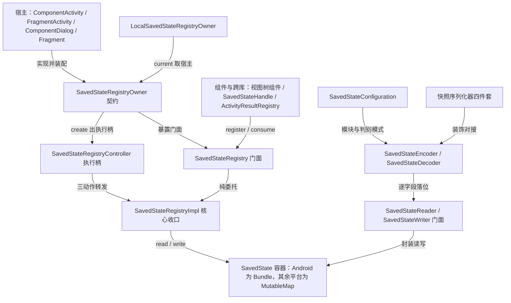

# androidx/savedstate 架构解码

> 源码锚点：commit `f38a5e5`（main）｜ 生成：2026-09-06 ｜ 范围：androidx/savedstate 全部 6 个构建模块 + 与 lifecycle-viewmodel-savedstate 的衔接边（源码仓 `AndroidLibs/androidx/savedstate`）
> 锚点规范：正文引用一律 `类名#方法名（文件路径）`（禁行号），无方法归属的用文件名。
> 工作区状态：`git status --short` 为 0（干净），锚点与 commit 一致。
> git 历史仅 16 个 commit 且 message 全为 "add"——演化史不可考，动机考据走代码结构 + 测试名 + 源码内注释（KT-29963、JetBrains fork 1.3.5 约束）。

先验盘点：本解码建立在同仓三份先行产物上——沉淀文档 `androidx/savedstate/SavedState.md`（机制详解层，已实证三大机制）、`project-architecture/androidx-lifecycle.md`（已覆盖 SavedStateHandle 一侧）、知识库六条 savedstate 条目。已验证结论不再当猜想；本文档只补宏观组织，不重复机制讲解（分工见 §9）。

## 1. 一图流



图例：本图回答"一份进程死亡状态怎么被切分、谁经手"。实线边全部有 import/调用证据（§2 分层验证）；⚠ 两条隐藏耦合不在图上展开——AutoRecreated 反射重建仅 Android 存在（§5 雷区），Proguard 消费规则是公共契约的一部分（§8）。节点与 §3 模块表、§7 类表一一对应。

## 2. 快速上手阅读路径

1. `savedstate/src/commonMain/kotlin/androidx/savedstate/SavedStateRegistryOwner.kt` —— 契约是什么？看到 attach/restore/save 三个动作的生命周期时序约束算懂。
2. `savedstate/src/commonMain/kotlin/androidx/savedstate/internal/SavedStateRegistryImpl.kt` —— 切分逻辑在哪？看到三阶段（attach 幂等挂接 → restore 摘子包 → save 两路合流）算懂。
3. `savedstate/src/androidMain/kotlin/androidx/savedstate/SavedStateRegistryController.android.kt` —— 宿主怎么接入？看到 `SavedStateRegistryController#create` 注入 onAttach 挂 Recreator 算懂。
4. `savedstate/src/commonMain/kotlin/androidx/savedstate/SavedState.kt` —— 容器是什么？看到 expect SavedState + read/write 作用域扩展、Android actual typealias 到 Bundle 算懂。
5. `savedstate/src/commonMain/kotlin/androidx/savedstate/serialization/SavedStateEncoder.kt` —— 任意对象怎么编进容器？看到 beginStructure 根扁平化与 encodeSerializableValue 三层分发算懂。
6. `savedstate/src/commonMain/kotlin/androidx/savedstate/serialization/SavedStateRegistryOwnerDelegate.kt` —— 声明式接入长什么样？看到 `saved` 委托的首次访问注册/恢复算懂。
7. `savedstate-compose/src/androidMain/kotlin/androidx/savedstate/compose/LocalSavedStateRegistryOwner.android.kt` —— Compose 怎么拿宿主？看到 @Deprecated 注解当版本探针算懂。
8. `androidx/lifecycle/lifecycle-viewmodel-savedstate/src/commonMain/kotlin/androidx/lifecycle/SavedStateHandleSupport.kt` —— SavedStateHandle 建在哪上面？看到 `SavedStateHandleSupport#enableSavedStateHandles` 以固定 key 向注册表注册 SavedStateHandlesProvider 算懂（机制详解转 androidx-lifecycle.md）。

## 3. 分层与模块地图

分层假设（验证后成立）：**一个 KMP 核心 + 一个 Compose 适配 + 若干空壳/辅助模块**，依赖自外向内单向。

| 模块 | 一行职责 | 依赖 | 被依赖 |
|---|---|---|---|
| savedstate | 核心：跨平台状态容器 + 按 key 分发的注册表 + kotlinx.serialization 格式后端 | lifecycle-common、annotation、collection（ScatterMap）、kotlinx-coroutines（build.gradle dependencies 块实证） | savedstate-compose、activity、fragment、appcompat、lifecycle-viewmodel-savedstate 等 |
| savedstate-compose | Compose 接驳：CompositionLocal 抬宿主进组合树 + 快照容器序列化器 | savedstate、compose-runtime（build.gradle commonMain.dependencies 实证） | 应用层 Composable |
| savedstate-ktx | 空壳：无源码，仅历史 API txt（1.1.0-beta01 起）与 build.gradle——ktx 坐标迁移兼容 | — | — |
| savedstate-testing | 空占位：仅 `Keep.kt` 一行 TODO 注释防 KMP 空项目构建失败 | — | — |
| savedstate-samples | 官方 @Sampled 用法示例（2 文件，Javadoc @sample 的指向目标） | savedstate | — |
| savedstate-benchmark | androidTest 编解码基准（Reader/Writer、Serializable、polymorphic 等九组） | savedstate | — |

⚠ 意外依赖方向（Reflexion 分层验证）：savedstate **依赖 lifecycle-common**（Impl 里注册 LifecycleEventObserver、Recreator 是 LifecycleEventObserver），同时 lifecycle-viewmodel-savedstate **反向依赖 savedstate**——两库互为上下游但不成环（common 与 viewmodel-savedstate 是不同模块）。这不是历史包袱而是刻意设计：注册表需要生命周期观察者的语言，而生命周期生态又需要注册表做状态底座。

跨平台目标矩阵（savedstate/build.gradle kmh 块实证）：android（defaultPlatform）+ desktop/mac/linux（JVM）+ ios/watchos/tvos + mingwX64 + js + wasmJs——SavedState 的 expect/actual 分裂（Bundle vs MutableMap）正是为这张矩阵服务。

## 4. 主链路

典型场景：进程死亡后的 Activity 状态恢复（Android 侧，ComponentActivity 为宿主）。

```
ComponentActivity 构造 → SavedStateRegistryController#create（注入 onAttach：lifecycle.addObserver(Recreator)）
→ ComponentActivity#onCreate：performAttach（INITIALIZED 校验 + 执行 onAttach + 注册 ON_START/ON_STOP 监听）
→ ComponentActivity#onCreate：performRestore(savedInstanceState)（从整包摘 SAVED_COMPONENTS_KEY 子包暂存）
→ 组件初始化（CREATED 后）：SavedStateRegistryImpl#consumeRestoredStateForKey（凭 key 取走，消费即删）
→ 组件运行期：SavedStateRegistryImpl#registerSavedStateProvider（登记保存回调）
→ ComponentActivity#onSaveInstanceState：SavedStateRegistryImpl#performSave（未消费状态 putAll + 逐 provider saveState 回填整包）
→ 进程重建后 ON_CREATE：Recreator#onStateChanged（消费类名清单，reflectiveNew 重建 AutoRecreated）
```

codec 旁路（对象级存取，两条链共用同一容器）：

```
encodeToSavedState(value, config) → SavedStateEncoder#encodeSerializableValue（三层分发）
  → encodeElement 改写 key 游标 → encodeXxx 按 key 经 SavedStateWriter#putXxx 落进容器
decodeFromSavedState(state, config) → SavedStateDecoder#decodeElementIndex 推进游标
  → decodeXxx 经 SavedStateReader#getXxx 还原（基元走双读消歧，androidMain）
```

声明式入口（组件侧最短路径）：`saved` 委托 → SavedStateRegistryOwnerDelegate#getValue（首次访问注册 provider 并消费恢复数据）→ 保存期 SavedStateRegistryOwnerDelegate#saveState → encodeToSavedState。

宿主侧装配的三个实现方（扇入实证）：ComponentActivity.kt#onCreate（savedstate 全套三动作）、ComponentDialog.kt（窗口 decorView 上 set owner + restore/save）、FragmentViewLifecycleOwner.java（Fragment 视图树子作用域也实现 Owner，把 View 树查找指到自身）。

## 5. 模块卡片

### savedstate（核心）

**职责**：把系统给的整包状态按 key 切分给互不相识的组件，并提供把任意 `@Serializable` 对象编进该容器的格式后端。
**对外接口**：注册表面 `SavedStateRegistry#registerSavedStateProvider`/`consumeRestoredStateForKey`/`getSavedStateProvider`/`unregisterSavedStateProvider`（前置：消费须在 CREATED 后，违反抛 IllegalArgumentException）；codec 入口 `encodeToSavedState`/`decodeFromSavedState`（Format not stable，只保证互读）；声明式入口 `SavedStateRegistryOwner.saved` 委托；Android 扩展 `runOnNextRecreation`（STOP 后调用抛 IllegalStateException）。
**关键协作**：lifecycle-common（观察者挂接）、ViewTreeSavedStateRegistryOwner（View 树查找，被 ComponentDialog/Fragment 用来广播 owner）、下游全部组件经 SavedStateRegistry 门面进来。
**设计动机**：全部逻辑收口 commonMain 的 `SavedStateRegistryImpl`，两平台 actual 纯委托——KMP 化的公共逻辑下沉手法；平台差异（AutoRecreated 反射、ViewTree、Bundle 原生档）以 expect/actual 与平台钩子隔离，nonAndroid 侧 `getDefaultSerializersModuleOnPlatform` 返回空模块即可（SavedStateConfiguration.nonAndroid.kt 实证）。旧 key `androidx.lifecycle.BundlableSavedStateRegistry.key` 原样保留是跨库互读的兼容契约（Impl companion 实证）。
**雷区**：①Android actual 独有 AutoRecreated/runOnNextRecreation——KMP 共通代码引用会编译失败；②`getSavedStateProvider` 是唯一不带 @MainThread 的方法（任意线程可查，表加锁），其余全主线程；③proguard-rules.pro 发布消费级 keep 规则——AutoRecreated 实现类的默认构造器防混淆是库契约，不是内部细节。

### savedstate-compose

**职责**：CompositionLocal 接驳 + 让 Compose 快照容器直接进 codec。
**对外接口**：`LocalSavedStateRegistryOwner.current`（无宿主抛错）；四个序列化器 `MutableStateSerializer`/`SnapshotStateListSerializer`/`SnapshotStateMapSerializer`/`SnapshotStateSetSerializer`（显式指定或 contextual 注册，不自动应用）。
**关键协作**：compose-runtime（CompositionLocal 机制）；Android actual 经运行时反射与 Compose 1.6/1.7/1.8 协商。
**设计动机**：compose-runtime 自身已有 rememberSaveable 体系，本模块不重复造——只把注册表入口交给 Composable，快照容器经装饰器序列化器对接 codec（编码委托标准序列化器，解码新建快照实例回填——重建不复活）。
**雷区**：Android actual 的反射兼容依赖 proguard 规则，Compose 1.8 稳定后将移除反射路径（KDoc 明示）；desktop/nonJvm actual 无默认值，组合根不 provide 读 current 即抛错。

### savedstate-ktx / savedstate-testing / savedstate-samples / savedstate-benchmark

ktx 与 testing 是**占位空壳**：ktx 无任何源码（历史 API surface 以 api/*.txt 追踪）；testing 仅 `Keep.kt` 一行 TODO 注释（"Placeholder to prevent post-submit failures when a KMP project has no files"）。这不是烂尾而是 AndroidX KMP 迁移期的常规策略——先立模块坐标锁住发布位，实现后补。samples 的两个 @Sampled 文件是 API 文档的组成部分（KDoc @sample 指向它们），属于"活文档"。

## 6. 核心类深卡片

### SavedStateRegistryImpl（savedstate，internal）

**职责**：注册表全部状态与逻辑的唯一收口——三阶段（挂接/恢复/保存）+ provider 表 + 消费即删语义。
**协作者**：SavedStateRegistry/Controller 两平台 actual 纯委托进它（SavedStateRegistry.android.kt#consumeRestoredStateForKey 等）；Recreator 经 Controller#create 注入的 onAttach 挂上 lifecycle（SavedStateRegistryController.android.kt#create）；SavedStateHandlesProvider（lifecycle 侧）以固定 key 走 getSavedStateProvider/registerSavedStateProvider（SavedStateHandleSupport.kt#enableSavedStateHandles）。
**设计动机**：进程死亡恢复的矛盾是"一份整包 vs N 个互不相识的组件"。切分所有权靠 key 注册表，而"读了是否要继续保存"的矛盾靠消费即删解决——`SavedStateRegistryImpl#consumeRestoredStateForKey` 读走即 remove，没人读的自动续传（测试 `consumeSameTwice` 印证第二次返回 null）。时序矛盾（何时能恢复/保存/登记）不靠文档靠代码：performRestore 校验 `!isAtLeast(STARTED)`，isAllowingSavingState 由 ON_START/ON_STOP 翻转（测试 `throwSavedStateRegistry` 印证 STOP 后登记抛错）。
**不变量**：attached 全生命周期一次（幂等闸）；performRestore 全生命周期一次且在 STARTED 之前；restoredState/isRestored 仅主线程；keyToProviders 全部访问在 SynchronizedObject 锁内。

### SavedStateEncoder（savedstate.serialization，internal；Decoder 为其镜像）

**职责**：kotlinx.serialization 的 SavedState 格式后端——把 Encoder 协议翻译成"key 游标 + Reader/Writer 落位"。
**协作者**：encodeToSavedState 顶层入口创建（SavedStateEncoder.kt#encodeToSavedState）；落位经 SavedStateWriter#putXxx；平台钩子 encodeFormatSpecificTypesOnPlatform 在 Android 把 Parcelable/Serializable/CharSequence/IBinder 直通 Bundle 原生档。
**设计动机**：容器原生存储档有限 → 负载窄化不带类型（Byte/Short/Enum 全存 Int），类型由 descriptor 单方面携带（`SavedStateEncoder#encodeByte`；测试 SavedStateCodecTest 各窄化往返用例印证）。性能矛盾 → 三层分发：平台特化 → 描述符指纹快路径（intListDescriptor 等 14 个指纹，整值直写）→ super 通用遍历。扁平化矛盾 → 根（key==""）直接写容器本身，`SavedStateEncoder#beginStructure` 与 `SavedStateDecoder#beginStructure` 必须镜像同一判断，两侧不对称即数据解不回。
**不变量**：key=="" 恒指根结构；实例不复用（KDoc 明示）；属性名撞保留 key "type" 在 ALL_OBJECTS 模式下编码期抛错（`SavedStateEncoder#encodeElement`，异常文本自带 @SerialName 修复动作）。

### SavedStateRegistryOwnerDelegate（savedstate.serialization，private）

**职责**：`saved` 委托本体——把注册表存取、codec 编解码、惰性初始化打包成一个属性 delegate。
**协作者**：注册走 SavedStateRegistryImpl#registerSavedStateProvider，恢复走 SavedStateRegistryImpl#consumeRestoredStateForKey，编解码走 encodeToSavedState/decodeFromSavedState（SavedStateRegistryOwnerDelegate.kt 全文）。
**设计动机**："一行接入"的矛盾是构造期拿不到恢复数据（时序上 restore 在后）且不能强制用户写样板。解法：首次访问才注册+消费（`SavedStateRegistryOwnerDelegate#getValue`），写先于读时跳过加载防止恢复数据盖掉新值（`SavedStateRegistryOwnerDelegate#setValue`）；UNINITIALIZED 哨兵区分"从未访问/缓存 null/缓存真值"三态，保存端相应地"未访问不落盘、null 落显式 null 条目"（`SavedStateRegistryOwnerDelegate#saveState`；测试 SavedStateRegistryOwnerDelegateTest 印证）。
**不变量**：默认 key = 类全名.属性名（`SavedStateRegistryOwnerDelegate#getQualifiedKey`），显式 key 完全接管；注册仅发生一次。

### SavedStateRegistry（savedstate，expect/actual 门面）

**职责**：组件侧唯一可见的注册表 API 门面 + Android 平台扩展宿主。
**协作者**：委托 Impl；Android actual 段额外持有 recreatorProvider 并提供 `SavedStateRegistry#runOnNextRecreation`（SavedStateRegistry.android.kt#runOnNextRecreation，登记期校验默认构造器 fail-fast——测试 `autoRecreatedThrowOnMissingDefaultConstructor`、`sneakClass` 印证后者还锁定 Class.forName 不初始化的行为）。
**设计动机**：门面无状态、可变点外移 Impl（知识库条目「门面无状态，可变点外移」即出自此）；平台能力不对称（JVM 反射）被压缩到 actual 的一个扩展段，expect 面保持全平台一致。
**不变量**：SavedStateProvider fun interface 契约——saveState 在保存阶段回调、返回值经 key 关联、恢复后凭同 key 消费。

## 7. 全类职责表

覆盖率：主源码公共类/顶级 API 27 表行全部实证入表（0 项 `[name-only]`）；internal 枢纽 8 项以内部小节覆盖；跳过清单见文尾。

### 公共 API（savedstate 核心）

| 类 / API | 一行职责 | 关键协作 |
|---|---|---|
| SavedState（expect） | 跨平台状态容器：Android 是 Bundle 本尊，其余平台是 MutableMap 薄包装 | read/write 作用域扩展；Reader/Writer |
| savedState() / read{} / write{} | 容器的构造与作用域扩展：写端拷贝入参防共享可变引用 | SavedStateWriter/SavedStateReader |
| SavedStateReader（expect） | 只读门面：getXxx 缺失/null/类型不符统一抛错，get...OrNull 变体回 null | keyOrValueNotFoundError 统一文案 |
| SavedStateWriter（expect） | 只写门面：putXxx 按 key 写入，putNull 写显式 null 条目 | codec 与手写双方共用 |
| SavedStateRegistry（expect） | 注册表门面：组件凭 key 注册产出、消费恢复数据 | 纯委托 Impl；Android 段挂 runOnNextRecreation |
| SavedStateRegistry.SavedStateProvider | 保存阶段回调契约：返回该 key 的状态包 | performSave 遍历回调 |
| SavedStateRegistryController（expect） | 宿主专用执行柄：attach/restore/save 三动作 | create(owner) 装配；Impl 转发 |
| SavedStateRegistryOwner（接口） | 宿主契约：谁持有注册表谁实现，约束三动作时序 | ComponentActivity/Fragment/ComponentDialog 实现 |
| encodeToSavedState / decodeFromSavedState | 对象级编解码入口：裸 Encoder/Decoder 跑一遍并返回/读取容器 | SavedStateEncoder/Decoder |
| SavedStateConfiguration | 编解码配置：serializersModule + classDiscriminatorMode + encodeDefaults | Builder#build 用 overwriteWith 让用户配置赢 |
| ClassDiscriminatorMode | 判别字段写入模式：POLYMORPHIC 默认 / ALL_OBJECTS 全写 | putClassDiscriminatorIfRequired 消费 |
| SavedStateSerializer | 容器恒等序列化器：根 putAll 合并、嵌套整包挂 key，SavedState 字段零配置 | require SavedStateEncoder/Decoder |
| MutableStateFlowSerializer | Flow 透明序列化器：descriptor 伪装成内部值，容器不留 Flow 痕迹 | DEFAULT 模块 contextual 注册 |
| saved() 委托（顶级函数族） | 属性级声明式接入：一行把字段挂进注册表 | SavedStateRegistryOwnerDelegate |

### 公共 API（savedstate Android 扩展段）

| 类 / API | 一行职责 | 关键协作 |
|---|---|---|
| AutoRecreated（接口） | 进程重建后自动回调的组件契约：必须有默认构造器 | Recreator 反射实例化 |
| SavedStateRegistry#runOnNextRecreation | 登记式重建入口：登记类名随保存落盘，重建后回调 | Recreator.SavedStateProvider |
| set/findViewTreeSavedStateRegistryOwner | View 树上挂/查 owner：tag 存储 + 父链上溯含 disjoint parent | ComponentActivity/ComponentDialog 自动 set |
| SizeSerializer / SizeFSerializer | android.util.Size/SizeF 直通 Bundle 原生档 | 平台 contextual 注册 |
| ParcelableSerializer（抽象） | 用户按子类继承获得 Parcelable 直通序列化器 | DefaultParcelableSerializer 供多态分发 |
| JavaSerializableSerializer（抽象） | 用户按子类继承获得 Serializable 直通序列化器 | DefaultJavaSerializableSerializer |
| SparseArraySerializer | SparseArray<T> 泛型直通序列化器 | 平台 contextual 注册 |
| 平台 Reader/Writer 扩展方法族 | getBinder/getParcelable/getSerializable/getSize/putBinder/putParcelable 等平台专属读写 | 家族行：androidMain SavedStateReader.android.kt 与 SavedStateWriter.android.kt 全体平台方法 |

### 公共 API（savedstate-compose）

| 类 / API | 一行职责 | 关键协作 |
|---|---|---|
| LocalSavedStateRegistryOwner | CompositionLocal 接驳点：current 取宿主 owner，无宿主抛错 | android actual 反射版本协商 |
| MutableStateSerializer | MutableState 透明序列化：descriptor 伪装同 MutableStateFlowSerializer | 解码端 mutableStateOf 重建 |
| SnapshotStateListSerializer | 快照列表装饰器：编码委托 ListSerializer，解码新建快照列表回填 | base = ListSerializer |
| SnapshotStateMapSerializer | 快照映射装饰器：同型，解码新建 SnapshotStateMap | base = MapSerializer |
| SnapshotStateSetSerializer | 快照集合装饰器：同型，解码经 mutableStateSetOf 重建 | base = SetSerializer |

### internal 枢纽（架构相关非公共）

| 类 / 符号 | 一行职责 | 关键协作 |
|---|---|---|
| SavedStateRegistryImpl | 注册表逻辑唯一收口（见 §6 深卡片） | 两平台 actual 委托目标 |
| SavedStateEncoder / SavedStateDecoder | 格式后端协议端（见 §6 深卡片） | 描述符指纹表 14+ 常量 |
| SavedStateRegistryOwnerDelegate | saved 委托本体（见 §6 深卡片） | — |
| SynchronizedObject + synchronized | KMP 锁抽象：JVM 平台直通 kotlin.synchronized（KT-29963 workaround 注释实证） | Impl 的 provider 表 |
| canonicalName（internal 扩展） | KClass 全名：委托默认 key 的类名前缀 | Delegate#getQualifiedKey |
| 平台描述符指纹表（common + android） | 快路径/平台特化的分流注册表：普通与 polymorphic 双登记 | Encoder/Decoder when 分支 |
| keyOrValueNotFoundError | 全部 getXxx 共用的统一异常文案出口 | Reader 两平台 |
| internal 平台序列化器族 | CharSequenceSerializer/DefaultParcelableSerializer/DefaultJavaSerializableSerializer/IBinderSerializer/CharSequenceArraySerializer/ParcelableArraySerializer/CharSequenceListSerializer/ParcelableListSerializer/SparseParcelableArraySerializer | 平台特化钩子按指纹分流 |

家族行覆盖算式：平台 Reader/Writer 扩展方法族 1 行覆盖 androidMain 两文件约 30 个方法；internal 平台序列化器族 1 行覆盖 9 类。公共表 27 行 + internal 表 8 行，全部实证（0 `[name-only]`）。

**跳过清单**（附理由）：savedstate-ktx（无源码）；savedstate-testing/src/commonMain 的 Keep.kt（一行占位 TODO）；savedstate-samples 两个文件（@Sampled 示例，即文档素材）；savedstate-benchmark 全部（androidTest 基准代码）；全部 src/*Test 测试源（其测试名已按"测试即规格"消费，见 §6 动机印证）；nativeMain/webMain/jvmAndAndroidMain 的 SynchronizedObject/CanonicalName 平台 actual（各 1-3 行 trivial 委托，已入 internal 表行说明）。

## 8. 看着糟但其实没问题

1. **ktx 与 testing 两个"空模块"**——看似烂尾，实为 AndroidX KMP 迁移期的占位策略：先锁发布坐标防生态抢占，Keep.kt 的 TODO 注释直说了 testing 是"防空项目构建失败"的占位。
2. **SavedStateReader.kt 734 行机械重复的成对 getter**——API 表面积大，但抛错版/OrNull 版语义固定成对，重复是 API 一致性契约的代价；真正的行为差异（双读消歧）收在 androidMain 一处。
3. **`isAllowingSavingState` 初始为 true**（attach 前放行）——看似放宽了校验，实为兼容不经生命周期的宿主（测试宿主直接调 runOnNextRecreation 不炸）；严格性留给事件真正翻转之后。
4. **Recreator 收到非 ON_CREATE 事件直接 AssertionError**——看似脆，实为一次性观察者的不变量断言：create 注入 onAttach 后首个事件必是 ON_CREATE，断言失败即接线错误，早炸比静默好。
5. **`@JvmName("encodeToSavedStateNullable")` 式重载改名**——看似命名噪音，实为 Kotlin reified 泛型在 JVM 层的签名冲突消解（新旧 T : Any 与 T 重载并存期的兼容手段）。

## 9. 相邻产物

- 源码仓沉淀文档 [`androidx/savedstate/SavedState.md`](../../../AndroidLibs/androidx/savedstate/SavedState.md)（source-annotator 产物）：机制三问/代码链路/设计思想/易错点的详解层。**何时读它**：想看某个机制（消费即删、三层分发、根扁平化、反射协商）怎么一步步走、为什么这样设计时。本架构文档只管宏观组织，两相不重复。
- [`androidx-lifecycle.md`](./androidx-lifecycle.md)：SavedStateHandle / SavedStateViewModelFactory 在 lifecycle 侧的完整解码，及 SSH → SavedStateReg 跨库边的生命周期视角。**何时读它**：顺着 §4 主链走到 SavedStateHandle 想继续深入时。
- 知识库（`Summary/project/knowledge-base/`）：本库贡献的 sdk-design 条目「整包状态按 key 分发」「错误校验前移到登记入口」「描述符指纹分流」「双读默认值消歧」「注解当版本探针」与 design-principles 条目「可用性窗口用事件翻转的显式开关表达」「类型随模式走，负载归容器」。

## 10. 开放问题

1. **演化史整体缺失**：16 个 commit 全为 "add"，本档所有动机只到代码结构 + 测试名 + 源码内注释（KT-29963、JetBrains fork 1.3.5 约束）为止；runOnNextRecreation 为何设计成"登记类名反射重建"而非接口注册、SAVED_COMPONENTS_KEY 的历史原文出处，均不可考。
2. `[inferred]` JetBrains fork 1.3.5 起发布为空壳并反向依赖 androidx 模块——推断这是 KMP 化主导权从 JetBrains 移交 AndroidX 的过渡安排，完整时间线无据可查（build.gradle constraints 注释为唯一证据）。
3. `[inferred]` classDiscriminatorMode 用 @IntDef 常量而非 enum——推断为二进制兼容与跨平台序列化友好（JS/wasm 枚举成本）的折中，无直接证据。
4. **desktop/nonJvm 宿主生态**：LocalSavedStateRegistryOwner 无默认值，iOS/JS/wasm 目标的宿主由谁 provide 本轮未深挖（无对应宿主源码在仓，属下游库职责）。
5. **benchmark 结论**：九组 androidTest 基准（Reader/Writer、Serializable collections、polymorphic 等）需真机运行，本轮未跑，快路径的实际收益无实测数据。
