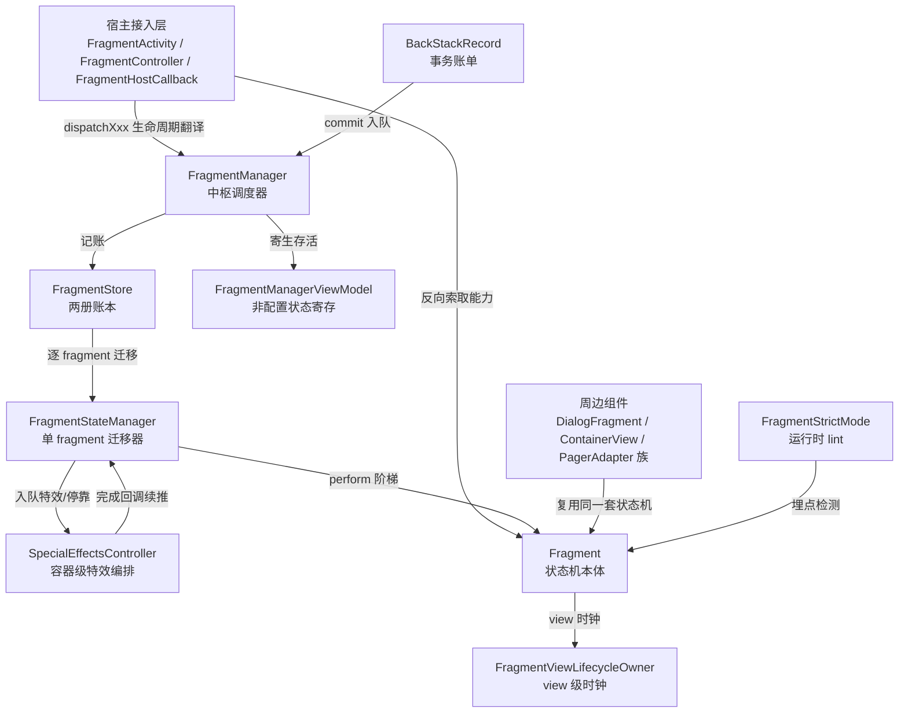
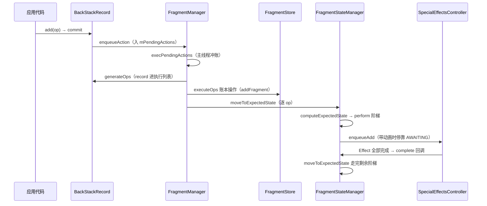

# Fragment (androidx.fragment) 架构解码

> 源码锚点：commit `f38a5e50e1199f9b8395d8c353c52a86f49aa60c`（main）｜ 生成：2026-09-06 ｜ 范围：androidx/fragment 全项目（10 个 Gradle 模块）
> 锚点规范：正文引用一律 `类名#方法名`（禁行号——随演进腐化），同名方法加文件名前缀。
> 文档有效性以锚点 commit 为准；上游演进后重跑本 skill 走增量更新。

## 1. 一图流

图例：实线为方法调用/账本写入方向（全部经源码验证）。本图回答"fragment 世界的分层与依赖方向"，不包含 lint 规则内容与 testing/compose 模块内部结构。核心枢纽是 FragmentManager：一切生命周期翻译、事务执行、状态收敛都汇于它。

## 2. 快速上手阅读路径

按此顺序读 `androidx/fragment/fragment/src/main/java/androidx/fragment/app/`（每步一个问题）：

1. `FragmentActivity.java` —— Activity 生命周期如何翻译成 fragment 状态？（看到 `init()` 三件套与 `onStart` 的 dispatch 序列即懂）
2. `FragmentHostCallback.kt` + `HostCallbacks` —— FragmentManager 反向要什么能力？（接口探测式协商）
3. `Fragment.java` 的状态常量块 + `performAttach` 处 perform 族总论 —— 状态机有几格、谁驱动？（九态 + perform 阶梯）
4. `BackStackRecord.java` 类头主链 ASCII —— 一行 commit 背后的完整管线（看到 enqueue→exec→executeOpsTogether 五步即懂）
5. `FragmentManager.java#execPendingActions` + `executeOpsTogether` —— 账本与状态迁移在哪里分离？
6. `FragmentStateManager.java#computeExpectedState` —— 目标态由哪些规则裁决？（八条压制/抬升规则）
7. `SpecialEffectsController.kt` 类头 —— 动画为什么停在不阻塞状态机？（停靠带 + 完成回调回环）
8. `FragmentStateManager.java#saveState` + `FragmentManager.java#restoreSaveStateInternal` —— 进程死亡后如何原样复活？（mWho 主键贯穿）
9. `strictmode/FragmentStrictMode.kt` —— 误用如何被运行时 lint 抓住？（探测/裁决/惩罚三层）
10. 沉淀文档 [Fragment.md](/home/liang/Project/MyProject/AndroidLibs/androidx/fragment/Fragment.md) 对照复习七个机制的微观细节。

## 3. 分层与模块地图

| 模块 | 一行职责 | 依赖谁 | 被谁依赖 |
|---|---|---|---|
| fragment（主库） | fragment 运行时全部机制（54 源文件） | androidx.activity / lifecycle / savedstate / core / viewpager / loader | 其余全部模块 |
| fragment-ktx | Kotlin 扩展函数层（5 文件：viewModels 委托、commit DSL、结果 API 转发） | fragment | compose / testing / truth / testing-manifest |
| fragment-compose | Compose 互操作（AndroidFragment 组合项、rememberFragmentState） | fragment-ktx + compose.ui/runtime | 应用层 |
| fragment-testing | FragmentScenario 测试宿主（launch/recreate/moveToState） | fragment-ktx + androidx.test | 测试代码 |
| fragment-truth | Fragment 的 Truth 断言（isAdded 等） | fragment-ktx + truth | 测试代码 |
| fragment-testing-manifest | testing 的 manifest 注入（EmptyFragmentActivity 声明） | fragment-ktx | fragment-testing |
| fragment-lint | lint 规则集（如废弃 `<fragment>` 标签检查） | 独立 | 构建期 |
| fragment-testing-lint / fragment-testing-manifest-lint | 对应模块的 lint 规则发布 | 独立 | 构建期 |
| integration-tests/testapp | 手工验证用 demo app | fragment | 无 |

⚠ 分层验证中的两个意外依赖（import 证实）：主库 `FragmentPagerAdapter.java` 与 `FragmentStatePagerAdapter.java` **api 级依赖 androidx.viewpager**（`import androidx.viewpager.widget.PagerAdapter`，FragmentPagerAdapter.java 类头）——deprecated 的 ViewPager1 适配器把 viewpager 锁进了 fragment 的 API 面；同理 `FragmentActivity.java` / `FragmentController.java` / `Fragment.java` 仍 import androidx.loader（LoaderManager 遗产）。这两条是"absent 式"隐藏耦合：看文档以为 fragment 是独立组件库，实际它的二进制兼容面背着两个历史包袱模块。

## 4. 主链路

典型场景：应用提交一个 `add(fragment).commit()` 事务直到 fragment 显示并完成动画。

分段职责与锚点（`类#方法`）：

1. **入队**：`BackStackRecord#commitInternal`（mCommitted 幂等检查、入栈则分配 mIndex）→ `FragmentManager#enqueueAction`（严检查 attach/state-loss，锁内入队）→ `FragmentManager#scheduleCommit`（首个待办才 post 主线程）。
2. **冲账**：`FragmentManager#execPendingActions`（循环清队列）→ `FragmentManager#removeRedundantOperationsAndExecute`（按"是否允许重排"分段）→ `FragmentManager#executeOpsTogether`（五步编排）。
3. **账本与状态分离**：`FragmentManager#executeOps` 只改 `FragmentStore` 两册账（addFragment/removeFragment 不触发回调）；随后 `FragmentStateManager#moveToExpectedState` 逐格驱动 `Fragment#performAttach..performDetach` 阶梯，应用回调只是迁移副产品。
4. **特效回环**：带动画时状态停在 AWAITING_* 停靠带（`FragmentStateManager#computeExpectedState` 压制），`SpecialEffectsController#executePendingOperations` 编排特效，`FragmentStateManagerOperation#complete` 完成回调把状态推到终点。
5. **pop 反向**：`FragmentManager#popBackStackImmediate`（主导航子 manager 层层下探）→ `BackStackRecord#executePopOps`（倒序逆操作）。

## 5. 模块卡片

### fragment（主库）

**职责**：fragment 组件与宿主、状态机、事务、动画、状态存储、诊断的完整运行时。
**对外接口**：宿主入口 `FragmentActivity#getSupportFragmentManager` / `FragmentController`；应用入口 `Fragment#onAttach..onDetach` 回调族、`FragmentManager#beginTransaction`、`FragmentManager#setFragmentResultListener`；扩展点 `FragmentFactory`、`SpecialEffectsControllerFactory`、`FragmentStrictMode.Policy`。
**关键协作**：对上是 ComponentActivity（SavedStateRegistry/Lifecycle/OnBackPressedDispatcher/ActivityResultRegistry 四件套，`FragmentHostCallback` 接口探测解锁）；对下是 view 体系（LayoutInflater.Factory2、ViewTree 三件套）。
**设计动机**：androidx 不能改 framework Activity，只能在应用侧插一层翻译（`FragmentActivity#init` 的 SavedStateRegistry 钩子 + contextAvailable 监听预约 attach）；fragment 又要求可寄宿任意对象（`FragmentHostCallback` 抽象 + `FragmentController` 正向指令层分离）——这两条边界决定了全库形状。
**雷区**：①逻辑全在 `FragmentManager` 抽象类本体，`FragmentManagerImpl` 是空壳兼容层；②`FragmentController` 上大量 deprecated 空方法体（二进制兼容，清掉会 NoSuchMethodError）；③`onActivityCreated` 在宿主 onStart 才派发（`FragmentActivity#onStart` 的 mCreated 守卫），别按名字推断时机。

### fragment-ktx

**职责**：把主库 API 翻译成 Kotlin 习惯用法。
**对外接口**：`FragmentViewModelLazy.kt` 的 `viewModels()/activityViewModels()` 惰性委托；`FragmentManager.kt#commit/commitNow` DSL；`Fragment.kt` 的结果 API 四个扩展；`FragmentTransaction.kt#add/replace` reified 重载。
**关键协作**：纯转发——全部落地在主库的 `Fragment#getViewModelStore`、`FragmentManager#setFragmentResultListener` 等方法。
**设计动机**：[inferred] ktx 位于依赖链第二层（compose/testing/truth 都 api 依赖它），实际上承担了"Kotlin 次级 API 面"的角色，新 API 优先在这里给语法糖。
**雷区**：`viewModels()` 委托的 store 来自批次 4 链路（FragmentManagerViewModel 按 mWho 分配）——restore 后 mWho 连续才拿得到同一 ViewModel。

### fragment-compose

**职责**：Compose 与 fragment 互操作：`AndroidFragment` 组合项在 Compose 树里嵌 fragment。
**对外接口**：`AndroidFragment.kt#AndroidFragment`、`rememberFragmentState`、`Fragment.kt#content`（fragment 内容用 Compose 写）。
**设计动机**：[inferred] 迁移期产物——Compose 应用里复用存量 fragment，以及 fragment 内渐进引入 Compose UI。
**雷区**：`AndroidFragment` 的重建跟随 rememberFragmentState 的状态保存协议（FragmentState.kt），不是普通 remember。

### fragment-testing

**职责**：测试宿主：`FragmentScenario.kt#launch` 把 fragment 挂到空 Activity 上驱动到指定状态，支持 `recreate`/`moveToState`/`close`。
**关键协作**：借助主库 `FragmentHostCallback` 的"任意对象宿主"能力（批次 1 的非 Activity 宿主通道）+ fragment-testing-manifest 注入的 EmptyFragmentActivity。
**雷区**：scenario 里 fragment 的宿主不是你的 Activity——依赖 getActivity() 的代码在测试里语义不同。

### fragment-truth / lint 三件套 / testapp

**职责**：测试断言（FragmentSubject#isAdded 等）、静态检查（lint 规则）、手工 demo。lint 源码本轮未读（名单级），testapp 是演示用例。

## 6. 核心类深卡片

→ 见 [fragment-main-classes.md](./fragment-main-classes.md)（6 张深卡片 + 全类职责表）。

## 7. 全类职责表

→ 见 [fragment-main-classes.md](./fragment-main-classes.md)（主库 54 类全覆盖 + ktx/compose/testing/truth，家族行压缩 strictmode 违规族）。

## 8. 看着糟但其实没问题

1. **`FragmentManagerImpl` 空类**：全部逻辑上移进 FragmentManager 抽象类后，这个空壳仍被 `FragmentHostCallback` 的字段初始化引用（`FragmentHostCallback.kt` 的 fragmentManager 属性）——删除会破坏源码兼容，保留成本为零。
2. **`FragmentController` 的大量空方法体**：`doLoaderStop()` 等退役方法不清空方法体而保留——它们是 api 面，老宿主二进制升级后不能 NoSuchMethodError；`getSupportLoaderManager()` 则直接抛异常（行为必须变化的场景用"运行必炸"表达）。
3. **`Fragment.java` 3773 行巨类**：状态常量、恢复桶、perform 族、动画配置全在一个类。拆出去会把状态转移链打散——perform 族的"每格三件事"完整性靠同居保证；动画配置（AnimationInfo）已惰性容器化隔离。
4. **mState 用 int 而非 enum**：`Fragment#isResumed` 等 9 处用序数比较（`mState >= RESUMED`），AWAITING_* 中间态需要"介于哪两格之间"的大小语义，enum 做不到跨格比较。
5. **SpecialEffectsController 挂 view tag**（`SpecialEffectsController.kt` companion 的 getOrCreateController）：per-容器单例的最简实现——控制器生命周期天然等于容器生命周期，无需注册表。

## 9. 相邻产物

- [Fragment.md](/home/liang/Project/MyProject/AndroidLibs/androidx/fragment/Fragment.md)（source-annotator 沉淀，源码仓根）：七个机制的**教学级详解**（宿主接入/状态机/事务管线/状态存储/动画转场/周边组件/StrictMode，含使用示例与易错点）。**何时读它**：想学会某个机制的用法与微观细节；**何时读本文档**：想建立全库地图、看模块边界与类职责分工。两套产物刻意互不复制。

## 10. 开放问题

1. `[inferred]` 汇总（考据不到动机，推断已写入正文对应处）：`DefaultSpecialEffectsController#syncAnimations` 批内动画统一的动机；`Fragment#setTargetFragment` 防环的具体事故背景；`FragmentViewLifecycleOwner#getDefaultViewModelProviderFactory` 分流意图；`FragmentActivity#onResumeFragments` 延后 dispatchResume 的动机；`FragmentActivity#markFragmentsCreated` do-while 收敛的具体场景。
2. git 历史不可考（检出仓浅历史，commit message 同质"add"），全部设计动机只能走代码结构与注释考据——AOSP 上游真实演化（如 AWAITING 状态引入的 issue 号）未溯源。
3. 本轮未深挖：fragment-lint 三个模块的规则实现；FragmentScenario 的 Instantiator 细节；预测性返回 seek 协议在 DefaultSpecialEffectsController.TransitionEffect 内部的完整实现（批次 5 只标注到门面）；integration-tests/testapp。
