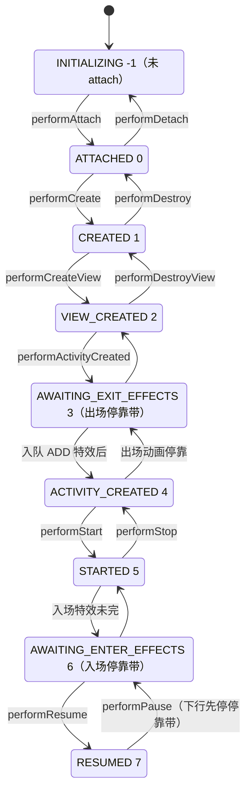

# fragment 主库类级解码（ARCHITECTURE.md §6/§7 详情）

> 同锚点：commit `f38a5e50` ｜ 本文件是 ARCHITECTURE.md 的拆分详情，锚点规范同主文档。

## A. 核心状态机图

本图回答"fragment 九态机怎么走、AWAITING 停靠带在梯子的哪两格"；转移标签是 FragmentStateManager#moveToExpectedState 调用的 perform 方法（进出场特效的停靠裁决见 FragmentStateManager#computeExpectedState）。数值连号是有意的——`Fragment#isResumed` 等用 `mState >= RESUMED` 序数比较。

## B. 核心类深卡片

### Fragment（fragment 模块）

**职责**：自带生命周期时钟的可拆卸 UI 单元——应用回调载体 + 三 Owner（Lifecycle/ViewModelStore/SavedStateRegistry）+ 状态机本体。
**协作者**：被 `FragmentStateManager#moveToExpectedState` 驱动 perform 阶梯（Fragment#performAttach..performDetach）；view 级时钟委托 `FragmentViewLifecycleOwner`（Fragment#performCreateView 内创建并挂 ViewTree 三件套）；ViewModelStore 实际存放于 `FragmentManagerViewModel#getViewModelStore`。
**设计动机**：宿主寿命长于 view 寿命的矛盾 → 双时钟分离（fragment 级 mLifecycleRegistry 与 view 级 owner，`Fragment#performCreateView` 处【设计思想】注释）；依赖 mWho（可能未恢复）与宿主能力的 API 到得太早 → OnPreAttached 队列存任务而非拒绝（`Fragment#registerOnPreAttachedListener`）。
**不变量**：①九态严格逐格迁移，外部只读；②equals/hashCode final（`Fragment#equals`）——manager 按"对象身份 + mWho"记账；③恢复桶（mSavedFragmentState 等）用毕即清（`Fragment#restoreViewState` 终点置 null）；④上行回调前拨状态、下行 pause/stop 回调后拨（`Fragment#performAttach` 处总论）。

### FragmentManager（fragment 模块）

**职责**：中枢调度器——事务管线、back stack、状态收敛、Fragment 结果 API、生命周期分发五大职责（类头总论）。
**协作者**：`BackStackRecord`（实现其内部接口 OpGenerator 提交账单）；`FragmentStore#moveToExpectedState`（批量迁移）；`FragmentManagerViewModel#getInstance`（attachController 时寄生于宿主 ViewModelStore）；`FragmentHostCallback`（attachController 逐一 instanceof 探测解锁自动行为——SavedStateRegistry 注册、OnBackPressedCallback 门控、ActivityResultRegistry 注册）。
**设计动机**：commit 不能同步等执行（回调重入、保存窗口）→ 入队-冲账解耦（`FragmentManager#enqueueAction` 双层检查 + `#scheduleCommit` 单次调度）；执行期随时可能再入队 → mExecutingActions 防重入 + while 循环清队（`FragmentManager#execPendingActions`）。
**不变量**：①执行必须主线程且未重入（`FragmentManager#ensureExecReady`）；②保存窗口内 commit 严路径必抛（`FragmentManager#checkStateLoss`）；③返回键回调 enable = 栈非空且父链主导航成立（`FragmentManager#updateOnBackPressedCallbackEnabled`）。

### BackStackRecord（fragment 模块）

**职责**：事务唯一实现——FragmentTransaction 账单 + BackStackEntry 身份 + OpGenerator 执行器三角色（类头 ASCII 总论）。
**协作者**：被 `FragmentManager#generateOpsForPendingActions` 调 generateOps；执行走 `BackStackRecord#executeOps`/`executePopOps`（账本操作分发到 manager 的 addFragment 六兄弟）；`BackStackRecord#expandOps` 展开 meta-op 支撑批量追踪。
**设计动机**：OP_REPLACE 是复合指令，批量执行需逐 op 追踪 mAdded 与主导航 → 执行前展开、持久化前折叠（mFromExpandedOp 标记，`BackStackRecord#collapseOps`）——元操作双形态。
**不变量**：①commit 一次（`BackStackRecord#commitInternal` 首行 mCommitted 检查）；②同步 commitNow 禁止入栈（`BackStackRecord#commitNow` 先 disallowAddToBackStack）；③pop 逆放 = 倒序 + 每类 op 换逆操作 + SET_MAX_LIFECYCLE 回拨 mOldMaxState。

### FragmentStateManager（fragment 模块）

**职责**：单 fragment 状态机驱动器——迁移器（computeExpectedState + moveToExpectedState 驱动 perform 阶梯）、保存器（saveState 组装七 key 恢复包）、重建器（三构造器对应新实例/恢复重建/retained 复用）。
**协作者**：`Fragment#performXxx` 阶梯（每格三件事：子 manager 转发、双时钟、应用回调）；`SpecialEffectsController`（动画停靠带裁决与完成回环 `FragmentStateManagerOperation#complete`）；`FragmentStore#setSavedState`（恢复包存取）。
**设计动机**：状态上限受多源约束 → computeExpectedState 从 manager 时钟出发被八条规则压制/抬升（`FragmentStateManager#computeExpectedState` 注释清单：mMaxState、mFromLayout 窗口、动态容器、未 add、动画停靠、mRemoving、mDeferStart、mTransitioning）；动画是慢副作用 → 状态先到停靠带，完成回调续推。
**不变量**：①mMovingToState 防重入；②恢复桶 RESUMED 达成即清（`FragmentStateManager#resume` 末尾）；③保存前强制收敛（`FragmentManager#saveAllStateInternal` 先 execPendingActions + endAnimatingAwayFragments）。

### FragmentStore（fragment 模块）

**职责**：账本两册——mAdded（UI 内有序列表，次序即容器叠放与事件分发次序）+ mActive（mWho → FragmentStateManager）——外加 mSavedState 待恢复包册（类头总论）。
**协作者**：被 `FragmentManager#executeOps` 的账本操作写（addFragment/removeFragment）；`FragmentStore#moveToExpectedState` 先 added 后 active 两段式驱动迁移；`FragmentStore#burpActive` 收尾清理置 null 的失活项。
**设计动机**：遍历中失活不能边遍历边删 → makeInactive 置 null 延迟到 burpActive（`FragmentStore#makeInactive` 注释）；查找要"UI 优先"→ added 册倒序先查（`FragmentStore#findFragmentById`）。
**不变量**：mAdded 次序 = UI 次序（`FragmentStore#findFragmentIndexInContainer` 依赖 indexOf 定位插入点）。

### SpecialEffectsController（fragment 模块）

**职责**：容器级特效编排器——每 ViewGroup 一个（挂 view tag），收集/合并/执行 Animation、Animator、Transition 特效，完成回调驱动状态机续推（类头【设计思想】）。
**协作者**：`FragmentStateManager` 入队（enqueueAdd/Remove/Show/Hide，重复入队 mergeWith 合并）；子类 `DefaultSpecialEffectsController#collectEffects` 收集特效（Transition > Animator > Animation 互斥）；`FragmentStateManagerOperation#complete` 回环接缝。
**设计动机**：生命周期必须先走、特效必须押后 → 状态停 AWAITING 停靠带 + 双列表（pending/running）收编上一批（`SpecialEffectsController#executePendingOperations`）；预测性返回手势要倒放 → seekable 通道（API 34+，TransitionEffect#onProgress 驱动）。
**不变量**：①容器未挂窗口直接强制完成（`SpecialEffectsController#executePendingOperations` 前置检查）；②postpone 中不执行任何操作；③一批特效整体 collect、整体 commit。

## C. 全类职责表

主库（androidx/fragment/fragment，54 类，全部源码读过）：`类 | 一行职责 | 关键协作`。

| 类 | 一行职责 | 关键协作 |
|---|---|---|
| FragmentActivity | 宿主时钟翻译层：生命周期回调成对翻译成 dispatchXxx + 独立 registry 拨动，attach 在 super.onCreate 内完成（EX: FragmentActivity#init） | FragmentController（出口）、HostCallbacks（反向能力桥） |
| FragmentController | 宿主→FragmentManager 的无状态指令转发层，全部方法一行委托（EX: FragmentController#attachHost） | FragmentHostCallback（配对） |
| FragmentHostCallback | 宿主反向 SPI：manager 索取 LayoutInflater/view 查找/启动 Activity 等能力，可选接口探测式解锁（EX: FragmentHostCallback 字段 fragmentManager） | FragmentManagerImpl（随宿主创建） |
| FragmentContainer | 容器最小契约：view 查找与有无判断（EX: FragmentContainer#onFindViewById） | FragmentHostCallback 继承它 |
| FragmentManagerImpl | 遗产空壳：逻辑已并入 FragmentManager，保留兼容 new 调用点（EX: FragmentHostCallback 初始化处） | FragmentManager |
| FragmentManager | 中枢调度器：事务管线/back stack/状态收敛/结果 API/生命周期分发（EX: FragmentManager#execPendingActions） | FragmentStore、BackStackRecord、FragmentStateManager |
| Fragment | 状态机本体 + 三 Owner + 应用回调载体（EX: Fragment#performAttach 处 perform 族总论） | FragmentViewLifecycleOwner、FragmentManagerViewModel |
| FragmentViewLifecycleOwner | view 级时钟 owner：每次 onCreateView 重建，ViewTree 三件套指向它，ViewModelStore 与 fragment 共享（EX: FragmentViewLifecycleOwner#initialize） | Fragment（performCreateView 构造） |
| FragmentStateManager | 单 fragment 迁移器+保存器+重建器（EX: FragmentStateManager#moveToExpectedState） | Fragment（perform 阶梯）、SpecialEffectsController |
| FragmentStore | 两册账（mAdded 有序/mActive 按谁）+待恢复包册（EX: FragmentStore#moveToExpectedState） | FragmentStateManager（值对象） |
| FragmentManagerViewModel | 非配置状态中央账本：留存名单/子 manager/ViewModelStore 三册，自身寄生于宿主 ViewModelStore（EX: FragmentManagerViewModel#getInstance） | FragmentManager（attachController 挂靠） |
| FragmentFactory | 反射实例化扩展点 + 进程级 Class 缓存（EX: FragmentFactory#instantiate） | FragmentState#instantiate |
| FragmentState | 单 fragment 库级可序列化快照：身份/布局/导航属性三组（EX: FragmentState#instantiate） | FragmentStateManager 恢复构造器 |
| FragmentManagerState | 整机保存包：active/added 名单 + back stack + 主导航 + 结果与启动信息（EX: FragmentManagerState#writeToParcel） | FragmentManager#saveAllStateInternal |
| BackStackRecord | 事务唯一实现：账单+BackStackEntry+OpGenerator 三角色（EX: BackStackRecord#executeOps） | FragmentManager（管线） |
| BackStackRecordState | back stack 单条记录的可序列化形态：flat int 数组 + mWho 引用（EX: BackStackRecordState#instantiate） | FragmentManager 恢复链路 |
| BackStackState | saveBackStack 的载体：mWho 名单 + 记录状态列表（EX: BackStackState#instantiate） | FragmentManager#saveBackStackState |
| FragmentTransaction | 事务契约层：Op 列表 + 全局配置的 builder，三种提交语义（EX: FragmentTransaction#setMaxLifecycle） | BackStackRecord（实现） |
| SpecialEffectsController | 容器级特效编排抽象：入队合并/双列表/收编/完成回环（EX: SpecialEffectsController#executePendingOperations） | FragmentStateManagerOperation |
| DefaultSpecialEffectsController | 特效翻译实现：Transition>Animator>Animation 优先级、共享元素映射、seek 通道（EX: DefaultSpecialEffectsController#collectEffects） | FragmentTransitionImpl（双实现门面） |
| SpecialEffectsControllerFactory | 特效控制器工厂扩展点：按容器创建（EX: SpecialEffectsControllerFactory#createController） | FragmentManager 持有默认实现 |
| FragmentTransition | Transition 双实现探测：PLATFORM_IMPL（API21+）/SUPPORT_IMPL（反射探测 androidx.transition）（EX: FragmentTransition.Companion 字段 PLATFORM_IMPL） | FragmentTransitionImpl |
| FragmentTransitionImpl | Transition 统一门面：framework/androidx 两套 API 抽象成同一组操作（EX: FragmentTransitionImpl#canHandle） | FragmentTransitionCompat21 / androidx.transition 实现 |
| FragmentTransitionCompat21 | framework Transition 门面实现：canHandle 认 instanceof，方法直译平台 API（EX: FragmentTransitionCompat21#canHandle） | android.transition |
| FragmentAnim | 传统 Animation/Animator 加载器：回调优先→资源，按目录名选加载器（EX: FragmentAnim#loadAnimation） | Fragment#onCreateAnimation 回调 |
| FragmentLayoutInflaterFactory | `<fragment>` 标签解析器（Factory2）：复用恢复实例、解析中途推状态特例（EX: FragmentLayoutInflaterFactory#onCreateView） | FragmentContainerView 构造 |
| FragmentContainerView | fragment 专用容器：只收 fragment view、出场先画、insets 手动分发（EX: FragmentContainerView#addView） | FragmentLayoutInflaterFactory 构造入口 |
| DialogFragment | Dialog 自治行为与 fragment 状态机的双向收编（EX: DialogFragment#dismissInternal） | Fragment 双时钟、事务（show/dismiss） |
| ListFragment | legacy 列表页脚手架：进度/空视图/列表三件套自动切换（EX: ListFragment#setEmptyText） | 无（自足） |
| FragmentPagerAdapter（已废弃） | ViewPager1 适配器：离屏 detach 保实例，tag 记账复用，setMaxLifecycle 治理可见性（EX: FragmentPagerAdapter#instantiateItem） | androidx.viewpager PagerAdapter |
| FragmentStatePagerAdapter（已废弃） | ViewPager1 适配器：离屏 remove 销毁 + SavedState 兜底（EX: FragmentStatePagerAdapter#destroyItem） | Fragment.SavedState |
| FragmentTabHost（已废弃） | legacy tab 宿主：TabInfo 名单 + 切换 detach/attach（EX: FragmentTabHost#onTabChanged） | FragmentManager |
| FragmentOnAttachListener | attach 完成回调契约：依赖注入时机早于 onCreate（EX: FragmentManager#dispatchOnAttachFragment） | FragmentManager#attachController 注册链 |
| FragmentResultListener | 结果回调契约：按 requestKey 收结果（EX: FragmentManager#setFragmentResultListener） | FragmentManager 结果册 |
| FragmentResultOwner | 通信契约接口：发结果/按生命周期收结果（EX: FragmentManager#setFragmentResult） | Fragment 实现、ktx 扩展转发 |
| FragmentLifecycleCallbacksDispatcher | 生命周期观察者分发器：register/unregister + 各 perform 点转发（EX: FragmentLifecycleCallbacksDispatcher#registerFragmentLifecycleCallbacks） | FragmentLifecycleCallbacks（观察者） |
| LogWriter | dump 输出桥：PrintWriter 流按行转 logcat（EX: LogWriter#flushBuilder） | BackStackRecord#dump |
| SuperNotCalledException | mCalled 检查失败专用运行时异常（EX: Fragment#performCreate 抛出点） | Fragment mCalled 旗标 |
| PredictiveBackControl | enablePredictiveBack 的 OptIn 注解（EX: PredictiveBackControl 注解声明） | FragmentManager#enablePredictiveBack |
| FragmentManagerNonConfig（已废弃） | ViewModel 时代前的留存状态快照容器（EX: FragmentManagerViewModel#getSnapshot） | FragmentController 老链路 |
| FragmentStrictMode | 运行时 lint：探测/裁决/惩罚三层（EX: FragmentStrictMode#onFragmentReuse） | 主库各埋点、Policy |
| Violation | 违规根类：RuntimeException + 违规 fragment 引用（EX: Violation 构造） | 11 个子类 |
| strictmode 12 个 Violation 子类（FragmentReuseViolation、FragmentTagUsageViolation、WrongNestedHierarchyViolation、GetRetainInstanceUsageViolation、SetRetainInstanceUsageViolation、RetainInstanceUsageViolation、GetTargetFragmentUsageViolation、SetTargetFragmentUsageViolation、GetTargetFragmentRequestCodeUsageViolation、TargetFragmentUsageViolation、SetUserVisibleHintViolation、WrongFragmentContainerViolation） | 家族行：数据类形态的违规载体，一一对应 Policy.Builder 的 detectXxx 探测项，无附加行为 | Violation 根类 + 各埋点调用处 |

ktx / compose / testing / truth（扫描级，函数清单已核对）：

| 类/文件 | 一行职责 | 关键协作 |
|---|---|---|
| ktx FragmentViewModelLazy.kt | viewModels/activityViewModels 惰性 ViewModel 委托（EX: FragmentViewModelLazy.kt#viewModels） | Fragment#getViewModelStore |
| ktx FragmentManager.kt | commit/commitNow/transaction DSL（EX: FragmentManager.kt#commit） | FragmentTransaction |
| ktx Fragment.kt | 结果 API 四个扩展转发（EX: Fragment.kt#setFragmentResult） | FragmentResultOwner |
| ktx FragmentTransaction.kt | add/replace 的 reified Class 重载（EX: FragmentTransaction.kt#add） | FragmentFactory |
| ktx View.kt | View.findFragment()（EX: View.kt#findFragment） | FragmentManager#findFragment |
| compose AndroidFragment.kt | Compose 树内嵌 fragment 的组合项（EX: AndroidFragment#AndroidFragment） | FragmentManager 事务 |
| compose FragmentState.kt | rememberFragmentState：组合内 fragment 状态保持（EX: FragmentState.kt#rememberFragmentState） | SavedState 协议 |
| compose Fragment.kt | Fragment.content：fragment 内容改用 Compose 写（EX: Fragment.kt#content） | ComposeView |
| testing FragmentScenario | 测试宿主：launch/recreate/moveToState/close（EX: FragmentScenario#launch） | FragmentHostCallback 非 Activity 宿主通道 |
| truth FragmentSubject | Fragment 的 Truth 断言（isAdded/isNotAdded）（EX: FragmentSubject#isAdded） | truth 库 |

覆盖算式：主库表 43 行覆盖 54 类（42 逐类行 + 1 家族行覆盖 12 个 Violation 子类；33 Java + 7 应用 Kotlin + 14 strictmode Kotlin，全部读过源码）。内部类不入表（见跳过清单）。

**跳过清单**：① FragmentManager 内部类（OpGenerator、LifecycleAwareResultListener、PopBackStackState 等 10 个）——私有实现细节，随宿主类理解；② Fragment 内部类（SavedState Parcelable、AnimationInfo、OnPreAttachedListener、InstantiationException）——在深卡片/正文已覆盖；③ fragment-lint / fragment-testing-lint / fragment-testing-manifest-lint 三个模块的 lint 规则源码——独立 DSL，与运行时架构正交（名单级，构建文件确认依赖方向）；④ integration-tests/testapp——手工演示 app。

**覆盖率实数**：主库顶层 54/54 类全部实证入表（100%，其中深读标注 36、扫描级 18）；ktx 5/5、compose 3/3、testing 1/1 扫描级；truth 1/1 扫描级；lint×3 + testapp = 跳过（名单级）。换名测试抽查 3 条通过（FragmentStore/BackStackRecord/SpecialEffectsController 的职责行只对各自成立）。
