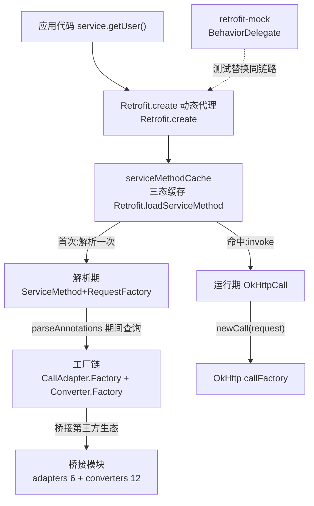

# Retrofit 架构解码

> 源码锚点：AndroidLibs 仓库 commit `d66a696`（main）｜ 生成：2026-09-06 ｜ 范围：全项目
> （retrofit 核心 + adapters 6 + converters 12 + mock + bom + response-type-keeper，主源码 ≈129 类/150 文件）
> 注：工作区注释经学习标注改造（仅注释行，骨架与 HEAD 逐字节一致）；锚点为 类名#方法名（2026-09-06 迁移，行号已去除）。
> 深度机制讲解见姊妹文档 `AndroidLibs/retrofit/Retrofit.md`（source-annotator 沉淀），本文只做架构与职责地图。

## 1. 一图流

本图回答"Retrofit 由哪几层组成、一次请求穿过谁"；不包含构建期模块（bom/keeper）与测试源集。

图例：实线 = 主链调用；虚线 = 同接口替换（absent 耦合见 §6）；核心节点 = 加粗概念。

## 2. 快速上手阅读路径

1. `Retrofit.create()` —— 请求从哪进来？（看到动态代理三分流：Object 方法/default 方法/loadServiceMethod 即懂入口）
2. `ServiceMethod.parseAnnotations` → `HttpServiceMethod.parseAnnotations` —— 方法如何变成可复用对象？（看到 CallAdapter+Converter 在解析期一次选定即懂）
3. `RequestFactory.parseAnnotations` —— 注解怎么变成请求模板？（看到 Builder.build 三阶段 + parseParameterAnnotation 大分发即懂）
4. `OkHttpCall.parseResponse()` —— 响应怎么变成 T？（看到非 2xx 缓冲为 errorBody、2xx 交 Converter 即懂）
5. `DefaultCallAdapterFactory.get` —— 回调怎么切回主线程？（看到 ExecutorCallbackCall 装饰器即懂线程模型）
6. 任选 `retrofit-converters/gson/GsonConverterFactory.java` —— 扩展点怎么接？（实现 Factory 两个方法 + Builder 注册即懂插件体系）
7. 测试即规范：`retrofit/java-test/src/test/.../RequestFactoryTest.java`（3421 行）—— 注解组合的全部合法/非法契约都在测试名里。

## 3. 分层与模块地图

| 模块 | 一行职责 | 依赖谁 | 被谁依赖 |
|---|---|---|---|
| retrofit（核心） | 注解→HTTP 的动态代理引擎 | OkHttp、kotlin-stdlib（软依赖） | 全部桥接模块 |
| retrofit-adapters/rxjava1-3 | Call→RxJava1/2/3 五类响应式类型 | core + 各 Rx 版本 | 应用按需注册 |
| retrofit-adapters/guava,java8,scala | Call→ListenableFuture/CompletableFuture/ScalaFuture | core + 各生态 | 应用按需注册（java8 已弃用） |
| retrofit-converters/*（12 个） | 业务类型↔HTTP 字节的序列化桥 | core + 各序列化库 | 应用按需注册 |
| retrofit-mock | 代理层替换成行为可控的假请求 | core（复用其 CallAdapter 体系） | 测试 |
| retrofit-response-type-keeper | R8 keep 规则生成器（防泛型实参被裁剪成通配符） | 构建期 R8，运行期零依赖 | 应用构建脚本 |
| retrofit-bom | 版本对齐清单（无代码） | — | 应用依赖管理 |

分层验证（§2.2 Reflexion 三档）：核心→桥接单向依赖 **一致**（全部 adapter/converter 只 import retrofit2 公共面，无一反向）；应用→core 只有 Builder/create 两个入口 **一致**。意外点见 §6。

## 4. 主链路（一次 enqueue 的完整旅程）

`Retrofit.create` → `loadServiceMethod`（首调触发解析）→ `ServiceMethod.parseAnnotations` → `RequestFactory.parseAnnotations`（注解→ParameterHandler[]）+ `HttpServiceMethod.parseAnnotations`（选定 CallAdapter/Converter，产出三个子类之一）→ 缓存进 ConcurrentHashMap → 每次 invoke `HttpServiceMethod` → `new OkHttpCall` → `adapt(rxjava3)` 或直接返回 → `OkHttpCall.enqueue`（锁内置 rawCall，锁外发网络）→ `RequestFactory.create`（handlers.apply → `RequestBuilder` 两态累积 → `get()`）→ OkHttp → `parseResponse`（非 2xx 缓冲 errorBody / 2xx 交 Converter）→ callback（经 ExecutorCallbackCall 切线程）。

线程分界：解析期在首调线程一次性完成；网络在 OkHttp 线程池；回调默认经 callbackExecutor（Android 主线程）——切线程在 DefaultCallAdapterFactory 的装饰器层，不在 OkHttpCall 内。

## 5. 模块卡片

**retrofit（核心）**——职责：把接口注解声明编译成可复用的请求装配线。对外接口仅三样：`Retrofit.Builder` 链式配置、`create(Class)` 生成代理、两个扩展点接口（CallAdapter.Factory/Converter.Factory）。设计动机：解析一次终身复用 + 不可变装配免加锁（`loadServiceMethod` 三态缓存）。雷区：同一个方法签名在不同 Retrofit 实例间不共享缓存；`validateEagerly` 提前暴露注解错误但拖慢 create。

**retrofit-adapters/\***——职责：把 Call 适配成各异步生态的类型。六模块结构同构（Factory 剥泛型定形态 → adapt 包装），rxjava3 为最完整样本（详见 `Retrofit.md` §9）。雷区：裸泛型在 get() 抛错；Body/Response/Result 三形态错误语义不同。

**retrofit-converters/\***——职责：序列化生态接入。通吃型（gson/moshi/jackson/kotlinx）绝不返回 null 必须排链尾，专精型（protobuf/wire/scalars）精确匹配可排链前。雷区：顺序错误 = 专用类型被 JSON 工厂截胡。

**retrofit-mock**——职责：测试态替身。`BehaviorDelegate` 对服务接口再织一层代理，劫持后把 mock Call 交给真 CallAdapter——mock 数据享受与线上一致的返回形态适配；`NetworkBehavior` 叠加延迟/失败率噪声。雷区：delegate 创建于 MockRetrofit 而非 Retrofit.create，别混用两套代理。

**retrofit-response-type-keeper**——职责：构建期 Kotlin 处理器，扫描服务方法泛型实参生成 R8 keep 规则；动机考据（README 原文）：`Call<User>` 若 User 在别处无引用，R8 会把返回类型裁成 `Call<?>`，触发 Retrofit 运行期校验失败。

## 6. 矛盾与意外（含 absent 隐藏耦合）

1. **absent：core 反向感知桥接模块**——HttpServiceMethod/HttpServiceMethod 的 suspend 分支直接 import `kotlin.coroutines.Continuation` 与 `KotlinExtensions`（`HttpServiceMethod 源文件 import 区` import 区），即"协程不是插件而是内核公民"。这与"CallAdapter 才是扩展点"的直觉相悖：新增一种调用形态（如未来虚拟线程）可能要走内核而非 adapter。⚠ 上图未画边（内核内部依赖，非模块间）。
2. **absent：retrofit-mock 不 mock 网络，mock Call**——它复用真实 CallAdapter/解析链，只替换 Call 实现；意味着 converter/adapter 的 bug 会原样出现在 mock 测试中（是特性也是盲区）。
3. **README/流行说法矛盾**：广泛流传的"Retrofit 是网络请求库"——代码事实：Retrofit 自己不发一个包，传输 100% 委托 okhttp3.Call.Factory（`Retrofit.build` 默认 new OkHttpClient()）；它本质是"声明式 HTTP 接口的编译器"。
4. **java-test 独立源集**：核心测试不在 retrofit/src/test 而在 `retrofit/java-test`（17 文件 + 大体量 test 源码），因为测试需要 Java 8+ 语法而主源码保持 Android 兼容——测试代码与主代码的编译目标不同。

## 7. 看着糟但其实没问题

- `RequestFactory.parseParameterAnnotation` 500+ 行大分发（if-else 25 分支）：看似应拆策略表，但每分支的类型校验/错误消息强耦合注解语义，拆散后错误定位与交叉校验（gotField/gotBody 等状态位）反而碎片化；且解析期只跑一次，性能无关。判定合理。
- `Utils.java` 自实现 ParameterizedTypeImpl 等三件套（~200 行"重复造轮子"）：JDK 无公开构造且各 JDK 实现的 equals 不可靠，resolve 结果要进集合/做缓存键，自实现是硬约束不是洁癖。
- 三个布尔位（isFlowable/isSingle/isMaybe/isCompletable 共 4 个）代替枚举：字段 final、构造期确定、只读不互转，枚举的收益（穷尽检查）在这里没有 switch 消费点，引入反而多一层映射。
- 空模块 retrofit-bom：只有 gradle 文件，BOM 本职就是"无代码的版本契约"。

## 8. 开放问题

- `[inferred]` response-type-keeper 的 keep 规则精确生效机制（-if 条件形态）未读其 Kotlin 源码，仅据 README。
- `[inferred]` "新增调用形态倾向走内核而非 adapter"（§6.1）是从 suspend 先例推的演进判断，非官方声明。
- 本轮未深挖：samples 13 例的逐个意图、jaxb/jaxb3 差异细节、core-uwb 等 androidx 无关（不在本范围）。
- 上游 git 演化史不可考（工作区 commit 全为 "add"，无上游历史），所有"为什么"只能到代码结构与测试名为止，均已在 `Retrofit.md` 分档标注。

## 9. 索引（详情文件）

- `core.md`：核心模块卡片、核心类深卡片、全类职责表（45 类全覆盖）。
- `bridges.md`：adapters/converters/mock 全类职责表（84 类，四件套家族行）。
