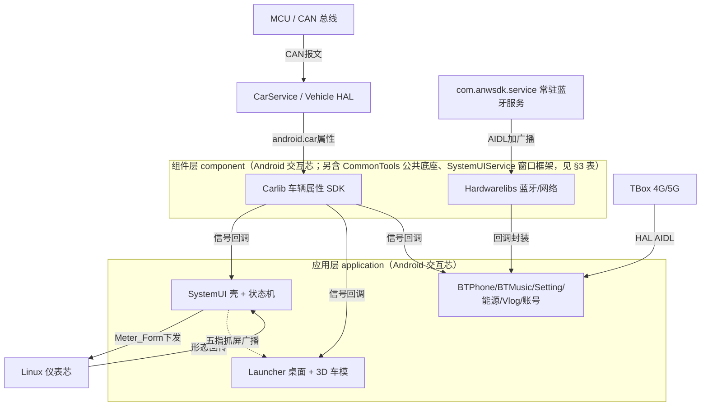
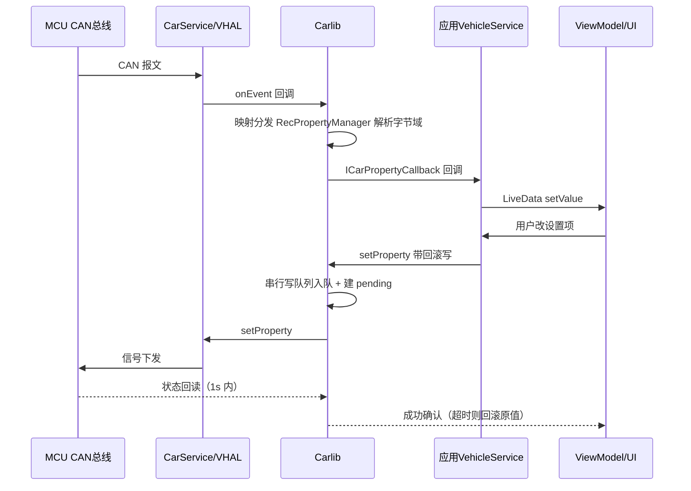

# yadea_master 架构解码

> 源码锚点：commit `d653d105f86b946685f3ff5133a3079d718d7882`（main）｜ 生成：2026-09-06 ｜ 范围：全项目（**分批解码中，本文档 = 全局地图 + Carlib 深解码**）
> 文档有效性以锚点 commit 为准；上游演进后重跑本 skill 走增量更新。

**项目一句话**：雅迪电动车的整车智能座舱 Android 应用层——运行在定制 ROM（东软 Neusoft 车机平台）上的 7 个 privileged 系统预装应用 + 7 个组件库，与 Linux 仪表芯组成双芯架构。约 875 个 Java + 385 个 Kotlin 源文件。

**模块详情文件索引**（本文档只放地图与主链，何时读哪个见各节指针）：

| 文件 | 内容 | 何时读 |
|---|---|---|
| [Carlib.md](Carlib.md) | 车辆属性 SDK 深解码（全项目数据枢纽，模块卡片 + 6 张核心类深卡片 + 全类职责表） | 改任何车辆信号相关代码之前 |
| [SystemUI.md](SystemUI.md) | 壳应用：Actor 窗口、PageStateMachine 状态机、L2A 网关、通知管线、锁屏与丢失模式（已产，类覆盖率 83.5%） | 改仪表形态/状态连携/通知/锁屏之前 |
| [Launcher.md](Launcher.md) | 桌面：3D 车模渲染仲裁、信号命令表、整车通信、手车互联、应用列表（已产，类覆盖率 83%） | 改桌面/车模/应用列表之前 |
| [BTPhone.md](BTPhone.md) | 蓝牙通话：Telecom/HFP 链路、PBAP 同步、16 态浮窗状态机、双屏悬浮窗（已产，类覆盖率 77%） | 改蓝牙通话/联系人同步/浮窗之前 |
| [BTMusic.md](BTMusic.md) | 蓝牙音乐：AVRCP 经 MediaSession 镜像、进度外推、音源仲裁（已产，类覆盖率 96%） | 改蓝牙媒体/音源/通知之前 |
| [Setting-AccountCenter.md](Setting-AccountCenter.md) | 车设中心 11 页与账户中心：信号网关、多用户隔离、扫码登录与 token 体系（已产，类覆盖率 91%/82%） | 改设置页/多用户/登录之前 |
| [Energy-Vlog.md](Energy-Vlog.md) | 能量中心（39 监听器总线/巨石页）与 Vlog 相机遥控 + Weather/DebugTools 停用件影响面（已产，类覆盖率 100%/100%） | 改充电里程/相机/复活停用件之前 |
| [Components-组件库.md](Components-组件库.md) | 六大组件库：CommonTools/Hardwarelibs/SystemUIService/Applib/AdaptApi/CarSettingLib（已产，含 AdaptApi 孤岛硬数据验证） | 改组件库/换肤/蓝牙栈之前 |
| [Build-工程化.md](Build-工程化.md) | 构建体系：配置生效面清点表、签名与白名单、出包链、质量工具链断线点、工程实践画像（已产） | 出包/加模块/接 CI/动配置之前 |
| [Cross-cutting-横向专题.md](Cross-cutting-横向专题.md) | 横向深挖：构建实测闭环、**AOSP testkey 实锤**、母题 git 考据、IPC 通道全景、地层残留、全项目问题总表 P0-P2（已产） | 做安全评估/排期整改/找"同款坑"之前 |

---

## 1. 一图流

本图回答：**车辆数据如何流进 Android 侧各应用、双芯之间如何连携**。不包含：构建体系、蓝牙协议细节（见索引文件）。



图例：矩形 = 进程/模块；实线 = 数据/调用流（箭头词即动作）；虚线 = 广播；外部节点（MCU/Linux/Anw/TBox/CarSvc）源码不在本仓库或为系统框架。形状颜色未做语义着色（黑白打印安全）。

**读图三要点**：
1. Carlib 是全项目数据枢纽——所有车辆信号进应用都经它（依赖关系见 §3 表）。
2. 双芯连携是"下发 + 回传"闭环：SystemUI 发 `Meter_Form`，Linux 执行后回传实际形态，SystemUI 用回传值校准状态机（§4.3）。
3. 蓝牙走与车辆数据完全独立的第二条链路：`com.anwsdk.service`（系统镜像常驻进程，源码不在本仓库）→ Hardwarelibs → 应用。

## 2. 快速上手阅读路径

给三个月后的自己/新同事。每步一个问题，看到括号里的"算懂标志"再走下一步：

1. `settings.gradle` + 根 `build.gradle:36-97` —— 这个仓库到底产出什么？（算懂：能说出 7 个 app 全部平台签名、产物统一改名归集到 `compile/bin/` 交给 ROM 整包构建）
2. `component/Carlib/src/main/java/com/neusoft/libcar/CarPropertyIds.kt` —— 车辆信号的"字典"长什么样？（算懂：能指出一个信号的分段区间、方向、单位/精度注释在哪一行）
3. [Carlib.md](Carlib.md) + `component/Carlib/.../manager/CarServiceManager.kt` —— 应用拿车辆数据的唯一门面（算懂：能说出主线程读为何只走缓存，`CarServiceManager.kt:241-248`）
4. `application/Setting/src/main/java/com/yadea/setting/init/SettingVehicleService.kt:86-100` —— 一个标准应用如何订阅信号并转 LiveData（算懂：能模仿它给新信号加订阅）
5. `application/SystemUI/.../SystemUIApplication.kt:221` + `init/InitService.java` —— 壳如何拉起 6 个常驻 BaseManager（算懂：能说出 SystemUI 不是 Activity 应用而是常驻窗口集合）
6. `application/SystemUI/.../digitalkey/mainaction/PageStateMachine.kt:23,669-997` —— 表驱动状态机 S0~S7（算懂：能指出一个状态转移的注册行和动作闭包）
7. `application/SystemUI/.../cmdcontroller/systemsetting/SystemSettingsControllerService.kt:974-1107` —— L2A 下发与回传校准（算懂：能描述"Android 状态向仪表实际形态对齐"的闭环）
8. `application/Launcher/.../control/KanziDataSourceManager.java:354-404` —— 3D 渲染仲裁（算懂：能说出"前台 × 仪表形态"双条件才渲染）
9. `application/BTPhone/.../telecom/InCallServiceImpl.java` —— 蓝牙通话与 PBAP 同步中枢（算懂：能顺着 Telecom→InCallService→UiCallManager 走一遍来电）
10. `git log --oneline` 近半年 —— 需求编号 SIR-xxxxx 五段式 commit + `Docs/代码评审记录/`（算懂：能按 ONES 单号回溯任何一行代码的来由）

## 3. 分层与模块地图

分层验证结论（grep import 方向核对）：**application → component 严格单向，component 之间零依赖**（子代理全仓 grep 验证，本轮抽查 Setting/Launcher build.gradle 属实）。⚠ 标注 = 意外依赖或隐藏耦合。

| 模块 | 一行职责 | 依赖谁 | 被谁依赖 |
|---|---|---|---|
| **component/Carlib** | 车辆属性收发 SDK：CarService 连接管理、信号 ID 映射、字节域解析、串行写队列与超时回滚 | android.car.jar（compileOnly） | 几乎全部 application（见下） |
| **component/CommonTools** | 自研现代基础库（Kotlin）：BaseActivity/ViewModel、Settings.Global 封装、换肤、工具集 | — | 几乎全部 application |
| **component/Hardwarelibs** | 连接性硬件库：安威蓝牙协议栈适配（150 个广播 ACTION 契约）、AOSP LocalBluetooth 移植、WiFi/网络适配、DBFlow 持久化 | — | SystemUI、Launcher、Setting、Vlog |
| **component/SystemUIService** | 系统 UI 组件库：Actor 窗口基类、通知栈、快捷面板、常驻 MainService（闭源 aar 承载） | framework.jar | SystemUI |
| **component/Applib** | 东软系 MVVM 框架层：三套 BaseActivity、KeepStateNavigator、RxJava2 脚手架 | — | SystemUI、BTPhone |
| **component/AdaptApi** | ⚠ 东软平台适配头文件库（24 域接口、反射工厂加载平台 impl）；**全仓 0 处 import，已是孤岛**，仅剩 compileOnly 残留与交付平台 jar 任务 | — | Launcher、Setting（仅 compileOnly） |
| **component/CarSettingLib** | AOSP Car Settings 的 WiFi 子系统裁剪移植（系统 UID） | — | Vlog |
| **application/SystemUI** | 仪表壳应用（applicationId 即 `com.android.systemui`）：状态栏/Dock/通知/锁屏/音量 + 双芯状态机 | Carlib、CommonTools、Hardwarelibs、Applib、SystemUIService | — |
| **application/Launcher** | HOME 桌面：Kanzi 3D 车模渲染 + 应用列表 + 手车互联（CarPlay/HiCar/CarLink） | Carlib、CommonTools、Hardwarelibs、⚠AdaptApi 残留 | — |
| **application/Setting** | 车辆设置中心（11 个子页）：MVVM + DataBinding，自定义控件体系 | Carlib、CommonTools、Hardwarelibs、⚠AdaptApi 残留 | — |
| **application/BTPhone** | 蓝牙通话：HFP Client + PBAP Client + Telecom InCallService + 浮窗 | Carlib、CommonTools、Applib | — |
| **application/BTMusic** | 蓝牙音乐：A2DP Sink + AVRCP 经 MediaSession 标准化接入 | Carlib、CommonTools | — |
| **application/EnergyManagement** | 能量中心：充电/里程/能耗展示（信号缓存 + 10s 批刷）、TBOX 预约充电 | Carlib、CommonTools | — |
| **application/Vlog** | Insta360 全景相机配对与遥控（BLE→WiFi 三级连接状态机、CAN 按键拍摄）⚠注意：不是行车记录仪，DVR 是系统应用 `com.unisoc.carcameramulticam` | Carlib、CommonTools、Hardwarelibs、CarSettingLib | — |
| **application/AccountCenter** | 账户中心：扫码登录、Token 生命周期（明文存 Settings.Global）、BootService 保活刷新 | CommonTools | — |
| **application/Weather** | ⚠ **已停用**（settings.gradle 注释，commit e7067d0c）但 SystemUI 仍绑定其 AIDL——隐藏耦合，见 §3.1 | CommonTools | SystemUI（AIDL，静默失效中） |
| **application/DebugTools** | ⚠ 已停用（同上）；系统调试悬浮窗（独立 `:foreground` 进程） | — | — |

非模块但编译关键（不在 settings.gradle，极易被忽略）：`component/frameworkLibs/`（framework.jar、android.car.jar 等 5 个编译桩，根 `build.gradle:63-71` 注入 bootclasspath）；`component/commonlibs/`（CmdController、Kanzi 等预编译 aar 仓库，无私服托管）；`whitelist/`（9 个 privapp-permissions 白名单，交付物）；`config/`（签名、config.xml 版本表、SpotBugs/FindBugs 化石，批次 5 详述）。

### 3.1 隐藏耦合（absent 依赖——看文档学不会、一动手就踩坑的部分）

以下依赖关系在分层图上看不见，全部经源码/构建文件核实：

1. **AdaptApi 孤岛**：在 settings.gradle 在册、Launcher/Setting 仍 `compileOnly` 引用（`application/Setting/build.gradle:147`），但全仓源码 0 处 `import com.neusoft.xui.adaptapi`（子代理 grep 验证）。它现在的真实作用只剩：按版本号产出 `AdaptApi_V1.0.17.jar` 交付平台的构建任务载体。删依赖不影响编译——但先确认平台交付流程。
2. **Weather AIDL 幽灵绑定**：Weather 已从编译剔除（commit e7067d0c，2026-08-18），但 `application/SystemUI/.../weather/WeatherServiceConnector.kt:55-63` 仍 bindService `IWeatherService` + DeathRecipient 自动重连——当前天气显示应已静默失效，或该车型裁掉了此功能。**动 SystemUI 天气相关代码前先确认 Weather 是否回归。**
3. **字符串即协议**：与 Linux 仪表芯的 L2A 通信走闭源 aar `IviCommManager`，协议是裸字符串键（`"Meter_Form"`、`"IVI_Ready_Status"`、`"dsi_lux"`、`"Drive_Touch_Lock"`），散落在 SystemUI/BTMusic/Launcher 多处硬编码，Linux 侧源码不在本仓库——改任何一个键都要与 Linux 侧联调。
4. **蓝牙契约在常量文件里**：`component/Hardwarelibs/.../com/anwsdk/service/AnWBT_Service_Adapter.java`（643 行）定义约 150 个广播 ACTION/EXTRA 常量，就是对系统镜像内 `com.anwsdk.service` 进程的完整契约文档；`BtAdapter.java:97-98` `setPackage("com.anwsdk.service")` 绑定。
5. **`.gradle/` 缓存目录混入"最大文件"统计**（LibrariesForLibs 生成物 2400 行）——repo_stats 类工具排除 build/ 时常漏掉它，属统计噪声非源码。

## 4. 主链路

三条典型场景（file:line 均为本轮验证或子代理报告抽查属实）：

### 4.1 上行：一脚"电门"后，车速/档位信号如何到达界面

```
MCU(CAN报文) → CarService/VHAL（系统框架，仓库外）
  → CarConnectionManager（进程唯一 Car 连接，看门狗保活 CarConnectionManager.kt:86-96）
  → PropertyManager（回调注册表 + App ID↔Vehicle ID 映射分发，PropertyManager.kt:48-64）
  → RecPropertyManager（原始字节 → 实体 fromByteArray，如 TripData 17 字节大端解析 TripData.kt:95-132）
  → ICarPropertyCallback（业务回调，immediateCallback=true 注册即回当前值）
  → 各应用 VehicleService（BaseManager 子类）
      例：Setting 的 SettingVehicleService.kt:86-100 把信号转成约 20+ 个 lazy MutableLiveData
      例：Launcher 的 KanziSignalMapping.signalHandlers 命令表 Map<Integer,Consumer> 推给 Kanzi 渲染（churn Top1，近一年改 27 次）
  → ViewModel/UI observe 刷新
```

### 4.2 下行：一笔设置项（如小计里程清零）如何写回车辆并防"假成功"

```
UI 操作 → CarServiceManager.setProperty（门面）
  → SendPropertyManager（HandlerThread 串行写队列，保持信号下发顺序，SendPropertyManager.kt:26-34）
      记录排队/执行耗时，≥500ms 慢写告警（SendPropertyManager.kt:150-192）
  → CarPropertyManager.setProperty → VHAL → MCU
  同时：PropertyRollbackManager 先建 pending 再投递异步写（PropertyRollbackManager.kt:50-60，
      注释明示顺序原因），1s（ROLL_BACK_TIME）无车辆回读 → 用 originalValue 回调 UI 回滚
```

主线程读属性永远只走缓存：`CarServiceManager.getProperty` 按 `isMainThread()` 分流，未命中走 `putIfAbsent` + 2s 节流的后台补拉（`CarServiceManager.kt:241-248, 489-520`）——主线程零阻塞 Binder 读。

### 4.3 跨芯：Android 与 Linux 仪表的状态连携（commit d095afee，SIR-3307）

```
事件源（CAN 档位 / 腾讯导航 SDK 三态 NAVI/CRUISE/FREE / 前台应用监控 / 触屏锁定）
  → NaviSceneManager（事件推送 + 决策点 queryScene() 同步复核双通道，NaviSceneManager.kt:88-102）
  → PageStateMachine（表驱动 FSM S0~S7，PageStateMachine.kt:23 typealias + 669-997 注册纯函数转移）
      R 档立即切仪表（倒车影像不延迟）；进桌面态延迟 1200ms 等转场动画且状态漂移自动取消
  → SystemSettingsControllerService.setMeterForm → L2A IviCommManager → Linux 仪表执行
  → Linux 回传 Meter_Form → mCommStateCallback（SystemSettingsControllerService.kt:1059-1107）
  → LiveData → PageStateMachine.setCurState() 反向校准
      （AtomicInteger getAndSet 去重，防 Get 应答把状态机状态"冲掉"，SystemSettingsControllerService.kt:1075-1083）
```

闭环不变量：**Android 侧状态永远向仪表实际形态对齐**——外部（如语音、Linux 侧）改形态也不会漂移。

主链 >5 环，补一张上行时序图（本图回答：一个 CAN 信号从总线到 UI、以及一笔写回的完整时序；不含蓝牙链路与跨芯连携）：



图例：实线 = 调用/数据流，虚线（`-->>`）= 回读/回调。每条消息对应的真实方法锚点在 §4.1/4.2 正文。

## 5. 模块卡片（本批：Carlib；其余见索引）

### Carlib（component/Carlib，com.neusoft.libcar）

**职责**：把 Android Automotive 的 CarPropertyManager 收发模型封装成"信号 ID + 实体解析 + 可靠性保障"的应用侧 SDK，是全项目车辆数据的唯一入口。

**对外接口**（caller 必须知道什么）：
- 门面 `CarServiceManager`：`getProperty` 三种读法（同步/异步/缓存，`CarServiceManager.kt:241-248`）、带回滚写、生命周期监听注册；应用侧约定继承 `BaseManager` 持有一个实例。
- 业务回调 `ICarPropertyCallback`（callback/ICarPropertyCallback.kt）：注册即回当前值（immediateCallback），业务侧必须处理"首轮回填"。
- 信号字典 `CarPropertyIds.kt`（2362 行）：自定义分段 ID（1000~1099 行驶、1200~1299 雷达、1400~1499 轮胎…），每信号注释含方向/单位/精度/读写权限——**协议文档即代码**。
- 错误模式：Car 未连接时注册会被暂存（pendingCallbacks），连接后补注册；主线程读只给缓存值，可能短暂为旧值。

**关键协作**：被所有车辆数据应用依赖（§3 表）；向下只依赖 `android.car`（compileOnly `component/Carlib/build.gradle:54`）；`linux/modes.kt` 的 L2A 指令 bean ⚠ 当前无调用方（预留/死代码待确认）。

**设计动机**：把"CarService 连接的脆弱性"（断连、锁竞争、过期回调）全部收进一个模块，应用层只见稳定门面。证据：看门狗区分静默断连与框架自动重连（`CarConnectionManager.kt:29-38` 阈值常量 + 86-96 巡检实现）、代际令牌丢弃过期回调（`PropertyManager.kt:48-55` 注释完整写出动机）。[inferred] 划界动机：信号 ID/映射/解析与连接管理同模块，是因为信号语义（ID、字节域、换算）与传输（连接、队列）在车型迭代中一起变，拆开会造成跨模块同步改。

**雷区**：
- `getProperty` 在主线程返回的是缓存值——新信号注册后第一次读可能是 null/旧值，必须依赖回调而非轮询。
- `CarConnectionManager.release()` 会清空全进程业务 listeners（`CarConnectionManager.kt:390-414`，注释已警告）——单业务误调殃及全局。
- 五条专用线程（连接/注册/写队列/读队列/回调切主线程）——在错误线程调 Car API 是主要踩坑源。
- 已知疑似 bug：`TripData.kt:59` `getIfcDisplay()` 返回的是 `avgFuelTotal` 而非 `ifc`（本轮 sed 验证属实）；`ProtocolUtil.kt` 轮胎压力注释"偏移量 100"实码 bias=0、室外温度注释"精度 0.05"实码 0.5——协议注释与实现不符，需协议 owner 确认哪边是对的。

**→ 完整解码见 [Carlib.md](Carlib.md)（内部结构图、6 张核心类深卡片、34 类全职责表）**

## 6. 核心类深卡片

本批深卡片全部在 [Carlib.md](Carlib.md) §3：CarConnectionManager / PropertyManager / CarServiceManager / RecPropertyManager / SendPropertyManager / PropertyRollbackManager。其余批次随模块文件产出。

## 7. 全类职责表

本批：[Carlib.md](Carlib.md) §4（34 个主源码文件全覆盖，覆盖率 100%，跳过清单见该文件）。其余模块随批次产出。

## 8. 看着糟但其实没问题

考虑过标"坏味道"但判定为合理（或约束产物）的设计：

1. **全工程 `minifyEnabled false`（无混淆）**——系统预装应用由 ROM 整包构建管理，且大量 framework 隐藏 API 反射调用与平台签名依赖，混淆收益低、破坏风险高。[inferred] 未找到明文决策记录，但与 privapp 白名单交付方式自洽。
2. **debug/release 共用同一把平台签名**（config.xml 指向 platform.jks）——adb install 直接替换系统应用是系统应用开发的刚需，这不是偷懒。
3. **Weather/DebugTools 注释停用而非删除**——SystemUI 的 AIDL 绑定仍存活（§3.1 第 2 条），保留目录便于功能回归；真正的问题是没在 SystemUI 侧同步摘除绑定或加开关。
4. **大量"【】"式修复注释与 NOSONAR**（Setting 117 处）——缺陷驱动 + 无强制门禁环境下的补丁文化；是现实约束下的选择，但 NOSONAR 绕过而非修复确实在积累债。
5. **两套"状态机"并存不统一**：SystemUI 的 PageStateMachine 是手写表驱动纯函数 FSM（交互决策），BTPhone 的 InCallUiStateMachine 直接继承 framework `com.android.internal.util.StateMachine`（消息驱动，1767 行）——两种场景两种范式，不是不一致，是选型不同。
6. **config/ 大量上一代项目化石**（KC-2 邮件主题、Python 2 脚本、26 个不存在模块的版本表）——模板复刻式 OEM 交付的产物，代价是新人分不清哪些配置生效（已由 [Build-工程化.md](Build-工程化.md) §3 的配置生效面清点表逐项判定：生效 9 项/半生效 7 项/化石 15 项）。
7. **repository 巨石文件**（EnergyManagement VehicleService.java 3013 行、34 个 CopyOnWriteArraySet 监听器集合）——每信号一类监听器集合的"平铺"结构冗长但极度可预测，churn 高（22 次/年）说明改得多但没改崩；比抽象层过深更适合这种信号数量持续增长的业务。

## 9. 开放问题

`[inferred]` 汇总 + 需人确认 + 本轮未深挖：

- **[inferred] 双芯 L2A 协议全貌**：`Meter_Form` 0~7、`IVI_Ready_Status`、STR 休眠唤醒重发握手——Linux 侧源码不在本仓库，协议语义是从 Android 侧调用反推的。
- **[inferred] AdaptApi 保留原因**：交付平台 jar 的构建载体？还是为回退东软链路预留？需架构 owner 确认后才能判定"孤岛"是否可安全摘除。
- **Carlib `linux/modes.kt`（L2A JSON 指令 + sessionId 位编码）无调用方**——预留协议还是废弃代码？
- **Weather 是否回归**：SystemUI AIDL 绑定仍存活，功能是否已由车型配置裁掉？
- **两个疑似协议 bug**（`TripData.kt:59`、`ProtocolUtil.kt` 注释不符）：代码与注释哪个对，需协议 owner 确认——本文档只记录现象不下结论。
- **AccountCenter 安全基线**（签名密钥硬编码、IV 全零、token 明文存 Settings.Global 并打日志）：是车机内网信任模型的自觉选择还是疏忽？需安全负责人定性（本 skill 不出改造建议，仅记录）。
- **⚠ 平台签名实为 AOSP 公开 testkey**（深挖轮实锤，见 [Cross-cutting-横向专题.md](Cross-cutting-横向专题.md) §1）：ROM system 分区是否也用 testkey 签？量产换签流程与 platform_chery.jks 的关系？——全项目最高优先级开放问题。
- **本轮未深挖**（后续批次覆盖）：Applib/AdaptApi 24 域接口全集、Hardwarelibs WiFi/网络域细节、SystemUI 通知栈与锁屏细节、Kanzi 3D SDK（kzb/so 二进制）、Docs 评审记录内容、构建 config.xml 生效面清点。
- **批次 2 新发现的需人确认点**（详见 SystemUI.md §7 / Launcher.md §6）：`isNeedStartNavi` 恒 false 使 B1↔B2 自动流转整体禁用、TBox `lost_mode` 线上值与常量方向相反、SystemUI 进程内三份独立 CarServiceManager 实例、`VehicleService` 绕过命令表直写 Kanzi、`ExitWithAnimatorReceiver` exported 无权限保护。
- **批次 3 新发现的需人确认点**（详见 BTPhone.md §6 / BTMusic.md §6）：⚠ BTPhone 的 exported 浮窗广播在无通话时可**真实发起拨号**（FloatWindowBroadcastReceiver.java:121-126 已验证）；状态机两处 getPrimaryCall 未判空（疑似 SIR-5769 崩溃同源）；CAPP 电话策略 `mCAPPForward` 恒 null（调用即 NPE）；⚠ BTMusic 的 manifest `cmd_controller_callbacks` 指向不存在的 `com.neusoft.btmusic.*` 类（包名错配已验证）；音乐应用携带安装/卸载等无关权限。
- **批次 4 新发现的需人确认点**（详见 Setting-AccountCenter.md §6 / Energy-Vlog.md §6）：⚠ Energy 的 manifest 两个 `cmd_controller_callbacks` 回调类全仓不存在（已验证值、grep 双查无类）；Weather 复活不会让 SystemUI 天气恢复——SystemUI 绑定的 `WeatherAidlService` 类在 Weather 源码中不存在；Vlog `NetworkManager.onLost` 清理分支写反（已验证）；AccountCenter 无 token 时回退**硬编码 JWT 字符串**且每请求打印 accessToken（已验证）；Weather `CacheApi:280` SQL 优先级 bug 使缓存失效（已验证）；Setting 侧约 2700 行三代旧档位控件成死代码。
