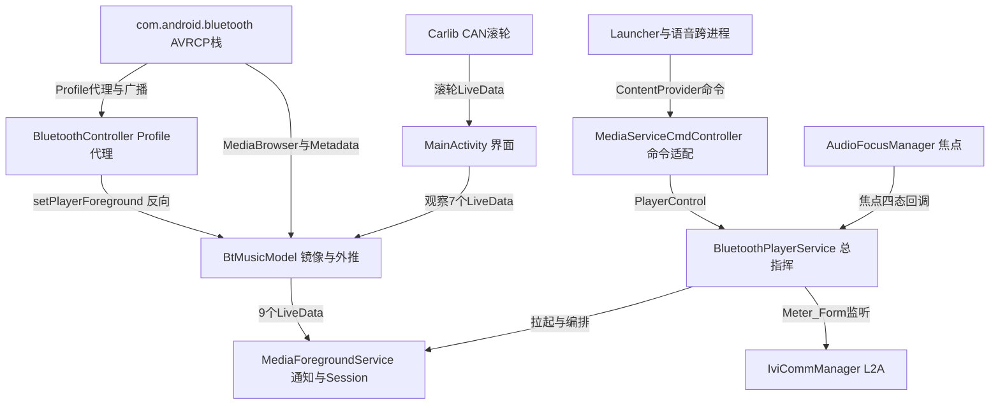

# BTMusic 架构解码（application/BTMusic）

> 源码锚点：commit `d653d105f86b946685f3ff5133a3079d718d7882`（main）｜ 生成：2026-09-06 ｜ 范围：子系统 application/BTMusic（批次 3 之二）
> 上游文档：[ARCHITECTURE.md](ARCHITECTURE.md)（全局地图与主链路）

包路径 `application/BTMusic/src/main/java/com/yadea/btmusic/`（下称 `.../`），26 个源文件全部实读。git 考据基于本仓库提交记录（仓库 2026-06-25 初始化，单号可溯）。

## 1. 模块卡片

**职责**：蓝牙音乐应用——以 A2DP Sink(11)+AVRCP Controller(12) 经系统 `MediaBrowser`→`com.android.bluetooth` 的 `BluetoothMediaBrowserService` 接管手机端音乐（BtMusicModel.kt:31-33、:297-303），标准化为本应用自己的 `MediaSessionCompat` + 前台通知（MediaForegroundService.kt:100-111），以 ContentProvider 命令通道供 Launcher/语音跨进程操控（manifest:186-197），并与车机 CAN/L2A（滚轮、Meter_Form）联动（MusicCarService.kt:34-46、BluetoothPlayerService.kt:104-127）。

**设计本质**：车机上手机蓝牙音乐是"没有本地播放器"的音源——车机不持有播放器，只做**远端 MediaSession 的镜像 + 焦点/音源仲裁 + 车控输入转换**。三类外部输入（Launcher 命令通道、CAN 滚轮/L2A、方控键值）统一收敛到 `PlayerControl` 接口（manager/PlayerControl.kt:7-45），由唯一实现 `BluetoothPlayerService` 转发。

**对外接口**：
1. 自有 MediaSession（tag "MediaForegroundService"，MediaForegroundService.kt:100-111）：播放/暂停/上下曲 action；接收语音 custom action `"com.aispeech.lyra.assistant"`（:530-538）与 MEDIA_BUTTON 键值 87/126/127（:161-174）。
2. 前台通知：channel `media_playback_channel`、id 8001（:71-72），MediaStyle 三按钮。
3. ContentProvider 命令通道（manifest:186-197）：命令集 `ACTION_MEDIA_PLAY/PAUSE/PRE/NEXT`、`MODE_ORDER/ONE/RANDOM`、`onGetMediaPlaybackState/onGetMediaMetadata/onChangePosition`（MediaServiceCmdController.kt:143-232）。
4. Settings.Global 键：`MUSIC_SOURCE_CHANGE`（音源仲裁，SourceChangeManager.kt:19）、`ivi_swt_key_code`（方控，BluetoothPlayerService.kt:295-299）、`POWER_MODE_SLEEP`（BtMusicModel.kt:305-306）、`KEY_CURRENT_SOUND_SOURCE_FOREGROUND`（桌面卡片前台音源，:308-312）。

**关键协作**：依赖 com.android.bluetooth AVRCP 栈、cmdcontroller/basemanager aar、Carlib、IviCommManager。⚠ 意外方向：① `MainActivity.kt:146-148` 音源切换回调里直接操作 `mMediaServiceCmdController.mPlayerControl?.doPause()`——Activity 反向指挥跨进程回调对象；② `BluetoothController.kt:144` AVRCP 代理连上后**反向**调 `BtMusicModel.setPlayerForeground(true)`（SIR-2463 副蓝牙耳机无声修复引入，commit d392bb3b/aa9f9d8d）——profile 层驱动业务层；③ manifest:194 的 `cmd_controller_callbacks` 指向 `com.neusoft.btmusic.service.MediaServiceCmdController`，而真实类是 `com.yadea.btmusic.service.…`（本轮 sed 验证，开放问题 §6）。

**雷区**：
1. **音源仲裁**：`isCanChangeInfo()` 查 `CarAudioManager.getCarFocusForZoneId`，若 `com.arcvideo.car.ncm.music`（网易车机版）持焦点则拒绝更新 UI 并停止进度外推（BtMusicModel.kt:215-223、:132-135）——SIR-6045（ce1dc85a）引入、SIR-6290（dcc28319）补 `stopProgressUpdate()` 防 dock 栏来回横跳。
2. **焦点时序**：收到 STATE_PLAYING 且自身非前台时先强制 doPause（BluetoothPlayerService.kt:129-148，注释"解决手机触发播放导致混音"）；拿到焦点后延迟 300ms 才 play（:244-246）。
3. **Meter_Form 联动**：L2A `Meter_Form` value=1（仪表屏）→ `displayState=4` → MainActivity 收到 4 直接 `finish()`（BluetoothPlayerService.kt:109-125，本轮 sed 验证；MainActivity.kt:120-125）——**应用生命周期被仪表形态驱动**。
4. **蓝牙重试预算**：`reConnectCount=10` 递减耗尽后 connectA2dp 静默失效（BluetoothController.kt:38、:283-286），直到进程重启不恢复。

## 2. 结构图

本图回答：**手机音乐如何"镜像"到车机、三方输入如何汇到 PlayerControl、谁在仲裁音源**。不包含：通知样式与 UI 布局细节。

图例：矩形 = 类/概念；实线 = 调用/数据流。三方输入汇聚点 = `PlayerControl`（BPS 是唯一实现）；进度/UI 的唯一事实源 = BMM 的 LiveData。

## 3. 核心类深卡片

### BtMusicModel（object，manager/BtMusicModel.kt，466 行）

**职责**：远端蓝牙媒体会话的唯一数据镜像——建 MediaBrowser 连接（:294-315），MediaController 回调翻译成 9 个 SingleValueLiveData（:50-58），主线程 500ms 节拍外推进度（:225-240、:263-270），按 CarAudio 焦点持有者做音源仲裁（:215-223）。
**协作者**：`App.getCarAudioManager()`（:216）；`BluetoothController` 反向调 setPlayerForeground（BluetoothController.kt:144）；消费方 BluetoothPlayerService.kt:60-62、MediaForegroundService.kt:194-199、MainActivity.kt:63-106。
**设计动机**（git 考据）：①（暂停瞬间进度条回退 1s，SIR-6501，commit 24db8647）→ 引入 `mLastUiProgress + REGRESSION_TOLERANCE_MS=2000` 回退容忍（:63-64、:234-238，本轮 sed 验证：`newProgress < mLastUiProgress && 差值<2000` 则保持旧值）；②（网易在放、蓝牙暂停着，dock 栏来回横跳，SIR-6045/SIR-6290）→ `isCanChangeInfo()` 查焦点持有者 + false 时 `stopProgressUpdate()`（:132-135）。
**不变量**：所有回调先 post 主线程（:126、:246-252）；进度单调不减（2s 容忍带内）；`stateChange` @Synchronized 串行化（:357）；每次 transportControls 操作前先 `setPlayerForeground(true)`（:403、:413、:427——与 SIR-2463 同源）。

### BluetoothController（object，manager/BluetoothController.kt，643 行）

**职责**：持有 A2DP_SINK=11/AVRCP_CONTROLLER=12 两个 profile 代理（:33-34、:89-154），维护"蓝牙开/设备连/A2DP 连"三态并广播（:595-620）。
**设计动机**：SIR-2463（副蓝牙连耳机无声）→ AVRCP 代理连上后补调 `BtMusicModel.setPlayerForeground(true)`（:144）把"车机要接管 A2DP 前台"的意图同步给蓝牙服务 [inferred：从 commit how 推]；车载冷启动时序（adapter/profile/ACL 到达顺序不定）→ 1500ms 复查（:74-77）、广播后 500ms 延迟复查（:406-411）、STATE_ON 后 1000ms 再 initA2dpProfile（:424-431）。
**不变量**：重试预算 `reConnectCount=10` 递减耗尽即静默放弃（:38、:283-286）；`isA2dpConnecting` 防重入（:299-302）；`a2dpProxyRequested` 代理只取一次（:84）；监听器 CopyOnWriteArrayList + 注册即回调当前态（:613-620）。雷点：反射 `BluetoothDevice.isConnected` 隐藏 API（:253-259，失败回落 profile 查询）；`destroy()` 对代理用 `!!`（:635-636）可 NPE。

### MediaForegroundService（service/MediaForegroundService.kt，618 行）

**职责**："系统标准媒体出口"——自建 `MediaSessionCompat`（:100-111）+ IMPORTANCE_LOW MediaStyle 通知（:384-413），镜像 BtMusicModel 状态，承接 MEDIA_BUTTON 键值（:154-189）与语音 custom action（:527-542）。
**设计动机**：通知/媒体卡片必须系统层可见可被方向盘与语音操作 → UI 不可见也要 startForeground（:178-186）+ START_STICKY（:188）；4 路状态任一变化都要刷新但避免重复 notify → `combine(4 StateFlow).distinctUntilChanged`（:120-151）；蓝牙断开立刻清卡片 → `onBluetoothConnectedChanged` 置空标题并 updateNotification（:609-615）。
**不变量**：通知只在 `mBTConnected && mA2dpIsConnect && !mIsNoMusicSource` 时发出（:346-356）；自有 session 的 speed 恒 1.0/0.0（:499——真实变速在 BMM 外推侧）；`onSkipToNext/Previous` 回调体被注释（:554-562），切歌实际走 通知按钮→MEDIA_BUTTON 广播→`onStartCommand` 87 键值 闭环（:415-429）。

### BluetoothPlayerService（service/BluetoothPlayerService.kt，375 行）

**职责**：车机侧总指挥——`PlayerControl` 唯一实现（:35），编排音频焦点状态机（:234-288）、`ivi_swt_key_code` 方控观察（:292-336）、L2A `Meter_Form` 联动（:104-127，本轮 sed 验证）、MediaForegroundService 自动拉起（:65-88）。
**设计动机**：手机触发播放导致混音（注释原话 :131）→ STATE_PLAYING 且非前台先 doPause（:139-141）；焦点瞬断后要记得继续播 → `isShouldPlayAfterHaveFocus` 记录（:263-272），regained 延迟 300ms 再播（:244-246）；双屏形态切换时应用给仪表让位 → Meter_Form==1 → displayState=4 → MainActivity finish（:109-125）。
**不变量**：方控观察器只在持焦点期间注册（getFocusSuccess→register，:280-282；失焦即 unregister，:259/:271/:287）；`doSeekTo/doLoopMode` 恒空实现——进度与循环模式由手机端控制（:183-192 注释原话）；onDestroy 成对释放（:151-158）。

## 4. 全类职责表

26 个顶层类型，入表 25，跳过 1（纯 DTO `bean/CardBean.java`——被 PlayerControl 列表接口引用但 BT 实现恒返空表，BluetoothPlayerService:198-212）。**覆盖率 96%（25/26）**。加粗 = §3 深卡片。

| 类（相对 .../） | 一行职责 | 关键协作 |
|---|---|---|
| MainActivity.kt | 把 BtMusicModel/CAN 滚轮/displayState 三路输入绑到单页 UI，仪表屏形态(4)或下滑时自杀退出 | BtMusicModel:63-106；MusicCarService:107-119 |
| App.kt | 全局 Application：持有 CarServiceManager，惰性产出 CarAudioManager 供音源仲裁 | BtMusicModel.isCanChangeInfo:215-221 |
| **manager/BtMusicModel.kt** | 连 com.android.bluetooth 的 MediaBrowser，远端会话翻译为 LiveData 流，主线程外推进度并按焦点仲裁音源 | BluetoothController:144 反向；BluetoothPlayerService:60-62 |
| **manager/BluetoothController.kt** | 持 A2DP Sink/AVRCP 代理，广播+反射+三档延迟重试维护蓝牙连接态并广播 | MediaForegroundService:112；BtMusicModel:144 |
| manager/AudioFocusManager.kt | 封装 AudioFocusRequest 申请/释放，系统焦点回调翻译成本模块四态监听接口 | BluetoothPlayerService:236 |
| manager/SourceChangeManager.kt | 以 Settings.Global `MUSIC_SOURCE_CHANGE` 为唯一事实源的音源仲裁器（读/写/广播） | BluetoothPlayerService:146 |
| manager/PlayerControl.kt | "媒体播放器"抽象契约：三种外部输入的统一收敛点 | 实现 BluetoothPlayerService:35；消费者 MediaServiceCmdController:20 |
| **service/BluetoothPlayerService.kt** | PlayerControl 唯一实现：编排音频焦点状态机、方控键值观察、Meter_Form 联动与前台服务拉起 | AudioFocusManager:236；IviCommManager:92 |
| **service/MediaForegroundService.kt** | 4 StateFlow combine 驱动 MediaStyle 通知，镜像自有 MediaSessionCompat 对外暴露标准媒体控制 | BtMusicModel observeForever:224-273 |
| service/MediaServiceCmdController.kt | 跨进程命令回调：Launcher/语音 action 翻译为 PlayerControl 调用并回推状态/元数据 | 经 CmdController.kt:29-32 注册 |
| service/MediaServiceCmdControllerService.kt | 开机向命令通道宣告 ACTION_MEDIA_INIT，随音源变化接通/断开蓝牙控制 | MediaServiceCmdController:18,35,40 |
| service/MusicCarService.kt | 监听 CAN 滚轮三信号（上拨/下拨/按下）以 LiveData 抛给 UI，提供车控属性读写通道 | MainActivity:107-119 |
| service/InitService.java | 程序起点：按序 createInstance 三个 BaseManager | configs.xml android_ext_main_service |
| extension/CmdController.kt | 全模块单例 service-locator 门面（延迟单例集合） | 所有 service/activity 由此取依赖 |
| viewModel/MainViewModel.kt | 界面态持有器（连接、设备名、有无数据、歌词、歌手、播放状态） | MainActivity:62,95-96 |
| util/MediaNotification.kt | MediaStyle 通知建造器：必填校验+三按钮+进度+token 绑定 | MediaForegroundService:396-412 |
| util/SingleValueLiveData.kt | 值不变不通知的 LiveData，抑制 500ms 进度节拍的 UI/通知抖动 | 全模块状态流基础设施 |
| util/ServiceUtils.kt | 服务启停 + 以 isRunning 静态位代替 ActivityManager 查询 | BluetoothPlayerService:71-88 |
| util/StringUtil.kt | 把 "Unavailable/未知/<unknown>/Not Provided" 等脏标题统一本地化为"未知" | MainActivity:65,93 |
| util/PermissionUtils.kt | 权限检查门面：系统 UID 下实际只做 hasPermission 断言，未授权直接 onDenied | BluetoothController:70,307 |
| util/ViewBindingUtils.kt | 反射实例化 DataBinding 与泛型 ViewModel 的公共工具 [inferred 消费方] | common aar 基类 |
| view/weiget/WidgetMusicPlayControl.kt | 复合控件：进度条+播放控制回调封装与日夜态皮肤切换 | MainActivity:154-165 |
| view/custom/CustomMusicSeekBar.java | 自绘进度条：日/夜/禁用三套配色，支持点击跳转与拖拽开关 | WidgetMusicPlayControl:74-85 |
| view/custom/FocusedTextView.kt | `isFocused()` 恒 true 的 TextView，强制跑马灯滚动 | 主布局长标题 |
| view/custom/LoadingImageView.kt | 无限旋转的封面占位图，随可见性启停动画 | 布局加载态 |

## 5. 看着糟但其实没问题

1. **PermissionUtils 从不真正弹窗**（util/PermissionUtils.kt:43-48）——系统 UID + 平台签名下所有 uses-permission 预授权，它只是断言；换非系统环境才暴露。
2. **Handler 消息拟态**（WHAT_UI_INIT_BLUETOOTH_SWITCH=112 等常量 + handleMessage :561-576）——Java Handler 时代移植写法，实为 A2DP 延迟重试骨架（:295、:574）。
3. **`refreshPlayControl()` 的"切换控制器"空转**（MediaForegroundService.kt:276-282）——newControl 永远是同一个单例，是 USB/蓝牙多播放器架构遗迹，无害（重复 addCallback 覆盖单槽回调，不泄漏）。
4. **`FocusedTextView.isFocused()=true`**——强改焦点语义只为跑马灯，车机 HMI 惯用 hack。

## 6. 开放问题（BTMusic 局部）

**需人确认**：
1. **manifest `cmd_controller_callbacks` 指向不存在的类**：`com.neusoft.btmusic.service.MediaServiceCmdController`（AndroidManifest.xml:194，本轮 sed 验证值确为 com.neusoft 前缀），真实类是 `com.yadea.btmusic.service.…`——疑为 Neusoft→Yadea 改名遗迹；需确认 cmdcontroller aar 是否反射该 FQCN（若是则远端回调静默失效，当前仅进程内注册生效）。
2. **重复 FileProvider**：manifest:120-128 与 :177-185 在 applicationId=`com.yadea.btmusic` 时 authority 相同，合并行为需验证。
3. **与音乐无关的权限/queries 堆积**：`DELETE_PACKAGES/INSTALL_PACKAGES/MANAGE_DEVICE_ADMINS`(:49-51)、`READ_FRAME_BUFFER`(:15)、`ACCESS_BROADCAST_RADIO`(:31)、RK 三家安装器 queries(:97-107)——代码中无对应逻辑，疑模板整段拷贝；且 INTERNET/存储/蓝牙权限多处重复声明。
4. **`mIsBCallInCall` 从未被置 true**（BtMusicModel.kt:62,131）——蓝牙通话抑制播放是半成品还是已移除？
5. **MediaForegroundService 的 observeForever 不注销**（:224-273 注册于单例 BtMusicModel，onDestroy 只删 BluetoothController 监听 :570-580）——服务反复启停会累积观察者，泄漏量级取决于重启频率。
6. **`isPlayerForeground` 死状态**：唯一读取在日志（:368）——POWER_MODE_SLEEP 监听是否已失去实际作用？

**[inferred]**：`KEY_CURRENT_SOUND_SOURCE_FOREGROUND`/`POWER_MODE_SLEEP` 的写入方为 Launcher；`MusicCarService.sendVehicleProperty` 在模块内无调用方（预留）；framework SystemReadyReceiver→configs.xml 触发链细节在 basemanager aar 内（仓库无源码）。

**未深挖**：basemanager/cmdcontroller aar 内部；framework 触发链；两个 Settings.Global 键的完整读写方矩阵。
