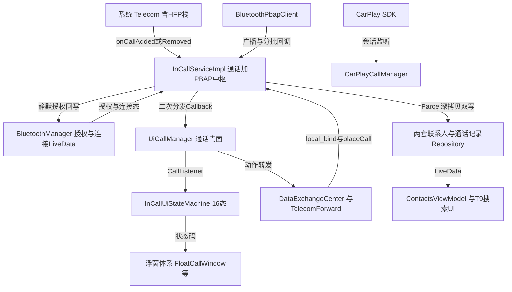

# BTPhone 架构解码（application/BTPhone）

> 源码锚点：commit `d653d105f86b946685f3ff5133a3079d718d7882`（main）｜ 生成：2026-09-06 ｜ 范围：子系统 application/BTPhone（批次 3 之一）
> 上游文档：[ARCHITECTURE.md](ARCHITECTURE.md)（全局地图与主链路）

包路径 `application/BTPhone/src/main/java/com/yadea/btphone/`（下称 `$B/`），main 源集 140 个文件（139 Java + 1 Kotlin，约 4.2 万行 Java）。系统 UID + 平台签名，以 `InCallService` 身份挂进系统 Telecom。

## 1. 模块卡片

**职责**：系统级蓝牙电话应用——以 InCallService 承接 Telecom 的 HFP 通话（Manifest:132-143），用 PBAP Client 把手机通讯录/收藏/通话记录拉到本地内存供 UI 与来电命名回显，并以仪表屏（Display 2）+ HUD（Display 4）双屏悬浮窗呈现通话 UI。

**对外接口**（全部实证）：
1. InCallService 入口 `.telecom.InCallServiceImpl`（`BIND_INCALL_SERVICE` + `IN_CALL_SERVICE_UI=true`，Manifest:132-143）；进程内 `local_bind` action 取 LocalBinder（InCallServiceImpl.java:87、1540-1548，绑定方 TelecomForward.java:87-90）。
2. 接听/挂断广播 `com.neusoft.action.PHONE_ANSWER/HANGUP`（Constants.java:21-22），`RECEIVER_NOT_EXPORTED` 注册（BtPhoneApp.java:131-139），处理类 receiver/PhoneControlReceiver.java:42-52。
3. 浮窗显示广播 `com.yadea.btphone.SHOW_FLOAT_WINDOW`，receiver **exported=true**（Manifest:146-151）——⚠ 见雷区 5。
4. Settings.Global `callingStateBtphone`（启动置 0，BtPhoneApp.java:113-124；有通话置 1，UiCallManager.java:1107-1116）；方控走 `ivi_swt_key_code`（SteeringWheelKeyManager.java:33）。
5. 开机自启 + 默认拨号器：`BootReceiver` 启动前台服务并调隐藏 API `DefaultDialerManager.setDefaultDialerApplication`（BootReceiver.java:20-43）。
6. L2A 信号：HUD 悬浮窗显隐同步发 `IviCommManager.sendCommValue("BT_Phone_State",…)`（FloatWindowManager.java:142、175）。

**关键协作**：依赖系统 Telecom 的 `com.android.bluetooth.hfpclient.HfpClientConnectionService` PhoneAccount（来源甄别，InCallServiceImpl.java:1312-1319）、`BluetoothPbapClient/BluetoothHeadsetClient` 隐藏 API、framework `com.android.internal.util.StateMachine`（InCallUiStateMachine.java:30）、创达 CarPlay SDK（compileOnly）、Carlib、IviCommManager。
⚠ 意外方向：① **SteeringWheelKeyManager 由 UiCallManager 持有并在"有通话时注册、无通话注销"**——模型层自动抢方控，把上一曲/下一曲接管为接听/挂断（UiCallManager.java:1103-1105、1174-1183）；② `ContactsFragment.getUiState()` 是静态方法被 InCallServiceImpl 反向调用（ContactsFragment.java:63-67 ← InCallServiceImpl.java:2096-2100）——Service→Fragment 向上依赖；③ 与 PhoneControlReceiver 存在两套逻辑几乎复制的接/挂入口（PhoneControlReceiver.java:58-90 vs SteeringWheelKeyManager.java:151-176）。

**设计动机**（考据自注释与 git）：通话来源甄别起于 ECall 事故（commit d22c0539/SIR-5681"ecall 呼叫中偶尔从手机端拨打救援电话"）；`Constants.sCallInitiatedByCar` 区分车机/手机发起决定弹窗形态（FloatCallWindowPresenter.java:265-271）；流转（circulation）弹窗用 5 秒检测窗口只允许一通电话命中（FloatCallWindowPresenter.java:827-845，修 SIR-4602）。

**雷区**：
1. **exported 浮窗广播可致真实拨号**（本轮 sed 验证）：`FloatWindowBroadcastReceiver.createOrUpdateCall` 无通话时对任意 `extra_call_number` 调 `safePlaceCall` **真实发起拨号**（FloatWindowBroadcastReceiver.java:121-126，代码注释自认"这会真正发起通话"），而 receiver exported——三方应用可借此拨号。
2. **隐藏 API 断点**：`BluetoothAdapter.getMicState/setMicState`（UiCallManager.java:594-605）、`DefaultDialerManager`（BootReceiver.java:33-38）、`StateMachine`、`BluetoothPbapClient.getPhonebookdata`（InCallServiceImpl.java:1794-1795）——换平台全是断点。
3. **通话来源甄别脆弱**：PhoneAccount 组件名字符串匹配 + "来电号码==本机 SIM 号即视为微信通话丢弃"（InCallServiceImpl.java:1235-1239、TelecomUtils.java:376-382）。
4. **多方通话治理**：≥2 路自动拒接新来电（InCallServiceImpl.java:1250-1270，300/500ms 延迟拒接兜底）；`getCalls()` 上限 2 路（UiCallManager.java:584-592）。
5. **隐私日志**：完整电话号码大量进 log（`logFavoritePbapContacts` 明文打印收藏联系人姓名+号码数组，InCallServiceImpl.java:793-796 注释自认"应删除或脱敏"；另有 ViewUtil.java:79、PhoneControlReceiver.java:76 等多处）——系统 UID 日志全局可读。

## 2. 结构图

本图回答：**一通 HFP 来电如何走完全链路、通讯录如何同步落地、浮窗由谁裁决**。不包含：CarPlay 弹窗细节与联系人页面布局。

图例：矩形 = 类/概念；实线 = 调用/数据流。PBAP 链路 = `PBAP → ICS → REPO → VM`；通话链路 = `TELECOM → ICS → UCM → FSM → FLOAT`；两条链在 ICS 汇合（该类 2192 行是全模块枢纽）。

## 3. 核心类深卡片

### InCallServiceImpl（$B/telecom/InCallServiceImpl.java，2192 行）

**职责**：`android.telecom.InCallService` 实现 + `Callback` 二次分发源（:1649-1656）+ PBAP 三路（通讯录/收藏/通话记录）下载中枢。
**协作者**：TelecomFramework（onCallAdded :1212 / onCallRemoved :1421）；TelecomForward 经 local_bind（:1540-1548）；BluetoothPbapClient（广播 :237-529、回调 :661-749）；BluetoothManager 授权回写（:1922-1923）；两套 Repository（:409-410）。
**设计动机**（情境→响应→度量）：
- ECall 走 Telecom 但不是蓝牙电话（SIR-5681）→ onCallAdded 首行按 PhoneAccount 组件名过滤（:1224、:1312-1319，本轮 sed 验证）→ 非 HFP 通话不产生浮窗、不写 callingStateBtphone。
- iPhone 撤销授权后 PBAP 仍连、旧数据被展示 → `checkContactsAuthorizationSilently` 只查数量不下载（:1843-1889），size==0 三级清缓存（:1909-1919）并回写授权 LiveData（:1922-1923）。
- 挂断后手机端记录尚未写好 → 800ms 后全量重拉 CCH、再 3s `setFirstLog` 兜底回灌（:1445-1464）。
**不变量**：DownloadStates/三个 mDownload* 列表 CopyOnWriteArrayList（:114-119）；仓库更新走 Schedulers.io（:413）；pullPhonebook 500ms 防抖（:967-972）；PBAP 未连时置 `mPendingContactsDownload` 等连接广播补发（:509-519）；每设备每进程只恢复一次协议缓存（:1707-1711）；DownloadStates 只能类内写（:180-199）。

### UiCallManager（$B/telecom/telecom/UiCallManager.java，1665 行）

**职责**：UI↔Telecom 一切动作门面（类头注释 :74-77"一切涉及电话动作的操作最好在这个类中理解并处理清楚"）：place/answer/reject/hold/DTMF/路由/静音 + UiCall 生命周期账本。
**设计动机**：车机拨号瞬间 Telecom 会替换通话对象 → `removeSupersededOutgoingPlaceholders`（:1235-1255）+ 挂断回调延迟判定 + `OUTGOING_CALL_REPLACEMENT_GRACE_MS` 1s 宽限（:85、:1146-1160）；接听先 `setNeedSwitchAudio(false)` 并置车机发起标志（:458、:463），接通后 200ms 路由落到 BLUETOOTH（:1014-1042，注释"从300ms减少到200ms"是实测调优痕迹）；3 秒内连拨限流静默失败（:1397-1415，修 SWIM-101101）。
**不变量**：mCallMapping/终止集只在主线程变更；同一 UiCall 不会收到两次 disconnect（`mCallsPendingTermination.add` 返回值去重，:508-511）；getPrimaryCall 对会议通话返回 null（:1350-1353）；`sCallInitiatedByCar` 只能在宽限到期后复位（:1147-1160）。

### InCallUiStateMachine（$B/telecom/telecom/InCallUiStateMachine.java，1767 行）

**职责**：直接继承 framework `com.android.internal.util.StateMachine`（:30），把"通话集合 × 页面前台 × 是否四方"折叠为 16 个 UI 状态码（:73-108、:161-177）+ 7 类消息（:37-67），输出给 FloatCallWindowPresenter 裁决浮窗/全屏。
**设计动机**：Launcher 上最小化延迟 500ms 发 MSG_MIN（:230-236，[inferred] 等桌面动画完成）；屏保在上层时 MSG_MAX 先发广播退屏保（:390-396，修 SWIM-104536）；车机拨号通话对象替换导致 DIALING 被 NOT_HANDLED → 去电态显式处理 DIALING/CONNECTING（:800-803、:973-976）。
**不变量**：StateMachine 全消息在主 Looper（BtPhoneApp.java:80）；延迟消息会被 `removeMessages` 抢占（:768、:853 等）；所有 handleCallRemoved 必须落到"按 primaryCall 现状降级"的目标态。⚠ 已知缺口：`IncomingMin3PartState/IncomingMax3PartState.handleCallRemoved` 对 `getPrimaryCall()` 未判空即 `.getState()`（:1289-1291、:1359-1361），而同文件其他状态（:1646、:1713）都判了——与 SIR-5769"来电提醒偶现崩溃"疑似同源 [inferred]。

### BluetoothManager（$B/manager/BluetoothManager.java，581 行）

**职责**：对外唯一的"蓝牙连接态 + PBAP 授权态" LiveData 源；设备切换时按旧 MAC 清库清授权。
**设计动机**：换手机连接 → 进入 CONNECTING 即比对 previousConnectedMac，不同则单线程 executor 清旧设备的系统联系人/通话记录（:112-132、DataClearUtil.java:49-94；修 SIR-6287"第二蓝牙显示第一蓝牙收藏"）；iPhone 撤销授权但链路仍在 → 授权判断与连接判断分离，由协议查询驱动（:374-381），旧的 pull 实测方案整段注释废弃（:420-466）。
**不变量**：pbapAuthorized 主线程 setValue、子线程 postValue（:362-368，注释写明 postValue 乱序覆盖风险——本轮前序批次已验证该模式）；清库任务单线程串行（:51-52）；CONNECTING 是清库唯一触发点。

### FloatCallWindow（$B/floatview/FloatCallWindow.java，1911 行，近一年改 18 次）

**职责**：悬浮窗 View 本体：按 Presenter 指令 inflate 6 套布局（来电/去电/通话中/流转/三方×3，showXxxUI :1383-1685），管理"音频路由保护窗"（:1303-1377、:1820-1859）与迷你拨号盘。
**设计动机**：系统 `onSwitchPrivateBtnBack` 回调与用户刚点的路由相反（fwk 回调迟到，UiCallManager.java:1637-1639 注释承认"回调的数据不准确"）→ 本地 currentAudioRoute + 3s 保护窗 + 2s 手动切换窗口三层防回摆；HFP 音频链路未建立 → `setupAudioRouteWithRetry` 最多 3 次 × 500ms 且验证失败自动重试（:1303-1377）。
**不变量**：UI 方法全部主线程（removePreviousView 有主线程断言重投递，FloatWindowManager.java:580-585）；`Constants.setFloatWindowType` 与布局 inflate 必须成对；showEmptyUI 清空全部视图引用并双保险移窗（含 100ms 后 isAttachedToWindow 复查）；挂断浮窗 1s 自动消失（:1586-1589）。

### DataExchangeCenter（$B/telecom/dataexchange/DataExchangeCenter.java，295 行）

**职责**：电话源策略持有者（TELE=1/CAPP=2，:42-43）+ UiCall↔CallHolder 转换工厂 + 来电命名（Repository 命中→拨号名兜底，:230-241，对应 SIR-6432）。
**⚠ 重大现状**：`mCAPPForward` 只声明从未赋值（:37），`setPhoneSourceType(CAPP_PHONE_TYPE)` 会把 `mPhoneForward` 置 null（:79，本轮 sed 验证）——CPAA 是残留半成品；CarPlay 弹窗实际绕过此策略直连 `CarPlayCallManager`。一旦有代码传 CAPP，下一次 `placeCall` 即 NPE（UiCallManager.java:427-434 无判空）。
**不变量**：单进程单例（重复 init 抛异常，:61-67）；nextCallId 严格递增（:50-52）；`UiCall.connectTimeMillis` 只在首次 ACTIVE 写 elapsedRealtime（:177-179）——通话时长与车机宽限判定的共同时钟源。

## 4. 全类职责表

总数 140 文件；**入表 108 / 140（77%）**，跳过 32 个纯 DTO/空接口/调试类（140/140 全部被显式分类）。加粗 = §3 深卡片。

| 类（相对 $B） | 一行职责 | 关键协作 |
|---|---|---|
| BtPhoneApp.java | 进程装配器+前后台判定器，串起全部单例并广播"通话页可见性" | :70-124 装配；RxBus CALLING_PAGE_VISIBLE_CHANGED |
| Constants.java | 全局静态状态仓：sCallInitiatedByCar/浮窗类型/circulation/EventCode ⚠静态可变全局 | :96-128 |
| MainActivity.java | 主页（拨号/联系人/记录/收藏 ViewPager+搜索），处理默认拨号器请求 | :59-62 |
| CallingActivity.java | 全屏通话页（独立 taskAffinity），渲染双路通话与拨号盘 | UiCallManager、CallTimeManager |
| InCallingActivity.java | 蓝牙应用内全屏来电页（仅接/挂） | UiCallManager.answerCall/rejectCall |
| ThreeWayCallingActivity.java | 三方通话全屏页（独立 task），双卡位+保持/切换/计时 | CallListener、isSecondRing |
| CallCenterActivity.java | 呼叫中心通话页（"95519"占位需求，Manifest 注释仅供调试） | CALL_CENTER_NUMBER |
| ContactSearchActivity.java | 通讯录搜索独立页 | ContactsViewModel.searchAll |
| **manager/BluetoothManager.java** | 蓝牙连接+PBAP 授权的 LiveData 唯一信息源，设备切换清库 | FrameworkBluetoothProvider、DataClearUtil |
| manager/FrameworkBluetoothProvider.java | 用标准 HFP 广播把连接态喂给 LiveData 的 Provider 实现 | BluetoothStateProvider |
| manager/BluetoothStateProvider.java | 蓝牙状态源抽象接口（换 Provider 预留） | FrameworkBluetoothProvider |
| manager/BluetoothConnectionState.java | 连接状态枚举 | LiveData 泛型 |
| manager/DevicePermissionManager.java | 按 MAC 持久化每台手机的 PBAP 授权标记（SP） | BluetoothManager |
| manager/SteeringWheelKeyManager.java | 通话期间监听 ivi_swt_key_code，把方控上一/下一曲接管为接/挂 ⚠由模型层持有 | UiCallManager；丢失模式屏蔽（:229-237） |
| receiver/PhoneControlReceiver.java | PHONE_ANSWER/HANGUP 广播的接/挂执行器 | UiCallManager、UiBluetoothMonitor |
| floatview/FloatWindowManager.java | 双屏 WindowManager 管理+唯一主悬浮视图的 add/remove/replace 事务（50/100/150ms 延迟重试兜底） | FloatCallWindow、IviCommManager |
| **floatview/FloatCallWindow.java** | 悬浮窗本体：6 套布局 inflate + 音频路由"保护窗"防系统回调回摆 | Presenter、PhoneNumberLookup、CallTimeManager |
| floatview/FloatCallWindowPresenter.java | 状态码→showXxxUI 翻译器+流转标志三元组管理 ⚠case 与日志文案不符（:504-518） | InCallUiStateMachine.StateChangeListener |
| floatview/DialPadWindowManager.java | 浮窗内迷你拨号盘的窗口事务（ACTION_OUTSIDE 自动隐藏） | FloatCallWindow |
| floatview/FloatWindowBroadcastReceiver.java | 外部广播→浮窗显示入口 ⚠exported 且无通话时可真实拨号（:121-126） | BluetoothManager、UiCallManager.safePlaceCall |
| floatview/IFloatWindowView.java | 浮窗视图契约 | FloatCallWindow |
| floatview/IDialPadViewListener.java | 拨号盘窗口 show/hide 通知 | DialPadWindowManager |
| **telecom/InCallServiceImpl.java** | InCallService+PBAP 中枢（2192 行，全模块枢纽） | Telecom/BluetoothPbapClient/两套 Repository |
| telecom/UiBluetoothMonitor.java | 主设备/本机号码/HFP PhoneAccount/DTMF 的命令式状态中枢 ⚠与 BluetoothManager 两套并存互不引用 | UiCallManager.Listener |
| telecom/CallListener.java | 通话事件监听契约 | UiCallManager 分发 |
| telecom/CrashHandler.java | 全局未捕获异常占位处理器（打日志后交还系统） | BtPhoneApp.init |
| **telecom/telecom/UiCallManager.java** | 通话动作唯一门面：拨/接/挂/保持/DTMF/路由 + UiCall 账本 + 方控注册 | 全员 |
| **telecom/telecom/InCallUiStateMachine.java** | 16 态通话 UI 状态机（framework StateMachine） | FloatCallWindowPresenter |
| telecom/telecom/TelecomUtils.java | 号码规整/本机号比对（微信通话过滤）/状态文案 | ContactRepository、UiCallManager |
| telecom/telecom/CallTimeManager.java | 通话时长 1s 心跳分发器（isRunning 防死后覆盖） | FloatCallWindow |
| telecom/telecom/BootReceiver.java | 开机启动前台服务+设默认拨号器（隐藏 API） | InCallServiceImpl、DefaultDialerManager |
| telecom/telecom/CloseBtPhoneBroadcastReceiver.java | VR 关闭广播分发（ECARX 遗留，当前 Manifest 未注册） | OnCloseBtPhoneListener |
| telecom/dataexchange/DataExchangeCenter.java | 电话源策略路由器 + UiCall/CallHolder 转换工厂 ⚠CAPP 实现缺失恒 null | TelecomForward、UiCallManager |
| telecom/dataexchange/TelecomForward.java | Telecom 实现：bind local_bind、placeCall、音频路由双通道 ⚠单监听器覆盖（:529-534） | InCallServiceImpl.LocalBinder、BluetoothHeadsetClient |
| telecom/dataexchange/IPhoneForward.java | 电话转发策略接口（CAPP 无实现 ⚠） | TelecomForward |
| telecom/dataexchange/IPhoneCallback.java | 电话事件回调 | UiCallManager |
| telecom/dataexchange/ICallHolderCallback.java | UiCall 状态回流回调（lambda 化） | UiCallManager:1313 |
| telecom/dataexchange/ICall.java | hold/unhold/answer/reject 动作接口 | TelecomForward |
| telecom/dataexchange/CallHolder.java | Call/BtCall 双源容器（equalWith 按源类型比较） | mCallMapping 值对象 |
| telecom/repositories/ContactRepository.java | Telecom 侧 PBAP 联系人缓存（去重合并/号码→联系人查询/来电命名） | DataExchangeCenter |
| telecom/repositories/RecentRepository.java | CallLog ContentObserver+debounce ⚠主体已被 SWIM-103271 掏空（:99-104 只 log 不加载） | BtPhoneApp |
| telecom/repositories/FavoritesRepository.java | 收藏（STARRED）判定与缓存 | ContactsRepository |
| telecom/repositories/MemoryContactControl.java | "内存加载完成+全量同步完成"两布尔状态灯 | ContactsRepository |
| telecom/contact/ContactListPresenter.java | 旧 MVP 联系人 Presenter ⚠与 ViewModel 新旧并存 | ContactsFragment |
| telecom/contact/RxBusBasePresenter.java | 带 RxBus 生命周期的 Presenter 基类 | ContactListPresenter |
| telecom/contact/ContactListView.java | 联系人列表视图契约 | ContactsFragment |
| repository/ContactsRepository.java | UI 侧通讯录仓库：LiveData+去重+状态机同步 | InCallServiceImpl、SyncPerformanceTracker |
| repository/CallLogRepository.java | UI 侧通话记录仓库：RxJava 转换为 CallLogItem 列表 | InCallServiceImpl.syncCallLogData |
| viewmodel/ContactsViewModel.java | 通讯录页状态机（同步/授权双超时/T9 预计算拼音索引） | ContactsRepository、ContactListPresenter |
| viewmodel/CallLogViewModel.java | 通话记录页状态装配 | CallLogRepository |
| viewmodel/FavoritesViewModel.java | 收藏页状态（RxBus 直取 PBAP 数据） | FavoritesRepository |
| viewmodel/FuzzyMatchViewModel.java | 号码模糊匹配（无联系人时搜服务号） | PhoneNumberUtils、FuzzyMatchView |
| state/ContactsUiState.java | 通讯录页 UI 状态密封层级 ⚠被 InCallServiceImpl 静态读取 | ContactsFragment |
| state/CallLogUiState.java / FavoritesUiState.java | 通话记录/收藏页 UI 状态密封层级 | 对应 Fragment |
| location/PhoneNumberLookup.java | 归属地查询门面（phone.dat 内存化+算子注入，查不到回退区号表） | FloatCallWindow |
| location/BinarySearchAlgorithmImpl.java | phone.dat 9 字节定长索引二分算子（alignPosition 对齐） | LookupAlgorithm |
| location/AreaCodeUtil.java | 全国区号→城市静态映射兜底表 | PhoneNumberLookup |
| location/LookupAlgorithm.java | 归属地算子接口 | BinarySearchAlgorithmImpl |
| location/Attribution.java / PhoneNumberInfo.java / ISP.java | 归属地值对象/组合值对象/运营商枚举 | extract |
| config/SyncConfig.java | 同步阈值常量类（数量/分批参数收口） | Repository 层 |
| utils/DataClearUtil.java | 设备切换清内存+系统 Contacts/CallLog 库+授权标记 | BluetoothManager 单线程执行 |
| utils/SyncPerformanceTracker.java | 联系人同步全链路打点（下载→DB→排序→LiveData） | ContactsRepository |
| utils/PhoneNumberUtils.java | 中国常用服务号查询（模糊匹配兜底） | FuzzyMatchViewModel |
| utils/BtphoneConfigUtil.java | 配置字节流位段解析工具 [inferred 调用方] | — |
| utils/ToastUtil.java | 多 Display Toast 工具（指定屏显示） | FloatWindowBroadcastReceiver |
| utils/IntentUtil.java | 页面跳转工具（拉起 CallingActivity/收起负一屏） | FloatCallWindowPresenter |
| utils/PhoneCheckUtil.java | 号码合法性校验 | 拨号盘前置 |
| utils/DataUtil.java | UTF-8 字节级截断 | SmartEllipsizeTextView |
| utils/BitmapUtil.java | ARGB_8888 位图创建 | 头像解码 |
| utils/HighlightUtil.java | 高亮配色 | 搜索高亮 |
| utils/AppUtils.kt | 向 VR 适配器发使能/禁用广播 | Constants.CUSC_VOICE_* |
| telecom/utils/RxBus.java | PublishRelay 单例事件总线（io 订阅/main 观察） | 全模块 |
| telecom/utils/T9SearchUtils.java | T9 三路匹配+高亮优先级（净音去 *#） | ContactsViewModel.searchAll |
| telecom/utils/StringUtil.java | 947 行字符串工具（格式化/截断/中文判断） | 全模块 |
| telecom/utils/CommonUtils.java | 首字母/拼音/排序比较器 | ContactsAdapter |
| telecom/utils/PinyinUtils.java | 汉字转拼音（含多音字姓氏表） | SearchResult 预计算 |
| telecom/utils/CallDurationManager.java | 悬浮窗接听场景的本地时长缓存 | FloatCallWindowPresenter |
| telecom/utils/PageManager.java | 反射取栈顶 Activity 判"在桌面/通话页"（ECARX 遗留包名） | InCallUiStateMachine |
| telecom/utils/ContextUtil.java | 全局 Context 持有器 | BtPhoneApp.init |
| telecom/utils/ViewUtil.java | updateCallInfo：姓名+号码格式化回显 | FloatCallWindow、CallingActivity |
| telecom/utils/PrefixHighlighter.java | 号码前缀高亮器 | 搜索列表 |
| telecom/utils/ViewClickObservable.java | 点击事件 Rx 化封装（防抖基元） | [inferred] 拨号按钮 |
| telecom/utils/LaunchTimerUtil.java | 启动计时小工具 [inferred] | — |
| telecom/utils/ISubscribe.java | Rx 订阅标记接口（空） | RxBusBasePresenter |
| telecom/beans/UiCall.java | UI 层通话抽象（id/state/isPrivate/isCarAudio/handleAddress） | mCallMapping 键 |
| telecom/beans/RxEventMsg.java | 事件总线消息壳（code+data） | RxBus |
| telecom/beans/SearchResult.java | 搜索结果载体（拼音节点树+高亮位图+优先级） | T9SearchUtils |
| telecom/beans/ContactData.java | 联系人富模型（多号码/邮箱/头像/收藏名/letter） | 两套 Repository 转换目标 |
| telecom/beans/BtCall.java | CPAA 蓝牙通话对象（当前链路未启用 ⚠） | CallHolder |
| telecom/beans/PhoneContact.java / PyNode.java / MatchedContact.java / RecentBean.java / RecentData.java / FavoriteData.java / BtDevice.java | 数据载体级模型 | 各 Repository/搜索/设备展示 |
| adapter/ContactsAdapter.java 等 7 个 | 通讯录/记录/收藏/搜索/模糊匹配各列表适配器与点击回调 | 对应 Fragment |
| view/DialPadView.java / FloatDialPadView.java | 主页/浮窗拨号盘复合控件 | MainActivity、FloatCallWindow |
| view/ContactIndexBar.java / LetterTipBubble.java | 字母索引条+水滴气泡（SIR-3225/6264 修复区） | ContactsFragment |
| view/SmartEllipsizeTextView.java | 姓名+号码双段智能省略（LTR 修复 SIR-6370） | 通话页 |
| view/FuzzyMatchView.java / AutoHideScrollListener.java | 模糊匹配候选视图/停滚 2s 隐藏索引条 | MainActivity、ContactsFragment |
| view/CallButton.java 等 6 个控件 | 主题化按钮/拨号键/SOS 键/禁粘贴输入框/滑块装饰 | 布局绑定 |
| fragment/ContactsFragment.java | 通讯录页 ⚠静态 getUiState 被 Service 反向调用 | ContactsViewModel |
| fragment/CallLogFragment.java / CallLogDescFragment.java / FavoritesFragment.java | 记录页（Loading 抑制同步期刷新）/详情页/收藏页 | 对应 ViewModel |
| common/BaseFragment.java / BasePresenter.java / BaseSkinAppCompatActivity.java | MVP 基类三件套（弱引用 View+RxBus 注销/换肤） | 各页面 |
| carplay/CarPlayCallManager.java | CarPlay 通话弹窗管理器（SDK 探测+重试绑定，:22-44 注释记录崩溃教训） | CarPlayCallWindow |
| carplay/CarPlayCallWindow.java | CarPlay 通话卡片悬浮窗（前台抑制/后台显示） | CarPlayCallManager |
| carplay/CarPlayTestActivity.java | adb 手动拉起的 CP 弹窗模拟测试页（进主源集） | mForegroundOverride |

**跳过清单（32，理由）**：纯 DTO/包装 22（bean/CallLogItem、ContactBean、adapter/ContactItem、ContactListItem、SectionHeaderItem 及 telecom/beans 下数据载体）；空/标记接口 3（IBasePresenter、IBaseView、ISubscribe）；调试用无生产调用方 4（test/TestFriendlyTime*2、CarPlayTestActivity 已入表标注、CloseBtPhoneBroadcastReceiver 已入表标注）；ViewBinding 生成物不计。

## 5. 看着糟但其实没问题

1. **大量 200/300/500/1500ms 魔法延时**（UiCallManager.java:744-747、:1042、:1070-1073 等）——HFP 音频链路建立是异步的，延时是"设置→验证→重试"策略的一部分，:1042 有"从300ms减少到200ms"实测调优注释，配套 getRoute 验证保证超时不静默。能跑但难维护。
2. **两套 Repository 收同一份联系人的 Parcel 深拷贝双写**（InCallServiceImpl.java:407-410、:2169-2187）——看似冗余实为必要：Telecom 侧 ContactRepository 的去重/号码合并会直接修改 BluetoothPbapContact 内部列表（ContactRepository.java:300-304），UI 侧 ContactsRepository 去重规则还不同（保留"新<旧拒绝"保护），共享实例必炸。
3. **FloatWindowManager.replaceView 的 50/100/150ms 延迟重试与多屏兜底**（:544-552、:480-515）——WindowManager 跨 Display removeView 的真实坑（"半附着状态 isAttachedToWindow 为 false 但 remove 会成功"注释 :159-161）。
4. **海量【修复】【关键修复】中文注释与事故复盘注释**（InCallServiceImpl.java:313-325 整段）——真实线上事故的沉淀，注释与当前实现一致，新维护者不应清理掉。

## 6. 开放问题（BTPhone 局部）

**疑似 bug（需人工确认）**：
1. exported 浮窗广播可致真实拨号（§1 雷区 1，已验证）——安全/交互双重问题。
2. InCallUiStateMachine 两处 NPE 风险（:1289-1291、:1359-1361 未判空 vs :1646/:1713 已判）——与 SIR-5769 崩溃疑似同源 [inferred]。
3. TelecomForward 单监听器覆盖（:529-534）：双路通话时第一路状态回调被顶掉 [inferred 影响面]。
4. `mCAPPForward` 恒 null + placeCall 无判空（已验证）——CAPP 路径一旦被调用即 NPE。
5. `FloatCallWindowPresenter` case `STATE_ONGOING_MINI_FLOAT` 内日志全写 "STATE_INCOMING_MUTED"（:504-518）——误导排障。
6. `IdleState.handleCallAdded` 注释写两个分支、实现无条件进去电浮窗（InCallUiStateMachine.java:588-591）——全屏拨号页拉起职责归属需确认。
7. InCallServiceImpl.java:2189 残留 `// ... existing code ...` 合并占位符——建议 diff 历史确认无代码丢失。
8. `RecentRepository.loadCallHistory` 只 log 不加载（:99-104）——ContentObserver+debounce 全链路死代码。

**[inferred] 汇总**：MSG_MIN 500ms 延迟目的；SIR-5769 与 NPE 关联；TelecomForward 单监听器双路影响面；BtphoneConfigUtil/LaunchTimerUtil/ViewClickObservable 调用场景。

**未深挖**：三个 Fragment 完整渲染链、Favorites/CallLogViewModel 全文、adapter 绑定细节、StringUtil（947 行）逐行、CarPlayCallManager 330 行之后、SIR-3247/4602/5468 具体 diff。
