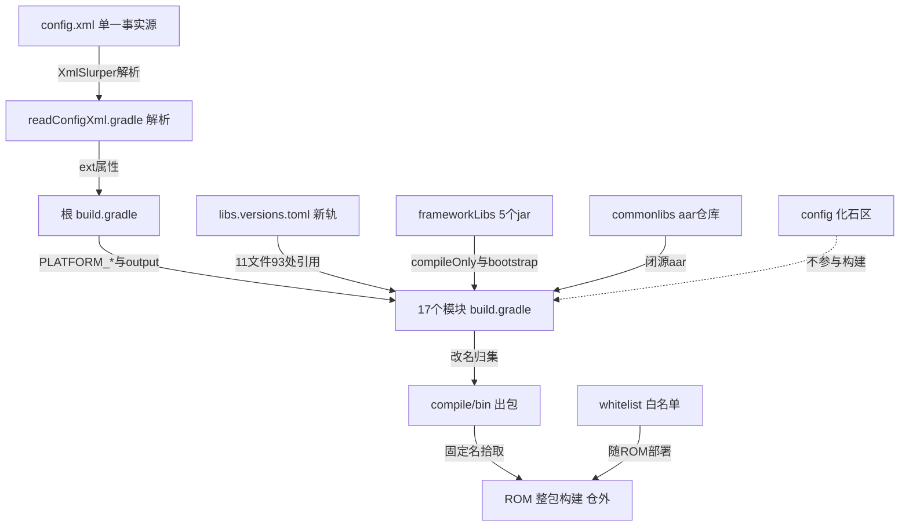

# 构建体系与工程化解码

> 源码锚点：commit `d653d105f86b946685f3ff5133a3079d718d7882`（main）｜ 生成：2026-09-06 ｜ 范围：构建体系、config/、whitelist/、Docs/ 工程实践（批次 5 之一，收官）
> 上游文档：[ARCHITECTURE.md](ARCHITECTURE.md)（全局地图与主链路）

## 1. 构建体系总览卡片

**职责**：为雅迪车机 ROM 定制系统应用的多模块 Gradle 工程——`config/config.xml` 当"单一事实源"统一下发 SDK 版本与平台签名，把 8 个 app 编译成平台签名的 APK 归集到 `compile/bin/`，配套 privapp 白名单作为 ROM 集成交付物。

**对外接口**（开发者须知）：
- **加模块**：`settings.gradle:1-20` 手工 include + 模块自建 build.gradle。不碰 config.xml 版本表（26 项是化石）。
- **出包**：`./gradlew :application:XXX:assembleDebug|Release` → 根级 `output()`（build.gradle:77-97）改名 `NsrXxx.apk` 并 copy 到 `compile/bin/`（实证存在 `NsrLauncher.apk`，671MB——kanzi kzb 不压缩的预期结果）。
- **切签名**：唯一切换点 `config/config.xml:67-74` 签名四字段（本轮 sed 验证：keyAlias=yadeakey、密码 `yadea2026` 明文）→ `readConfigXml.gradle:87-90` → 根 build.gradle:38-41 注入 `PLATFORM_*`。

**关键机制**：⚠ ① 根级普通 `def output()` 被 12 个模块 22 处跨脚本调用——依赖 Groovy 方法派发沿工程层级回溯的**灰色用法**（实证有效，别"修复"除非全量回归）；② debug/release 共用同一把平台签名（8 app 双 signingConfig 四字段全同）——**这是 priv-app 的功能需求而非疏忽**：签名不同将被 PackageManager 拒授 signature 级权限且无法覆盖安装；③ `config/` 整目录是他项目（Neusoft 前项目）快照，只有 config.xml/readConfigXml/utils.gradle/spotbugs-variants/platform.jks 被现行构建引用；④ Gradle 7.5 + AGP 7.4.0，而化石 config/build.gradle 是 AGP 4.1.1——误在 config/ 下构建必炸。

**雷区**：别动 gradle.properties:25-28 的空 `PLATFORM_*` 占位（运行时被覆盖）；别把 config/ 下非 config.xml 文件当本项目配置改；别 include Weather（`jvmTarget '17'`（:60，本轮验证）与 IDE JDK 11（.idea/gradle.xml）不兼容——这正是它被移出的合理解释 [inferred]）；platform.jks 密码明文与 insta360 maven 凭据（build.gradle:56-59）是"已知且被接受"的债务。

## 2. 结构图

本图回答：**配置如何流向模块、产物如何流向 ROM、哪些东西不参与构建**。不包含：模块内部依赖细节（见 ARCHITECTURE §3）。

图例：矩形 = 配置/工程节点；实线 = 构建/交付流；虚线 = 明确不参与。`FOSSIL` 含 config/settings.gradle、config/build.gradle(AGP 4.1.1)、findbugs-3.0.1 发行版、bat/vbs/py 邮件链。

## 3. 配置生效面清点表（核心交付——回答"哪个配置敢动、哪个别碰"）

| 配置项/文件 | 声明处 | 实际消费方 | 生效状态 |
|---|---|---|---|
| config.xml compileSdk=33 / buildTools=33.0.1 / targetSdk=33 | config.xml:4-8 | 17 模块 `project.xxx` | **生效** |
| config.xml minSdk=26 | config.xml:7 | 13 模块（Launcher/Setting/Vlog 硬编码 28、Applib 21） | **半生效**（漂移） |
| config.xml versionCode.default | config.xml:9-10 | 仅 Applib:13 一处 | **半生效** |
| config.xml 26 项 versionCode/versionName 表 | config.xml:9-65 | 解析后**零消费**（grep 无 vCode/vName 消费点） | **化石** |
| config.xml 签名四字段 | config.xml:67-74 | 根 build.gradle:38-41 → 全部 app | **生效**（⚠明文密码） |
| config.xml minifyEnabled / output.path / compileOptions / buildMode / appcompat 22.0.0-alpha1 | config.xml:76-91 | 解析后零消费（output.path 被硬编码重现于 build.gradle:88） | **化石** |
| gradle.properties 空 PLATFORM_* | :25-28 | 被根 build.gradle:38-41 覆盖 | **化石/误导** |
| gradle.properties AndroidX/Jetifier/JDK17 flags | :9-22 | AGP/daemon | **生效** |
| libs.versions.toml | gradle/ | 93 处/11 文件；Launcher/DebugTools/AdaptApi/Applib/Carlib/SystemUIService **6 文件零引用** | **半生效**（双轨） |
| 根 build.gradle 仓库列表（aliyun/jitpack/insta360 凭据/jcenter） | build.gradle:6-61 | 依赖解析 | **生效** |
| 根 build.gradle `output()` | build.gradle:77-97 | 12 模块 22 调用 | **生效**（⚠跨脚本灰用法） |
| 根 build.gradle framework 注入 | build.gradle:63-71 | 全部工程 | **半生效**（:65 Windows 反斜杠无效；compileOnly 注入有效；真通道是 5 个模块的 bootstrapClasspath 前插） |
| config/spotbugs/variants.gradle | build.gradle:107 | 聚合**空任务**（apple/blackberry 幽灵 flavor，全仓 0 个 productFlavors） | **半生效（空转）** |
| config/spotbugs/spotbugs.gradle | 无 apply 点（唯一接线在 config/build.gradle:91 被注释） | 无 | **化石** |
| build_findbugs.xml + findbugs-3.0.1 完整发行版 | 根与 config/ 双份；gradle 侧引用全被注释（build.gradle:99-104）；excludeFilter 文件缺失；android.jar 指向 /opt/sdk android-29 | 无 | **化石** |
| build_pmd.xml | 指向吉利 CI 绝对路径 /home/fe6-version/... | 无 | **化石** |
| compileDebug.bat / sendCompileResultMail.vbs（主题"[KC-2]编译结果"）/ mailList.xml（8 主送+10 抄送 @neusoft.com） | config/ | 无 | **化石**（吉利 KC-2 Jenkins 遗产） |
| autoVersionInfo.py | Python 2（print 无括号） | 无钩子 | **化石** |
| config/local.properties（ndk r23b/cmake） | **被 git 跟踪**（根 local.properties 恰当地被忽略） | 无 native 构建 | **化石** |
| update_framework_jar.sh | 手工执行 | 从 AOSP 源码树同步 framework.jar/android.car.jar | **半生效**（活的手工链） |
| lintOptions 全关 | build.gradle:120-131 | 所有模块 | **生效**（质量闸门 OFF） |
| whitelist/ 9 个 privapp 白名单 | whitelist/ | ROM 集成消费（仓库内无人验证） | **半生效**（交付物） |
| gradle-wrapper 7.5（腾讯镜像） | gradle-wrapper.properties | 全构建 | **生效** |

**速答**：敢动——toml 加新依赖、自己模块依赖块、whitelist 按评审增删、Docs；别碰——config.xml 签名四字段、config/ 下非 config.xml 文件（另一个项目）、gradle.properties 的 PLATFORM_*、settings.gradle 已注释的 Weather/DebugTools（include 即编不过）、根 build.gradle:63-71 注入块。

## 4. 模块 build.gradle 共性表

共性：8 app 全部 platform 双签名同指 platform.jks、全部 `minifyEnabled false`、产物 Nsr 前缀（Neusoft 血统）。

| 模块 | 依赖组件 | 特殊配置 |
|---|---|---|
| BTMusic | CommonTools、Carlib | iml 改写 task；framework_bluetooth compileOnly |
| BTPhone | Applib、Carlib、CommonTools | bootstrapClasspath 前插（:82-94）；创达 CarPlay（:104）；lombok |
| Launcher | AdaptApi(⚠零引用)、Carlib、CommonTools、Hardwarelibs | minSdk 硬编码 28（:23）；abiFilters arm64+x86；kanzi packaging；**零 libs. 引用**；force annotation |
| Setting | AdaptApi(⚠)、Carlib、CommonTools、Hardwarelibs | minSdk 28；bootstrapClasspath（4 jar）；versionName 带编译时刻 → 产物名不可复现 |
| SystemUI | Hardwarelibs、Carlib、CommonTools、SystemUIService、Applib(api) | bootstrapClasspath；abiFilters armeabi；datastore/dagger/lottie |
| Vlog | Carlib、Hardwarelibs、CommonTools、CarSettingLib | minSdk 28；insta360 SDK（吃根级凭据）；kotlin stdlib force |
| EnergyManagement | CommonTools、Carlib | vendor.hardware.tbox jar |
| AccountCenter | CommonTools | bootstrapClasspath；Room(kapt)；zxing；唯一 lint-baseline |
| Weather（未 include） | CommonTools | jvmTarget '17' + Java 1_8 混配；`'\\commonlib'` Windows 反斜杠 fileTree |
| DebugTools（未 include） | 无 | 无 namespace（manifest package） |
| Applib | 无 | minSdk 硬编码 21；rxlifecycle2 老栈；`libs\\platformservicecustomjar.jar` Windows 路径（:82，Linux 静默丢弃依赖，文件在但路径错） |
| AdaptApi | 无 | 24 域 srcDirs；**permision 拼写错误（:28）→ permission 域 4 类从未编译**；jar 导出 task |
| CommonTools | 无 | libs bundles 转发；**debug+release 都 minifyEnabled true**（全仓唯一） |
| Hardwarelibs | 无 | Java 11 + jvmTarget 11；DBFlow |
| Carlib | 无 | android.car compileOnly；maven-publish 插件但无 publishing 块 |
| CarSettingLib | 无 | Java 11；namespace=`com.android.car.settings`（系统包名） |
| SystemUIService | 无 | bootstrapClasspath；kotlin-stdlib 1.6.21（与全局 1.9.0 混） |

**漂移汇总**：minSdk 26（config.xml）→ 实际 13 模块跟 26、3 app 硬编码 28、Applib 21——[inferred] 28 对应实际车机 ROM，26 是母项目遗留；compileSdk 33 全局统一。Java 版本混用：Java 8 为主 + Java 11（Hardwarelibs/CarSettingLib）+ Weather 的 17（不参与构建）+ IDE JDK 11——互相矛盾但互不引爆。

## 5. 工程实践画像

1. **权限画像**：9 份白名单合计 278 个唯一权限；SystemUI 独占 147 条、btmusic 56 条、launcher 33 条（含 INSTALL_PACKAGES/INTERACT_ACROSS_USERS_FULL）；energymanagement 仅 3 条（最小交付）；⚠ `ecarx.permission.PUSH` 仅出现在 btmusic.xml:35——[inferred] ECARX 项目复制残留；autoweather 白名单对应已冻结的 Weather——白名单比构建多覆盖一个包。DebugTools 无白名单（非 priv-app）。
2. **质量工具链三层全断**：Lint 全局关（abortOnError false）；SpotBugs 空转（幽灵 flavor + 空聚合任务 + 真正挂任务的 spotbugs.gradle 从未 apply）；FindBugs/PMD 纯化石（Ant 时代，excludeFilter 缺失）。**当前唯一的"质量闸门"是 NOSONAR 之外的人工评审**。
3. **CI 现状**：无 .gitlab-ci.yml、无 Jenkinsfile——纯人工 + GitLab MR（近 30 条提交 15 条 merge）；旧链（Outlook COM 邮件/KC-2 主题）整体死亡。
4. **commit 规范**：业务提交 100% `[type][yadea][模块][SIR-单号]`；type 拼写漂移（bugfix 11 / fixbug 3）；五段式正文（what/why/how/影响等级/测试范围）存在但执行率约一半且只覆盖部分作者。
5. **Docs 实践**：按日期归档的 Excel 评审记录 + App/服务端 Checklist（制度化）；`Docs/superpowers/specs/2026-07-26-btphone-pbap-and-call-capacity-design.md`（262 行标准设计文档，AI 辅助工作流留档）；Kanzi javaIF.xml 数据源接口定义 + Chery_E0V 接口 xlsx（OEM 契约文档入库）；根目录 `输出表格/` 测试矩阵（Office 锁文件还在——测试与开发同仓）。
6. **仓库史**：1125 commits 全部始于 2026-06-25 Initial commit——**代码老、仓库新**：多年存量代码迁入新 GitLab。

## 6. 看着糟但其实没问题

1. **platform.jks 密码明文**（config.xml:70-72）——旧判（已修正 2026-09-06 深挖轮）：原判"平台签名只在定制 ROM 闭环有意义，非高危泄露"**作废**。实测构建出包后 `apksigner verify` + `keytool -list` 双证据链确认：证书 Owner=`CN=Android, Mountain View`、SHA-256 `C8A2E9BC…192AB8` 与业界公开的 **AOSP platform testkey** 完全一致——证书本体全世界公开，任何人可签出同签名等级 APK；privapp 信任链强度取决于 ROM system 分区的签名（详见 [Cross-cutting-横向专题.md](Cross-cutting-横向专题.md) §1）。重定性：**量产前必须换正式 key 的阻断项**（应用侧换签只需改 config.xml 四字段，设计已支持）。
2. **insta360 maven 凭据明文**（build.gradle:56-59）——`insta360guest` 字样表明是厂商公开只读访客账号 [inferred]，真实风险低；但在 allprojects 块意味着每个模块都带这个仓库。
3. **`def output()` 跨脚本调用**——不合规但实证有效（compile/bin 有 2026-08-20 产物）。
4. **build.gradle:65 Windows 反斜杠 bootclasspath**——无效参数被 5 个模块的 bootstrapClasspath 前插兜住，产物不受影响。
5. **config/ 整目录化石 + findbugs-3.0.1 完整发行版入库**——不参与现行构建，只是体积与噪音。
6. **Launcher 671MB APK**——`noCompress 'kzb'` 的预期结果，3D 资产形态问题而非构建 bug。

## 7. 开放问题

1. `platform_chery.jks`（全仓零引用，12 个候选密码均打不开）是否 Chery OEM 变体预留（呼应 Docs/Chery_E0V xlsx）？切签名流程是否就是改 config.xml:71？
2. `config/` 能否整体瘦身（保留 config.xml/readConfigXml/utils.gradle/spotbugs-variants/platform.jks/脚本归档）？需确认无外部打包机引用 compileDebug.bat。
3. minSdk 28 硬编码 vs config.xml 26 的分歧是历史遗留还是 ROM 要求？统一后是否改变合并 dex 语义？
4. SystemUI 白名单 147 条权限、`ecarx.permission.PUSH` 是否真被使用？
5. 近期只产出 NsrLauncher.apk——全量 8 包的出包命令与打包机产物目录约定是什么？
6. config.xml 版本表里的 AppStore/JOOX/OTA/SmartCore 等母项目模块是否还有第二个仓库与本仓共享 config.xml 模板？
