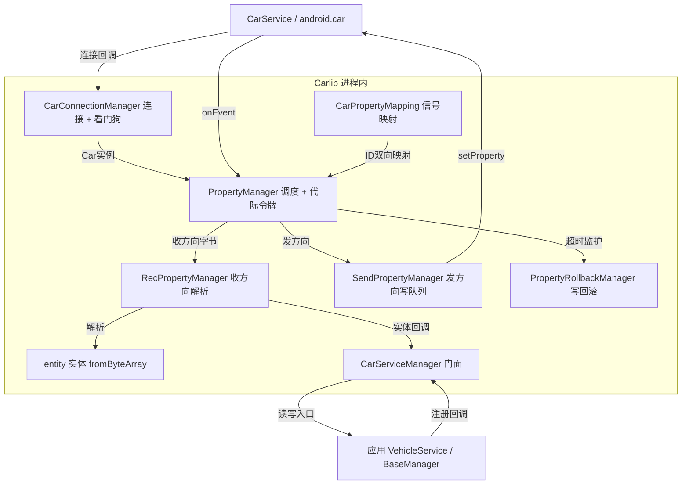

# Carlib 架构解码（component/Carlib）

> 源码锚点：commit `d653d105f86b946685f3ff5133a3079d718d7882`（main）｜ 生成：2026-09-06 ｜ 范围：子系统 component/Carlib（全项目数据枢纽，第一批深解码）
> 上游文档：[ARCHITECTURE.md](ARCHITECTURE.md)（全局地图与主链路）

包名 `com.neusoft.libcar`，33 个主源码文件（Kotlin），零第三方依赖（只依赖 compileOnly 的 `android.car.jar`，`component/Carlib/build.gradle:54`）。

## 1. 模块卡片

**职责**：把 Android Automotive 的 CarPropertyManager 收发模型封装成"信号 ID 字典 + 实体解析 + 可靠性保障"的应用侧 SDK——全项目车辆数据的唯一入口。

**对外接口**（caller 必须知道什么）：
- 门面 `CarServiceManager`：`getProperty` 按线程分流（主线程只读缓存）`CarServiceManager.kt:241-248`；`setProperty` 带回滚写；生命周期监听注册。
- 业务回调 `ICarPropertyEventCallback`（注意：**文件名是 `ICarPropertyCallback.kt`，接口真名带 Event**，`callback/ICarPropertyCallback.kt:3`）：`onChangeEvent(AppCarPropertyValue<*>)` / `onErrorEvent` 两个重载（默认实现委托）。
- 信号字典 `CarPropertyIds.kt`（2362 行）：自定义分段信号 ID，每信号注释含方向（SOC→MCU / MCU→SOC）、单位、精度、读写权限、对应实体类。
- 错误模式：Car 未就绪时注册暂存 `pendingCallbacks`，连接后补注册；主线程读可能返回缓存旧值（见雷区）。

**关键协作**：被几乎所有 application 依赖（SystemUI/Launcher/Setting/BTPhone/BTMusic/EnergyManagement/Vlog）；`linux/modes.kt` 的 L2A 指令 bean ⚠ 无调用方。

**设计动机**：把 CarService 连接的一切脆弱性（断连、内部锁竞争、过期异步回调、写失败）收进一个模块，应用只见稳定门面。直接证据是防御性代码的注释密度：`CarConnectionManager.kt:86-88`"Car.isConnected 也可能竞争 Car 内部锁，健康检查不能占用主线程"、`PropertyRollbackManager.kt:53`"必须先建立 pending 状态再投递异步写，避免车辆回调先到而无法清理超时任务"、`PropertyManager.kt:49-54` 代际令牌注释完整写出要防的 bug。[inferred] 信号语义（ID/字节域/换算）与传输（连接/队列）同模块而不拆，是因为车型迭代时两者一起变。

**雷区**：
1. 主线程 `getProperty` 返回缓存值——新注册信号的首读可能是 null/旧值，业务必须依赖回调。
2. `CarConnectionManager.release()` 清空全进程业务 listeners（`CarConnectionManager.kt:390-414`）——单业务误调殃及全局，注释已警告但 API 无保护。
3. 五条专用线程（§5.1）——跨线程调 Car API 是主要踩坑源。
4. `CarConstants.INVALID = 0xFF` / `INVALID_INT = 0xFFFF`（`CarConstants.kt:8-11`）——无效值是协议值不是 null，业务判断要用范围而非 null 检查。

## 2. 内部结构图

本图回答：**一个信号从 CarService 到业务回调经过谁、一个写指令怎么出去**。不包含：线程内部细节（§5.1）与协议字段（§5.3）。

图例：矩形 = 类；实线 = 调用/数据流。`CarServiceManager` 与 `PropertyManager` 均为单例（object），箭头方向即调用方向。

## 3. 核心类深卡片

### CarConnectionManager（manager/CarConnectionManager.kt，object 单例）

**职责**：进程唯一 Car 连接的持有者与守护者——建立/重建 `Car` 实例、统一派发生命周期事件、看门狗识别"静默断连"。
**协作者**：被各应用 BaseManager 经 lifecycle listener 注册；向下把 `Car`/`CarPropertyManager` 交给 PropertyManager（结构图 CCM→PM 边）。
**设计动机**：CarService 连接有三个现实矛盾——①createCar 慢且可能竞争 Car 内部锁 → 连接操作进专用单线程 `CarConnectionWorker`（`CarConnectionManager.kt:73-75` 附近常量与 executor）；②框架的自动重连与业务感知可能不一致 → 看门狗 20s 巡检 × 连续 3 次"静默断连"才介入，且先查 `isConnecting` 避免打架（`CarConnectionManager.kt:29-38` 阈值常量 `WATCHDOG_INTERVAL_MS/SILENT_DISCONNECT_THRESHOLD/INIT_GRACE_MS`，86-96 巡检实现）；③健康检查本身会抢锁 → 后台线程执行（86-88 行注释）。
**不变量**：连接状态变更全部经 CarConnectionWorker 串行执行；listeners 的增删与遍历在 `synchronized(this)` 下；旧 Car 实例的迟到回调按代际/stale 过滤；init 宽限期 60s 内看门狗不介入。

### PropertyManager（manager/PropertyManager.kt，object 单例）

**职责**：属性收发总调度——回调注册表、暂存注册、App 信号 ID ↔ VehiclePropertyIds 映射分发、收发两向委托。
**协作者**：上承 CarConnectionManager 的 Car 实例，下分 RecPropertyManager（收）/SendPropertyManager（发）/PropertyRollbackManager（写监护）。
**设计动机**：①多个 CarServiceManager 实例各自独立注册/注销 → `callbackRegistry: Map<callback, MutableSet<Int>>` 反查表（`PropertyManager.kt:58-60` 注释明示用途）；②异步初始化回填会迟到 → `connectionGeneration` 代际令牌，连接/断连自增，回填前校验丢弃过期回调（48-55 行注释完整写出要防的"断连后过期 post 把 isServiceConnected 错误置回 true"）；③重连后业务无感 → 依赖 registerCallback 幂等性全量补注册（L155-164）。
**不变量**：注册/注销经 `CarPropertyOperation` 单线程 executor 串行执行（L72-74）；回调最终统一切主线程（notifyCallback L223 附近）。
**雷区**：`callbackRegistry/pendingCallbacks` 是普通 `mutableMapOf`（L58/L63），写点分散在主线程与断连路径且未同步——并发窗口小但存在（开放问题 §7）。

### CarServiceManager（manager/CarServiceManager.kt，应用可见门面）

**职责**：应用侧唯一入口——三种读法（主线程缓存/后台阻塞/异步补拉）、带回滚写、生命周期监听分发。
**协作者**：应用 BaseManager ↔ PropertyManager；主链 §4.1/4.2（ARCHITECTURE.md）的进出两端。
**设计动机**：主线程 Binder 读会 ANR 且可能抢 Car 内部锁 → `getProperty` 按 `isMainThread()` 分流（`CarServiceManager.kt:241-248` 本轮 sed 验证：主线程 `getCachedProperty`，否则 `getPropertyBlocking`）；缓存未命中不能打爆 Binder → `pendingCacheReads.putIfAbsent` 防重复补拉 + 2s 重试节流（L489-520）。
**不变量**：主线程永远不做阻塞 Binder 读；属性缓存 `ConcurrentHashMap`，断连时清空。

### RecPropertyManager（manager/RecPropertyManager.kt，收方向）

**职责**：MCU→SOC 原始字节 → 实体解析 → 业务回调。
**协作者**：entity 各 `fromByteArray`；版本号/VIN 走 LV 长度前缀解析（handleVersionInfoProperty L155-182）、数字钥匙 AES 密钥 16B（handleDigitalKeyProperty L387-402）、自动测试协议（L371-381）。
**设计动机**：定长校验先于解析——`TripData.kt:106-109` `size != 17` 直接返回默认值，宁可显示无效值不给错值（与 `CarConstants.INVALID_STRING="--"` 展示约定配套）。
**不变量**：所有实体解析是无符号读（ext/DataExt.kt 的 readUInt16/readUInt32），大端字节序。

### SendPropertyManager（manager/SendPropertyManager.kt，发方向）

**职责**：SOC→MCU 写指令的串行队列——保持业务侧下发顺序、可观测、断连自清。
**协作者**：HandlerThread `CarPropertyWrite`（`SendPropertyManager.kt:26-34` 本轮 sed 验证：lazy 单线程 HandlerThread）；上接 PropertyManager，下出 CarService。
**设计动机**：CAN 写顺序有业务语义（先设置再确认）→ 单线程串行是唯一保序方案；排障需要 → 每笔记录排队耗时 queueDelayMs/执行耗时 durationMs，≥500ms 慢写告警（L150-192）；断连瞬间过期指令不能下发 → `removeCallbacksAndMessages(null)` 丢弃（L215-221）。
**不变量**：单 HandlerThread 串行；写顺序 = 入队顺序；断连清队。

### PropertyRollbackManager（manager/PropertyRollbackManager.kt，写监护）

**职责**：写指令 1s（`ROLL_BACK_TIME`，L20）无车辆回读 → 用 originalValue 回调 UI 回滚，防"假成功"。
**协作者**：ConcurrentHashMap `pendingOperations`（L22）；主线程 Handler（L23）派发超时任务。
**设计动机**：车辆回调可能先于"写后置 pending"到达 → 注释明示顺序约束"必须先建立 pending 状态再投递异步写"（L53，本轮 sed 验证）；postDelayed 失败也要清 pending（L60-61 附近），不留孤儿表项。
**不变量**：同一 propertyId 重复写先 cleanUp 旧任务（L51）；pending 建立与超时任务同帧完成。
**雷区**：依赖主线程 Handler——主线程繁忙时回滚与超时判断都会延迟（非正确性问题，是及时性问题）。

## 4. 全类职责表

覆盖率：**33/33 主源码文件 = 100%**（跳过：`src/androidTest/.../ExampleInstrumentedTest.kt` 模板测试代码 1 个）。加粗 = §3 深卡片。

| 类 | 一行职责 | 关键协作 |
|---|---|---|
| **manager/CarConnectionManager** | 进程唯一 Car 连接持有者：专用线程建连、看门狗区分静默断连与框架重连、生命周期统一派发 | PropertyManager；各应用 BaseManager |
| **manager/PropertyManager** | 收发总调度：回调注册表 + 暂存注册 + App ID↔Vehicle ID 映射 + 代际令牌丢弃过期回调 | CarConnectionManager、Rec/Send/Rollback |
| **manager/CarServiceManager** | 应用可见门面：主线程缓存读/后台阻塞读分流、带回滚写、生命周期监听 | 应用 BaseManager ↔ PropertyManager |
| **manager/RecPropertyManager** | 收方向：原始字节按定长/LV 校验解析成实体后回调业务 | entity.fromByteArray、ByteUtil |
| **manager/SendPropertyManager** | 发方向：HandlerThread 串行写队列保序，记录排队/执行耗时，断连清队 | PropertyManager、CarService |
| **manager/PropertyRollbackManager** | 写指令 1s 无回读则用原始值回滚 UI，pending 先于异步写建立 | SendPropertyManager、业务回调 |
| map/CarPropertyMapping | App 层信号 ID ↔ VehiclePropertyIds 的双向映射表（含 sendId/recId/sendType/recType） | PropertyManager |
| map/CarPropertyIdWrapper | 单个信号的收发 ID/类型四元组包装（sendId/recId 默认 NOT_EXIST） | CarPropertyMapping |
| CarPropertyIds | 信号 ID 字典：分段编号 + 每信号的方向/单位/精度/读写注释——协议文档即代码 | 全模块、全部应用 |
| CarConstants | 车辆常量总集：无效值哨兵（0xFF/0xFFFF/--）+ 单位/状态嵌套 object（胎压单位、速度单位、LDW 状态…） | 全模块 |
| CanSignalConstants | CAN 开关量字面量（0=关/1=开） | RecPropertyManager、实体 |
| callback/ICarPropertyCallback.kt | 业务回调接口 `ICarPropertyEventCallback`：onChangeEvent/onErrorEvent（文件名与接口名不一致） | PropertyManager → 应用 |
| ext/DataExt.kt | ByteArray 无符号读扩展：readUInt16/readUInt32/toUnsignedInt | 全部实体 |
| utils/ByteUtil | 大端字节合并 + LV 长度前缀版本号解析 | RecPropertyManager |
| utils/ProtocolUtil | 信号物理量换算：精度/偏移/无效值（胎压 raw×2.745、车速 raw×0.05625、温度 temp×0.5−40）⚠部分注释与实码不符（§7） | RecPropertyManager、实体 |
| utils/GenericPool | CAS 无阻塞对象池 `AutomotivePool<T>`：池满降级新建、永不等待 | 各实体的 companion Pool |
| utils/Logcat | 模块日志门面 | 全模块 |
| linux/modes.kt | L2A JSON 指令 bean + sessionId 位编码（信号 ID 编进高 16 位）⚠无调用方 | 无（预留/死代码） |
| entity/AppCarPropertyValue | 业务属性值载体：propertyId/areaId/status/timestamp/value 泛型封装（status 三态：AVAILABLE/UNAVAILABLE/ERROR） | 回调链全程 |
| entity/TripData | 行程报文（17 字节定长）：本次/小计里程/时长/均速/能耗解析 ⚠getIfcDisplay 疑似引用错字段（§7） | RecPropertyManager、EnergyManagement |
| entity/OdoData | 总里程报文解析 | RecPropertyManager |
| entity/HEVTripData / HEVOdoData | HEV 工况的行程/里程报文变体 | RecPropertyManager |
| entity/InstrumentSpeed | 仪表车速报文：speed 0~240km/h（无效 0xFF）+ 单位字节 | RecPropertyManager |
| entity/TireStatus | 胎压/胎温报文（raw×2.745 换算在 ProtocolUtil） | RecPropertyManager、ProtocolUtil |
| entity/Radar | 雷达障碍物报文 | RecPropertyManager |
| entity/SteeringAngle | 方向盘转角报文 | RecPropertyManager |
| entity/EngineSpeed | 电机/发动机转速报文 | RecPropertyManager |
| entity/AesPassword | 数字钥匙 16 字节 AES 密钥报文 | RecPropertyManager（handleDigitalKeyProperty） |
| entity/TBoxTime | TBox 时间报文 | RecPropertyManager |
| entity/CanStatus | CAN 通道状态报文（16 字节，bCan/pCan），自带 AutomotivePool 池 | RecPropertyManager、GenericPool |
| entity/AppointmentChargeTimeData | 预约充电时间报文（时/分） | RecPropertyManager、EnergyManagement |
| entity/AppointmentBatteryHeatTimeData | 预约电池加热报文（2 字节：startHour/startMin） | RecPropertyManager |

跳过清单理由：androidTest 模板测试（1 个，无断言价值）。[inferred] 标注：HEV 系列与 TBoxTime 的字段级描述基于类名与同族实体模式，未逐字段核对。

## 5. 关键机制

### 5.1 线程模型（五条专用线程，各司其职）

| 线程 | 载体 | 职责 | 为什么单独存在 |
|---|---|---|---|
| CarConnectionWorker | 单线程 executor | 串行 createCar/disconnect | Car 操作有内部锁，避免竞争（`CarConnectionManager.kt` 注释） |
| CarPropertyOperation | 单线程 executor | 串行注册/注销 Binder 调用 | 依赖 registerCallback 幂等性，顺序不可乱 |
| CarPropertyWrite | HandlerThread | 串行写队列 | 保信号下发顺序（`SendPropertyManager.kt:26-34`） |
| CarPropertyRead | HandlerThread | 阻塞读 | 只允许后台线程阻塞读（`CarServiceManager.kt:241-248` 分流） |
| 主线程 | —— | 回调统一切主线程（notifyCallback）、回滚超时任务 | UI 消费约定 |

### 5.2 可靠性四件套（该模块的教学价值核心）

1. **看门狗**：20s 巡检 × 连续 3 次静默断连 → 强制重建；60s init 宽限期；与框架自动重连互斥（先查 isConnecting）。
2. **代际令牌**：`connectionGeneration` 每次连接状态变化自增，异步回填校验后丢弃过期回调。
3. **写超时回滚**：pending 先于异步写建立，1s 无回读用 originalValue 恢复 UI——"写出去"不等于"成功了"。
4. **主线程零 Binder 读**：缓存 + putIfAbsent 防重复补拉 + 2s 节流。

### 5.3 协议解析（为什么没有 protobuf/CRC）

车辆属性模型天然分帧（一个 CarPropertyValue = 一帧），分帧/CRC 由 MCU 与 Vehicle HAL 层完成，应用层只剩：定长校验（`size != 17` 返回默认值）、无符号大端读、精度/偏移换算、LV 长度前缀字符串（版本号/VIN）。**协议知识全部内嵌在 `CarPropertyIds.kt` 注释 + `ProtocolUtil.kt` 换算函数 + 实体 `fromByteArray` 三处，代码即协议文档。**

## 6. 看着糟但其实没问题（Carlib 局部）

1. **实体类手写逐字段解析而非 protobuf**——CAN 信号域天然定长大端、字段数少且带协议注释需求，手写最直接可调试；引入序列化框架反而丢失"注释即文档"。
2. **每个实体自带 companion 对象池**（如 CanStatusPool）——CAN 信号回调频率高，复用实体避免 GC 抖动，与 `GenericPool` 的 CAS 无锁设计配套；代价是实体从不可变变可变（data class var 字段），可接受。
3. **`CarServiceManager.recovery()/hevRecovery()` 整段注释保留**——[inferred] 功能暂缓而非废弃，保留现场便于恢复；属维护噪声但无害。
4. **`linux/modes.kt` 死代码**——sessionId 位压缩设计（信号 ID 编进 64 位高 16 位）有明确的设计意图，[inferred] 预留下一版 L2A 协议；删除前需与 Linux 侧确认。

## 7. 开放问题（Carlib 局部）

- **`TripData.kt:59` `getIfcDisplay()` 返回 `avgFuelTotal` 而非 `ifc`**（本轮 sed 验证）——疑似 copy-paste bug，需协议 owner 确认正确字段。
- **`ProtocolUtil.kt` 注释与实码不符**：轮胎压力注释"偏移量 100"实码 bias=0；室外温度注释"精度 0.05"实码 precision=0.5——哪个对需 CAN 信号表核对。
- **`callbackRegistry/pendingCallbacks` 用普通 mutableMapOf 且写点分散未同步**（`PropertyManager.kt:58,63`）——小概率并发窗口，是否收敛到单线程写待定。
- **`onServiceConnected` 里裸 `Thread{...}.start()`** 未命名未管理——短暂初始化线程，是否并入 CarPropertyOperation 待定。
- **[inferred] 属性缓存无上限/无 TTL**——依赖断连清空与 STATUS_AVAILABLE 刷新，长期运行内存是否可控未验证（车机不重启场景）。
