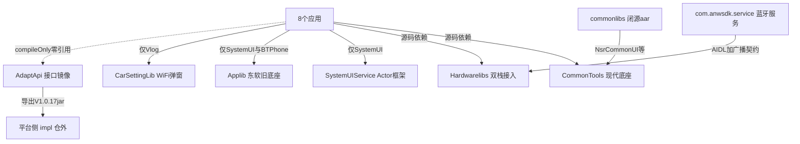

# 六大组件库架构解码（CommonTools / Hardwarelibs / SystemUIService / Applib / AdaptApi / CarSettingLib）

> 源码锚点：commit `d653d105f86b946685f3ff5133a3079d718d7882`（main）｜ 生成：2026-09-06 ｜ 范围：子系统 component/ 其余六库（批次 5 之二，收官）
> 上游文档：[ARCHITECTURE.md](ARCHITECTURE.md)（全局地图与主链路）｜ Carlib 另见 [Carlib.md](Carlib.md)

## 1. 六模块卡片

### CommonTools（com.yadea.common，43 源文件）

**职责**：雅迪自研现代 Kotlin/DataBinding 底座——基类三件套、换肤协议、跨进程用户配置、全套 utils 与车机控件。
**对外接口**：`BaseActivity/BaseFragment<BaseViewModel>` 泛型对（base/BaseActivity.kt:9）、`ChangeSkinManager` 换肤门面、`SeatUserManager`、存储族（SPUtils/SettingsUtils/ShareConfigUtils/SysPropUtils）、工具族（ToastUtils/ThreadUtils/ResourceUtils）。
**关键协作**：⚠ ① 依赖 `commonlibs/NsrCommonUI.aar + VehicleSDK.jar`——它不是最底层；② 用户身份走 Settings.Global（SettingsUtils.kt:31）而非自家 SP；③ `ToastUtils.showMsgICToast` 直接往 **Display ID 2（仪表屏）** 加 `TYPE_APPLICATION_OVERLAY` 窗口（ToastUtils.kt:190-241）——普通工具类干了 SystemUI 的活。
**设计动机**：为 Setting/AccountCenter/Launcher 等新应用服务（git：SRS_UserCenter 系列），与老 neusoft 体系（Applib）并存的新一代底座。
**雷区**：① **library 模块 debug+release 双 `minifyEnabled true`**（build.gradle:22,26，本轮验证）而 proguard 文件全注释——单独打 aar 时 R8 会裁掉反射路径（DataBinding/换肤资源名拼接）；工程内源码依赖时由 app 规则兜底，风险后移；② `SeatUserManager` 每方法重读磁盘（SeatUserManager.kt:72,187,205）——修复 Launcher/Setting 双进程缓存漂移（git 74777571/SIR-3248：Launcher 持 Setting 进程过期缓存致保存被跳过）的刻意设计；③ `Constants.DEBUG = true` 硬编码（Constants.kt:165）。

### Hardwarelibs（com.anwExt.carui + com.yadea.hardwarelibs，147 文件）

**职责**：双栈硬件接入层——AnW 蓝牙芯片栈的"广播契约 + AIDL 网关"，与 wifi/ap/ethernet/mobile 的 Adapter+Proxy+EventManager 网络栈、AOSP Settings 蓝牙栈移植。
**对外接口**：`WxServiceApi.init()/getManager(id)`（api/WxServiceApi.java:9-25，1=wifi 2=ap 3=mobile 4=bt，ManagerFactory.java:20-23）；`BtAnwManager`（bt/anwBt/BtAnwManager.java:141）；`LocalBluetoothManager`（bluetooth/local/）。
**关键协作**：⚠ `AnWBT_Service_Adapter.java` **只有常量**（643 行零方法）——它是与系统侧 `com.anwsdk.service` 服务的**机器可读契约书**（地位等同 proto 文件，回包包名定义在 :5）；`BtAdapter` 反向 `bindService("com.anwsdk.service.anwbtservice")` 注册 AIDL 回调（BtAdapter.java:96-101、:1099-1126）；以太网整个走反射隐藏 API + `java.lang.reflect.Proxy` 伪造 `EthernetManager$Listener`（EthernetManagerProxy.java:47-73）。
**设计动机**：AnW（蓝芯）BT 芯片非标准 Android 栈，厂商服务以 AIDL+广播暴露，本库负责把 Message 翻译成本地广播（BtAdapterMessageHandler.java:81-107）并维护业务态；网络栈复用 AOSP Settings 分层套路。
**雷区**：① `NetworkStateManager.removeFromWeakReferenceList` 是**空操作**（NetworkStateManager.java:128-137，本轮 sed 验证：循环体为空 `if (cmp != null && obj == cmp) { }`——连 remove 都没有）——`removeNetworkChangeListener` 实际无效，监听器泄漏；② 名叫 WeakReferenceList 实为强引用 LinkedList（:19）；③ 本库有自己的 `ThreadUtils.kt`（与 CommonTools 版同名不同实现）——跨库 import 易拿错；④ DBFlow 的 `AppDatabase` 与内存容器 `AnWDatabase/AnWMapDatabase` 同名易混。

### SystemUIService（com.android.ext.systemuiservice，58 文件 + 4 个闭源 aar）

**职责**：轻量 SystemUI 框架层——在无 Activity 的系统服务进程里用 Actor 模式管理系统窗口，AOSP SystemUI 多个机制被移植。
**关键协作**：⚠ 四个闭源 aar（basemanager/localbasemanager/logger/utils）以 **compileOnly** 引入，`AndroidManifest.xml:9-17` 声明的入口服务 `com.androidext.core.init.MainService` **类不在本模块源码中**（require `android.extframework.permission.START_SERVICE`）——"开源壳 + 闭源核"。
**设计动机**：移植 AOSP 的 FragmentHost/Plugin 注解/LeakDetector 是为在车机多窗口环境复用成熟窗口生命周期管理；BaseActor 换肤代码整段注释（BaseActor.kt:89-151）——[inferred] 与 CommonTools 换肤体系重叠被废弃。
**雷区**：窗口 type 硬编码——通知窗 2024/TYPE_NAVIGATION_BAR_PANEL（NotificationWindowManager.kt:36）、快捷窗 TYPE_PHONE + S 以上 FLAG_BLUR_BEHIND（QuickSettingWindowManager.kt:36-51）——依赖 system 进程特权。

### Applib（com.neusoft.applib，78 文件）

**职责**：东软时代老一代应用底座：三套 Base 并存 + RxJava/MVVN 六段式 + 反射导航，被 BTPhone/SystemUI 引用。
**关键协作**：⚠ `api files('libs\\platformservicecustomjar.jar')`（build.gradle:82）**Windows 反斜杠路径**——Groovy 转义后指向不存在的文件名，该依赖在 Linux 构建中被**静默丢弃**（jar 真身在 `libs/platformservicecustomjar.jar`），能编过纯属没人 import 其中的类。
**设计动机**：base/（裸 Activity+堆栈+崩溃落盘）、mvvm/（RxLifecycle+DataBinding 多 VM）、navigation/（Jetpack Navigation 保态）三代演进同仓共存，让不同年代应用各取所需而未收敛 [inferred]。
**雷区**：① KeepStateNavigator 依赖 FragmentNavigator 的 **private 字段 mBackStack、generateBackStackName、mIsPendingBackStackOperation**（KeepStateNavigator.java:69、:87-99、:100），build.gradle 钉死 navigation 2.3.1——升级即 NoSuchField（ReflectionUtils 静默吞异常返回 null → NPE）；② `CarTypeHelper` 还在区分马来西亚 Proton Iriz/Persona（CarTypeHelper.java:5-27）、`TSPHostHelper` 硬编码测试服 IP（:21-24）——移植残留；③ utils 里 `SSLSocketFactoryCompat` 信任所有证书。

### AdaptApi（com.neusoft.xui.adaptapi，269 文件，纯接口头文件库）

**职责**：东软 XUI 平台纯接口 SDK 头文件集（24 域），抽象类工厂 + 接口常量暴露车控/TBox/策略等系统能力；实现类（`*.impl.VehicleImpl`）在平台侧，不在本仓。
**孤岛硬数据**（agent grep + 本轮独立验证）：`import com.neusoft.xui.adaptapi` 全仓命中 297 处**全部位于 AdaptApi 自身**；排除自身后 **0 文件 0 处**——Launcher/Setting 的 `compileOnly project(':component:AdaptApi')`（Launcher/build.gradle:123、Setting/build.gradle:147）是零引用死依赖。但其编译产物导出任务（`AdaptApi_V1.0.17.jar` → compile/libs）暗示真实用户是**平台侧/别的仓**——本仓只是接口镜像，不是死库。
**雷区**：① `sourceSets` 拼写错误 `'JavaHeader/permision/...'`（build.gradle:28，本轮验证）而实际目录是 `permission/`——**permission 域 4 个类从未被编译**；② `dvr/AdaptAPI.java` 与 `base/AdaptAPI.java` 同简单类名不同包（dvr 版 VERSION=1.0.17）——通配 import 必炸；③ 24 域清单与设计模式证据见 §4 表。

### CarSettingLib（com.android.car.settings，4 文件）

**职责**：从 AOSP Car Settings 摘出的 WiFi 网络请求授权弹窗（第三方 `requestNetwork()` 时系统弹配网 UI），去除 car-ui/内部库依赖。
**关键协作**：Manifest 顶层 `sharedUserId="android.uid.system"`（AndroidManifest.xml:3）——合并进宿主后以 system UID 才能反射调 `NetworkRequestMatchCallback` 隐藏 API（NetworkRequestDialogActivity.java:31-33）。
**雷区**：30 秒超时（:42-44）在系统弹窗场景无恢复路径 [inferred]。

## 2. 结构图

本图回答：**六个库各自服务谁、闭源边界在哪、AdaptApi 为何是孤岛**。不包含：Carlib（见 Carlib.md）与各库内部类。

图例：实线 = 真实依赖；虚线 = 声明了但零引用的死依赖（⚠）。AdaptApi 的 compile/libs 导出任务指向平台侧。

## 3. 关键机制（NODE 精选）

1. **反射兜底 Application 上下文**（CommonTools/ContextGet.kt:26-29：`Class.forName("android.app.ActivityThread").getMethod("currentApplication")`）——被 SPUtils/SettingsUtils/ResourceUtils 全链路消费。
2. **资源名拼接换肤协议**（ChangeSkinManager.java:128-131：`resourceIdName += "_" + nowMySkinId`）——skinId=日夜+车型后缀，无资源包热插拔；主动换肤入口全部被注释（:38-79），[inferred] 有意识降级为"只读查询器"，切换改由系统 uiMode 驱动。⚠ 车型枚举仍是福田系残留（FOTON_AUMARK/AOLING/CAVAN，:23-25）。
3. **AtomicFile 用户配置 + 每方法重读磁盘**（SeatUserManager.kt:22-28、:72）——每用户 3 槽、起始位 1/4/7/10/13/16 共 18 槽（:93）；用 I/O 换多进程一致性。
4. **四级存储分层**：SPUtils（Settings 后备）/SettingsUtils（Settings.Global）/ShareConfigUtils（/data/share 按用户 properties）/SysPropUtils（persist.verdor.yadea.cfg.* 车型配置族）。
5. **AnWBT 双通道注册**（BtAnwManager.java:688-699）——SDK 全局广播走 registerReceiver、内部事件走 LocalBroadcastManager，按 action 前缀 `com.anwsdk.service.` 分流（:680-684）。
6. **HFP 重试**（BtAnwManager.java:75-77、:532-562；git 89d9dbf0/SIR-4601 "前后排蓝牙耳机来电双方无声音"）——2 次/2s/60s 窗重置。
7. **AOSP LocalBluetoothManager 移植族**（LocalBluetoothManager.java:17-24 构造链；Profile 按 UUID 懒挂载 LocalBluetoothProfileManager.java:89-110）——13 个 Profile 适配器。
8. **Actor 窗口演员模式**（BaseActor.kt:29-30 `HIDE_ACTOR=1001/DELAY_MILLIS=2000`；isShow 判据 `view.parent != null` :115-118 天然防重；show 一个窗即 post 隐藏其它快捷窗 :85/:110）。
9. **无 Activity Fragment 宿主**（FragmentService.java:36-44、FragmentHostManager.java:64-92）——rootView 缓存 Host，FragmentController 直驱。
10. **AOSP LeakDetector 移植**（LeakDetector.java:28 `ENABLED = Build.IS_DEBUGGABLE`，仅 debug 生效）。
11. **mvvm 六段式多 ViewModel**（Applib/mvvm/view/BaseActivity.java:51-76：ViewModel 数组与 BR id 数组一一对应，长度不匹配 :56-60 直接抛）。
12. **反射保态导航**（KeepStateNavigator.java + TabNavHostFragment.java:11-13 `@Navigator.Name("keep_state_fragment")`；`transaction.setReorderingAllowed(false)` :65 是反射改 backstack 的前提）。

## 4. 类职责表（按深度策略分列）

### CommonTools（43/43 = 100%，无跳过）

| 类 | 一行职责 |
|---|---|
| base/BaseActivity.kt / BaseFragment.kt | DataBinding+泛型 VM 四段式（Fragment 带 isViewCreated/isLoaded 懒加载协议 :64-69） |
| base/BaseViewModel.kt | viewModelScope+全局 CoroutineExceptionHandler 的 `launch()`（:13-23）——异常绝不上抛、不持 Context |
| Constants.kt | TIME/CACHE/ENCODE/VehicleConfig 常量（DEBUG=:165） |
| ContextGet.kt | 反射兜底 Application Context（:24-29） |
| dialog/BaseDialogFragment.kt | 统一 1280x580 wrapper、防 stateLoss 的 show/safeDismiss（:107-174） |
| dialog/EditDialog / TextDialog / WarningDialog | 输入/文本/警告三弹窗 |
| ext/ByteExt.kt / DialogExt.kt | ByteArray hex 与无符号读扩展 / FragmentActivity 快捷弹窗 |
| manager/SeatUserManager.kt | 多账户座椅记忆（AtomicFile，18 槽 6 用户）+ HUD 配置跨进程持久化 |
| skin/ChangeSkinManager.java | 皮肤门面：skinId 拼接 + 资源查找 + 观察者（切换入口已注释降级） |
| skin/ChangeSkinConfig.java / SkinResourceUtils.java | 主题 DTO / getIdentifier+assets json |
| utils/ThreadUtils.java | 二级缓存线程池（type×priority 双层懒建 :975-997）+ Task 七态状态机 + SyncValue |
| utils/LogUtils.java | 阈值日志（e 级无条件 :75-81） |
| utils/SettingsUtils.kt / SPUtils.kt / ShareConfigUtils.kt / SysPropUtils.kt | Settings.Global / SharedPreferences / 按用户 properties / persist prop 四级存储 |
| utils/JWTUtils.kt | 无三方依赖 JWT payload 解析（Base64 URL_SAFE 手动补位 :18-42） |
| utils/ToastUtils.kt | 队列 toast + Display2 仪表屏系统级 toast（:192-265） |
| utils/ResourceUtils / ViewUtils / SwitchHelper / ReboundHelper / LapseTouchHelper | 静态资源 / 500ms 防抖点击 / 协程开关防抖 / 动画任务管理 / 边缘手势 |
| utils/NetworkUtils / NumberUtils / DateUtils / ChineseUtils | 常规工具（单位换算/随机中文名/日期） |
| widgets/SkinSwitchCardView.java | 开关卡片 + 覆盖层二次确认（:24-29、:211-255） |
| widgets/StateLoadingButton.kt / BaseSwitchCompat / CustomSwitchCompat / ImageTextRadioGroup.kt | 四态按钮 / 开关基类与皮肤化实现 / 图文单选组（700+ 行） |
| widgets/LapseTouchLayout / MaxHeightScrollView / RoundImageView / SmartTextView / SquircleImageView | 视图件五件套 |

### Hardwarelibs（核心 62 类入表；85 个纯 DTO/常量归并——`com.anwsdk.service` 包 19 文件中 18 个是 AnWBT_* Parcelable DTO；147/147 全部被分类，覆盖率 100% 分类/42% 逐行）

代表性入表条目（完整表见子代理报告，此处收录主链类）：

| 类 | 一行职责 |
|---|---|
| anwsdk/service/AnWBT_Service_Adapter.java | 与 com.anwsdk.service 的**纯常量契约书**（643 行零方法，回包包名 :5） |
| bt/BtAdapter.java | AIDL 客户端单例：~70 个 AnWBT_* 方法逐一映射 IAnwPhoneLink；BLE 广播报文手工组包（:578-654）；`executeAidl` 统一电源门禁（:133-147 powerStatus!=POWER_ON 返回 DISALLOWED） |
| bt/BtAdapterMessageHandler.java | AIDL Message→本地 ACTION 广播翻译器（:81-107） |
| bt/BtAdapterMessage.java | 应用层 ACTION/常量（687 行）⚠与契约文件双套并存 |
| bt/anwBt/BtAnwManager.java | AnW 蓝牙业务大脑：配对/连接/角色/音量/HFP 重试/SP 持久化/OperationState 六态 |
| bt/anwBt/IAnwBluetoothListener.java | 7 个回调接口 |
| database/DbManager.java / AppDatabase.java | DBFlow CRUD 门面 / @Database 声明 |
| database/AnWDatabase / AnWMapDatabase.java | 按地址分桶的通讯录/通话/短信**内存**容器（⚠与 DBFlow 同名易混） |
| api/WxServiceApi.java / InternalApi / ManagerFactory | 门面 init/getManager/release / SparseArray 缓存（倒序 release）/ id→Class 反射工厂 |
| network/NetworkStateManager.java | ConnectivityManager 回调分发 ⚠remove 空操作（:128-137 已验证） |
| network/wifi/WxWifiManagerI / WxWifiAdapter / WxWifiEventManager | WiFi 门面（开关/扫描/连接/静态 IP/锁）/ WifiManager 动作+反射 connect（:75-118）/ 广播→listener 双线程分发 |
| network/wifi/WifiTracker / AccessPoint / WifiConfigurationProxy | AOSP 扫描聚合/AP 模型/配置代理 |
| network/ethernet/EthernetManagerProxy 等三 Proxy | 隐藏 API 反射 + java.lang.reflect.Proxy 伪造 Listener（:47-73） |
| network/mobile/WxMobileNetworkManagerI 等 | 蜂窝数据开关/状态 |
| bluetooth/local/LocalBluetoothManager.java | AOSP 移植组装根（四管理器构造链 :17-24） |
| bluetooth/local/BluetoothEventManager.java | ACTION→Handler 表→IWxBluetoothListener（synchronized 分发 :114-159；handler 线程可换 :95-100） |
| bluetooth/local/CachedBluetoothDeviceManager / CachedBluetoothDevice | 设备缓存（1119 行大头） |
| bluetooth/local/LocalBluetoothProfileManager.java + bluetooth/profile/ 13 类 | Profile 注册表（UUID 懒挂载 :89-110）+ A2dpSink/Avrcp/HeadsetClient/Map/Opp/Pan/Pbap* 适配器 |
| bluetooth/android/ 16 类 | framework BluetoothXxx 的静态反射适配（hide API 包装） |
| service/LogService.java | 12 个分类日志单例 + 调用点定位（:9-20、:91-101） |
| utils/IntervalDelayedTaskUtil.java | 300ms 节流 + finallyTask 兜底（:56-66、:74-83） |
| utils/ThreadUtils.kt | 自带线程池（8-16 线程 DiscardOldest）⚠与 CommonTools 版同名 |

### SystemUIService（核心类入表；AOSP 移植纯视图/注释类归并）

| 类 | 一行职责 |
|---|---|
| base/IActor.kt / BaseActor.kt | 窗口演员接口/模板（show 互斥事件 :76-101；2s 定时隐藏 :123-128） |
| base/BasicWindowManager.kt / IWindowManager.kt | addView/removeView 通用窗口实现 |
| base/FragmentService.java / FragmentHostManager.java | rootView→Host 缓存；FragmentController 直驱（LeakDetector 埋点 :81） |
| dropdownbar/notification/NotificationController.java | 通知事件 Handler（ListenerService 本体被注释 :46-90——功能上移） |
| dropdownbar/notification/NotificationEntryManager.java | MEDIA/DEFAULT 分桶、排序、createEntry（上限 50 :36-76） |
| dropdownbar/notification/NotificationGroupManager.java / bean/* | 分组逻辑 / Entry 模型 |
| dropdownbar/notification/manager/NotificationWindowManager.kt | type=2024 通知窗 |
| dropdownbar/quicksetting/manager/QuickSettingWindowManager.kt | TYPE_PHONE 全屏下拉窗 + blurBehind |
| navbar|statusbar 的 actor/manager 6 类 | 导航栏/状态栏 Actor 与窗口参数 |
| plugins/{Plugin,PluginListener,annotations,qs/QSTile} | AOSP Plugin 机制注解移植（编译期契约） |
| event/compat/EventBusCompat.kt | EventBus 防重复注册封装 + Show/HideShortcutWindowEvent 互斥事件 |
| utils/leak/ 6 文件 | AOSP LeakDetector 移植族（仅 debug） |
| utils/threadmanager/ 5 类 | 线程分发族（ThreadManager/ThreadPool/HandlerThreadPool/ScheduledThreadPool） |

### Applib（核心类入表；utils 16 个与 view 12 个焦点控件归并）

| 类 | 一行职责 |
|---|---|
| base/BaseActivity.java / ViewManager.java / UncaughtExceptionHandler.java | 裸 Activity+堆栈注册（:12-23）/ Activity 栈+killBackgroundProcesses 退出（:124-134）/ 崩溃写 .trace 后交还系统（:38-54） |
| mvvm/view/BaseActivity.java | 多 VM 注入（数组对齐校验 :56-60，VM 注册为 LifecycleObserver、binding.setLifecycleOwner 支持 LiveData 直绑 XML） |
| mvvm/viewmodel/BaseViewModel.java | ⚠空 hook 的 registerRxBus/removeRxBus（:77-84，接口承诺与实现不符）+ CompositeDisposable |
| mvvm/recyclerview/BindingRecyclerViewAdapter | DataBinding 泛型 RecyclerView 适配器（executePendingBindings） |
| navigation/KeepStateNavigator.java | 保态 Navigator（hide/show 复用 Fragment；反射 mBackStack :69、:87-100） |
| navigation/TabNavHostFragment.java / ReflectionUtils.java | 替换 createFragmentNavigator（:11-13）/ 静默吞异常的反射工具（:24-27 注释自认） |
| navigation/BaseActivity / BaseFragment 等 4 类 | 导航系第二套 Base |
| net/HttpClient.java | OkHttp+Retrofit Builder 门面 + createService 动态代理 |
| security/AES/* + security/MD5 | AES/CBC/PKCS7（salt=packageName） |
| SystemProperties.java | 反射读 prop（:15-26，每方法重复 forName 不缓存） |
| CarTypeHelper / TSPHostHelper / EcarxUrlConfigHelper | 车型判断（⚠Proton 马来西亚残留）/ 环境判断（⚠硬编码测试服 IP）/ ECARX URL |
| base/ViewManager、blur/、svg/、DevicePolicy 等 | 能力工具（归并） |

### AdaptApi（不逐类出表——纯接口无实现，全类表无教学价值；24 域清单）

| 域 | 文件数 | 代表接口 | 设计模式证据 |
|---|---|---|---|
| vehicle | 52 | Vehicle、IDashboard、ISensor、IBcm、ISeat | 反射工厂（Vehicle.java:66-77）；@IntDef+内嵌 Observer（IDashboard.java:50-53、:460-472） |
| tbox | 43 | TBox、TBoxProvider、FotaUpdate*Listener | **两级工厂** TBoxProviderImpl→getTBox（TBox.java:66-77） |
| bt | 26 | Bt、IHfp、IA2dp、IPbap、IGattServer | 抽象门面+回调成对（IHfp/IHfpCallback） |
| policy | 18 | Policy、IAudioPolicy、IStoragePolicy | 抽象类工厂（Policy.java:18-31）+ 音频焦点常量（:14-34） |
| vr | 21 | Vr、VrProvider、17 个 Vr*Listener | 语音域每功能一 listener |
| dvr | 16 | Dvr、IDvrVideoFile、AdaptAPI 本地副本 | ⚠复制 base 类（dvr/AdaptAPI.java:8-12） |
| base | 20 | AdaptAPI、Tribool、IntDef、ErrorCode | 版本门面（AdaptAPI.java:10-13 VERSION=1.18.3） |
| hicar / navigation / device / audio | 15/15/15/11 | HiCar / NoaManager / Device / IEqualizer | listener 成组 / DR 信号接口 / 状态接口 / 常量域 |
| dim_interaction / input / radio / wifiap | 8/7/8/6 | 交互分发/按键回调/收音机 | 各域单门面+回调 |
| hvac/ota/permission/pki/tpms/evs/theme/wpc/btphone | 5/5/4/3/4/3/2/3/3 | 各域门面 | ⚠permission 域因拼写错误从未编译 |

### CarSettingLib（4/4 = 100%）

| 类 | 一行职责 |
|---|---|
| WifiUtil.java | ScanResult 安全类型解析 + WifiConfiguration 组装（AOSP 移植去内库 :10-12） |
| NetworkRequestDialogActivity.java | requestNetwork 授权宿主：反射 NetworkRequestMatchCallback + 30s 超时 |
| NetworkRequestDialogFragment.java | WiFi 选择列表弹窗（MAX 5 条、1s 自动连 :52-53） |
| NetworkRequestDialogErrorDialogFragment.java | 错误/超时弹窗 |

## 5. 核心类深卡片（精选 3 张，其余 4 张要点并入 §3）

### ChangeSkinManager（CommonTools/skin/）

**职责**：日/夜 × 车型二维皮肤维度的单例注册表——把逻辑皮肤 id 映射为"资源名后缀"，负责 color/drawable 动态查找与观察者分发。
**设计动机**：车机需夜间反色 + 多车型，工程上无资源包热插拔 → **同一资源多份拷贝 + 命名约定**；主动换肤入口 `changeSkin` 三方法全被注释（:38-58、:70-79）——[inferred] 有意识降级：现退化为"只读皮肤上下文+查询器"，切换改由系统 uiMode 驱动（SkinSwitchCardView.onConfigurationChanged:346-354）。
**不变量**：`getMySkinId()` 永不为 null（:81-95）；`getResourceId` 对未知类型返回 -1 而非抛异常（:123-142）。

### BtAnwManager（Hardwarelibs/anwExt/carui/bt/anwBt/，1013 行）

**职责**：AnW 蓝牙业务大脑：开关/扫描/配对/连接/角色（前后排主副耳机）/音量，维护 paired/available 双列表与 OperationState 六态。
**设计动机**：SIR-4601（git 89d9dbf0）"前后排蓝牙耳机都连、来电双方无声音——HFP 协议连接不稳定" → `scheduleHfpRetry` 2 次/2s/60s 窗（:75-77、:532-562）；设备能力决定 sink/source 通道 → `ProfileConfig` 表驱动（:387-389）+ `AnW_Determine_Paired_Device_Type` 位掩码判型（:500-530）。
**不变量**：双通道注册（SDK 广播 registerReceiver / 内部事件 LocalBroadcastManager，按前缀分流 :680-699）；unpair 立即乐观移除并持久化（:250-264）；状态机终态由事件 Handler 收敛回 IDLE（:845-848、:929-933）。

### KeepStateNavigator（Applib/navigation/，131 行）

**职责**：`@Navigator.Name("keep_state_fragment")` 自定义导航器：切页只 hide/show 不销毁，Tab 场景保 Fragment 状态。
**设计动机**：Jetpack Navigation 默认每次 replace+重建，车机 Tab 页（音乐/地图状态）不可接受；经典社区方案（反射 mBackStack）落到 navigation 2.3.1（钉版）；singleTop 回退分支完整移植父类私有 `generateBackStackName + popBackStack(INCLUSIVE)`（:80-102）。
**不变量**：`mIsPendingBackStackOperation` 必须与 addToBackStack 成对写（:100、:110）；`setReorderingAllowed(false)`（:65）——反射改动 backstack 的前提是关闭优化。**脆弱性**：升 androidx 版本即 NoSuchField → ReflectionUtils 静默吞掉 → NPE。

（其余深卡片：SeatUserManager 的"每方法重读磁盘换多进程一致性"（git 74777571/SIR-3248 考据）、CommonTools 协程版 BaseViewModel 的"异常绝不上抛"、BluetoothEventManager 的"可换 handler 线程 + synchronized 分发"、BaseActor 的"view.parent 判显隐 + 单飞行定时器"——要点已并入 §3 机制 3/9。）

## 6. 看着糟但其实没问题

1. **CommonTools library `minifyEnabled true`**（build.gradle:22,26 已验证）——单看是雷；但所有消费方以源码 module 依赖，R8 实际只跑在 app 层，library 的混淆配置不生效 [inferred gradle 语义]；真正风险只剩"单独打 aar 发布"一条路径，且无 consumer-rules。
2. **Applib Windows 反斜杠 jar 依赖**（build.gradle:82）——Linux 上静默丢弃，但仓内无人 import 该 jar 的类，只是死配置。
3. **AdaptApi 零 import**——它编译进 `AdaptApi_V1.0.17.jar` 的导出任务表明真实用户是平台侧/别的仓，本仓只是接口镜像。
4. **SeatUserManager 每方法重读磁盘**——多进程一致性的刻意设计（SIR-3248 修复），写路径 @Synchronized + AtomicFile 兜底。
5. **BtAdapter 的 `anw bt not implete yet` 半成品方法**（如 BtAdapter.java:403-405 返回 NOT_IMPLEMENTED）——芯片 SDK 能力边界如实暴露，调用方按错误码分支。
6. **SystemUIService 大段注释代码**（换肤/NotificationListener）——功能已上移到 aar/应用层，注释是证据而非腐烂。

## 7. 开放问题

1. **`removeNetworkChangeListener` 空实现**（NetworkStateManager.java:128-137 已验证循环体为空）——WxWifiManagerI 的移除接口形同虚设，监听器泄漏；修 bug 还是接受，需网络栈负责人确认。
2. **AdaptApi `permission` 域从未编译**（build.gradle:28 拼写已验证）——历史 typo 还是刻意弃用？若平台侧依赖 IPermission，当前 jar 里根本没有它。
3. **CommonTools minifyEnabled true 是谁的需求**——若发布 aar 给第三方需补 consumer proguard（keep DataBinding/换肤反射路径）。
4. **Hardwarelibs 两套蓝牙栈并存**（AnW 契约栈 vs AOSP LocalBluetoothManager 移植栈）——同一台车机上谁在用后者；git cd685d82"副蓝牙通道移除"表明栈正在收敛。
5. **CarSettingLib 最终合并进哪个应用**、`NETWORK_REQUEST` action 由谁发出——跨仓才能闭环。
6. **双蓝牙契约并存**（BtAdapterMessage 687 行 vs AnWBT_Service_Adapter 643 行）——BtAnwManager.addHandler 同时吃两套 action（:111-115），长期应合并为一套翻译层。
