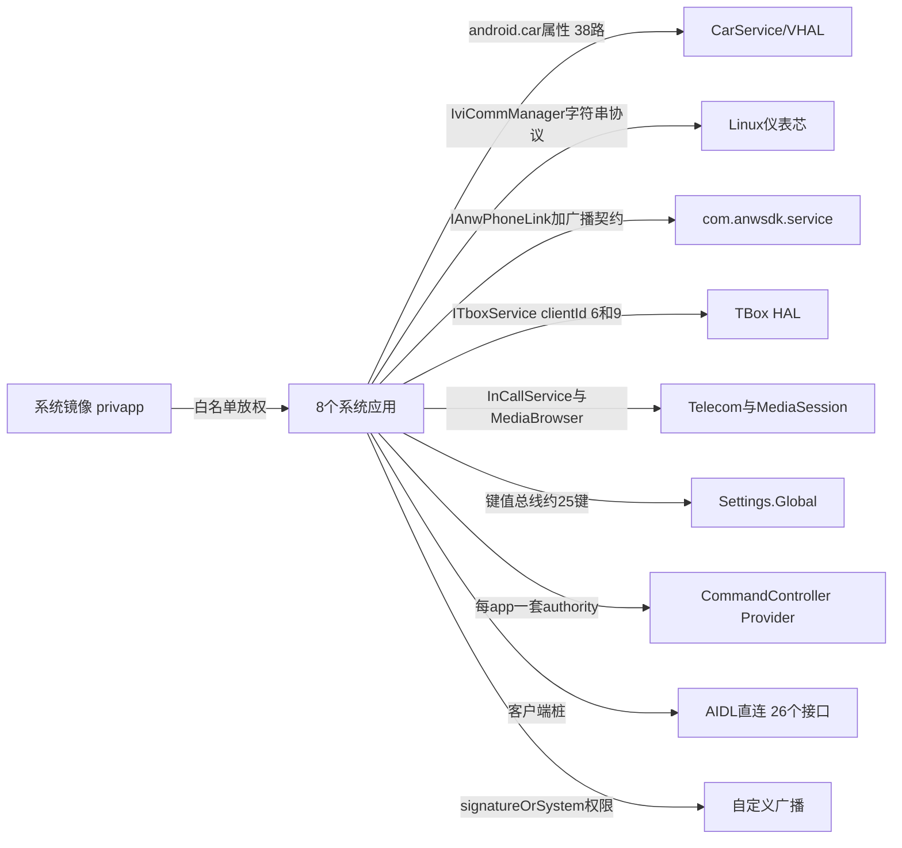

# 横向专题深挖（跨模块矩阵 · 构建实测 · git 考据 · 问题总表）

> 源码锚点：commit `d653d105f86b946685f3ff5133a3079d718d7882`（main）｜ 生成：2026-09-06 ｜ 范围：全项目横向专题（模块级解码 5 批次完成后的补深）
> 上游文档：[ARCHITECTURE.md](ARCHITECTURE.md) ｜ 本文收录各模块文档"未深挖"清单中**横向**的部分。

## 1. 构建实测闭环（skill §2.1 补做）——含全项目最重要安全发现

**实测**：`sh gradlew :application:EnergyManagement:assembleDebug` → **BUILD SUCCESSFUL in 28s**（77 tasks，Java 11 + sdk.dir 本机 SDK + gradle 7.5 缓存命中）。出包链闭环验证：`compile/bin/NsrEnergyManagement.apk`（177MB）按 output() 机制当场生成。构建体系"真实可用"从推断升级为实证。

**⚠ 重大修正（已回写 Build-工程化.md §6）**：对产出 APK 执行 `apksigner verify --print-certs`，再对 `config/platform.jks` 本体 `keytool -list -v`，两条证据链一致——

- Owner：`EMAILADDRESS=android@android.com, CN=Android, OU=Android, O=Android, L=Mountain View, ST=California, C=US`
- SHA-256：`C8A2E9BC CF597C2F B6DC66BE E293FC13 F2FC47EC 77BC6B2B 0D52C11F 51192AB8`
- 有效期 2008-04-16 起——与业界公开已知的 **AOSP platform testkey** 指纹完全一致。

即：**"雅迪平台签名"的证书本体是全世界公开的 AOSP testkey**（keyAlias 改名 yadeakey、密码改 yadea2026 只是换了 keystore 包装，证书未换）。推论：
1. 任何人从 AOSP 源码树取 platform.pk8/x509.pem 即可签出与全部 8 个应用**同签名等级**的 APK；
2. privapp 白名单 + signature 级权限的实际保护强度 = **ROM 的 system 分区是否也用这把公开 testkey 签**（开发期 ROM 大概率是）——信任链建立在公开密钥上；
3. 若量产 ROM 已换正式 key，则应用侧同步换签只是改 config.xml 四字段（设计上已支持），但需确认换签流程与 platform_chery.jks（仍打不开，4 个常见密码均失败）的关系；
4. 批次 5 "看着糟"第 1 条（"低危"）判定**作废**，重定性为：开发期可接受、量产前必须换签的**阻断项**。

## 2. git 考据深化（母题的诞生现场）

仓库史约束：1125 commits 全部始于 2026-06-25 迁仓（squash），多数机制只能追到该边界；以下为 log -S 成功归因的"母题源头"：

| 母题 | 引入 commit | 考据结论 |
|---|---|---|
| **代际令牌 + Carlib 看门狗** | `2d21bbde` [bugfix][yadea][SystemUI][SIR-5467][SIR-5446]"偶发 Meter 屏无法进入 D 档 & 蓝牙耳机音量 0" | **两个可靠性核心机制诞生于同一次双 bug 联调修复**——不是架构预设计，是线上事故倒逼出的防御工事 |
| **写超时回滚** | `7521f5c4` [feature][yadea][Setting]"座椅位置记忆选择和加热逻辑优化" | "乐观更新+回滚"母题的源头是**座椅加热**功能，后被 Carlib 收编为 PropertyRollbackManager，再扩散到 Launcher 把手加热 |
| **HFP 重试** | `89d9dbf0` [bugfix][Yadea][btphone][SIR-4601]"前后排蓝牙耳机都连接，来电双方都无声音" | 五段式正文完整（what/why/how/影响等级 C/测试范围），是本项目 commit 规范的范本 |
| **触屏锁迟滞** | `4f3db556` [feature][yadea][SystemUI][SIR-3307]"主交互增加低速开关判断" | 迟滞算法不是 bugfix 而是需求演进（与 d095afee 同属 SIR-3307 系列） |
| StateEventRouter / 双通道刷新 seq | 均随 `32b5926c 初始化仓库` 入库 | squash 边界，无法 finer 归因（诚实记录） |

**作者分布**（--no-merges 455 commits）：dufan 170、liujinfeng 96、liqingqing 83、daizhecheng 65、sgh 43、hedeyuan 39、ljl 36——dufan 是事实上的架构权威（含构建/能量中心/裁剪决策）。

## 3. 跨模块横向矩阵

### 3.1 IPC/跨边界通道全景

本图回答：**应用层与外部世界之间一共几条通道、各承载什么**。不包含：进程内部事件（LiveData/RxBus/SharedFlow）。

图例：实线 = 通道；箭头词 = 协议形态。ROM→APPS 是权限授予方向。

**通道明细**（数量为 grep 统计）：
1. **VHAL 属性**：经 Carlib，38 路 callbackPropertyIds（Energy 实测）+ 各 app 自选白名单。
2. **L2A 字符串协议**：`Meter_Form`/`IVI_Ready_Status`/`Drive_Touch_Lock`/`BT_Phone_State`/`theme_show_mode` 等——字符串即协议，对端源码不在本仓。
3. **Settings.Global 键值总线**：写入方统计约 **25 个键**——token 四键、USER_ID 族四键、互联域（CONNECT_DEVICE_NAME/ADDRESS/SHARE_NETWORK）、车辆域（AI_PET_SWITCH/SENTINEL_MODE_OPTIONS/THEME_SHOW_MODE/ROAD_MAP_ENLARGE 等）。⚠ 明文 token 与"非原子可见"问题见 Setting-AccountCenter.md。
4. **CommandController ContentProvider**：模式化注册——每个 app 一套 `${applicationId}.androidext_cmd_controller` authority + `cmd_controller_callbacks` meta-data 指向回调类；**已发现 3 处回调类死引用/包名错配**（Energy×2、BTMusic×1，均经验证）。
5. **AIDL 直连**：26 个 .aidl——Hardwarelibs 21 个（AnWBT 全家数据桩 + IAnwPhoneLink）、SystemUI 5 个（手势 2 + **天气 3**）。⚠ **幽灵绑定解释**：`IWeatherService.aidl` 只存在于 SystemUI 侧（客户端桩），Weather 应用侧没有任何 .aidl/服务类——SystemUI 绑定的是"只有接口定义没有实现"的服务，复活 Weather 需先在 Weather 侧补服务类。
6. **标准框架通道**：Telecom InCallService（BTPhone）、MediaBrowser/MediaSession（BTMusic）——把协议交给系统栈。
7. **自定义广播**：`com.yadea.*` 命名空间家族（five_finger_capture/panorama_desktop/broadcast.enter/SHOW_FLOAT_WINDOW/PHONE_ANSWER 等），高危通道配 signatureOrSystem 自定义权限（但也有反例：BTPhone 浮窗广播 exported 无权限——见问题总表 #1）。

### 3.2 线程与延时画像

- **命名线程 11 条**，全部单一用途：CarPropertyWrite/CarPropertyRead（Carlib）、LostModeTboxClient/EnergyTboxClient（两个 TBOX 客户端各自独立）、light-dispatch/mapService-dispatch（SystemUIService）、CarAudioInit、wifi/ap（Hardwarelibs）、TimeTick、dispatch。线程纪律整体良好；配合 Carlib 五线程模型构成全项目并发观："每个资源一条专用线程"。
- **魔法延时分布**（postDelayed 常量值 top）：1000ms×5、**333ms×4**（转场帧间隔，Kanzi 相关）、3000ms×4、200ms×4、100ms×4、600/500/300/1500ms 各 2-3——延时集群集中在 100ms~3s 的"等系统就绪"区间，全部属于"设置→验证→重试"策略的一部分（见 BTPhone 卡片论证），无失控长延时。

### 3.3 地层残留分布（考古地层学）

| 地层 | 证据 | 分布 |
|---|---|---|
| **ECARX**（亿咖通） | `com.ecarx.btphone` ComponentName（BTPhone InCallServiceImpl/UiCallManager/PageManager 三处）、`ecarx.permission.PUSH`（btmusic 白名单）、EcarxUrlConfigHelper、`ecarx.intent.action.QUIT_FULLSCREEN_VIEW` | BTPhone 3 核心类 + BTMusic + AdaptApi + Applib |
| **Neusoft**（东软） | Nsr 前缀产物名、com.neusoft.* 包名、config/ 化石、KC-2 邮件链、mailList @neusoft.com | 全仓骨架 |
| **福田/欧马可** | ChangeSkinManager 的 FOTON_AUMARK/AOLING/CAVAN 车型枚举 | CommonTools 换肤 |
| **吉利 KC-2** | build_findbugs.xml 的 Jenkins 路径、PMD 的 /home/fe6-version | config 化石 |
| **Chery**（奇瑞） | platform_chery.jks（密码未知）、Chery_E0V 接口 xlsx、KanziConstants 的 Chery 遗留 key | 签名与文档 |
| **AOSP** | platform testkey（本文 §1）、LocalBluetoothManager/LeakDetector/CommandQueue/FragmentHostManager 移植 | 签名 + 4 处框架移植 |

**解读**：这是一台"五手车机"——AOSP 底座 → ECARX → 东软（吉利 KC-2）→ 福田换肤复用 → 雅迪/奇瑞 OEM。每一层都留下了可运行的代码而非仅注释，这正是"模板复刻式 OEM 交付"的实物地层剖面。

## 4. 全项目问题总表（6 份模块文档疑似问题汇总，按严重度）

**P0（安全/崩溃，已验证）**
1. exported 浮窗广播无权限可**真实拨号**（BTPhone FloatWindowBroadcastReceiver.java:121-126）。
2. **平台签名 = AOSP 公开 testkey**（本文 §1 实锤）——量产前必须换正式 key 并核对 ROM 签名一致性。
3. 凭据链明文：token 存 Global+进日志、AES 全零 IV、密钥/测试 SN 硬编码（AccountCenter，已验证三处）。
4. InCallUiStateMachine 两处 getPrimaryCall 未判空（:1289-1291、:1359-1361）——疑似 SIR-5769 崩溃同源 [inferred]。

**P1（功能失效/死引用，已验证）**
5. manifest 回调类死引用 ×3（Energy OptServiceCmdController/VehicleMsgCmdController、BTMusic com.neusoft 前缀包名）。
6. Weather 幽灵绑定：IWeatherService.aidl 只在 SystemUI 侧，服务实现类不存在。
7. `removeNetworkChangeListener` 空操作（Hardwarelibs :128-137 循环体为空）。
8. CAPP 策略 mCAPPForward 恒 null，调用即 NPE。
9. Weather CacheApi:280 SQL 优先级 bug（缓存全失效）。
10. isNeedStartNavi 恒 false——B1↔B2 自动流转整体禁用。
11. RecentRepository.loadCallHistory 只 log 不加载（SWIM-103271 掏空）。

**P2（协议/一致性，需 owner 确认）**
12. lost_mode 值方向与常量相反；TripData.getIfcDisplay 引用错字段；ProtocolUtil 两处注释与实码不符；TelecomForward 单监听器覆盖；Vlog NetworkManager.onLost 清理分支写反；login 二维码时长 90s/900s 注释互换；saveHudConfig 与 AccountCenter HUD 开关疑似写环。

**债务（不死但持续付费）**：AdaptApi 孤岛（0 import）+ permission 域未编译；约 2700 行三代旧档位控件；VehicleMsgFilter/QrCodeLoginViewModel/BroadcastKanzi 死代码；巨石类五座（3013/2192/2023/1933/1767 行）；四套 Base 双轨异步（Rx/协程）；质量闸门全关（Lint OFF/SpotBugs 空转/FindBugs 化石）+ NOSONAR 250+ 处。

## 5. 开放问题（本轮新增）

1. **ROM 的 system 分区用什么 key 签？**——决定 testkey 问题的实际严重度（开发 ROM 用 testkey 属常态；量产量产 ROM 必须换）。
2. `platform_chery.jks` 密码（本轮再试 android/chery/Chery@2023/chery2023 均失败）——OEM 换签流程文档在哪里？
3. 魔法延时 333ms ×4 的出处（Kanzi 转场帧间隔？）——[inferred] 未逐一定位。
4. 全量 8 包出包是否在打包机有既定流水线（本机实测仅能编译单包，Launcher 671MB 出包耗时未知）。
