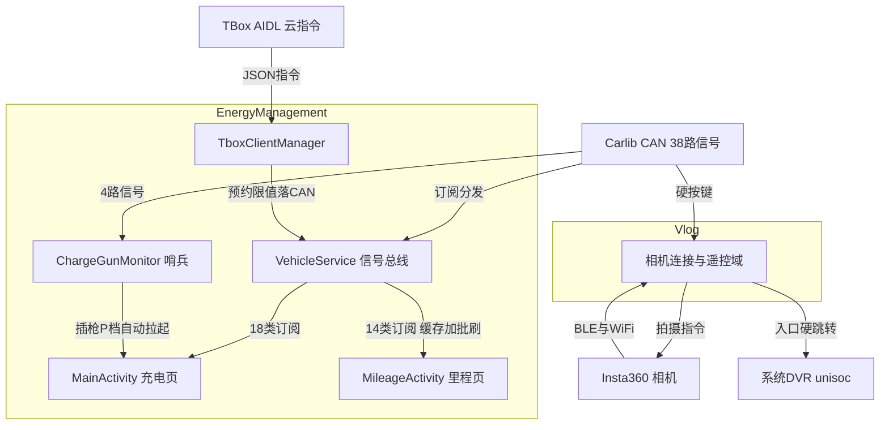

# EnergyManagement 与 Vlog 架构解码（含 Weather / DebugTools 停用件）

> 源码锚点：commit `d653d105f86b946685f3ff5133a3079d718d7882`（main）｜ 生成：2026-09-06 ｜ 范围：子系统 application/EnergyManagement（30 文件）+ application/Vlog（40 文件）+ 停用件 Weather（41）/ DebugTools（6）（批次 4 之二）
> 上游文档：[ARCHITECTURE.md](ARCHITECTURE.md)（全局地图与主链路）

**前置勘误**（实测修正早前假设）：EnergyManagement 的监听器集合实测 **39 个**（VehicleService.java:62-100，接口定义 :2858-3012）、`callbackPropertyIds` 实测 **38 路**（:112-151）；Vlog 的 `ByteBufferArgbGLSurfaceView` 是**单块** direct ByteBuffer + 脏标记（:82-99），并非双缓冲。git 考据注：仓库历史最深只能追到 squash 后的 `32b5926c 初始化仓库`，无法 finer 归因。

## 1. 模块卡片

### EnergyManagement（能量中心）

**职责**：挂上 CarService，把 38 路 CAN 电量/续航（GB/WLTC/WMTC 三工况）/充电/里程信号翻译成 39 类监听器事件喂给两个 Activity，并向车写下发充电限值/慢充功率/预约充电/停止充电（系统 UID，Manifest:4）。

**对外接口**：`MainActivity`（singleTask+exported，Manifest:27-37）、`MileageManagementActivity`（:39-41）；CommandController 双 provider（:43-54、:69-81）⚠ 引用的两个回调类全仓不存在（§6-1）；被自动进场 Intent 拉起的 extras 契约（MainActivity.java:44-49）。

**关键协作**：⚠ 自动进场判定**写了两份**——`VehicleService.maybeAutoEnterEnergyApp`（:2581-2625，应用运行期）与 `ChargeGunMonitorService.maybeAutoEnter`（:183-214，开机后台）几乎逐行重复，后者拉起后 `stopSelf()` 移交（:255-256）。另一意外点：开机 ready 时主动写一次 `ENERGY_EEM_STOP_CHARGING_BUTTON=0x0`（VehicleService.java:475）。

**设计动机**：单实例 Activity + 单例 BaseManager + CopyOnWriteArraySet 广播式监听，适配"CAN 高频回调 + 多页面随生命周期订阅"场景；回调统一 `mMainHandler.post` 切主线程（:1862-1870）。

**雷区**：① Manifest 两个 `cmd_controller_callbacks` 值 `module.vr.OptServiceCmdController`（Manifest:51）与 `cmd.VehicleMsgCmdController`（:79）**全仓不存在**（本轮 sed 验证值、agent grep 源码与 aar 双查无）——反射加载必失败或死配置；② 巨石 MainActivity 内有占位资源名 `someId`（:1413/1423/1955）；③ `normalizeNonNegativeInt` 中日志拼接字符串常量缺失引号（VehicleService.java:2429-2431，靠 NOSONAR 混过扫描）。

### Vlog（Insta360 相机配对/遥控，⚠不是行车记录仪）

**职责**：基于 Arashi Vision SDK（App.kt:24-25）的车机端相机"BLE 扫描→配对→WiFi 直连→CAN 按键遥控拍摄"应用；DVR 是硬编码跳转的系统应用 `com.unisoc.carcameramulticam`（HomeActivity.kt:77-79，常量 :294-296）。

**对外接口**：`HomeActivity`（Launcher，Manifest:73-82）；`CameraPairedActivity`（exported，:83-87）；FileProvider。

**关键协作**：⚠ ① `ConnectViewModel` 被 HomeActivity/CameraPairedActivity **各自 new 一个实例**，两页各自 collect 各自的事件流，连接状态靠 SPUtils"上次设备"串场（ConnectViewModel.kt:172-187、:350-354）；② WiFi 成功后 `bindProcessToNetwork(移动网络)`（:379）——相机 WiFi 与车机 4G 共存的关键动作：数据面走相机、控制面回蜂窝；③ `ByteBufferArgbGLSurfaceView`（295 行手写 GL）**模块内零引用**——孤儿预留件。

**设计动机**：车机没有相册概念，本应用定位"配对器+遥控器"；三级连接状态机全压在一个 ViewModel，事件用 `MutableSharedFlow`（BaseViewModel.kt:16-17，全仓唯一 Flow 实战）单向推 UI。

**雷区**：① `NetworkManager.onLost` 清理分支**写反**（WIFI 丢失清 mobileNet、CELLULAR 丢失清 wifiNet，NetworkManager.kt:73-78，本轮 sed 验证——与 :62-67 onAvailable 正好相反）；② `wakeupLastConnectDevice`（:196-201）/`connectDeviceByUsb`（:115-124）/`refreshMediaTime`（:93-113）无调用方——快速唤醒链路疑似未接线（strings.xml 仍保留 wakeup 文案 :136-140）；③ 下滑退出直接 `killProcess`（BaseActivity onLapseDownExit）。

### Weather（停用件，简）

**职责**：反射装载多天气源（墨迹/和风/心知，配置在 configs.xml:5-17 weather_apis）+ 高德/腾讯地理编码，以 CommandController 广播协议供天气与位置，另有 24h 预报 ContentProvider（WeatherProvider.java:14-17）。
**⚠ 复活影响面核心结论**：SystemUI `WeatherServiceConnector.kt:32-33` 绑定的 `com.android.ext.autoweather.aidl.WeatherAidlService` 在 Weather 源码中**不存在**（无 .aidl 目录、无该类，agent find/grep 双确认）——恢复 settings.gradle 编译**不会**让 SystemUI 天气复活，需先补 AIDL 服务或改走现成的 `WeatherProvider`（URI_HOURLY/REALTIME）。但 privapp 白名单（whitelist/com.android.ext.autoweather.xml）仍存活，系统镜像层还认这个包。

### DebugTools（停用件，简）

**职责**：系统签名调试浮窗：dumpsys 轮询当前页/Fragment（DebugFloatService.java:141-148、:923-937）+ logcat 按 PID 抓日志（:1345-1363）+ 自定义广播发射器（:668-729）+ USB 角色/日夜/语言三开关；`:foreground` 独立进程（Manifest:36）。
**雷区**：窗口 type 硬编码 2266（:248 覆盖状态栏的魔数）；`CarManager.java:15` 带 JADX 注释——从别的 dex 反编译塞回的类；`DebugBroadcastContract.java:8-22` 是给各业务 App 预留的调试广播协议，目前仅浮窗自用（:630-644）。

## 2. 结构图

本图回答：**能量信号如何分流到两个页面、云端指令如何落 CAN、相机如何被遥控**。不包含：停用件 Weather/DebugTools（见 §1 卡片）与 UI 动画细节。

图例：矩形 = 类/域；实线 = 调用/数据流。VS 是 Energy 域枢纽（3013 行）；CV 是 Vlog 域枢纽（ConnectViewModel + VlogCarService）。

## 3. 核心类深卡片

### VehicleService（module/VehicleService.java，3013 行，全仓最大源文件）

**职责**：CAN 信号↔应用事件唯一转换层：订阅 38 属性 + 25 路 readOnce 基线读，归一化后分发 39 类监听器；叠加充电枪/挡位/充电态状态机（异常提示/未拔枪提示/自动进场）与 CAN 写入三路径（int/float/原始，:490/:575/:549）。
**协作者**：InitService.java:22-25 创建；MainActivity 18 类订阅（:1006-1229）；MileageManagementActivity 14 类订阅（:334-392）；TboxClientManager 预约落 CAN（:291-294）；PageUtils 前台判定。
**设计动机**：多页共享高频信号且随生命周期订阅；回调线程不可控、信号有无效码（0xFF SOC/0x3FF 续航，:2339-2342、:2366-2369）、会超时丢帧 → CopyOnWriteArraySet（遍历免锁）+ 主线程 post + readOnce 基线兜底 + 8 路 MCU 超时报告信号显式建模 + `tracePropertyCallback` 抓重复回调（:367-398，配套 `[CAR_PROPERTY_DUP]` 日志）。commit 考据：`5cb54534 修复静态代码扫描`（NOSONAR 轮）、`618e9251 能量中心V3 UI修改`。
**不变量**：①每个 notifyXxx 先判空集再 post（:1862-1870）；②回调值先 normalize 再通知，UI 永不见 0xFF/负值；③onDestroy 清空 39 集合并反注册（:2797-2856）；④自动进场四闸门：armed→新连接→P 档（含超时恢复）→无本应用前台→1.5s 防抖（:2589-2624）。

### MileageManagementActivity（view/ui/MileageManagementActivity.kt，613 行）

**职责**：本次/小计里程双组展示；14 信号缓存 + 10s 批量刷 UI + 仅"本次/小计里程"两条关键信号即时 post（:86-90、:111-115）；小计重置走"写 CAN→500ms→6 路回读→刷 UI"（:429-439）。
**设计动机**：里程回调极高频（0.1km 粒度）而页面只需 10s 粒度——每回调都刷 UI 会造成主线程压力/闪变 → `mCachedXxx` 缓存层 + `mRefreshRunnable` 周期刷（:72-77、:609）。**seq 勘误**：`mCacheUpdateSeq/mUiRefreshSeq`（:167-193、:543）只在日志里自增对账（`[CACHE_ONLY]` vs `[UI_REFRESH]`），**无控制流使用**——是"缓存写了但 UI 没刷"的事后对账工具 [inferred 依据为仅日志消费]。
**不变量**：①监听器只写缓存不碰 UI（除两条即时信号）；②`mCachedTripEavCns=-1` 作"无效"哨兵显示 `--`（:262、:277）；③onPause 非手势退出则 finish（:296-305）；④onDestroy 必反注册 14 监听器并停 Handler（:539-572）。

### TboxClientManager（module/TboxClientManager.java，487 行）

**职责**：TSP↔车 CAN 双向网关客户端（clientId 9）：死亡重连 3s（:237-244）、JSON 字段级 require+范围校验（:416-445）、预约/限值/功率三类 set 落 CAN + ack、本地 report 上行。
**设计动机**：binder 服务随时死、JSON 不可信、UI 要结果反馈 → DeathRecipient+定时重连（:52-58）、校验失败即 ACK_FAILED（:286-290）、成功才提交 `ReservationState` 并 notify（:295-301）；UI 侧另加 1s 超时兜底（MainActivity:99、:1879-1884）。
**不变量**：①ack 必回（成功/失败两路都 sendAck，:302-303）；②mReservationState 仅 success 时更新（:297-299）——六字段不可变，默认 23:00-07:00（:47-48，仅内存、重启依赖 TSP 重下发 ⚠待确认）；③soc_limit 0-6 档→70%+5%/档（:455-460）；④charge_power 0-12700W→/100 落 CAN（:320-321）。

### ConnectViewModel（main/ui/model/ConnectViewModel.kt，431 行）

**职责**：相机连接全生命周期状态机与凭据持久化：BLE 扫描→BLE 连接（成功即持久化"上次设备"类型+序列号后 6 位）→取相机热点 SSID/密码→`WifiNetworkSpecifier` 连系统 WiFi→bindProcessToNetwork→SDK openCamera(WIFI)；区分 BLE/WiFi/USB 三连接型错误路由（:389-423）。
**设计动机**：车机每次上电要快速重连上次相机，但 Insta 相机 BLE 配网慢、WiFi 凭据必须先 BLE → 凭据 `SSID#insta_split_tag_#pwd` 存 SP，下次同名 BLE 设备跳过等待直连 WiFi（:172-187、:209-217）；`suspendCancellableCoroutine` 把系统 WiFi 异步回调转协程（:285-319）；bindProcessToNetwork 保证数据面走相机 WiFi、控制面回蜂窝（:262-272、:379）。
**不变量**：①connectType 事件总带 errorCode（默认 0，ConnectEvent.kt:15-19）；②连接成功必刷新 SP_LAST_DEVICE_*（:350-354、:373-377）；③onCleared 反注册扫描监听与相机回调（:426-430）；④isConnectingWiFi/isConnectingUsb 互斥驱动错误路由（:402-422）。

### ByteBufferArgbGLSurfaceView（view/ByteBufferArgbGLSurfaceView.kt，295 行，孤儿件）

**职责**：外部线程产出的 ARGB ByteBuffer 搬上 GLES2 纹理按需渲染（⚠模块内零引用）。
**设计动机**：软件 Canvas 逐帧 drawBitmap 在车机低配 GPU 上抖、GL 资源泄漏在长驻进程致命 → `RENDERMODE_WHEN_DIRTY`（:65）+ 单 buffer + lock+dataUpdated 脏标记（:82-99、:155-159）+ onDetachedFromWindow 里 queueEvent 在 GL 线程删纹理/程序（:261-274）。
**不变量**：①buffer 容量不匹配（w*h*4）直接丢帧（:78-80）；②GL 资源只在 GL 线程创建/销毁；③每次 drawFrame 至多消费一次 dataUpdated（:156-159）。风险：ARGB→RGBA 未做字节序处理（:213-214 注释自认）。

## 4. 全类职责表

### EnergyManagement（30/30 = 100%；4 个 DTO 单列跳过）

| 类（相对路径） | 一行职责 | 关键协作 |
|---|---|---|
| App.kt | 只设日志 tag "Energy" 的 Application 壳 | BaseApplication（aar） |
| misc/BeanExt.kt | 4 个 DTO（MsgBean/PointBean/PowerType/ChargingTimeData）——纯数据 | — |
| module/InitService.java | 反射创建 VehicleService+TboxClientManager 的 BaseManager 引导器（configs.xml 指认） | localbasemanager.aar [inferred] |
| **module/VehicleService.java** | 38 路 CAN→39 类监听器的规范化分发总线 + 枪/挡位状态机 + CAN 写入（3013 行） | CarServiceManager、MainActivity |
| **module/TboxClientManager.java** | TBOX AIDL 客户端：TSP JSON↔CAN↔ack，预约充电状态持有者 | vendor.hardware.tbox、VehicleService |
| module/ChargeGunMonitorService.java | 开机后台 4 信号哨兵：插枪+P 档自动拉起 MainActivity 后 stopSelf 移交 | BootCompletedReceiver、PageUtils |
| module/BootCompletedReceiver.kt | BOOT_COMPLETED → startService（:10-14） | ChargeGunMonitorService |
| module/vehicleInfo/VehicleInfoListener.kt | 两方法回调接口，模块内无实现/引用（疑似遗留）[inferred] | — |
| view/base/BaseActivity.kt | 透明全屏沉浸窗口装饰、showRedHintToast、exitEnergyManagementApp（:44-50） | ToastUtils |
| view/base/BaseFragment.java | 惰性加载 Fragment 模板（本模块未用） | — |
| view/custom/BaseDialog.java | AppCompatDialog 模板：点击遮罩可配 | 弹窗家族 |
| view/custom/BlurBackdropView.java | 卡片背景高亮模糊（MainActivity:746 已注释停用） | MainActivity |
| view/custom/ChargeLimitInfoDialog / SlowChargeInfoDialog | 充电上限/慢充说明纯文案弹窗 | MainActivity:550-572 |
| view/custom/EnergyBarSeekBar.java | 电池能量柱：SOC 驱动、充电扫描线/粒子、10/30 红黄绿过渡动画 | MainActivity:1689-1728 |
| view/custom/EnergyConvergenceView / EnergyRiseView | 帧序列汇聚/上升动画（父类 FrameSequenceImageView） | 布局装饰 |
| view/custom/EnergyDistributionView.java | 电机/其他能耗占比圆环自绘（setEnergyData :131-135） | MileageActivity:247-259 |
| view/custom/EnergyLapseTouchLayout.kt | 里程页下滑退出手势容器 | MileageActivity:583-597 |
| view/custom/EnergyTypeface.java | 字体静态工厂 + 批量 apply（MainActivity:1950-1979） | MainActivity |
| view/custom/GradientBorderView.java / ScaleTickView.java | 渐变描边/刻度尺自绘 | 布局装饰 |
| view/custom/LabelValueLayout.kt | "标签+右值"行控件 | MileageActivity 各 apply* |
| view/custom/PageUtils.kt | 进程级前台 Activity 计数器 + 四页面状态单例（自动进场判据 :23-24） | VehicleService/ChargeGunMonitor |
| view/custom/ReservationChargingDialog.java | 预约充电时间对话框（WheelScrollView 选时/分，onConfirm 四元组 :512-520） | MainActivity |
| view/custom/TimePickerView.java / WheelScrollView.java | 时分双列选择器 / 302 行手写滚轮 ViewGroup（惯性+回调） | ReservationChargingDialog |
| **view/ui/MainActivity.java** | 充电主页面巨石：SOC 动画/续航切换/充电限值/慢充功率/预约/停止充电/8 路超时降级（2023 行） | VehicleService×18、TboxClientManager |
| **view/ui/MileageManagementActivity.kt** | 里程管理页：缓存+10s 批刷双通道（613 行） | VehicleService×14 |

### Vlog（40/40 = 100%；8 个 vendored 第三方文件归并说明）

| 类（相对路径） | 一行职责 | 关键协作 |
|---|---|---|
| init/App.kt | 初始化 Insta 相机/媒体 SDK + 启动网络监听（:24-26） | InstaCameraSDK、NetworkManager |
| init/InitService.kt | BaseManager 引导：创建 VlogCarService | localbasemanager.aar |
| init/VlogCarService.kt | CAN 硬按键→单拍/三连拍（BurstCapture(3,500) :213-219）/录像遥控，拍摄前查 SD 卡（:207-213、:244-250） | instaCameraManager、SettingsUtils |
| insta/InstaCameraManagerExt.kt | `instaCameraManager` 单例属性门面（:5） | SDK |
| ext/SystemExt.kt | connectedWiFiSsid/connectivityManager/wifiManager 全局属性（SSID 去引号 :8-17） | ConnectViewModel、NetworkManager |
| base/BaseActivity.kt | 泛型 Binding+VM 基类：反射创建、collect 事件流、最小 Loading 时长、下滑退出 killProcess | BaseViewModel |
| base/BaseAdapter / BaseDialog / BaseFragment / BaseLoadingDialog | 反射 inflate 的 Adapter/Dialog/Fragment 模板四件套 | 各 UI |
| base/BaseEvent.kt | 相机事件接口 + EventStatus 四态 | BaseViewModel |
| **base/BaseViewModel.kt** | MutableSharedFlow 事件总线 + SDK 相机回调→事件（全仓唯一 Flow 实战，:16-34） | 各 Activity |
| main/ui/HomeActivity.kt | 入口页：配对驱动扫描/断开；DVR 硬编码跳转（:77-79）；连接成功转 CameraPairedActivity | ConnectViewModel、mWxBtManager |
| main/ui/CameraPairedActivity.kt | 已配对页：重连/更多设备/删除配对/跳自定义设置（:356-375 带 extras 跳 Setting） | ConnectViewModel |
| **main/ui/model/ConnectViewModel.kt** | 相机三级连接状态机与凭据持久化（431 行） | SDK、NetworkManager、SPUtils |
| main/ui/event/ConnectEvent.kt | 扫描/连接/断开/媒体时间四类类型化事件 | 两 Activity 的 when 分发 |
| main/ui/dialog/HintConfirmDialog / HintExtDialog / HintListDialog | 确认/通用/多设备选择三个弹窗 | 两 Activity |
| utils/AnimationUtils.kt | 全局单实例旋转 Loading 动画器 | 两 Activity |
| **utils/NetworkManager.kt** | 相机 WiFi Network 识别（IP 比对）+ 蜂窝/WiFi 跟踪 ⚠onLost 分支写反（:73-78 已验证） | ConnectViewModel |
| utils/ViewBindingUtils.kt | 泛型反射 inflate Binding/createViewModel（:12-30） | BaseActivity |
| view/AutoSurfaceView.kt | 按相机宽高比测量并 setFixedSize 的 SurfaceView（:23-29） | 预览布局 |
| view/BaseStyleSwitch / CustomStyleSwitch | SwitchCompat 基类与可拦截"关→开"样式开关 | 车设开关 UI |
| **view/ByteBufferArgbGLSurfaceView.kt** | GLES2 ARGB ByteBuffer 渲染器 ⚠模块内零引用孤儿件 | 无 |
| view/LapseTouchHelper.kt / LapseTouchLayout.kt | 下滑退出手势：速度/位移判定+动画；顶部 124-64px 触发区 | BaseActivity 退出 |
| view/LoadingView.kt | 带文案 Loading 弹窗 | BaseActivity |
| view/picker/*（5 文件） | 拍摄模式选择弹层（PickerView/PickData/PickerAdapter/EffectiveMode）⚠疑似给被砍的设置页 | — |
| view/DiscreteScroll* 等 8 文件 | yarolegovich DiscreteScrollView 内置副本（vendored，作者注释在 DSVOrientation.java:6） | PickerView 布局 |

### Weather / DebugTools（降级紧凑表——降级理由：已从构建移除且与消费方脱节，深读价值收敛为"复活影响面"）

Weather 核心类：`manager/WeatherManager.kt`（weather_apis 反射工厂，⚠:97 `(mApis[0] as CacheApi)` 强转在当前配置下是潜伏 ClassCastException，已验证）、`weather/CacheApi.kt`（Room 缓存兜底，⚠:280 SQL 优先级 bug 已验证：裸列 `city` 非空即真使**任意非空 city 行命中**，关键字匹配与 8h 新鲜度全部失效）、`provider/WeatherProvider.java`（hourly/realtime 只读 Cursor）、`manager/WeatherControlManager/WeatherTaskManager（20 分钟周期）/WeatherCacheManager/GeoManager.kt`、`geo/GeoApi 系`、`cmd/CmdController.kt`（广播协议对接）、`weather/MojiApi/QWeatherApi/SeniverseApi/WeatherLibApi/BaseApi`（多源，⚠Token 全部硬编码：Manifest 高德/腾讯 Key 明文 :31-37，源码和风 :147/心知 :142/墨迹 :42-48）、`ui/MainTestActivity.kt`（⚠exported+MAIN 进生产 Manifest :50-57）、其余 UI/工具 15 个。

DebugTools 全量 6 类：`service/DebugFloatService.java`（调试浮窗总控，1619 行）、`DebugBroadcastContract.java`（广播协议常量）、`MainActivity.java`（悬浮权限门禁）、`CarManager.java`（⚠JADX 反编译残留）、`ui/LogAdapter.java`（日志行 Adapter）、`utils/ViewUtil.kt`（dumpsys 解析/语言切换）。

## 5. 看着糟但其实没问题

1. **VehicleService 的 39 套 register/unregister/notify/readOnce 机械重复（约 2000 行）**——"每信号一族"的展开式样板：各族互相独立、无共享可变状态，diff 不互踩；真正有状态的是枪/挡位/防抖小状态机（:2537-2734），边界清晰。该判死刑的是 MainActivity 的 UI 编排而非这个总线 [inferred]。
2. **MileageActivity 的双 seq**——纯日志对账序号，删除不影响行为。
3. **MainActivity 的超时×8 布尔旗海（:153-175、:574-742）**——每条超时对应独立 CAN 报文，是 MCU 信号超时报告的直接镜像；恢复路径带一条刻意注释的反优化决策（功率超时恢复不回读，避免 UI 闪 0.0kW，:695-698）。
4. **Energy 与 ChargeGunMonitorService 的进场逻辑复制**——"开机进程时序"需要的双份实现（Service 先于 Application BaseManager 就绪），代价是阈值需双处同步（已两处一致）。
5. **Vlog 大量 vendored 代码**——第三方库源码内置，可当生成物跳过。

## 6. 开放问题

**需人确认**：
1. **Energy Manifest 死引用**（已验证值存在、类不存在）：`module.vr.OptServiceCmdController` 与 `cmd.VehicleMsgCmdController`——残缺合并还是有意禁用 VR/信号回调链？
2. **Vlog 未接线 API**：`wakeupLastConnectDevice`/`connectDeviceByUsb`/`refreshMediaTime`/`ByteBufferArgbGLSurfaceView` 零调用方——"快速唤醒相机"是砍掉的需求吗（strings.xml:136-140 仍保留文案）？
3. **NetworkManager.onLost 写反**（已验证）——实际影响面（仅 cameraNet 之外的缓存字段）待评估。
4. **Weather 复活影响面**：a) SystemUI 绑定的 `WeatherAidlService` 在 Weather 源码中不存在（agent find/grep 双确认）——恢复编译也不会让 SystemUI 天气复活，需补 AIDL 或改走 WeatherProvider；b) WeatherManager:97 强转崩溃路径；c) CacheApi:280 SQL bug 修复会改变缓存命中语义；d) privapp 白名单仍存活。
5. **Weather API Key 明文 5 枚**（Manifest 2 + 源码 3）——停用不等于可泄漏，建议轮换。
6. **TboxClientManager 状态持久性**：ReservationState 仅内存、默认 23:00-07:00——重启后依赖 TSP 重下发，车端是否接受该回退值？

**[inferred] 汇总**：PageUtils 前台计数是自动进场唯一可靠判据；BaseViewModel 事件流的 `collect` 订阅随 Activity 重建会重复（SharedFlow 无 replay 缓解）；EnergyConvergenceView/RiseView 帧序列来源（res frame_2116x 系列）未逐帧核对。

**未深挖**：WheelScrollView 惯性公式；DebugTools CarManager 原始出处 APK；Weather 15 个工具类；Energy 动画帧序列清单。
