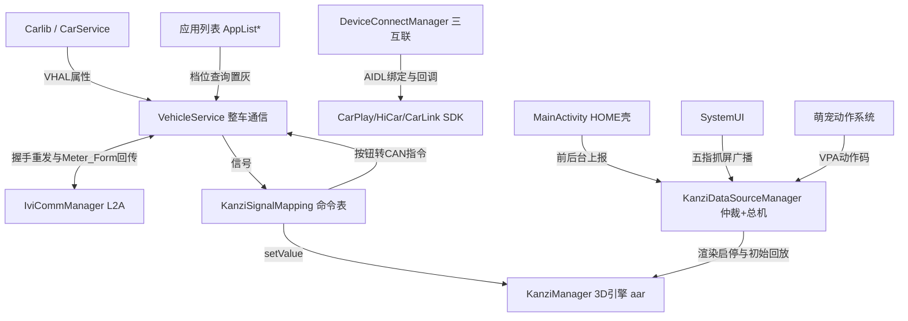

# Launcher 架构解码（application/Launcher）

> 源码锚点：commit `d653d105f86b946685f3ff5133a3079d718d7882`（main）｜ 生成：2026-09-06 ｜ 范围：子系统 application/Launcher（批次 2 之二）
> 上游文档：[ARCHITECTURE.md](ARCHITECTURE.md)（全局地图与主链路）

main 源集 55 个代码文件、63 个顶层类型。近一年变更热点：`control/KanziSignalMapping.java`（27 次）、`control/KanziDataSourceManager.java`（17 次）、`services/VehicleService.java`（16 次）——三者正是本模块的协议接缝。

## 1. 模块卡片

**职责**：HOME 桌面——以 Rightware Kanzi 3D 引擎渲染的"车模桌面"为壳（`MainActivity` 把 `kanzi_surface` 容器交给 KanziManager），把整车 VHAL 信号实时翻译成 Kanzi 变量命令（车辆状态上屏）、把车模按钮点击翻译回 CAN 控制指令（反向控制），旁挂应用列表页与 CarPlay/HiCar/CarLink 手车互联。

**对外接口**：
- HOME 入口：`MainActivity`（category.HOME + singleTask，intent-filter priority=1000，Manifest:61-80）；`AppListActivity`/`LinkActivity` 均 singleTask + 独立 taskAffinity。
- 导出广播：仅 `ExitWithAnimatorReceiver`（exported，⚠ 无权限保护，Manifest:97-103）；受权动态广播 `com.yadea.launcher.broadcast.enter`（signatureOrSystem，Manifest:41-42）保护五指抓屏/全景桌面。无导出 AIDL——AIDL 全部作为客户端。
- 错误模式：发送前查 `mIsReady`（VehicleService.java:113-115）；胎压 AIDL catch 版本不匹配（KanziDataSourceManager.java:268-270）；Kanzi 按钮解析失败仅告警丢弃（KanziSignalMapping.java:892-895）；未映射 propId 打 warning（:522）；ApiManager 无网回调 `onNoNetwork` 而非异常（ApiManager.kt:41-44）。

**关键协作**：依赖 `com.ts.kanzi.KanziManager`（外部 aar）、`com.neusoft.libcar.CarServiceManager`、`com.yadea.apf.vehiclesdk/ivicommsdk`、ts.car 三互联 SDK、CommonTools。⚠ SystemUI→Launcher 反向命令：`PlatformNotifierImpl.enterFiveFingerCapture` 发 `com.yadea.five_finger_capture` 广播（限定包名+权限），Launcher 侧 `KanziDataSourceManager.mAnimalReceiver` 接收驱动车模动画（KanziDataSourceManager.java:132-139、672-677）。
⚠ 模块内意外方向：① `VehicleService.vehicleStateCallback` 直接持有 KanziManager 写车模变量（VehicleService.java:474-478），绕过 KanziSignalMapping 统一出口；② `AppInfoUtils`（utils 层）反向调用 services 层 `AppListExitRequestRouter`（AppInfoUtils.java:306）；③ `MainActivity.onBackPressed` 被刻意吞掉（MainActivity.kt:140-142）——HOME 返回键无操作。
配置注入点：`InitService` 类名写在 res/values/configs.xml:3 `android_ext_main_service`，由 android-ext 框架反射拉起。

**设计动机**：车模桌面是"仪表的第二皮肤"——Kanzi 工程由 3D 团队独立交付，Android 侧职责收敛为**数据桥**（VHAL→Kanzi 变量、Kanzi 按钮→CAN）+ **渲染仲裁**（前后台 × 仪表形态双条件）+ 应用列表/互联两个普通页面。映射与仲裁分置两类（KanziSignalMapping 只做映射转换，KanziDataSourceManager 只做生命周期与转发），是变更最集中处的职责边界。

**雷区**：
1. **线程边界**：`kanziManager.setValue` 任意线程可调，但渲染启停必须主线程——`handleMeterFormChangeForRendering` 显式 post 主线程（KanziDataSourceManager.java:363-369）。
2. **双条件仲裁**：`!mIsForeground → stop`；前台且 `Meter_Form ∈ {0,3} → start`；否则 stop（KanziDataSourceManager.java:374-384）。Meter_Form 来自 **L2A 回调**而非 VHAL——别在 CarServiceManager 里找。
3. **displayId 假设**：应用启动硬编码 `setLaunchDisplayId(0)`（AppInfoUtils.java:255-256、295）；Application 向 **displayId 2 和 4** 加透明占位窗（Myapplication.kt:73-96）——改屏配置会静默失效。
4. **主线程禁阻塞读**：`*Blocking` 系列注释明令禁止主线程（VehicleService.java:128-134）。
5. **初始态回放**：Kanzi 连接建立时需一次性回放约 20 项初始状态（KanziDataSourceManager.java:313-338），漏一项 = 冷启动车模显示错状态；未连接期信号靠 1s 间隔无限重试入队（:793-803）。

## 2. 结构图

本图回答：**车模桌面的数据从哪来、渲染由谁仲裁、按钮点击怎么变成 CAN 指令**。不包含：应用列表 UI 布局与萌宠动作细节。除五个外部节点（SYSUI/CARLIB/L2A/KANZI/TS）外，其余节点同属 Launcher 进程。

图例：矩形 = 类/概念；实线 = 调用/数据流；`<-->` = 双向（Launcher 重发握手、Linux 回传形态）。渲染仲裁 = `MA 前后台 × L2A 经 VS 转发的 Meter_Form` 双条件在 KDM 汇合。

## 3. 核心类深卡片

### KanziDataSourceManager（control/KanziDataSourceManager.java，渲染仲裁 + 数据总机）

**职责**：Kanzi 与 Android 世界间唯一数据面：聚合 5 类输入（VHAL 事件、L2A Meter_Form、时间/时区、座椅名广播、AI 萌宠设置），翻译后注入 Kanzi；执行渲染启停仲裁与初始状态回放。
**协作者**：构造即抓取 VehicleService 单例（:92-93）；init 挂事件回调与 Meter_Form 监听（:101-103）；Kanzi 连接经 `KanziManager.registerListener(this)`（:278-279）；按钮反向控制直通 `mVehicleService.sendVehicleProperty`（:500-503）；VPA.* 数据分流给 PetActionController（:302-305）。
**设计动机**（场景三元组）：
1. 第三方应用盖住桌面 → 应停 3D 渲染省 GPU/功耗 → 度量：`onPause` 调 `setForegroundState(false)`（MainActivity.kt:122）触发 `setRenderStop`（:377-378），onResume 反向恢复。
2. 仪表切到非车模形态 → 桌面即使在前台也应停渲染 → 度量：Meter_Form 经 VehicleService 转发（VehicleService.java:463-467），仅 0/3 放行（:379）。
3. Kanzi 未连好时信号先到 → 不能丢状态 → 度量：`delaySendToKanzi` 每 1s 重试直到连接（:793-803）；连接成功瞬间 `initKanziData` 一次性回放约 20 项初始态（:313-338）。
**不变量**：① `mIsForeground` 仅主线程生命周期写、`mCurrentMeterForm` volatile 且变更强制 post 主线程（:61、:364），仲裁永远在主线程；② 所有直接 setValue 先判 `isKanziConnected && kanziManager != null`（:391、:401）；③ 五指抓屏广播只接受 signatureOrSystem 权限保护的消息（:672-677 + Manifest:41-42）。

### KanziSignalMapping（control/KanziSignalMapping.java，VHAL↔Kanzi 双向命令表）

**职责**：双向协议翻译器——上行把 30+ VHAL propId 翻译/合成为 Kanzi 变量（故障位合成、超时置 -1、W→kW、档位反转），下行把 Kanzi 按钮翻译为车辆控制（乐观更新 + 600ms 防抖 + 1s 反馈回滚）。
**协作者**：构造抓 VehicleService（:105-110）；上行分发查 `signalHandlers` Map（:512-524）；下行 `handleKanziToCar` switch 全部 Button.*（:887-1098）；下发统一 `sendToVehicle`（:1166-1174）。
**设计动机**（场景三元组）：
1. 点车模把手加热按钮 → 界面须立即响应（不等 CAN 回环）但车端可能拒收 → 先本地算下一档回写 Kanzi（:908-914），1s 反馈到期读实际值不一致则**回滚到 previous level**（:916-924、:1143-1153）。
2. 座椅记忆点 1 车端回报 2 → 显示不能被乱序回调污染 → `mPendingSeatMemoryPosition` 期望匹配，不匹配丢弃回调（:250-257），超时 1s 主动读实际值纠偏（:645-658）。
3. MCU 超时信号=1 → 对应整组 Kanzi 状态不可信 → 灯光超时重置 5 个灯变量（:453-461）、充电枪超时清 AC/DC（:315-325）、恢复时主动回读车辆（:684-697）。
**不变量**：① 映射 handler 构造期注册进 `HashMap<Integer, Consumer>`（:103、:112-422），运行期零增删；② 上行纯读+写 Kanzi，下行才 `sendToVehicle`；③ 组合状态（把手/座椅加热）缓存原子分量，任一变化重算整值（:553-603）。

### VehicleService（services/VehicleService.java，整车通信）

**职责**：BaseManager 生命周期单例：VHAL 白名单订阅扇出（`ICarChangeEventCallback` 列表）、L2A 仪表通道（IVI_Ready_Status 握手重试 + Meter_Form 转发 + ADAS 智能远光）、属性读写门面（主线程缓存版 / 工作线程 Blocking 版双轨）。
**协作者**：`new CarServiceManager()` 就绪后注册白名单回调（:64-72）；IviCommManager.init 连 L2A（:86-88），断线自动重连（:417-424）；KanziDataSourceManager/RearBoxCoverAlertManager/AppListFragment 经 `setEventChangeListener` 挂载（:398-400）；⚠ `vehicleStateCallback` 绕过监听者直写 Kanzi 智能远光（:471-479）。
**设计动机**（场景三元组）：
1. 车机上电但 Linux 侧未就绪 → 必须重发"我准备好了"直到确认 → 300ms 后启动 1s 周期重发 `IVI_Ready_Status`（:83、:427-437、:508-511），收到 value=1 停发（:459-461）。
2. STR 休眠唤醒后仪表状态丢失 → 握手重来 → SCREEN_OFF 置标记（:443-445），SCREEN_ON 重置成功标志并立即重启重发（:446-452）。
3. 账号中心需要 VIN → Launcher 是有车服务权限的读点之一 → 就绪后异步读 VIN 写入 `Settings.System("vin_shared_data")`（:90-104，注释"切记不能修改" :74-75）。
**不变量**：① 主线程禁用 `*Blocking`（注释明令 :129、:161）；② 回调列表 CopyOnWriteArrayList 遍历安全（:37、:387-389）；③ 档位缓存单点更新于回调线程（:384-386）；④ onDestroy 成对反注册（:514-530）。

### DeviceConnectManager（control/DeviceConnectManager.kt，手车互联）

**职责**：把 CarPlay/HiCar/CarLink 三套异构 SDK 抹平成"类型+状态+手机应用列表"统一门面，含绑定重试（500ms×6 次）、互斥切换、融合 UI 事件分发。
**协作者**：三类 ServiceProvider 取管理器（:89-94、:321-327、:598-603）；监听者注册表 synchronized 保护（:70-71、:1054-1065）；Myapplication 开机 `startAllDeviceConnect`（:1067-1071）。
**设计动机**（场景三元组）：
1. 开机时互联服务进程可能晚于 Launcher → 绑定失败不能永久失联 → 每服务独立重试计数上限 6 次（:75、:237-259 等六个 retry 函数）。
2. HiCar 已连接时插上 CarPlay → 两套互斥 → `setDeviceConnectStatus` 先断旧类型并 return，等断开回调后再切（:823-866）。
3. CarLink 手机 App 列表分包到达 → 即时刷新 → `onAppListChanged` → UI 线程遍历监听者（:643-652、:989-998）。
**不变量**：① `mCurrentConnectType` 唯一（0=无,1=CP,2=HiCar,3=CarLink），切换必经 `setDeviceConnectStatus`；② 设备名/共享网络状态持久化在 Settings.Global（:872-918、:1186-1205）；③ 对外回调一律 `runOnUiThread`（:504-513）。

### AppInfoUtils（utils/AppInfoUtils.java，应用列表数据源）

**职责**：本机可启动应用枚举（ResolveInfo 级缓存比较）、按 `list_app` 配置定序 + `list_remove_app` 隐藏、SP 自定义排序（getAppListX）、静态启动入口（固定 displayId 0 + 启动后请求列表页退出）。
**协作者**：AppIconPreloadHelper 预裁剪图标（:66）；AppListFragment IO 协程调 `appList`（AppListFragment.kt:122）；5 连击翻转 `forceShowAllApps`（AppListActivity.kt:322-323 → :160-162）；launch 末尾调 AppListExitRequestRouter（:306）。
**设计动机**（场景三元组）：
1. 量产车列表顺序由产品定义死 → 不能按安装时间乱序 → `sortObjectsByStringList` 以包名小写索引排序，未配置的垫底（:188-244）。
2. 展车模式需隐藏内部应用 → 隐藏名单生效，`forceShowAllApps` 仅调试通道（5 连击）可旁路（:159-169）。
3. 车机多屏，应用必须落主屏 → 固定 `setLaunchDisplayId(0)`（:255-256、:295）。
**不变量**：① 列表缓存有效性以 ResolveInfo 列表 equals 判定（:81-83），安装/卸载广播才失效；② 排序为纯函数（static）；③ 实例方法全 synchronized（:57、:64），因 IO 协程与 Fragment 并发调用。

## 4. 全类职责表

覆盖率：63 个顶层类型，入表 52（含 3 行合并同文件小类），跳过 11，**真实覆盖率 83%（52/63）**。加粗 = §3 深卡片。

| 类（相对路径） | 一行职责 | 关键协作 |
|---|---|---|
| function/main/view/MainActivity.kt | HOME 壳：把 kanzi_surface 交给 KanziManager，桥接加载完成/五指抓屏回调，上报前后台与日夜模式 | KanziDataSourceManager、RenameDialogManager |
| Myapplication.kt | 开机总装：IO 协程预载应用列表+互联绑定、依次 init 车模数据源/音频监听/萌宠/尾箱告警，向 display 2/4 加透明占位窗 | 全部单例 |
| **control/KanziDataSourceManager.java** | 渲染仲裁与数据总机：聚合车辆信号/时间/座椅名/萌宠设置并转发 Kanzi，双条件启停渲染，回放初始状态 | VehicleService、KanziSignalMapping、PetActionController |
| **control/KanziSignalMapping.java** | VHAL↔Kanzi 双向命令表：30+ 信号映射合成 + 按钮下发（乐观更新/防抖/回滚） | VehicleService、EcoColorStore、SeatNameStore |
| **services/VehicleService.java** | 整车通信单例：VHAL 白名单订阅扇出、L2A 握手与 Meter_Form、VIN 写 Settings、档位/远光缓存 | CarServiceManager、IviCommManager、KanziManager(⚠直写) |
| **control/DeviceConnectManager.kt** | 三套互联 SDK 的绑定重试/互斥连接状态机/手机应用列表拉取/融合 UI 事件分发 | ts.car 三 SDK、AppListActivity、CarConnectFragment |
| control/InitService.kt | android-ext 框架引导项（configs.xml 反射拉起），仅负责创建 VehicleService 实例 | VehicleService |
| control/RearBoxCoverAlertManager.java | 组合"尾箱盖开 + 非 P 档"双信号发布/撤销安全告警通知 | VehicleService、NotificationUtils |
| control/audiosource/AudioSourceMonitor.kt | 聚合 CarAudioManager 焦点与系统播放回调，输出各音源 PLAYING/PAUSED/STOPPED/INTERRUPTED | AudioSourceType、PetAudioSource |
| control/audiosource/AudioSourceListener.kt | 音源事件载体与主线程回调契约 | AudioSourceMonitor |
| control/audiosource/AudioSourceType.kt | usage→音源类型归类并携带优先级（电话 1 > 导航 2 > …） | AudioSourceMonitor |
| control/audiosource/AudioSourceState.kt | 音源四态枚举（含"被打断"语义） | AudioSourceMonitor |
| function/applist/AppListActivity.kt | 列表页壳：双 Tab+毛玻璃进出场+10s 自动关+退出路由实现+5 连击显示全部应用 | DeviceConnectManager、AppListExitRequestRouter |
| function/applist/AppListFragment.kt | 本机应用网格：安装/卸载广播刷新、点空白退出、档位联动展车 App 置灰 | AppInfoUtils、VehicleService、AppRecyclerAdapter |
| function/applist/CarConnectFragment.kt | 手车互联 Tab：三卡片状态、互联手机 App 网格、蓝牙配对触发 CarPlay 连接选择 | DeviceConnectManager、DialogUtil |
| function/link/LinkActivity.kt | 互联连接中转页：强开蓝牙/踢已配设备、PIN 码/加载/失败四态 UI | DeviceConnectManager |
| function/applist/AppViewModel.kt | 列表页 VM：仅承载 HiCar 连接结果 LiveData（当前无人观察） | HiCarConnectResult |
| function/applist/AppListEnterAnimationController.kt | 进入动画的一次性 pending 标记与复用实例重置判定 | AppListActivity |
| function/applist/AppListTransitionState.kt | 进出场进度→（内容透明度，内容模糊，scrim，背景模糊）四元组的纯函数映射 | AppListActivity |
| adapter/AppRecyclerAdapter.kt | 本机应用网格适配器：展车 App 按 P 档置灰、图标按压动效、双回调 | VehicleService.cachedActualGear、AppIconPreloadHelper |
| adapter/AppDetailListAdapter.kt | 互联手机 App 适配器：byte[] 图标解码展示 | CarConnectFragment |
| adapter/ViewPagerAdapter.java | 双 Fragment+标题的 ViewPager 适配器，暴露 titleList 供运行时改 Tab 名 | AppListActivity |
| adapter/AppListGridSpacingItemDecoration.java | 5 列网格间距/首行顶距计算 | 两个列表 |
| widget/CustomTabLayout.kt | 自绘 Tab（去指示器），对"应用中心"Tab 注入 5 连击回调 | AppListActivity |
| widget/TouchInterceptConstraintLayout.kt | 透传式 dispatchTouchEvent：ACTION_DOWN 回调外层重置自动关闭计时 | AppListActivity |
| **utils/AppInfoUtils.java** | 应用枚举/定序/隐藏白名单/启动（固定 displayId 0）与启动后请求退出 | AppListExitRequestRouter、AppIconPreloadHelper |
| utils/AppIconPreloadHelper.java | squircle 路径裁剪图标并缓存到 AppInfo.displayIcon，预载防列表卡顿 | AppInfoUtils、AppRecyclerAdapter |
| utils/DialogUtil.kt | "从 CarPlay 切走"确认弹框：10s 倒计时自动取消，确认时先断 CarPlay | DeviceConnectManager |
| utils/NotificationUtils.java | 两条通知渠道（3D 提醒/车辆安全告警）的创建、发布（含 l0 级别 extra）与撤销 | RearBoxCoverAlertManager |
| utils/SpUtils.kt | 设备保护存储 SP：应用自定义排序 JSON 与三坑位座椅记忆数据存取 | AppInfoUtils |
| services/AppListExitRequestRouter.kt | 弱引用单例路由：任何无上下文调用方请求"列表页带动画退出" | AppListActivity、ExitWithAnimatorReceiver |
| services/ExitWithAnimatorReceiver.kt | 导出广播接收器：收退出广播→转路由请求 | AppListExitRequestRouter |
| services/BroadcastKanzi.kt | 死代码/测试残留：仅打印 TestBroadcast 的未注册接收器 | 无 |
| manager/RenameDialogManager.kt | 座椅重命名弹框：emoji 过滤、保存 SeatNameStore 并发受权广播 | SeatNameStore、KanziSignalMapping |
| manager/EcoColorStore.java | 生态件颜色"预览不落盘/应用才落盘/退出丢弃"三态内存+SP 存储 | KanziSignalMapping |
| manager/SeatNameStore.java | 与 Setting 共享的座椅名存取（按 user 隔离）、emoji 清洗、Kanzi 文本 key 生成 | SeatUserManager、RenameDialogManager |
| manager/KanziType.java | Kanzi 变量/按钮协议字符串总表（与 javaIF.xml 对齐），模块的"协议层" | 所有 Kanzi 调用方 |
| http/ApiManager.kt | Retrofit 单例 + 无网预检 + 三态回调统一封装 ⚠当前模块内零调用方（§6） | ApiService |
| http/ApiService.kt | 实名状态/月流量/总电耗三个 GET 端点定义 | ApiManager |
| control/pet/PetActionController.kt | 萌宠动作状态机：四路输入（语音/音乐/点击/空闲）仲裁后发 VPA 动作码 | AudioSourceMonitor、AiLitPetVoiceSource |
| control/pet/PetActionArbiter.kt | 动作仲裁策略接口 + 透传/优先级两个实现（当前默认透传） | PetActionController |
| control/pet/PetAction.kt | 六个动作枚举（code/优先级/isLoop/isEnd 元组） | PetActionController、PetActionCode |
| control/pet/PetActionCode.kt | 与 Kanzi 协议对齐的 VPA_Action 动作码常量表 | PetAction |
| control/pet/PetConfig.kt | 萌宠参数表：空闲窗口 10-15s、开关通道=Settings.Global、音乐防抖 0ms | PetActionController |
| control/pet/PetPropertyMonitor.kt | 直读 Settings.Global 萌宠开关（绕过 Kanzi 桥），注册即回调初值 | PetActionController |
| control/pet/PetVoiceSource.kt | 语音源抽象 + VoiceWakeListener 四回调契约 | AiLitPetVoiceSource |
| control/pet/AiLitPetVoiceSource.kt | 思必驰 AiLit SDK 适配：初始化并把交互开始/结束投递回主线程 | AiLitContext、PetActionController |
| control/pet/PetAudioSource.kt | 音源事件→萌宠的一行桥接适配器 | AudioSourceMonitor、PetActionController |

**跳过清单（11）**：`AppInfo.java`、`AppDetailInfo.kt`、`HiCarConnectResult.kt`、`http/bean/RealNameStatusBean.kt`（5 个纯数据类）、`LinkViewModel.kt`（空壳 VM）、`Constants.java`、`KanziConstants.java`（纯常量，且大部分是 Chery 遗留未用 key）。`KanziType.java`、`PetActionCode.kt` 未跳过——常量表本身承载协议语义。

## 5. 看着糟但其实没问题

1. **MainActivity.onResume 打印 window.attributes 的 String.format**（MainActivity.kt:102-114）——像调试残留，实为排查"Kanzi 窗口 alpha 异常"的哨兵日志（注释"监控窗口属性，记录异常状态"），代价极低。[inferred] 建议降级 BuildConfig.DEBUG。
2. **DeviceConnectManager 六个几乎相同的 retry 函数 + public var 管理器字段**（:237-312、:515-586、:775-819）——重复度高，但三套 SDK 的 connection listener 类型互不兼容，泛型化收益低；public var 被 CarConnectFragment 调试日志与 LinkActivity 直接调 `setFusionUiForegroundState` 需要。
3. **KanziSignalMapping 1200 行巨型 switch/Map + 30 个缓存字段**——结构"平"，但每条映射都是车厂信号协议对齐产物，拆类反而割裂协议上下文；复杂度在协议不在代码。近一年 27 次变更集中于此恰说明它是唯一的协议接缝。
4. **VehicleService 拼写别名方法**（`getBoolenProperty` 与正确拼写并存，:197-203、:248-250）——注释明说是"为迁移调用方提供别名"，计划性兼容层。

## 6. 开放问题（Launcher 局部）

**[inferred]**：`Meter_Form` 的 0/3 语义（0=车模、3=另一车模形态）来自 KanziDataSourceManager.java:60 注释，完整枚举表在 L2A/Linux 侧本仓不可见；`addTransparentPlaceholderWindow` 向 display 2/4 加透明窗（Myapplication.kt:68-69"用于图层刷新"）推测是触发硬件合成器刷新修黑屏，需显示侧确认；`android_ext_main_service` 由 android-ext 框架反射消费；http 层零调用方（实名/流量接口的调用方可能在其他模块或历史遗留）。

**需人确认**：
1. `VehicleService.vehicleStateCallback` 直写 KanziManager（:477）绕过 KanziSignalMapping 的智能远光出口（KanziSignalMapping.java:539-542）——两处状态是否会打架？为何不并入 signalHandlers？
2. `AppListExitRequestRouter` 弱引用持有 Activity，`AppListActivity.onPause` 主动 clear（AppListActivity.kt:163）——退出广播恰在 onPause 与 onDestroy 之间到达时请求**静默丢失**（`requestExitIfAvailable` 返回 false 无兜底），是否符合预期？
3. `AppInfoUtils.getAppListX()` 自定义排序路径（:310-341）当前无调用方——半成品还是已砍？
4. `ExitWithAnimatorReceiver` exported 且无权限保护（Manifest:97-103）——是否需要 signatureOrSystem？
5. `BroadcastKanzi.kt` 未注册的测试接收器——建议删除或归档。

**本轮未深挖**：kanzi-release.aar/kanziruntime-droidfw.aar 内部（setValue 线程安全、javaIF.xml 全集）；CommonTools/Carlib/IviComm SDK 内部实现（Carlib 见 [Carlib.md](Carlib.md)）；res 仅读 activity_main.xml；arrays.xml 的 list_app/list_remove_app 实际清单未展开；git 历史 Doing 了变更频次统计未逐 commit 考据。
