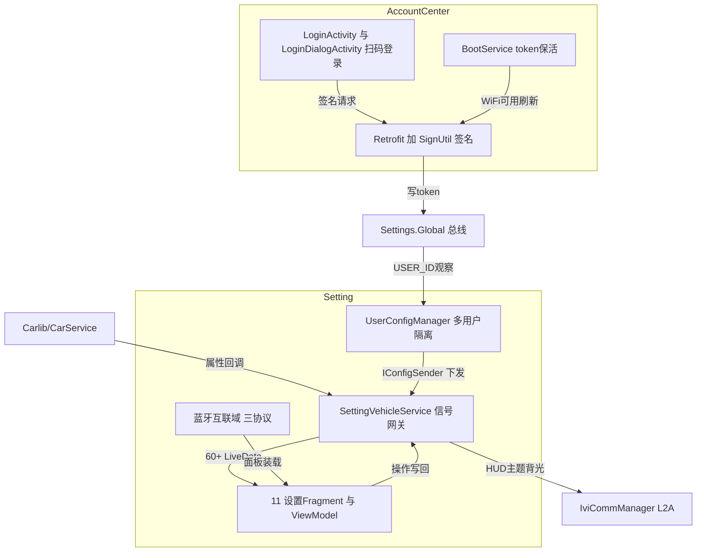

# Setting 与 AccountCenter 架构解码

> 源码锚点：commit `d653d105f86b946685f3ff5133a3079d718d7882`（main）｜ 生成：2026-09-06 ｜ 范围：子系统 application/Setting（77 文件）+ application/AccountCenter（39 文件）（批次 4 之一）
> 上游文档：[ARCHITECTURE.md](ARCHITECTURE.md)（全局地图与主链路）

两个应用通过 **Settings.Global** 首尾咬合：AccountCenter 写入 token/USER_ID，Setting 的多用户配置隔离消费它——这是理解两模块关系的钥匙。

## 1. 模块卡片

### Setting（车设中心）

**职责**：车辆设置中心——把 CAN 信号与 L2A 内部信号翻译成 11 个设置页的 DataBinding 状态，把用户操作翻译回车辆信号（系统 UID，Manifest:6）。

**对外接口**：LAUNCHER `MainActivity`（singleTask）；语音跳转 `VoiceOperationUtil.handleIntent` 解析 key/voice_operation extra（utils/VoiceOperationUtil.kt:75-87、:118-144）；A2L 命令通道 provider meta-data `cmd_controller_callbacks`；跨应用读写 Settings.Global（USER_ID/IS_OPEN_HUD/THEME_SHOW_MODE 等）。

**关键协作**：⚠ ① `SettingVehicleService.kt:34` 反向依赖 signal 包的 `settingVehicleService` lazy 单例，而该单例定义在 `CmdController.kt:44`——"命令控制器"文件里住着"信号服务"的全局句柄，文件名与内容错位；② 外部 SDK 三件套：腾讯 wecarnavi（DisplayViewModel.kt:17）、思必驰 AiLitBusiness（MyApplication.kt:63）、`BtAnwManager` 另一套蓝牙栈（MyApplication.kt:12）；③ `CmdController` 四个回调全返回 -1/null 的空壳（CmdController.kt:16-40）；④ `signal/VehicleMsgFilter.kt` 去重节流工具**全仓无调用者**——死代码。

**设计动机**：系统 UID + 平台签名直接操作车辆硬件；BaseManager 生命周期随系统起停（InitService.kt:10）；高低配差异用 SysProp 静态分支（VehicleControlFragment.kt:164-167）。

**雷区**：蓝牙/互联域三巨头（BluetoothFragment 年改 26 次、BluetoothUtil 25、DeviceConnectManager 23）互相持有静态状态（`BluetoothUtil.SCurrentThirdDevice`、`BluetoothFragment.SConnectCallback`），是最难动的区域；`VehicleControlFragment` 1933 行单类承载座椅+HUD+加热全部逻辑。

### AccountCenter（账户中心）

**职责**：车机端扫码登录——生成二维码、轮询登录态、把 token 写进 Settings.Global 供全车共享，承担开机 token 保活与全局强制登录弹窗。

**对外接口**：LAUNCHER `LoginActivity`；`CenterActivity`（singleTask）；`LoginDialogActivity`（singleInstance + Dialog 主题，注释明言"用于 token 过期，第三方应用强制登录使用"）；BootReceiver→BootService 前台服务；跨进程契约 = Settings.Global 的 accessToken/refreshToken/userId（CommonTools SettingsUtils.kt:6-51）。

**关键协作**：⚠ ① token 的真正"数据库"是 Settings.Global 而非私有存储，Setting 的多用户逻辑直接消费（UserConfigManager.kt:46）；② `RetrofitManager.kt:35` 无 token 时回退**硬编码 JWT 头字符串** `"eyJhbGciOiJIUzI1NiIsInR5cCI6IkpXVCJ9"`，且 :36 把 accessToken 打进日志（本轮 sed 验证）；③ `LoginDialogActivity` 与 `LoginActivity` 是复制粘贴级双胞胎；④ `CenterActivity.kt:44` 注释承认 Intent 直传 token 是为"消除 Settings.Global 写入延迟"——Global 写入非原子可见的自觉。

**设计动机**：车机无输入设备，扫码是唯一登录方式；启动即登录（LoginDialogActivity onCreate 直接 requstLoginQRCode，:64-70）；网络恢复刷 token 保活（BootService.kt:77-99，仅 WiFi 触发）。

**雷区**（安全硬伤清单，本轮 sed 验证三处）：AES 密钥硬编码 + **IV 全零**（AES256Util.kt:11、:19-23）；test/dev 密钥写在注释（SignUtil.kt:6-9）；测试 SN/VIN 硬编码（Commons.kt:38-39）、协议 URL 是 baidu/hao123 占位（:41-42）；token 明文进日志（LoginActivity.kt:205-206、RetrofitManager.kt:36）+ 明文存 Settings.Global（LoginActivity.kt:209-210）。

## 2. 结构图

本图回答：**两个应用如何通过 Settings.Global 咬合、Setting 的信号如何双向流动**。不包含：各设置页内部控件。

图例：矩形/圆角 = 类域；实线 = 调用/数据流。闭环：登录→token 入 Global→Setting 观察用户切换→按用户下发座椅/HUD 配置。

## 3. 核心类深卡片

### SettingVehicleService（init/SettingVehicleService.kt，926 行）

**职责**：全车设唯一 CAN/L2A 信号网关——上行双通道分发（CAN 走 `propertyHandlerMap` :309-424，HUD/声音/仪表走 L2A `onCommState` :676-754），下行 `sendVehicleProperty/sendL2A`，聚合 CarAudioManager（:552-561）、座椅 DriveStateManager（:898-916）、UserConfigManager（:841-864）。
**协作者**：CarServiceManager 就绪回调（:527-542）；IviCommManager 三回调（:590-599）；UserConfigManager 以 IConfigSender 匿名对象注入（:842-862）。
**设计动机**：11 个设置页都要秒级反映车辆状态，但类加载即建 60+ LiveData 会拖慢启动——代码自注"统一改为懒加载初始化实例，防止类加载时初始化太多 MutableLiveData"（:81-84）；一个无状态单例 + lazy LiveData 字典替代每页独立订阅（churn 17 次/年的汇聚点）。
**不变量**：①`mIsReady=false` 时一切读写快速失败返回 -1/null/false（:432-494）；②L2A 写出必须 `mL2AIsReady && l2aConStatus==1` 双条件（:622-630）；③ADAS 上报 8 字段全等去重（:762-771）。⚠ :882-888 留有 400ms 模拟硬件回复的 TODO 测试代码。

### UserConfigManager（utils/UserConfigManager.kt，334 行）

**职责**：以 Settings.Global 的 userId 为唯一事实源，在用户切换/退出/清除三事件上决定"配置维持"还是"配置下发"，实现多用户座椅/HUD 隔离。
**协作者**：SettingVehicleService 注入的 IConfigSender（:26，实现在 SettingVehicleService.kt:842-862）；ShareConfigUtils 按用户存 `/data/share/user_{id}_vehicle_config.properties`（ShareConfigUtils.kt:24）；DriveStateManager 判限速挡（:278-280）。
**设计动机**：注释完整写下三场景矩阵（:118-131，本轮 sed 验证）：切新账号/游客→维持物理状态+UI 不选中；切老账号且同步开→物理下发；座椅名字跟随账号刷新。git 考据：近 5 次提交全是"多账户切换座椅配置"系列（f9f9c990、d2257e2c 等）——踩坑后逐步收拢的产物。
**不变量**：①游客 userId 恒 0L 且永不删除（:32、:245-248）；②下发前必须座椅/HUD 同步开关=="1"（:194、:221）；③座椅下发仅在 `DRIVELIMITED1` 挡（:280）。

### 蓝牙域三巨头：BluetoothUtil（+ BluetoothFragment / DeviceConnectManager）

**职责**：BluetoothUtil（737 行）是"换设备"决策器——判断新设备与当前三方互联设备关系，决定直连/11 秒倒计时确认/先断旧再连新，抹平 CarPlay(1)/HiCar(2)/CarLink(3)/蓝牙(4) 四协议；BluetoothFragment（521 行，年改 26 次）管设备列表 UI 与蓝牙栈事件；DeviceConnectManager（1055 行）管三个 ts.car 服务绑定重试与流量共享。
**设计动机**：车机音频/投射通道唯一，断连顺序错误会导致协议栈卡死——commit 迭代链可见（407c86d1→80139723→5b5134f8→37bd1320）；用静态可变状态 + 静态回调换取跨 Fragment 生命周期的全局互斥（BluetoothUtil.kt:48-54），代价是持续修补。
**不变量**：①切换确认弹窗同时只存在一个（:138-140、:217-219）；②倒计时 11 秒自动 dismiss（:240-256）；③Fragment 销毁必须复位静态标志并停扫描（BluetoothFragment.kt:449-456）。⚠ 同目录 `BluetoothAnwFragment`（620 行）基于另一套 ANW 蓝牙栈复用同一布局，由 BluetoothDialogFragment hide/show 双持（:27-57）——切换条件待确认。

### VehicleControlFragment（ui/fragment/VehicleControlFragment.kt，1933 行）

**职责**：车控页唯一控制器：四个 SysProp 高低配开关动态装配布局（:196-217）、15+ 信号观察、座椅/HUD 全部交互。
**设计动机**：CAN 是单向命令+异步回执 → 本地 `*Temp` 临时值 + `ReboundJob` 1 秒超时回滚（:667-717，本轮验证过的"乐观更新+回滚"母题再现）；注释固化注册顺序约束"CAN 状态观察者必须在高度/角度观察者之前注册，避免 CAN 恢复回调覆盖边界禁用状态"（:945-950）；长按连发由 CanSignalTouchListener（500ms 阈值 + 100ms 周期，:23-25）+ 工厂方法批量挂接（:781-801）。
**不变量**：①CAN 断开时所有座椅点击忽略（:681-684）；②高度/角度禁用标记用 Boolean? 区分"未初始化"与 false（:150-151）；③两套座椅 binding 二选一，另一个置 null（:206、:214）。

### 网络与签名三件套：RetrofitManager + SignUtil + AES256Util（合并卡）

**职责**：把"车机身份 = SN+VIN+时间戳+签名"做成每请求隐式协议：SignUtil TreeMap ASCII 排序拼参+密钥 AES256 加密出 sign（SignUtil.kt:17-32）；AES256Util 出原语；RetrofitManager 出带 token 的客户端。
**关键事实**（本轮 sed 验证）：无 token 回退硬编码 JWT 字符串（RetrofitManager.kt:35）；每请求打印 accessToken（:36）；`X-No-Auth` 头发出前剥离（:42）；密钥硬编码且 IV 全零（AES256Util.kt:11、:19-23）——"防君子不防逆向"。
**不变量**：每请求必带 X-Sequence-No（UUID）与 X-Timestamp（:40-41）；AES 前置 16 字节 IV 与解密切 16 字节偏移约定一致（:41-45 对 :52-62），但该 IV 恒全零。

### LoginActivity（ui/login/LoginActivity.kt，385 行）

**职责**：扫码登录全生命周期：签名请求二维码→ZXing 本地渲染 300px（:184）→1 秒轮询登录态 + 900 秒二维码刷新双 Timer→成功写双 token（:209-210）跳 Center。
**设计动机**：轮询不能停但查看协议页必须暂停（`isPausedByAgreement` :44、:252）；用两个裸 Handler 而非协程（:48-60），onPause 一律停+dismiss（:365-374）、onResume 按标记恢复（:346-351）——任何离开路径不漏电不误跳。
**不变量**：登录成功即停轮询（:213）；onResume 发现已登录直跳 Center（:338-344）；VIN 为空永不发起请求（:103-107）。

## 4. 全类职责表

### Setting（入表 70 / 77 ≈ 91%；跳过 7 个纯 DTO：ui/bean/ 下 ConnectUpDateResult、HiCarConnectResult、HotspotItem、MultiAccessPoint、MultiBluetoothAnwDevice、MultiBluetoothDevice、HiCarDeviceItem）

| 类（相对路径） | 一行职责 | 关键协作 |
|---|---|---|
| MyApplication.kt | 系统应用壳：协程点亮蓝牙栈/互联/腾讯导航/思必驰四 SDK，夜间模式变化同步 L2A | DeviceConnectManager:51、AiLitBusiness:63 |
| Constants.java | 全模块字符串常量与 L2A 信号 ID 集中定义（DEBUG=true 恒真） | 全模块 |
| base/BaseDialogFragment.kt | Setting 自有弹窗基类：统一窗口参数/暗层/首次显示 | 15 个 diologfragment 子类 |
| extension/ViewAdapter.kt | DataBinding @BindingAdapter：src 与 visibility | 各布局 |
| extension/ViewExtension.kt | View 扩展：开关快速点击、带回弹点击 | VehicleControlFragment:651 |
| init/DeviceConnectManager.kt | 手车互联单例：绑定/重试 CarPlay+HiCar+CarLink 三平台服务并广播连接与流量共享事件 | MyApplication:51、BluetoothUtil |
| init/InitService.kt | BaseManager 框架实例化引导（目前只有 SettingVehicleService） | SettingVehicleService:13 |
| **init/SettingVehicleService.kt** | CAN+L2A 双向信号网关：60+ lazy LiveData 分发与写入口 | 全部 Fragment/ViewModel |
| signal/CmdController.kt | A2L 命令注册壳（四回调全空）+ settingVehicleService 全局句柄宿主 ⚠文件名与内容错位 | Manifest provider 段 |
| signal/VehicleMsgFilter.kt | 1111ms 时间窗去重节流——⚠全仓无调用者，死代码 | 无 |
| ui/activity/ConnectChildDialogActivity.kt | 透明弹窗宿主 Activity：按 intent 挂 Wlan/Bluetooth/Hotspot 三弹窗供他应用唤起 | ConnectFragment:109 |
| ui/activity/MainActivity.kt | 11 Fragment 装配、导航高亮与 hide/show 切换总线，兼接语音跳转 | NavAdapter、VoiceOperationUtil |
| ui/activity/PairDialogActivity.kt | 蓝牙配对 PIN 确认弹窗 Activity（singleInstance） | BluetoothFragment:308-311 |
| ui/adapter/BluetoothAdapter.java / BluetoothAnwAdapter | 两套蓝牙栈的设备多布局列表 Adapter | 对应 Fragment |
| ui/adapter/DebounceOnItemClickListener.java | view tag 存时间戳的 500ms 列表防抖器（普通+子项两版） | 各列表 |
| ui/adapter/HotspotAdapter / NavAdapter / WlanAdapter | 热点/左导航/WiFi 列表 Adapter | 对应弹窗 |
| ui/fragment/AIPetFragment | AI 萌宠开关页：订阅 aiPetSwitch 回写 CAN | SettingVehicleService |
| ui/fragment/AssistedDrivingFragment | ADAS 预警全家桶 UI（前碰/车道偏离/后碰/侧向/补盲），下行走 sendL2A | L2A 组 :328-393 |
| ui/fragment/CanSignalTouchListener | 长按 500ms 后 100ms 周期连发 CAN、短按单次的 OnTouchListener | VehicleControlFragment:628-639 |
| ui/fragment/ConnectFragment | 连接总览页：三行状态文本 + 唤起子弹窗 | ConnectViewModel:51-57 |
| diologfragment/BluetoothAnwFragment | ANW 蓝牙栈版设备列表面板（与 Wx 版同布局平行实现 ⚠） | BtAnwManager、BluetoothDialogFragment:27-57 |
| diologfragment/BluetoothDialogFragment | 蓝牙弹窗容器：同时装载 Wx 版与 ANW 版子 Fragment 按 hide/show 双持 | ConnectChildDialogActivity:85 |
| diologfragment/BluetoothFragment.kt | 主蓝牙面板：扫描/配对/连接/断开/移除/流量共享全事件（churn 第一名） | BluetoothUtil、DeviceConnectManager:194 |
| diologfragment/CustomEditDialogFragment.java | 通用文本编辑弹窗（座椅位置命名等） | VehicleControlFragment [inferred] |
| diologfragment/CustomKeyDialogFragment | 自定义按键设置弹窗（长按/索引区分） | VoiceFragment [inferred] |
| diologfragment/DialStyleDialog | 仪表样式/尺寸选择弹窗（isSize 两用） | DisplayFragment [inferred] |
| diologfragment/GlobalWakeUpDialogFragment | 全局唤醒词开关弹窗 | VoiceFragment:84 |
| diologfragment/HotspotDialogFragment | 热点开关与配置面板 | ConnectChildDialogActivity |
| diologfragment/NaviHdDialog / SceneModeDialogFragment / ScheduleCycleDialog / ScheduleSentryModeDialog / SentinelDialog / WebFragment | 导航 HD 说明/场景模式二级配置/哨兵周期/哨兵时间/哨兵说明/内嵌 WebView 六个功能弹窗 | 对应 Fragment/VM |
| diologfragment/WlanCustomEditDialogFragment.java | WiFi 隐藏网络手动添加弹窗（NOSONAR 最多 15 处） | WlanDialogFragment |
| diologfragment/WlanDialogFragment | WLAN 开关/列表/连接面板 | ConnectChildDialogActivity |
| ui/fragment/DisplayFragment | 显示页：亮度/夜间模式/续航模式/仪表样式尺寸（Kanzi 相关） | DisplayViewModel |
| ui/fragment/DrivingFragment | 驾驶页：驾驶模式/能量回收/坡道驻车/陡坡缓降/TCS/ABS + 信号降级 UI | settingVehicleService:103-311 |
| ui/fragment/LightFragment | 灯光页：外灯/伴我回家/补光/转向回正 + 三组氛围灯全参数（862 行） | settingVehicleService:89-182 |
| ui/fragment/SceneModeFragment / SoundFragment / SystemFragment / VoiceFragment | 场景模式/六音区声音/系统（含出厂重置双通道 :391-392）/语音设置四页 | 对应 ViewModel |
| **ui/fragment/VehicleControlFragment.kt** | 车控巨石页：座椅调节记忆/加热/HUD 全套/驻车娱乐/脚撑时间（1933 行） | settingVehicleService 15+ 信号 |
| ui/viewmodel/ConnectViewModel | 连接总览页 VM：同时挂 WiFi/蓝牙/AP 三监听器拼三行状态 | ConnectFragment |
| ui/viewmodel/DisplayViewModel | 夜间模式三态（UiModeManager）+背光联动+腾讯导航 HD 开关（错误码 246 弹协议） | DisplayFragment |
| ui/viewmodel/SoundViewModel | CarAudioManager 六音区音量 + 按 usage 分组 SoundPool 试听（Mutex+500ms 停止） | SoundFragment |
| ui/viewmodel/SystemViewModel | 家庭/公司地址跳转（未同意协议拦截）、哨兵模式时间文案 | SystemFragment |
| ui/widget/GearSwitchView / GearSwitchView2 / GearThumbSwitchView | 三代旧档位拨杆控件（约 2700 行）⚠现无布局引用，仅剩一条 unused import | 无 |
| ui/widget/GearSwitchViewNew | 现役档位拨杆控件（4 处布局引用） | DisplayFragment:79 |
| ui/widget/BaseSwitchCompat / OffToOpen / OpenToOff | 抽象开关骨架与两个单向动画子类 | 布局 |
| ui/widget/LimitedSeekBar(ToggleableLimitSeekBar) / LinearProgressView / ArcProgressView / NoMenuEditText | 限区 SeekBar/线性进度/圆弧进度/禁粘贴输入框 | 布局 |
| **utils/BluetoothUtil.kt** | 跨四协议设备连接切换决策器 + 全部确认弹窗（churn 第二名） | BluetoothFragment、DeviceConnectManager |
| utils/JsonFileStore | AtomicFile JSON 原子读写器（崩溃不损文件） | [inferred] 配置持久化 |
| utils/PwLegalInputFilter / SsidLegalInputFilter / RotatingImageViewHelper | 密码/SSID 合法字符过滤器/图片旋转辅助 | 编辑弹窗 [inferred] |
| **utils/UserConfigManager.kt** | 多用户座椅/HUD 配置隔离：三个 Global Observer 驱动的场景化下发器 | SettingVehicleService、ShareConfigUtils |
| utils/IConfigSender（UserConfigManager.kt:306-334） | 配置下发五回调接口，隔离 UserConfigManager 与信号层 | SettingVehicleService 匿名实现 |

### AccountCenter（入表 32 / 39 ≈ 82%；跳过 7 个纯 Gson DTO：AgreementResponse、BindUserResponse、LoginRequest、LoginResponse、LoginStateRequest、LoginStateResponse、UserInfoResponse）

| 类（相对路径） | 一行职责 | 关键协作 |
|---|---|---|
| di/MyApplication.kt | 16 行空应用壳：只打一条 Yadea_Trace 日志 | 无 |
| base/BaseActivity.kt | 自家 RxJava 版 MVVM 基类：DataBinding 四段式 + startWebView | Login/Center 页 |
| base/BaseResponse.kt | statusCode/message/data/timestamp 通用响应壳 | 全部接口 |
| base/BaseViewModel.kt | CompositeDisposable 订阅管理 VM（⚠与 CommonTools 协程版同名不同实现） | 各 VM |
| common/Commons.kt | BASE_URL/7 端点/超时/硬编码测试 SN+VIN/baidu 占位协议 URL 常量池 ⚠ | ApiService、LoginActivity |
| data/api/ApiService.kt | 7 个 Retrofit 端点；getLatestTerms 带 X-No-Auth | RequestApi |
| data/api/RequestApi.kt | 类加载即初始化 RetrofitManager 单例的持有器 | RetrofitManager:5 |
| data/repository/RequestRepository.kt | 全部网络请求的 Observable 包装层（ioToMain） | 三个 ViewModel、BootService:143 |
| dialog/ExitLoginDialog | 登出确认 Dialog（含"清除数据"CheckBox 回调） | CenterActivity:91-103 |
| dialog/PreferenceSaveDialog | 偏好"保存/恢复/忽略"三选 Dialog | PreferenceAdapter [inferred] |
| dialog/QrCodeLoginDialog | 二维码登录 Dialog：正常/失败/刷新/协议四态 | LoginActivity:256-291 |
| model/Account、Preference | 本地账户/偏好条目 | Adapter |
| adapter/AccountAdapter、PreferenceAdapter | 账户/偏好列表 Adapter（对应页面入口未见 ⚠） | [inferred] |
| service/BootReceiver | BOOT_COMPLETED → startForegroundService(BootService) | BootService |
| service/BootService.kt | 前台服务：WiFi 可用即刷 token，60 秒防抖，成功回写 Global（SN/VIN 注释自认测试值 :129） | RequestRepository、SettingsUtils:154 |
| ui/center/CenterActivity.kt | 个人中心：信息展示、HUD/座椅同步开关、登出双清（clearAll :228-237） | CenterViewModel、ExitLoginDialog |
| ui/center/CenterViewModel | Center 页四个 LiveData 的 Rx 订阅转发 | RequestRepository |
| **ui/login/LoginActivity.kt** | 扫码登录页：签名→二维码→双 Timer 轮询→token 落地→跳 Center | LoginViewModel、QRCodeGenerator |
| ui/login/LoginDialogActivity.kt | 全局强制登录弹窗：同链路 + getUserInfo/getBindList 角色落库；⚠onPause 即 finish | AccountProfileUtils:234、AccountRoleUtils:240 |
| ui/login/LoginViewModel | 登录域 6 个 LiveData 的 Rx 转发 | RequestRepository |
| ui/qrcode/QrCodeLoginViewModel | 备用扫码 VM：fetchQrCode 主体已注释（死码） | 无活跃调用者 |
| ui/WebPolicyActivity | 通用协议 WebView 页 | BaseActivity.startWebView |
| utils/AccountProfileUtils | 登录用户头像 URL/生日写 Global 的跨进程小档案 | LoginDialogActivity:234 |
| utils/AccountRoleUtils | 由人车绑定列表判定 OWNER/NON_OWNER 写 Global | CenterActivity:189 |
| utils/AES256Util.kt | AES-256-CBC：⚠硬编码密钥 + 全零 IV，密文头部拼 IV | SignUtil |
| utils/GsonUtils | 单例 Gson 薄包装 | [inferred] |
| utils/QRCodeGenerator.kt | ZXing 二维码位图生成（容错 H、RGB_565）+ Logo 合成变体 | LoginActivity:184 |
| **utils/RetrofitManager.kt** | OkHttp+Retrofit 单例：动态 Bearer、X-No-Auth 剥离、链路号/时间戳注入 ⚠无 token 回退硬编码 JWT 且打日志 | RequestApi:5 |
| utils/RxJavaUtils | ioToMain ObservableTransformer | RequestRepository |
| utils/SignUtil.kt | 请求签名：TreeMap ASCII 排序拼参+密钥+AES256 ⚠test/dev 密钥写在注释 | AES256Util、LoginActivity:77 |

## 5. 看着糟但其实没问题

1. **CmdController 四回调全返回 -1 的 44 行空壳**——A2L 命令框架的注册桩：manifest 只需类名挂 meta-data；当前车设没有需响应的外部命令。[inferred] 未来 A2L 下发的入口就是这里。
2. **`initObserve() {}// NOSONAR` 等空实现**——CommonTools 基类强制实现抽象方法的产物，空体是合法的"本页无观察"声明。
3. **RetrofitManager 用 ActivityThread 反射拿 Context**（:79-85）——系统 UID 下可用且稳定；不过 CommonTools 已有 `ContextGet.applicationContext()`，属"能跑但没必要"。
4. **`setupHeaterCycleClick` 11 参数函数**（VehicleControlFragment.kt:666-679）——参数全是存取器对，`@Suppress("kotlin:S107")` 已自知；无共享状态前提下可接受的去重手法。

## 6. 开放问题

**安全硬伤汇总（需优先人工确认）**：token 明文进日志三处 + 签名 deviceSign 进日志（LoginActivity.kt:111）；token 明文存 Settings.Global；AES 密钥硬编码 + IV 全零 + test/dev 密钥注释；测试 SN=`898915121312356`/VIN=`test260526a` 上线前必须整体替换；NOSONAR 共 124 处（Setting 117 + AccountCenter 7）。

**需人确认**：
1. `LoginDialogActivity` 在 onPause 即 finish（:348-358）——被遮挡即自杀，是否影响第三方拉起体验。
2. 两处二维码时长不一致：LoginDialogActivity 用 90000ms（:36-37）、LoginActivity 用 900000ms（:36），注释互换且都写"dev 900 秒，test 90 秒"——哪套是准的？
3. Wx 版与 ANW 版蓝牙 Fragment 的切换依据（BluetoothDialogFragment.kt:27-57）。
4. Setting 的 `saveHudConfig` 每个 HUD 观察者无条件回写（VehicleControlFragment.kt:261-321）与 AccountCenter 的 HUD 开关（CenterActivity.kt:56-59）是否形成写环——建议画时序确认。
5. 两个 APK 均声明 system UID 且各有 LAUNCHER——同分区双 APK 的 Global 写可见性与资源冲突（Setting 用 tools:replace 强改三属性）需构建侧确认。

**[inferred]（可清理死代码，删前需车型矩阵回归）**：VehicleMsgFilter、GearSwitchView/GearSwitchView2/GearThumbSwitchView（约 2700 行）、QrCodeLoginViewModel；SettingVehicleService 的 400ms 模拟回复脚手架（:882-888、:923-925）。

**未深挖**：com.androidext.core BaseManager 框架与 CommandControllerReceiver provider 完整机制（aar 内）；15 个 diologfragment 弹窗的逐一交互细节；AccountCenter 偏好/账户列表页的真实入口。
