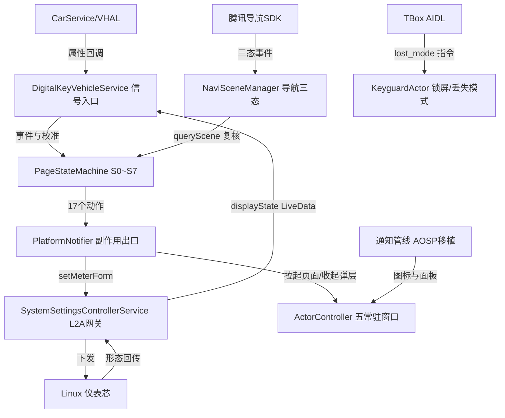
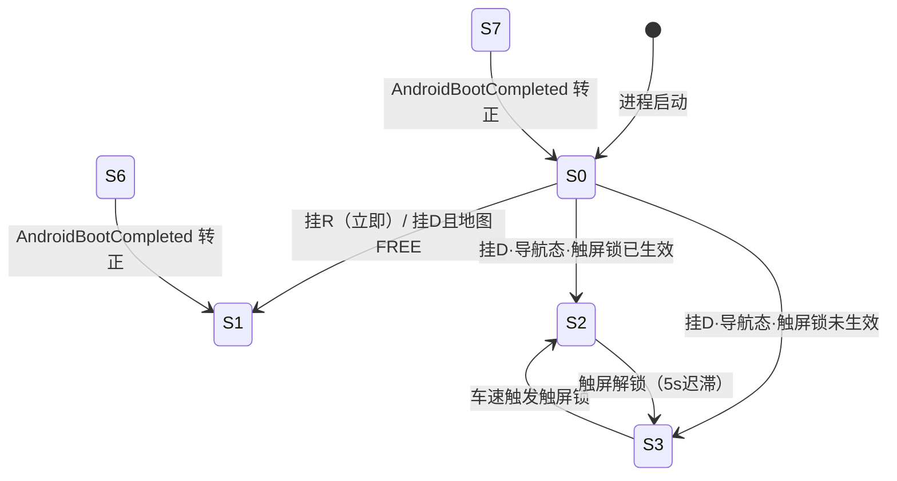

# SystemUI 架构解码（application/SystemUI）

> 源码锚点：commit `d653d105f86b946685f3ff5133a3079d718d7882`（main）｜ 生成：2026-09-06 ｜ 范围：子系统 application/SystemUI（批次 2 之一）
> 上游文档：[ARCHITECTURE.md](ARCHITECTURE.md)（全局地图与主链路）

包路径 `application/SystemUI/src/main/java/com/android/systemui/`（下称 `P/`），main 源集 170 个 .java/.kt。身份即平台 SystemUI：applicationId `com.android.systemui`、`coreApp` + `sharedUserId=android.uid.system`、`persistent="true"`（Manifest:4-6、:204）。

## 1. 模块卡片

**职责**：Android 交互芯的"仪表伴侣"常驻进程——管状态栏/导航栏/下拉面板/音量条/锁屏一组 WindowManager 常驻窗口，接收 MCU 车辆信号驱动 S0~S7 双芯页面状态机，决策以 L2A 信号发给 Linux 仪表芯，同时承接 AOSP 车机通知体系（NotificationListener + HUN 横幅 + 通知中心）与丢失模式（TBOX 远程遮盖）。

**对外接口**：
- 进程入口：系统拉起 persistent 进程 → `SystemUIApplication.onCreate`（P/SystemUIApplication.kt:76-94）→ `SystemUIService.onCreate` 触发 `startServicesIfNeeded()`（P/SystemUIService.kt:20-34）→ `ActorController.init()/showSystemUI()`（P/SystemUIApplication.kt:226-227）。`MainActivity` 只是调试入口（Manifest:212-221）。
- Manager 装载：`configs.xml:3` 把 `init.InitService` 注册为 `android_ext_main_service`，由 component/SystemUIService 库拉起，`doInit()` 按固定顺序创建 6 个 BaseManager（P/init/InitService.java:27-33）。
- 跨芯/跨进程：① L2A `IviCommManager`：Set/Get `Meter_Form`(0~7)/`Drive_Touch_Lock`/`Theme_Style`/HUD/背光（P/cmdcontroller/systemsetting/SystemSettingsControllerService.kt:990-1046）；② TBox 稳定 HAL `vendor.hardware.tbox.ITboxService` clientId=6，`lost_mode` JSON 协议（P/digitalkey/LostModeTboxClientManager.kt:36-51）；③ cmdcontroller Provider 回调（Manifest:264-275）；④ NotificationListenerService（Manifest:277-285）；⑤ 手势/天气 AIDL 绑定。
- 前置条件：L2A 必须 `isL2AInit`（SystemSettingsControllerService.kt:878）；车辆信号下行必须 `mIsReady`（P/digitalkey/DigitalKeyVehicleService.kt:579、604、627）。
- 错误模式：连接类统一"失败→3s 重连"（NaviSceneManager.kt:38、LostModeTboxClientManager.kt:47、GestureServiceConnector.kt:51）；CarPowerManager 失败 500ms×3 重试（DigitalKeyVehicleService.kt:59-62）；L2A"瞬连瞬断"容错（SystemSettingsControllerService.kt:947-952 注释记录 2026-05-17 现场 bug）；Car 初始化用 generation 计数丢弃陈旧重连结果（SystemUIApplication.kt:101-104、128-131，本轮抽查属实）。

**关键协作**：依赖 component/SystemUIService 库（BaseActor/FragmentHostManager/BaseManager/cmdcontroller aar）、neusoft CarServiceManager、yadea IviComm、腾讯 naviSdkClient aar。⚠ 意外方向（反向依赖）：① `KeyguardActor`（UI 窗口）反向驱动状态机 `restoreAfterLostMode()`（KeyguardActor.kt:851-855）；② 音量控件 `CarAudioVolumeController` 把"媒体焦点离开网易云"转成状态机歌词页事件（P/vehiclecontrol/volume/CarAudioVolumeController.kt:15-17）；③ 设置服务反向订阅状态机 `isScreenLocked` 补发仪表标记（SystemSettingsControllerService.kt:939）。

**设计动机**：双芯架构下 Android 只负责"交互芯前台是什么 + 告诉 Linux 仪表显示形态几"，两者必须最终一致——displayState 回传会反向 `setCurState` 校正状态机（DigitalKeyVehicleService.kt:338-355，注释"避免初始化后 Linux 形态被外部切换，Android 端仍持有过期状态"）；决策点用同步 binder 复核地图三态，"事件推送可能遗漏/多客户端不可达"（NaviSceneManager.kt:26-27）。行驶触屏限制对应规范条目（DriveTouchLockController.kt:12-19 "V1.1 §5.2"）。

**雷区**：
1. `PageStateMachine` 全公共方法 `@Synchronized`，且 `isMapInNaviOrCruise()` **持锁期间**做同步 binder 查询（PageStateMachine.kt:494-497 自注释"毫秒级阻塞"）；`DriveTouchLockController` 刻意锁外回调防双锁死锁（DriveTouchLockController.kt:22-26）。
2. TBox `lost_mode` 线上 value=0 是**开启**、1 是关闭（LostModeTboxClientManager.kt:26，本轮抽查属实），与常量 `LOST_MODE_ON=0x01`（DigitalKeyConstants.kt:56-57）**数值方向相反**。
3. `CarNotificationListener.registerAsSystemService` 只能由 Application 在 Car 就绪后调用一次（SystemUIApplication.kt:146-150）。
4. Keyguard/丢失模式是横切拦截层：新事件入口必须接入 `GestureGuard.isBlocked`（P/digitalkey/mainaction/common/GestureGuard.kt:25-81）与 `GestureServiceConnector.dispatchGesture`（GestureServiceConnector.kt:236-245）。
5. `isNeedStartNavi` 恒 false（PageStateMachine.kt:36，本轮抽查属实）——B1↔B2 自动流转与多处 bringNav 分支实际被禁用（开放问题 §7）。

## 2. 结构图

本图回答：**状态机的事件从哪来、决策往哪去、五个常驻窗口和通知管线挂在哪**。不包含：窗口内部 Fragment 布局与动画细节。除四个外部节点（CarVHAL/TENCENT/TBOX/LINUX）外，其余节点同属 SystemUI 进程。

图例：矩形 = 类/概念；实线 = 调用/数据流。闭环 = `PSM → NOTIFIER → L2A → LINUX → L2A → DKVS → PSM`（Android 状态向仪表实际形态对齐）。

核心状态机的"挂挡环"（简化图，仅画有直接证据的转移；B2/歌词/受限页分支见 `PageStateMachine.kt:669-997` 全表，其中 B1↔B2 自动流转被 `isNeedStartNavi=false` 门控禁用，见 §7）：

图例：S0=驻车桌面、S1=Linux仪表、S2=常态导航、S3=暂态导航、S6=受限页、S7=加载遮盖页（State.kt:7-14）。S5 歌词页由音频焦点事件进入（CarAudioVolumeController 门控），图中省略。

## 3. 核心类深卡片

### PageStateMachine（P/digitalkey/mainaction/PageStateMachine.kt）

**职责**：对外只有 `init/handleEvent/setSpeed/setGear/setPluginGun/set*Foreground/setSubMode/getState/restoreAfterLostMode` 一组 `@Synchronized` API（:56-444）；内在职责是把事件流编译成"Android 前台 + Linux 仪表形态"的联合迁移并保证两芯最终一致。
**协作者**：被 DigitalKeyVehicleService（:216、:225-241、:736-743）、GestureServiceConnector（:264）、StateEventRouter（:28-53）、DriveTouchLockController 回调（:374-397）、CarAudioVolumeController 调用；调用 PlatformNotifierImpl（transitionTo 的 action）、NaviSceneManager.queryScene（:495）、GestureGuard.isBlocked（:118）、LostModeHelper（:102-108）。
**设计动机**（场景三元组）：
- 挂 D 的三分支：驻车 + 地图导航态 + 触屏锁开关=开 → 进 S3 暂态导航（地图保持前台），车速触发锁后再转 S2 → 度量：`handleGearDR` 的 `mapKeepForeground && DriveTouchLockController.isSwitchOn()` 分支（:517-530）。
- 转场不打架：Launcher 前台时进 S1 立即 setMeterForm(1) 会与桌面转场动画冲突 → 延迟 1200ms 且期间任意事件取消 → 度量：`scheduleS1MeterForm` 执行前复查 `curState == State.S1`（:612），`handleEvent` 末尾统一 `cancelPendingS1MeterForm`（:93-96）。
- 崩溃自愈：Android 异常重启时 Linux 停在形态 6/7（加载遮盖/受限页）→ `AndroidBootCompleted` 事件把 Linux 拉回形态 1/0，丢失模式下不发通知 → 度量：:140-160、:256-276，触发源是 displayState 观察者（DigitalKeyVehicleService.kt:415-421）。
**不变量**：① `transitionTo` 先副作用后改状态（:652-656）；② 挂 D/R 只在 S0 有效（:509-512、:557-560）；③ 插枪期 Gear_D/R 事件被吞（:208-220，注释"再挂挡不发档位切换信号"）；④ 丢失模式只更新 ctx.gear/isPluggedIn，绝不切页发通知（:126-166）；⑤ 持锁内的唯一阻塞例外是 `refreshMapScene` 同步 binder（:494-497）。

### SystemSettingsControllerService（P/cmdcontroller/systemsetting/SystemSettingsControllerService.kt）

**职责**：L2A 通道全进程唯一持有者：`initL2A` 失败递归重试（:603-615）、连接态容错（:925-972）、命令收发 API（:877-1046）、onCommState→LiveData 去重分发（:1059-1107）。
**协作者**：被 PlatformNotifierImpl、DigitalKeyVehicleService、SystemUIApplication（夜模式）、各 UI Tile 依赖；依赖 IviCommManager、HotspotManager、BtAnwManager、PageStateMachine（只读 isScreenLocked，:939）。
**设计动机**：现场 bug（2026-05-17，:947-950）：a2l 连接成功后先收 0 再回 1 → 不重置则后续 Get 永远无回调，形态/亮度全部拿不到 → "1→0"时复位 mPreL2AStatus/mPreHudState，重连后重取 getMeterForm/getScreen 并补发 DriveTouchLock（:933-939）、`resetOnDisconnect`（:970-972）。
**不变量**：① 所有发送被 `isL2AInit` 门控；② Get 应答与 Set 确认都走 onCommState，displayState/meterState 必须经 `AtomicInteger.getAndSet` 去重，否则"一直监听的 DigitalKeyVehicleService 会把 PageStateMachine 状态冲掉"（:1075-1079 原注释）；③ 瞬断重连后必须重发触屏锁标记（:938-939）。

### DigitalKeyVehicleService（P/digitalkey/DigitalKeyVehicleService.kt）

**职责**：车辆域总入口：属性监听注册（immediateCallback=true，:512-517）、信号分译、滚轮长按 1.5s 计时（:547-569）、框架电源态归一化（:497-501）、Linux displayState/meterState 双向同步（:315-409）、MCU 下行四 API（:577-666）。
**协作者**：PageStateMachine（事件源）、DigitalKeyManager（:180/:199/:209 唤醒/密码流）、三个 Actor（:216-217、:716-733）、SystemSettingsControllerService 的 displayState LiveData（:338-355）。
**设计动机**：MCU 在档位有效性信号无效时仍可能推档位 → 无效期丢弃、恢复有效时 `getCachedIntProperty` 补读缓存档位再补一次分发（:271-277、:704-712）；standby 场景 6107 通道收不到 → 监听框架 CarPowerStateListener 把 STATE_STANDBY_1/2 映射回 6107 值域复用判断（:97-108、:494-501）。
**不变量**：① `mIsReady` 门控一切下行 set（:579/:604/:627/:651）；② 档位先去重再广播（:708-712）；③ displayState 0~7 ↔ State 一一映射，6/7 立即触发转正（:320-332、:415-421）。

### DriveTouchLockController（P/digitalkey/mainaction/common/DriveTouchLockController.kt）

**职责**：按"Settings.Global 开关 × 车速"双模式迟滞判定触屏锁定（开关关：>0 即锁；开关开：≥20km/h 锁、<20 持续 5s 解），翻转经 `onLockChanged` 锁外回调（:79-121）。
**设计动机**：车速在 20km/h 上下抖动 → 若每帧翻转，仪表 Dock 锁标记与 S2/S3 页面疯狂互切 → "锁定立即、解除需持续低于阈值 5s"迟滞，5s 定时器到点**再次复判车速**防竞争（:50-58）；首次评估必回调一次以同步 AL 标记（:97-99）。
**不变量**：① 回调一律锁外——`evaluateLocked` 锁内纯计算返回，与 PageStateMachine 存在双向持锁路径（:22-26、:136-174）；② `locked` 用 Boolean? 三态，null=尚未评估（:47）；③ 单实例 timer 防重复 post（:176-181）。

### KeyguardActor（P/keyguard/actor/KeyguardActor.kt）

**职责**：锁屏全屏窗四态（滑动/PIN/锁定倒计时/丢失模式）；密码校验 MCU 优先、本地兜底（:323-337）；错 5 次锁 2 分钟，剩余毫秒持久化跨重启恢复（:636-667）。
**设计动机**：锁定惩罚若不持久化则重启即失效 → 存**剩余毫秒数**（非绝对时间戳，注释 :616-618"不依赖任何时间"），恢复时继续倒计时并 `coerceAtMost` 封顶防脏数据（:641）。[inferred] 密码真源在 MCU（车规防盗），Android PIN/SP 只是断链兜底（:714-732 三级回退）。
**不变量**：① 丢失模式优先级最高：show/hide/unlock/showLockoutScreen 全被 mIsLostMode 短路（:455-457、:485、:526-528、:766-769），唯一出口 `exitLostMode()` 或 20 连点 10s 后门（:912-931）；② 丢失模式期间收到的"开机进锁屏"信号只记 pending（:87-88、:875-878）。

### ActorController + BaseActor（P/init/ActorController.kt；component/SystemUIService/.../base/BaseActor.kt）

**职责**：ActorController 是"窗口类型→Actor"有序注册表（LinkedHashMap 保序）+ 三个隐藏分组；BaseActor 是窗口生命周期模板（show/hide/isShow/timingToHide，BaseActor.kt:76-128）。
**关键协作**：SystemUIApplication（init/showSystemUI，:226-227）、SystemUICmdControllerService（语音显隐指令）、KeyguardActor（hideSystemUI/hidePopWindow :739-742）。
**设计动机**：快捷面板收起走"隐藏宿主窗口可见性"而非 removeView → `hidePopWindow` 对 TYPE_QUICK_SETTING 特判走 `animationHide()`（ActorController.kt:96-99）；解锁后只恢复两栏不拉面板 → `showSystemUIAfterUnlock` 只 show NAV/STATUS（:86-89）。[inferred] 用自研 Actor 而非 AOSP SystemUI services，是在普通 APK 进程内以 system uid 直接 addView 一组浮窗的最短路径。
**不变量**：① `isShow()` 唯一判据 `view.parent != null`（BaseActor.kt:115-118）——因此 QuickSettingActor 需要 `ensureHostWindowVisible()` 修 visibility 与 attach 不同步（QuickSettingActor.kt:133-142）；② Actor 主线程调用约定（代码无同步措施，[inferred]）。

## 4. 全类职责表

覆盖率：main 源集 170 文件/类；入表 142，跳过 28（清单见表后），**真实覆盖率 ≈ 83.5%**。加粗 = §3 深卡片。

### 初始化 / 基础 / 工具

| 类（P/ 下相对路径） | 一行职责 | 关键协作 |
|---|---|---|
| SystemUIApplication.kt | persistent 进程引导器：建 Car 连接、装配 HUN 容器与 NotificationListener 注册、夜模式重建四栏并通知仪表主题 | SystemUIFactory、CarServiceManager、ActorController、SystemSettingsControllerService |
| SystemUIService.kt | 前台 Service 空壳：onCreate 触发 startServicesIfNeeded 并 startForeground 保活 | SystemUIApplication |
| MainActivity.kt | 清单里的 LAUNCHER 调试空 Activity（8 行） | 无 |
| base/HiCarOffDialog.java | HiCar 与蓝牙切换确认弹窗，AVM 页面优先时降级为通知 | WindowManager |
| **init/ActorController.kt** | 五个常驻窗口 Actor 的有序注册表与"系统栏/弹框/快捷"三个隐藏分组管理器 | BaseActor 子类、KeyguardActor |
| init/InitService.java | BaseManager 服务装载器：按固定顺序实例化 6 个业务服务并挂 LifecycleOwner | BaseManager、6 服务类 |
| util/CommandQueue.java | AOSP 移植的 IStatusBar.Stub：系统栏 binder 调用排队合并后主线程分发给 Callbacks | StatusBarActor、IStatusBarService |
| util/Dependency.java | AOSP 移植键值服务定位器：懒注册 MAIN_HANDLER/BG_LOOPER/CommandQueue/图标控制器等 | SystemUIFactory、KeyguardActor |
| util/SystemUIFactory.java | Dependency 引导工厂：createFromConfig + 注入 CarNotificationListener 单例 | Dependency |
| util/ActivityStarter.kt | 跨应用跳转工具：goLauncher/goMusic/goMoreApp，拉起前 hidePopWindow | ActorController、SysUIConfig |
| util/HttpClient.kt | OkHttp 时间同步与协议拉取客户端：多 API 容错取网络时间、用户协议、连通性 | SystemSettingsControllerService |
| util/SysUIConfig.java | 全模块包名/信号 ID/广播 Action 常量表 + lastTopPackage 全局变量 | 全模块 |
| util/TimeUtils.java | 冷启动分段计时工具（navbar/status 打点） | SystemUIApplication |
| util/ByteConverter.java | 大小端 byte→int 转换纯函数 | TBOX/信号解析 |
| util/DevicePairingClassifier.kt | 配对场景设备类型判定器：蓝牙类别不完整时按名称兜底判"是否手机" | SystemSettingsControllerService |
| toast/SystemUI.java | AOSP SystemUI 子模块抽象基类（start/onConfigurationChanged） | ToastUI |
| toast/ToastUI.java | 系统级 Toast 显示控制器：注册 CommandQueue.Callbacks 出队展示/隐藏 | CommandQueue、ToastUtil |
| toast/ToastUtil.java | 反编译遗留的 Toast 文本视图构造工具 | ToastUI |
| toast/Dumpable.java | AOSP dump 接口声明 | SystemUI |
| weather/WeatherServiceConnector.kt | 天气 AIDL 连接器：绑 Weather 应用服务、死亡重连、同步取值 ⚠Weather 已停用（ARCHITECTURE §3.1） | NotificationCenterFragment |

### cmdcontroller（跨进程指令层）

| 类 | 一行职责 | 关键协作 |
|---|---|---|
| **cmdcontroller/systemsetting/SystemSettingsControllerService.kt** | L2A 双芯通信网关：Meter_Form/Drive_Touch_Lock/Theme/HUD/背光收发 + 连接态容错 + 状态去重分发 | IviCommManager、PageStateMachine、各 UI Tile |
| cmdcontroller/systemsetting/SystemSettingsController.java | 设置指令回调空实现（onGetState 恒 0） | androidext cmdcontroller |
| cmdcontroller/systemsetting/StatusBarUICallback.java | 状态栏接收蓝牙/热点/WiFi/DVR 更新的回调接口 | PhoneStatusBarPolicy |
| cmdcontroller/systemsetting/QuickSettingUICallback.java | 快捷面板 Tile 接收蓝牙/WiFi/热点/亮度更新的回调接口 | SystemSettingsControllerService |
| cmdcontroller/systemui/SystemUICmdController.java | 语音/飞梭指令回调实现：快捷面板/导航栏/状态栏显隐查询，语音开关多为假值占位（§7） | SystemUICmdControllerService |
| cmdcontroller/systemui/SystemUICmdControllerService.java | 指令落地面：显隐指令翻译到三个 Actor（含输入法/AVM/智慧场景前台守卫） | ActorController、SysUIConfig |
| cmdcontroller/vehicle/VehicleMsgCmdControllerService.java | 车身信号只读镜像：车速/档位注册并发布 isPSwitch/speed LiveData 供导航栏消费 | CarServiceManager、NavBarFragment |
| cmdcontroller/activity/ActivityManagerService.java | 前台任务监听器：TaskStackListener+主动兜底查询，去重刷新导航栏选中态并写 lastTopPackage | IActivityManager、NavBarFragment |
| cmdcontroller/activity/ActivityManagerCmd.java | 空的 ActivityManagerCmdCallback 实现 | androidext |
| cmdcontroller/launcher/NavbarControlUICallback.java | 导航栏接收 onTaskMovedToFront 的回调接口 | ActivityManagerService→NavBarFragment |
| cmdcontroller/launcher/StatusBarControlUICallback.java | 状态栏接收 UI 更新的回调接口（本模块内未见实现挂接） | — |

### digitalkey + mainaction（数字钥匙/状态机域）

| 类 | 一行职责 | 关键协作 |
|---|---|---|
| **digitalkey/DigitalKeyVehicleService.kt** | 车辆信号总入口：6101~6121 监听+滚轮硬键+电源态+Linux 形态反向同步，分发到状态机与各 Actor | PageStateMachine、DigitalKeyManager、CarServiceManager |
| digitalkey/DigitalKeyManager.kt | 数字钥匙业务管理器：AES 密码三级回退、6102 唤醒信号决定锁屏/Launcher、MCU 密码校验握手超时、无操作 60s 关机计时 | KeyguardActor、DigitalKeyVehicleService |
| digitalkey/DigitalKeyConstants.kt | 数字钥匙常量表（信号值/AES 配置/超时/丢失模式值）⚠LOST_MODE_ON 与线上值方向相反（§7） | DigitalKeyManager |
| digitalkey/LostModeTboxClientManager.kt | TBOX AIDL 客户端：clientId=6、解析 lost_mode JSON、回 ack、死亡重连 | ITboxService、DigitalKeyManager |
| **digitalkey/mainaction/PageStateMachine.kt** | S0~S7 双芯页面状态机：车辆/手势/前台事件 → Android 前台动作 + setMeterForm 联合迁移 | PlatformNotifier、NaviSceneManager、DriveTouchLockController |
| digitalkey/mainaction/StateEventRouter.kt | CAN/硬键事件统一门面：100ms 档位防抖、丢失模式硬键拦截后转发状态机 | PageStateMachine、LostModeHelper |
| digitalkey/mainaction/common/DataContext.kt | 状态机共享上下文：档位/车速/五类前后台/插枪/锁屏/地图三态字段 | PageStateMachine |
| **digitalkey/mainaction/common/DriveTouchLockController.kt** | 行驶触屏锁定控制器：开关×车速双模式迟滞判定，锁外回调防死锁 | PageStateMachine、Settings.Global |
| digitalkey/mainaction/common/GestureGuard.kt | 全局手势拦截器：丢失模式放行车辆事件、Keyguard 显示全拦、锁屏拦触屏手势、网易云焦点门控歌词 | LostModeHelper、ActorController |
| digitalkey/mainaction/enums/State/Event/Gear/MapScene/SubMode.kt | 状态机词汇表：8 态、23 事件、3 档位、地图三态、仪表子模式 | PageStateMachine |
| digitalkey/mainaction/gesture/GestureServiceConnector.kt | 手势服务绑定与手势→事件映射器（D 区导航/普通子页双模式、linkToDeath 重连） | PageStateMachine、ActorController |
| digitalkey/mainaction/navi/NaviSceneManager.kt | 腾讯导航 SDK 三态感知：连接重连、事件归并、决策点同步 queryScene 复核 | SdkManager、PageStateMachine |
| digitalkey/mainaction/navi/VoiceNaviLaunchProvider.kt | 语音发起导航查询注入点（本期恒 false） | NaviSceneManager |
| digitalkey/mainaction/notifier/PlatformNotifier.kt | 跨系统副作用接口（17 动作方法） | PageStateMachine |
| digitalkey/mainaction/notifier/PlatformNotifierImpl.kt | 唯一实现：setMeterForm 0~5、MapMiddlewareService 启动、应用拉起、五指抓屏广播 | SystemSettingsControllerService、ActivityStarter |
| digitalkey/mainaction/test/PageStateTestActivity.kt | 状态机测试台：环境注入 + 用例按钮 + NFC 页面入口（测试 Activity 进了主源集） | PageStateMachine |
| digitalkey/mainaction/test/DigitalKeyNfcActivity.kt | 数字钥匙 NFC 新 UI 页面预览 Activity | 无 |

### keyguard / navbar / statusbar

| 类 | 一行职责 | 关键协作 |
|---|---|---|
| **keyguard/actor/KeyguardActor.kt** | 锁屏 Actor：四态全屏窗，MCU 优先密码校验，剩余毫秒持久化恢复，丢失模式横切 | KeyguardWindowManager、DigitalKeyManager、ActorController |
| keyguard/LostModeHelper.kt | 丢失模式跨模块查询/持久化助手：Settings.Global 权威 + Actor 内存态快查 | KeyguardActor、GestureGuard |
| keyguard/manager/KeyguardWindowManager.kt | 锁屏窗口参数：TYPE_KEYGUARD_DIALOG 全屏、FLAG_SHOW_WHEN_LOCKED | KeyguardActor |
| keyguard/settings/KeyguardSettingsActivity.kt | 锁屏设置页：锁屏类型/PIN 设置/拉起锁屏测试 | KeyguardActor |
| navbar/actor/NavBarActor.kt | 底部导航栏 Actor：装配 NavBarFragment、档位显隐图标、uiMode 重建 | NavBarFragment、FragmentHostManager |
| navbar/ui/NavBarFragment.java | 导航栏 UI：地图/桌面/应用/设置图标 + 音乐卡片（媒体通知驱动）+ 档位态 | VehicleMsgCmdControllerService、ActivityManagerService |
| statusbar/actor/StatusBarActor.kt | 状态栏 Actor：注册 CommandQueue+ToastUI、装配 StatusBarFragment、通知图标点击路由共享面板 | CommandQueue、CarNotificationListener、QuickSettingActor |
| statusbar/ui/StatusBarFragment.java | 状态栏 UI：通知/DVR/蓝牙/时间四类图标，档位态刷新 | PhoneStatusBarPolicy |
| statusbar/StatusBarNotificationIconState.java | 状态栏通知图标三态枚举 | CarNotificationListener |
| statusbar/StatusBarNotificationIconStateResolver.java | 把通知等级列表折算成图标态的静态解析器 | CarNotificationListener |
| statusbar/icon/PhoneStatusBarPolicy.java | 固定状态栏图标策略：蓝牙/热点 ContentObserver 驱动，回调刷新图标 | SystemSettingsControllerService、StatusBarIconController |
| statusbar/icon/StatusBarIconControllerImpl.java | AOSP 移植图标槽位控制器：按 config_statusBarIcons 顺序增删与黑名单 | StatusBarActor、Dependency |
| statusbar/icon/StatusBarIconController.java | 图标控制器接口与 IconManager 定义 | PhoneStatusBarPolicy |
| statusbar/icon/StatusBarIconHolder.java | 图标槽位持有者（状态/可见性包装） | StatusBarIconList |
| statusbar/icon/StatusBarIconList.java | AOSP 槽位序列表 | StatusBarIconControllerImpl |
| statusbar/icon/StatusIcon.java | 单个图标状态 DTO | PhoneStatusBarPolicy |
| statusbar/manager/HomeButtonWindowManager.kt | type=2047 左上角 Home 小窗参数 | BaseActor 体系 |
| statusbar/manager/HotspotManager.kt | 基于 TetheringManager 的热点开关/客户端数管理单例 | SystemSettingsControllerService |
| statusbar/policy/CallbackController.java | 回调注册器接口 | CommandQueue |
| statusbar/policy/CallbackHandler.java | AOSP 移植信号回调 Handler：主线程分发 emergency/signal 事件 | wifi 控制器 |
| statusbar/policy/wifi/NetworkController.java | AOSP 移植网络控制器接口（SignalCallback 定义） | SignalController |
| statusbar/policy/wifi/SignalController.java | AOSP 移植信号状态基类 | EthernetSignalController |
| statusbar/policy/wifi/EthernetSignalController.java | 以太网信号控制器 | SignalController |
| statusbar/widget/StatusBarPanelView.kt | 下拉共享面板容器：手势展开/收起动画、双页面宿主、触摸拦截 | QuickSettingActor、PanelHostFragment |
| statusbar/widget/StatusBarView.kt | 状态栏根布局：快捷面板开关与 Actor 挂接 | StatusBarActor |
| statusbar/widget/StatusBarGestureHelper.java | 状态栏下拉手势判定纯函数（展开容差/面板可见时拦展开） | StatusBarPanelView |
| statusbar/widget/StatusBarIconView.java | 图标 ImageView（选中态/描述） | StatusBarFragment |
| statusbar/widget/PanelWindowState.kt | 面板宿主窗口被外部隐藏时的可见/触摸一致性状态恢复器 | QuickSettingActor |
| statusbar/widget/NotificationCenterTextClock.java | 通知中心大号时间钟：12/24 小时字号拆分与刷新 LiveData | NotificationCenterFragment |
| statusbar/widget/NotificationTimeTextFormatter.java | 时间文本分段解析纯函数 | NotificationCenterTextClock |

### dropdownbar（下拉面板域）

| 类 | 一行职责 | 关键协作 |
|---|---|---|
| dropdownbar/quicksetting/actor/QuickSettingActor.kt | 下拉面板宿主 Actor：持有面板视图+双页 Fragment，切换/动画显隐/恢复隐藏宿主 | PanelHostFragment、StatusBarActor |
| dropdownbar/panel/ui/PanelHostFragment.kt | 双页面常驻宿主：快捷设置页+通知中心页同挂一面板，区分"面板级显隐"与"页级切换" | QuickSettingFragment、NotificationCenterFragment |
| dropdownbar/panel/PanelPageRouter.java | 面板页面路由纯函数：页切换合法性、通知图标点击动作解析 | StatusBarActor |
| dropdownbar/panel/anim/PanelAnimHelper.kt | 面板入场（模糊+回弹+分组级联）/出场动效编排器 | PanelHostFragment |
| dropdownbar/quicksetting/ui/QuickSettingFragment.kt | 快捷设置页：Tile 装配、滑动禁点、触摸回调 | BasicServicesTile、BrightnessTile |
| dropdownbar/quicksetting/ui/BasicServicesTile.java | 基础服务区 Tile：蓝牙/WiFi/热点状态展示与开关动作 | SystemSettingsControllerService |
| dropdownbar/quicksetting/ui/BrightnessTile.java | 主屏亮度 Tile：SeekBar↔screenValue LiveData 双绑 + 自动模式 | SystemSettingsControllerService |
| dropdownbar/quicksetting/ui/HUDBrightnessTile.kt | HUD 亮度 Tile：hudValue/hudSwitch LiveData 绑定与下发 | SystemSettingsControllerService |
| dropdownbar/quicksetting/ui/QuickSettingTouchCallback.java | 快捷页触摸控制回调接口 | QuickSettingFragment |
| dropdownbar/notification/ui/NotificationCenterFragment.kt | 通知中心页：天气卡片渲染（无数据/权限/等待态）+ 通知列表宿主 | WeatherServiceConnector、CarNotificationView |
| dropdownbar/notification/ui/NotificationTouchCallback.java | 通知触摸控制回调接口 | NotificationCenterFragment |
| dropdownbar/notification/utils/TimeUtil.kt | 通知列表时间格式化工具 | NotificationCenterFragment |

### vehiclecontrol / volume

| 类 | 一行职责 | 关键协作 |
|---|---|---|
| vehiclecontrol/volume/VolumeDialogActor.kt | 全局音量 OSD Actor：单条/多条双形态、激活态超时变淡、3s 自动隐藏、电话下限 5 | VolumeWindowManager、CarAudioVolumeController |
| vehiclecontrol/volume/CarAudioVolumeController.kt | 音量单例控制器：活跃音源→volume group 映射、setGroupVolume、网易云焦点歌词门控（800ms 消抖） | CarAudioManager、PageStateMachine、ActiveAudioDetector |
| vehiclecontrol/volume/ActiveAudioDetector.kt | 活跃音源检测器：activePlaybackConfigurations 按优先级（电话>导航>语音>媒体）选 usage | CarAudioVolumeController |
| vehiclecontrol/volume/VolumeWindowManager.kt | 音量窗参数：Display2 专属 + TYPE_SYSTEM_DIALOG 右侧垂直居中 | VolumeDialogActor |

### notification（AOSP 车机通知移植）

⚠ 认知修正：**本模块不存在 `NotificationEntryManager`**——SystemUIFactory.java:49 只剩注释。实际管线：CarNotificationListener → PreprocessingManager（过滤/分组/排名）→ CarHeadsUpNotificationManager（HUN）→ NotificationViewController → CarNotificationViewAdapter。

| 类 | 一行职责 | 关键协作 |
|---|---|---|
| notification/CarNotificationListener.java | 系统通知入口：注册为系统 listener、前置过滤、HUN/面板分流、图标态广播 | PreprocessingManager、HUN Manager、StatusBarActor |
| notification/PreprocessingManager.java | 通知预处理单例：过滤系统/前台服务/媒体导航通知、分组、UX 限制裁剪文本、通话态广播 | CarUxRestrictionManagerWrapper、NotificationLevelClassifier |
| notification/CarHeadsUpNotificationManager.java | HUN 管理器：准入、双容器展示、最短显示时长、音效、点击即收、UX 限制联动 | AppContainer、Decider 三件套、Beeper |
| notification/NotificationViewController.java | 通知列表桥：监听事件与可见性，触发重算并刷新 adapter | CarNotificationView、PreprocessingManager |
| notification/CarUxRestrictionManagerWrapper.java | CarUxRestrictionsManager 包装器：驾驶限制广播转发给 HUN 与通知视图 | SystemUIApplication |
| notification/NotificationClickHandlerFactory.java | 通知点击动作工厂：内容/按钮/清除（单个与整组）OnClickListener 生成 | IStatusBarService |
| notification/NotificationDataManager.java | 通知附加状态单例：未读计数、免打扰开关（非线程安全） | CarNotificationListener |
| notification/NotificationGroup.java | 通知分组模型：摘要/子项/头尾/分区/等级/折叠标记聚合体 | PreprocessingManager、adapter |
| notification/NotificationLevelClassifier.java | 平台通知→业务等级(L0/LX/L1)分类器：extras 六键→category→channel→包名四级识别 | HUN/折叠/清单 |
| notification/NotificationLevelType.java | 业务等级枚举 L0/LX/L1/UNKNOWN | 分类器 |
| notification/NotificationLevelRules.java | 分组等级归并纯函数（组等级=组内最高、L0/LX 不可手动滑除） | CarNotificationViewAdapter |
| notification/TopAlertFoldRules.java | 顶部警报折叠规则：>3 条折组、组等级取最高 | PreprocessingManager |
| notification/HeadsUpNotificationDecider.java | HUN 准入纯函数：五道基础闸 + 等级或类别资格 | CarHeadsUpNotificationManager |
| notification/HeadsUpReplacementDecider.java | HUN 替换决策纯函数：在显 L0/LX 时新普通通知回落列表，防叠加残影 | CarHeadsUpNotificationManager |
| notification/HeadsUpDisplayDecider.java | HUN 分屏路由纯函数：L0/LX 上副屏 | CarHeadsUpNotificationManager |
| notification/HeadsUpEntry.java | HUN 运行时条目：在显视图/viewHolder/再警示状态扩展 | CarHeadsUpNotificationManager |
| notification/AlertEntry.java | StatusBarNotification 状态包装 | 全通知管线 |
| notification/Beeper.java | HUN 提示音播放器：通话中静默、按包名控制重复蜂鸣 | CarHeadsUpNotificationManager |
| notification/CarNotificationView.java | 通知中心根布局：RecyclerView 装配、UX 限制重排、页脚清除 | CarNotificationViewAdapter |
| notification/CarNotificationViewAdapter.java | 通知列表 adapter：组展开收起、通话态过滤、UX 降级、DiffUtil 增量刷新 | NotificationGroup、模板 ViewHolder |
| notification/CarNotificationDiff.java | 新旧通知列表 DiffUtil.Callback | adapter |
| notification/CarNotificationItemTouchListener.java | 可滑除卡片滑动删除、不可滑除卡片阻力反馈 | CarNotificationView |
| notification/CarNotificationTypeItem.java | 通知模板枚举：类型→HUN/普通双布局映射 | adapter |
| notification/NotificationUtils.java | 对比度安全配色、launcher 图标覆盖判定、media-like 判定 | listener/HUN |
| notification/ContentLimitingAdapter.java | AOSP"更多"截断 adapter 基类 | CarNotificationViewAdapter |
| notification/DismissAnimationHelper.java | 通知滑除动画工具（上/下/双向） | CarNotificationView |
| notification/HeadsUpNotificationOnTouchListener.java | HUN 卡滑除手势（带回调节流） | HeadsUpContainerView |
| notification/ScrollingLimitedViewHolder.java | 长文本滚动限长 ViewHolder | adapter |
| notification/RoundProgressBar.java | 通知进度圆环自绘 View | Progress 通知 |
| notification/headsup/CarHeadsUpNotificationContainer.java | HUN 容器抽象：显/隐通知、窗口可见性/可触性同步 | HeadsUpWindowStateDecider |
| notification/headsup/CarHeadsUpNotificationAppContainer.java | 应用窗版 HUN 容器（可指定 displayId 上副屏） | SystemUIApplication 双实例 |
| notification/headsup/HeadsUpContainerView.java | 焦点抢占型 HUN 容器视图 | CarHeadsUpNotificationContainer |
| notification/headsup/HeadsUpWindowStateDecider.java | 副屏 HUN 窗口可见/可触/高度/移除触摸禁用四条纯函数规则 | CarHeadsUpNotificationContainer |
| notification/headsup/animationhelper/*（3+1） | AOSP 移植 HUN 三方向出场动画助手（按配置反射选择，CarHeadsUpNotificationManager.java:138-141） | CarHeadsUpNotificationManager |
| notification/template/CarNotificationBaseViewHolder.java | 模板 ViewHolder 基类：绑定/回收/dismissed 回调/状态复位 | 全部模板子类 |
| notification/template/CarNotificationActionsView.java | 通知按钮行：最多 3 按钮、进度型按钮文案切换 | NotificationClickHandlerFactory |
| notification/template/CarNotificationBodyView.java | 通知正文（标题/正文/大图标点击区） | 各模板 |
| notification/template/CarNotificationHeaderView.java | 通知头（图标/应用名/时间/分离小图标） | 各模板 |
| notification/template/NotificationViewType.java | viewType 注解常量 | CarNotificationTypeItem |

**跳过清单（28，理由：无业务逻辑的自绘控件/模板绑定/纯常量）**：自绘/布局控件 11（dropdownbar/quicksetting/widget/ 下 Corner、DividerItemDecoration、DrawableTextView、NoClickOnScrollLayout、QuickDrawableView、RoundedDrawable、RoundedImageView、ScrollTextView、ToggleSeekBar、VerticalSeekBar、dropdownbar/notification/widget/SwipeMenuLayout）；AOSP 模板绑定类 15（notification/template/ 下 Basic/Call/Emergency/Group/GroupSummary/Inbox/Message/Navigation/Progress NotificationViewHolder、CarNotificationFooter/Header/Older/RecentsViewHolder、NotificationSectionHeaderViewHolder）；纯常量类 2（statusbar/policy/wifi/ 下 EthernetIcons、AccessibilityContentDescriptions）。

## 5. 看着糟但其实没问题

1. **PageStateMachine 巨型 when 状态表 + transitionTo 内嵌自动流转**（:652-665 迁移函数里又改一次 curState）——像违反一致性，实为 SRS 真值表逐字转录 + "S1 且导航已在前台"的迟到事件补偿路径；表驱动改写会丢掉按状态特化的时序语义（插枪抑制 :208-224、Launcher 延迟 :534-538）。
2. **SystemSettingsControllerService 一个类装 Wi-Fi/BT/热点/亮度/HUD/L2A 五件事**（1115 行）——God class 嫌疑，实为 L2A 单连接所有权 + BaseManager 生命周期的约束产物：`initL2A` 全进程只应成功一次（:603-615），拆完仍共享同一 IviCommManager 与同一组回调，耦合不变。
3. **ActivityManagerService.onTaskStackChanged/onTaskFocusChanged 只打日志不刷 UI**（ActivityManagerService.java:86-96）——像漏实现，实为带注释的防御决策：任务焦点变化≠前台切换，launcher 启动应用瞬间会短暂夺回焦点，直接刷会把刚到前台的应用覆盖回 launcher 选中态。
4. **KeyguardActor.show() 每次重载四份配置并 initView**（:478-504）——像浪费，实为锁类型会被运行时改写：DigitalKeyManager 强制 PIN 并写 Settings（DigitalKeyManager.kt:467-474），show 时的重读是唯一保持一致的时机。

## 6. 批次 2 新增（本文件）与全局文档的关系

- ARCHITECTURE.md §3.1 隐藏耦合第 2 条（Weather AIDL 幽灵绑定）由本模块 `weather/WeatherServiceConnector.kt` 证实。
- ARCHITECTURE.md §4.3 跨芯闭环在本文件 §2 图与 §3 前三张深卡片展开。

## 7. 开放问题（SystemUI 局部）

**[inferred]**：InitService 由 SystemUIService 库按 configs.xml 反射启动（模块内无调用点）；BaseActor 主线程约定；⚠ SystemUIApplication 与 DigitalKeyVehicleService/VehicleMsgCmdControllerService 各自 `new CarServiceManager()`（SystemUIApplication.kt:97、DigitalKeyVehicleService.kt:427、VehicleMsgCmdControllerService.kt:47）——同一进程多条 CarServiceManager 是否有意冗余待确认（Carlib 单例连接下仅是多份门面，但注册/缓存各自独立）。

**需人确认**：
1. `PageStateMachine.isNeedStartNavi` 私有恒 false、全仓无 setter（PageStateMachine.kt:36，本轮抽查属实）——B1↔B2/S4 自动流转、多处 bringNav 分支实际全禁用，与 :342-354、:658-664 注释描述的设计不符：未完成功能还是有意关闭？
2. TBOX `lost_mode` 线上 value=0=开启（LostModeTboxClientManager.kt:26）与常量 `LOST_MODE_ON=0x01` 方向相反——双芯协议文档核对。
3. `showLinuxLyric` 注释写"延迟 100ms"实际 postDelayed 200ms（PlatformNotifierImpl.kt:76-82）；先启动 MapMiddlewareService 再通知仪表的顺序是否必要。
4. `SystemUICmdController` 语音接口大量返回假值（:131-134、:224-226）——占位还是待接。
5. Event.kt 中 `CardSwipe/ThreeFingerSwipe/RightDownMusicSwipeDown` 已定义无 handler（Event.kt:13-17）；`DZoneClick` 映射被注释（GestureServiceConnector.kt:251）。
6. `MCU_REPLY_POWER_STATUS`(6107) 注释称收不到、改监听 CarPowerManager（DigitalKeyVehicleService.kt:97-101），但 6107 仍在监听列表（:148）且 onChangeEvent 仍处理——双路并存是否有意。

**本轮未深挖**：CommandQueue 50+ 消息语义与合并规则；PreprocessingManager 排序 comparator 逐行（InGroupComparator :1015-1053）；NavBarFragment 814 行实现；libs/*.aar（naviSdkClient、androidext cmdcontroller）内部；component/SystemUIService 库仅读了 BaseActor；test 源集不在范围。
