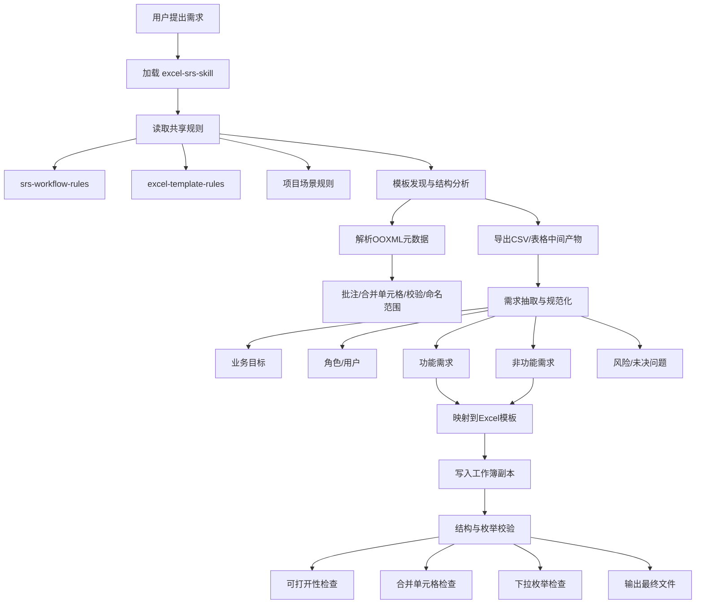
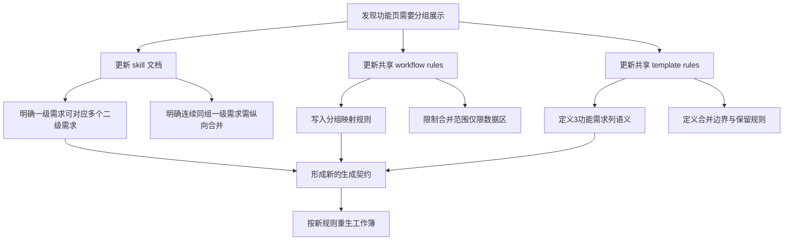
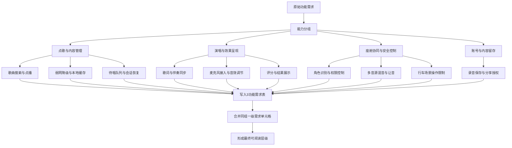
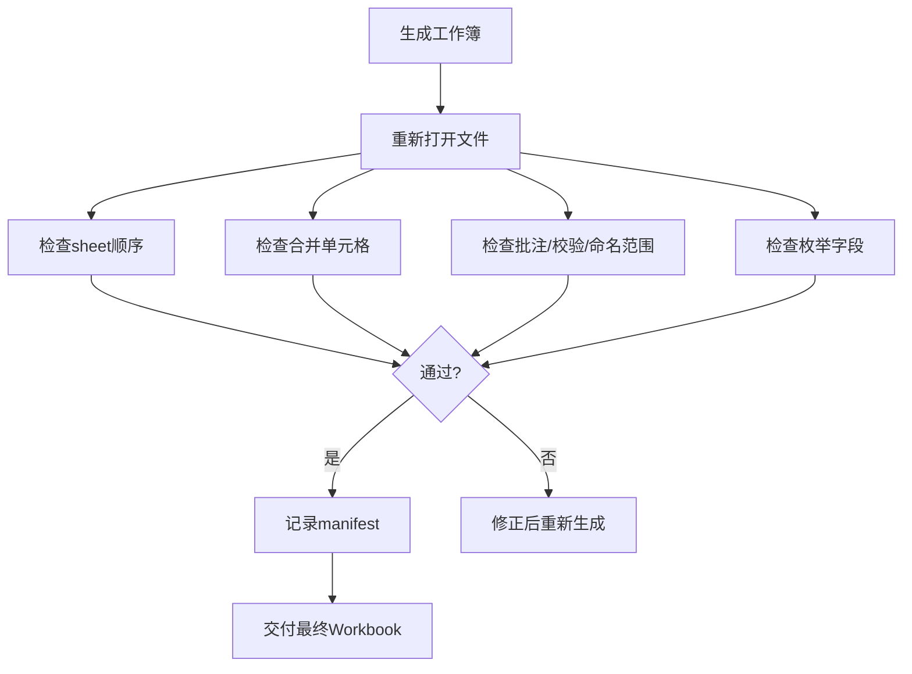

# 车载K歌SRS生成与优化工作流总结

本文总结了本次“车载K歌软件”Excel SRS 生成、规则更新、文档优化与校验的完整流程。

## 1. 总体工作流

## 2. 规则更新工作流

## 3. 功能需求页优化工作流

## 4. 校验工作流

## 5. 本次产物路径

- 最终工作簿：`/home/liang/Project/Reachauto/AI/demo/.sisyphus/runs/20260424-car-karaoke-srs/软件需求规格说明书-简化版_车载K歌软件_智能座舱.xlsx`
- 工作流总结：`/home/liang/Project/Reachauto/AI/demo/.sisyphus/runs/20260424-car-karaoke-srs/workflow-summary.md`