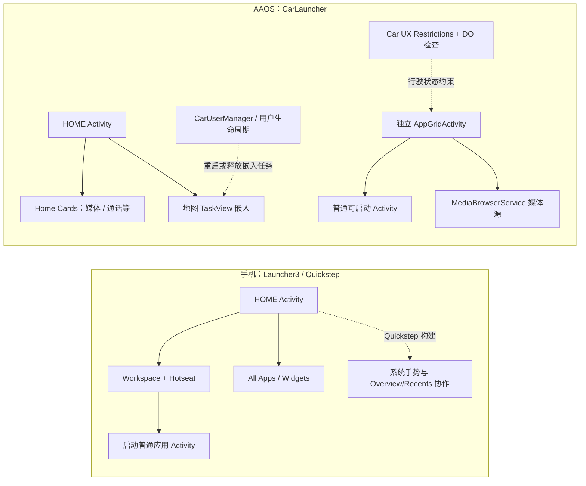

# Android 手机原生 Launcher 与 AAOS 车机原生 Launcher 差异分析

> 调研日期：2026-10-01。源码基线：工作区 `/home/liang/Project/AAOS13`，平台 `PLATFORM_VERSION_LAST_STABLE = 13`；`packages/apps/Launcher3` revision `2c34cba0d3ca7bd93edc884f0cebeb1435df60f7`，`packages/apps/Car/Launcher` revision `232b2996dc7a188557b435981a4c3206beccbe59`，`frameworks/base` revision `af0429f7c3314ac83bc537bf6281dc78f55bcccf`。Launcher3 与 Car Launcher 是各自独立 repo；Car Launcher 当前有 2 个未提交文件，另有若干 `frameworks/base` 改动。本文对 Launcher 源码结论以其基线 revision 为准；Car Launcher 两处本地改动只是给 App Grid 加窗口类型调试按钮/弹窗，不作为 AOSP 产品行为。
>
> 范围：以 AOSP Android 13 Launcher3（含 Quickstep 变体）对照 AOSP AAOS 13 `CarLauncher`。这里的“原生”指 AOSP 参考实现，不代表所有 Android 手机或量产车的厂商 Launcher。AAOS 设备可替换默认 HOME、覆盖布局/资源、接入自有媒体/导航/系统栏；功能外观会随 OEM 和硬件变化。

## 结论先行

二者共享 Android 的 Activity/Task/PackageManager 基础设施，都是响应 `ACTION_MAIN + CATEGORY_HOME` 的 HOME Activity；区别在于 Launcher 面对的设备目标和系统契约。手机 Launcher3 的中心是“个人桌面”：可编辑 Workspace、Hotseat、文件夹、Widget、All Apps，并在 Quickstep 构建中与系统手势/最近任务动画紧密协作。AAOS CarLauncher 的中心是“驾驶中的车载入口”：仪表台式 Home 卡片、地图任务嵌入、独立 App Grid、媒体源/媒体卡片和车辆用户/显示集成；行驶状态下能否操作还受 Car UX Restrictions、每个 Activity 的 `distractionOptimized` 声明和 OEM 规则约束。

“车机 Launcher 就是横屏 Launcher3”不符合这份 AOSP 13 源码：`CarLauncher` 没有继承 Launcher3 的 `Launcher`，也没有 Launcher3 的 Workspace/Launcher 数据模型；它由独立 Android app 实现。但“车机没有最近任务/就是一个 Launcher 进程管所有窗口”也不准确：AAOS 可提供自己的 Overview/系统任务切换界面，CarLauncher 还展示最近使用 App 快捷项，车载应用也由 Android ActivityTaskManager 管理。

## 结构对照

图中是 AOSP 13 参考实现的主要职责分界，不代表 OEM 的完整系统界面；车辆状态栏、导航栏、HVAC 和 Overview 通常还涉及独立 SystemUI/系统应用。

## 差异矩阵

| 维度 | Android 手机 AOSP Launcher3 | AAOS 13 AOSP CarLauncher | 影响与边界 |
|---|---|---|---|
| 产品目标 | 用户组织个人桌面与启动 App；首页是用户可定制空间 | 在驾驶/驻车场景提供低分心入口和“车辆上下文”信息 | 根本差异来自设备任务和使用情境，而非屏幕横竖方向 |
| HOME 入口 | `Launcher` 或 Quickstep variant 声明 HOME intent filter | `.CarLauncher` 声明 HOME intent filter；还声明 CAR Launcher app category | 两边都能成为 HOME；Manifest 只证明候选资格，不证明产品镜像最终默认选择 |
| 桌面模型 | 多页 Workspace、Hotseat、图标、文件夹、Widget、空屏和拖放；布局持久化在 Launcher provider/database | Home 主界面按资源布局组合地图卡与若干 HomeCard module；没有 Launcher3 Workspace 的任意摆放模型 | OEM 可以重写 Car Home 卡片；当前代码由 `config_homeCardModuleClasses` 资源组装卡片 |
| App 浏览 | All Apps 与桌面处于同一个 Launcher activity/UI state；App 图标绑定到 Launcher model | `AppGridActivity` 是独立 `singleInstance` Activity；支持 ALL_APPS、MEDIA_ONLY、MEDIA_POPUP 模式 | Car Grid 不仅是 `CATEGORY_LAUNCHER` 清单，还把媒体浏览服务呈现为可选媒体源 |
| 安装/应用数据 | LauncherModel 按 Android 用户/配置文件读取 launcher activities，另保存用户的桌面布局、widget id 等 | `LauncherApps` 枚举当前 user 的 launcher activities；还查询 MediaBrowserService、UsageStats、隐藏名单和 DO 状态 | 车机列表需筛掉不能安全驾驶使用的入口，并避免把仅媒体服务遗漏 |
| 最近任务与返回 | Quickstep variant 接入系统手势动画和 Overview；普通 Launcher3 变体并不等同完整 Quickstep | App Grid 插入最近使用应用快捷行；系统可由独立 Car Overview/SystemUI 做任务切换 | 不应推导成“AAOS 没有 Recents”。此对照范围内 CarLauncher 本身不是手机 Quickstep 的 Recents controller |
| 地图/多窗口 | 手机上的地图是普通应用任务，Launcher 通常负责启动它，不将它长期嵌进 Home 卡片 | 参考 CarLauncher 通过 Shell `TaskView` 承载地图 Activity，作为 HOME 卡片的一部分；特殊场景可切换 display policy | TaskView 嵌入使 Car Launcher 成为 task organizer/生命周期协调的一部分；窗口面积与宽高比仍要由地图应用适配 |
| 媒体/通话 | 通常由对应应用、通知/媒体控件和系统 UI 承担；Launcher3 桌面可摆普通 widget | Home Audio Card 观察车辆当前媒体源、显示媒体控件；Home app 注册非 UI InCallService 与 Dialer 协作 | 车载媒体选择/播放状态接入 `CarMediaManager` 与 `MediaBrowserService`；Home 卡片避免另造媒体应用 UI |
| 驾驶安全 | Android 手机没有车速、挡位驱动的 Car UX Restrictions 体系 | Vehicle UX Restrictions 根据车辆/区域 OEM 配置限制活动；系统检查 DO 声明；App Grid 将不可驾驶启动的图标置淡色、点击弹提示且不发起启动 | `distractionOptimized=true` 是平台准入元数据，不是 Android 自动证明 UI 安全；规则和审核来源需区分 |
| 输入 | 主要是触摸、多指手势、键盘/辅助功能；Quickstep 手势是重要系统入口 | 触摸外可支持实体旋钮/方向键焦点导航；AAOS car-ui 提供 FocusArea、焦点停靠和 rotary 友好列表 | Rotary 依赖车款是否有旋钮及系统配置，不是每台 AAOS 设备都必须有旋钮 |
| 显示/窗口 | 单主屏为常见设备假设，同时 Launcher3 可适配平板/折叠态、resize、secondary display | 车内屏幕可能是中控、仪表、乘客屏；Launcher 可按显示区/Display ID 启动 Activity，部分布局/权限由 OEM/CarDisplayArea 管理 | Android 15 的多用户多显示能力不应倒推到 AAOS 13；乘客屏/并发用户能力取决于版本和 OEM 配置 |
| 用户模型 | 手机常见当前人类用户及 work profile；Launcher3 All Apps 可跨 profile 枚举 | AAOS 采用面向多人共享车辆的用户模型，典型为无头 System User 0 加实际驾驶员用户；CarLauncher 明确不为无头用户加载地图卡 | 车机 Launcher/嵌入任务需处理 user unlock/switch；这与“手机同一个用户下多 profile”的场景不同 |
| 系统栏/车辆控件 | 通知栏、状态栏、导航栏/手势由 SystemUI 统一管理，Launcher 绘制桌面内容 | CarSystemUI 通常负责车载状态栏/导航栏，产品可把 app facet、HVAC 等系统控件放入车辆导航栏 | 不应将车载状态栏/HVAC 统称为 CarLauncher 的内部控件；OEM 产品架构可能调整归属 |
| 特权和系统集成 | AOSP Launcher3 通常作为 system/priv-app，可读 Launcher widget、shortcut、provider 等接口；Quickstep 构建额外系统绑定 | CarLauncher manifest 声明 Car API 和 embedding/task 管理相关权限，Android.bp 以 platform APIs、platform certificate、privileged app 构建 | 不能把 CarLauncher 当作普通可独立安装的第三方 Launcher；精确权限清单以当前分支 manifest 为准 |
| 启动/恢复与资源 | 加载 Launcher DB、绑定 Workspace 与 App list；保留布局及图标状态，对用户拖放编辑负责 | 初始化车载服务、创建地图 TaskView、装配 Home cards；用户 unlock/switch 时修复或释放嵌入任务 | Car Launcher 的关键可靠性路径包括地图任务崩溃/可见性/用户切换，不只是 Activity 启动画面 |
| 方向与布局 | 支持设备 profile/grid、方向变化、屏幕大小变更，目标覆盖手机/平板等 Android 大屏形态 | 资源 overlay 和车型决定宽屏卡片比例、触控焦点区域、系统栏和显示区；不等于一套固定 Android Auto 模板 | AAOS 是独立跑在车载硬件上的 Android 系统；Android Auto 则是手机投屏系统，二者不要混称 |

## 按源码追踪关键机制

### 1. HOME 解析相同，HOME 后面的产品 UI 不同

`frameworks/base/services/core/java/com/android/server/wm/RootWindowContainer.java#startHomeOnTaskDisplayArea` 在主 TaskDisplayArea 上拿 `ActivityTaskManagerService#getHomeIntent()` 并解析 HOME activity，再启动该 activity。因此 Android 的基本系统契约没有“手机 Launcher 类”和“车机 Launcher 类”两套 HOME Intent；是谁成为默认 Home 由产品包/解析配置决定。

手机 `packages/apps/Launcher3/AndroidManifest.xml` 的 `.Launcher`（Quickstep 产品变体把 Activity 换为 `.uioverrides.QuickstepLauncher`）声明 MAIN/HOME/DEFAULT。AAOS `packages/apps/Car/Launcher/AndroidManifest.xml#CarLauncher` 也声明 MAIN/HOME/DEFAULT。两者都带 `CATEGORY_LAUNCHER_APP`，所以这个 category 不是二者差别。Car Launcher 另外声明 `ACTION_APP_GRID` 给独立 App Grid，不同于 Home Intent。

### 2. Launcher3 是个可编辑桌面；CarLauncher 是多入口仪表台

Launcher3 `Launcher#setupViews` 将 Workspace、Hotseat、DragLayer、All Apps 和拖放目标接到同一 Launcher hierarchy；`LoaderTask#loadWorkspace` 从 Launcher 数据库读取页面条目，而 `LoaderTask#loadAllApps` 跨可见 profiles 读取 launcher activities。用户安装 App 并不会自动替代用户桌面布局：桌面条目与全部已安装可启动 App 是两套视图/状态。

AAOS `CarLauncher#onCreate` 装入 `car_launcher.xml`：布局有两个 HomeCard 区域和地图卡片。`initializeCards` 按 overlayable resource 给出的 `HomeCardModule` 类创建/替换卡片。点进应用列表时进入独立 `AppGridActivity`，其 adapter 显示可启动 app 和最近使用快捷项。这种设计把“常驻车载上下文（地图/媒体/通话）”置于主页，把 App 列表当作另一种 task/screen，而不是把一页页自由编辑的 icon grid 当首页模型。

### 3. 地图在车机参考 Launcher 中是一个嵌入 Task，不是截图或普通 widget

`CarLauncher#setUpTaskView` 通过 `TaskViewManager#createControlledCarTaskView` 为地图 Activity 创建 TaskView，地图被 `FLAG_ACTIVITY_EXCLUDE_FROM_RECENTS` 排除普通最近任务列表。它仍是独立 Activity task，只是 surface 被嵌入 Home 布局。`TaskViewManager` 在宿主 Activity 恢复时对嵌入任务发出 `showEmbeddedTask`；Car user 解锁时重新启动尚未建立的任务，切换用户时释放旧用户持有的 TaskView。Manifest 中 `ACTIVITY_EMBEDDING`、`MANAGE_ACTIVITY_TASKS`、`REORDER_TASKS` 等特权与这条路径直接相关。

当前实现针对 headless system user 不创建地图卡；多窗口/PiP 模式也使用不显示地图卡的布局。源码注释还提示 TaskView 的实际宽高比不一定满足普通 Android 应用兼容尺寸，地图内容需自行适配。这些是车机多任务嵌入的代价与约束。

### 4. Car App Grid 的数据源和筛选逻辑更丰富

`AppGridActivity#updateAppsLists` 调用 `AppLauncherUtils#getLauncherApps` 后分别更新全部入口与最近入口。后者组合两类组件：当前用户的 `LauncherApps#getActivityList` 以及实现 `MediaBrowserService` 的媒体服务。媒体服务会映射为 `CAR_INTENT_ACTION_MEDIA_TEMPLATE`，选中后更新 `CarMediaManager` 当前媒体源；一般 Activity 则用 `ACTION_MAIN + CATEGORY_LAUNCHER` 显式启动，并把 launch display 设置为当前 Grid 所在显示器。

Car Grid 还会读取 `UsageStats` 生成常用/最近 App 行，支持 hidden-app 和媒体模式筛选，并借 `CarPackageManager` 查一般 Activity 是否 DO。由此可见“车机 App 抽屉只枚举桌面图标”并不成立：媒体服务可以作为非 Activity 的选择项；不能驾驶操作的 App 要结合 car policy 处理。

### 5. 驾驶限制由车载系统策略执行，Launcher 负责声明和呈现

Car Launcher Manifest 将 HOME、App Grid、Control Bar Activity 标成 `distractionOptimized=true`。App Grid 连接 Car Service 获取当前 `CarUxRestrictions`，监听状态变化并更新图标状态。`AppItemViewHolder#bind` 在限制生效时把非 DO 图标调淡，点击只显示驾驶提示而不调用启动回调。对普通 App Activity 的 DO 查询走 `CarPackageManager#isActivityDistractionOptimized`。平台侧 `CarPackageManagerService` 根据当前 UX policy 检查前台 Activity 是否允许；在 driving-restricted 状态，非 DO activity 会被系统拦截/遮挡。

这是“系统 policy + manifest 元数据 + UI 行为”的组合：manifest 的 DO 标记是声明，不自动让某个视频播放、滚动长文本或复杂操作变安全。OEM 决定 driving state 到限制集合的映射；Google Play 对可发布的车载应用还可做质量审核。普通手机 Launcher 没有车辆速度/挡位驱动的限制服务。

### 6. 旋钮输入和常驻车辆系统 UI 不全归 Launcher

AAOS 参考 Home 布局与 App Grid 使用 `com.android.car.ui.FocusArea`，Grid adapter 也写有 stable IDs 可改善 rotary 表现。官方旋钮交互模型基于 View focus/keyboard navigation：旋转移动焦点，按下激活，并可在焦点区域间 nudge。车辆是否装旋钮、方向和区域边界仍取决于硬件/配置。手机 Launcher 更偏向触控和快速手势，但 Android 本身也支持键盘与辅助功能。

CarSystemUI 与 Car Launcher 分开承担系统级 UI 职责。产品的导航栏可显示车辆 App facet、系统状态、HVAC 控件；这不意味着这些系统控件必然由 `CarLauncher` Activity 自己绘制。手机也由 SystemUI 绘制 status/navigation bar，Launcher 本身主要绘制桌面区域。

## 哪些说法不准确

1. **“车机 Launcher 就是横屏手机 Launcher。”** 不准确。AOSP AAOS 的 `CarLauncher` 是独立模块，主页/应用网格/卡片/地图 task 的职责与 Launcher3 的 Workspace/All Apps 不同。
2. **“车机 HOME 不走 Android HOME intent。”** 不准确。车机 manifest 同样声明 MAIN/HOME/DEFAULT，系统 ActivityTaskManager 按 HOME 入口解析并启动；差异发生在目标 Activity 和周边车载服务。
3. **“CarLauncher 自己检测速度，行车时把图标变灰。”** 不准确。它监听 `CarUxRestrictionsManager` 并向 adapter 提供“要求 DO”状态；当前 UI 将不可用项图标调淡、点击提示，不发起启动。Activity 是否能留在前台仍由 car package policy/系统路径落实。
4. **“AAOS 没有多任务/最近任务。”** 不准确。手机 Quickstep 与 Car Overview/SystemUI 是不同方案，但 AAOS 仍使用 Android task 管理，可有车机 Overview；本 CarLauncher 的近期 App 行也不等价于完整任务总览。
5. **“Launcher3 适用于手机，Car Launcher 适用于 Android Auto。”** 名词混淆。AAOS 是车机本地运行的 Android OS；Android Auto 是手机与车载屏幕协作的另一种产品形态。本文只分析 AAOS。
6. **“AOSP Launcher 就等同 Pixel/任意手机出厂桌面。”** 不准确。AOSP Launcher3 是参考实现，OEM 可替换、覆盖或叠加其功能；同理 CarLauncher 也允许 OEM 定制。

## 阅读源码路线

| 想看什么 | 文件/方法 |
|---|---|
| HOME 是怎样启动的 | `frameworks/base/services/core/java/com/android/server/wm/RootWindowContainer.java#startHomeOnTaskDisplayArea`、`#resolveHomeActivity` |
| Launcher3 主界面和页面绑定 | `packages/apps/Launcher3/src/com/android/launcher3/Launcher.java#setupViews`、`#bindAllApplications` |
| Launcher3 保存/恢复桌面与 App 列表 | `packages/apps/Launcher3/src/com/android/launcher3/model/LoaderTask.java#loadWorkspace`、`#loadAllApps` |
| AAOS Home/地图 TaskView/Card 入口 | `packages/apps/Car/Launcher/src/com/android/car/carlauncher/CarLauncher.java#onCreate`、`#setUpTaskView`、`#initializeCards` |
| AAOS App Grid 更新/UX 监听 | `packages/apps/Car/Launcher/src/com/android/car/carlauncher/AppGridActivity.java#onCreate`、`#updateAppsLists` |
| AAOS App 与媒体服务枚举 | `packages/apps/Car/Launcher/src/com/android/car/carlauncher/AppLauncherUtils.java#getLauncherApps`、`#launchApp` |
| AAOS TaskView 与用户切换 | `packages/apps/Car/Launcher/src/com/android/car/carlauncher/TaskViewManager.java#createControlledCarTaskView`、`mUserLifecycleListener`、`mActivityLifecycleCallbacks` |
| DO policy 在 Car Service 如何执行 | `packages/services/Car/service/src/com/android/car/pm/CarPackageManagerService.java#isActivityDistractionOptimized` 与 Activity 启动策略检查 |

## 覆盖深度与未展开部分

| 模块 | 深度 | 本文覆盖 |
|---|---|---|
| AOSP Launcher3 核心 UI/Manifest/模型 | 深读 | HOME 声明、Workspace/Hotseat/All Apps、LoaderTask |
| Launcher3 Quickstep | 定向对照 | 仅确认 Quickstep 是产品变体并说明与 Overview/手势集成边界；未逐方法展开系统手势动画链 |
| AAOS CarLauncher | 深读 | Home cards、地图 TaskView、独立 AppGrid、媒体入口、DO、用户生命周期 |
| CarSystemUI/Car Overview | 扫描 | 说明系统职责分界；未将 CarSystemUI 每个窗口策略逐类解码 |
| OEM overlay/真实整车产品 | 未碰 | 每个车型的用户流、HVAC/导航栏布局和 DO policy 需单独查对应产品 overlay/车辆 UX 配置 |
| AAOS passenger display / MUMD | 扫描 | 标明 Android 13 与 Android 15 能力边界；未追踪 Android 15 实现 |

本轮没有对两个完整 Launcher 仓库所有类做逐类职责表，也没有构建刷机验证；重点是对照主入口和影响差异的实现机制。源码锚点是类/方法名，精确行号以仓库对应 revision 检索为准。

## 一手资料与高质量来源

### 源码（Gitiles 固定 revision）

- [AOSP Launcher3 AndroidManifest.xml，revision `2c34cba0`](https://android.googlesource.com/platform/packages/apps/Launcher3/+/2c34cba0d3ca7bd93edc884f0cebeb1435df60f7/AndroidManifest.xml)
- [AOSP Launcher3 Launcher.java](https://android.googlesource.com/platform/packages/apps/Launcher3/+/2c34cba0d3ca7bd93edc884f0cebeb1435df60f7/src/com/android/launcher3/Launcher.java)
- [AOSP Launcher3 LoaderTask.java](https://android.googlesource.com/platform/packages/apps/Launcher3/+/2c34cba0d3ca7bd93edc884f0cebeb1435df60f7/src/com/android/launcher3/model/LoaderTask.java)
- [AOSP AAOS CarLauncher AndroidManifest.xml，revision `232b2996`](https://android.googlesource.com/platform/packages/apps/Car/Launcher/+/232b2996dc7a188557b435981a4c3206beccbe59/AndroidManifest.xml)
- [AOSP AAOS CarLauncher.java](https://android.googlesource.com/platform/packages/apps/Car/Launcher/+/232b2996dc7a188557b435981a4c3206beccbe59/src/com/android/car/carlauncher/CarLauncher.java)
- [AOSP AAOS AppGridActivity.java](https://android.googlesource.com/platform/packages/apps/Car/Launcher/+/232b2996dc7a188557b435981a4c3206beccbe59/src/com/android/car/carlauncher/AppGridActivity.java)
- [AOSP AAOS AppLauncherUtils.java](https://android.googlesource.com/platform/packages/apps/Car/Launcher/+/232b2996dc7a188557b435981a4c3206beccbe59/src/com/android/car/carlauncher/AppLauncherUtils.java)
- [AOSP AAOS TaskViewManager.java](https://android.googlesource.com/platform/packages/apps/Car/Launcher/+/232b2996dc7a188557b435981a4c3206beccbe59/src/com/android/car/carlauncher/TaskViewManager.java)
- [AOSP CarPackageManagerService.java，revision `af68c574`](https://android.googlesource.com/platform/packages/services/Car/+/af68c5744030bfa8b9f4257975a019bdc60bab8e/service/src/com/android/car/pm/CarPackageManagerService.java)
- [AAOS 13 QPR1 release notes：Car Launcher 的 TaskView 参考实现](https://source.android.com/docs/automotive/start/releases/t_qpr1_release)

### Android 官方文档

- [Android Automotive OS overview：UX restrictions 与平台行为](https://developer.android.com/training/cars/platforms/automotive-os)
- [Driver distraction guidelines：DO 声明、前台 Activity 准入及其限制](https://source.android.com/docs/automotive/driver_distraction/guidelines)
- [Consume car driving state and UX restrictions](https://source.android.com/docs/automotive/driver_distraction/consume)
- [Rotary controller：AAOS 旋钮输入机制](https://source.android.com/docs/automotive/hmi/rotary_controller)
- [Rotary input in apps：焦点和 App 支持](https://source.android.com/docs/automotive/hmi/rotary_controller/app_developers)
- [Automotive System UI：车载系统栏/导航栏定制职责](https://source.android.com/docs/automotive/hmi/system_ui)
- [AAOS multi-user support：headless system user 与人类用户模型](https://source.android.com/docs/automotive/users_accounts/multi_user)
- [Android multi-user：Android 15 的多用户多显示说明（仅用于版本边界）](https://source.android.com/docs/devices/admin/multi-user)
- [Android Automotive OS 与 Android Auto 的产品区别](https://developer.android.com/training/cars/platforms/automotive-os)

## 开放问题

- 当前没有指定某个手机 OEM 或具体车厂/车型，因此“原生 Launcher”只比较 AOSP reference apps；如要落实到量产 ROM，需追相应 product makefile、runtime resource overlay、默认 HOME 选择和 car UX restriction XML。
- 本地 Car Launcher 工作区存在两处实验性改动；本文将其排除。若研究目的包含你当前的调试实验，App Grid UI/window type 那部分应另基于 working tree 展开。
- 本轮未逐项追踪各 Android 13 QPR 对 Launcher3/TaskView 的变更，也未验证所有 `config_*` overlay 的车型取值；若需要评估迁移方案，应使用目标产品 build overlay 作第二轮。
