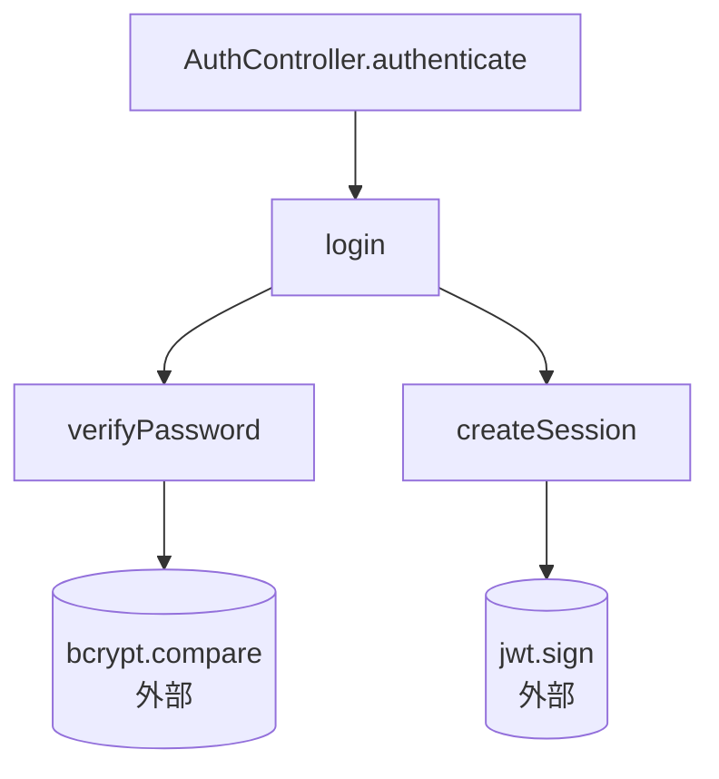
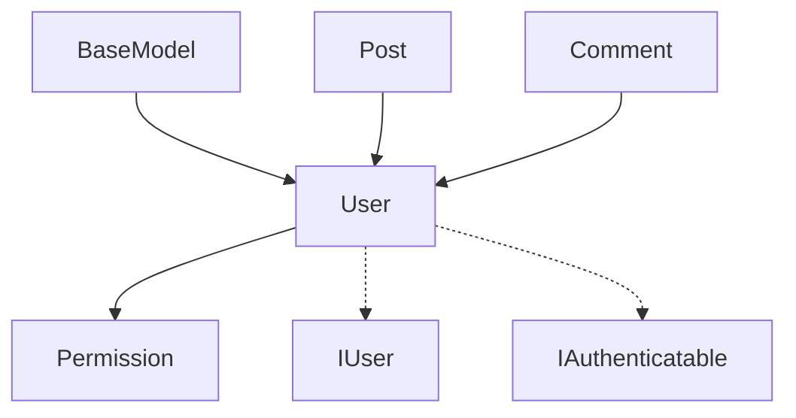

# 输出文档格式规范

## 目录结构

```
annotate-code/
├── README.md           # 总览索引
├── relations.json      # 结构化调用关系数据
├── functions/          # 按源文件分模块的详细说明
│   └── <module-name>.md
└── call-graph.md       # Mermaid 调用关系图
```

---

## README.md

总览索引，包含：已注释目标列表表格 + 调用关系概览文字 + 子文档链接。

### 模板

```markdown
# 代码注释与调用关系文档

> 生成时间：2026-07-07 14:30
> 项目语言：TypeScript
> 注释范围：login, User（用户指定）

## 已注释的目标

| 目标 | 类型 | 文件 | 说明 |
|------|------|------|------|
| login | 异步函数 | src/auth.ts:42 | 验证用户凭据并创建登录会话 |
| User | 类 | src/models/user.ts:10 | 用户数据模型 |

## 调用关系概览

- **login()** 被 `AuthController.authenticate()` 调用，内部调用了 `verifyPassword()`、`createSession()`
- **User** 被 `Post`、`Comment` 引用，继承自 `BaseModel`

## 文件索引

- [login 详情](./functions/auth.md)
- [User 详情](./functions/models.md)
- [调用关系图](./call-graph.md)
```

---

## relations.json

结构化数据，方便程序化处理。字段说明：

```json
{
  "meta": {
    "generated_at": "ISO 8601 时间戳",
    "project_language": "检测到的语言",
    "scope": ["目标名称列表，全项目时用 [\"*\"]"],
    "total_targets": "处理的目标总数"
  },
  "targets": [
    {
      "name": "函数或类的名称",
      "type": "function | class | interface | type",
      "file": "相对于项目根目录的文件路径",
      "line": "定义所在行号",
      "description": "一句话功能描述",
      "signature": "完整签名/声明",
      "parameters": [
        {"name": "参数名", "type": "类型标注", "description": "含义"}
      ],
      "returns": {"type": "返回类型", "description": "含义"},
      "callers": [
        {"name": "调用者名", "file": "文件路径", "line": "行号"}
      ],
      "callees": [
        {"name": "被调用者名", "file": "文件路径", "line": "行号", "external": "true 表示外部库"}
      ],
      "related_functions": ["同模块关联函数名"],
      "call_chains": [
        "入口 → ... → 目标 → ... → 出口，用 → 连接，外部调用加 [外部] 后缀"
      ],
      "class_relations": {
        "extends": "父类名",
        "implements": ["接口名"],
        "composes": ["持有的实例类型"]
      }
    }
  ]
}
```

### 完整示例

```json
{
  "meta": {
    "generated_at": "2026-07-07T14:30:00+08:00",
    "project_language": "typescript",
    "scope": ["login", "User"],
    "total_targets": 2
  },
  "targets": [
    {
      "name": "login",
      "type": "function",
      "file": "src/auth.ts",
      "line": 42,
      "description": "验证用户凭据并创建登录会话",
      "signature": "async function login(email: string, password: string): Promise<Session>",
      "parameters": [
        {"name": "email", "type": "string", "description": "用户注册邮箱"},
        {"name": "password", "type": "string", "description": "明文密码，内部会哈希处理"}
      ],
      "returns": {"type": "Promise<Session>", "description": "登录成功后的会话对象，含 token"},
      "callers": [
        {"name": "AuthController.authenticate", "file": "src/controllers/auth.ts", "line": 88}
      ],
      "callees": [
        {"name": "verifyPassword", "file": "src/auth.ts", "line": 12},
        {"name": "createSession", "file": "src/auth.ts", "line": 68}
      ],
      "related_functions": ["logout", "refreshToken"],
      "call_chains": [
        "POST /login → AuthController.authenticate → login() → verifyPassword() → [外部] bcrypt.compare",
        "POST /login → AuthController.authenticate → login() → createSession() → [外部] jwt.sign"
      ]
    },
    {
      "name": "User",
      "type": "class",
      "file": "src/models/user.ts",
      "line": 10,
      "description": "用户数据模型，封装用户认证和权限逻辑",
      "signature": "class User extends BaseModel",
      "class_relations": {
        "extends": "BaseModel",
        "implements": ["IUser", "IAuthenticatable"],
        "composes": ["Permission[]"]
      },
      "callers": [
        {"name": "Post.author", "file": "src/models/post.ts", "line": 15},
        {"name": "Comment.author", "file": "src/models/comment.ts", "line": 8}
      ],
      "callees": [],
      "related_functions": ["createUser", "findUserById"],
      "call_chains": []
    }
  ]
}
```

---

## functions/<module-name>.md

按源文件组织，一个源文件一个文档。命名为去掉扩展名的文件名（如 `auth.md`、`models.md`）。

### 模板

```markdown
# src/auth.ts

## login()

**签名**：`async function login(email: string, password: string): Promise<Session>`

**位置**：第 42 行

**功能**：验证用户凭据并创建登录会话。密码使用 bcrypt 比较，不记录明文。

**参数**：
| 参数 | 类型 | 说明 |
|------|------|------|
| email | string | 用户注册邮箱 |
| password | string | 明文密码 |

**返回值**：`Promise<Session>` —— 登录成功后的会话对象

**异常**：`AuthError` —— 邮箱或密码不匹配

### 被谁调用
- `AuthController.authenticate()` — src/controllers/auth.ts:88

### 内部调用了谁
- `verifyPassword()` — 本文件第 12 行
- `createSession()` — 本文件第 68 行

### 调用链
```
POST /login → AuthController.authenticate → login() → verifyPassword() → [外部] bcrypt.compare
POST /login → AuthController.authenticate → login() → createSession() → [外部] jwt.sign
```

### 关联函数
- `logout()` —— 退出时清理本函数创建的 Session
- `refreshToken()` —— 复用 Session 的刷新逻辑
```

---

## call-graph.md

用 Mermaid 绘制调用关系图，每个目标一个独立图表。

### 模板

````markdown
# 调用关系图

## login() 调用关系



## User 类关系


````

Mermaid 语法提示：
- `A --> B` = 实线箭头（调用/继承）
- `A -.-> B` = 虚线箭头（接口实现/依赖）
- `A[(A<br/>外部)]` = 圆角矩形（外部库）
- `subgraph` 可以用来分组同一模块的函数
