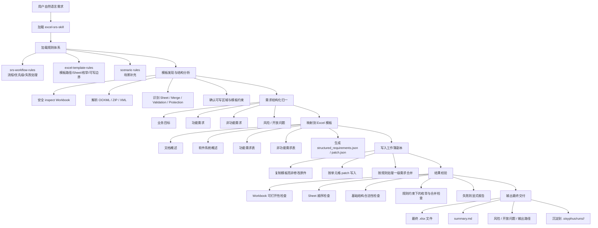

# Excel SRS 需求文档生成机制说明

## 1. 文档目的

本文说明本地 `excel-srs-skill` 将自然语言需求转换为 Excel 软件需求规格说明书（SRS）的实现机制，重点覆盖入口契约、规则体系、模板约束、脚本能力、运行产物和校验边界。

## 2. 本地实现链路

本地实现由以下部分构成：

- **Skill 入口**：`~/.config/opencode/skills/excel-srs-skill/SKILL.md`
- **Workflow 规则**：`~/.config/opencode/skills/excel-srs-skill/shared/excel-srs/rules/srs-workflow-rules.md`
- **Template 规则**：`~/.config/opencode/skills/excel-srs-skill/shared/excel-srs/rules/excel-template-rules.md`
- **Scenario 规则**：`~/.config/opencode/skills/excel-srs-skill/shared/excel-srs/rules/cockpit-srs-rules.md`
- **执行脚本**：`~/.config/opencode/skills/excel-srs-skill/shared/excel-srs/scripts/excel_srs_tool.py`
- **CLI 包装器**：`~/.config/opencode/skills/excel-srs-skill/shared/excel-srs/bin/excel-srs`
- **默认模板**：`/home/liang/Project/Reachauto/AI/demo/软件需求规格说明书-简化版.xlsx`
- **运行产物目录**：`/home/liang/Project/Reachauto/AI/demo/.sisyphus/runs/`

## 3. 分层职责

### 3.1 Skill 入口

`SKILL.md` 定义任务入口与输出契约，约定输入为自然语言需求，输出为可交付的 Excel 工作簿及其摘要信息，并声明默认工作流：discovery → inspect → normalize → map → fill → validate → deliver。

### 3.2 Workflow 规则

`srs-workflow-rules.md` 负责定义端到端步骤、指令优先级、产物隔离原则、验证要求和失败处理策略。

### 3.3 Template 规则

`excel-template-rules.md` 负责定义默认模板路径、工作表顺序、枚举值、占位符规则、可写边界，以及功能需求表中 `一级需求 / 二级需求` 的语义和合并约束。

### 3.4 Scenario 规则

`cockpit-srs-rules.md` 用于在智能座舱场景下补充分组语义。该类规则仅作场景扩展，不替代共享 workflow 规则与 template 规则。

### 3.5 执行脚本

`excel_srs_tool.py` 提供 `inspect`、`apply`、`validate` 三类底层操作能力，负责模板结构检查、补丁写入和结果校验。

### 3.6 模板与运行目录

模板工作簿是结构约束的事实来源，运行目录用于保存单次执行的中间产物和最终交付物，以支撑追溯和复核。

## 4. 总体流程

1. 用户输入自然语言需求。  
2. `SKILL.md` 触发 skill，并加载 workflow rules、template rules 及按需启用的 scenario rules。  
3. 系统依据规则确认模板路径、工作表结构、枚举约束和可写边界。  
4. 对模板执行 workbook-safe 检查，识别 sheet、合并、校验、命名范围和保护区。  
5. 将自然语言需求归一化为结构化需求模型。  
6. 将结构化内容映射到各工作表和目标区域。  
7. 复制模板副本，并以补丁方式写入内容，不直接修改原模板。  
8. 写入完成后重新校验工作簿的可打开性、基础结构一致性和工作表顺序；规则体系同时约束合并与枚举合法性。  
9. 校验通过后输出 Excel 工作簿与摘要；校验失败时返回明确失败原因。 

## 5. 流程图

## 6. 脚本能力边界

### 6.1 inspect

`inspect` 用于读取工作簿结构信息，包括：

- 工作表名称与顺序
- 表维度信息
- 合并单元格数量
- 数据校验数量
- 工作表保护状态

### 6.2 apply

`apply` 用于将补丁写入模板副本，主要行为包括：

- 读取 patch JSON
- 复制模板到输出副本
- 按目标单元格写入值
- 按规则增加合并区域
- 生成新的 `.xlsx` 文件

### 6.3 validate

`validate` 用于检查输出工作簿的基础结构有效性，主要包括：

- 工作簿是否可正常打开
- 工作表顺序是否与模板一致
- 是否满足基本结构合法性要求

`validate` 主要提供基础结构校验能力，不等价于完整业务语义校验；枚举约束、字段语义和模板一致性仍由规则体系共同约束。

## 7. 模板约束说明

默认模板不仅承载展示格式，同时也是结构约束来源。根据 template 规则，模板至少定义以下内容：

- 工作表顺序与名称
- 枚举值集合
- 占位符使用边界
- 可写区域与不可写区域
- 功能需求表中一级需求分组与纵向合并语义

在智能座舱场景下，`一级需求` 可以按能力组跨多行重复；若相邻多行属于同一能力组，可按规则纵向合并对应单元格。

## 8. 运行产物模型

`.sisyphus/runs/<run-id>/` 用于保存单次执行的运行产物。典型产物包括：

- `raw_prompt.txt`：原始输入
- `structured_requirements.json`：结构化需求模型
- `patch.json`：写入计划
- `template-ooxml-metadata.json`：模板结构元数据
- `template-visible-summary.json`：模板可见结构摘要
- `summary.md` / `workflow-summary.md`：过程与结果摘要
- `manifest.json`：阶段信息与校验信息
- 最终 `.xlsx`：正式交付物

不同运行目录可根据审计深度保留不同数量的辅助产物，但核心链路保持一致：输入、归一化、映射、写入、校验、交付。

## 9. 实现特征

基于本地实现，可以归纳出以下特征：

- 采用分层治理：入口契约、流程规则、模板规则、场景规则、执行脚本各司其职
- 采用 workbook-safe 处理方式，避免直接以纯文本方式操作 `.xlsx`
- 采用结构化需求模型作为模板映射的中间层
- 采用模板副本写入策略，避免污染原始模板
- 采用运行目录保存中间产物，支持追溯、复核与复现

## 10. 约束与局限

当前实现的主要边界如下：

- `validate` 以结构校验为主，不覆盖完整业务语义校验
- patch 写入依赖既有模板结构和单元格边界
- 场景规则当前为补充型规则，复杂行业场景可能需要更多专用规则文件

## 11. 结论

本地 `excel-srs-skill` 的实现并非直接生成整份 Excel 文档，而是通过规则驱动的流程控制、模板约束、补丁写入和结构校验，将自然语言需求转换为可交付的 SRS 工作簿。其核心特征在于流程可控、结构可校验、产物可追溯。
