# AAOS13 `addWindow` 全链路分析


***

**⚠️ 核心勘误预警 (A13 架构差异)**：
在传统认知中，存在“`AppWindowToken`”以及“SurfaceFlinger 层的 `BufferQueue` 初始化”等概念。在 Android 13 中必须纠正：

1. `AppWindowToken` **早已被废弃**，被重构为统一的 `WindowContainer` 树中的 `ActivityRecord`。
2. 针对普通应用窗口，SurfaceFlinger **不再创建** `BufferQueue`（即废弃了 `BufferQueueLayer`）。A13 全面采用 **BLAST 架构**，SF 端只创建轻量级的 `BufferStateLayer`，真正的 `BLASTBufferQueue` 是在 App 进程中创建的。

***

## 1. 跨进程窗口身份：`IWindow`、`token` 与生命周期绑定

在深入 `addWindow` 流程之前，必须先钉死三个问题：App 侧到底拿什么代表“这个窗口”、WMS 拿什么确认“它属于谁”、以及当进程死亡时系统如何自动回收它。

在 Android 13 中，这三件事分别主要落在 `IWindow`、`WindowManager.LayoutParams.token` 与 Binder death notification 上。

### 1.1 身份标识

LayoutParams.token：Activity 的身份证明

更精确地说，`IWindow` 并不是标识某个普通 `View`，而是标识 **一个** **`ViewRootImpl`** **暴露给 WMS 的窗口客户端端点**。在 App 侧它的具体实现是 `ViewRootImpl.W extends IWindow.Stub`；每次 `WindowManagerGlobal.addView()` 创建一个新的 `ViewRootImpl`，都会连带创建一个新的 `W`。因此，`IWindow` 基本可以近似理解为“一个窗口在 App 进程里的 Binder 身份”，它通常与 WMS 中的一个 `WindowState` 一一对应，而不是与某个 `View` 一一对应；`DecorView` 及其子 `View` 只是这个 `IWindow` 所承载的那棵 View 树。

与之相对，`token` 则是用来证明这个窗口“从属于谁”（如属于哪个 `Activity`）。没有合法的 `token`，App 无法随意添加窗口（防止流氓弹窗）。

- **合法性校验**：在 A13 中，`token` 是一个 `IBinder`，对应用主窗口时通常对应于 WMS 中的 `ActivityRecord.Token`。`WindowManagerService.addWindow()` 并不是直接查 `ActivityRecord`，而是先调用 `displayContent.getWindowToken(attrs.token)` 统一查找 `WindowToken`；只有当 `rootType` 落入应用窗口区间时，才继续执行 `token.asActivityRecord()`。这样设计的根因是：`WindowToken` 是所有窗口家族的公共父语义，既能承载 `Activity` 窗口，也能承载 `IME`、`Wallpaper`、`StatusBar` 等非应用窗口；先做 `WindowToken` 级别的通用校验和挂树，再按窗口类型下钻到 `ActivityRecord`，可以把“窗口归属校验”与“Activity 生命周期绑定”拆开，避免把所有窗口都硬编码成 `Activity` 模型。校验失败最终会在 App 侧体现为 `BadTokenException`。
- **多窗口/PIP 场景**：在分屏或画中画时，`token` 的稳定性表示“归属关系没变”——这个窗口仍然属于同一个 `ActivityRecord`；变化的是 `ActivityRecord` 在 `WindowContainer` 树中的父节点。WMS 会把同一个 `ActivityRecord` / `Task` 重新挂到新的 `TaskDisplayArea`、`Task` 或 pinned 容器下，`WindowState.mToken` 仍指向原有 token，已有 `SurfaceControl` 也尽量沿用，只通过 `reparent`、层级重排、bounds/configuration 更新来完成迁移。因此，对 App 来说更常见的体感不是“窗口对象被重建”，而是收到 `resized`、`moved`、配置变更甚至一次 `relayout`；是否进一步触发 `Activity` 重建，取决于配置变化是否被应用声明自行处理，而不是 `token` 本身是否变化。

换句话说，**WMS 校验** **`token`** **时，先问“它是不是系统里已经登记过的合法窗口家族成员”，再问“如果它是应用主窗口，那它是不是某个合法的** **`ActivityRecord`”**。这是一种两段式校验。第一段用 `displayContent.getWindowToken(attrs.token)` 做“广义身份识别”，因为系统里不只有 `Activity` 窗口；第二段只在应用窗口类型下才做 `token.asActivityRecord()`，把它收紧到“这个窗口确实挂在某个 Activity 下面”。因此，它本质上是在同时解决两个问题：**窗口类型是否合法**，以及 **窗口归属是否合法**。

**多窗口 / PiP 改变的是窗口在 WMS 树中的“挂载位置”，不是窗口的“身份证”**。这里的“身份证”就是 `token`，它继续指向同一个 `ActivityRecord`；而“挂载位置”指的是这个 `ActivityRecord` 当前位于哪个 `Task`、哪个 `TaskDisplayArea`、是不是进入 pinned stack。也就是说，系统不是把旧窗口销毁后重新造一个新窗口，而是把已有那套 `WindowContainer` / `SurfaceControl` 层级搬到新的容器关系里。

**对 App 而言，最常见的不是身份变化，而是几何与配置变化**。例如进入分屏后，窗口 bounds 变小；进入 PiP 后，任务被挪入 pinned 容器，Layer 层级、裁剪区域、输入焦点策略都会变化。于是 App 往往感知到的是 `IWindow.resized()`、`ViewRootImpl` 触发 `relayoutWindow()`、`performTraversals()` 重新测量布局，或者收到 `onConfigurationChanged()`；但这并不等价于“token 变了”。

再进一步看，A13 这里体现的是 `WindowContainer` 架构的价值：**把“身份”与“树位置”解耦**。`ActivityRecord` 既是应用窗口簇的归属实体，又是 `WindowToken` 的一种具体实现；它可以在 `RootWindowContainer` 之下被重新组织到不同父节点，而 `WindowState.mToken` 继续稳定地指向它。这种设计让分屏、自由窗口、PiP、任务嵌入这类场景可以优先走“重挂树 + relayout + transaction”路径，而不是“销毁窗口 + 重建窗口”路径，代价更低，也更不容易打断首帧、输入通道和 Surface 层级状态。

### 1.2 IPC 角色分工：IWindowSession 与 IWindow

`IWindowSession` 和 `IWindow` 是一对 IPC 接口。一个是 App 呼叫 WMS 的通道（上行），另一个是 WMS 呼叫 App 的通道（下行）。

**关于“上下行”术语的详细定义**：
在 Android 窗口管理机制中，所谓的“上行”与“下行”是相对于系统架构层级而言的。

- **上行 (Uplink)**：数据流和调用链由低权限的 Client 端（App 进程）发起，流向高权限的 Server 端（`system_server` 进程中的 WMS）。例如 App 请求创建窗口、请求重新布局。对应 Binder 通信的 Client $\rightarrow$  Server。
- **下行 (Downlink)**：数据流和调用链由 Server 端（WMS）发起，回调通知 Client 端（App 进程）。例如 WMS 统筹全局后发现窗口尺寸需要改变，主动通知 App。此时 WMS 作为 Binder Client，App 作为 Binder Server。
- **`IWindowSession`** **(Session)**：每个 App **进程**全局只有一个（复用）。负责所有上行主动请求：`addWindow`、`relayout`、`removeWindow`。
- **`IWindow.Stub`** **(W)**：每个 `ViewRootImpl`（即每个**窗口**）有一个实例。作为回调句柄注册在 WMS 中。负责接收 WMS 的下行通知：`resized`（窗口尺寸变化）、`windowFocusChanged`（焦点变化）。
- **生命周期对齐机制**：依靠 Binder 的 **DeathRecipient（死亡讣告）**。WMS 会对 `client.asBinder()`（也就是 `ViewRootImpl.W` 这个 `IWindow` Binder）执行 `linkToDeath`。一旦承载该 Binder 的 App 进程 Crash 或被杀，Binder driver 会向 `system_server` 触发 `binderDied()`；WMS 随后把该 `WindowState` 标记为 client dead，并走移除流程，释放输入通道、从 `mWindowMap` / `WindowToken` / `DisplayContent` 脱链、销毁 `SurfaceControl`，最终避免“App 已死但窗口残留”的悬挂状态。这里对齐的不是 Java `View` 对象生命周期，而是 **远端 Binder 端点存活性** 与 **WMS 中** **`WindowState`** **生命周期** 的对齐。

**时序流转示意**：

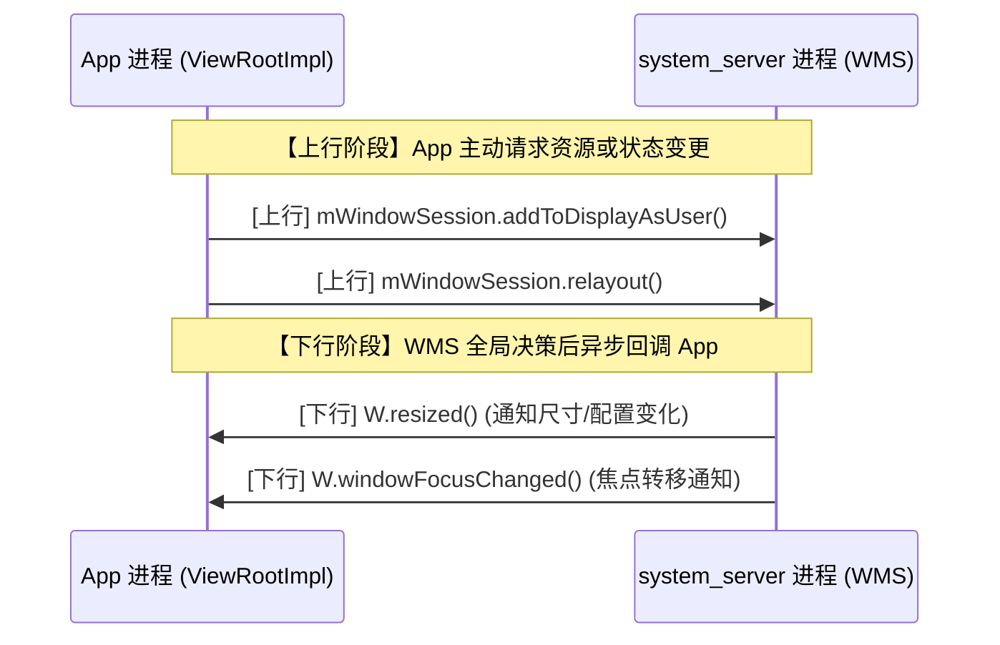

<br />

### 4. 两张手绘图的 Mermaid 总结版

**图二：A13 addWindow 阶段时序图**

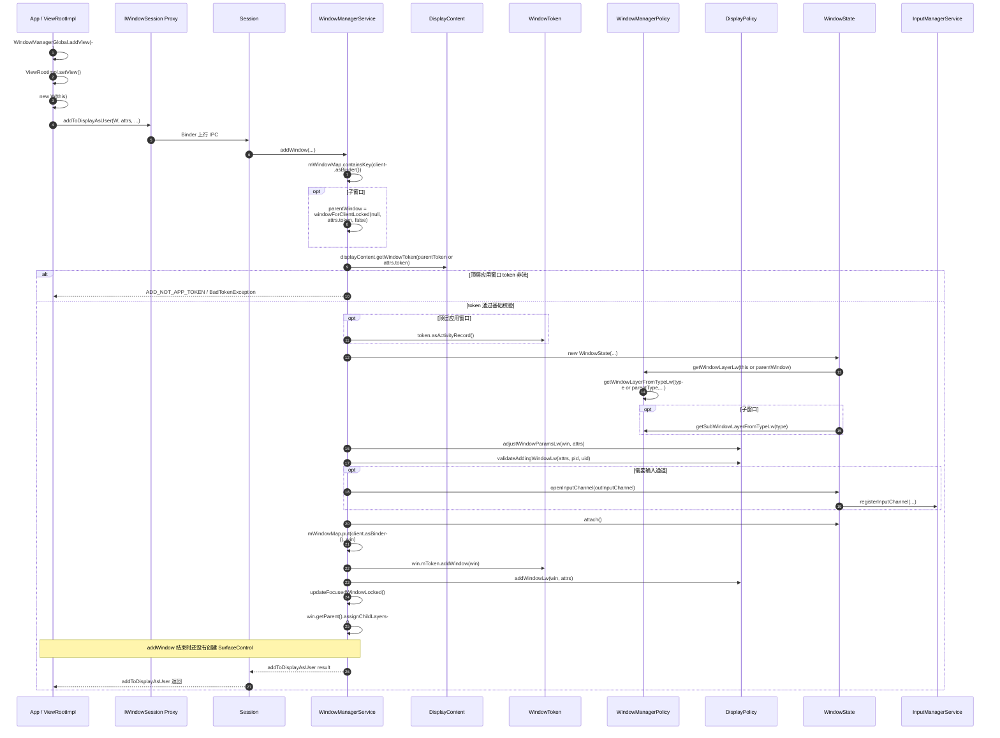

**图二-1：以 App / WMS / SurfaceFlinger / HWC 为中心的 addWindow → 首帧上屏详细交互图**

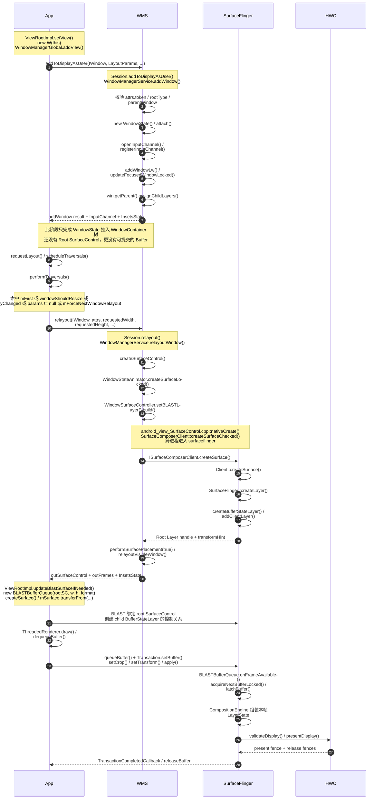

**四层主线结论**

- **App**：先通过 `addToDisplayAsUser()` 申请“窗口资格”，再通过第一次 `relayout()` 申请“可显示的 Root SurfaceControl”，最后经 `BLASTBufferQueue` 提交首帧。
- **WMS**：在 `addWindow()` 阶段只做准入、挂树、输入与焦点管理；真正的建层动作发生在 `relayoutWindow()` 内部的 `createSurfaceControl()`。
- **SurfaceFlinger**：既负责接收 WMS 的 Root Layer 创建请求，也负责消费 App 通过 BLAST 提交的 `buffer + geometry transaction`。
- **HWC**：直到 `surfaceflinger` 完成 `latchBuffer()` 并生成一帧有效 LayerState 后，才进入 `validateDisplay()` / `presentDisplay()`。

**图二-2：A13 addWindow 四层交互结构图（非时序）**

```mermaid
%%{init: {
  "themeVariables": {
    "fontSize": "18px"
  },
  "flowchart": {
    "nodeSpacing": 48,
    "rankSpacing": 70,
    "curve": "linear"
  }
}}%%
flowchart LR
    subgraph APP["App"]
        direction TB
        A0["ViewRootImpl"]
        A1["WindowManagerGlobal.addView()"]
        A2["setView() / new W()"]
        A3["performTraversals()"]
        A4["relayoutWindow()"]
        A5["SurfaceControl"]
        A6["BLASTBufferQueue"]
        A7["Surface / ThreadedRenderer"]
        A1 --> A2 --> A3 --> A4
        A4 --> A5 --> A6 --> A7
    end

    subgraph WMS["WMS"]
        direction TB
        W0["Session"]
        W1["WindowManagerService.addWindow()"]
        W2["WindowToken / ActivityRecord"]
        W3["WindowState"]
        W4["InputChannel / Focus"]
        W5["WindowManagerService.relayoutWindow()"]
        W6["createSurfaceControl()"]
        W7["WindowStateAnimator"]
        W8["WindowSurfaceController"]
        W0 --> W1 --> W2 --> W3 --> W4
        W3 --> W5 --> W6 --> W7 --> W8
    end

    subgraph SF["SurfaceFlinger"]
        direction TB
        F0["SurfaceComposerClient"]
        F1["SurfaceFlinger"]
        F2["Root Layer"]
        F3["BLAST child Layer"]
        F4["CompositionEngine"]
        F0 --> F1
        F1 --> F2
        F1 --> F3
        F2 --> F4
        F3 --> F4
    end

    subgraph HWC["HWC"]
        direction TB
        H0["HWComposer"]
        H1["validateDisplay()"]
        H2["presentDisplay()"]
        H0 --> H1 --> H2
    end

    A2 -->|"1. addToDisplayAsUser()"| W0
    W1 -->|"2. 校验 token / type / parent"| W2
    W2 -->|"3. 建立窗口节点"| W3
    W3 -->|"4. 注册输入与焦点"| W4
    W5 -->|"5. 首次可见时进入 relayout"| W6
    W8 -->|"6. 创建 Root SurfaceControl"| F0
    F0 -->|"7. createLayer()"| F1
    F1 -->|"8. 返回 Root SurfaceControl handle"| A5
    A6 -->|"9. updateBlastSurfaceIfNeeded()"| F3
    A7 -->|"10. queueBuffer + Transaction"| F3
    F3 -->|"11. latchBuffer"| F4
    F4 -->|"12. 合成输出"| H1
    H2 -->|"13. present fence / release fence"| F4
    F4 -->|"14. releaseBuffer callback"| A6

    A4 -. "首次 traversal 命中 mFirst" .-> W5
    W6 -. "Root SC 回填到 outSurfaceControl" .-> A5
    F2 -. "作为窗口根容器存在" .-> F3

    classDef app fill:#E3F2FD,stroke:#1E88E5,color:#0D47A1,stroke-width:2px;
    classDef wms fill:#E8F5E9,stroke:#43A047,color:#1B5E20,stroke-width:2px;
    classDef sf fill:#FFF3E0,stroke:#FB8C00,color:#E65100,stroke-width:2px;
    classDef hwc fill:#FCE4EC,stroke:#D81B60,color:#880E4F,stroke-width:2px;

    class A0,A1,A2,A3,A4,A5,A6,A7 app;
    class W0,W1,W2,W3,W4,W5,W6,W7,W8 wms;
    class F0,F1,F2,F3,F4 sf;
    class H0,H1,H2 hwc;
```

**这张图的阅读方式**

- **App** 侧先完成 `addView()`、`setView()`、`performTraversals()`，随后在首次 `relayoutWindow()` 中拿到 Root `SurfaceControl`。
- **WMS** 侧先处理 `addWindow()` 的准入与挂树，再在 `relayoutWindow()` 中决定是否创建 Root `SurfaceControl`。
- **SurfaceFlinger** 一端同时承担两类角色：一类是为 WMS 创建窗口的 **Root Layer**，另一类是接收 App 通过 BLAST 提交的 **child Layer buffer**。
- **HWC** 不参与窗口准入，它只消费 `surfaceflinger` 已整理好的 LayerState 并完成最终 present。

### 5. `relayoutWindow` 的精确触发门槛 (A13 源码剖析)

`ViewRootImpl.performTraversals()` 在 Android 13 中不是每一帧都进入 `IWindowSession.relayout()`。它只有在下面这个守卫条件成立时才发起上行 Binder IPC：

```java
// frameworks/base/core/java/android/view/ViewRootImpl.java
if (mFirst || windowShouldResize || viewVisibilityChanged || params != null || mForceNextWindowRelayout) {
    relayoutWindow(params, viewVisibility, insetsPending);
}
```

这 5 个核心触发时机具体含义如下：

1. **`mFirst`**：首次 `addView()` 后的第一次 `performTraversals()`。这是应用请求 WMS 创建 `SurfaceControl` (即 Root Layer) 的唯一绝对入口。
2. **`windowShouldResize`**：窗口尺寸发生实质性改变。注意，`requestLayout()` 只是触发重绘，只有当 `mWidth/mHeight` 与 `host.getMeasuredWidth()/Height()` 不一致，或者处于 Freeform 拖拽 (`mDragResizing`) 时，才会进入 relayout。
3. **`viewVisibilityChanged`**：可见性变化（如 `VISIBLE` <-> `GONE` 切换），或者底层需要新 Surface (`mNewSurfaceNeeded`)。
4. **`params != null`**：窗口属性发生变化。例如初次附着、调用了 `window.setAttributes()` 改变透明区域、或者输入法模式 (`SOFT_INPUT_ADJUST_*`) 发生改变。
5. **`mForceNextWindowRelayout`**：系统强制要求。例如配置更新 (Configuration Change) 到达，导致当前帧可能过期，调用 `forceWmRelayout()` 强制触发。

***

### 6. WMS `createSurfaceControl` 全链路追踪 (至 SurfaceFlinger)

当 `relayoutWindow` 满足条件执行后，WMS 会在 `system_server` 中为该窗口建立 Root `SurfaceControl`，并最终跨进程调用至 `surfaceflinger` 创建真正的 `Layer`。以下是 A13 完整的调用链：

```text
[App 进程] ViewRootImpl.relayoutWindow()
 └── [Binder IPC] IWindowSession.relayout()
      └── [system_server] WindowManagerService.relayoutWindow()
           └── [system_server] WindowManagerService.createSurfaceControl()
                └── [system_server] WindowStateAnimator.createSurfaceLocked()
                     └── [system_server] new WindowSurfaceController()
                          └── [system_server] SurfaceControl.Builder.build() (Java 层壳创建)
                               └── [JNI] android_view_SurfaceControl.cpp : nativeCreate()
                                    └── [system_server Native] SurfaceComposerClient::createSurfaceChecked()
                                         └── [Binder IPC] ISurfaceComposerClient::createSurface()
                                              └── [surfaceflinger] Client::createSurface()
                                                   └── [surfaceflinger] SurfaceFlinger::createLayer()
                                                        └── [surfaceflinger] SurfaceFlinger::createBufferStateLayer() (A13 默认)
                                                             └── [返回] Native handle (IBinder) 沿原路返回 system_server
           <── [返回] 封装为 Java 层 SurfaceControl，通过 outSurfaceControl 返回给 App
```

***

### 7. 核心数据结构生命周期与进程归属（Android 13）

- **`SurfaceControl`**
  - **进程归属**：存在于 App 进程与 `system_server` 进程中（作为句柄引用）。
  - **创建时机**：`WMS.relayoutWindow()` -> `createSurfaceLocked()` 期间由 `system_server` 创建 Root SC。App 端后续也可自行创建 Child SC。
  - **JNI 交互点**：`android_view_SurfaceControl.cpp::nativeCreate` 接收 Java 层传递的 `SurfaceSession`、父级 `mNativeObject`，并调用 `SurfaceComposerClient`。
  - **存在形式**：本质是一个**跨进程句柄**，其核心变量 `mNativeObject` 指向 Native 的 `SurfaceControl` 对象，后者持有一个指向 `surfaceflinger` 内部 `Layer` 的 `IBinder handle`。
- **`Layer`** **(具体为** **`BufferStateLayer`)**
  - **进程归属**：严格只存在于 `surfaceflinger` 进程中。
  - **创建时机**：`SurfaceFlinger::createLayer()` 处理跨进程请求时。在 Android 13 中，绝大多数应用窗口均创建为 `BufferStateLayer`。
  - **存在形式**：作为 SF 内部的渲染图元树（Layer Tree）节点。`system_server` 创建的是 Root Layer（作为容器），App 侧 BLAST 创建的是 Child Layer（真正装载图像 Buffer）。
- **`BLASTBufferQueue`** **(A13 架构核心)**
  - **进程归属**：存在于 App 进程（Java 层与 Native 堆）。
  - **创建时机**：App 拿到 `outSurfaceControl` 后，在 `ViewRootImpl.updateBlastSurfaceIfNeeded()` 中触发 `new BLASTBufferQueue()`。
  - **A13 改进点**：彻底取代了传统的 `BufferQueueLayer`。BLAST 将 `Buffer` 的提交与几何变换 (`Transaction`) 绑定在一起（`acquireNextBufferLocked` 中调用 `setBuffer`, `setCrop`, `setTransform`），极大解决了窗口 resize 时的画面撕裂问题。
  - **存在形式**：客户端 Native 对象，内部持有 `IGraphicBufferProducer` 和 `IGraphicBufferConsumer`。

***

### 8. 图三：A13 relayout → createSurfaceControl → BLAST → HWC 全景时序图

以下综合时序图包含四个子维度，全面展示从 App 请求重绘、到 `system_server` 创建图元、再到 App 提交 BLAST Buffer 并最终交由 `surfaceflinger` 硬件合成的过程。

#### 图三-1：进程边界与全局时序主图

展示三大核心进程（App、system\_server、surfaceflinger）与硬件 HAL 层的宏观交互边界。

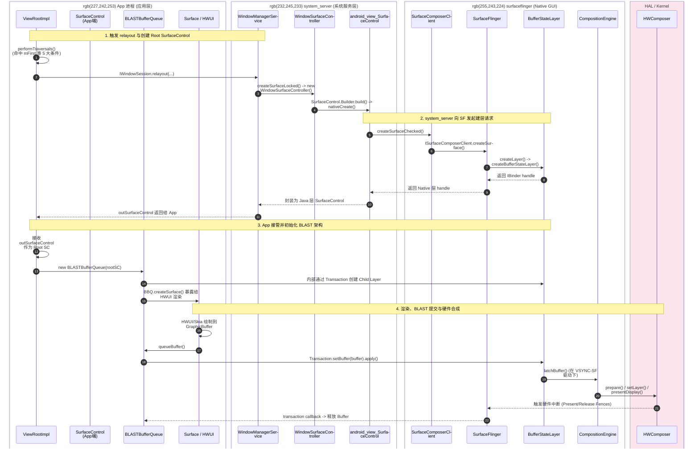

#### 图三-2：子流程 A - system\_server 与 SurfaceFlinger 的 Binder 建层细节

聚焦上述主图中的 **步骤 2**，详细拆解 JNI 与 `surfaceflinger` 的 C++ 侧交互。

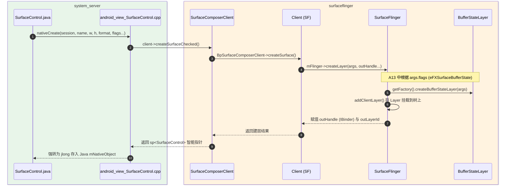

#### 图三-3：子流程 B - BLASTBufferQueue 缓冲区提交与合成细节

聚焦上述主图中的 **步骤 3 与 4**，详细拆解 App 侧如何通过 `Transaction` 提交 Buffer，以及 SF 如何消费。

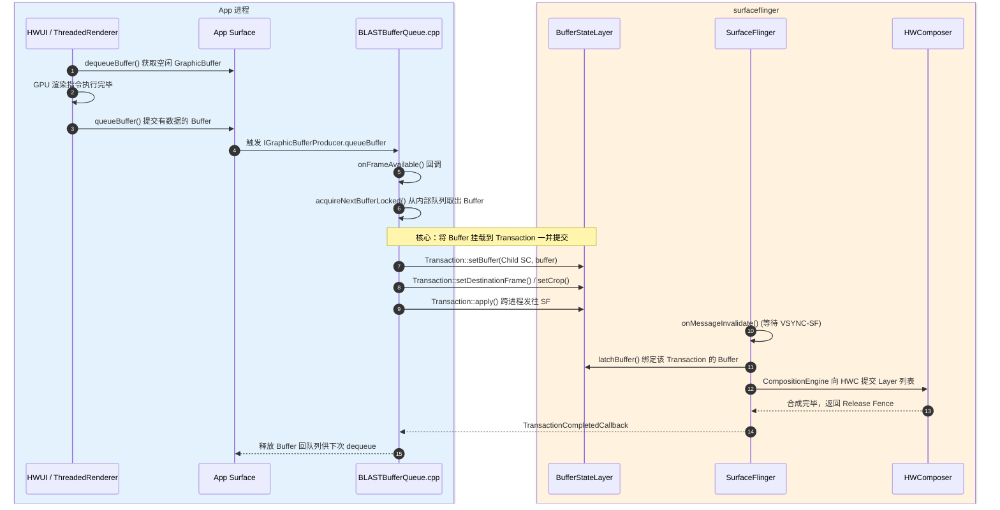

***

## 阶段一：APP 层请求发起与关键数据结构构建

当 App 调用 `WindowManager.addView(view, layoutParams)` 时，请求正式进入 Framework 层。

### 核心数据结构内存布局

- **`WindowManager.LayoutParams`**:
  - `type`: 窗口类型（如 `TYPE_BASE_APPLICATION` = 1）。决定了在 WMS 中的基础 Z-order。
  - `flags`: 控制位（如 `FLAG_HARDWARE_ACCELERATED`）。
  - `token`: 用于让 WMS 定位归属容器。A13 中先解析为 `WindowToken`，应用窗口再经 `token.asActivityRecord()` 收窄为 `ActivityRecord`。
- **`SurfaceControl`** **(App 端空壳)**:
  - 此时 `ViewRootImpl` 实例化的 `SurfaceControl` 和 `Surface` 只是一个空壳（`mNativeObject = 0`），并没有在 Native 层分配内存。**真正的内存分配在后续的** **`relayoutWindow`** **阶段。**

**Call Stack (App 进程)**:

```text
[App] WindowManagerGlobal.addView()
→ [App] ViewRootImpl.setView()
  → [App] new W(this) // 创建 IWindow 存根
  → [Binder] mWindowSession.addToDisplayAsUser(mWindow, mWindowAttributes, ...)
```

`/home/liang/Project/MyProject/Summary/summary/4_addWindow_A13.md#L72-72`
**关于** **`addToDisplayAsUser`** **参数中的 Token 详解**：
在上述调用中，真正的完整方法签名为：
`addToDisplayAsUser(IWindow window, WindowManager.LayoutParams attrs, int viewVisibility, int displayId, int userId, InsetsState requestedVisibility, InputChannel outInputChannel, InsetsState outInsetsState, InsetsSourceControl[] outActiveControls)`

| 参数名                   | 类型                           | 是否包含 Token | 说明与 Token 机制解析                                                                                                                                                                                                                                                                                                                                                                                                                                                                  |
| :-------------------- | :--------------------------- | :--------- | :------------------------------------------------------------------------------------------------------------------------------------------------------------------------------------------------------------------------------------------------------------------------------------------------------------------------------------------------------------------------------------------------------------------------------------------------------------------------------ |
| `window`              | `IWindow`                    | **否**      | App 端的 Binder 回调句柄。它本身不是 token，但作为窗口的唯一防伪凭证被 WMS 映射到 `WindowState`。                                                                                                                                                                                                                                                                                                                                                                                                             |
| `attrs`               | `WindowManager.LayoutParams` | **是**      | **包含** **`attrs.token`**。这是最重要的身份证明。1. **类型**：`IBinder`。2. **生成规则**：若是 Activity 的窗口，token 由 AMS/ATMS 在启动 Activity 时创建（`ActivityRecord.Token`），通过 IPC 传给 App 的 `ActivityThread`，再被塞入 `LayoutParams`。3. **生命周期**：与 `ActivityRecord` 绑定，Activity 销毁时失效。4. **校验方式**：WMS 先调用 `displayContent.getWindowToken(attrs.token)` 查找 `WindowToken`，若 `rootType` 属于应用窗口，再执行 `token.asActivityRecord()` 校验；校验失败会返回 `ADD_NOT_APP_TOKEN` / `ADD_BAD_APP_TOKEN`，最终在 App 侧体现为 `BadTokenException`。 |
| `viewVisibility`      | `int`                        | **否**      | 视图的可见性（如 `View.VISIBLE`）。                                                                                                                                                                                                                                                                                                                                                                                                                                                       |
| `displayId`           | `int`                        | **否**      | 目标屏幕 ID，用于多屏场景，不涉及安全校验。                                                                                                                                                                                                                                                                                                                                                                                                                                                         |
| `userId`              | `int`                        | **否**      | 目标用户 ID，用于多用户隔离。                                                                                                                                                                                                                                                                                                                                                                                                                                                                |
| `requestedVisibility` | `InsetsState`                | **否**      | 状态栏/导航栏的请求状态。                                                                                                                                                                                                                                                                                                                                                                                                                                                                   |
| `outInputChannel`     | `InputChannel`               | **否**      | 输出参数，用于接收 WMS 创建的底层 Input 事件通道。安全由 WMS 内部生成 socket 对保证。                                                                                                                                                                                                                                                                                                                                                                                                                         |
| `outInsetsState`      | `InsetsState`                | **否**      | 输出参数，返回当前系统的真实 Insets 状态。                                                                                                                                                                                                                                                                                                                                                                                                                                                       |
| `outActiveControls`   | `InsetsSourceControl[]`      | **否**      | 输出参数，返回当前可控的窗口插入源。                                                                                                                                                                                                                                                                                                                                                                                                                                                              |

### LayoutParams.type 速查表

`WindowManager.LayoutParams.type` 的源码定义位于 [WindowManager.java](file:///home/liang/Project/MyProject/Summary/WindowManager.java#L1242-L1724)。在 Android 13 中，它严格分成 **应用窗口**、**子窗口**、**系统窗口** 三大区间。WMS 在 `addWindow()` 中会先根据 `type` 判断窗口家族，再决定 token 校验路径、层级归属和权限边界。

#### 1. 范围总览

| 分类     | 常量                         |      值 | A13 语义                              |
| :----- | :------------------------- | -----: | :---------------------------------- |
| 应用窗口起点 | `FIRST_APPLICATION_WINDOW` |    `1` | 普通 Activity 顶层窗口区间起点                |
| 应用窗口终点 | `LAST_APPLICATION_WINDOW`  |   `99` | 普通应用顶层窗口区间终点                        |
| 子窗口起点  | `FIRST_SUB_WINDOW`         | `1000` | 依附父窗口的子窗口区间起点                       |
| 子窗口终点  | `LAST_SUB_WINDOW`          | `1999` | 子窗口区间终点                             |
| 系统窗口起点 | `FIRST_SYSTEM_WINDOW`      | `2000` | System UI / IME / Overlay 等系统窗口区间起点 |
| 系统窗口终点 | `LAST_SYSTEM_WINDOW`       | `2999` | 系统窗口区间终点                            |
| 无效类型   | `INVALID_WINDOW_TYPE`      |   `-1` | 仅内部兜底使用                             |

#### 2. 应用窗口类型

| 常量                          |   值 | 说明                                        |
| :-------------------------- | --: | :---------------------------------------- |
| `TYPE_BASE_APPLICATION`     | `1` | 应用的基座窗口，其他应用窗口通常建立在它之上                    |
| `TYPE_APPLICATION`          | `2` | 标准应用窗口，`token` 必须能定位到合法的 `ActivityRecord` |
| `TYPE_APPLICATION_STARTING` | `3` | App 启动阶段的 `starting window`，由系统临时托管       |
| `TYPE_DRAWN_APPLICATION`    | `4` | WMS 会等待该窗口绘制完成再显示应用                       |

#### 3. 子窗口类型

| 常量                                 |      值 | 说明                                  |
| :--------------------------------- | -----: | :---------------------------------- |
| `TYPE_APPLICATION_PANEL`           | `1000` | 依附在应用窗口上的 panel，通常显示在父窗口之上          |
| `TYPE_APPLICATION_MEDIA`           | `1001` | 媒体层，位于父窗口之后，常用于视频                   |
| `TYPE_APPLICATION_SUB_PANEL`       | `1002` | 比 panel 更上层的子 panel                 |
| `TYPE_APPLICATION_ATTACHED_DIALOG` | `1003` | 逻辑上附着父窗口，但布局按顶层窗口处理                 |
| `TYPE_APPLICATION_MEDIA_OVERLAY`   | `1004` | 位于 media 之上的覆盖层，常见于播放器控制条场景，`@hide` |
| `TYPE_APPLICATION_ABOVE_SUB_PANEL` | `1005` | 位于 sub-panel 之上的子窗口，`@hide`         |

#### 4. 系统窗口类型

| 常量                                         |      值 | 说明                                |
| :----------------------------------------- | -----: | :-------------------------------- |
| `TYPE_STATUS_BAR`                          | `2000` | 状态栏                               |
| `TYPE_SEARCH_BAR`                          | `2001` | 搜索栏                               |
| `TYPE_PHONE`                               | `2002` | 电话类窗口，三方应用已不推荐使用                  |
| `TYPE_SYSTEM_ALERT`                        | `2003` | 系统警告窗口，三方应用已不推荐使用                 |
| `TYPE_KEYGUARD`                            | `2004` | 锁屏窗口，已 `@removed`                 |
| `TYPE_TOAST`                               | `2005` | Toast 窗口                          |
| `TYPE_SYSTEM_OVERLAY`                      | `2006` | 系统覆盖层，不能抢占输入焦点                    |
| `TYPE_PRIORITY_PHONE`                      | `2007` | 高优先级电话 UI                         |
| `TYPE_SYSTEM_DIALOG`                       | `2008` | 系统对话框                             |
| `TYPE_KEYGUARD_DIALOG`                     | `2009` | 锁屏上的对话框                           |
| `TYPE_SYSTEM_ERROR`                        | `2010` | 系统错误窗口                            |
| `TYPE_INPUT_METHOD`                        | `2011` | 输入法主窗口                            |
| `TYPE_INPUT_METHOD_DIALOG`                 | `2012` | 输入法对话框                            |
| `TYPE_WALLPAPER`                           | `2013` | 壁纸窗口                              |
| `TYPE_STATUS_BAR_PANEL`                    | `2014` | 状态栏 panel，已 `@removed`            |
| `TYPE_SECURE_SYSTEM_OVERLAY`               | `2015` | 安全系统覆盖层，仅系统可创建                    |
| `TYPE_DRAG`                                | `2016` | 拖拽过程的伪窗口                          |
| `TYPE_STATUS_BAR_SUB_PANEL`                | `2017` | 状态栏子 panel                        |
| `TYPE_POINTER`                             | `2018` | 鼠标指针窗口                            |
| `TYPE_NAVIGATION_BAR`                      | `2019` | 导航栏                               |
| `TYPE_VOLUME_OVERLAY`                      | `2020` | 音量浮层                              |
| `TYPE_BOOT_PROGRESS`                       | `2021` | 开机进度窗口                            |
| `TYPE_INPUT_CONSUMER`                      | `2022` | 专门吞掉输入事件的窗口                       |
| `TYPE_NAVIGATION_BAR_PANEL`                | `2024` | 导航栏 panel                         |
| `TYPE_DISPLAY_OVERLAY`                     | `2026` | 显示覆盖层，常用于模拟显示设备                   |
| `TYPE_MAGNIFICATION_OVERLAY`               | `2027` | 放大镜辅助功能覆盖层                        |
| `TYPE_PRIVATE_PRESENTATION`                | `2030` | 私有虚拟显示上的 `Presentation`           |
| `TYPE_VOICE_INTERACTION`                   | `2031` | 语音交互层窗口                           |
| `TYPE_ACCESSIBILITY_OVERLAY`               | `2032` | 无障碍覆盖层                            |
| `TYPE_VOICE_INTERACTION_STARTING`          | `2033` | 语音交互启动窗口                          |
| `TYPE_DOCK_DIVIDER`                        | `2034` | 分屏分隔条                             |
| `TYPE_QS_DIALOG`                           | `2035` | Quick Settings 对话框                |
| `TYPE_SCREENSHOT`                          | `2036` | 截图动画 / 区域选择层                      |
| `TYPE_PRESENTATION`                        | `2037` | 外接显示器上的 `Presentation`            |
| `TYPE_APPLICATION_OVERLAY`                 | `2038` | 三方悬浮窗主入口，要求 `SYSTEM_ALERT_WINDOW` |
| `TYPE_ACCESSIBILITY_MAGNIFICATION_OVERLAY` | `2039` | 无障碍放大专用 overlay                   |
| `TYPE_NOTIFICATION_SHADE`                  | `2040` | 通知栏 / Keyguard Shade              |
| `TYPE_STATUS_BAR_ADDITIONAL`               | `2041` | 非常规位置的状态栏                         |

#### 5. A13 阅读与排障时的记忆点

- **普通 Activity 主窗口** 重点看 `TYPE_BASE_APPLICATION` 与 `TYPE_APPLICATION`
- **Dialog / Popup / Panel** 重点落在 `1000~1005` 子窗口区间
- **IME / Wallpaper / SystemUI / Notification Shade** 都属于 `2000+` 系统窗口
- **三方悬浮窗** 在 A13 中主要对应 `TYPE_APPLICATION_OVERLAY`，它不属于普通应用窗口区间
- **WMS 对** **`attrs.token`** **的校验路径会受** **`type`** **影响**：应用窗口通常要进一步收窄到 `ActivityRecord`，系统窗口则更多走权限与策略分支

***

## 阶段二：WMS 处理流水线 (system\_server)

`Session.addToDisplayAsUser` 最终调用 `WindowManagerService.addWindow`。这是 WMS 中最核心、最复杂的函数之一。整个过程是**同步阻塞**的，并且全程持有 `WindowManagerGlobalLock` (`mGlobalLock`)。

### 1. Z-Order 层级计算机制

`/home/liang/Project/MyProject/Summary/summary/4_addWindow_A13.md#L83-88`
在 A13 中，`type -> layer` 的映射定义点位于 `WindowManagerPolicy` 接口默认方法，实际策略实现由 `PhoneWindowManager` 提供；`DisplayPolicy` 负责每个 `DisplayContent` 上与布局、Insets、特定系统窗口相关的策略，但不是 `getWindowLayerFromTypeLw()` / `getSubWindowLayerFromTypeLw()` 的定义者。`mBaseLayer` / `mSubLayer` 的赋值时机发生在 `new WindowState(...)` 的构造过程中，而不是 `WindowManagerService.addWindow()` 里显式先算后传。

**具体的计算方式推导：**
WMS 对窗口层级的计算实际上是由宏观层级（BaseLayer）和微观层级（SubLayer）组成的二维坐标计算。

**1. 公式 1：mBaseLayer（主图层计算）**

- **输入**：窗口类型 `type`（如 `TYPE_BASE_APPLICATION = 1`，`TYPE_STATUS_BAR = 2000`）。
- **核心算法**：`mBaseLayer = mPolicy.getWindowLayerLw(this or parentWindow) * TYPE_LAYER_MULTIPLIER + TYPE_LAYER_OFFSET`
- **逐步推导示例（以普通 Activity 为例）**：
  1. `WindowState` 构造时调用 `mPolicy.getWindowLayerLw(this)`。
  2. `getWindowLayerLw(this)` 继续委托到 `getWindowLayerFromTypeLw(win.getBaseType(), win.canAddInternalSystemWindow())`。
  3. 对普通 Activity，`type = TYPE_BASE_APPLICATION(1)` 落入应用窗口区间，返回 `APPLICATION_LAYER = 2`。
  4. 乘法拉伸：`2 * 10000 = 20000`。
  5. 加法偏移：`20000 + 1000 = 21000`。
- **输出**：`21000`（无单位，相对排序域的整型）。
- **边界与异常处理**：若传入未知 `type`，`WindowManagerPolicy.getWindowLayerFromTypeLw()` 默认分支会打印 `Unknown window type` 并返回 `3`，不是应用层 `2`。这说明未知类型在 A13 中被降级到较低系统层，而不是直接映射为普通 Activity 层。

**2. 公式 2：mSubLayer（子图层计算）**

- **输入**：子窗口类型 `type`（通常是 1000\~1999 的值）。
- **核心算法**：对子窗口直接查表 `mSubLayer = mPolicy.getSubWindowLayerFromTypeLw(type)`
- **输出**：返回负数、0 或正数（无单位）。
- **推导示例与表格**：
  | 子窗口 Type (输入) | 对应宏定义名称                          | mSubLayer (输出) | 视觉效果                   |
  | :------------ | :------------------------------- | :------------- | :--------------------- |
  | `1001`        | `TYPE_APPLICATION_MEDIA`         | `-2`           | 沉在父窗口底下（视频播放层）         |
  | `1004`        | `TYPE_APPLICATION_MEDIA_OVERLAY` | `-1`           | 沉在父窗口底下，但在视频之上（弹幕/控制栏） |
  | `1000`        | `TYPE_APPLICATION_PANEL`         | `+1`           | 浮在父窗口之上（下拉框/菜单）        |

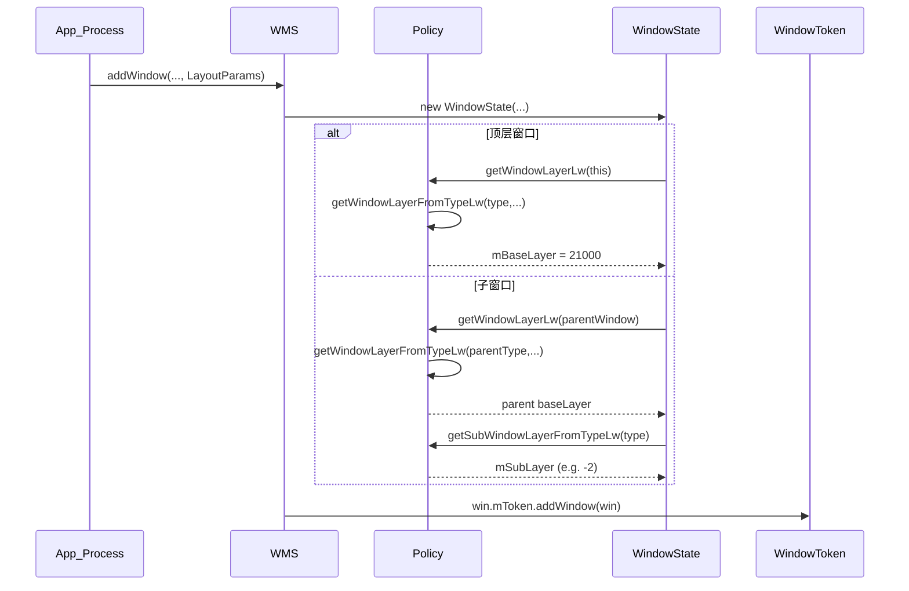

### 2. WindowContainer 树的映射与挂载

在 A13 中，所有的窗口管理对象都继承自 `WindowContainer`，形成一棵极其严格的树：
`DisplayContent` -> `TaskDisplayArea` -> `Task` -> `ActivityRecord` -> `WindowState`

1. 先根据 `attrs.token` 调用 `displayContent.getWindowToken(...)` 查找到 `WindowToken`。
2. 若 `rootType` 属于应用窗口，再执行 `token.asActivityRecord()`，此时容器才被收窄为 `ActivityRecord`。
3. 创建 `WindowState`，其构造函数内部完成 `mBaseLayer` / `mSubLayer` 初始化。
4. 调用 `win.mToken.addWindow(win)`，把 `WindowState` 挂到对应的 `WindowToken` / `ActivityRecord` 容器下。

### 3. 阻塞调用与 ANR 风险

在 `mGlobalLock` 的保护下，WMS 会同步调用 `InputManagerService.registerInputChannel` 创建双向 Socket（BitTube），并且同步通过 Binder 呼叫 SF 执行 `createSurface`。如果 SF 的主线程因其他重负载阻塞，导致 `createSurface` IPC 超时，WMS 的锁无法释放，将引发系统级级联 ANR。

**Call Stack (system\_server 进程)**:

```text
[system_server] WMS.addWindow()
→ [system_server] displayContent.getWindowToken(attrs.token) // 先获取 WindowToken
→ [system_server] token.asActivityRecord() // 仅应用窗口场景收窄为 ActivityRecord
→ [system_server] new WindowState() // 构造阶段内计算 mBaseLayer / mSubLayer
→ [system_server] displayPolicy.adjustWindowParamsLw() // 修正参数
→ [system_server] win.openInputChannel() // 通过 InputDispatcher/InputManager 建立输入通道
→ [system_server] WindowState.attach() // 准备与 SF 交互
  → [Binder IPC] SurfaceComposerClient::createSurface()
```

***

## 阶段三：SurfaceFlinger 层图层创建与 BLAST 架构

`/home/liang/Project/MyProject/Summary/summary/4_addWindow_A13.md#L137-137`
WMS 中的 `WindowState` 创建后，必须在 SurfaceFlinger 中创建一个对应的 `Layer`。A13 在这里的行为与之前版本有根本性差异。

**Surface 与 Layer 创建时序**：
在深入图层细节前，必须厘清 Android 中 `Surface` (Java/C++ 端句柄) 与 `Layer` (SF 端真实图层) 的创建先后顺序与依赖关系。

**时序依赖步骤**：

1. **WMS 发起 (Server端)**：`WindowState.attach()` 时，WMS 通过 `SurfaceComposerClient` 发起 Binder 调用 `createSurface`。
2. **SF 响应 (Native端)**：SurfaceFlinger 收到 IPC 请求，在主线程执行 `createLayer`，真正在内存中分配一个 `Layer` 对象（如 `ContainerLayer`），并返回一个代表该 Layer 的 `IBinder` 句柄。
3. **句柄封装 (Native $\rightarrow$ Java)**：WMS 收到句柄后，将其封装为 C++ 的 `SurfaceControl`，再映射到 Java 层的 `SurfaceControl`。
4. **App 获取 (Client端)**：App 在执行 `relayoutWindow` 时，WMS 将这个 `SurfaceControl` 跨进程通过 `outSurfaceControl` 参数回传给 App。此时，App 端的 `Surface` 才真正获得了指向 SF 层 `Layer` 的合法操作权。

**顺序错误引发的异常**：

- **异常场景**：如果 App 在 `relayoutWindow` 成功前（即未拿到 WMS 分发的有效 `SurfaceControl`），就尝试去执行 `lockCanvas` 或挂载 `BLASTBufferQueue`。
- **后果**：会直接触发 `NullPointerException` (Native 对象指针为 0) 或 `IllegalArgumentException` (Surface is not valid)。严重时会引发 Native Crash（`SIGSEGV`），导致整个 App 崩溃。
- **正确调用模板**：
  ```java
  // App 端的标准安全调用范式
  mWindowSession.relayout(..., outSurfaceControl, outSurface, ...);
  if (outSurfaceControl.isValid()) {
      // 此时 SF 端的 Layer 已创建，允许初始化 BLASTBufferQueue
      mBlastBufferQueue = new BLASTBufferQueue("MyBlast", outSurfaceControl, ...);
  }
  ```

### 1. 创建 Layer (`BufferStateLayer`)

- SF 主线程接管，调用 `SurfaceFlinger::createLayer`。
- 根据 A13 的默认策略，创建的对象是 `BufferStateLayer`。
- **没有 BufferQueue 初始化**：`BufferStateLayer` 内部**没有**传统的 `BufferQueueProducer`。它只维护了一系列状态（`mCurrentState` 和 `mDrawingState`），等待接受来自 App 的 `Transaction`。

### 2. BLAST 架构下的 1:N 裂变映射

在 A13 中，映射关系从 1:1 变成了 1:N。

`/home/liang/Project/MyProject/Summary/summary/4_addWindow_A13.md#L149-151`

- WMS 创建的 `WindowState` 对应的 `Layer`，在 SF 中通常是一个没有 Buffer 的 `ContainerLayer`（或空壳 `BufferStateLayer`）作为 Root。
  > **【解释】**：在旧版 Android 中，WMS 创建图层时直接就是一个能装画面的 `BufferQueueLayer`。但在 A13 中，为了将“窗口控制权”和“画面渲染权”解耦，WMS 只负责在 SF 里建一个**空壳（ContainerLayer）**。这个空壳相当于相框，只用来控制大小、位置和 Z-order，它自己是不能塞入任何像素数据的。（相关源码：`SurfaceFlinger::createLayer` 中根据传入的 flag 判断创建 `ContainerLayer`）。
- App 进程的 `BLASTBufferQueue` 初始化时，会通过 IPC 在 SF 的这个 Root Layer 下，**再创建一个子** **`BufferStateLayer`** 用来实际挂载 `GraphicBuffer`。
  > **【解释】**：当 App 进程准备画图时，它会主动在本地 `new BLASTBufferQueue()`。这个构造函数非常聪明，它会背着 WMS，偷偷通过 Binder (`SurfaceComposerClient`) 向 SF 申请再建一个真实的、能装像素的图层（也就是 `BufferStateLayer`）。这个子图层相当于相框里的一张画布。（官方背景：BLAST 架构的核心思想就是把 BufferQueue 从 SF 侧下放到 App 侧，减少跨进程阻塞，提升帧率同步性能）。
- 最后，App 通过 `Transaction.reparent` 将子 Layer 挂载到 WMS 创建的壳子下面。
  > **【解释】**：现在 App 手里有一张“画布”（子图层），而 WMS 在屏幕上挂了一个“相框”（Root 空壳）。App 会利用事务机制（`Transaction`），发送一条 `reparent`（重新认父）的指令给 SF，告诉 SF：“请把我的画布，塞进 WMS 的那个相框里”。至此，1:N 的裂变完成（1 个窗口对应 1 个空壳父图层 + N 个实际渲染子图层）。（调试技巧：通过 `adb shell dumpsys SurfaceFlinger`，你能清晰看到名字带 `Blast` 的子节点挂载在对应的 `Activity` 节点之下）。

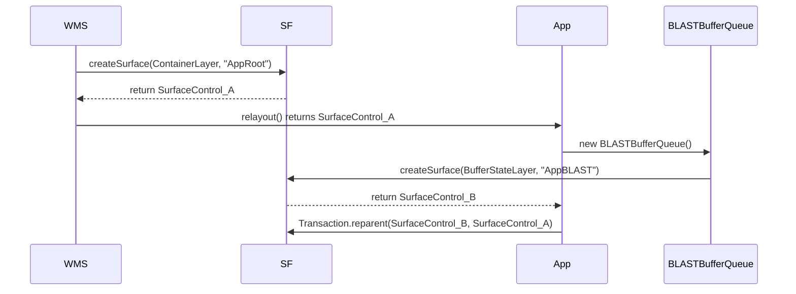

### 3. layerId 分配、引用计数与权限

- **layerId 分配**：SF 内部全局原子递增计数器 `mIdGenerator`，永不复用。
- **引用计数**：C++ `SurfaceControl` 对象内部持有一个 `sp<IBinder> mHandle`。利用 Binder 驱动的内核级引用计数。当 WMS 和 App 两端都不再持有该 Binder 时，SF 中的 `Layer` 对象触发析构函数被销毁。
- **权限校验**：只有具备 `ACCESS_SURFACE_FLINGER` 权限的进程（如 `system_server`）才能任意修改层级；App 只能通过 Transaction 修改自己名下的子节点。

***

## 阶段四：跨进程合成、HWC 交互与 VSYNC-sf 调度

`addWindow` 本身是一个同步注册过程。后续 App 进行 measure/layout/draw，提交图像数据，最后进入 HWC 的合成阶段。

### 1. 脏区域 (Dirty Region) 的布尔运算

为了省电，系统只更新发生变化的区域。

- **App 提交**：A13 BLAST 架构下，App 必须在 `Transaction` 中主动调用 `setSurfaceDamageRegion(Region)`。
- **SF 计算**：SF 侧使用 C++ `Region` 类。它执行矢量化的矩形布尔运算：
  - `Union` (合并)：多个脏区域求并集。
  - `Subtract` (相减)：被完全不透明的顶层窗口遮挡的区域，从底层脏区域中扣除。

### 2. Client Layer 与 Target Buffer (GPU 合成路径)

如果 HWC 拒绝处理某些图层，SF 必须动用 GPU。

- **多对一合并**：多个被标记为 Client 的 Layer，将被合并渲染到一块单一的 `GraphicBuffer` 中（即 Target Buffer）。
- **渲染引擎**：A13 默认使用 `SkiaGLRenderEngine`。合成完成后，SF 将这块 `Target Buffer` 作为一个普通的全屏 Layer 提交给 HWC。

### 3. HWC 交互流水线 (HWC 2.4+)

在 VSYNC-sf 周期中，SF 与 HWC 的交互严格分为以下阶段：

1. **Latching**：锁定 App 提交的 Transaction，提取 Buffer。
2. **Output::prepare**：SF 计算 VisibleRegion 和 DirtyRegion，剔除完全遮挡的 Layer，设置 HWC Layer 属性。
3. **validateDisplay**：SF 询问 HWC，HWC 返回决策结果（Device 硬件合成 或 Client GPU合成）。
4. **presentDisplay**：SF 指示 HWC 执行真实上屏（翻转显存）。
5. **Fence 释放**：HWC 返回 `Release Fence`，SF 将其传回给 App 的 `BLASTBufferQueue` 以便循环利用 Buffer。

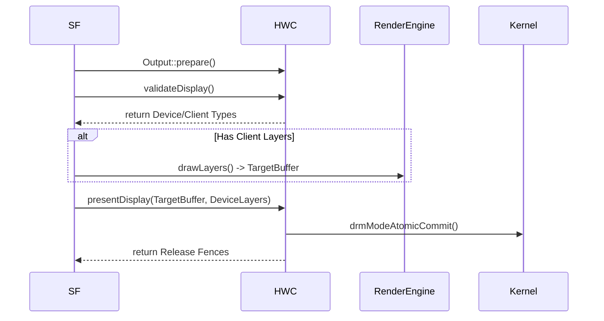

***

## 阶段五：全链路 Binder 交互与时序流转 (Sequence Diagram)

以下是 A13 中从 `addWindow` 到真正画面上屏的完整异步流水线，这也是整个跨进程架构的灵魂流转图：

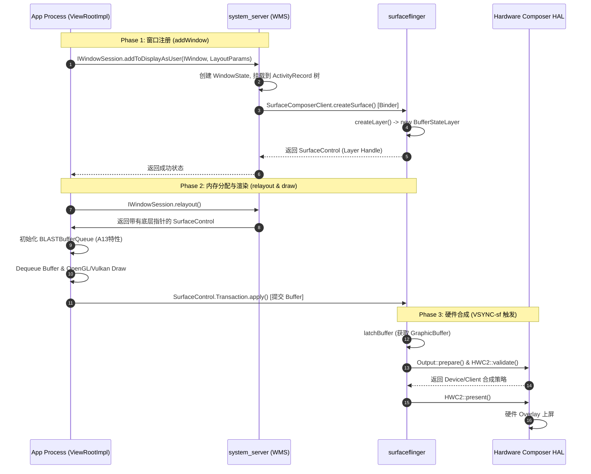

***

## 阶段六：核心数据结构内存拓扑全景图

在 A13 中，WMS 的控制树与 SF 的图层树形成了极其严密的映射关系：

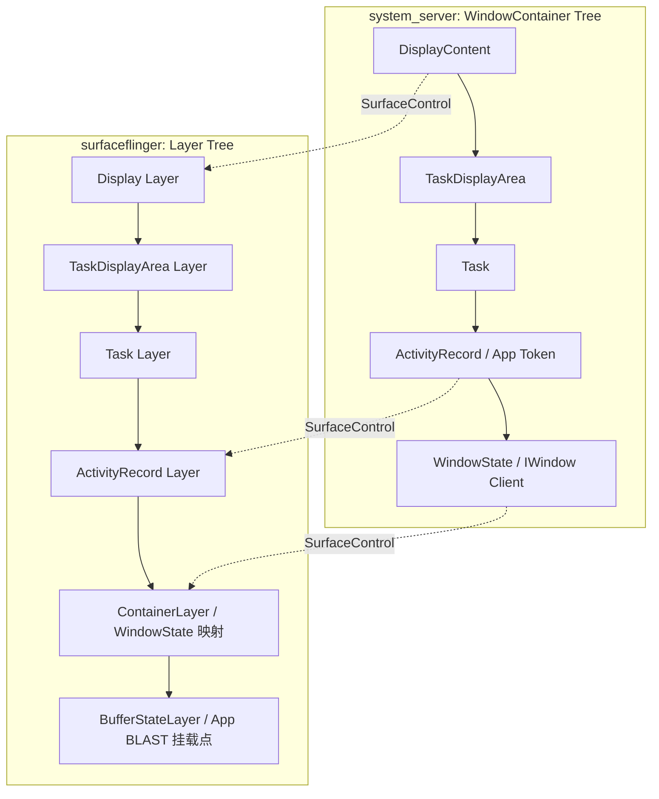

***

## 阶段七：可量化验证方法与诊断工具

作为架构师，必须能够通过系统级命令印证上述所有理论。

| 验证目标              | 调试手段 / 命令                                                                       | 预期观察结果                                                                                      |
| :---------------- | :------------------------------------------------------------------------------ | :------------------------------------------------------------------------------------------ |
| **跨进程 Binder 凭证** | `adb shell dumpsys window windows \| grep -i "mClient="`                        | 显示 `mClient=android.os.BinderProxy@xxxx`                                                    |
| **Z-Order 基础层级**  | `adb shell dumpsys window windows \| grep -E "Window #\|mBaseLayer\|mSubLayer"` | 普通 Activity 的 `mBaseLayer=21000`，视频 SurfaceView `mSubLayer` 为负数                             |
| **WMS 树与句柄**      | `adb shell dumpsys window windows \| grep -E "Window #\|mSurfaceControl"`       | `mSurfaceControl` 指向有效的 Native 句柄                                                           |
| **SF 层 BLAST 嵌套** | `adb shell dumpsys SurfaceFlinger \| grep -A 5 "BufferStateLayer"`              | 观察到没有 BufferQueue 的 `BufferStateLayer`，且 App 层存在 BLAST 后缀的叶子节点挂载关系                          |
| **脏区域计算**         | 开发者选项：开启 `Show surface updates`                                                 | 屏幕上只有变动的区域会闪烁高亮，证明 Dirty Region 扣减生效                                                        |
| **GPU 合成降级**      | `adb shell dumpsys SurfaceFlinger \| grep -A 10 "Display 0 HWC layers:"`        | `Composition Type` 显示为 `Client`，表明 HWC 算力不足降级                                               |
| **持锁耗时与 ANR**     | Perfetto 搜索 `wm_add_window` 或 `relayoutWindow`                                  | 检查 `binder transaction` 时长，关注 `monitor contention with owner ... (WindowManagerGlobalLock)` |
| **渲染与合成时序**       | Perfetto 搜索 `HWC2::present` 和 `RenderEngine::drawLayers`                        | 观察 VSYNC-sf 周期内的调用顺序与耗时                                                                     |

***

**本篇剖析完全立足于 Android 13 核心源码逻辑，相关关键文件路径包括但不限于：**

- WMS 核心：`WindowManagerService.java`, `DisplayPolicy.java`, `ActivityRecord.java`, `WindowState.java`
- App 通信：`IWindow.aidl`, `Session.java`, `ViewRootImpl.java`
- SF 与 BLAST：`SurfaceFlinger.cpp`, `BLASTBufferQueue.cpp`, `android_view_SurfaceControl.cpp`
- 渲染与合成：`HWComposer.cpp`, `SkiaGLRenderEngine.cpp`, `Region.cpp`

***

## 验证清单 (Self-Test Validation Checklist)

为了确保对上述机制的彻底掌握，请在本地环境执行以下 5 条自测用例：

1. **【上下行流向验证】**：在 App 中主动调用 `requestLayout()`，抓取 Systrace/Perfetto，观察 `ViewRootImpl.performTraversals` 到 `Session.relayout` 的调用，确认这是一个**上行 (Uplink)** 阻塞 IPC，并在 `system_server` 中看到 `relayoutWindow` 的执行。
2. **【Token 存在性验证】**：通过 `adb shell dumpsys window windows` 找到任意一个 Activity 窗口，查看其 `mToken` 字段，确认它指向一个有效的 `ActivityRecord`（通常带有所属包名和类名）。
3. **【Z-Order 计算正确性验证】**：打开一个带视频播放的 App（如 Bilibili），执行 `adb shell dumpsys window windows | grep -E "Window #|mBaseLayer|mSubLayer"`。观察普通 Activity 的 `mBaseLayer`（应为 21000），并验证视频 SurfaceView 的 `mSubLayer` 是否为负数（通常为 -2），印证公式推导。
4. **【创建顺序异常复现】**：在 App 源码中，尝试在 `ViewRootImpl.setView` 执行之前，强行 `new BLASTBufferQueue()` 并传入未初始化的 `SurfaceControl`。观察 Logcat，确认是否如预期抛出 `IllegalArgumentException: surface is not valid`。
5. **【BLAST 1:N 映射关系观察】**：打开任意普通 App，执行 `adb shell dumpsys SurfaceFlinger | grep -A 10 "BufferStateLayer"`。找到名称形如 `SurfaceView[包名]...#0` 的空壳图层，并确认其子节点（`Children`）中包含名称带有 `BLAST` 后缀的真正渲染图层。

<br />

