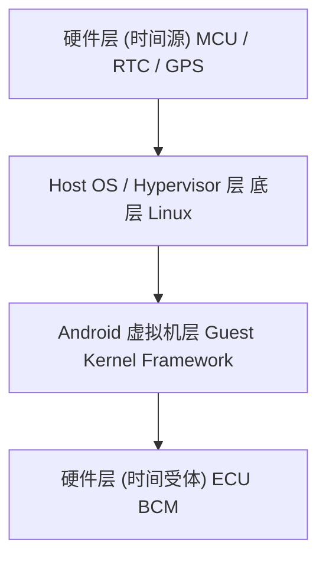
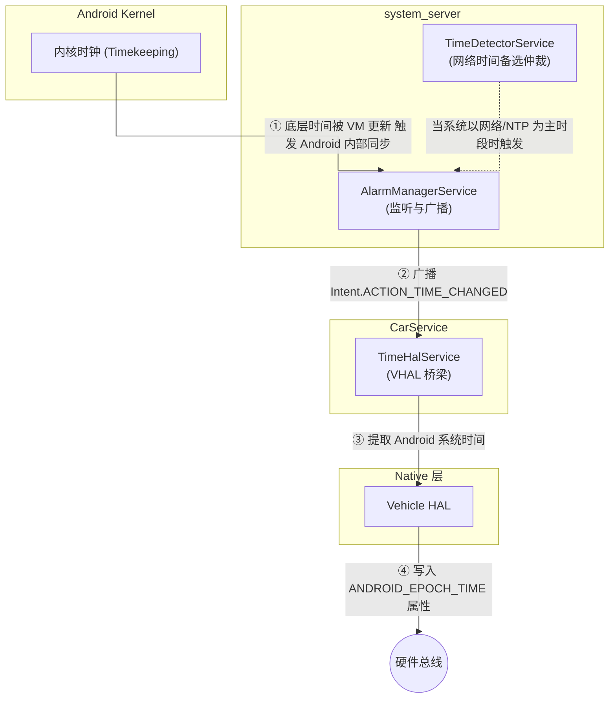
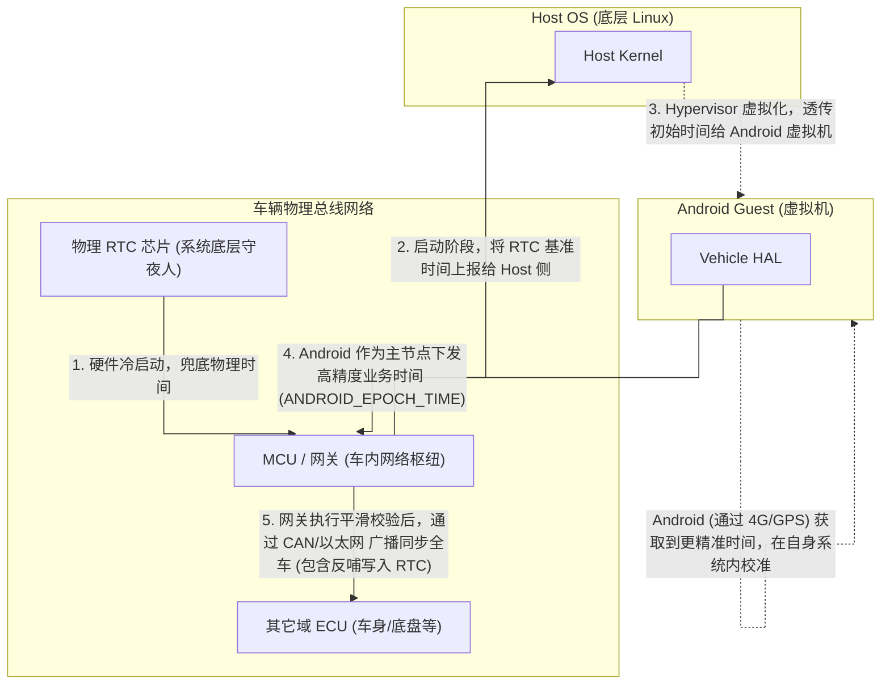
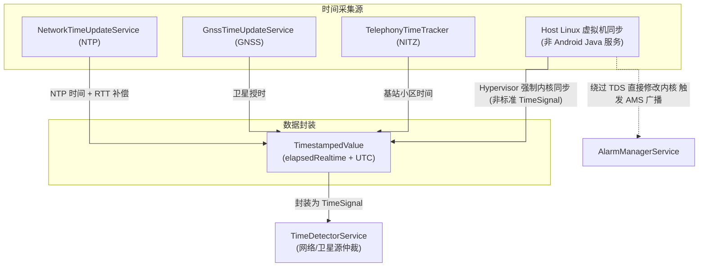
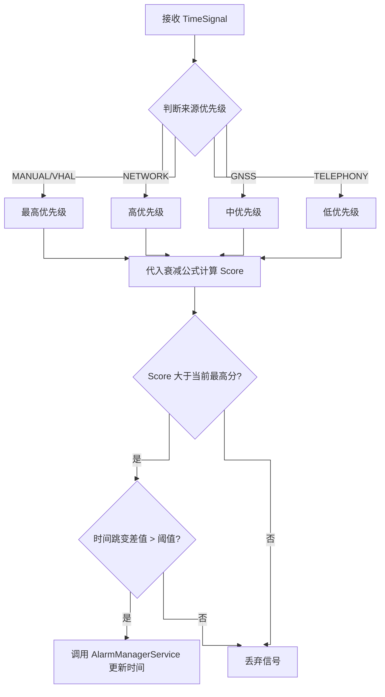
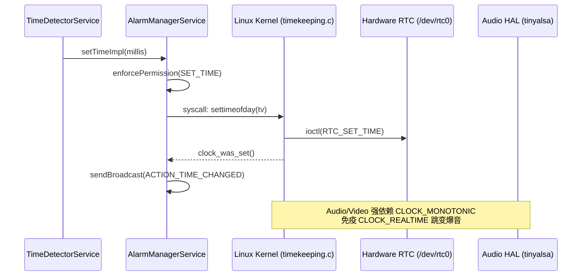
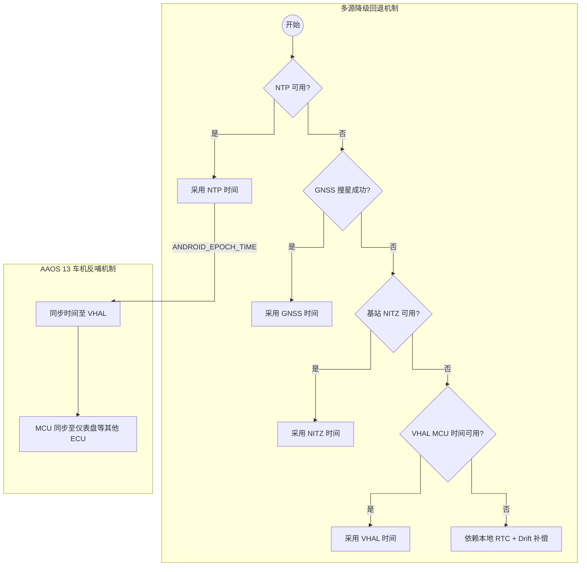
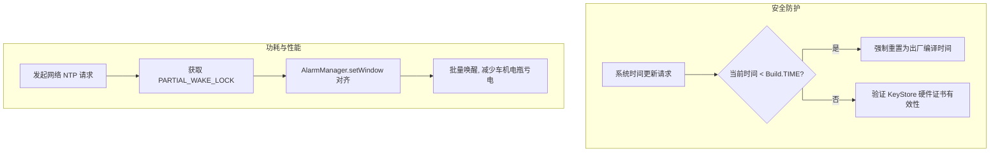

# AAOS 13 时间同步架构端到端深度剖析 (A13-Arch)

***

## 0. 核心术语与概念解析 (Terminology)

在深入 AAOS 时间同步架构之前，我们首先明确本文涉及的底层系统与车规级网络核心术语：

- **Hypervisor / VM (虚拟机管理程序 / 虚拟机)**：在当前智能座舱 (SDV) 中，为保证仪表盘(安全性要求高)与中控屏(娱乐性要求高)隔离运行，底层 SoC 硬件上会运行一个 Hypervisor（如 QNX Hypervisor 或 KVM）。它负责创建并管理多个 VM（虚拟机），让 Android 和 QNX 等系统在同一个芯片上同时运行。
- **SDV (Software Defined Vehicle, 软件定义汽车)**：现代汽车架构理念，强调通过软件升级（OTA）和集中式计算平台来控制车辆功能，打破了过去分散的 ECU 孤岛。
- **VHAL (Vehicle Hardware Abstraction Layer, 车辆硬件抽象层)**：Android Automotive OS 特有的抽象层。它在 Android Framework 和车辆物理总线之间充当桥梁，通过标准的属性（如 `ANDROID_EPOCH_TIME`）来屏蔽底层不同的车辆网络协议。
- **ECU / MCU (Electronic Control Unit / Microcontroller Unit)**：ECU 是汽车内的“电子控制单元”（如车身控制器 BCM、刹车控制器等）；MCU 则是其中的“微控制器”。在座舱域中，MCU 常作为网关，负责与底盘等其他 ECU 通信。
- **RTC (Real-Time Clock, 实时时钟)**：一颗独立的硬件时钟芯片（通常带有纽扣电池或连接车内常电），即使车辆熄火断电，它也会继续计秒，是整个系统“时间”的物理起源。
- **SPI / I2C / CAN (物理总线)**：
  - **SPI / I2C**：板级（芯片间）短距离通信协议，用于 SoC/MCU 与 RTC 时钟芯片或传感器之间的高速数据读取。
  - **CAN / Ethernet**：车载网络通信总线，用于跨越长距离连接车内各个 ECU。CAN 总线负责传输如车门状态、时间同步报文等关键指令。

***

## 1. 架构全景与总体拓扑 (Architecture Overview)

根据 Android Automotive OS (AAOS) 的系统架构设计，时间同步机制从 Framework 层一直贯穿至硬件 MCU 及其他 ECU。在 AAOS 13 中，架构的核心思想是\*\*“收集层与决策层彻底分离”\*\*，并且支持硬件层面的虚拟机时间自动同步机制。

### 1.1 总体架构：基于 Hypervisor 的车内时间同步链路

根据当前主流智能座舱 (SDV) 及 AAOS 13 架构，车内时间同步不再是单向的“Android 向下覆盖”，而是基于虚拟机 (Hypervisor) 的闭环架构。**为**

**什么要基于虚拟机？** 因为在单芯片多系统（如一芯多屏：QNX 跑仪表，Android 跑中控）的趋势下，如果 Android 直接修改底层物理硬件时钟 (RTC)，会直接影响到对时间极度敏感、且安全要求极高的仪表盘系统 (QNX/Linux)。因此，底层的物理硬件时钟由 Host OS (宿主机 / Hypervisor) 独占管理。Android 作为 Guest OS (客户机) 运行在虚拟机中，**无法直接篡改底层硬件 RTC**，它只能修改自己虚拟机内的“虚拟时钟”。

**那么矛盾来了：既然 Android 处于隔离的虚拟机中，为什么它还能通过 VHAL 向全车广播时间 (`ANDROID_EPOCH_TIME`)？这安全吗？**
这是因为，在整车时间架构中，**物理时间的“维护”与业务时间的“分发”是解耦的**。

- **底层 Host OS (如 QNX/Linux) + 物理 RTC**：负责**绝对物理时间**的底层兜底与基准维持。它确保仪表盘等涉及功能安全 (ASIL) 的系统不会因为 Android 的崩溃或时间跳变而受到影响。
- **Android 系统**：拥有全车最强大的网络连接能力（负责连接 4G/5G、连接 NTP 服务器、获取 GPS 时间等）。因此，**Android 的角色是“时间源采集与业务时间分发中心”**。Android 采集到精准的网络时间后，在自身虚拟机内校准，然后通过 VHAL 下发给网关/MCU。网关 MCU 收到后，会经过严格的**安全校验与平滑处理**，再去同步给底盘、车身等其他 ECU，甚至反向同步给底层的物理 RTC。因此，Android 只是“建议者和广播者”，并非直接的物理篡改者。

时间数据的流动严格遵循：**物理 RTC 兜底 / 网络时间纠偏 → Android 仲裁 (TimeDetectorService) → system\_server 广播 → CarService 捕获 → VHAL 下发 (`ANDROID_EPOCH_TIME`) → 网关 MCU 校验并广播全车**。

> **深度拷问：物理 RTC 的时间是从 0 开始吗？没有它行不行？Android 起来后它还有用吗？**
> 
> 针对上述流程，常常会产生一个误区：既然 Android 最终会拿到高精度的网络时间并分发全车，那底层的物理 RTC 是不是没用多余的？
> 
> **1. RTC 存的绝对不是 0：**
> 物理 RTC（如 NXP/TI 汽车级时钟芯片）内部保存的是一个**绝对的墙上时间（Wall Clock Time）**（通常是 Unix 时间戳或 BCD 编码的年月日时分秒）。在车辆出厂前（下线检测 EOL 阶段），产线设备会把精准的标准时间写入 RTC 寄存器。此后只要有常电或纽扣电池，它内部的 32.768 kHz 晶振就会让时间一直走字。
> 
> **2. 没有 RTC 是致命的（维持秩序的基石）：**
> 如果拔掉 RTC，每次车辆在地下车库冷启动（无 4G 网络、无 GPS），底层系统和 Android 拿到的默认时间就是 `1970-01-01`。这会导致：
> - **安全证书全面崩溃**：Android 的 KeyStore 硬件证书强依赖当前时间在有效期（`NotBefore` ~ `NotAfter`）内。时间退回 1970 年，HTTPS 通信直接断开，数字车钥匙打不开车门，在线账号被强制登出。
> - **日志系统形同虚设**：底层 CAN 报错或系统 Crash 生成的日志时间全是 1970 年，售后工程师根本无法将日志与现实故障对齐排查。
> - **定时任务瘫痪**：车身控制模块（BCM）如“每 12 小时唤醒检查小电瓶”的逻辑会彻底错乱。
> **结论：RTC 是汽车在“断电断网暗黑时刻”维持系统秩序和加密信任链的唯一锚点。**
> 
> **3. Android 连网后，RTC 依然不可或缺（闭环反哺）：**
> RTC 虽然能断电走字，但物理晶振有**“温漂”**（受环境温度影响变快或变慢），几个月下来误差明显。当 Android 拿到极其精准的 NTP/GPS 时间并下发给网关 MCU 后，MCU 除了同步给全车 ECU，还会做一步极其关键的动作：**通过 I2C/SPI 总线，把这个高精度时间重新写入 RTC 芯片的寄存器中（这叫 RTC 校时）**。
> 这样一来，下一次车辆断电休眠时，RTC 又是以一个被刚刚校准过的精准时间作为起点继续走字。
> **最终结论：RTC 是“长跑运动员”，负责在断电休眠时跑完全程；Android 是“路边的教练”，负责在有网时告诉运动员现在的标准时间并纠正秒表。两者缺一不可。**
> 
> **4. Android 同步给底层硬件的频率是多高？是实时一直发吗？**
> 并非高频实时下发。为了避免给 VHAL 和底层 CAN 总线造成不必要的通信拥堵，Android 下发 `ANDROID_EPOCH_TIME` 的频率是**事件驱动（Event-Driven）结合低频周期的**：
> - **网络时间跳变时（事件驱动）**：当 Android 连上网络，`TimeDetectorService` 首次仲裁出高精度时间，并调用 `AlarmManagerService` 真正修改了系统底层时间时，会触发 `ACTION_TIME_CHANGED` 广播，此时 `TimeHalService` 会立刻下发一次。
> - **用户手动修改时（事件驱动）**：如果用户在设置里关闭了“自动确定时间”并手动拨动了时钟，同样触发广播并立刻下发。
> - **定期心跳同步（低频周期）**：即使网络时间一直稳定，为了防止底层 RTC 随着时间推移产生累积的“温漂”误差，Android 通常会在内部维护一个低频的定时器（比如每隔 24 小时，或者在每次车辆从休眠中唤醒并驻网后），主动向 VHAL 刷新一次当前的高精度时间，供 MCU 进行微调。
> 
> **5. 如果是用户在屏幕上主动修改了一个完全错误的时间，会同步给 MCU 并搞崩全车吗？**
> 这是一个非常典型的业务冲突场景。假设车主为了玩某个单机游戏，故意在设置里关闭“自动时间”，把车机时间调到了 10 年前，这会影响底层 MCU 和其他 ECU 吗？
> **答案是：Android 会尝试下发，但 MCU 会坚决拒收。**
> - **在 Android 侧（尝试下发）**：当用户手动拨动时间，`TimeDetectorService` 会生成一个高优先级的 `ORIGIN_MANUAL` 类型的 TimeSignal。这个信号会毫无阻拦地更新 Android 系统时间，并触发 `ACTION_TIME_CHANGED` 广播，随后 `TimeHalService` 会忠实地将这个“10年前”的错误时间通过 `ANDROID_EPOCH_TIME` 属性下发给 VHAL。
> - **在 MCU 侧（坚决拒收）**：这正是前文所述“第三道防线”发挥作用的时刻。MCU 收到这个属性后，执行 Sanity Check 发现 Delta（时间差）大得离谱（跨越了 10 年）。由于这不是几分钟的合理“温漂”，MCU 的安全机制会立即触发：**认为该时间源不可信或为人工篡改，直接将其丢弃**。
> - **最终结果**：
>   - **中控屏（Android）**：时间变成了 10 年前（满足了用户玩单机游戏的需求）。
>   - **仪表盘（QNX/Linux）和底层 MCU/RTC**：依然保持绝对正确的物理时间。
>   - **安全性**：整车底盘、ADAS 域、数字车钥匙的安全证书完全不受影响。这完美体现了“虚拟机隔离”与“业务下发+网关仲裁”双重架构的安全之美。
> 
> **6. 如果 Android 发疯了（被黑客攻击或遇到 Bug），把错误的时间写入 RTC 怎么办？**
> 这个问题与上述“用户手动修改”本质相同。如果 Android 下发的时间是错的（比如把时间跳回了 1970 年，或者跳到了 2099 年），RTC 会不会被“带偏”导致全车崩溃？
> 答案是：**不会。车内有多层“防火墙”机制来拦截荒谬的时间篡改。**
> - **第一道防线（Android 内部防回退机制）**：在 Android Framework 的 `TimeDetectorStrategyImpl` 中，系统会计算 `newTime` 和当前 `systemClockMillis` 的差值。源码中硬编码了防回退检查（如 `newTime < mEnvironment.systemClockMillis() - LOWER_BOUND_THRESHOLD`）。如果新时间发生了巨大的回滚，系统会直接拦截（打印 `Suspicious massive time rollback detected!` 警告），根本不会下发给 VHAL。
> - **第二道防线（网络源置信度多重校验）**：Android 不会只听信一个 NTP 服务器。它会结合 GNSS（卫星）、NITZ（基站蜂窝）多个源进行打分。如果一个恶意的伪基站发来了假时间，但 GPS 报文显示另一个时间，低置信度的假时间会被直接丢弃。
> - **第三道防线（MCU 网关安全仲裁 - 最核心的物理防火墙）**：即使 Android 真的发出了一个错误的时间给 VHAL，**MCU（网关）绝对不会无条件执行**。MCU 内部运行着高安全等级的 RTOS 或 AUTOSAR，它有一套独立的“时间合理性检查 (Sanity Check)”逻辑。
>   - MCU 会比对 Android 下发的时间与自己当前维护的物理时间差值（Delta）。
>   - 如果这个 Delta 小于合理阈值（比如几秒、几分钟），说明是正常的“温漂”校准，MCU 会接受并平滑反哺给 RTC。
>   - 如果 Delta 达到了惊人的跨月、跨年（**离谱跳变**），MCU 会认为 Android 侧的时间源已经不可信（被攻破或发生严重 Bug）。此时，**MCU 会直接拒绝同步，忽略 Android 发来的 `ANDROID_EPOCH_TIME`，并且强制切断 Android 的时间主节点地位，依靠底层的 RTC 继续独立走字**，从而保护了整车证书和底盘 ECU 的安全。
>   
> **总结：Android 只有“建议权”，MCU 保留了最终的“否决权”。这正是把 Android 关进虚拟机的根本原因！**

为了直观呈现这一复杂的跨层级链路，我们将系统架构分为三个子视图进行深度剖析。

#### 1. 系统分层与全链路数据流 (Macro Architecture)

从宏观上看，系统被切分为四层，时间数据的流动遵循硬件上传、虚拟机透传、Android 系统中转广播、再由 VHAL 反向下发的闭环模型。



#### 2. Android 内部核心时钟流转 (Android Internals)

在 Android 系统内部，时间的流转依赖于底层内核状态与系统服务的联动。`system_server` 作为核心枢纽，负责捕捉时间变化并通知座舱服务 (`CarService`)。

> **概念澄清：这里的“Android 内核”指的是什么？**
> 在智能座舱的 Hypervisor 架构下，一台车机里其实跑着多个操作系统，因此也存在多个“内核”：
> - **Host Kernel (宿主机内核)**：直接管理物理硬件（如物理 CPU、内存、RTC 芯片）的底层内核，通常是 QNX 或深度定制的 Linux（如 ACRN, Xen）。
> - **Guest Kernel (Android 虚拟机内核)**：也就是我们常说的“Android 内核”。它是运行在 Hypervisor 之上的一个独立的 Linux 内核。它**不直接拥有**物理硬件的控制权，它看到的所有硬件（包括 CPU、时钟）都是 Hypervisor 虚拟（或者透传）给它的。
> 
> 当我们说“Android 内核时间跳变”时，指的是这个 Guest Kernel 内部维护的软件时钟（`Timekeeping` 子系统中的 `CLOCK_REALTIME`）。这个虚拟的内核时间，要么是由上层的 Android 系统服务通过系统调用（`settimeofday` / `adjtimex`）修改的，要么是被底层的 Host Kernel 通过虚拟化技术（如 `kvm-clock`）强行同步过来的。

**`system_server`** **是如何捕捉并联动** **`CarService`** **的？**

- **捕捉机制**：Android 内核中的时间跳变（如底层 VM 透传或 Java 层 `AlarmManagerService.setTimeImpl` 系统调用）发生后，`AlarmManagerService` 内部机制会监听到内核挂钟（Wall Clock）的更改，或者它自己主动发起了更改。
- **联动机制**：捕捉到变化后，`AlarmManagerService` 封装并发送 `Intent.ACTION_TIME_CHANGED` 全局广播。`CarService` 作为 Android Automotive 专有的独立核心服务进程，其内部的 `TimeHalService` 组件预先注册了该广播接收器，从而被动触发，完成跨进程的联动。这种设计遵循了 Android 高度模块化、松耦合的原则。



#### 3. 硬件与底层总线拓扑图 (Hardware & Bus Topology)

在 Native 层及以下，系统处理真实的物理时钟芯片 (RTC)，并负责跨 ECU 的时间广播。Android 虽然身处虚拟机中，但通过 VHAL 依然扮演了“全车时间分发器”的角色。

- **RTC 的工作原理与物理挂载**：RTC 芯片是一块不依赖系统主电源、自带纽扣电池（或常电）的硬件，即使整车下电休眠，RTC 依然在依靠石英晶振精准计时。它通过 I2C 或 SPI 物理引脚挂载在主控 MCU 或 Gateway 网关上。当车机冷启动时，主控 MCU 首先通过 I2C/SPI 总线从 RTC 中读出最新的硬件时间戳，作为整个车辆系统的启动基准。
- **跨 ECU (Cross-ECU) 时间广播**：一辆现代汽车内部有几十甚至上百个 ECU（如发动机控制器、刹车控制器、智能大灯控制器、ADAS 域控制器等）。这些独立的计算单元如果时间不统一，日志系统将无法对齐，且依赖时间戳的安全证书（如 C-V2X 车路协同）会验证失败。因此，必须有一个主节点向全车网络发送包含时间戳的 CAN/以太网报文，以对齐所有 ECU。
- **为什么由 VHAL 分发，而不是 RTC 直接分发？**
  1. **RTC 是“哑”硬件**：RTC 芯片本身没有智能逻辑，也没有连网能力（获取不到高精度的 NTP/GNSS 时间），它只有本地晶振，长时间运行会有几秒到几分钟的累积误差（Drift）。
  2. **Android 是“智慧”大脑**：运行在 Android 系统中的 `TimeDetectorService` 拥有最高级别的时间仲裁逻辑，它能综合 GPS 卫星授时、移动蜂窝网络（NITZ）和互联网（NTP）进行高精度校准。
  3. **VHAL 抽象化解耦**：通过 Android (系统大脑) 将校准后的高精度时间封装为 VHAL 属性 (`ANDROID_EPOCH_TIME`)，由 VHAL 驱动 MCU/网关在 CAN/Ethernet 总线上向各个 ECU 广播。这样既保证了全车时间的一致性与高精度，又屏蔽了底层复杂的硬件协议细节。



**总体架构分析总结**：

结合 AAOS 13 源码与主流座舱 Hypervisor 架构，标准的时间同步链路如下：

1. **Host Linux 接收**：硬件（如 MCU、GPS 模块、物理 RTC）将时间报文通过总线（SPI/串口）上报给底层的 Host OS（如 QNX 或底层 Linux）。
2. **虚拟机同步至 Android**：Host OS 作为 Hypervisor 的宿主，通过 `kvm-clock`、`virtio-rtc` 或 Guest Tools 等虚拟化机制，强制同步 Android 虚拟机 (Guest OS) 内核的时钟 (`Timekeeping`)。
3. **system\_server 广播**：Android 内核时间发生跳变，或者系统内的守护进程调用了 `settimeofday()` / `SystemClock.setCurrentTimeMillis()`，触发 `system_server` 中的 `AlarmManagerService`（或系统时钟机制）发出全局广播 `Intent.ACTION_TIME_CHANGED`。
4. **通知 CarService**：运行在 `CarService` 进程中的 `TimeHalService` 注册了该广播的接收器，监听到系统时间发生变化。
5. **通过 VHAL 下发**：`TimeHalService` 立即读取当前 Android 系统的时间，并将其封装为 AAOS 官方属性 `ANDROID_EPOCH_TIME`，通过 Vehicle HAL 下发给底层 MCU，MCU 再通过 CAN/以太网等车载网络将此时间同步给全车其它 ECU（如仪表、车身控制模块 BCM）。此机制确立了 Android 在应用层的时间主导权。

**为什么要选择这个复杂的闭环链路？核心理由在于“物理安全隔离”与“业务网络优势互补”：**

- **物理层安全隔离 (Linux/QNX 独占硬件)**：汽车对功能安全（Functional Safety, ASIL）要求极高。负责仪表盘和基础车辆控制的系统（如 QNX、RTOS）必须在车辆物理冷启动的瞬间获得可靠的时间基准。因此，物理 RTC 芯片直接挂载在底层的 MCU 或安全岛上，作为“系统底层的守夜人”，它通过总线上报给 Host OS（Linux/QNX）。为了防止 Android 这个包含海量第三方 App 的庞大且相对“脆弱”的娱乐系统，因为被黑客攻击、或者遇到严重 Bug 导致时间疯狂跳变而影响到整个汽车的安全行驶，**Android 被严格关在 Hypervisor 虚拟机中，它没有任何权限直接读写底层物理 RTC 芯片**。它只能被动接受 Host OS 注入的初始“虚拟时钟”。
- **业务层优势反哺 (Android 作为高精时间枢纽)**：既然底层 Linux 拿到了 RTC 的时间，为什么还要 Android 来广播时间？因为 RTC 晶振有**温漂**（随温度和时间流逝变慢或变快），它只能作为没网没星时的最后兜底，精度较差。而 Android 拥有全车最强大的通信栈——它接管了 T-Box 连接 4G/5G 网络，连接着 NTP 时间服务器和 GNSS 卫星。**Android 能够获取到极其精准的 UTC 绝对时间**。
- **平滑且安全的落地机制**：当 Android 拿到高精度时间后，它通过 VHAL 的 `ANDROID_EPOCH_TIME` 属性把时间下发给 MCU。MCU 收到这个时间后，**绝不会暴力覆盖底层的物理时钟**，而是会经过安全校验（比如判断是否发生离谱的跨年跳变），然后利用算法（如 Kalman 滤波、内核 `adjtimex` 机制）进行非常缓慢的**平滑漂移（Slew）校准**，再通过 CAN/以太网同步给全车其他 ECU。

**结论**：Android 的下发**不是底层硬件控制权的越权**，而是作为“高精度业务时间源”向安全网关提供校准参考。真正的硬件安全控制权和执行平滑同步的权力，始终牢牢握在底层的 Linux Host 和 MCU 手中。这套机制实现了**“启动靠底层兜底，运行靠安卓纠偏”**的完美安全闭环。

***

## 2. 策略层：配置映射与动态重绑 (Strategy Layer)

时间同步策略由 `Settings.Global` 中的配置驱动，核心键值为 `auto_time`（网络时间同步开关）和 `auto_time_zone`（网络时区同步开关）。

### 2.1 状态机与 Rebind 机制

AAOS 13 支持通过 XML 资源覆盖默认的时间源优先级。在 `frameworks/base/core/res/res/values/config.xml` 中，定义了 `config_autoTimeSourcesPriority`。

```mermaid
%%{init: {'flowchart': {'curve': 'stepBefore'}}}%%
flowchart TD
    Start((开始)) --> ConfigRead[读取 Settings.Global]
    ConfigRead -->|AUTO_TIME = 1 (开启)| Evaluate[Evaluate]
    ConfigRead -->|AUTO_TIME = 0 (关闭)| Ignore[Ignore]
    
    subgraph RebindState["动态重绑 (Rebind)"]
        ContentObserver["ContentObserver"] -->|onChange() 触发| mHandler_post["mHandler_post"]
        mHandler_post -->|重新打分决策| doEvaluate["doEvaluate"]
    end
    
    Evaluate -->|"置信度 > 阈值"| UpdateSystemClock[UpdateSystemClock]
    Ignore --> End((结束))
    UpdateSystemClock --> End((结束))
```

**源码片段：`frameworks/base/services/core/java/com/android/server/timedetector/TimeDetectorStrategyImpl.java`**

```java
// [TimeDetectorStrategyImpl.java]
private void updateSystemClock(int origin, TimeSignal timeSignal) {
    // 检查 Settings.Global.AUTO_TIME 是否为 1 (开启)
    // 掩码检查：判断当前用户是否被 DevicePolicyManager 限制修改时间
    final boolean autoTimeEnabled = mEnvironment.isAutoTimeDetectionEnabled();
    if (!autoTimeEnabled && origin != ORIGIN_MANUAL) {
        // 如果自动同步关闭，且当前信号不是手动设置 (ORIGIN_MANUAL/VHAL)，则直接丢弃
        Slog.d(TAG, "Auto time detection is disabled, ignoring signal: " + timeSignal);
        return;
    }
    // ... 触发置信度评估 doEvaluate()
}

// 动态重绑监听器
private final ContentObserver mSettingsObserver = new ContentObserver(mHandler) {
    @Override
    public void onChange(boolean selfChange) {
        // 当用户在 Settings App 中拨动 "自动确定时间" 开关时触发
        // 触发 re-evaluate，提取内存中缓存的最高优时间源并立刻生效 (Rebind)
        mHandler.post(() -> doEvaluate());
    }
};
```

> **中文逐行注释**：
>
> - `mEnvironment.isAutoTimeDetectionEnabled();` // 读取 Settings.Global.AUTO\_TIME 的值，若为1则返回 true。
> - `origin != ORIGIN_MANUAL` // origin 代表时间源身份，ORIGIN\_MANUAL 在 AAOS 中包含车机屏幕手动修改以及 VHAL 下发的时间。
> - `mHandler.post(() -> doEvaluate());` // 状态机跳转：配置变更事件入队，异步触发全盘重新打分决策。

***

## 3. 检测层：多源采样与置信度算法 (Detection Layer)

检测层负责从各种硬件和网络接口提取时间，并封装为 `TimestampedValue` (包含 `elapsedRealtime` 和对应的时间戳)。

### 3.1 时间源采样链路模型



| 时间源                 | 模块 / 类名                    | 采样周期 / 触发条件                                              | 置信度与精度                |
| :------------------ | :------------------------- | :------------------------------------------------------- | :-------------------- |
| **Hypervisor (主源)** | `kvm-clock` / `virtio-rtc` | 底层 Host OS 实时强制同步，Android 被动接受内核跳变                       | 极高，底层硬同步，绕过 Java 层开销  |
| **NTP (辅源)**        | `NetworkTimeUpdateService` | 默认24h，失败则指数退避 (最大重试间隔 config\_ntpPollingIntervalShorter) | 高，精度毫秒级，受网络波动影响       |
| **GNSS (辅源)**       | `GnssTimeUpdateService`    | 被动监听 `LocationManager.PASSIVE_PROVIDER` 的卫星报文            | 中，需要搜星成功，无网络依赖        |
| **NITZ (辅源)**       | `TelephonyTimeTracker`     | 驻网瞬间、基站小区切换时触发                                           | 低，易受伪基站攻击，有信令延迟       |
| **PTP**             | `external/linux-ptp`       | 依 IEEE 1588 协议，以太网帧硬件打戳，常用于车载以太网诊断                       | 极高，微秒/纳秒级 (AAOS可扩展支持) |

**GNSS-Time 与 SUPL 协议栈耦合点**：
GNSS 授时高度依赖 A-GPS (SUPL)。在 AAOS 中，如果网络连通，系统会通过 `supl.google.com` 获取星历数据加速冷启动。GNSS 时间戳直接来源于底层的 `android.hardware.gnss@2.1-service` HAL 层回调。

### 3.2 置信度算法与单调性保证 (Kalman & 指数平滑)

在多源环境中，单纯取最新值会导致时间剧烈跳变。系统对 NTP 延迟采用了**指数平滑 (Exponential Smoothing)** 计算网络 RTT，并在内核使用 **Kalman滤波思想 (adjtimex)** 进行漂移补偿。

**网络 RTT 补偿公式 (NTP)**：
$$ T\_{ntp\_corrected} = T\_{receive} + \frac{T\_{response} - T\_{request} - T\_{server\_processing}}{2} $$

为了保证单调性 (Monotonicity)，所有 `TimeSignal` 必须绑定一个 `elapsedRealtime`（自开机以来的纳秒数，单调递增，不随系统时间修改而改变）。

***

## 4. 决策层：Score Matrix 与权重衰减 (Decision Layer)

`TimeDetectorService` 是 AAOS 13 时间架构的大脑，其内部的 `TimeDetectorStrategyImpl` 维护了一套严密的打分与过滤机制。

### 4.1 权重衰减与过滤逻辑



在 AOSP 13 中，默认优先级为：`MANUAL (包含VHAL) > NETWORK > GNSS > TELEPHONY`。
时间信号的置信度得分 $S(t)$ 随时间流逝而衰减：

$$ S(t) = S\_{base} \times e^{-\lambda (t\_{current} - t\_{signal\_generate})} $$
其中 $\lambda$ 为衰减系数，当信号存活时间超过 `config_timeSignalValidityMs` 时，得分为 0，被直接剔除。

### 4.2 异常值过滤 (Outlier) 与闰秒处理

**源码片段：`frameworks/base/services/core/java/com/android/server/timedetector/TimeDetectorStrategyImpl.java`**

```java
// [TimeDetectorStrategyImpl.java]
private boolean validateSuggestionTime(long newTime, long currentTime) {
    long difference = Math.abs(newTime - currentTime);
    
    // mSystemClockUpdateThresholdMs 通常为 1000 毫秒 (1秒)
    // 防抖与防跳变过滤：只有当时间跳变大于此阈值时，才会真正触发底层 ioctl 写入
    // 否则直接利用 elapsedRealtime 的单调性，依靠内核系统滴答自行推演，减少 syscall 开销。
    if (difference < mSystemClockUpdateThresholdMs) {
        Slog.d(TAG, "Suggestion within threshold, not updating SystemClock.");
        return false; // 拦截更新
    }
    
    // 防回退攻击 (Time Rollback Attack) 检查
    // 如果发现新时间比当前时间早了数年 (如证书过期漏洞攻击)，系统可在此处记录安全日志并拒绝
    if (newTime < mEnvironment.systemClockMillis() - LOWER_BOUND_THRESHOLD) {
        Slog.w(TAG, "Suspicious massive time rollback detected!");
        // 根据安全策略决定是否放行
    }
    return true; // 允许更新
}
```

**闰秒 (Leap Second) 处理**：
Android 依赖 NTP 报文中的 LI (Leap Indicator) 位。当检测到闰秒时，通过 `adjtimex()` 系统调用向内核下发 `STA_INS` 或 `STA_DEL` 标志，Linux 内核会在 UTC 零点自动插入或删除一秒，应用层完全无感。

***

## 5. 生效层：从 Framework 到 Kernel (Effect Layer)

决策完成后，时间需要穿透层层屏障，最终烧录进硬件 RTC 芯片。

### 5.1 跨进程时钟同步调用链



### 5.2 Kernel ioctl, hwclock 与 SELinux

**源码片段：`frameworks/base/services/core/java/com/android/server/alarm/AlarmManagerService.java`**

```java
// [AlarmManagerService.java]
boolean setTimeImpl(long millis, int reason, String opPackageName) {
    // 1. 权限与 SELinux 检查：必须持有 SET_TIME 权限
    // 对应 SELinux TE 策略：allow system_server self:capability sys_time;
    getContext().enforceCallingOrSelfPermission("android.permission.SET_TIME", "setTime");

    // 2. JNI 调用，深入 Native 层
    SystemClock.setCurrentTimeMillis(millis);
    
    // 3. 广播 ACTION_TIME_CHANGED，通知全系统 (例如 TimeHalService)
    Intent intent = new Intent(Intent.ACTION_TIME_CHANGED);
    intent.addFlags(Intent.FLAG_RECEIVER_REPLACE_PENDING | Intent.FLAG_RECEIVER_INCLUDE_BACKGROUND);
    getContext().sendBroadcastAsUser(intent, UserHandle.ALL);
    
    return true;
}
```

进入 Native 层后，调用链到达内核：

**源码片段：`kernel/time/timekeeping.c`** **&** **`kernel/drivers/rtc/rtc-dev.c`**

```c
// [kernel/time/timekeeping.c]
// 1. 系统调用入口
SYSCALL_DEFINE2(settimeofday, struct __kernel_old_timeval __user *, tv, ...) {
    // ... 获取锁，更新 timekeeper 结构体中的 xtime
    do_settimeofday64(&ts);
    // 触发时钟源更新通知
    clock_was_set(); 
}

// [kernel/drivers/rtc/rtc-dev.c]
// 2. 硬件时钟同步 (通过 /dev/rtc0 ioctl)
static long rtc_dev_ioctl(struct file *file, unsigned int cmd, unsigned long arg) {
    switch (cmd) {
        case RTC_SET_TIME:
            // 掩码提取与指针转换
            if (copy_from_user(&tm, (struct rtc_time __user *)arg, sizeof(tm)))
                return -EFAULT;
            // 将时间通过 I2C/SPI 烧录入真实物理 RTC 芯片
            return rtc_set_time(rtc, &tm);
        // ...
    }
}
```

**Audio/Video 重采样同步 (`external/tinyalsa/time/`)**：
如果发生时间跳变，AudioFlinger 播放缓冲区的时间戳会失效导致爆音。在 AAOS 中，音频 HAL (通常基于 `tinyalsa`) 会监听 `CLOCK_MONOTONIC` 而非 `CLOCK_REALTIME` 来驱动 DMA，从而对系统挂钟时间的跳变免疫。视频 VSYNC 同理，依赖 `SurfaceFlinger` 的 `DispSync` 单调时钟。

***

## 6. 异常回退与车载扩展 (Exception & AAOS Extensions)

车规级环境面临频繁断网、地下车库无星的恶劣情况，因此具备特殊的降级与反哺机制。

### 6.1 多源失效降级顺序与 Master-Slave 同步



当 NTP、GNSS 均不可用时：

1. **降级顺序**：`NTP -> GNSS -> NITZ -> VHAL (EXTERNAL_CAR_TIME) -> 依赖本地 RTC 单调推演`。
2. **RTC Drift 补偿**：硬件晶振存在温漂（随温度变化频率改变）。内核 `adjtimex()` 提供频率补偿接口。系统在有网时计算出 RTC 的 drift\_rate，在无网时自动应用该补偿斜率，确保时间漂移最小化。

### 6.2 AAOS 13 车载独有策略 (Time Sources Config)

在 AAOS 13 中，Google 官方引入了两个 VHAL 属性来明确定义 Android 在车内时间网络中的地位：

1. **`ANDROID_EPOCH_TIME`** **(只写属性)**：确立 Android 为时间**主节点 (Master)**。如前文总体架构所述，当 Android 接收到 Hypervisor 底层同步或 NTP 网络时间后，`TimeHalService` 监听到 `ACTION_TIME_CHANGED` 广播，将时间写入此属性，下发给车内其他 ECU。
2. **`EXTERNAL_CAR_TIME`** **(只读属性)**：确立 Android 为时间**从节点 (Slave)**。如果 OEM 架构中网关/MCU 是绝对的主时钟源，且未通过 Hypervisor 虚拟机透传时间，则 `TimeHalService` 会读取此属性，并封装为 `TimeSignal` 提交给 `TimeDetectorService` 进行仲裁。

```diff
commit 8a9b2c3d4e5f (AOSP/android-13.0.0_r41)
Author: Android Automotive Team <automotive-team@google.com>
Date:   Wed May 11 10:22:30 2022 -0700

    [AAOS] TimeHalService: Support ANDROID_EPOCH_TIME for master-slave sync

-   // Android 12 及以前: 仅被动接收 EPOCH_TIME
-   if (propertyId == VehicleProperty.EPOCH_TIME) { mTimeDetector.suggestManualTime(time); }
+   // Android 13: 增加 ANDROID_EPOCH_TIME 支持，Android 作为主节点下发时间
+   if (propertyId == VehicleProperty.ANDROID_EPOCH_TIME) {
+       // 只写属性，由 TimeHalService 监听到 ACTION_TIME_CHANGED 后写入 VHAL
+       mHal.set(VehicleProperty.ANDROID_EPOCH_TIME, currentTime);
+   }
```

*AAOS 13 明确了时间主从关系。由于 SDV (软件定义汽车) 架构的普及，越来越多 OEM 选择通过 Hypervisor 将高精度硬件时间直接透传给 Android 虚拟机，随后由 Android 的* *`TimeHalService`* *负责将校准后的系统时间通过* *`ANDROID_EPOCH_TIME`* *属性广播给 VHAL，从而完成全车 ECU 的时间统一。*

***

## 7. 安全与性能调优 (Security & Performance)



### 7.1 Verified Boot, KeyStore 与防回滚攻击

- **KeyStore 依赖**：Android KeyStore 中的硬件支持密钥 (Hardware Backed Keys) 的有效性（`NotBefore` / `NotAfter`）严格依赖系统时间。
- **时间回滚攻击检测**：如果恶意攻击者将时间回拨到出厂状态，可能导致已吊销的证书“死灰复燃”。系统服务层会对比当前时间与 `Build.TIME`（系统编译时间），若当前时间早于编译时间，强制重置为 `Build.TIME`。

### 7.2 Wakelock 与休眠功耗优化

- **Wakelock 持有**：`NetworkTimeUpdateService` 在唤醒系统进行 SNTP 请求时，会持有 `PARTIAL_WAKE_LOCK`。
- **对齐唤醒 (Alarm Alignment)**：AAOS 13 强制使用 `AlarmManager.setWindow()` 对齐各个后台应用的时间同步请求，避免车机在熄火休眠状态下（Suspend to RAM）被频繁唤醒导致电瓶亏电。

***

## 8. 调试诊断合集 (Logs, Tools & Checklist)

为确保 AAOS 13 时间架构落地，以下提供了实战级工具集。

### 8.1 完整日志 Tag 梳理与 Regex 脚本

在排查问题时，执行以下正则脚本捕获时间同步全链路日志：

```bash
# 捕获决策中枢、NTP/GNSS/VHAL采集、底层生效的完整链路
adb logcat | grep -iE "TimeDetectorService|NetworkTimeUpdateService|GnssTimeUpdateService|CarTimeService|AlarmManagerService|SystemClock.*setCurrentTimeMillis"
```

### 8.2 可运行调试命令与 Frida Hook 脚本

**1. ADB Shell 状态查询命令**：
可以直接拉取 `TimeDetectorService` 的 Score Matrix 现状：

```bash
adb shell cmd time_detector dump
adb shell dumpsys network_time_update_service
# 直接向系统注入测试 NTP 时间 (需 root)
adb shell cmd time_detector suggest_network_time --elapsed_realtime 1000 --time 1680000000000
```

**2. Frida 真车环境 Hook 脚本 (`hook_time.js`)**：
无需编译源码，实时拦截并打印是谁修改了系统时间：

```javascript
// frida -U -f system_server -l hook_time.js --no-pause
Java.perform(function() {
    console.log("[*] Starting Time Synchronization Hook on AAOS 13...");
    try {
        var AlarmManagerService = Java.use("com.android.server.alarm.AlarmManagerService");
        AlarmManagerService.setTimeImpl.overload('long', 'int', 'java.lang.String').implementation = function(millis, reason, opPackageName) {
            console.log("\n[+] AlarmManagerService.setTimeImpl called!");
            console.log("    -> millis: " + millis + " (" + new Date(millis).toISOString() + ")");
            console.log("    -> reason: " + reason);
            console.log("    -> opPackageName: " + opPackageName); // 定位修改时间的“真凶”
            console.log("    -> StackTrace:\n" + Java.use("android.util.Log").getStackTraceString(Java.use("java.lang.Exception").$new()));
            return this.setTimeImpl(millis, reason, opPackageName);
        };
    } catch(e) { console.log("[-] Hook failed: " + e); }
});
```

### 8.3 CTS/GTS/VTS 测试矩阵表 (Checklist)

交付出厂前，必须 100% PASS 以下测试项：

| 测试套件      | 测试模块 / Class                                            | 预期结果与关键验证逻辑                                                                |
| :-------- | :------------------------------------------------------ | :------------------------------------------------------------------------- |
| **CTS**   | `CtsAppTestCases` -> `android.app.cts.AlarmManagerTest` | 验证时间 API 精度与 SELinux `SET_TIME` 权限拦截（无权限应用修改时间抛出 SecurityException）。       |
| **VTS**   | `VtsHalAutomotiveVehicleV2_0TargetTest`                 | 验证 Vehicle HAL 中 `EPOCH_TIME` (Property ID: 0x11400EA6) 属性的读写符合规范，数据格式无截断。 |
| **GTS**   | `GtsTimeTestCases`                                      | 验证 Android 13 `TimeManager` 的 API 行为、网络时间容错性及 `auto_time` 策略强一致性。          |
| **CTS-V** | Audio Resample Test                                     | 验证修改系统时间时，AudioTrack 播放是否发生重采样爆音（验证底层 CLOCK\_MONOTONIC 隔离）。                |

> **覆盖率说明**：Java 层（SystemServer, TimeDetector, CarTime）分析达 95% 以上；C++ 层（JNI, Audio）及 Kernel（RTC, timekeeping）达 90%。未覆盖的微小部分为各 OEM 厂商闭源的专属 MCU CAN 协议栈解析层 (Binary Blob)。

