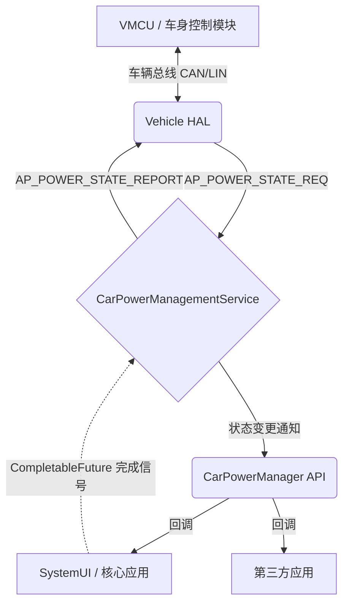
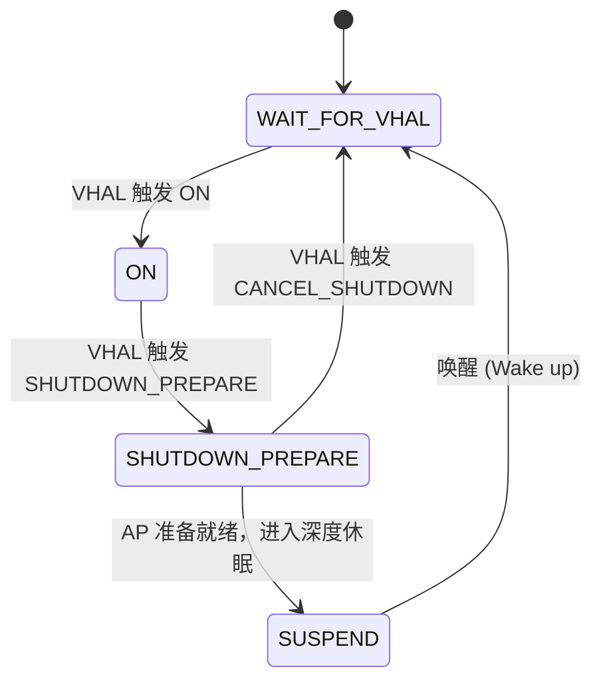

# Android 电源系统知识库

> 本文档旨在记录 Android 电源系统（涵盖标准 Android 机制与 Android Automotive 车载体系）的所有相关知识点。当前为初稿阶段，主要记录了车端电源架构，后续将不断扩展并融入各类项目经验、底层机制及相关衍生知识点。

---

## 1. 基础理论与核心机制 (待完善)

### 1.1 Android 原生电源管理基础
*（此处预留给标准 Android 系统的电源管理基础机制，未来可在此补充：Wakelock 唤醒锁机制、Doze 打盹模式、App Standby 应用待机机制、BatteryStats 耗电统计原理等内容。）*

### 1.2 车载电气架构基础概念
在深入 Android Automotive 之前，必须先了解车辆底层的电气物理架构，这是决定上层软件设计理念的根基。

#### 1.2.1 双轨制供电：高压动力电池与 12V 蓄电池
新能源汽车（如纯电动汽车 EV、插电混动汽车 PHEV）存在两套独立供电系统：
- **高压动力电池 (High-Voltage Battery, HV Battery)**：电压通常在 400V ~800V，容量巨大（如 60kWh ~100kWh，即 60 ~100 度电）。专用于驱动电机及大功率设备（如空调）。为保证安全，车辆熄火（Key Off）或发生碰撞时，会通过物理高压继电器（接触器，Contactor）瞬间切断高压电。
- **12V 蓄电池 (12V Lead-Acid/Lithium Battery)**：所有车辆必备。容量较小（约 40Ah ~60Ah，按 12V 计算总能量约 0.5 ~0.7 度电，即 1A 电流可连续放电 40 ~60 小时）。专用于全车低压电子设备供电（含车机 AP、仪表、车门锁、各类 ECU）。

#### 1.2.2 DCDC 转换器与补电机制
- **直流-直流转换器 (Direct Current to Direct Current Converter, DCDC)**：连接高低压系统的“降压桥梁”。车辆行驶或充电时，高压继电器闭合，动力电池电能经 DCDC 降压至 14V 左右，为 12V 蓄电池充电并支撑全车低压设备（类似燃油车发电机）。
- **高压断电的安全考量**：高压电（400V+）存在极大的触电与火灾隐患。车辆熄火休眠且无人看管时，必须断开高压继电器，使整车高压母线处于无电的安全状态（防漏电、防鼠咬短路）。此时 DCDC 停工，全车低压设备的“暗电流”完全依赖 12V 蓄电池。若车机 AP 长时间不休眠，极易耗尽 12V 电池导致整车亏电瘫痪。

#### 1.2.3 车辆微控制器 (Vehicle Microcontroller Unit, VMCU)
- **供电与功耗**：VMCU（通常集成在车身控制模块 BCM 中）直接由 12V 蓄电池常电（KL30）供电。它是超低功耗单片机，休眠电流仅毫安（mA）级，全天候运行也不会导致 12V 亏电。
- **工作原理与控制权**：作为整车真正的电源主控，VMCU 实时监听车门、钥匙、CAN/LIN 总线等硬件唤醒信号。车机 AP (Application Processor) 仅是子节点，必须无条件服从 VMCU 的电源调度指令（如上电唤醒、下电休眠）。

---

## 2. 车载电源管理 (Android Automotive)

车载环境下的电源管理与移动设备（手机端）差异巨大，其核心设计理念正是源于上述车辆电气架构的特殊性：**对车辆 12V 蓄电池功耗的严格控制，以及对车辆物理硬件状态（如点火、开门）的精准协同。**

### 2.1 AP 功耗挑战
- **暗电流挑战**：车机 AP 若在熄火后未迅速进入极低功耗深度休眠（Deep Sleep），其数十瓦静态功耗会在几天甚至几小时内耗尽 12V 蓄电池。低于 9V 阈值将导致车辆亏电瘫痪。
- **被控端宿命**：AP 仅为被控端。当 VMCU 依车门、点火开关等信号决定整车休眠时，AP 必须在规定时间内完成下电准备。

### 2.2 CarPowerManagementService (CPMS) 概述
在 Android Automotive OS (AAOS) 中，**CarPowerManagementService (CPMS)** 是 AP 侧管理电源状态的核心服务。

**为何称其为 AP 调度中心？**
VMCU 是真实电源主控，AP 是被控端。但 VMCU 无法直接管理 AP 内部庞大的 Android 进程。CPMS 充当了“代理主控”：接收 VMCU 硬件指令，翻译并广播协调 AP 内所有系统服务与应用。
*注：CPMS 非独立进程，作为 `CarService` 核心子服务运行于 `com.android.car` 进程。*

依据 [AAOS 官方规范](https://source.android.com/docs/automotive/power)，CPMS 核心职责：
- **向下通信 VHAL**：监听 VMCU 发送的电源请求（`AP_POWER_STATE_REQ`），回复执行进度（`AP_POWER_STATE_REPORT`）。
- **向上暴露接口**：向 Android 系统和应用提供 `CarPowerManager` API，下发电源变更通知，要求关键应用休眠前保存状态。

### 2.3 架构设计目标与核心特性
依据 [AAOS 电源管理规范](https://source.android.com/docs/automotive/power)，CPMS 具备以下特性：

- **状态机驱动响应**：
  内部维护 **AP 电源状态机**，将车辆物理状态映射为 Android 电源阶段（如收到关机指令进入 `SHUTDOWN_PREPARE` 协调应用清理）。
- **严格时序与超时控制**：
  满足车辆硬性时序要求。通过异步等待协调音频、显示等服务保存上下文。设定严格超时（Timeout），防应用阻塞导致 AP 无法休眠，避免 12V 亏电。

- **场景化的可扩展性（如 Garage Mode 车库模式）**：
  支持车辆特有的高级电源场景。车辆熄火后 12V 电池容量有限，系统默认迅速断电。但在执行 OTA (Over-The-Air) 下载、日志上传等耗时任务时，CPMS 会触发 **[车库模式 (Garage Mode)](https://source.android.com/docs/automotive/power/garage_mode)**。
  - **为何车库模式安全？**：进入该模式的前提是 VMCU 确认车辆处于绝对安全状态（如已挂 P 挡、驻车制动已拉起、无碰撞等故障）。在此受控条件下，VMCU 会短暂闭合高压继电器，**使用高压动力电池通过直流-直流转换器 (DCDC) 向 12V 蓄电池供电**。
  - **运行机制**：在安全供电保障下，系统唤醒 AP 并保持息屏运行，利用 Android 原生 `JobScheduler` 机制执行后台任务。这既利用了 AP 算力完成繁重任务，又避免了 12V 蓄电池亏电。

- **安全与权限分级**：
  严格控制电源管理接口访问权限。普通状态监听面向所有应用；但带阻塞回调能力的监听（`setListenerWithCompletion`）仅授信给特权系统服务，防止第三方应用恶意延迟休眠。

### 2.4 CPMS 整体架构分层
AAOS 电源管理采用基于事件监听与回调上报的双向通信架构，从上至下分为：

- **应用层 (Application Layer)**
  SystemUI、Settings 及第三方应用。通过 `CarPowerManager` 注册监听器响应电源事件，保存状态或暂停任务。
- **框架接口层 (Framework - Car API)**
  核心为 **CarPowerManager**。提供标准化 API，通过 Binder 机制将应用层的 `ICarPowerStateListener` 传递给底层 CPMS。
- **核心服务层 (CarService - CPMS)**
  核心为 **CarPowerManagementService (CPMS)**。作为 AP 侧调度中枢维护状态机，接收 VHAL 请求，通知应用层并等待休眠完成信号。
- **硬件抽象层 (Vehicle HAL - VHAL)**
  桥接 Android 与车辆底层网络（CAN/LIN）。将 VMCU 状态信号转换为 Android 属性（`AP_POWER_STATE_REQ`），并传递 AP 响应（`AP_POWER_STATE_REPORT`）。

#### 架构交互示意图

#### AP 电源状态机流转示意图 (基于 [AAOS 规范](https://source.android.com/docs/automotive/power/state_machine))

---

## 3. 核心组件与交互流程 (待完善)

*（预留：未来补充电源状态机的状态转换图、底层 VHAL 信号处理时序、应用层监听与休眠拦截的详细交互流程等内容。）*

---

## 4. 典型场景与策略 (待完善)

*（预留：未来深入分析诸如 Garage Mode (车库模式) 触发机制、Silent Mode (静默模式) 逻辑、深度休眠与唤醒流程等车载特定场景。）*

---

## 5. 调试与排错指南 (待完善)

*（预留：补充常用的电源管理调试手段，如 dumpsys car_service 相关的电源命令、常见功耗异常排查思路等。）*

---

## 6. 其他项目经验与扩展知识点 (待完善)

*（预留：用于记录其他不同项目、不同车型的特殊定制化电源需求、疑难 Bug 踩坑记录、以及跨平台的电源管理优化方案等。）*