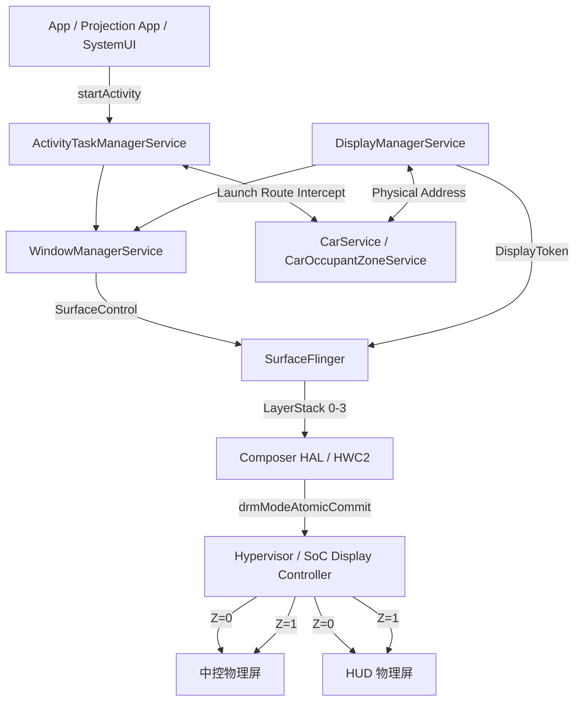
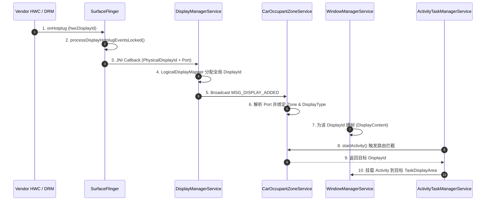

# AAOS 13 多物理屏 × 多逻辑 Display 重叠送显全链路架构解析

> **Author**: Android 13 Archaeologist (A13-Arch)
> **Target Version**: Android 13 (Tiramisu, API 33) / `android13-platform-release`
> **Architecture Focus**: 双物理屏 × 双逻辑 Display = 四个 Display 实例（固定 Z 序同坐标重叠送显）

***

## ⚙️ 1. Terminology & Concept Matrix (核心术语与概念矩阵)

| Term                      | Definition                                 | System Layer       | Ownership/Dependency                                       | Pitfall / Edge Case                                         |
| :------------------------ | :----------------------------------------- | :----------------- | :--------------------------------------------------------- | :---------------------------------------------------------- |
| <br />                    | 由 64 位整数构成的显示器标识，低 8 位编码了物理端口 (Port)       | Native / Framework | 由 `SurfaceFlinger` 解析并透传给 `DisplayManagerService`          | AAOS 强依赖 Port 来区分屏幕类型，若 HWC 上报缺失 Port，将导致车机乘员区分配失败          |
| `LayerStack`              | 决定 Layer 渲染可见性的标识符                         | Native             | Owned by `SurfaceFlinger`, consumed by `CompositionEngine` | 如果两个 Display 被分配了同一个 LayerStack，会导致内容镜像 (Mirroring)         |
| `CarOccupantZoneService`  | AAOS 独有，管理乘员区 (Zone) 与屏幕 (DisplayType) 的映射 | App / CarService   | Consumed by `CarLaunchParamsModifier`                      | 多屏系统中若 `display_settings.xml` 配置错误，会导致默认屏幕 ID 分配错乱          |
| `CarLaunchParamsModifier` | AAOS 独有，拦截 Activity 启动并强制覆盖目标 `DisplayId`  | Framework          | Inject to `ActivityTaskManagerService` (ATMS)              | `RESULT_SKIP` 或 `INVALID_DISPLAY` 时会回退到默认路由，可能导致投屏应用意外出现在底屏 |

***

## 🏗️ 2. Architectural Topography & System Position (架构拓扑与系统占位)

### 2.1 垂直切片模型 (Vertical Slice Model)

在本架构中，系统**不会**在 Framework 层进行上下画面的合成，而是将 4 个独立的 Display 流水线直通到底层。



### 2.2 核心并发与锁模型 (Concurrency & Locks)

- **`WindowManagerGlobalLock`** **(`mGlobalLock`)**: 保护 WMS/ATMS 中的 `DisplayContent` 树。
- **`mStateLock`** **(SurfaceFlinger)**: 保护 `mDisplays` 和 `mCurrentState`，在处理 HWC Hotplug 事件时极易引发卡顿 (ANR)。

***

## 🔄 3. State Machine & Lifecycle (状态机与生命周期流转)



***

## 🕵️ 4. Traceability: 全链路源码追踪 (Boot to Frame)

以下将从 Android 13 源码的最底层出发，沿着系统启动的时序，一步步解析这 4 个 Display 是如何被系统识别、隔离并最终送显的。

### 阶段一：Kernel & HAL 硬件感知与上报 (The Genesis)

**设计意图**：底层驱动通过解析 Device Tree (DTS)，将物理硬件抽象为 4 个 CRTC 通道，HWC 负责将其上报给 Framework。在 AAOS 中，`hwcDisplayId` 必须隐含物理端口信息。

**全链路调用栈**：

```text
[Vendor DRM] drmModeGetResources()
→ [Vendor HWC HAL] ComposerCallback::onHotplug()
  → [JNI] android_hardware_graphics_composer_V2_1_hal::onHotplug()
```

### 阶段二：SurfaceFlinger 物理端口绑定与渲染栈隔离 (Native Layer)

**设计意图**：SF 接收到 Hotplug 事件后，不仅要创建 `DisplayDevice`，更要提取出 AAOS 极为关键的 **Port**（物理端口号），并为这 4 个 Display 分配绝对隔离的 `LayerStack`。

**全链路调用栈**：

```text
[SurfaceFlinger] SurfaceFlinger::onComposerHalHotplug()
→ [SurfaceFlinger] SurfaceFlinger::processDisplayHotplugEventsLocked()
→ [SurfaceFlinger] SurfaceFlinger::processDisplayAdded()
→ [SurfaceFlinger] SurfaceFlinger::setupNewDisplayDeviceInternal()
```

**A13 核心源码剖析** (`frameworks/native/services/surfaceflinger/SurfaceFlinger.cpp`)：

```cpp
void SurfaceFlinger::processDisplayHotplugEventsLocked() {
    for (const auto& event : mPendingHotplugEvents) {
        if (event.connection == hal::Connection::CONNECTED) {
            // 【核心 A13 特性】将 hwcDisplayId 转换为 PhysicalDisplayId，其中低 8 位为 Port
            const auto displayId = hal::PhysicalDisplayId::tryCast(event.hwcDisplayId);
            
            DisplayDeviceState state;
            state.physical = {.id = *displayId, .hwcDisplayId = event.hwcDisplayId};
            state.isSecure = true; // 默认支持受保护内容
            mCurrentState.displays.add(state.token, state);
        }
    }
}

void SurfaceFlinger::setupNewDisplayDeviceInternal(const wp<IBinder>& displayToken, ...) {
    // ...
    // 【架构隔离点】为 4 个 Display 分配相互独立的 LayerStack，确保它们的内容互不干扰
    display->setLayerStack(state.layerStack);
    mDisplays.emplace(displayToken, display);
}
```

### 阶段三：DMS 物理地址解析与逻辑屏映射 (Framework Layer)

**设计意图**：Java 层 DMS 拦截 SF 上报的物理屏信息，将 64 位的 `PhysicalDisplayId` 解析为具体的 `DisplayAddress.Physical`，并赋予全局唯一的逻辑 `DisplayId`（如 0, 1, 2, 3）。

**全链路调用栈**：

```text
[SurfaceFlinger] JNI: android_server_display_DisplayAdapter_nativeGetPhysicalDisplayIds()
→ [DMS] LocalDisplayAdapter::tryConnectDisplayLocked()
→ [DMS] LogicalDisplayMapper::onDisplayDeviceEventLocked()
→ [DMS] DisplayManagerService::handleDisplayDeviceAdded()
```

**A13 核心源码剖析** (`frameworks/base/services/core/java/com/android/server/display/LocalDisplayAdapter.java`)：

```java
private void tryConnectDisplayLocked(long physicalDisplayId) {
    IBinder displayToken = SurfaceControl.getPhysicalDisplayToken(physicalDisplayId);
    SurfaceControl.StaticDisplayInfo staticInfo = SurfaceControl.getStaticDisplayInfo(displayToken);
    
    // 【核心解码】从 physicalDisplayId 中解码出 Port，后续 CarService 全靠它认屏幕
    final DisplayAddress.Physical address = DisplayAddress.fromPhysicalDisplayId(physicalDisplayId);
    
    LocalDisplayDevice device = new LocalDisplayDevice(displayToken, physicalDisplayId, staticInfo, address, ...);
    mDevices.put(physicalDisplayId, device);
    sendDisplayDeviceEventLocked(device, DISPLAY_DEVICE_EVENT_ADDED);
}
```

### 阶段四：AAOS 车载核心业务映射 (CarOccupantZoneService)

**设计意图**：普通 Android 不关心屏幕是用来干嘛的，但 AAOS 必须区分屏幕的业务角色。`CarOccupantZoneService` 通过 `Port` 将这 4 个无语义的 DisplayId 绑定到特定的乘员区和类型。

**全链路调用栈**：

```text
[DMS] DisplayManagerService::sendDisplayEventLocked()
→ [App] DisplayManager.DisplayListener::onDisplayAdded()
→ [CarService] CarOccupantZoneService::handleDisplayAdded()
→ [CarService] CarOccupantZoneService::assignDisplayToZoneLocked()
```

**A13 核心源码剖析** (`packages/services/Car/service/src/com/android/car/CarOccupantZoneService.java`)：

```java
private void handleDisplayAdded(int displayId) {
    synchronized (mLock) {
        Display display = mDisplayManager.getDisplay(displayId);
        if (display == null) return;
        
        DisplayAddress address = display.getAddress();
        if (address instanceof DisplayAddress.Physical) {
            // 提取物理端口号
            int port = ((DisplayAddress.Physical) address).getPort();
            
            // 【架构路由基石】根据配置 (display_settings.xml 或硬编码) 映射业务
            // Port 0 -> TYPE_MAIN (中控底屏)
            // Port 1 -> TYPE_AUXILIARY (中控投屏层)
            // Port 2 -> TYPE_HUD (HUD 底屏)
            // Port 3 -> TYPE_INSTRUMENT_CLUSTER (HUD 投屏层)
            assignDisplayToZoneLocked(displayId, port);
        }
    }
}
```

### 阶段五：ATMS 屏幕启动路由接管 (CarLaunchParamsModifier)

**设计意图**：必须保证“手机投屏应用”严格在 `Display 1` 启动，“驻车桌面”严格在 `Display 0` 启动，防止跨层污染。AAOS 通过 `CarLaunchParamsModifier` 拦截 ATMS 的建栈请求。

**全链路调用栈**：

```text
[App] ContextImpl::startActivity()
→ [ATMS] ActivityStarter::execute()
→ [ATMS] TaskLaunchParamsModifier::onCalculate()
→ [CarService] CarLaunchParamsModifier::onCalculate()
→ [ATMS] ActivityRecord::getDisplayArea()
```

**A13 核心源码剖析** (`frameworks/opt/car/services/src/com/android/server/wm/CarLaunchParamsModifier.java`)：

```java
@Override
public int onCalculate(Task task, ActivityInfo.WindowLayout layout,
        ActivityRecord activity, ActivityRecord source,
        ActivityOptions options, ActivityStarter.Request request, int phase,
        LaunchParamsController.LaunchParams currentParams,
        LaunchParamsController.LaunchParams outParams) {

    int requestedDisplayId = getLaunchDisplayId(options, source);
    
    // 询问 AAOS 权限系统：该应用是否允许在此屏幕启动？
    // 如果是投屏应用请求在 Display 0 启动，这里会被强制纠正为 Display 1
    int allowedDisplayId = mUpdatable.calculateAllowedDisplayId(activity, requestedDisplayId);
    
    if (allowedDisplayId != INVALID_DISPLAY) {
        // 【核心拦截】强制修改输出参数，将其挂载到指定 DisplayId 的 TaskDisplayArea 树下
        outParams.mPreferredTaskDisplayArea = mAtm.mRootWindowContainer
                .getDisplayContent(allowedDisplayId).getDefaultTaskDisplayArea();
        return RESULT_DONE;
    }
    
    return RESULT_SKIP;
}
```

### 阶段六：SF 独立渲染与 Hypervisor 零拷贝物理重叠 (Composite & Mixer)

**设计意图**：WMS 构建了 4 棵独立的窗口树（`DisplayContent`），`SurfaceFlinger` 就会拥有 4 个独立的 `LayerStack`，并为它们分别计算可见性与图层混合，互不干涉。最终的上下层“透明与叠加”，交给位于内核/硬件层面的 Display Controller。

**全链路调用栈**：

```text
[SurfaceFlinger] MessageQueue::Handler::dispatchFrame()
→ [SurfaceFlinger] SurfaceFlinger::onMessageInvalidate()
→ [SurfaceFlinger] SurfaceFlinger::composite()
→ [CompositionEngine] CompositionEngine::present()
→ [HWC] HWComposer::presentAndGetReleaseFences()
→ [Hypervisor] Display Controller Hardware Mixer (Z-order blend)
```

**A13 核心源码剖析** (`frameworks/native/services/surfaceflinger/SurfaceFlinger.cpp`)：

```cpp
void SurfaceFlinger::composite(nsecs_t frameTime, int64_t vsyncId) {
    // 遍历当前 4 个活跃的 DisplayDevice
    for (const auto& [token, displayDevice] : mDisplays) {
        // 核心点：由于各 Display 的 LayerStack 不同，CompositionEngine 
        // 只会抽取属于当前屏幕的 Layer 进行合成。
        displayDevice->getCompositionDisplay()->present(mCompositionEngine);
    }
}
```

**硬件层面的固定 Z 序混合（概念 DTS 节点）**：

```dts
display-subsystem {
    center_panel: connector@0 {
        compatible = "vendor,panel-center";
        crtcs = <&crtc0, &crtc1>; // 绑定 Display 0 和 Display 1
        z-order = <&crtc0 0>, <&crtc1 1>; // 硬件层强制：Display 1 永远覆盖 Display 0
    };
};
```

***

## 🚀 5. Performance Constraints & A13 Design Considerations (性能约束与设计考量)

### 5.1 VSYNC 同步与撕裂 (Tearing) 风险

在 Android 13 的 BLASTBufferQueue 架构下，由于 4 个 Display 在 Framework 层是独立的，若底层的 `Display 0` 和 `Display 1` 共享同一个物理屏幕面板，**必须保证它们的 VSYNC-App 和 VSYNC-SF 是绝对对齐的**。如果 EventThread 分发给这两个 Display 的 VSYNC 存在相位差，硬件 Mixer 叠加时就会出现上半部分是上一帧、下半部分是下一帧的画面撕裂。

### 5.2 CarSystemUI 多屏弹窗代理机制

下层 `Display 0` 的系统级警告（如“胎压过低”弹窗）如果不加处理，会被上层 `Display 1` 的不透明内容完全遮挡。
在 AAOS 13 中，`CarSystemUIFactory.java` 会在启动时通过 `setupSecondaryDisplayUI(display)` 为所有辅助屏幕（如 Display 1/3）注入 SystemUI 的宿主 Window。底层业务需要弹窗时，通过跨进程通信通知 SystemUI，由 SystemUI 将弹窗绘制在最高层（Display 1/3）的代理 Window 中。

### 5.3 Vehicle HAL 场景联动控制

通过 `VehicleHal.java` 监听 `PERF_VEHICLE_SPEED` 或 `GEAR_SELECTION`：

- **行车态**：通知 `CarActivityService`，强行将 `Display 1` (中控投屏层) 上的视频类应用栈压入后台，甚至控制该 `Display` 进入省电模式。
- **驻车态**：恢复 `Display 1` 焦点，允许满帧渲染。

***

## 📚 6. References & A13 Source Paths

- **WMS/ATMS Routing**: `frameworks/opt/car/services/src/com/android/server/wm/CarLaunchParamsModifier.java`
- **Car Zone Mapping**: `packages/services/Car/service/src/com/android/car/CarOccupantZoneService.java`
- **SurfaceFlinger Core**: `frameworks/native/services/surfaceflinger/SurfaceFlinger.cpp`
- **Display Adapter**: `frameworks/base/services/core/java/com/android/server/display/LocalDisplayAdapter.java`

